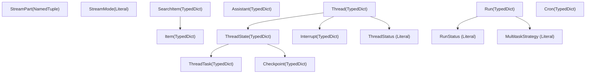
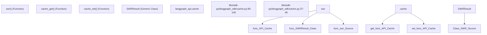

# 数据模型与模式

相关源文件

-   [libs/sdk-py/langgraph_sdk/__init__.py](https://github.com/langchain-ai/langgraph/blob/1fd51e8f/libs/sdk-py/langgraph_sdk/__init__.py)
-   [libs/sdk-py/langgraph_sdk/cache.py](https://github.com/langchain-ai/langgraph/blob/1fd51e8f/libs/sdk-py/langgraph_sdk/cache.py)
-   [libs/sdk-py/langgraph_sdk/client.py](https://github.com/langchain-ai/langgraph/blob/1fd51e8f/libs/sdk-py/langgraph_sdk/client.py)
-   [libs/sdk-py/langgraph_sdk/schema.py](https://github.com/langchain-ai/langgraph/blob/1fd51e8f/libs/sdk-py/langgraph_sdk/schema.py)
-   [libs/sdk-py/pyproject.toml](https://github.com/langchain-ai/langgraph/blob/1fd51e8f/libs/sdk-py/pyproject.toml)
-   [libs/sdk-py/tests/test_cache.py](https://github.com/langchain-ai/langgraph/blob/1fd51e8f/libs/sdk-py/tests/test_cache.py)
-   [libs/sdk-py/tests/test_crons_client.py](https://github.com/langchain-ai/langgraph/blob/1fd51e8f/libs/sdk-py/tests/test_crons_client.py)

本文档描述 LangGraph SDK 的 schema 模块中的数据模型与类型定义。这些类型定义了客户端与服务器之间的契约，为资源（Assistants、Threads、Runs、Crons）、执行状态、请求/响应以及流式事件提供结构化表示。

关于这些模式在客户端操作中的使用方式，请参见 [Python SDK](/langchain-ai/langgraph/5.1-python-sdk)。关于认证相关类型定义，请参见 [Authentication and Authorization](/langchain-ai/langgraph/5.4-authentication-and-authorization)。

---

## 概览

schema 模块（[libs/sdk-py/langgraph_sdk/schema.py1-659](https://github.com/langchain-ai/langgraph/blob/1fd51e8f/libs/sdk-py/langgraph_sdk/schema.py#L1-L659)）是 LangGraph SDK 客户端与 LangGraph API 服务器之间所有数据结构交换的单一事实来源。它定义了：

-   **资源类型**：如 `Assistant`、`Thread`、`Run`、`Cron` 这类持久实体
-   **图模式类型**：如 `GraphSchema`、`Subgraphs` 这类图结构定义
-   **状态类型**：如 `ThreadState`、`Checkpoint`、`ThreadTask` 这类执行状态表示
-   **请求/响应类型**：如 `RunCreate`、`ThreadUpdateStateResponse`、`RunCreateMetadata` 这类 API 载荷
-   **Store 类型**：如 `Item`、`SearchItem` 这类跨线程记忆结构
-   **流式类型**：如 `StreamPart` 这类实时事件表示
-   **控制流类型**：如 `Command`、`Send` 这类图执行控制
-   **类型别名**：如 `RunStatus`、`StreamMode`、`MultitaskStrategy`、`PruneStrategy`、`BulkCancelRunsStatus` 这类受限值

所有类型都使用 Python 的 `TypedDict`、`NamedTuple` 或类型别名定义，在保持 JSON 序列化兼容性的同时提供静态类型检查。

**来源**: [libs/sdk-py/langgraph_sdk/schema.py1-21](https://github.com/langchain-ai/langgraph/blob/1fd51e8f/libs/sdk-py/langgraph_sdk/schema.py#L1-L21)

---

## 类型系统架构

### 自然语言到代码实体映射

该图将抽象系统概念映射到代码库中对应的 `TypedDict` 或 `Literal` 实现。

```mermaid
flowchart TD
    Concept_Agent["Agent Definition"]
    Concept_Conversation["Conversation Context"]
    Concept_Execution["Active Execution"]
    Concept_Schedule["Recurring Task"]
    Concept_Memory["Long-term Memory"]
    Assistant["Assistant (TypedDict)"]
    Thread["Thread (TypedDict)"]
    Run["Run (TypedDict)"]
    Cron["Cron (TypedDict)"]
    Item["Item (TypedDict)"]
    Assistant_Source["libs/sdk-py/langgraph_sdk/schema.py:236-247"]
    Thread_Source["libs/sdk-py/langgraph_sdk/schema.py:267-284"]
    Run_Source["libs/sdk-py/langgraph_sdk/schema.py:327-346"]
    Cron_Source["libs/sdk-py/langgraph_sdk/schema.py:373-401"]
    Item_Source["libs/sdk-py/langgraph_sdk/schema.py:501-520"]

    Concept --> Agent_Assistant
    Concept --> Conversation_Thread
    Concept --> Execution_Run
    Concept --> Schedule_Cron
    Concept --> Memory_Item
    Assistant --> Assistant_Source
    Thread --> Thread_Source
    Run --> Run_Source
    Cron --> Cron_Source
    Item --> Item_Source
```


**来源**: [libs/sdk-py/langgraph_sdk/schema.py236-520](https://github.com/langchain-ai/langgraph/blob/1fd51e8f/libs/sdk-py/langgraph_sdk/schema.py#L236-L520)

### 内部数据流

下图说明了图执行期间核心数据结构之间的关系。


**来源**: [libs/sdk-py/langgraph_sdk/schema.py23-545](https://github.com/langchain-ai/langgraph/blob/1fd51e8f/libs/sdk-py/langgraph_sdk/schema.py#L23-L545)

---

## 核心资源模型

### Assistant

`Assistant` 类型表示图的带版本配置。它封装要执行的图、运行时配置、静态上下文和元数据。

| 字段 | 类型 | 描述 |
| --- | --- | --- |
| `assistant_id` | `str` | 唯一标识符 |
| `graph_id` | `str` | 图定义引用 |
| `config` | `Config` | 包含 tags 与递归限制的运行时配置 |
| `context` | `Context` | 传递给图的静态上下文 |
| `metadata` | `Json` | 任意元数据字典 |
| `version` | `int` | 自动递增版本号 |

**来源**: [libs/sdk-py/langgraph_sdk/schema.py213-247](https://github.com/langchain-ai/langgraph/blob/1fd51e8f/libs/sdk-py/langgraph_sdk/schema.py#L213-L247)

### Thread

`Thread` 类型表示会话或执行上下文。它维护当前状态、状态值以及所有待处理中断。

| 字段 | 类型 | 描述 |
| --- | --- | --- |
| `thread_id` | `str` | 唯一标识符 |
| `status` | `ThreadStatus` | 当前状态：`"idle"`、`"busy"`、`"interrupted"` 或 `"error"` |
| `values` | `Json` | 当前状态值 |
| `interrupts` | `dict[str, list[Interrupt]]` | task ID 到 interrupts 的映射 |

**来源**: [libs/sdk-py/langgraph_sdk/schema.py267-284](https://github.com/langchain-ai/langgraph/blob/1fd51e8f/libs/sdk-py/langgraph_sdk/schema.py#L267-L284) [libs/sdk-py/langgraph_sdk/schema.py34-41](https://github.com/langchain-ai/langgraph/blob/1fd51e8f/libs/sdk-py/langgraph_sdk/schema.py#L34-L41)

### Run

`Run` 类型表示图在线程上的一次执行。它跟踪执行状态，并定义并发运行时的行为。

| 字段 | 类型 | 描述 |
| --- | --- | --- |
| `run_id` | `str` | 唯一标识符 |
| `status` | `RunStatus` | `"pending"`、`"running"`、`"error"`、`"success"`、`"timeout"`、`"interrupted"` |
| `multitask_strategy` | `MultitaskStrategy` | `"reject"`、`"interrupt"`、`"rollback"`、`"enqueue"` |

**来源**: [libs/sdk-py/langgraph_sdk/schema.py327-346](https://github.com/langchain-ai/langgraph/blob/1fd51e8f/libs/sdk-py/langgraph_sdk/schema.py#L327-L346) [libs/sdk-py/langgraph_sdk/schema.py23-32](https://github.com/langchain-ai/langgraph/blob/1fd51e8f/libs/sdk-py/langgraph_sdk/schema.py#L23-L32) [libs/sdk-py/langgraph_sdk/schema.py81-88](https://github.com/langchain-ai/langgraph/blob/1fd51e8f/libs/sdk-py/langgraph_sdk/schema.py#L81-L88)

### Cron

`Cron` 类型表示按指定间隔创建运行的定时任务。

| 字段 | 类型 | 描述 |
| --- | --- | --- |
| `cron_id` | `str` | 唯一标识符 |
| `schedule` | `str` | Cron 调度表达式（例如 "0 0 \* \* \*"） |
| `next_run_date` | `datetime | None` | 下一次计划执行时间 |
| `enabled` | `bool` | 该 cron 任务是否启用 |

**来源**: [libs/sdk-py/langgraph_sdk/schema.py373-401](https://github.com/langchain-ai/langgraph/blob/1fd51e8f/libs/sdk-py/langgraph_sdk/schema.py#L373-L401)

---

## 状态与执行模型

### ThreadState

`ThreadState` 类型表示图执行在某个时间点的状态快照。

| 字段 | 类型 | 描述 |
| --- | --- | --- |
| `values` | `list[dict] | dict[str, Any]` | 当前状态值 |
| `next` | `Sequence[str]` | 下一步要执行的节点名称 |
| `checkpoint` | `Checkpoint` | 检查点标识符 |
| `tasks` | `Sequence[ThreadTask]` | 本步骤已调度任务 |

**来源**: [libs/sdk-py/langgraph_sdk/schema.py298-318](https://github.com/langchain-ai/langgraph/blob/1fd51e8f/libs/sdk-py/langgraph_sdk/schema.py#L298-L318)

---

## Store 模型

### Item 和 SearchItem

`Item` 类型表示存储在跨线程记忆存储中的文档。

| 字段 | 类型 | 描述 |
| --- | --- | --- |
| `namespace` | `list[str]` | 分层命名空间（例如 `["user_1", "prefs"]`） |
| `key` | `str` | 命名空间内唯一标识符 |
| `value` | `dict[str, Any]` | 文档内容 |

`SearchItem` 在 `Item` 基础上增加了 `score: float | None` 字段，用于向量检索结果。

**来源**: [libs/sdk-py/langgraph_sdk/schema.py501-538](https://github.com/langchain-ai/langgraph/blob/1fd51e8f/libs/sdk-py/langgraph_sdk/schema.py#L501-L538)

---

## 流式模型

### StreamPart

`StreamPart` 类型表示流式运行中的单个 Server-Sent Event (SSE)。

```
class StreamPart(NamedTuple):    event: str    data: dict    id: str | None = None
```
常见事件类型包括 `"values"`、`"messages"`、`"updates"` 和 `"debug"`。

**来源**: [libs/sdk-py/langgraph_sdk/schema.py547-556](https://github.com/langchain-ai/langgraph/blob/1fd51e8f/libs/sdk-py/langgraph_sdk/schema.py#L547-L556)

### StreamMode

`StreamMode` 字面量类型定义了可用的流式粒度。

| Mode | 描述 |
| --- | --- |
| `"values"` | 每个节点后流式输出完整状态值 |
| `"updates"` | 流式输出增量状态更新 |
| `"events"` | 流式输出执行事件（节点开始/结束） |
| `"debug"` | 流式输出详细调试信息 |

**来源**: [libs/sdk-py/langgraph_sdk/schema.py51-72](https://github.com/langchain-ai/langgraph/blob/1fd51e8f/libs/sdk-py/langgraph_sdk/schema.py#L51-L72)

---

## 服务端缓存

SDK 提供了可在 LangGraph 部署中使用的服务端缓存机制。


**关键缓存函数：**

-   `cache_get(key: str)`：从缓存读取可 JSON 序列化的值（[libs/sdk-py/langgraph_sdk/cache.py56-68](https://github.com/langchain-ai/langgraph/blob/1fd51e8f/libs/sdk-py/langgraph_sdk/cache.py#L56-L68)）。
-   `cache_set(key: str, value: Any, ttl: timedelta)`：存储值并可选设置 TTL（[libs/sdk-py/langgraph_sdk/cache.py71-87](https://github.com/langchain-ai/langgraph/blob/1fd51e8f/libs/sdk-py/langgraph_sdk/cache.py#L71-L87)）。
-   `swr(key, loader, ...)`：实现“stale-while-revalidate”语义，用于后台刷新缓存数据（[libs/sdk-py/langgraph_sdk/cache.py90-140](https://github.com/langchain-ai/langgraph/blob/1fd51e8f/libs/sdk-py/langgraph_sdk/cache.py#L90-L140)）。

**来源**: [libs/sdk-py/langgraph_sdk/cache.py1-141](https://github.com/langchain-ai/langgraph/blob/1fd51e8f/libs/sdk-py/langgraph_sdk/cache.py#L1-L141)

---

## 模式类型汇总

| Category | 关键类型 |
| --- | --- |
| **Resources** | `Assistant`, `Thread`, `Run`, `Cron` |
| **State** | `ThreadState`, `Checkpoint`, `ThreadTask` |
| **Store** | `Item`, `SearchItem`, `ListNamespaceResponse` |
| **Streaming** | `StreamPart`, `StreamMode` |
| **Control Flow** | `Command`, `Send` |
| **Literals** | `RunStatus`, `ThreadStatus`, `MultitaskStrategy` |

**来源**: [libs/sdk-py/langgraph_sdk/schema.py1-659](https://github.com/langchain-ai/langgraph/blob/1fd51e8f/libs/sdk-py/langgraph_sdk/schema.py#L1-L659)
