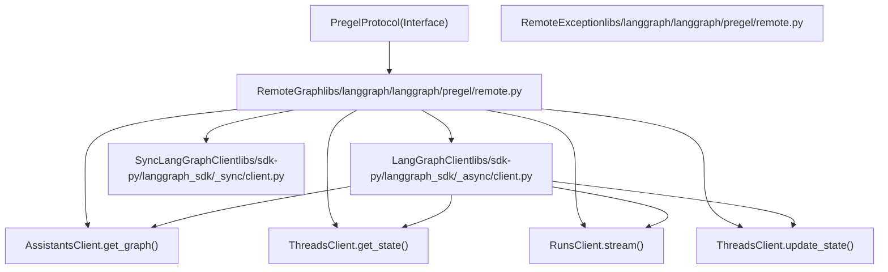

# RemoteGraph

相关源文件

-   [libs/langgraph/langgraph/_internal/_constants.py](https://github.com/langchain-ai/langgraph/blob/1fd51e8f/libs/langgraph/langgraph/_internal/_constants.py)
-   [libs/langgraph/langgraph/_internal/_replay.py](https://github.com/langchain-ai/langgraph/blob/1fd51e8f/libs/langgraph/langgraph/_internal/_replay.py)
-   [libs/langgraph/langgraph/pregel/_loop.py](https://github.com/langchain-ai/langgraph/blob/1fd51e8f/libs/langgraph/langgraph/pregel/_loop.py)
-   [libs/langgraph/langgraph/pregel/main.py](https://github.com/langchain-ai/langgraph/blob/1fd51e8f/libs/langgraph/langgraph/pregel/main.py)
-   [libs/langgraph/langgraph/pregel/protocol.py](https://github.com/langchain-ai/langgraph/blob/1fd51e8f/libs/langgraph/langgraph/pregel/protocol.py)
-   [libs/langgraph/langgraph/pregel/remote.py](https://github.com/langchain-ai/langgraph/blob/1fd51e8f/libs/langgraph/langgraph/pregel/remote.py)
-   [libs/langgraph/langgraph/warnings.py](https://github.com/langchain-ai/langgraph/blob/1fd51e8f/libs/langgraph/langgraph/warnings.py)
-   [libs/langgraph/tests/test_deprecation.py](https://github.com/langchain-ai/langgraph/blob/1fd51e8f/libs/langgraph/tests/test_deprecation.py)
-   [libs/langgraph/tests/test_interruption.py](https://github.com/langchain-ai/langgraph/blob/1fd51e8f/libs/langgraph/tests/test_interruption.py)
-   [libs/langgraph/tests/test_remote_graph.py](https://github.com/langchain-ai/langgraph/blob/1fd51e8f/libs/langgraph/tests/test_remote_graph.py)
-   [libs/langgraph/tests/test_stream_v2.py](https://github.com/langchain-ai/langgraph/blob/1fd51e8f/libs/langgraph/tests/test_stream_v2.py)
-   [libs/langgraph/tests/test_time_travel.py](https://github.com/langchain-ai/langgraph/blob/1fd51e8f/libs/langgraph/tests/test_time_travel.py)
-   [libs/langgraph/tests/test_time_travel_async.py](https://github.com/langchain-ai/langgraph/blob/1fd51e8f/libs/langgraph/tests/test_time_travel_async.py)
-   [libs/sdk-py/langgraph_sdk/__init__.py](https://github.com/langchain-ai/langgraph/blob/1fd51e8f/libs/sdk-py/langgraph_sdk/__init__.py)
-   [libs/sdk-py/langgraph_sdk/cache.py](https://github.com/langchain-ai/langgraph/blob/1fd51e8f/libs/sdk-py/langgraph_sdk/cache.py)
-   [libs/sdk-py/langgraph_sdk/client.py](https://github.com/langchain-ai/langgraph/blob/1fd51e8f/libs/sdk-py/langgraph_sdk/client.py)
-   [libs/sdk-py/langgraph_sdk/schema.py](https://github.com/langchain-ai/langgraph/blob/1fd51e8f/libs/sdk-py/langgraph_sdk/schema.py)
-   [libs/sdk-py/pyproject.toml](https://github.com/langchain-ai/langgraph/blob/1fd51e8f/libs/sdk-py/pyproject.toml)
-   [libs/sdk-py/tests/test_cache.py](https://github.com/langchain-ai/langgraph/blob/1fd51e8f/libs/sdk-py/tests/test_cache.py)
-   [libs/sdk-py/tests/test_crons_client.py](https://github.com/langchain-ai/langgraph/blob/1fd51e8f/libs/sdk-py/tests/test_crons_client.py)

`RemoteGraph` 是一个客户端实现，用于调用符合 LangGraph Server API 规范的远程 LangGraph API。它实现了 `PregelProtocol` 接口 [libs/langgraph/langgraph/pregel/protocol.py25-224](https://github.com/langchain-ai/langgraph/blob/1fd51e8f/libs/langgraph/langgraph/pregel/protocol.py#L25-L224)，并与本地 `Graph` 行为一致，因此可作为另一个图中的节点，用于构建分布式、多层 LangGraph 应用。

关于 LangGraph Server API 端点信息，请参见 [LangGraph Platform API](#7)。关于其内部使用的 Python SDK 客户端类详情，请参见 [Python SDK](/langchain-ai/langgraph/5.1-python-sdk)。关于在本地将图作为子图使用的信息，请参见 [Graph Composition and Nested Graphs](/langchain-ai/langgraph/3.6-graph-composition-and-nested-graphs)。

## 类结构

`RemoteGraph` 类位于 [libs/langgraph/langgraph/pregel/remote.py112-1002](https://github.com/langchain-ai/langgraph/blob/1fd51e8f/libs/langgraph/langgraph/pregel/remote.py#L112-L1002)，并实现 `PregelProtocol` 接口。这使它可以与本地编译得到的 `Pregel` 实例互换使用。

### 实体关系图

来源: [libs/langgraph/langgraph/pregel/remote.py112-121](https://github.com/langchain-ai/langgraph/blob/1fd51e8f/libs/langgraph/langgraph/pregel/remote.py#L112-L121) [libs/langgraph/langgraph/pregel/protocol.py25-224](https://github.com/langchain-ai/langgraph/blob/1fd51e8f/libs/langgraph/langgraph/pregel/protocol.py#L25-L224) [libs/sdk-py/langgraph_sdk/client.py12-31](https://github.com/langchain-ai/langgraph/blob/1fd51e8f/libs/sdk-py/langgraph_sdk/client.py#L12-L31)

## 初始化与配置

`RemoteGraph` 构造函数 [libs/langgraph/langgraph/pregel/remote.py126-174](https://github.com/langchain-ai/langgraph/blob/1fd51e8f/libs/langgraph/langgraph/pregel/remote.py#L126-L174) 既可接收客户端实例，也可接收连接参数以创建默认客户端。

### 构造参数

| 参数 | 类型 | 描述 |
| --- | --- | --- |
| `assistant_id` | `str` | 远程图的 assistant ID 或图名（位置参数） [libs/langgraph/langgraph/pregel/remote.py159](https://github.com/langchain-ai/langgraph/blob/1fd51e8f/libs/langgraph/langgraph/pregel/remote.py#L159-L159) |
| `url` | `str | None` | 远程 API 服务器 URL [libs/langgraph/langgraph/pregel/remote.py131](https://github.com/langchain-ai/langgraph/blob/1fd51e8f/libs/langgraph/langgraph/pregel/remote.py#L131-L131) |
| `api_key` | `str | None` | 认证 API key [libs/langgraph/langgraph/pregel/remote.py132](https://github.com/langchain-ai/langgraph/blob/1fd51e8f/libs/langgraph/langgraph/pregel/remote.py#L132-L132) |
| `headers` | `dict[str, str] | None` | 附加 HTTP 头 [libs/langgraph/langgraph/pregel/remote.py133](https://github.com/langchain-ai/langgraph/blob/1fd51e8f/libs/langgraph/langgraph/pregel/remote.py#L133-L133) |
| `client` | `LangGraphClient | None` | 预配置异步客户端 [libs/langgraph/langgraph/pregel/remote.py134](https://github.com/langchain-ai/langgraph/blob/1fd51e8f/libs/langgraph/langgraph/pregel/remote.py#L134-L134) |
| `sync_client` | `SyncLangGraphClient | None` | 预配置同步客户端 [libs/langgraph/langgraph/pregel/remote.py135](https://github.com/langchain-ai/langgraph/blob/1fd51e8f/libs/langgraph/langgraph/pregel/remote.py#L135-L135) |
| `config` | `RunnableConfig | None` | 默认配置 [libs/langgraph/langgraph/pregel/remote.py136](https://github.com/langchain-ai/langgraph/blob/1fd51e8f/libs/langgraph/langgraph/pregel/remote.py#L136-L136) |
| `name` | `str | None` | 人类可读名称（默认 `assistant_id`） [libs/langgraph/langgraph/pregel/remote.py137](https://github.com/langchain-ai/langgraph/blob/1fd51e8f/libs/langgraph/langgraph/pregel/remote.py#L137-L137) |
| `distributed_tracing` | `bool` | 启用 LangSmith 分布式追踪头 [libs/langgraph/langgraph/pregel/remote.py138](https://github.com/langchain-ai/langgraph/blob/1fd51e8f/libs/langgraph/langgraph/pregel/remote.py#L138-L138) |

`url`、`client` 或 `sync_client` 至少需要提供一个。如果提供了 `url`，会使用 `get_client()` 与 `get_sync_client()`（来自 `langgraph_sdk`）创建默认客户端 [libs/langgraph/langgraph/pregel/remote.py167-174](https://github.com/langchain-ai/langgraph/blob/1fd51e8f/libs/langgraph/langgraph/pregel/remote.py#L167-L174)

来源: [libs/langgraph/langgraph/pregel/remote.py126-174](https://github.com/langchain-ai/langgraph/blob/1fd51e8f/libs/langgraph/langgraph/pregel/remote.py#L126-L174)

## 配置净化

在把配置发送到远程 API 前，`RemoteGraph` 会对其进行净化，以移除不可序列化字段与内部 checkpoint 状态。

### 配置丢弃列表

常量 `_CONF_DROPLIST` [libs/langgraph/langgraph/pregel/remote.py74-81](https://github.com/langchain-ai/langgraph/blob/1fd51e8f/libs/langgraph/langgraph/pregel/remote.py#L74-L81) 定义了从 `config["configurable"]` 中移除的字段：

-   `CONFIG_KEY_CHECKPOINT_MAP`
-   `CONFIG_KEY_CHECKPOINT_ID`
-   `CONFIG_KEY_CHECKPOINT_NS`
-   `CONFIG_KEY_TASK_ID`

### 实现

`_sanitize_config()` 方法 [libs/langgraph/langgraph/pregel/remote.py369-396](https://github.com/langchain-ai/langgraph/blob/1fd51e8f/libs/langgraph/langgraph/pregel/remote.py#L369-L396) 会处理：

1.  **recursion_limit**：若存在则直接复制。
2.  **tags**：仅保留字符串值。
3.  **metadata**：使用 `_sanitize_config_value()` 递归净化值。
4.  **configurable**：过滤掉丢弃列表中的键，并递归净化值。

辅助函数 `_sanitize_config_value()` [libs/langgraph/langgraph/pregel/remote.py84-103](https://github.com/langchain-ai/langgraph/blob/1fd51e8f/libs/langgraph/langgraph/pregel/remote.py#L84-L103) 确保仅传递原始类型（str、int、float、bool、UUID）、dict 以及只包含原始类型的 list/tuple。

来源: [libs/langgraph/langgraph/pregel/remote.py74-103](https://github.com/langchain-ai/langgraph/blob/1fd51e8f/libs/langgraph/langgraph/pregel/remote.py#L74-L103) [libs/langgraph/langgraph/pregel/remote.py369-396](https://github.com/langchain-ai/langgraph/blob/1fd51e8f/libs/langgraph/langgraph/pregel/remote.py#L369-L396)

## 状态管理

`RemoteGraph` 通过封装 SDK 调用提供读取和写入远程图线程状态的方法。

### get_state() / aget_state()

[libs/langgraph/langgraph/pregel/remote.py398-468](https://github.com/langchain-ai/langgraph/blob/1fd51e8f/libs/langgraph/langgraph/pregel/remote.py#L398-L468) 获取线程当前或历史状态。它会根据 config 中是否提供特定 checkpoint ID，调用 `ThreadsClient.get_state()` 或 `ThreadsClient.get_state_checkpoint()`。

### update_state() / aupdate_state()

[libs/langgraph/langgraph/pregel/remote.py564-632](https://github.com/langchain-ai/langgraph/blob/1fd51e8f/libs/langgraph/langgraph/pregel/remote.py#L564-L632) 更新远程图的线程状态。它会调用 `ThreadsClient.update_state()`，并返回表示新 checkpoint 的 `RunnableConfig`。

### 数据模型映射

| SDK Schema (`ThreadState`) | Pregel Model (`StateSnapshot`) | 来源 |
| --- | --- | --- |
| `values` | `values` | [libs/langgraph/langgraph/pregel/remote.py304](https://github.com/langchain-ai/langgraph/blob/1fd51e8f/libs/langgraph/langgraph/pregel/remote.py#L304-L304) |
| `next` | `next`（作为 tuple） | [libs/langgraph/langgraph/pregel/remote.py305](https://github.com/langchain-ai/langgraph/blob/1fd51e8f/libs/langgraph/langgraph/pregel/remote.py#L305-L305) |
| `checkpoint` | `config["configurable"]` | [libs/langgraph/langgraph/pregel/remote.py308-315](https://github.com/langchain-ai/langgraph/blob/1fd51e8f/libs/langgraph/langgraph/pregel/remote.py#L308-L315) |
| `tasks` | `tasks`（作为 `PregelTask`） | [libs/langgraph/langgraph/pregel/remote.py321-337](https://github.com/langchain-ai/langgraph/blob/1fd51e8f/libs/langgraph/langgraph/pregel/remote.py#L321-L337) |

来源: [libs/langgraph/langgraph/pregel/remote.py284-340](https://github.com/langchain-ai/langgraph/blob/1fd51e8f/libs/langgraph/langgraph/pregel/remote.py#L284-L340) [libs/sdk-py/langgraph_sdk/schema.py198-210](https://github.com/langchain-ai/langgraph/blob/1fd51e8f/libs/sdk-py/langgraph_sdk/schema.py#L198-L210)

## 执行与流式传输

`RemoteGraph` 的核心是 `stream()` 与 `astream()` 的实现，它们将本地 Pregel 的流式请求转换为 LangGraph Server API 请求。

### 流模式映射

`_get_stream_modes()` 方法 [libs/langgraph/langgraph/pregel/remote.py634-683](https://github.com/langchain-ai/langgraph/blob/1fd51e8f/libs/langgraph/langgraph/pregel/remote.py#L634-L683) 负责转换：

-   将本地 `"messages"` 映射为远程 `"messages-tuple"` [libs/langgraph/langgraph/pregel/remote.py657](https://github.com/langchain-ai/langgraph/blob/1fd51e8f/libs/langgraph/langgraph/pregel/remote.py#L657-L657)
-   始终在内部添加 `"updates"` 模式以检测中断 [libs/langgraph/langgraph/pregel/remote.py662](https://github.com/langchain-ai/langgraph/blob/1fd51e8f/libs/langgraph/langgraph/pregel/remote.py#L662-L662)
-   过滤掉 `"events"`，因为远程执行不支持该模式 [libs/langgraph/langgraph/pregel/remote.py666](https://github.com/langchain-ai/langgraph/blob/1fd51e8f/libs/langgraph/langgraph/pregel/remote.py#L666-L666)

### 子图执行数据流

> **[Mermaid sequence]**
> *(图表结构无法解析)*

来源: [libs/langgraph/langgraph/pregel/remote.py685-903](https://github.com/langchain-ai/langgraph/blob/1fd51e8f/libs/langgraph/langgraph/pregel/remote.py#L685-L903) [libs/langgraph/langgraph/pregel/remote.py764-769](https://github.com/langchain-ai/langgraph/blob/1fd51e8f/libs/langgraph/langgraph/pregel/remote.py#L764-L769)

## 集成功能

### 中断传播

当 `RemoteGraph` 作为节点用于本地图时，它会监控远程流中的 `__interrupt__` 键 [libs/langgraph/langgraph/pregel/remote.py764-769](https://github.com/langchain-ai/langgraph/blob/1fd51e8f/libs/langgraph/langgraph/pregel/remote.py#L764-L769) 若检测到该键，则会在本地抛出 `GraphInterrupt` [libs/langgraph/errors.py70](https://github.com/langchain-ai/langgraph/blob/1fd51e8f/libs/langgraph/errors.py#L70-L70)，从而在该节点处暂停本地图执行。

### 父命令支持

远程图可向本地父图发出命令。若某个流事件的 mode 为 `"command"` 且目标是 `Command.PARENT`，`RemoteGraph` 会抛出 `ParentCommand` 异常 [libs/langgraph/langgraph/pregel/remote.py754-755](https://github.com/langchain-ai/langgraph/blob/1fd51e8f/libs/langgraph/langgraph/pregel/remote.py#L754-L755)

### 分布式追踪

如果设置了 `distributed_tracing=True`，`RemoteGraph` 会使用 `langsmith.get_current_run_tree()` 提取追踪头并注入到远程 API 请求中 [libs/langgraph/langgraph/pregel/remote.py1004-1015](https://github.com/langchain-ai/langgraph/blob/1fd51e8f/libs/langgraph/langgraph/pregel/remote.py#L1004-L1015) 这可确保本地编排器与远程执行器之间的追踪连续性。

来源: [libs/langgraph/langgraph/pregel/remote.py138](https://github.com/langchain-ai/langgraph/blob/1fd51e8f/libs/langgraph/langgraph/pregel/remote.py#L138-L138) [libs/langgraph/langgraph/pregel/remote.py754-769](https://github.com/langchain-ai/langgraph/blob/1fd51e8f/libs/langgraph/langgraph/pregel/remote.py#L754-L769) [libs/langgraph/langgraph/pregel/remote.py1004-1015](https://github.com/langchain-ai/langgraph/blob/1fd51e8f/libs/langgraph/langgraph/pregel/remote.py#L1004-L1015)
