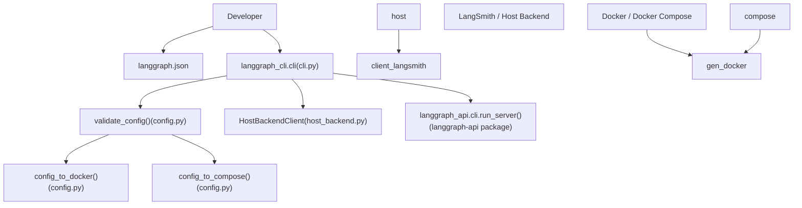
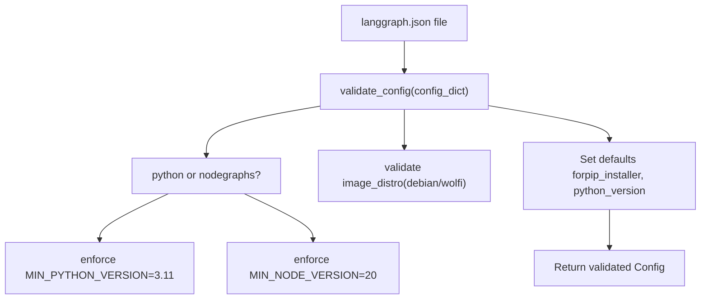
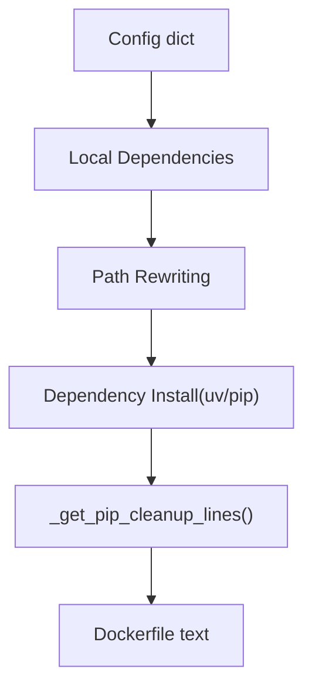

# CLI 与部署

相关源文件

-   [libs/cli/README.md](https://github.com/langchain-ai/langgraph/blob/1fd51e8f/libs/cli/README.md?plain=1)
-   [libs/cli/langgraph_cli/__init__.py](https://github.com/langchain-ai/langgraph/blob/1fd51e8f/libs/cli/langgraph_cli/__init__.py)
-   [libs/cli/langgraph_cli/cli.py](https://github.com/langchain-ai/langgraph/blob/1fd51e8f/libs/cli/langgraph_cli/cli.py)
-   [libs/cli/langgraph_cli/config.py](https://github.com/langchain-ai/langgraph/blob/1fd51e8f/libs/cli/langgraph_cli/config.py)
-   [libs/cli/langgraph_cli/helpers.py](https://github.com/langchain-ai/langgraph/blob/1fd51e8f/libs/cli/langgraph_cli/helpers.py)
-   [libs/cli/langgraph_cli/host_backend.py](https://github.com/langchain-ai/langgraph/blob/1fd51e8f/libs/cli/langgraph_cli/host_backend.py)
-   [libs/cli/langgraph_cli/progress.py](https://github.com/langchain-ai/langgraph/blob/1fd51e8f/libs/cli/langgraph_cli/progress.py)
-   [libs/cli/langgraph_cli/util.py](https://github.com/langchain-ai/langgraph/blob/1fd51e8f/libs/cli/langgraph_cli/util.py)
-   [libs/cli/pyproject.toml](https://github.com/langchain-ai/langgraph/blob/1fd51e8f/libs/cli/pyproject.toml)
-   [libs/cli/tests/unit_tests/cli/test_cli.py](https://github.com/langchain-ai/langgraph/blob/1fd51e8f/libs/cli/tests/unit_tests/cli/test_cli.py)
-   [libs/cli/tests/unit_tests/test_config.py](https://github.com/langchain-ai/langgraph/blob/1fd51e8f/libs/cli/tests/unit_tests/test_config.py)
-   [libs/cli/tests/unit_tests/test_deploy_helpers.py](https://github.com/langchain-ai/langgraph/blob/1fd51e8f/libs/cli/tests/unit_tests/test_deploy_helpers.py)
-   [libs/cli/tests/unit_tests/test_host_backend.py](https://github.com/langchain-ai/langgraph/blob/1fd51e8f/libs/cli/tests/unit_tests/test_host_backend.py)
-   [libs/cli/tests/unit_tests/test_logs_helpers.py](https://github.com/langchain-ai/langgraph/blob/1fd51e8f/libs/cli/tests/unit_tests/test_logs_helpers.py)
-   [libs/cli/tests/unit_tests/test_util.py](https://github.com/langchain-ai/langgraph/blob/1fd51e8f/libs/cli/tests/unit_tests/test_util.py)
-   [libs/cli/uv.lock](https://github.com/langchain-ai/langgraph/blob/1fd51e8f/libs/cli/uv.lock)

本页介绍 `langgraph-cli` 包：它的用途、暴露的命令、如何读取 `langgraph.json` 配置文件，以及如何将该配置转换为基于 Docker 的部署或本地内存开发服务器。

-   关于每个 CLI 命令及其参数的详细文档，请参见 [CLI Commands](/langchain-ai/langgraph/6.1-cli-commands)。
-   关于完整的 `langgraph.json` 模式参考，请参见 [Configuration System (langgraph.json)](/langchain-ai/langgraph/6.2-configuration-system-(langgraph.json)).
-   关于 Dockerfile 生成内部机制，请参见 [Docker Image Generation](/langchain-ai/langgraph/6.3-docker-image-generation).
-   关于 Docker Compose 编排，请参见 [Multi-Service Orchestration](/langchain-ai/langgraph/6.4-multi-service-orchestration).
-   关于 `langgraph dev` 内存服务器，请参见 [Local Development Server](/langchain-ai/langgraph/6.5-local-development-server).
-   关于基于 Kafka 的分布式执行器，请参见 [Distributed Execution with Kafka](/langchain-ai/langgraph/6.6-distributed-execution-with-kafka).
-   关于以编程方式访问已部署服务器，请参见 [Client SDKs and Remote Execution](/langchain-ai/langgraph/5-client-sdks-and-remote-execution).

---

## 包概览

`langgraph-cli` 包位于 `libs/cli/`，安装后提供 `langgraph` 命令行工具。其入口点定义在 `libs/cli/pyproject.toml` [libs/cli/pyproject.toml34-35](https://github.com/langchain-ai/langgraph/blob/1fd51e8f/libs/cli/pyproject.toml#L34-L35)

它依赖 `click>=8.1.7`、`httpx>=0.24.0` 和 `langgraph-sdk>=0.1.0`（适用于 Python ≥ 3.11）[libs/cli/pyproject.toml14-19](https://github.com/langchain-ai/langgraph/blob/1fd51e8f/libs/cli/pyproject.toml#L14-L19) 对于内存开发服务器，它需要 `[inmem]` 扩展依赖组，该组会引入 `langgraph-api` 与 `langgraph-runtime-inmem` [libs/cli/pyproject.toml22-26](https://github.com/langchain-ai/langgraph/blob/1fd51e8f/libs/cli/pyproject.toml#L22-L26)

| Extra group | 附加依赖 |
| --- | --- |
| *(none)* | `click`, `httpx`, `langgraph-sdk` |
| `[inmem]` | `langgraph-api`, `langgraph-runtime-inmem` |

来源: [libs/cli/pyproject.toml1-35](https://github.com/langchain-ai/langgraph/blob/1fd51e8f/libs/cli/pyproject.toml#L1-L35)

---

## 架构位置

CLI 连接了本地开发与生产部署。它读取 `langgraph.json` 文件并进行校验，然后要么启动 Docker Compose 堆栈（用于 `up`/`build`/`dockerfile`），要么启动进程内服务器（用于 `dev`）。它还通过 `deploy` 命令促进向 LangSmith 的部署，该命令会与 `HostBackendClient` 交互 [libs/cli/langgraph_cli/host_backend.py19-21](https://github.com/langchain-ai/langgraph/blob/1fd51e8f/libs/cli/langgraph_cli/host_backend.py#L19-L21)

**CLI 系统关系**

来源: [libs/cli/langgraph_cli/cli.py1-40](https://github.com/langchain-ai/langgraph/blob/1fd51e8f/libs/cli/langgraph_cli/cli.py#L1-L40) [libs/cli/langgraph_cli/config.py142-196](https://github.com/langchain-ai/langgraph/blob/1fd51e8f/libs/cli/langgraph_cli/config.py#L142-L196) [libs/cli/langgraph_cli/host_backend.py19-43](https://github.com/langchain-ai/langgraph/blob/1fd51e8f/libs/cli/langgraph_cli/host_backend.py#L19-L43)

---

## 命令速览

`cli` 组是定义在 `langgraph_cli/cli.py` 中的根 Click 组 [libs/cli/langgraph_cli/cli.py35](https://github.com/langchain-ai/langgraph/blob/1fd51e8f/libs/cli/langgraph_cli/cli.py#L35-L35) 所有命令都注册在该组上。

| 命令 | 函数 | 功能 |
| --- | --- | --- |
| `langgraph new` | `new()` | 从模板脚手架创建新项目 [libs/cli/langgraph_cli/cli.py1008-1018](https://github.com/langchain-ai/langgraph/blob/1fd51e8f/libs/cli/langgraph_cli/cli.py#L1008-L1018) |
| `langgraph dev` | `dev()` | 启动支持热重载的内存开发服务器 [libs/cli/langgraph_cli/cli.py609-613](https://github.com/langchain-ai/langgraph/blob/1fd51e8f/libs/cli/langgraph_cli/cli.py#L609-L613) |
| `langgraph up` | `up()` | 构建并启动完整 Docker Compose 堆栈 [libs/cli/langgraph_cli/cli.py784-788](https://github.com/langchain-ai/langgraph/blob/1fd51e8f/libs/cli/langgraph_cli/cli.py#L784-L788) |
| `langgraph build` | `build()` | 构建带标签 Docker 镜像 [libs/cli/langgraph_cli/cli.py295-300](https://github.com/langchain-ai/langgraph/blob/1fd51e8f/libs/cli/langgraph_cli/cli.py#L295-L300) |
| `langgraph dockerfile` | `dockerfile()` | 输出 Dockerfile，并可选输出 compose 文件 [libs/cli/langgraph_cli/cli.py487-492](https://github.com/langchain-ai/langgraph/blob/1fd51e8f/libs/cli/langgraph_cli/cli.py#L487-L492) |
| `langgraph deploy` | `deploy()` | 将项目部署到 LangSmith [libs/cli/langgraph_cli/cli.py1021-1025](https://github.com/langchain-ai/langgraph/blob/1fd51e8f/libs/cli/langgraph_cli/cli.py#L1021-L1025) |

来源: [libs/cli/langgraph_cli/cli.py295-1025](https://github.com/langchain-ai/langgraph/blob/1fd51e8f/libs/cli/langgraph_cli/cli.py#L295-L1025)

---

## 配置文件（`langgraph.json`）

每个命令都需要配置文件（默认：`./langgraph.json`）。该文件由 `validate_config()` 在 `config.py` 中加载并校验 [libs/cli/langgraph_cli/config.py142](https://github.com/langchain-ai/langgraph/blob/1fd51e8f/libs/cli/langgraph_cli/config.py#L142-L142)

校验结果是一个 `Config` 对象（定义于 `langgraph_cli/schemas.py`）。

### 关键顶层字段

| 字段 | 类型 | 必需 | 描述 |
| --- | --- | --- | --- |
| `graphs` | `dict` | **Yes** | 从 graph ID 到实现路径的映射 [libs/cli/langgraph_cli/config.py184](https://github.com/langchain-ai/langgraph/blob/1fd51e8f/libs/cli/langgraph_cli/config.py#L184-L184) |
| `dependencies` | `list[str]` | Yes | 服务器依赖数组 [libs/cli/langgraph_cli/config.py182](https://github.com/langchain-ai/langgraph/blob/1fd51e8f/libs/cli/langgraph_cli/config.py#L182-L182) |
| `python_version` | `str` | No | 默认 `3.11` [libs/cli/langgraph_cli/config.py48](https://github.com/langchain-ai/langgraph/blob/1fd51e8f/libs/cli/langgraph_cli/config.py#L48-L48) |
| `node_version` | `str` | No | JS/TS 图必需；默认 `20` [libs/cli/langgraph_cli/config.py15](https://github.com/langchain-ai/langgraph/blob/1fd51e8f/libs/cli/langgraph_cli/config.py#L15-L15) |
| `image_distro` | `str` | No | 基础镜像发行版（例如 `debian`、`wolfi`）[libs/cli/langgraph_cli/config.py157](https://github.com/langchain-ai/langgraph/blob/1fd51e8f/libs/cli/langgraph_cli/config.py#L157-L157) |
| `env` | `str | dict` | No | `.env` 文件路径或内联键值映射 [libs/cli/langgraph_cli/config.py185](https://github.com/langchain-ai/langgraph/blob/1fd51e8f/libs/cli/langgraph_cli/config.py#L185-L185) |
| `dockerfile_lines` | `list[str]` | No | 追加到生成 Dockerfile 的附加行 [libs/cli/langgraph_cli/config.py183](https://github.com/langchain-ai/langgraph/blob/1fd51e8f/libs/cli/langgraph_cli/config.py#L183-L183) |
| `pip_installer` | `str` | No | `auto`、`pip` 或 `uv` 之一 [libs/cli/langgraph_cli/config.py179](https://github.com/langchain-ai/langgraph/blob/1fd51e8f/libs/cli/langgraph_cli/config.py#L179-L179) |

来源: [libs/cli/langgraph_cli/config.py14-196](https://github.com/langchain-ai/langgraph/blob/1fd51e8f/libs/cli/langgraph_cli/config.py#L14-L196) [libs/cli/langgraph_cli/cli.py183-200](https://github.com/langchain-ai/langgraph/blob/1fd51e8f/libs/cli/langgraph_cli/cli.py#L183-L200)

---

## 配置校验流程

校验逻辑会确保指定的 Python 或 Node 版本满足最低要求，并确保 `graphs` 与 `dependencies` 等必需字段存在。

**配置校验流水线**

来源: [libs/cli/langgraph_cli/config.py142-208](https://github.com/langchain-ai/langgraph/blob/1fd51e8f/libs/cli/langgraph_cli/config.py#L142-L208)

---

## Docker 镜像生成

`config_to_docker()` 将 `langgraph.json` 配置转换为多阶段 Dockerfile。它使用 `pip` 或 `uv` 处理依赖安装 [libs/cli/langgraph_cli/config.py90-99](https://github.com/langchain-ai/langgraph/blob/1fd51e8f/libs/cli/langgraph_cli/config.py#L90-L99)

CLI 会根据项目类型和版本选择基础镜像。出于安全考虑，它推荐使用 `wolfi` 发行版 [libs/cli/langgraph_cli/util.py10-27](https://github.com/langchain-ai/langgraph/blob/1fd51e8f/libs/cli/langgraph_cli/util.py#L10-L27)

**Dockerfile 生成数据流**

来源: [libs/cli/langgraph_cli/config.py56-99](https://github.com/langchain-ai/langgraph/blob/1fd51e8f/libs/cli/langgraph_cli/config.py#L56-L99) [libs/cli/langgraph_cli/util.py10-27](https://github.com/langchain-ai/langgraph/blob/1fd51e8f/libs/cli/langgraph_cli/util.py#L10-L27)

---

## Docker Compose 编排

`langgraph up` 使用 Docker Compose 启动 API 服务器及其所需基础设施，例如 Redis 和 Postgres [libs/cli/tests/unit_tests/cli/test_cli.py80-132](https://github.com/langchain-ai/langgraph/blob/1fd51e8f/libs/cli/tests/unit_tests/cli/test_cli.py#L80-L132)

| 服务 | 镜像 | 用途 |
| --- | --- | --- |
| `langgraph-redis` | `redis:6` | 任务队列与瞬态状态 [libs/cli/tests/unit_tests/cli/test_cli.py84-85](https://github.com/langchain-ai/langgraph/blob/1fd51e8f/libs/cli/tests/unit_tests/cli/test_cli.py#L84-L85) |
| `langgraph-postgres` | `pgvector/pgvector:pg16` | Checkpoint 与 Store 持久化 [libs/cli/tests/unit_tests/cli/test_cli.py91-92](https://github.com/langchain-ai/langgraph/blob/1fd51e8f/libs/cli/tests/unit_tests/cli/test_cli.py#L91-L92) |
| `langgraph-api` | 本地构建 | 核心图执行服务器 [libs/cli/tests/unit_tests/cli/test_cli.py122](https://github.com/langchain-ai/langgraph/blob/1fd51e8f/libs/cli/tests/unit_tests/cli/test_cli.py#L122-L122) |
| `langgraph-debugger` | `langchain/langgraph-debugger` | 用于图检查的本地 UI [libs/cli/tests/unit_tests/cli/test_cli.py112-113](https://github.com/langchain-ai/langgraph/blob/1fd51e8f/libs/cli/tests/unit_tests/cli/test_cli.py#L112-L113) |

来源: [libs/cli/tests/unit_tests/cli/test_cli.py80-132](https://github.com/langchain-ai/langgraph/blob/1fd51e8f/libs/cli/tests/unit_tests/cli/test_cli.py#L80-L132)

---

## 部署到 LangSmith

`langgraph deploy` 命令自动化将镜像推送到 LangGraph Cloud registry 并更新部署。它使用 `HostBackendClient` 与 LangGraph 部署 API 交互 [libs/cli/langgraph_cli/host_backend.py73-100](https://github.com/langchain-ai/langgraph/blob/1fd51e8f/libs/cli/langgraph_cli/host_backend.py#L73-L100)

部署流程包括：

1.  解析部署 ID [libs/cli/langgraph_cli/cli.py1034](https://github.com/langchain-ai/langgraph/blob/1fd51e8f/libs/cli/langgraph_cli/cli.py#L1034-L1034)
2.  为 registry 申请推送令牌 [libs/cli/langgraph_cli/host_backend.py89-93](https://github.com/langchain-ai/langgraph/blob/1fd51e8f/libs/cli/langgraph_cli/host_backend.py#L89-L93)
3.  构建并推送 Docker 镜像。
4.  使用新的镜像 URI 与 secrets 更新部署 [libs/cli/langgraph_cli/host_backend.py95-110](https://github.com/langchain-ai/langgraph/blob/1fd51e8f/libs/cli/langgraph_cli/host_backend.py#L95-L110)

来源: [libs/cli/langgraph_cli/cli.py1021-1050](https://github.com/langchain-ai/langgraph/blob/1fd51e8f/libs/cli/langgraph_cli/cli.py#L1021-L1050) [libs/cli/langgraph_cli/host_backend.py19-110](https://github.com/langchain-ai/langgraph/blob/1fd51e8f/libs/cli/langgraph_cli/host_backend.py#L19-L110)
