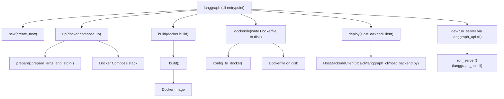

# CLI 命令

相关源文件

-   [libs/cli/README.md](https://github.com/langchain-ai/langgraph/blob/1fd51e8f/libs/cli/README.md?plain=1)
-   [libs/cli/langgraph_cli/__init__.py](https://github.com/langchain-ai/langgraph/blob/1fd51e8f/libs/cli/langgraph_cli/__init__.py)
-   [libs/cli/langgraph_cli/cli.py](https://github.com/langchain-ai/langgraph/blob/1fd51e8f/libs/cli/langgraph_cli/cli.py)
-   [libs/cli/langgraph_cli/config.py](https://github.com/langchain-ai/langgraph/blob/1fd51e8f/libs/cli/langgraph_cli/config.py)
-   [libs/cli/langgraph_cli/helpers.py](https://github.com/langchain-ai/langgraph/blob/1fd51e8f/libs/cli/langgraph_cli/helpers.py)
-   [libs/cli/langgraph_cli/host_backend.py](https://github.com/langchain-ai/langgraph/blob/1fd51e8f/libs/cli/langgraph_cli/host_backend.py)
-   [libs/cli/langgraph_cli/progress.py](https://github.com/langchain-ai/langgraph/blob/1fd51e8f/libs/cli/langgraph_cli/progress.py)
-   [libs/cli/langgraph_cli/util.py](https://github.com/langchain-ai/langgraph/blob/1fd51e8f/libs/cli/langgraph_cli/util.py)
-   [libs/cli/pyproject.toml](https://github.com/langchain-ai/langgraph/blob/1fd51e8f/libs/cli/pyproject.toml)
-   [libs/cli/tests/unit_tests/cli/test_cli.py](https://github.com/langchain-ai/langgraph/blob/1fd51e8f/libs/cli/tests/unit_tests/cli/test_cli.py)
-   [libs/cli/tests/unit_tests/test_config.py](https://github.com/langchain-ai/langgraph/blob/1fd51e8f/libs/cli/tests/unit_tests/test_config.py)
-   [libs/cli/tests/unit_tests/test_deploy_helpers.py](https://github.com/langchain-ai/langgraph/blob/1fd51e8f/libs/cli/tests/unit_tests/test_deploy_helpers.py)
-   [libs/cli/tests/unit_tests/test_host_backend.py](https://github.com/langchain-ai/langgraph/blob/1fd51e8f/libs/cli/tests/unit_tests/test_host_backend.py)
-   [libs/cli/tests/unit_tests/test_logs_helpers.py](https://github.com/langchain-ai/langgraph/blob/1fd51e8f/libs/cli/tests/unit_tests/test_logs_helpers.py)
-   [libs/cli/tests/unit_tests/test_util.py](https://github.com/langchain-ai/langgraph/blob/1fd51e8f/libs/cli/tests/unit_tests/test_util.py)
-   [libs/cli/uv.lock](https://github.com/langchain-ai/langgraph/blob/1fd51e8f/libs/cli/uv.lock)

本页记录 `langgraph-cli` 包提供的全部命令，覆盖其选项、参数与典型用法。CLI 是运行、构建和脚手架化 LangGraph 部署的主要接口。

关于这些命令使用的 `langgraph.json` 配置格式，请参见页面 [6.2](https://github.com/langchain-ai/langgraph/blob/1fd51e8f/6.2) 关于如何由配置生成 Dockerfile，请参见页面 [6.3](https://github.com/langchain-ai/langgraph/blob/1fd51e8f/6.3) 关于 Docker Compose 多服务编排行为，请参见页面 [6.4](https://github.com/langchain-ai/langgraph/blob/1fd51e8f/6.4) 关于内存开发服务器内部机制，请参见页面 [6.5](https://github.com/langchain-ai/langgraph/blob/1fd51e8f/6.5)

---

## 概览

`langgraph` CLI 作为脚本入口点由 `langgraph-cli` 包安装 [libs/cli/pyproject.toml34-35](https://github.com/langchain-ai/langgraph/blob/1fd51e8f/libs/cli/pyproject.toml#L34-L35) 它实现为定义在 `langgraph_cli.cli:cli` 中的 Click 命令组 [libs/cli/langgraph_cli/cli.py162-165](https://github.com/langchain-ai/langgraph/blob/1fd51e8f/libs/cli/langgraph_cli/cli.py#L162-L165)

CLI 支持以下主要命令：

| Command | 用途 |
| --- | --- |
| `langgraph new` | 从模板脚手架创建新项目 |
| `langgraph dev` | 在本地运行 API 服务器并启用热重载（无 Docker） |
| `langgraph up` | 启动完整 Docker Compose 堆栈 |
| `langgraph build` | 构建用于部署的 Docker 镜像 |
| `langgraph dockerfile` | 将 Dockerfile（可选含 docker-compose.yml）写入磁盘 |
| `langgraph deploy` | 将项目部署到 LangGraph Cloud/Host Backend |

**安装：**

```
pip install langgraph-cli          # up/build/dockerfile/new onlypip install "langgraph-cli[inmem]" # also enables: langgraph dev
```
`inmem` 扩展依赖组会额外引入 `langgraph-api` 与 `langgraph-runtime-inmem` [libs/cli/pyproject.toml22-26](https://github.com/langchain-ai/langgraph/blob/1fd51e8f/libs/cli/pyproject.toml#L22-L26)

---

## 命令流程图

**CLI 命令分发与数据流**


来源: [libs/cli/langgraph_cli/cli.py162-1500](https://github.com/langchain-ai/langgraph/blob/1fd51e8f/libs/cli/langgraph_cli/cli.py#L162-L1500) [libs/cli/langgraph_cli/host_backend.py19-43](https://github.com/langchain-ai/langgraph/blob/1fd51e8f/libs/cli/langgraph_cli/host_backend.py#L19-L43)

---

## `langgraph new`

从模板创建一个新的项目目录。

```
langgraph new [PATH] [--template TEMPLATE]
```
**参数与选项：**

| Parameter | 类型 | 描述 |
| --- | --- | --- |
| `PATH` | argument (optional) | 新项目的目标目录 |
| `--template` | string option | 模板名称（见 `TEMPLATE_HELP_STRING`） |

由 `new` 函数实现 [libs/cli/langgraph_cli/cli.py1489-1499](https://github.com/langchain-ai/langgraph/blob/1fd51e8f/libs/cli/langgraph_cli/cli.py#L1489-L1499)，该函数委托给 `create_new`（位于 `langgraph_cli.templates`）[libs/cli/langgraph_cli/cli.py33](https://github.com/langchain-ai/langgraph/blob/1fd51e8f/libs/cli/langgraph_cli/cli.py#L33-L33)

来源: [libs/cli/langgraph_cli/cli.py1489-1499](https://github.com/langchain-ai/langgraph/blob/1fd51e8f/libs/cli/langgraph_cli/cli.py#L1489-L1499)

---

## `langgraph dev`

在进程内运行 LangGraph API 服务器（无 Docker），并启用热重载。需要 `inmem` 扩展依赖。

```
langgraph dev [OPTIONS]
```
**行为：**

1.  通过 `validate_config_file` 校验配置文件 [libs/cli/langgraph_cli/cli.py1450](https://github.com/langchain-ai/langgraph/blob/1fd51e8f/libs/cli/langgraph_cli/cli.py#L1450-L1450)
2.  若配置指定了 `node_version` 则报错，因为内存服务器不支持 JS 图 [libs/cli/langgraph_cli/cli.py1451-1454](https://github.com/langchain-ai/langgraph/blob/1fd51e8f/libs/cli/langgraph_cli/cli.py#L1451-L1454)
3.  将当前工作目录和本地依赖路径加入 `sys.path`，以确保图代码可导入 [libs/cli/langgraph_cli/cli.py1456-1462](https://github.com/langchain-ai/langgraph/blob/1fd51e8f/libs/cli/langgraph_cli/cli.py#L1456-L1462)
4.  调用 `run_server`（从 `langgraph_api.cli` 导入）[libs/cli/langgraph_cli/cli.py1419-1486](https://github.com/langchain-ai/langgraph/blob/1fd51e8f/libs/cli/langgraph_cli/cli.py#L1419-L1486)

来源: [libs/cli/langgraph_cli/cli.py1327-1486](https://github.com/langchain-ai/langgraph/blob/1fd51e8f/libs/cli/langgraph_cli/cli.py#L1327-L1486)

---

## `langgraph deploy`

将项目部署到远程 LangGraph host backend。

```
langgraph deploy [DEPLOYMENT_NAME] [OPTIONS]
```
**关键特性：**

-   **部署解析：**按名称或 ID 解析现有部署 [libs/cli/langgraph_cli/cli.py1141-1153](https://github.com/langchain-ai/langgraph/blob/1fd51e8f/libs/cli/langgraph_cli/cli.py#L1141-L1153)
-   **环境管理：**从 `.env` 或 `langgraph.json` 解析 secrets [libs/cli/langgraph_cli/cli.py1161-1167](https://github.com/langchain-ai/langgraph/blob/1fd51e8f/libs/cli/langgraph_cli/cli.py#L1161-L1167)，并过滤保留变量 [libs/cli/langgraph_cli/cli.py41-86](https://github.com/langchain-ai/langgraph/blob/1fd51e8f/libs/cli/langgraph_cli/cli.py#L41-L86)
-   **推送令牌认证：**申请临时 push token 以认证 registry [libs/cli/langgraph_cli/cli.py1222-1224](https://github.com/langchain-ai/langgraph/blob/1fd51e8f/libs/cli/langgraph_cli/cli.py#L1222-L1224)
-   **日志流式：**实时监控构建与部署日志 [libs/cli/langgraph_cli/cli.py1260-1285](https://github.com/langchain-ai/langgraph/blob/1fd51e8f/libs/cli/langgraph_cli/cli.py#L1260-L1285)

**Host Backend 交互**

> **[Mermaid sequence]**
> *(图表结构无法解析)*

来源: [libs/cli/langgraph_cli/cli.py1102-1325](https://github.com/langchain-ai/langgraph/blob/1fd51e8f/libs/cli/langgraph_cli/cli.py#L1102-L1325) [libs/cli/langgraph_cli/host_backend.py73-144](https://github.com/langchain-ai/langgraph/blob/1fd51e8f/libs/cli/langgraph_cli/host_backend.py#L73-L144)

---

## `langgraph up`

启动完整、接近生产环境的 Docker Compose 堆栈：LangGraph API 服务、PostgreSQL 数据库（带 `pgvector`）以及 Redis。

**行为：**

1.  调用 `prepare()` [libs/cli/langgraph_cli/cli.py1551-1596](https://github.com/langchain-ai/langgraph/blob/1fd51e8f/libs/cli/langgraph_cli/cli.py#L1551-L1596)，该函数会校验配置并通过 `prepare_args_and_stdin()` 生成 Docker Compose YAML。
2.  若未提供镜像，会生成内联 Dockerfile，包括本地依赖的自动安装 [libs/cli/langgraph_cli/cli.py1551-1596](https://github.com/langchain-ai/langgraph/blob/1fd51e8f/libs/cli/langgraph_cli/cli.py#L1551-L1596)
3.  监控启动流程，并在 API 报告 "Application startup complete" 后输出可用 URL [libs/cli/langgraph_cli/cli.py246-261](https://github.com/langchain-ai/langgraph/blob/1fd51e8f/libs/cli/langgraph_cli/cli.py#L246-L261)

来源: [libs/cli/langgraph_cli/cli.py168-293](https://github.com/langchain-ai/langgraph/blob/1fd51e8f/libs/cli/langgraph_cli/cli.py#L168-L293)

---

## 配置文件校验

所有接收 `--config` 的命令都会调用 `validate_config()`（位于 `langgraph_cli.config`）。该函数会强制执行严格模式规则：

-   **Python 版本：**必须 `>=3.11`。当检测到 Python 图时默认 `3.11` [libs/cli/langgraph_cli/config.py47-48](https://github.com/langchain-ai/langgraph/blob/1fd51e8f/libs/cli/langgraph_cli/config.py#L47-L48)
-   **Node 版本：**必须 `>=20`（只看主版本号）。当检测到 Node.js 图时默认 `20` [libs/cli/langgraph_cli/config.py14-15](https://github.com/langchain-ai/langgraph/blob/1fd51e8f/libs/cli/langgraph_cli/config.py#L14-L15)
-   **发行版：**支持 `debian`（默认）和 `wolfi` [libs/cli/langgraph_cli/config.py50](https://github.com/langchain-ai/langgraph/blob/1fd51e8f/libs/cli/langgraph_cli/config.py#L50-L50)
-   **安全警告：**若 `image_distro` 不是 `wolfi`，CLI 会给出安全建议，推荐切换至 Wolfi Linux 以增强安全性 [libs/cli/langgraph_cli/util.py10-27](https://github.com/langchain-ai/langgraph/blob/1fd51e8f/libs/cli/langgraph_cli/util.py#L10-L27)

来源: [libs/cli/langgraph_cli/config.py142-255](https://github.com/langchain-ai/langgraph/blob/1fd51e8f/libs/cli/langgraph_cli/config.py#L142-L255) [libs/cli/langgraph_cli/util.py10-27](https://github.com/langchain-ai/langgraph/blob/1fd51e8f/libs/cli/langgraph_cli/util.py#L10-L27)

---

## 内部辅助函数

### `prepare_args_and_stdin()`

该函数是 `up` 命令的核心。它构造 Docker Compose 参数与通过 stdin 传入的动态 YAML 配置 [libs/cli/langgraph_cli/cli.py1502-1548](https://github.com/langchain-ai/langgraph/blob/1fd51e8f/libs/cli/langgraph_cli/cli.py#L1502-L1548)

-   **服务映射：**配置 `langgraph-api`、`langgraph-postgres` 和 `langgraph-redis` [libs/cli/langgraph_cli/cli.py1502-1548](https://github.com/langchain-ai/langgraph/blob/1fd51e8f/libs/cli/langgraph_cli/cli.py#L1502-L1548)
-   **卷管理：**设置 `langgraph-data` 用于 PostgreSQL 持久化存储。
-   **调试器集成：**若提供端口，可选注入 `langgraph-debugger` 服务。

来源: [libs/cli/langgraph_cli/cli.py1502-1548](https://github.com/langchain-ai/langgraph/blob/1fd51e8f/libs/cli/langgraph_cli/cli.py#L1502-L1548)

### `HostBackendClient`

用于远程部署操作的最小化 JSON HTTP 客户端。

-   **认证：**使用 `X-Api-Key`，并可选使用 `X-Tenant-ID` 请求头 [libs/cli/langgraph_cli/host_backend.py31-36](https://github.com/langchain-ai/langgraph/blob/1fd51e8f/libs/cli/langgraph_cli/host_backend.py#L31-L36)
-   **重试：**通过 `httpx.HTTPTransport(retries=3)` 实现自动重试 [libs/cli/langgraph_cli/host_backend.py30](https://github.com/langchain-ai/langgraph/blob/1fd51e8f/libs/cli/langgraph_cli/host_backend.py#L30-L30)

来源: [libs/cli/langgraph_cli/host_backend.py19-43](https://github.com/langchain-ai/langgraph/blob/1fd51e8f/libs/cli/langgraph_cli/host_backend.py#L19-L43)
