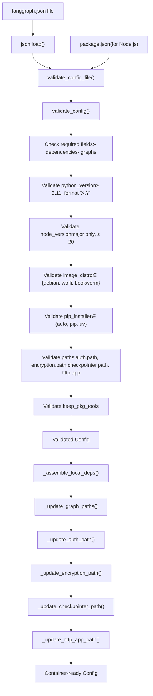
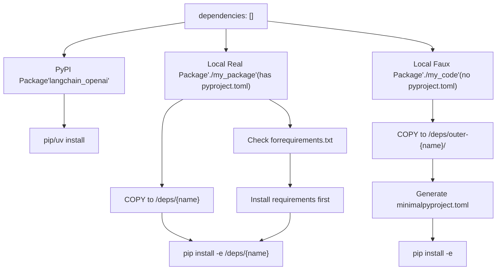
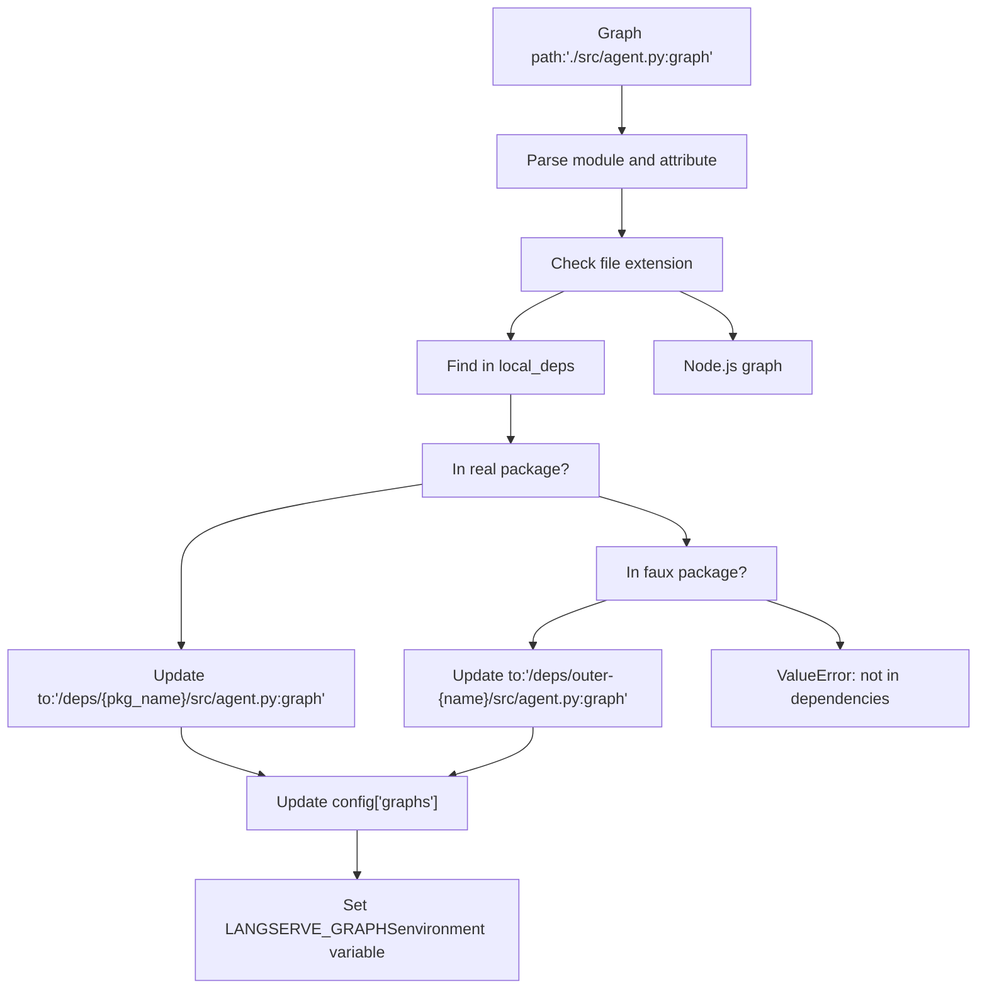
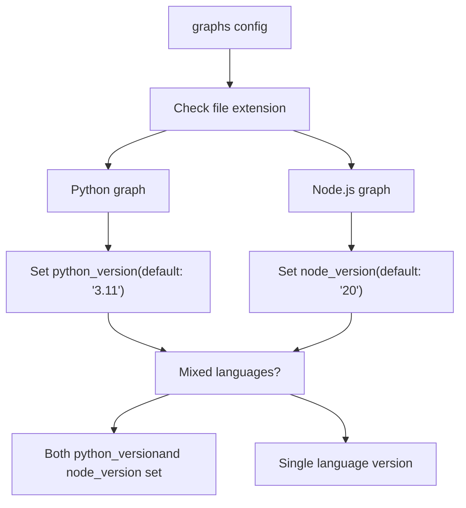

# 配置系统 (langgraph.json)

相关源文件

-   [.github/scripts/run\_langgraph\_cli\_test.py](https://github.com/langchain-ai/langgraph/blob/1fd51e8f/.github/scripts/run_langgraph_cli_test.py)
-   [libs/cli/README.md](https://github.com/langchain-ai/langgraph/blob/1fd51e8f/libs/cli/README.md?plain=1)
-   [libs/cli/examples/graph\_prerelease\_reqs/agent.py](https://github.com/langchain-ai/langgraph/blob/1fd51e8f/libs/cli/examples/graph_prerelease_reqs/agent.py)
-   [libs/cli/examples/graph\_prerelease\_reqs/deps/additional\_deps/pyproject.toml](https://github.com/langchain-ai/langgraph/blob/1fd51e8f/libs/cli/examples/graph_prerelease_reqs/deps/additional_deps/pyproject.toml)
-   [libs/cli/examples/graph\_prerelease\_reqs/deps/zuper\_deps/pyproject.toml](https://github.com/langchain-ai/langgraph/blob/1fd51e8f/libs/cli/examples/graph_prerelease_reqs/deps/zuper_deps/pyproject.toml)
-   [libs/cli/examples/graph\_prerelease\_reqs/langgraph.json](https://github.com/langchain-ai/langgraph/blob/1fd51e8f/libs/cli/examples/graph_prerelease_reqs/langgraph.json)
-   [libs/cli/examples/graph\_prerelease\_reqs/pyproject.toml](https://github.com/langchain-ai/langgraph/blob/1fd51e8f/libs/cli/examples/graph_prerelease_reqs/pyproject.toml)
-   [libs/cli/examples/graph\_prerelease\_reqs\_fail/agent.py](https://github.com/langchain-ai/langgraph/blob/1fd51e8f/libs/cli/examples/graph_prerelease_reqs_fail/agent.py)
-   [libs/cli/examples/graph\_prerelease\_reqs\_fail/langgraph.json](https://github.com/langchain-ai/langgraph/blob/1fd51e8f/libs/cli/examples/graph_prerelease_reqs_fail/langgraph.json)
-   [libs/cli/examples/graph\_prerelease\_reqs\_fail/pyproject.toml](https://github.com/langchain-ai/langgraph/blob/1fd51e8f/libs/cli/examples/graph_prerelease_reqs_fail/pyproject.toml)
-   [libs/cli/generate\_schema.py](https://github.com/langchain-ai/langgraph/blob/1fd51e8f/libs/cli/generate_schema.py)
-   [libs/cli/langgraph\_cli/\_\_init\_\_.py](https://github.com/langchain-ai/langgraph/blob/1fd51e8f/libs/cli/langgraph_cli/__init__.py)
-   [libs/cli/langgraph\_cli/cli.py](https://github.com/langchain-ai/langgraph/blob/1fd51e8f/libs/cli/langgraph_cli/cli.py)
-   [libs/cli/langgraph\_cli/config.py](https://github.com/langchain-ai/langgraph/blob/1fd51e8f/libs/cli/langgraph_cli/config.py)
-   [libs/cli/langgraph\_cli/helpers.py](https://github.com/langchain-ai/langgraph/blob/1fd51e8f/libs/cli/langgraph_cli/helpers.py)
-   [libs/cli/langgraph\_cli/host\_backend.py](https://github.com/langchain-ai/langgraph/blob/1fd51e8f/libs/cli/langgraph_cli/host_backend.py)
-   [libs/cli/langgraph\_cli/progress.py](https://github.com/langchain-ai/langgraph/blob/1fd51e8f/libs/cli/langgraph_cli/progress.py)
-   [libs/cli/langgraph\_cli/schemas.py](https://github.com/langchain-ai/langgraph/blob/1fd51e8f/libs/cli/langgraph_cli/schemas.py)
-   [libs/cli/langgraph\_cli/util.py](https://github.com/langchain-ai/langgraph/blob/1fd51e8f/libs/cli/langgraph_cli/util.py)
-   [libs/cli/pyproject.toml](https://github.com/langchain-ai/langgraph/blob/1fd51e8f/libs/cli/pyproject.toml)
-   [libs/cli/python-monorepo-example/pyproject.toml](https://github.com/langchain-ai/langgraph/blob/1fd51e8f/libs/cli/python-monorepo-example/pyproject.toml)
-   [libs/cli/schemas/schema.json](https://github.com/langchain-ai/langgraph/blob/1fd51e8f/libs/cli/schemas/schema.json)
-   [libs/cli/schemas/schema.v0.json](https://github.com/langchain-ai/langgraph/blob/1fd51e8f/libs/cli/schemas/schema.v0.json)
-   [libs/cli/tests/unit\_tests/cli/test\_cli.py](https://github.com/langchain-ai/langgraph/blob/1fd51e8f/libs/cli/tests/unit_tests/cli/test_cli.py)
-   [libs/cli/tests/unit\_tests/test\_config.py](https://github.com/langchain-ai/langgraph/blob/1fd51e8f/libs/cli/tests/unit_tests/test_config.py)
-   [libs/cli/tests/unit\_tests/test\_deploy\_helpers.py](https://github.com/langchain-ai/langgraph/blob/1fd51e8f/libs/cli/tests/unit_tests/test_deploy_helpers.py)
-   [libs/cli/tests/unit\_tests/test\_host\_backend.py](https://github.com/langchain-ai/langgraph/blob/1fd51e8f/libs/cli/tests/unit_tests/test_host_backend.py)
-   [libs/cli/tests/unit\_tests/test\_logs\_helpers.py](https://github.com/langchain-ai/langgraph/blob/1fd51e8f/libs/cli/tests/unit_tests/test_logs_helpers.py)
-   [libs/cli/tests/unit\_tests/test\_util.py](https://github.com/langchain-ai/langgraph/blob/1fd51e8f/libs/cli/tests/unit_tests/test_util.py)
-   [libs/cli/uv.lock](https://github.com/langchain-ai/langgraph/blob/1fd51e8f/libs/cli/uv.lock)

`langgraph.json` 配置文件是 LangGraph CLI 命令的核心控制机制。它声明依赖项、图定义、运行时设置和部署参数，`langgraph build`、`langgraph up`、`langgraph dev` 和 `langgraph deploy` 命令会使用这些参数来构建 Docker 镜像并配置 LangGraph API 服务器。

有关使用此配置的 CLI 命令信息，请参见 [6.1](https://github.com/langchain-ai/langgraph/blob/1fd51e8f/6.1) 有关 Dockerfile 生成流程的信息，请参见 [6.3](https://github.com/langchain-ai/langgraph/blob/1fd51e8f/6.3)

---

## 配置文件结构

`langgraph.json` 文件采用包含必填字段和可选字段的 JSON 结构。该配置由 `validate_config_file()` 和 `validate_config()` 函数加载并校验。

### 必填字段

| 字段 | 类型 | 说明 |
| --- | --- | --- |
| `dependencies` | `array[string]` | 包依赖。可以是 PyPI 包名（例如 `"langchain_openai"`）或以 `"."` 开头的本地路径（例如 `"./my_package"`） |
| `graphs` | `object` | 从图 ID 到图位置的映射。值可以是格式为 `"./path/to/file.py:attribute"` 的字符串，或包含 `path` 键的对象 |

### 可选字段

| 字段 | 类型 | 默认值 | 说明 |
| --- | --- | --- | --- |
| `python_version` | `string` | `"3.11"` | Python 版本：`"3.11"`、`"3.12"` 或 `"3.13"`。格式必须为 `major.minor` |
| `node_version` | `string` | `"20"`（检测到 Node.js 图时） | Node.js 主版本号：`"20"`、`"22"` 等。必须仅为主版本 |
| `pip_installer` | `string` | `"auto"` | 包安装器：`"auto"`、`"pip"` 或 `"uv"` |
| `pip_config_file` | `string` | `null` | pip 配置文件路径 |
| `base_image` | `string` | `null` | 用于覆盖默认值的自定义基础 Docker 镜像 |
| `image_distro` | `string` | `"debian"` | 基础镜像发行版：`"debian"`、`"wolfi"` 或 `"bookworm"` |
| `dockerfile_lines` | `array[string]` | `[]` | 在基础镜像之后插入的额外 Dockerfile 命令 |
| `env` | `string | object` | `{}` | `.env` 文件路径，或将环境变量名映射到值的对象 |
| `auth` | `object` | `null` | 认证配置。可包含格式为 `"./file.py:attribute"` 的 `path` 字段 |
| `encryption` | `object` | `null` | 加密配置。可包含格式为 `"./file.py:attribute"` 的 `path` 字段 |
| `checkpointer` | `string | object` | `null` | Checkpointer 配置。对象可包含格式为 `"./file.py:attribute"` 的 `path` 字段 |
| `http` | `object` | `null` | HTTP 应用配置。可包含格式为 `"./file.py:attribute"` 的 `app` 字段 |
| `store` | `object` | `null` | Store 配置 |
| `webhooks` | `object` | `null` | Webhooks 配置 |
| `ui` | `string` | `null` | UI 配置 |
| `ui_config` | `object` | `null` | UI 配置对象 |
| `keep_pkg_tools` | `bool | array[string]` | `null` | 在最终镜像中保留构建工具。`true` 表示全部保留，数组可指定具体工具（`"pip"`、`"setuptools"`、`"wheel"`） |
| `api_version` | `string` | `null` | 用于基础镜像的特定 API 服务器版本 |

**来源：** [libs/cli/langgraph\_cli/config.py142-214](https://github.com/langchain-ai/langgraph/blob/1fd51e8f/libs/cli/langgraph_cli/config.py#L142-L214) [libs/cli/tests/unit\_tests/test\_config.py33-151](https://github.com/langchain-ai/langgraph/blob/1fd51e8f/libs/cli/tests/unit_tests/test_config.py#L33-L151) [libs/cli/schemas/schema.json12-195](https://github.com/langchain-ai/langgraph/blob/1fd51e8f/libs/cli/schemas/schema.json#L12-L195)

---

## 配置加载与校验流程


**校验流程：**

1.  **`validate_config_file()`** 加载 JSON 文件并调用 **`validate_config()`** [libs/cli/langgraph\_cli/config.py309-349](https://github.com/langchain-ai/langgraph/blob/1fd51e8f/libs/cli/langgraph_cli/config.py#L309-L349)
2.  对于 Node.js 项目，会检查 **`package.json`** 以确保 `engines.node` 兼容 [libs/cli/langgraph\_cli/config.py317-328](https://github.com/langchain-ai/langgraph/blob/1fd51e8f/libs/cli/langgraph_cli/config.py#L317-L328)
3.  强制要求必填字段（`dependencies`、`graphs`） [libs/cli/langgraph\_cli/config.py237-243](https://github.com/langchain-ai/langgraph/blob/1fd51e8f/libs/cli/langgraph_cli/config.py#L237-L243)
4.  解析版本字符串并根据最低要求进行校验 [libs/cli/langgraph\_cli/config.py202-235](https://github.com/langchain-ai/langgraph/blob/1fd51e8f/libs/cli/langgraph_cli/config.py#L202-L235)
5.  校验路径字段（auth、encryption 等）是否使用 `"./path:attribute"` 格式 [libs/cli/langgraph\_cli/config.py268-306](https://github.com/langchain-ai/langgraph/blob/1fd51e8f/libs/cli/langgraph_cli/config.py#L268-L306)
6.  对配置进行标准化并填充默认值 [libs/cli/langgraph\_cli/config.py175-201](https://github.com/langchain-ai/langgraph/blob/1fd51e8f/libs/cli/langgraph_cli/config.py#L175-L201)

**来源：** [libs/cli/langgraph\_cli/config.py142-307](https://github.com/langchain-ai/langgraph/blob/1fd51e8f/libs/cli/langgraph_cli/config.py#L142-L307) [libs/cli/langgraph\_cli/config.py309-349](https://github.com/langchain-ai/langgraph/blob/1fd51e8f/libs/cli/langgraph_cli/config.py#L309-L349)

---

## 依赖管理

`dependencies` 数组支持三种依赖类型：

### 依赖类型


### LocalDeps 数据结构

`_assemble_local_deps()` 函数会处理本地依赖，并返回一个 `LocalDeps` 命名元组 [libs/cli/langgraph\_cli/config.py352-525](https://github.com/langchain-ai/langgraph/blob/1fd51e8f/libs/cli/langgraph_cli/config.py#L352-L525)：

| 字段 | 类型 | 说明 |
| --- | --- | --- |
| `pip_reqs` | `list[tuple[Path, str]]` | requirements 文件：`(host_path, container_path)` 元组 |
| `real_pkgs` | `dict[Path, tuple[str, str]]` | 真实包：`host_path -> (dependency_string, container_name)` |
| `faux_pkgs` | `dict[Path, tuple[str, str]]` | 伪包：`host_path -> (dependency_string, container_path)` |
| `working_dir` | `str | None` | 当 `"."` 出现在 dependencies 中时的容器工作目录 |
| `additional_contexts` | `list[Path]` | 构建上下文所需、且位于配置目录之外的路径 |

**真实包（Real Packages）：** 包含 `pyproject.toml` 或 `setup.py` 的目录。这些目录会被复制到 `/deps/{name}` 并通过 `pip install -e` 安装。

**伪包（Faux Packages）：** 不包含打包元数据的目录。CLI 会生成最小化的 `pyproject.toml` 以使其可被 pip 安装 [libs/cli/langgraph\_cli/config.py469-495](https://github.com/langchain-ai/langgraph/blob/1fd51e8f/libs/cli/langgraph_cli/config.py#L469-L495)

**来源：** [libs/cli/langgraph\_cli/config.py352-525](https://github.com/langchain-ai/langgraph/blob/1fd51e8f/libs/cli/langgraph_cli/config.py#L352-L525) [libs/cli/tests/unit\_tests/test\_config.py425-690](https://github.com/langchain-ai/langgraph/blob/1fd51e8f/libs/cli/tests/unit_tests/test_config.py#L425-L690)

---

## 图规范

图在 `graphs` 对象中定义，以图 ID 作为键。值用于指定编译后图对象所在的位置。

### 图路径格式

**字符串格式：**

```
{  "graphs": {    "my_agent": "./src/agent.py:graph"  }}
```
**对象格式：**

```
{  "graphs": {    "my_agent": {      "path": "./src/agent.py:graph",      "description": "My custom agent"    }  }}
```
路径格式为 `<module>:<attribute>`：

-   **Module：** 文件路径（`.py`、`.js`、`.ts` 等）或 Python 模块名 [libs/cli/langgraph\_cli/config.py124-140](https://github.com/langchain-ai/langgraph/blob/1fd51e8f/libs/cli/langgraph_cli/config.py#L124-L140)
-   **Attribute：** 该模块中图变量/函数的名称。

### 面向容器的路径解析


`_update_graph_paths()` 函数会将本地文件路径改写为容器路径 [libs/cli/langgraph\_cli/config.py528-626](https://github.com/langchain-ai/langgraph/blob/1fd51e8f/libs/cli/langgraph_cli/config.py#L528-L626)

**来源：** [libs/cli/langgraph\_cli/config.py528-626](https://github.com/langchain-ai/langgraph/blob/1fd51e8f/libs/cli/langgraph_cli/config.py#L528-L626) [libs/cli/tests/unit\_tests/test\_config.py614-650](https://github.com/langchain-ai/langgraph/blob/1fd51e8f/libs/cli/tests/unit_tests/test_config.py#L614-L650)

---

## 环境变量

`env` 字段支持两种指定环境变量的格式：

### 直接对象格式

```
{  "env": {    "OPENAI_API_KEY": "sk-...",    "LANGCHAIN_TRACING_V2": "true"  }}
```
### .env 文件引用

```
{  "env": "./.env"}
```
### 环境变量解析

CLI 中的 `_parse_env_from_config()` 函数按如下优先级解析环境变量 [libs/cli/langgraph\_cli/cli.py116-127](https://github.com/langchain-ai/langgraph/blob/1fd51e8f/libs/cli/langgraph_cli/cli.py#L116-L127)：

1.  如果 `env` 是带有值的对象 → 直接使用。
2.  如果 `env` 是字符串 → 从对应 `.env` 文件加载。
3.  如果 `env` 缺失或为空 `{}` → 从当前目录的 `./.env` 加载（若存在）。

**保留环境变量：** 在部署期间，CLI 会过滤保留环境变量（如 `LANGCHAIN_API_KEY`、`POSTGRES_URI`），以避免与系统管理值冲突 [libs/cli/langgraph\_cli/cli.py41-86](https://github.com/langchain-ai/langgraph/blob/1fd51e8f/libs/cli/langgraph_cli/cli.py#L41-L86)

**来源：** [libs/cli/langgraph\_cli/cli.py37-127](https://github.com/langchain-ai/langgraph/blob/1fd51e8f/libs/cli/langgraph_cli/cli.py#L37-L127) [libs/cli/langgraph\_cli/config.py185](https://github.com/langchain-ai/langgraph/blob/1fd51e8f/libs/cli/langgraph_cli/config.py#L185-L185)

---

## Python 与 Node.js 支持

LangGraph 同时支持 Python 和 Node.js 图。CLI 会基于文件扩展名自动检测语言 [libs/cli/langgraph\_cli/config.py147-148](https://github.com/langchain-ai/langgraph/blob/1fd51e8f/libs/cli/langgraph_cli/config.py#L147-L148)

### 语言检测


**来源：** [libs/cli/langgraph\_cli/config.py14-16](https://github.com/langchain-ai/langgraph/blob/1fd51e8f/libs/cli/langgraph_cli/config.py#L14-L16) [libs/cli/langgraph\_cli/config.py47-49](https://github.com/langchain-ai/langgraph/blob/1fd51e8f/libs/cli/langgraph_cli/config.py#L47-L49) [libs/cli/langgraph\_cli/config.py124-140](https://github.com/langchain-ai/langgraph/blob/1fd51e8f/libs/cli/langgraph_cli/config.py#L124-L140) [libs/cli/langgraph\_cli/config.py142-174](https://github.com/langchain-ai/langgraph/blob/1fd51e8f/libs/cli/langgraph_cli/config.py#L142-L174)

---

## Docker 镜像配置

该配置通过多个字段控制 Docker 镜像生成。

### 基础镜像选择

`base_image` 字段会覆盖默认基础镜像 [libs/cli/langgraph\_cli/config.py180](https://github.com/langchain-ai/langgraph/blob/1fd51e8f/libs/cli/langgraph_cli/config.py#L180-L180) 若未指定，则会根据检测到的语言选择默认值 [libs/cli/langgraph\_cli/config.py870-884](https://github.com/langchain-ai/langgraph/blob/1fd51e8f/libs/cli/langgraph_cli/config.py#L870-L884)

### 镜像发行版

`image_distro` 字段用于选择基础 Linux 发行版 [libs/cli/langgraph\_cli/config.py181](https://github.com/langchain-ai/langgraph/blob/1fd51e8f/libs/cli/langgraph_cli/config.py#L181-L181)

-   `"debian"`：默认值。
-   `"wolfi"`：面向安全的最小化发行版 [libs/cli/langgraph\_cli/util.py35-54](https://github.com/langchain-ai/langgraph/blob/1fd51e8f/libs/cli/langgraph_cli/util.py#L35-L54)
-   `"bookworm"`：Debian Bookworm 版本。

### 包安装器选择

`pip_installer` 字段控制由哪个工具安装 Python 包 [libs/cli/langgraph\_cli/config.py179](https://github.com/langchain-ai/langgraph/blob/1fd51e8f/libs/cli/langgraph_cli/config.py#L179-L179) 可选值为 `"auto"`、`"pip"` 或 `"uv"`。在受支持的基础镜像上，默认会使用 `uv` 安装器以获得更高性能 [libs/cli/langgraph\_cli/config.py902-906](https://github.com/langchain-ai/langgraph/blob/1fd51e8f/libs/cli/langgraph_cli/config.py#L902-L906)

### 构建工具清理

`keep_pkg_tools` 字段用于控制最终镜像中保留哪些打包工具（pip、setuptools、wheel） [libs/cli/langgraph\_cli/config.py195](https://github.com/langchain-ai/langgraph/blob/1fd51e8f/libs/cli/langgraph_cli/config.py#L195-L195) 默认会移除构建工具以减小镜像体积 [libs/cli/langgraph\_cli/config.py56-99](https://github.com/langchain-ai/langgraph/blob/1fd51e8f/libs/cli/langgraph_cli/config.py#L56-L99)

**来源：** [libs/cli/langgraph\_cli/config.py47-99](https://github.com/langchain-ai/langgraph/blob/1fd51e8f/libs/cli/langgraph_cli/config.py#L47-L99) [libs/cli/langgraph\_cli/config.py175-201](https://github.com/langchain-ai/langgraph/blob/1fd51e8f/libs/cli/langgraph_cli/config.py#L175-L201) [libs/cli/langgraph\_cli/util.py35-54](https://github.com/langchain-ai/langgraph/blob/1fd51e8f/libs/cli/langgraph_cli/util.py#L35-L54)

---

## 面向容器部署的路径解析

构建 Docker 镜像时，本地文件路径会被转换为容器路径。

### 路径更新函数

每个包含本地文件引用的配置字段都会通过专用函数更新其路径：

-   `_update_graph_paths()` [libs/cli/langgraph\_cli/config.py528-626](https://github.com/langchain-ai/langgraph/blob/1fd51e8f/libs/cli/langgraph_cli/config.py#L528-L626)
-   `_update_auth_path()` [libs/cli/langgraph\_cli/config.py628-666](https://github.com/langchain-ai/langgraph/blob/1fd51e8f/libs/cli/langgraph_cli/config.py#L628-L666)
-   `_update_encryption_path()` [libs/cli/langgraph\_cli/config.py669-709](https://github.com/langchain-ai/langgraph/blob/1fd51e8f/libs/cli/langgraph_cli/config.py#L669-L709)
-   `_update_checkpointer_path()` [libs/cli/langgraph\_cli/config.py712-754](https://github.com/langchain-ai/langgraph/blob/1fd51e8f/libs/cli/langgraph_cli/config.py#L712-L754)
-   `_update_http_app_path()` [libs/cli/langgraph\_cli/config.py757-808](https://github.com/langchain-ai/langgraph/blob/1fd51e8f/libs/cli/langgraph_cli/config.py#L757-L808)

**路径转换示例：**

-   Host: `./src/agent.py:graph`
-   Container: `/deps/outer-my_pkg/src/agent.py:graph`

**来源：** [libs/cli/langgraph\_cli/config.py528-808](https://github.com/langchain-ai/langgraph/blob/1fd51e8f/libs/cli/langgraph_cli/config.py#L528-L808)

---

## 配置校验错误处理

对于无效配置，校验函数会抛出 `click.UsageError` [libs/cli/langgraph\_cli/config.py142-307](https://github.com/langchain-ai/langgraph/blob/1fd51e8f/libs/cli/langgraph_cli/config.py#L142-L307)：

| 错误条件 | 错误信息 |
| --- | --- |
| Python 版本 < 3.11 | `"Minimum required version is 3.11"` |
| Python 版本格式错误 | `"Invalid Python version format"` |
| Node.js 版本 < 20 | `"Node.js version ... is not supported"` |
| 无效的 image\_distro | `"Invalid image_distro: '{distro}'"` |
| Bullseye 已弃用 | `"Bullseye images were deprecated"` |

**来源：** [libs/cli/langgraph\_cli/config.py142-307](https://github.com/langchain-ai/langgraph/blob/1fd51e8f/libs/cli/langgraph_cli/config.py#L142-L307) [libs/cli/tests/unit\_tests/test\_config.py96-123](https://github.com/langchain-ai/langgraph/blob/1fd51e8f/libs/cli/tests/unit_tests/test_config.py#L96-L123)
