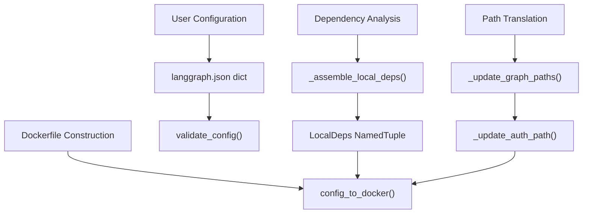
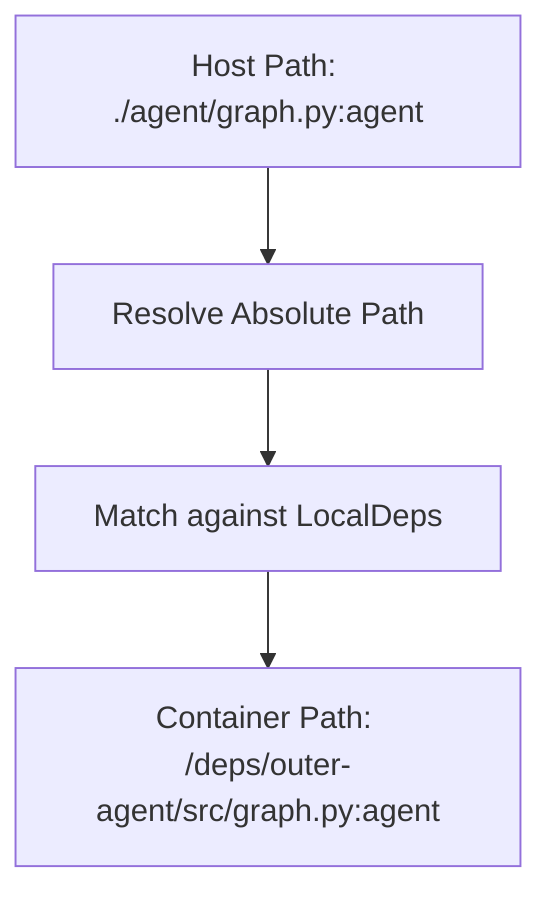

# Docker 镜像生成

相关源文件

-   [libs/cli/README.md](https://github.com/langchain-ai/langgraph/blob/1fd51e8f/libs/cli/README.md?plain=1)
-   [libs/cli/examples/my\_app.py](https://github.com/langchain-ai/langgraph/blob/1fd51e8f/libs/cli/examples/my_app.py)
-   [libs/cli/langgraph\_cli/\_\_init\_\_.py](https://github.com/langchain-ai/langgraph/blob/1fd51e8f/libs/cli/langgraph_cli/__init__.py)
-   [libs/cli/langgraph\_cli/cli.py](https://github.com/langchain-ai/langgraph/blob/1fd51e8f/libs/cli/langgraph_cli/cli.py)
-   [libs/cli/langgraph\_cli/config.py](https://github.com/langchain-ai/langgraph/blob/1fd51e8f/libs/cli/langgraph_cli/config.py)
-   [libs/cli/langgraph\_cli/docker.py](https://github.com/langchain-ai/langgraph/blob/1fd51e8f/libs/cli/langgraph_cli/docker.py)
-   [libs/cli/langgraph\_cli/exec.py](https://github.com/langchain-ai/langgraph/blob/1fd51e8f/libs/cli/langgraph_cli/exec.py)
-   [libs/cli/langgraph\_cli/helpers.py](https://github.com/langchain-ai/langgraph/blob/1fd51e8f/libs/cli/langgraph_cli/helpers.py)
-   [libs/cli/langgraph\_cli/host\_backend.py](https://github.com/langchain-ai/langgraph/blob/1fd51e8f/libs/cli/langgraph_cli/host_backend.py)
-   [libs/cli/langgraph\_cli/progress.py](https://github.com/langchain-ai/langgraph/blob/1fd51e8f/libs/cli/langgraph_cli/progress.py)
-   [libs/cli/langgraph\_cli/util.py](https://github.com/langchain-ai/langgraph/blob/1fd51e8f/libs/cli/langgraph_cli/util.py)
-   [libs/cli/pyproject.toml](https://github.com/langchain-ai/langgraph/blob/1fd51e8f/libs/cli/pyproject.toml)
-   [libs/cli/tests/unit\_tests/agent.py](https://github.com/langchain-ai/langgraph/blob/1fd51e8f/libs/cli/tests/unit_tests/agent.py)
-   [libs/cli/tests/unit\_tests/cli/test\_cli.py](https://github.com/langchain-ai/langgraph/blob/1fd51e8f/libs/cli/tests/unit_tests/cli/test_cli.py)
-   [libs/cli/tests/unit\_tests/graphs/agent.py](https://github.com/langchain-ai/langgraph/blob/1fd51e8f/libs/cli/tests/unit_tests/graphs/agent.py)
-   [libs/cli/tests/unit\_tests/pipconfig.txt](https://github.com/langchain-ai/langgraph/blob/1fd51e8f/libs/cli/tests/unit_tests/pipconfig.txt)
-   [libs/cli/tests/unit\_tests/test\_config.json](https://github.com/langchain-ai/langgraph/blob/1fd51e8f/libs/cli/tests/unit_tests/test_config.json)
-   [libs/cli/tests/unit\_tests/test\_config.py](https://github.com/langchain-ai/langgraph/blob/1fd51e8f/libs/cli/tests/unit_tests/test_config.py)
-   [libs/cli/tests/unit\_tests/test\_deploy\_helpers.py](https://github.com/langchain-ai/langgraph/blob/1fd51e8f/libs/cli/tests/unit_tests/test_deploy_helpers.py)
-   [libs/cli/tests/unit\_tests/test\_docker.py](https://github.com/langchain-ai/langgraph/blob/1fd51e8f/libs/cli/tests/unit_tests/test_docker.py)
-   [libs/cli/tests/unit\_tests/test\_host\_backend.py](https://github.com/langchain-ai/langgraph/blob/1fd51e8f/libs/cli/tests/unit_tests/test_host_backend.py)
-   [libs/cli/tests/unit\_tests/test\_logs\_helpers.py](https://github.com/langchain-ai/langgraph/blob/1fd51e8f/libs/cli/tests/unit_tests/test_logs_helpers.py)
-   [libs/cli/tests/unit\_tests/test\_util.py](https://github.com/langchain-ai/langgraph/blob/1fd51e8f/libs/cli/tests/unit_tests/test_util.py)
-   [libs/cli/uv.lock](https://github.com/langchain-ai/langgraph/blob/1fd51e8f/libs/cli/uv.lock)

本文档介绍 LangGraph CLI 中的 Dockerfile 生成系统，该系统会将 `langgraph.json` 配置转换为可部署的 Docker 镜像。该系统会分析本地依赖、生成合适的构建指令，并产出可由 `langgraph build` 或 `langgraph dockerfile` 命令使用的 Dockerfile。

关于 CLI 命令整体结构，请参见 [CLI Commands (6.1)](https://github.com/langchain-ai/langgraph/blob/1fd51e8f/CLI Commands (6.1)) 关于配置模式与校验，请参见 [Configuration System (6.2)](https://github.com/langchain-ai/langgraph/blob/1fd51e8f/Configuration System (6.2)) 关于本地开发工作流，请参见 [Local Development Server (6.5)](https://github.com/langchain-ai/langgraph/blob/1fd51e8f/Local Development Server (6.5))

## 概览

Docker 镜像生成系统会将声明式配置转换为命令式 Docker 构建指令。它处理以下若干复杂场景：

-   **本地依赖打包**：区分带有元数据（`pyproject.toml`/`setup.py`）的 Python 包与无元数据目录，并为后者生成最小打包元数据。
-   **路径改写**：将主机文件系统路径转换为容器路径，用于图定义、认证模块和加密处理器。
-   **多上下文构建**：当依赖位于配置目录之外时，管理 Docker 构建上下文。
-   **包安装器选择**：根据基础镜像能力在 `pip` 与 `uv` 之间进行选择。
-   **清理优化**：从最终镜像中移除构建工具以减小体积。

主要入口是 `config_to_docker()`，它负责编排完整生成流程。

**来源**: [libs/cli/langgraph\_cli/config.py822](https://github.com/langchain-ai/langgraph/blob/1fd51e8f/libs/cli/langgraph_cli/config.py#L822-L822) [libs/cli/langgraph\_cli/config.py1077](https://github.com/langchain-ai/langgraph/blob/1fd51e8f/libs/cli/langgraph_cli/config.py#L1077-L1077)

## 配置到 Dockerfile 的流程

下图将构建流程中的自然语言需求映射到负责执行的具体代码实体。

### 逻辑流：自然语言到代码实体空间


**来源**: [libs/cli/langgraph\_cli/config.py142](https://github.com/langchain-ai/langgraph/blob/1fd51e8f/libs/cli/langgraph_cli/config.py#L142-L142) [libs/cli/langgraph\_cli/config.py311](https://github.com/langchain-ai/langgraph/blob/1fd51e8f/libs/cli/langgraph_cli/config.py#L311-L311) [libs/cli/langgraph\_cli/config.py487](https://github.com/langchain-ai/langgraph/blob/1fd51e8f/libs/cli/langgraph_cli/config.py#L487-L487) [libs/cli/langgraph\_cli/config.py822](https://github.com/langchain-ai/langgraph/blob/1fd51e8f/libs/cli/langgraph_cli/config.py#L822-L822)

## 本地依赖分类

系统将本地依赖（以 `.` 开头的依赖）划分为三种类型：

| 类型 | 检测方式 | 处理方式 | 容器路径 |
| --- | --- | --- | --- |
| **真实包（Real Package）** | 包含 `pyproject.toml` 或 `setup.py` | 直接通过 pip 安装 | `/deps/<name>` |
| **伪包（Faux Package）** | 无元数据文件，但有 Python 文件 | 生成最小 `pyproject.toml` | `/deps/outer-<name>/<name>` 或 `/deps/outer-<name>/src` |
| **Requirements 文件** | 伪包中存在 `requirements.txt` | 在安装包之前先安装依赖 | 与包一起复制 |

### LocalDeps 结构

`LocalDeps` NamedTuple 封装了依赖分析结果：

```
class LocalDeps(NamedTuple):    pip_reqs: list[tuple[pathlib.Path, str]]  # (host_path, container_path)    real_pkgs: dict[pathlib.Path, tuple[str, str]]  # host_path -> (dep_string, container_name)    faux_pkgs: dict[pathlib.Path, tuple[str, str]]  # host_path -> (dep_string, container_path)    working_dir: str | None  # If "." in dependencies    additional_contexts: list[pathlib.Path]  # Dirs in parent directories
```
**来源**: [libs/cli/langgraph\_cli/config.py311-317](https://github.com/langchain-ai/langgraph/blob/1fd51e8f/libs/cli/langgraph_cli/config.py#L311-L317)

### 真实包处理

真实包会被直接复制，并以可编辑模式通过 pip/uv 安装：

```
# Example generated instructionADD ./my_package /deps/my_packageRUN for dep in /deps/*; do \    (cd "$dep" && PYTHONDONTWRITEBYTECODE=1 uv pip install --system --no-cache-dir -c /api/constraints.txt -e .); \done
```
**来源**: [libs/cli/langgraph\_cli/config.py424-440](https://github.com/langchain-ai/langgraph/blob/1fd51e8f/libs/cli/langgraph_cli/config.py#L424-L440) [libs/cli/langgraph\_cli/config.py913-922](https://github.com/langchain-ai/langgraph/blob/1fd51e8f/libs/cli/langgraph_cli/config.py#L913-L922)

### 伪包处理

伪包需要合成的打包元数据。系统会使用 `setuptools` 作为后端生成最小 `pyproject.toml`。

**Flat 与 Src 布局**：如果根目录存在 `__init__.py`，则使用 flat 布局（`/deps/outer-<name>/<name>`）。否则视为 src 布局（`/deps/outer-<name>/src`）。

**来源**: [libs/cli/langgraph\_cli/config.py441-483](https://github.com/langchain-ai/langgraph/blob/1fd51e8f/libs/cli/langgraph_cli/config.py#L441-L483) [libs/cli/langgraph\_cli/config.py893-913](https://github.com/langchain-ai/langgraph/blob/1fd51e8f/libs/cli/langgraph_cli/config.py#L893-L913)

## 路径改写系统

`langgraph.json` 中的主机文件系统路径必须转换为容器路径。系统会改写四类路径，以确保 API 服务器能在镜像内定位代码。

### 路径转换映射

| 源配置键 | 转换函数 | 代码定位 |
| --- | --- | --- |
| `graphs` | `_update_graph_paths()` | [libs/cli/langgraph\_cli/config.py487](https://github.com/langchain-ai/langgraph/blob/1fd51e8f/libs/cli/langgraph_cli/config.py#L487-L487) |
| `auth` | `_update_auth_path()` | [libs/cli/langgraph\_cli/config.py587](https://github.com/langchain-ai/langgraph/blob/1fd51e8f/libs/cli/langgraph_cli/config.py#L587-L587) |
| `encryption` | `_update_encryption_path()` | [libs/cli/langgraph\_cli/config.py628](https://github.com/langchain-ai/langgraph/blob/1fd51e8f/libs/cli/langgraph_cli/config.py#L628-L628) |
| `http.app` | `_update_http_app_path()` | [libs/cli/langgraph\_cli/config.py671](https://github.com/langchain-ai/langgraph/blob/1fd51e8f/libs/cli/langgraph_cli/config.py#L671-L671) |

### 路径解析逻辑


**来源**: [libs/cli/langgraph\_cli/config.py487-722](https://github.com/langchain-ai/langgraph/blob/1fd51e8f/libs/cli/langgraph_cli/config.py#L487-L722)

## 包安装器选择

系统支持 `pip` 和 `uv`，并基于基础镜像版本自动选择。

| 模式 | 行为 |
| --- | --- |
| `auto` | 若基础镜像版本 ≥ `0.2.47`，使用 `uv`，否则使用 `pip`。 |
| `pip` | 强制使用传统 `pip` 安装器。 |
| `uv` | 强制使用 `uv` 安装器。 |

`_image_supports_uv` 函数会对基础镜像标签进行正则匹配，以判断版本兼容性。

**来源**: [libs/cli/langgraph\_cli/config.py787-799](https://github.com/langchain-ai/langgraph/blob/1fd51e8f/libs/cli/langgraph_cli/config.py#L787-L799) [libs/cli/langgraph\_cli/config.py829-841](https://github.com/langchain-ai/langgraph/blob/1fd51e8f/libs/cli/langgraph_cli/config.py#L829-L841)

## 构建上下文管理

当本地依赖位于配置目录之外（例如 `../shared_lib`）时，Docker 无法通过标准构建上下文访问它们。系统会使用 Docker 的 `additional_contexts` 功能。

CLI 会识别父路径中的目录并分配上下文名称（例如 `cli_1`）。在生成的 Dockerfile 中，这些上下文通过 `COPY --from=<context_name>` 访问。

**来源**: [libs/cli/langgraph\_cli/config.py419-423](https://github.com/langchain-ai/langgraph/blob/1fd51e8f/libs/cli/langgraph_cli/config.py#L419-L423) [libs/cli/tests/unit\_tests/cli/test\_cli.py142-143](https://github.com/langchain-ai/langgraph/blob/1fd51e8f/libs/cli/tests/unit_tests/cli/test_cli.py#L142-L143)

## 构建工具清理

为最小化镜像体积，系统会移除构建依赖（pip、setuptools、wheel），除非通过 `keep_pkg_tools` 显式保留。

### 清理实现

`_get_pip_cleanup_lines` 函数会生成用于卸载的 `RUN` 命令。它会同时处理标准 Python site-packages 路径和 Wolfi 特有路径（`/usr/lib/python*/site-packages/`）。

```
def _get_pip_cleanup_lines(    install_cmd: str,    to_uninstall: tuple[str] | None,    pip_installer: Literal["uv", "pip"],) -> str:    # ... logic to generate RUN pip uninstall and rm -rf ...
```
**来源**: [libs/cli/langgraph\_cli/config.py56-99](https://github.com/langchain-ai/langgraph/blob/1fd51e8f/libs/cli/langgraph_cli/config.py#L56-L99)

## 多平台与发行版选择

CLI 支持为不同 Linux 发行版生成镜像，并强烈建议使用 **Wolfi Linux**，因为其安全姿态更好。

-   **默认发行版**: `debian` [libs/cli/langgraph\_cli/config.py50](https://github.com/langchain-ai/langgraph/blob/1fd51e8f/libs/cli/langgraph_cli/config.py#L50-L50)
-   **安全建议**: 如果 `image_distro` 不是 `wolfi`，CLI 会通过 `warn_non_wolfi_distro()` 发出警告 [libs/cli/langgraph\_cli/util.py10-27](https://github.com/langchain-ai/langgraph/blob/1fd51e8f/libs/cli/langgraph_cli/util.py#L10-L27)
-   **Python 版本**: 支持 `3.11`、`3.12` 和 `3.13` [libs/cli/langgraph\_cli/config.py47-48](https://github.com/langchain-ai/langgraph/blob/1fd51e8f/libs/cli/langgraph_cli/config.py#L47-L48)

### 标签生成逻辑

`docker_tag()` 函数会根据语言运行时（Python vs Node.js）、版本和发行版构造最终镜像标签。

**来源**: [libs/cli/langgraph\_cli/config.py1443-1480](https://github.com/langchain-ai/langgraph/blob/1fd51e8f/libs/cli/langgraph_cli/config.py#L1443-L1480)

## Node.js 支持

如果 `graphs` 配置指向 `.js` 或 `.ts` 文件，CLI 会切换到 Node.js 镜像生成流程。

-   **基础镜像**: `langchain/langgraphjs-api` [libs/cli/langgraph\_cli/config.py1127](https://github.com/langchain-ai/langgraph/blob/1fd51e8f/libs/cli/langgraph_cli/config.py#L1127-L1127)
-   **包管理器**: 通过检测对应锁文件支持 `npm`、`yarn`、`pnpm` 和 `bun` [libs/cli/langgraph\_cli/config.py724-782](https://github.com/langchain-ai/langgraph/blob/1fd51e8f/libs/cli/langgraph_cli/config.py#L724-L782)

**来源**: [libs/cli/langgraph\_cli/config.py124-141](https://github.com/langchain-ai/langgraph/blob/1fd51e8f/libs/cli/langgraph_cli/config.py#L124-L141) [libs/cli/langgraph\_cli/config.py1079-1257](https://github.com/langchain-ai/langgraph/blob/1fd51e8f/libs/cli/langgraph_cli/config.py#L1079-L1257)
