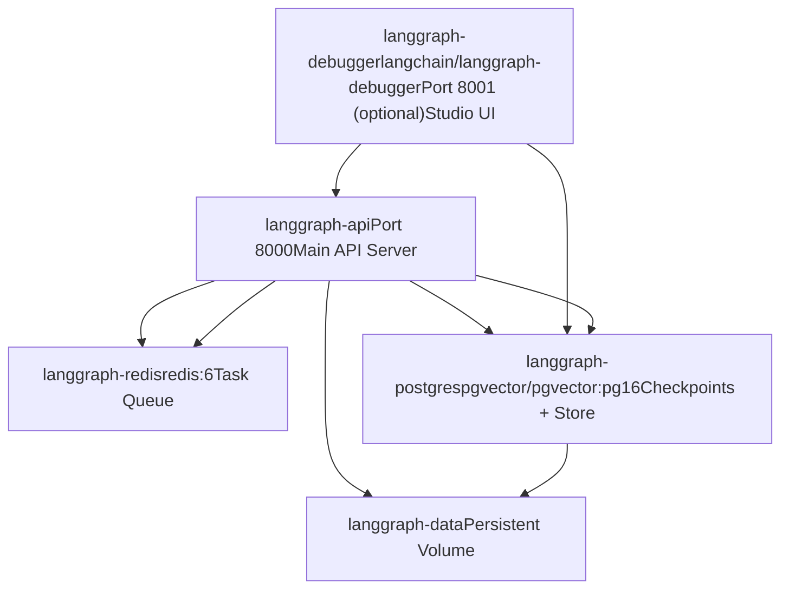
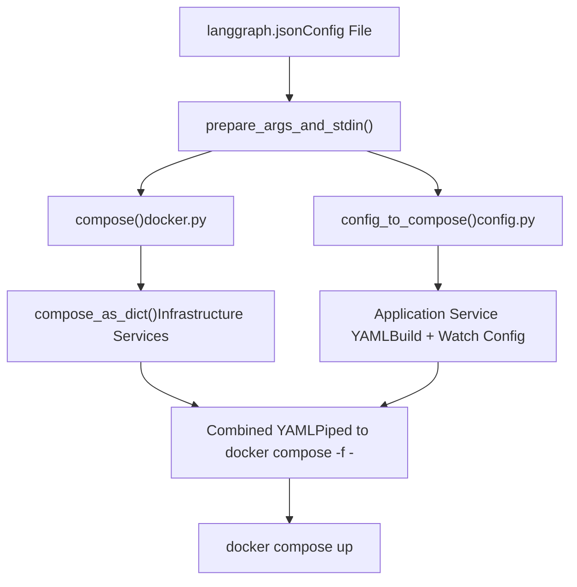
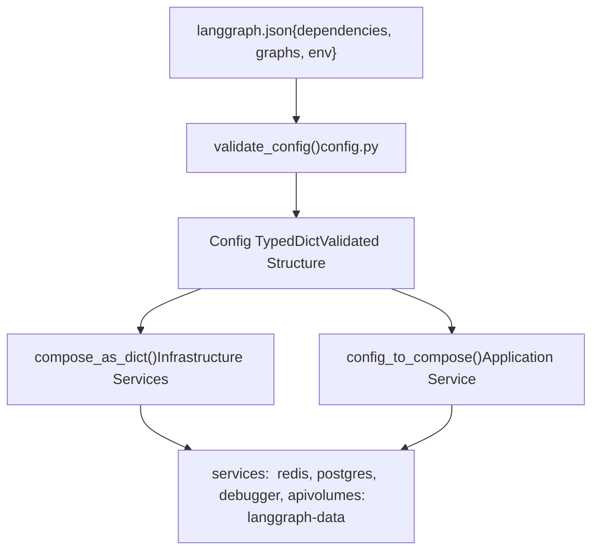

# 多服务编排

相关源文件

-   [libs/cli/README.md](https://github.com/langchain-ai/langgraph/blob/1fd51e8f/libs/cli/README.md?plain=1)
-   [libs/cli/examples/my\_app.py](https://github.com/langchain-ai/langgraph/blob/1fd51e8f/libs/cli/examples/my_app.py)
-   [libs/cli/langgraph\_cli/\_\_init\_\_.py](https://github.com/langchain-ai/langgraph/blob/1fd51e8f/libs/cli/langgraph_cli/__init__.py)
-   [libs/cli/langgraph\_cli/cli.py](https://github.com/langchain-ai/langgraph/blob/1fd51e8f/libs/cli/langgraph_cli/cli.py)
-   [libs/cli/langgraph\_cli/config.py](https://github.com/langchain-ai/langgraph/blob/1fd51e8f/libs/cli/langgraph_cli/config.py)
-   [libs/cli/langgraph\_cli/docker.py](https://github.com/langchain-ai/langgraph/blob/1fd51e8f/libs/cli/langgraph_cli/docker.py)
-   [libs/cli/langgraph\_cli/exec.py](https://github.com/langchain-ai/langgraph/blob/1fd51e8f/libs/cli/langgraph_cli/exec.py)
-   [libs/cli/langgraph\_cli/helpers.py](https://github.com/langchain-ai/langgraph/blob/1fd51e8f/libs/cli/langgraph_cli/helpers.py)
-   [libs/cli/langgraph\_cli/host\_backend.py](https://github.com/langchain-ai/langgraph/blob/1fd51e8f/libs/cli/langgraph_cli/host_backend.py)
-   [libs/cli/langgraph\_cli/progress.py](https://github.com/langchain-ai/langgraph/blob/1fd51e8f/libs/cli/langgraph_cli/progress.py)
-   [libs/cli/langgraph\_cli/util.py](https://github.com/langchain-ai/langgraph/blob/1fd51e8f/libs/cli/langgraph_cli/util.py)
-   [libs/cli/pyproject.toml](https://github.com/langchain-ai/langgraph/blob/1fd51e8f/libs/cli/pyproject.toml)
-   [libs/cli/tests/unit\_tests/agent.py](https://github.com/langchain-ai/langgraph/blob/1fd51e8f/libs/cli/tests/unit_tests/agent.py)
-   [libs/cli/tests/unit\_tests/cli/test\_cli.py](https://github.com/langchain-ai/langgraph/blob/1fd51e8f/libs/cli/tests/unit_tests/cli/test_cli.py)
-   [libs/cli/tests/unit\_tests/graphs/agent.py](https://github.com/langchain-ai/langgraph/blob/1fd51e8f/libs/cli/tests/unit_tests/graphs/agent.py)
-   [libs/cli/tests/unit\_tests/pipconfig.txt](https://github.com/langchain-ai/langgraph/blob/1fd51e8f/libs/cli/tests/unit_tests/pipconfig.txt)
-   [libs/cli/tests/unit\_tests/test\_config.json](https://github.com/langchain-ai/langgraph/blob/1fd51e8f/libs/cli/tests/unit_tests/test_config.json)
-   [libs/cli/tests/unit\_tests/test\_config.py](https://github.com/langchain-ai/langgraph/blob/1fd51e8f/libs/cli/tests/unit_tests/test_config.py)
-   [libs/cli/tests/unit\_tests/test\_deploy\_helpers.py](https://github.com/langchain-ai/langgraph/blob/1fd51e8f/libs/cli/tests/unit_tests/test_deploy_helpers.py)
-   [libs/cli/tests/unit\_tests/test\_docker.py](https://github.com/langchain-ai/langgraph/blob/1fd51e8f/libs/cli/tests/unit_tests/test_docker.py)
-   [libs/cli/tests/unit\_tests/test\_host\_backend.py](https://github.com/langchain-ai/langgraph/blob/1fd51e8f/libs/cli/tests/unit_tests/test_host_backend.py)
-   [libs/cli/tests/unit\_tests/test\_logs\_helpers.py](https://github.com/langchain-ai/langgraph/blob/1fd51e8f/libs/cli/tests/unit_tests/test_logs_helpers.py)
-   [libs/cli/tests/unit\_tests/test\_util.py](https://github.com/langchain-ai/langgraph/blob/1fd51e8f/libs/cli/tests/unit_tests/test_util.py)
-   [libs/cli/uv.lock](https://github.com/langchain-ai/langgraph/blob/1fd51e8f/libs/cli/uv.lock)

## 目的与范围

本文档描述 LangGraph CLI 如何生成并编排用于本地开发与部署的多服务 Docker Compose 配置。系统会在 LangGraph API 服务器旁自动配置依赖服务（Redis、PostgreSQL、调试器 UI），并处理服务依赖、健康检查、网络以及 watch 模式下的热重载。

关于构建单个 Docker 镜像（不含编排），请参见 [6.3 Docker Image Generation](https://github.com/langchain-ai/langgraph/blob/1fd51e8f/6.3 Docker Image Generation) 关于不使用 Docker 运行的开发服务器，请参见 [6.5 Local Development Server](https://github.com/langchain-ai/langgraph/blob/1fd51e8f/6.5 Local Development Server)

## 服务架构

CLI 会生成一个包含四个主要组件的多服务栈。每个组件运行在独立容器中，并具备明确的健康检查与依赖关系。


**服务架构**

来源: [libs/cli/langgraph\_cli/docker.py167-220](https://github.com/langchain-ai/langgraph/blob/1fd51e8f/libs/cli/langgraph_cli/docker.py#L167-L220) [libs/cli/tests/unit\_tests/cli/test\_cli.py80-137](https://github.com/langchain-ai/langgraph/blob/1fd51e8f/libs/cli/tests/unit_tests/cli/test_cli.py#L80-L137)

## Docker Compose 生成流程

CLI 通过两条主要代码路径生成 Docker Compose 配置：基础设施服务与应用服务。


**Compose 生成流水线**

`cli.py` 中的 `prepare_args_and_stdin` 函数通过调用 `docker.py` 里的基础设施辅助函数和 `config.py` 里的应用专用构建器来编排生成流程，然后将两者合并为单个 YAML 文档，经由 stdin 传给 Docker 子进程 [libs/cli/tests/unit\_tests/cli/test\_cli.py61-71](https://github.com/langchain-ai/langgraph/blob/1fd51e8f/libs/cli/tests/unit_tests/cli/test_cli.py#L61-L71)

来源: [libs/cli/langgraph\_cli/docker.py138-154](https://github.com/langchain-ai/langgraph/blob/1fd51e8f/libs/cli/langgraph_cli/docker.py#L138-L154) [libs/cli/tests/unit\_tests/cli/test\_cli.py51-171](https://github.com/langchain-ai/langgraph/blob/1fd51e8f/libs/cli/tests/unit_tests/cli/test_cli.py#L51-L171)

## 基础设施服务

### Redis 服务

Redis 服务提供任务队列和缓存功能，并具备自动健康检查。

| 属性 | 值 |
| --- | --- |
| 镜像 | `redis:6` |
| 健康检查 | `redis-cli ping` |
| 间隔 | 5s |
| 超时 | 1s |
| 重试次数 | 5 |
| 网络访问 | 仅内部（无对外暴露端口） |

API 服务器通过 `REDIS_URI=redis://langgraph-redis:6379` 连接 [libs/cli/langgraph\_cli/docker.py212](https://github.com/langchain-ai/langgraph/blob/1fd51e8f/libs/cli/langgraph_cli/docker.py#L212-L212)

来源: [libs/cli/langgraph\_cli/docker.py168-177](https://github.com/langchain-ai/langgraph/blob/1fd51e8f/libs/cli/langgraph_cli/docker.py#L168-L177) [libs/cli/tests/unit\_tests/cli/test\_cli.py84-90](https://github.com/langchain-ai/langgraph/blob/1fd51e8f/libs/cli/tests/unit_tests/cli/test_cli.py#L84-L90)

### PostgreSQL 服务

带 pgvector 扩展的 PostgreSQL 用于存储 checkpoint，并作为 Store 后端。

| 属性 | 值 |
| --- | --- |
| 镜像 | `pgvector/pgvector:pg16` |
| 端口 | 5433:5432 (host:container) |
| 环境变量 | `POSTGRES_DB=postgres`
`POSTGRES_USER=postgres`
`POSTGRES_PASSWORD=postgres` |
| 命令 | `postgres -c shared_preload_libraries=vector` |
| 卷 | `langgraph-data:/var/lib/postgresql/data` |
| 健康检查 | `pg_isready -U postgres` |
| 启动宽限期 | 10s |
| 启动检查间隔 | 1s |

默认连接串定义为 `DEFAULT_POSTGRES_URI` [libs/cli/langgraph\_cli/docker.py11-13](https://github.com/langchain-ai/langgraph/blob/1fd51e8f/libs/cli/langgraph_cli/docker.py#L11-L13)，并可通过 `compose_as_dict` 中的 `postgres_uri` 参数配置 [libs/cli/langgraph\_cli/docker.py145](https://github.com/langchain-ai/langgraph/blob/1fd51e8f/libs/cli/langgraph_cli/docker.py#L145-L145)

来源: [libs/cli/langgraph\_cli/docker.py181-203](https://github.com/langchain-ai/langgraph/blob/1fd51e8f/libs/cli/langgraph_cli/docker.py#L181-L203) [libs/cli/tests/unit\_tests/cli/test\_cli.py91-111](https://github.com/langchain-ai/langgraph/blob/1fd51e8f/libs/cli/tests/unit_tests/cli/test_cli.py#L91-L111)

### 调试器服务（可选）

当指定调试器端口时，CLI 会通过 `debugger_compose` 引入 LangGraph Studio 调试器 UI [libs/cli/langgraph\_cli/docker.py93-113](https://github.com/langchain-ai/langgraph/blob/1fd51e8f/libs/cli/langgraph_cli/docker.py#L93-L113)

| 属性 | 值 |
| --- | --- |
| 镜像 | `langchain/langgraph-debugger` |
| 端口 | 用户指定（映射到 3968） |
| 重启策略 | `on-failure` |
| 环境变量 | `VITE_STUDIO_LOCAL_GRAPH_URL` 设置为 API URL |
| 依赖 | 等待 `langgraph-postgres` 健康后再启动 |

来源: [libs/cli/langgraph\_cli/docker.py98-111](https://github.com/langchain-ai/langgraph/blob/1fd51e8f/libs/cli/langgraph_cli/docker.py#L98-L111) [libs/cli/tests/unit\_tests/cli/test\_cli.py112-121](https://github.com/langchain-ai/langgraph/blob/1fd51e8f/libs/cli/tests/unit_tests/cli/test_cli.py#L112-L121)

## 应用服务配置

### 构建模式 vs 镜像模式

`langgraph-api` 服务可以以两种模式运行：

**构建模式**（默认）：生成内联 Dockerfile，并按需构建镜像。它使用 `dockerfile_inline`，其 `FROM` 指令会指向对应的 Python 版本 [libs/cli/tests/unit\_tests/cli/test\_cli.py144-146](https://github.com/langchain-ai/langgraph/blob/1fd51e8f/libs/cli/tests/unit_tests/cli/test_cli.py#L144-L146)

**镜像模式**：当向 `compose_as_dict` 传入 `image` 字符串时，会直接使用该预构建镜像，而不是构建上下文 [libs/cli/langgraph\_cli/docker.py147](https://github.com/langchain-ai/langgraph/blob/1fd51e8f/libs/cli/langgraph_cli/docker.py#L147-L147)

来源: [libs/cli/langgraph\_cli/docker.py138-154](https://github.com/langchain-ai/langgraph/blob/1fd51e8f/libs/cli/langgraph_cli/docker.py#L138-L154) [libs/cli/tests/unit\_tests/cli/test\_cli.py173-193](https://github.com/langchain-ai/langgraph/blob/1fd51e8f/libs/cli/tests/unit_tests/cli/test_cli.py#L173-L193)

### 服务依赖与健康检查

API 服务通过带健康条件的依赖声明来确保稳定的启动顺序。

```
langgraph-api:  depends_on:    langgraph-redis:      condition: service_healthy    langgraph-postgres:      condition: service_healthy  healthcheck:    test: python /api/healthcheck.py    interval: 60s    start_interval: 1s    start_period: 10s
```
`start_interval` 特性会根据 `DockerCapabilities.healthcheck_start_interval` 条件性启用 [libs/cli/langgraph\_cli/docker.py198-200](https://github.com/langchain-ai/langgraph/blob/1fd51e8f/libs/cli/langgraph_cli/docker.py#L198-L200)

来源: [libs/cli/langgraph\_cli/docker.py198-203](https://github.com/langchain-ai/langgraph/blob/1fd51e8f/libs/cli/langgraph_cli/docker.py#L198-L203) [libs/cli/tests/unit\_tests/cli/test\_cli.py122-138](https://github.com/langchain-ai/langgraph/blob/1fd51e8f/libs/cli/tests/unit_tests/cli/test_cli.py#L122-L138)

## Watch 模式与热重载

当生成逻辑接收到 `watch=True` 时，CLI 会配置 Docker Compose 的 `develop` watch 模式，以便在文件变更时自动重建 [libs/cli/tests/unit\_tests/cli/test\_cli.py160-168](https://github.com/langchain-ai/langgraph/blob/1fd51e8f/libs/cli/tests/unit_tests/cli/test_cli.py#L160-L168)

watch 配置会监控：

1.  **配置文件**（`langgraph.json`）：触发 `rebuild`。
2.  **本地依赖**：`dependencies` 数组中的每个依赖都会添加 watch 条目。
3.  **工作目录**：监控项目上下文变更。

来源: [libs/cli/tests/unit\_tests/cli/test\_cli.py160-168](https://github.com/langchain-ai/langgraph/blob/1fd51e8f/libs/cli/tests/unit_tests/cli/test_cli.py#L160-L168)

## 配置转换

从 `langgraph.json` 到 compose 服务的转换涉及多个校验与映射步骤。


**配置到 Compose 的转换**

### 关键转换

1.  **依赖解析**：分析本地依赖以确定安装顺序与挂载点 [libs/cli/tests/unit\_tests/cli/test\_cli.py153-155](https://github.com/langchain-ai/langgraph/blob/1fd51e8f/libs/cli/tests/unit_tests/cli/test_cli.py#L153-L155)
2.  **环境注入**：将 `graphs` 等配置值序列化到 `LANGSERVE_GRAPHS` [libs/cli/tests/unit\_tests/cli/test\_cli.py156](https://github.com/langchain-ai/langgraph/blob/1fd51e8f/libs/cli/tests/unit_tests/cli/test_cli.py#L156-L156)
3.  **安全加固**：CLI 会检查构建命令中不允许的字符，以防止注入 [libs/cli/langgraph\_cli/config.py38-44](https://github.com/langchain-ai/langgraph/blob/1fd51e8f/libs/cli/langgraph_cli/config.py#L38-L44)
4.  **发行版校验**：建议使用 Wolfi Linux 以增强安全性 [libs/cli/langgraph\_cli/util.py10-27](https://github.com/langchain-ai/langgraph/blob/1fd51e8f/libs/cli/langgraph_cli/util.py#L10-L27)

来源: [libs/cli/langgraph\_cli/config.py142-196](https://github.com/langchain-ai/langgraph/blob/1fd51e8f/libs/cli/langgraph_cli/config.py#L142-L196) [libs/cli/langgraph\_cli/util.py10-27](https://github.com/langchain-ai/langgraph/blob/1fd51e8f/libs/cli/langgraph_cli/util.py#L10-L27)

## 服务通信

服务通过 Docker 内部网络通信，使用服务名作为主机名：

| From | To | Connection String / Variable |
| --- | --- | --- |
| `langgraph-api` | `langgraph-redis` | `REDIS_URI: redis://langgraph-redis:6379` [libs/cli/langgraph\_cli/docker.py212](https://github.com/langchain-ai/langgraph/blob/1fd51e8f/libs/cli/langgraph_cli/docker.py#L212-L212) |
| `langgraph-api` | `langgraph-postgres` | `POSTGRES_URI: ...` [libs/cli/langgraph\_cli/docker.py213](https://github.com/langchain-ai/langgraph/blob/1fd51e8f/libs/cli/langgraph_cli/docker.py#L213-L213) |
| `langgraph-debugger` | `langgraph-api` | `VITE_STUDIO_LOCAL_GRAPH_URL` [libs/cli/langgraph\_cli/docker.py109-111](https://github.com/langchain-ai/langgraph/blob/1fd51e8f/libs/cli/langgraph_cli/docker.py#L109-L111) |

来源: [libs/cli/langgraph\_cli/docker.py11-13](https://github.com/langchain-ai/langgraph/blob/1fd51e8f/libs/cli/langgraph_cli/docker.py#L11-L13) [libs/cli/langgraph\_cli/docker.py211-214](https://github.com/langchain-ai/langgraph/blob/1fd51e8f/libs/cli/langgraph_cli/docker.py#L211-L214)

## 卷管理

`langgraph-data` 卷为数据库提供持久化存储：

```
volumes:  langgraph-data:    driver: local
```
该卷会挂载到 `langgraph-postgres` 容器中的 `/var/lib/postgresql/data` [libs/cli/langgraph\_cli/docker.py190](https://github.com/langchain-ai/langgraph/blob/1fd51e8f/libs/cli/langgraph_cli/docker.py#L190-L190)

来源: [libs/cli/langgraph\_cli/docker.py190](https://github.com/langchain-ai/langgraph/blob/1fd51e8f/libs/cli/langgraph_cli/docker.py#L190-L190) [libs/cli/tests/unit\_tests/cli/test\_cli.py80-82](https://github.com/langchain-ai/langgraph/blob/1fd51e8f/libs/cli/tests/unit_tests/cli/test_cli.py#L80-L82)

## Docker Compose CLI 检测

`check_capabilities` 函数会检测环境中的 Docker 安装形态 [libs/cli/langgraph\_cli/docker.py48-90](https://github.com/langchain-ai/langgraph/blob/1fd51e8f/libs/cli/langgraph_cli/docker.py#L48-L90)

-   **plugin**: 使用 `docker compose`（v2+ 插件）。
-   **standalone**: 使用 `docker-compose`（v1 独立版）。
-   **Healthcheck support**: 检测是否支持 `start_interval`（Docker 25.0.0+） [libs/cli/langgraph\_cli/docker.py88](https://github.com/langchain-ai/langgraph/blob/1fd51e8f/libs/cli/langgraph_cli/docker.py#L88-L88)

来源: [libs/cli/langgraph\_cli/docker.py25-29](https://github.com/langchain-ai/langgraph/blob/1fd51e8f/libs/cli/langgraph_cli/docker.py#L25-L29) [libs/cli/langgraph\_cli/docker.py48-90](https://github.com/langchain-ai/langgraph/blob/1fd51e8f/libs/cli/langgraph_cli/docker.py#L48-L90)
