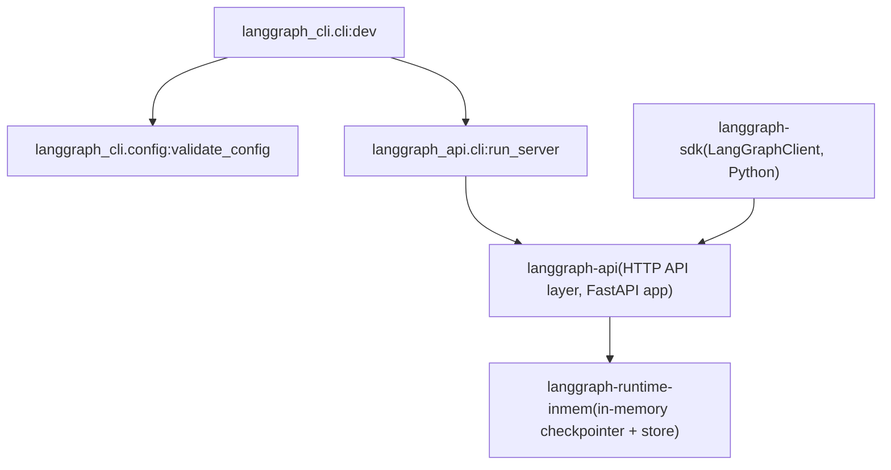

# 本地开发服务器

相关源文件

-   [libs/cli/README.md](https://github.com/langchain-ai/langgraph/blob/1fd51e8f/libs/cli/README.md?plain=1)
-   [libs/cli/langgraph\_cli/\_\_init\_\_.py](https://github.com/langchain-ai/langgraph/blob/1fd51e8f/libs/cli/langgraph_cli/__init__.py)
-   [libs/cli/langgraph\_cli/cli.py](https://github.com/langchain-ai/langgraph/blob/1fd51e8f/libs/cli/langgraph_cli/cli.py)
-   [libs/cli/langgraph\_cli/config.py](https://github.com/langchain-ai/langgraph/blob/1fd51e8f/libs/cli/langgraph_cli/config.py)
-   [libs/cli/langgraph\_cli/helpers.py](https://github.com/langchain-ai/langgraph/blob/1fd51e8f/libs/cli/langgraph_cli/helpers.py)
-   [libs/cli/langgraph\_cli/host\_backend.py](https://github.com/langchain-ai/langgraph/blob/1fd51e8f/libs/cli/langgraph_cli/host_backend.py)
-   [libs/cli/langgraph\_cli/progress.py](https://github.com/langchain-ai/langgraph/blob/1fd51e8f/libs/cli/langgraph_cli/progress.py)
-   [libs/cli/langgraph\_cli/util.py](https://github.com/langchain-ai/langgraph/blob/1fd51e8f/libs/cli/langgraph_cli/util.py)
-   [libs/cli/pyproject.toml](https://github.com/langchain-ai/langgraph/blob/1fd51e8f/libs/cli/pyproject.toml)
-   [libs/cli/tests/unit\_tests/cli/test\_cli.py](https://github.com/langchain-ai/langgraph/blob/1fd51e8f/libs/cli/tests/unit_tests/cli/test_cli.py)
-   [libs/cli/tests/unit\_tests/test\_config.py](https://github.com/langchain-ai/langgraph/blob/1fd51e8f/libs/cli/tests/unit_tests/test_config.py)
-   [libs/cli/tests/unit\_tests/test\_deploy\_helpers.py](https://github.com/langchain-ai/langgraph/blob/1fd51e8f/libs/cli/tests/unit_tests/test_deploy_helpers.py)
-   [libs/cli/tests/unit\_tests/test\_host\_backend.py](https://github.com/langchain-ai/langgraph/blob/1fd51e8f/libs/cli/tests/unit_tests/test_host_backend.py)
-   [libs/cli/tests/unit\_tests/test\_logs\_helpers.py](https://github.com/langchain-ai/langgraph/blob/1fd51e8f/libs/cli/tests/unit_tests/test_logs_helpers.py)
-   [libs/cli/tests/unit\_tests/test\_util.py](https://github.com/langchain-ai/langgraph/blob/1fd51e8f/libs/cli/tests/unit_tests/test_util.py)
-   [libs/cli/uv.lock](https://github.com/langchain-ai/langgraph/blob/1fd51e8f/libs/cli/uv.lock)

本页介绍 `langgraph-cli` 提供的内存态开发服务器模式 `langgraph dev`。它面向无需 Docker 的快速本地迭代。关于基于 Docker、面向生产的服务器（使用 Postgres 和 Redis），请参见 [Multi-Service Orchestration](/langchain-ai/langgraph/6.4-multi-service-orchestration)。关于所有 CLI 命令的摘要级说明，请参见 [CLI Commands](/langchain-ai/langgraph/6.1-cli-commands)。关于 `langgraph.json` 配置文件，请参见 [Configuration System (langgraph.json)](/langchain-ai/langgraph/6.2-configuration-system-(langgraph.json))。

---

## 概览

`langgraph dev` 会在当前 shell 中以原生 Python 进程启动 LangGraph API 服务器，并直接从源码加载图。它不需要 Docker。该服务器使用基于内存的 SQLite checkpointer 与 store，而非 Postgres，因此不适合生产环境，但启动速度很快。

该命令在 `langgraph_cli/cli.py` 中实现为 `dev` Click 命令 [libs/cli/langgraph\_cli/cli.py609-768](https://github.com/langchain-ai/langgraph/blob/1fd51e8f/libs/cli/langgraph_cli/cli.py#L609-L768)

---

## 安装要求

`langgraph dev` 依赖两个默认不安装的可选包。它们位于 `pyproject.toml` 中声明的 `inmem` extras 组 [libs/cli/pyproject.toml22-26](https://github.com/langchain-ai/langgraph/blob/1fd51e8f/libs/cli/pyproject.toml#L22-L26)：

| 包 | 最低版本 | Python 约束 | 作用 |
| --- | --- | --- | --- |
| `langgraph-api` | `>=0.5.35,<0.8.0` | `>= 3.11` | 提供 `run_server` 函数和 HTTP API 层 |
| `langgraph-runtime-inmem` | `>=0.7` | `>= 3.11` | 提供内存 checkpointer 和 store |
| `python-dotenv` | `>=0.8.0` | `>= 3.11` | 支持加载 `.env` 文件 |

安装方式：

```
pip install -U "langgraph-cli[inmem]"
```
**Python 版本要求：** 仅在 Python 3.11 或更高版本时才会安装 `inmem` extras [libs/cli/pyproject.toml24-25](https://github.com/langchain-ai/langgraph/blob/1fd51e8f/libs/cli/pyproject.toml#L24-L25) 若检测到 Python < 3.11，`dev` 命令会输出描述性错误 [libs/cli/langgraph\_cli/cli.py703-710](https://github.com/langchain-ai/langgraph/blob/1fd51e8f/libs/cli/langgraph_cli/cli.py#L703-L710)

**不支持 JS 图。** 若校验后的配置中包含 `node_version`，该命令会立即抛出 `UsageError` [libs/cli/langgraph\_cli/cli.py733-736](https://github.com/langchain-ai/langgraph/blob/1fd51e8f/libs/cli/langgraph_cli/cli.py#L733-L736)

来源: [libs/cli/pyproject.toml22-26](https://github.com/langchain-ai/langgraph/blob/1fd51e8f/libs/cli/pyproject.toml#L22-L26) [libs/cli/langgraph\_cli/cli.py703-736](https://github.com/langchain-ai/langgraph/blob/1fd51e8f/libs/cli/langgraph_cli/cli.py#L703-L736)

---

## 架构

下图展示 `langgraph dev` 与其依赖包之间的关系。

**`langgraph dev` 的依赖与调用流程**


来源: [libs/cli/langgraph\_cli/cli.py700-768](https://github.com/langchain-ai/langgraph/blob/1fd51e8f/libs/cli/langgraph_cli/cli.py#L700-L768) [libs/cli/pyproject.toml22-26](https://github.com/langchain-ai/langgraph/blob/1fd51e8f/libs/cli/pyproject.toml#L22-L26)

---

## 命令选项

`dev` 命令通过 Click 组注册为 `langgraph dev` [libs/cli/langgraph\_cli/cli.py609-679](https://github.com/langchain-ai/langgraph/blob/1fd51e8f/libs/cli/langgraph_cli/cli.py#L609-L679)

| 选项 | 类型 | 默认值 | 说明 |
| --- | --- | --- | --- |
| `--host` | `str` | `127.0.0.1` | 要绑定的网络接口 |
| `--port` | `int` | `2024` | 监听端口 |
| `--no-reload` | flag | 关闭 | 禁用热重载 |
| `--config` | path | `langgraph.json` | 配置文件路径 |
| `--n-jobs-per-worker` | `int` | `None` | 每个 worker 的最大并发作业数 |
| `--no-browser` | flag | 关闭 | 跳过自动打开 LangGraph Studio |
| `--debug-port` | `int` | `None` | 在此端口启用 `debugpy` 远程调试 |
| `--wait-for-client` | flag | 关闭 | 在调试器连接前阻塞启动 |
| `--studio-url` | `str` | `None` | 覆盖 Studio URL（默认：`https://smith.langchain.com`） |
| `--allow-blocking` | flag | 关闭 | 抑制对同步阻塞 I/O 的报错 |
| `--tunnel` | flag | 关闭 | 通过 Cloudflare tunnel 暴露服务器 |

来源: [libs/cli/langgraph\_cli/cli.py609-679](https://github.com/langchain-ai/langgraph/blob/1fd51e8f/libs/cli/langgraph_cli/cli.py#L609-L679)

---

## 执行流程

下图将 `dev` 函数内部执行序列映射到实际涉及的代码构造。

**`dev` 函数执行序列**

> **[Mermaid sequence]**
> *(图表结构无法解析)*

来源: [libs/cli/langgraph\_cli/cli.py698-768](https://github.com/langchain-ai/langgraph/blob/1fd51e8f/libs/cli/langgraph_cli/cli.py#L698-L768) [libs/cli/langgraph\_cli/config.py142-230](https://github.com/langchain-ai/langgraph/blob/1fd51e8f/libs/cli/langgraph_cli/config.py#L142-L230)

---

## 配置传递

通过 `validate_config` 校验后 [libs/cli/langgraph\_cli/config.py142-230](https://github.com/langchain-ai/langgraph/blob/1fd51e8f/libs/cli/langgraph_cli/config.py#L142-L230)，配置字段会被提取并直接转发给 `run_server`。映射包括：

| `langgraph.json` 字段 | 转发为 `run_server` 参数 |
| --- | --- |
| `graphs` | `graphs` |
| `env` | `env` |
| `store` | `store` |
| `auth` | `auth` |
| `http` | `http` |
| `ui` | `ui` |
| `ui_config` | `ui_config` |
| `webhooks` | `webhooks` |

`dependencies` 列表会在调用 `run_server` 前用于本地扩展 `sys.path` [libs/cli/langgraph\_cli/cli.py740-744](https://github.com/langchain-ai/langgraph/blob/1fd51e8f/libs/cli/langgraph_cli/cli.py#L740-L744) 这可确保声明为 `"."` 或 `"./some_dir"` 的相对本地包在加载图模块时可被导入。

来源: [libs/cli/langgraph\_cli/cli.py738-768](https://github.com/langchain-ai/langgraph/blob/1fd51e8f/libs/cli/langgraph_cli/cli.py#L738-L768) [libs/cli/langgraph\_cli/config.py175-196](https://github.com/langchain-ai/langgraph/blob/1fd51e8f/libs/cli/langgraph_cli/config.py#L175-L196)

---

## 热重载

默认启用热重载（可通过 `--no-reload` 关闭）。启用时，调用 `run_server` 会传入 `reload=True` [libs/cli/langgraph\_cli/cli.py748-752](https://github.com/langchain-ai/langgraph/blob/1fd51e8f/libs/cli/langgraph_cli/cli.py#L748-L752)：

```
run_server(    host,    port,    not no_reload,   # reload=True unless --no-reload    graphs,    ...)
```
实际的文件监控与进程重启由 `langgraph-api` 内部实现（不在 `langgraph-cli` 中）。`langgraph-cli` 侧仅传递该布尔开关。

与 `langgraph up --watch` 不同，后者使用 Docker Compose `develop.watch` 触发镜像重建 [libs/cli/tests/unit\_tests/cli/test\_cli.py160-167](https://github.com/langchain-ai/langgraph/blob/1fd51e8f/libs/cli/tests/unit_tests/cli/test_cli.py#L160-L167)，`langgraph dev` 会直接在进程内重载 Python 模块。

来源: [libs/cli/langgraph\_cli/cli.py748-768](https://github.com/langchain-ai/langgraph/blob/1fd51e8f/libs/cli/langgraph_cli/cli.py#L748-L768) [libs/cli/tests/unit\_tests/cli/test\_cli.py160-167](https://github.com/langchain-ai/langgraph/blob/1fd51e8f/libs/cli/tests/unit_tests/cli/test_cli.py#L160-L167)

---

## 远程调试

当指定 `--debug-port` 时，`run_server` 函数预期会在给定端口调用 `debugpy.listen()`。`--wait-for-client` 标志会让服务器在调试器 IDE（如 VS Code）连接前阻塞，从而在图执行开始前完成附加。

`debug_port` 和 `wait_for_client` 都会直接传递给 `run_server` [libs/cli/langgraph\_cli/cli.py754-755](https://github.com/langchain-ai/langgraph/blob/1fd51e8f/libs/cli/langgraph_cli/cli.py#L754-L755)

来源: [libs/cli/langgraph\_cli/cli.py643-655](https://github.com/langchain-ai/langgraph/blob/1fd51e8f/libs/cli/langgraph_cli/cli.py#L643-L655) [libs/cli/langgraph\_cli/cli.py754-755](https://github.com/langchain-ai/langgraph/blob/1fd51e8f/libs/cli/langgraph_cli/cli.py#L754-L755)

---

## LangGraph Studio 集成

当服务器启动后（且未设置 `--no-browser`），`run_server` 会打开浏览器，将 LangGraph Studio 连接到本地服务器。Studio URL 默认为 `https://smith.langchain.com`，但可通过 `--studio-url` 覆盖 [libs/cli/langgraph\_cli/cli.py656-664](https://github.com/langchain-ai/langgraph/blob/1fd51e8f/libs/cli/langgraph_cli/cli.py#L656-L664)

使用 `--tunnel` 时，服务器还会通过 Cloudflare tunnel 对外暴露，以便远程 Studio 实例或屏蔽 `localhost` 的浏览器访问本地 API [libs/cli/langgraph\_cli/cli.py665-673](https://github.com/langchain-ai/langgraph/blob/1fd51e8f/libs/cli/langgraph_cli/cli.py#L665-L673)

来源: [libs/cli/langgraph\_cli/cli.py656-673](https://github.com/langchain-ai/langgraph/blob/1fd51e8f/libs/cli/langgraph_cli/cli.py#L656-L673) [libs/cli/langgraph\_cli/cli.py762-763](https://github.com/langchain-ai/langgraph/blob/1fd51e8f/libs/cli/langgraph_cli/cli.py#L762-L763)

---

## 缺失依赖的错误处理

如果未安装 `langgraph-api`（即安装 `langgraph-cli` 时未包含 `inmem` extra），`dev` 命令会输出结构化错误信息，而不是原始 `ImportError`。该检查还会判断 Python 是否低于 3.11，并在错误信息中附加特定版本说明 [libs/cli/langgraph\_cli/cli.py703-730](https://github.com/langchain-ai/langgraph/blob/1fd51e8f/libs/cli/langgraph_cli/cli.py#L703-L730)

来源: [libs/cli/langgraph\_cli/cli.py700-730](https://github.com/langchain-ai/langgraph/blob/1fd51e8f/libs/cli/langgraph_cli/cli.py#L700-L730)

---

## 对比：`langgraph dev` vs `langgraph up`

| 方面 | `langgraph dev` | `langgraph up` |
| --- | --- | --- |
| 是否需要 Docker | 否 | 是 |
| 持久化后端 | 内存（SQLite） | Postgres [libs/cli/tests/unit\_tests/cli/test\_cli.py91-104](https://github.com/langchain-ai/langgraph/blob/1fd51e8f/libs/cli/tests/unit_tests/cli/test_cli.py#L91-L104) |
| 热重载机制 | 进程内 Python 重载 | Docker Compose `watch` [libs/cli/tests/unit\_tests/cli/test\_cli.py160-167](https://github.com/langchain-ai/langgraph/blob/1fd51e8f/libs/cli/tests/unit_tests/cli/test_cli.py#L160-L167) |
| JS 图支持 | 否 [libs/cli/langgraph\_cli/cli.py733](https://github.com/langchain-ai/langgraph/blob/1fd51e8f/libs/cli/langgraph_cli/cli.py#L733-L733) | 是 |
| 配置校验者 | `validate_config` | `validate_config` |
| 运行时包 | `langgraph-api` [libs/cli/pyproject.toml24](https://github.com/langchain-ai/langgraph/blob/1fd51e8f/libs/cli/pyproject.toml#L24-L24) | `langchain/langgraph-api` image |
| 默认端口 | `2024` | `8123` |

来源: [libs/cli/langgraph\_cli/cli.py609-768](https://github.com/langchain-ai/langgraph/blob/1fd51e8f/libs/cli/langgraph_cli/cli.py#L609-L768) [libs/cli/tests/unit\_tests/cli/test\_cli.py91-167](https://github.com/langchain-ai/langgraph/blob/1fd51e8f/libs/cli/tests/unit_tests/cli/test_cli.py#L91-L167) [libs/cli/pyproject.toml22-26](https://github.com/langchain-ai/langgraph/blob/1fd51e8f/libs/cli/pyproject.toml#L22-L26)
