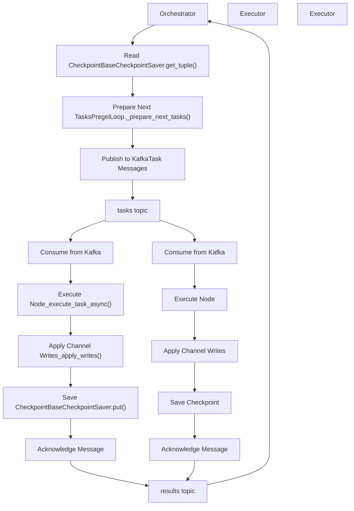
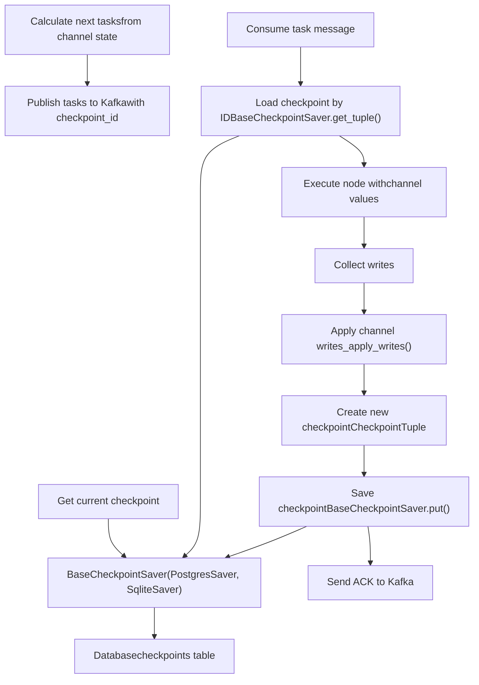
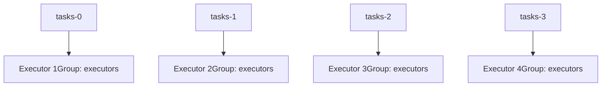
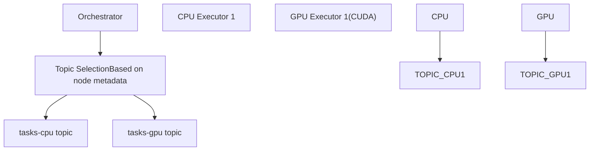

# 基于 Kafka 的分布式执行

相关源文件

-   [libs/langgraph/tests/compose-postgres.yml](https://github.com/langchain-ai/langgraph/blob/1fd51e8f/libs/langgraph/tests/compose-postgres.yml)

## 目的与范围

本文档描述 LangGraph 图的基于 Kafka 的分布式执行系统。该系统支持将图执行横向扩展到多个 worker 进程或机器，使工作负载可以分发到单进程之外。

该分布式执行系统构建在 checkpoint 持久化层之上，用于在多个执行器之间编排工作。虽然图遍历的核心逻辑位于 Pregel 引擎中，但 Kafka 调度器提供了多节点部署所需的传输与协调层。

**注意**：分布式执行系统不同于单个图步骤内的并行节点执行（后者使用 `Send` 命令）——该系统是将完整的图执行步骤分发到多个 worker 进程。

## 架构概览

Kafka 调度器实现了 orchestrator-executor 模式。在此架构中，**Orchestrator** 管理状态机与图拓扑，而 **Executors** 负责实际的节点函数执行。


**分布式图执行的 Orchestrator-Executor 模式**

这种关注点分离使得：

-   **Orchestrators** 保持轻量，并可为大量图处理协调工作。
-   **Executors** 可根据计算负载独立扩缩容。
-   **工作负载** 可分发到异构机器（例如用于 ML 节点的 GPU 执行器）。

来源：该架构抽象了 `libs/langgraph/langgraph/pregel/_loop.py` 中的 Pregel 循环内部逻辑，并将其映射为分布式消息传递接口。

## 与 Checkpointing 的集成

分布式执行系统高度依赖 checkpoint 持久化层，以维持分布式 worker 之间的一致性。执行生命周期中的每个步骤都涉及 checkpoint 操作，以确保在 worker 失败时状态不会丢失。


**分布式执行中的 Checkpoint 生命周期**

Checkpoint 集成的关键点：

1.  **消息中的 Checkpoint ID**：每条任务消息都包含其派生状态的 `checkpoint_id`，确保执行器加载正确状态。
2.  **原子 Checkpoint 写入**：执行器必须同时写入通道更新和新 checkpoint。对于基于数据库的实现，`BaseCheckpointSaver.put()` 操作是事务性的。
3.  **版本冲突解决**：若多个执行器尝试处理同一任务（例如因重试或 consumer 组重平衡），checkpoint 系统的版本追踪会检测冲突。只有第一次 checkpoint 写入会成功。

来源：checkpoint 持久化要求由 `BaseCheckpointSaver` 接口定义，并由 `libs/langgraph-checkpoint-postgres/langgraph/checkpoint/postgres/__init__.py` 中的 `PostgresSaver` 实现。

## 扩缩容与部署模式

### 横向扩展

可通过增加 Kafka consumer group 内的 consumer 实例来横向扩展 Executors。Kafka 的分区分配机制可在保持特定线程顺序保证的同时实现均衡分发。


**并行执行的 Kafka 分区分配**

### 资源专用执行器

节点可标注资源需求，从而让 orchestrator 通过专用 Kafka topic 将任务路由到合适的执行器池。


**资源感知型任务路由**

## 与本地执行的对比

分布式执行系统在处理 `Pregel` 循环方面与本地执行不同。

| 方面 | 本地执行 | 分布式执行 |
| --- | --- | --- |
| **编排** | 进程内单个 `PregelLoop` | Orchestrator 进程 + Kafka |
| **任务执行** | 在 `_execute_task_async` 中直接函数调用 | Executors 从 Kafka 消费 |
| **状态持久化** | 可选（可使用 `InMemorySaver`） | 必需（PostgreSQL/SQLite） |
| **延迟** | 步骤间微秒级 | 毫秒级（网络 + Kafka） |
| **容错** | 进程崩溃会丢失飞行中任务 | Kafka 重试 + checkpoint 恢复 |

### 执行流对比

**本地执行：** 循环完全由 `Pregel` 类管理。`Pregel.stream()` → `PregelLoop` → `_execute_task_async()` → `_apply_writes()` → `BaseCheckpointSaver.put()`

**分布式执行：** 循环被拆分到网络两端。`Orchestrator` → `_prepare_next_tasks()` → Kafka Publish → `Executor` → `_execute_task_async()` → `_apply_writes()` → `BaseCheckpointSaver.put()` → Kafka ACK → `Orchestrator`

来源：本地执行逻辑定义在 `libs/langgraph/langgraph/pregel/__init__.py` 与 `libs/langgraph/langgraph/pregel/_loop.py`。

## 错误处理与恢复

分布式系统必须处理多个层级的故障：

1.  **执行器故障**：如果执行器在执行中崩溃，Kafka consumer group 会重平衡。未确认消息会重新投递给其他执行器。
2.  **编排器故障**：如果 orchestrator 崩溃，新实例会从 results topic 的最新已提交 offset 继续。
3.  **毒性消息**：若任务持续失败，`RetryPolicy`（通过 `RetryPolicy` 类配置）会决定退避策略。达到最大重试后，任务会被移动到死信队列，或线程被标记为错误。

来源：重试逻辑由 `libs/langgraph/langgraph/pregel/retry.py` 中定义的 `RetryPolicy` 管理。

## 基础设施要求

运行该分布式系统需要持久化后端。对于测试和开发，通常使用 PostgreSQL 实例。

```
# Example service configuration for distributed testingservices:  postgres-test:    image: postgres:16    ports:      - "5442:5432"    environment:      POSTGRES_DB: postgres      POSTGRES_USER: postgres      POSTGRES_PASSWORD: postgres
```
来源: [libs/langgraph/tests/compose-postgres.yml1-17](https://github.com/langchain-ai/langgraph/blob/1fd51e8f/libs/langgraph/tests/compose-postgres.yml#L1-L17)
