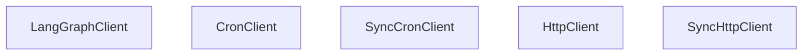

# Cron 作业

相关源文件

-   [libs/sdk-py/langgraph\_sdk/\_\_init\_\_.py](https://github.com/langchain-ai/langgraph/blob/1fd51e8f/libs/sdk-py/langgraph_sdk/__init__.py)
-   [libs/sdk-py/langgraph\_sdk/cache.py](https://github.com/langchain-ai/langgraph/blob/1fd51e8f/libs/sdk-py/langgraph_sdk/cache.py)
-   [libs/sdk-py/langgraph\_sdk/client.py](https://github.com/langchain-ai/langgraph/blob/1fd51e8f/libs/sdk-py/langgraph_sdk/client.py)
-   [libs/sdk-py/langgraph\_sdk/schema.py](https://github.com/langchain-ai/langgraph/blob/1fd51e8f/libs/sdk-py/langgraph_sdk/schema.py)
-   [libs/sdk-py/pyproject.toml](https://github.com/langchain-ai/langgraph/blob/1fd51e8f/libs/sdk-py/pyproject.toml)
-   [libs/sdk-py/tests/test\_cache.py](https://github.com/langchain-ai/langgraph/blob/1fd51e8f/libs/sdk-py/tests/test_cache.py)
-   [libs/sdk-py/tests/test\_crons\_client.py](https://github.com/langchain-ai/langgraph/blob/1fd51e8f/libs/sdk-py/tests/test_crons_client.py)

## 目的与范围

LangGraph 中的 Cron 作业用于助手的定时、周期性执行。本页记录了 Cron 作业的数据模型、API 操作，以及用于管理定时任务的 `CronClient` 和 `SyncCronClient` SDK 客户端方法。Cron 作业支持有状态执行（在持久线程内）和无状态执行（每次运行创建新线程）。

**来源**: [libs/sdk-py/langgraph\_sdk/client.py1-32](https://github.com/langchain-ai/langgraph/blob/1fd51e8f/libs/sdk-py/langgraph_sdk/client.py#L1-L32) [libs/sdk-py/langgraph\_sdk/schema.py156-167](https://github.com/langchain-ai/langgraph/blob/1fd51e8f/libs/sdk-py/langgraph_sdk/schema.py#L156-L167) [libs/sdk-py/langgraph\_sdk/schema.py373-401](https://github.com/langchain-ai/langgraph/blob/1fd51e8f/libs/sdk-py/langgraph_sdk/schema.py#L373-L401)

---

## Cron 数据模型

`Cron` 资源表示一个定时任务。关键字段包括：

| 字段 | 类型 | 说明 |
| --- | --- | --- |
| `cron_id` | `str` | Cron 作业的唯一标识符。 |
| `assistant_id` | `str` | 要执行的 assistant 的 ID。 |
| `thread_id` | `str | None` | 用于有状态执行的可选线程 ID。 |
| `schedule` | `str` | 定义计划的 Cron 表达式（例如 `0 0 * * *`）。 |
| `payload` | `dict` | 每次执行都会传入的运行参数（input、config 等）。 |
| `on_run_completed` | `OnCompletionBehavior | None` | 执行完成后的动作（仅无状态）：`"delete"` 或 `"keep"`。 |
| `end_time` | `datetime | None` | 停止周期执行的可选日期。 |
| `next_run_date` | `datetime | None` | 下一次计划执行的时间戳。 |
| `enabled` | `bool` | 当前 Cron 作业是否启用。 |

**来源**: [libs/sdk-py/langgraph\_sdk/schema.py373-401](https://github.com/langchain-ai/langgraph/blob/1fd51e8f/libs/sdk-py/langgraph_sdk/schema.py#L373-L401) [libs/sdk-py/langgraph\_sdk/schema.py97-102](https://github.com/langchain-ai/langgraph/blob/1fd51e8f/libs/sdk-py/langgraph_sdk/schema.py#L97-L102)

---

## Cron 作业执行模型

下图展示了 `CronClient` 如何与 LangGraph API 交互，以管理定时运行的生命周期。

### 自然语言到代码实体空间：执行流

**来源**: [libs/sdk-py/langgraph\_sdk/client.py12-31](https://github.com/langchain-ai/langgraph/blob/1fd51e8f/libs/sdk-py/langgraph_sdk/client.py#L12-L31) [libs/sdk-py/tests/test\_crons\_client.py34-62](https://github.com/langchain-ai/langgraph/blob/1fd51e8f/libs/sdk-py/tests/test_crons_client.py#L34-L62) [libs/sdk-py/tests/test\_crons\_client.py100-128](https://github.com/langchain-ai/langgraph/blob/1fd51e8f/libs/sdk-py/tests/test_crons_client.py#L100-L128)

---

## 有状态与无状态 Cron

### 有状态 Cron

有状态 Cron 会在持久线程内执行。这适用于周期性检查或需要历史上下文的任务。

-   **`thread_id`**: 创建时必须提供。
-   **API 路由**: `POST /threads/{thread_id}/runs/crons`
-   **方法**: `CronClient.create_for_thread`

### 无状态 Cron

无状态 Cron 会触发一次与特定持久线程无关的运行（不过会为该次运行临时创建线程）。

-   **`thread_id`**: 省略。
-   **`on_run_completed`**: 决定临时线程是保留还是删除。
-   **API 路由**: `POST /runs/crons`
-   **方法**: `CronClient.create`

**来源**: [libs/sdk-py/tests/test\_crons\_client.py34-62](https://github.com/langchain-ai/langgraph/blob/1fd51e8f/libs/sdk-py/tests/test_crons_client.py#L34-L62) [libs/sdk-py/tests/test\_crons\_client.py100-128](https://github.com/langchain-ai/langgraph/blob/1fd51e8f/libs/sdk-py/tests/test_crons_client.py#L100-L128) [libs/sdk-py/langgraph\_sdk/schema.py380-381](https://github.com/langchain-ai/langgraph/blob/1fd51e8f/libs/sdk-py/langgraph_sdk/schema.py#L380-L381)

---

## 调度格式

`schedule` 字符串遵循标准 cron 语法：`minute hour day-of-month month day-of-week`

| 示例 | 含义 |
| --- | --- |
| `0 0 * * *` | 每天午夜 |
| `0 9 * * 1-5` | 每个工作日早上 9:00 |
| `*/15 * * * *` | 每 15 分钟 |

**来源**: [libs/sdk-py/langgraph\_sdk/schema.py386-387](https://github.com/langchain-ai/langgraph/blob/1fd51e8f/libs/sdk-py/langgraph_sdk/schema.py#L386-L387)

---

## CronClient SDK 接口

`CronClient`（异步）和 `SyncCronClient`（同步）提供了管理这些资源的主要接口。

### 类关联图


**来源**: [libs/sdk-py/langgraph\_sdk/client.py12-31](https://github.com/langchain-ai/langgraph/blob/1fd51e8f/libs/sdk-py/langgraph_sdk/client.py#L12-L31) [libs/sdk-py/langgraph\_sdk/client.py33-55](https://github.com/langchain-ai/langgraph/blob/1fd51e8f/libs/sdk-py/langgraph_sdk/client.py#L33-L55)

### 关键方法

#### 创建 Cron

为 assistant 创建一个 Cron 作业。

```
# Asynccron = await client.crons.create(    assistant_id="asst_123",    schedule="0 12 * * *",    input={"query": "Daily summary"},    end_time=datetime(2025, 1, 1, tzinfo=timezone.utc))
```
**来源**: [libs/sdk-py/tests/test\_crons\_client.py100-128](https://github.com/langchain-ai/langgraph/blob/1fd51e8f/libs/sdk-py/tests/test_crons_client.py#L100-L128) [libs/sdk-py/tests/test\_crons\_client.py131-161](https://github.com/langchain-ai/langgraph/blob/1fd51e8f/libs/sdk-py/tests/test_crons_client.py#L131-L161)

#### 为线程创建 Cron

专门为线程创建 Cron 作业（有状态）。

```
# Synccron = client.crons.create_for_thread(    thread_id="thread_123",    assistant_id="asst_123",    schedule="0 0 * * *")
```
**来源**: [libs/sdk-py/tests/test\_crons\_client.py163-190](https://github.com/langchain-ai/langgraph/blob/1fd51e8f/libs/sdk-py/tests/test_crons_client.py#L163-L190) [libs/sdk-py/tests/test\_crons\_client.py34-62](https://github.com/langchain-ai/langgraph/blob/1fd51e8f/libs/sdk-py/tests/test_crons_client.py#L34-L62)

#### 搜索与列出

筛选并排序现有 Cron 作业。

-   **`order_by`**: 排序字段（例如 `"next_run_date"`、`"created_at"`）。
-   **`order`**: `"asc"` 或 `"desc"`。

**来源**: [libs/sdk-py/langgraph\_sdk/schema.py156-172](https://github.com/langchain-ai/langgraph/blob/1fd51e8f/libs/sdk-py/langgraph_sdk/schema.py#L156-L172) [libs/sdk-py/langgraph\_sdk/schema.py479-494](https://github.com/langchain-ai/langgraph/blob/1fd51e8f/libs/sdk-py/langgraph_sdk/schema.py#L479-L494)

---

## Payload 管理

Cron 作业的 `payload` 包含每次触发运行都会使用的执行参数，通常包括：

-   **`input`**: 图的初始状态或消息。
-   **`config`**: `recursion_limit`、`tags` 和 `configurable` 参数。
-   **`metadata`**: 用于追踪的键值对。

`end_time` 参数确保 Cron 作业在某个日期后自动停止触发，避免遗留的定时任务。

**来源**: [libs/sdk-py/langgraph\_sdk/schema.py175-196](https://github.com/langchain-ai/langgraph/blob/1fd51e8f/libs/sdk-py/langgraph_sdk/schema.py#L175-L196) [libs/sdk-py/tests/test\_crons\_client.py66-96](https://github.com/langchain-ai/langgraph/blob/1fd51e8f/libs/sdk-py/tests/test_crons_client.py#L66-L96)

---

## 面向 Cron 的服务端缓存

在高频 Cron 场景下，开发者可使用 `langgraph_sdk.cache` 模块（仅服务端）在 Cron 运行之间存储中间结果。

-   **`cache_get(key)`**: 获取一个可 JSON 序列化的值。
-   **`cache_set(key, value, ttl)`**: 存储带 TTL 的值（最长 1 天）。
-   **`swr(key, loader, ...)`**: stale-while-revalidate 模式，用于提升由 Cron 触发的图节点中的数据获取效率。

**来源**: [libs/sdk-py/langgraph\_sdk/cache.py56-141](https://github.com/langchain-ai/langgraph/blob/1fd51e8f/libs/sdk-py/langgraph_sdk/cache.py#L56-L141) [libs/sdk-py/tests/test\_cache.py10-38](https://github.com/langchain-ai/langgraph/blob/1fd51e8f/libs/sdk-py/tests/test_cache.py#L10-L38)
