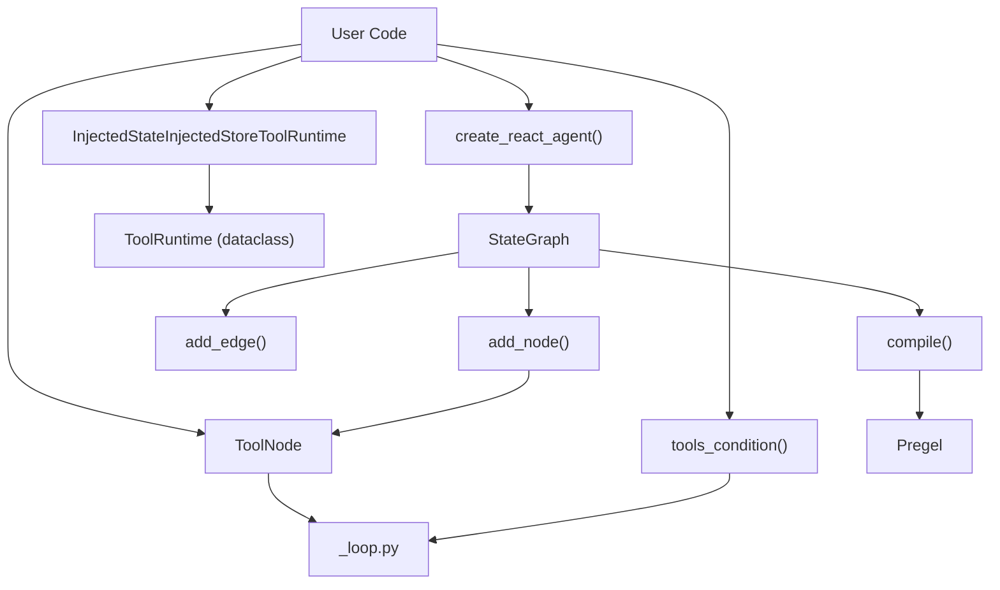
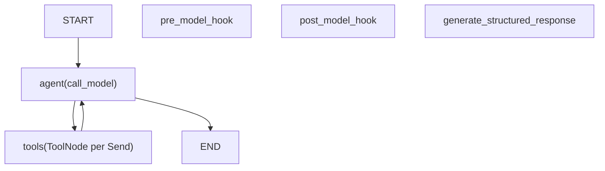
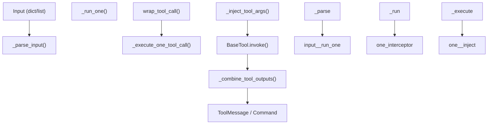

# 预构建组件

相关源文件

-   [libs/langgraph/langgraph/graph/\_\_init\_\_.py](https://github.com/langchain-ai/langgraph/blob/1fd51e8f/libs/langgraph/langgraph/graph/__init__.py)
-   [libs/prebuilt/langgraph/prebuilt/\_\_init\_\_.py](https://github.com/langchain-ai/langgraph/blob/1fd51e8f/libs/prebuilt/langgraph/prebuilt/__init__.py)
-   [libs/prebuilt/langgraph/prebuilt/chat\_agent\_executor.py](https://github.com/langchain-ai/langgraph/blob/1fd51e8f/libs/prebuilt/langgraph/prebuilt/chat_agent_executor.py)
-   [libs/prebuilt/langgraph/prebuilt/tool\_node.py](https://github.com/langchain-ai/langgraph/blob/1fd51e8f/libs/prebuilt/langgraph/prebuilt/tool_node.py)
-   [libs/prebuilt/langgraph/prebuilt/tool\_validator.py](https://github.com/langchain-ai/langgraph/blob/1fd51e8f/libs/prebuilt/langgraph/prebuilt/tool_validator.py)
-   [libs/prebuilt/tests/test\_deprecation.py](https://github.com/langchain-ai/langgraph/blob/1fd51e8f/libs/prebuilt/tests/test_deprecation.py)
-   [libs/prebuilt/tests/test\_on\_tool\_call.py](https://github.com/langchain-ai/langgraph/blob/1fd51e8f/libs/prebuilt/tests/test_on_tool_call.py)
-   [libs/prebuilt/tests/test\_react\_agent.py](https://github.com/langchain-ai/langgraph/blob/1fd51e8f/libs/prebuilt/tests/test_react_agent.py)
-   [libs/prebuilt/tests/test\_tool\_node.py](https://github.com/langchain-ai/langgraph/blob/1fd51e8f/libs/prebuilt/tests/test_tool_node.py)
-   [libs/prebuilt/tests/test\_tool\_node\_interceptor\_unregistered.py](https://github.com/langchain-ai/langgraph/blob/1fd51e8f/libs/prebuilt/tests/test_tool_node_interceptor_unregistered.py)
-   [libs/prebuilt/tests/test\_tool\_node\_validation\_error\_filtering.py](https://github.com/langchain-ai/langgraph/blob/1fd51e8f/libs/prebuilt/tests/test_tool_node_validation_error_filtering.py)

预构建组件为常见的 LangGraph 模式提供高级抽象，主要聚焦于可使用工具的代理以及工具执行基础设施。这些组件在抽象图构建细节的同时，仍可通过参数与钩子进行完全定制。

关于底层图构建 API，参见 [StateGraph API](/langchain-ai/langgraph/3.1-stategraph-api) 和 [Functional API (@task and @entrypoint)](/langchain-ai/langgraph/3.2-functional-api-(@task-and-@entrypoint))。关于预构建代理的部署，参见 [CLI and Deployment](/langchain-ai/langgraph/6-cli-and-deployment)。

**来源：** [libs/prebuilt/langgraph/prebuilt/\_\_init\_\_.py1-22](https://github.com/langchain-ai/langgraph/blob/1fd51e8f/libs/prebuilt/langgraph/prebuilt/__init__.py#L1-L22)

## 概览

预构建组件模块从 [libs/prebuilt/langgraph/prebuilt/\_\_init\_\_.py1-22](https://github.com/langchain-ai/langgraph/blob/1fd51e8f/libs/prebuilt/langgraph/prebuilt/__init__.py#L1-L22) 导出以下组件：

| 组件 | 状态 | 用途 |
| --- | --- | --- |
| `ToolNode` | 活跃 | 以并行执行、错误处理和注入机制执行工具调用 |
| `tools_condition` | 活跃 | 基于是否存在工具调用进行条件路由 |
| `InjectedState` | 活跃 | 用于向工具注入图状态的注解 |
| `InjectedStore` | 活跃 | 用于向工具注入 `BaseStore` 的注解 |
| `ToolRuntime` | 活跃 | 工具运行时上下文打包对象 |
| `create_react_agent` | **已弃用** | 构建 ReAct 代理 —— 请改用 `langchain.agents.create_agent` |
| `ValidationNode` | **已弃用** | 按 schema 校验工具调用 —— 请使用带自定义错误处理的 `create_agent` |

> **迁移说明：** `create_react_agent` 及若干相关类型（`AgentState`, `AgentStatePydantic`, `AgentStateWithStructuredResponse`）已在 `LangGraphDeprecatedSinceV10` 起迁移至 `langchain` 包。详见 [Deprecated Components](https://github.com/langchain-ai/langgraph/blob/1fd51e8f/Deprecated Components) 章节。

来源: [libs/prebuilt/langgraph/prebuilt/\_\_init\_\_.py1-22](https://github.com/langchain-ai/langgraph/blob/1fd51e8f/libs/prebuilt/langgraph/prebuilt/__init__.py#L1-L22) [libs/prebuilt/langgraph/prebuilt/chat\_agent\_executor.py53-116](https://github.com/langchain-ai/langgraph/blob/1fd51e8f/libs/prebuilt/langgraph/prebuilt/chat_agent_executor.py#L53-L116) [libs/prebuilt/langgraph/prebuilt/tool\_validator.py43-47](https://github.com/langchain-ai/langgraph/blob/1fd51e8f/libs/prebuilt/langgraph/prebuilt/tool_validator.py#L43-L47)

## 架构：执行流水线中的预构建组件

下图弥合了高级预构建抽象与底层图执行引擎之间的差距。


**来源：** [libs/prebuilt/langgraph/prebuilt/chat\_agent\_executor.py1-116](https://github.com/langchain-ai/langgraph/blob/1fd51e8f/libs/prebuilt/langgraph/prebuilt/chat_agent_executor.py#L1-L116) [libs/prebuilt/langgraph/prebuilt/tool\_node.py1-1834](https://github.com/langchain-ai/langgraph/blob/1fd51e8f/libs/prebuilt/langgraph/prebuilt/tool_node.py#L1-L1834) [libs/prebuilt/langgraph/prebuilt/tool\_node.py1691-1710](https://github.com/langchain-ai/langgraph/blob/1fd51e8f/libs/prebuilt/langgraph/prebuilt/tool_node.py#L1691-L1710)

## create_react_agent 函数

> **自 `LangGraphDeprecatedSinceV10` 起已弃用。** 请改用 `langchain.agents` 中的 [`create_agent`](https://docs.langchain.com/oss/python/migrate/langgraph-v1)。该函数目前仍为向后兼容保留，但将在未来版本中移除。

`create_react_agent` 函数会构造一个实现 ReAct（Reasoning and Acting）模式的 `CompiledStateGraph`。它会创建一个包含代理节点与工具节点的图：代理节点调用 LLM，工具节点执行工具调用。

详细说明参见 [ReAct Agent (create\_react\_agent)](/langchain-ai/langgraph/8.1-react-agent-(create_react_agent))。

### 图结构

编译后的图会因 `version` 参数而异。在 v1 中，单个 `ToolNode` 接收全部工具调用。在 v2（默认）中，每个独立工具调用会通过 `Send` API（`ToolCallWithContext`）分发到独立节点实例，从而实现并行执行与正确的暂停/恢复语义。

**`create_react_agent` v2 图拓扑**


来源: [libs/prebuilt/langgraph/prebuilt/chat\_agent\_executor.py843-853](https://github.com/langchain-ai/langgraph/blob/1fd51e8f/libs/prebuilt/langgraph/prebuilt/chat_agent_executor.py#L843-L853) [libs/prebuilt/langgraph/prebuilt/tool\_node.py282-303](https://github.com/langchain-ai/langgraph/blob/1fd51e8f/libs/prebuilt/langgraph/prebuilt/tool_node.py#L282-L303)

## ToolNode 类

`ToolNode` 是一个 `RunnableCallable`，用于执行语言模型输出中的工具调用。它处理并行执行、错误处理、状态注入与控制流。

详细说明参见 [ToolNode and Tool Execution](/langchain-ai/langgraph/8.2-toolnode-and-tool-execution)。

### 工具执行流水线

`ToolNode` 通过并行执行循环处理输入（图状态或直接工具调用列表）。


来源: [libs/prebuilt/langgraph/prebuilt/tool\_node.py786-847](https://github.com/langchain-ai/langgraph/blob/1fd51e8f/libs/prebuilt/langgraph/prebuilt/tool_node.py#L786-L847) [libs/prebuilt/langgraph/prebuilt/tool\_node.py1029-1163](https://github.com/langchain-ai/langgraph/blob/1fd51e8f/libs/prebuilt/langgraph/prebuilt/tool_node.py#L1029-L1163)

## 依赖注入系统

`ToolNode` 提供三种注入注解，使工具能够接收系统提供的值，而无需由 LLM 提供。这些注解会在初始化阶段由 `_get_all_injected_args()` 识别。

| 注解 | 代码实体 | 用途 |
| --- | --- | --- |
| `InjectedState` | `langgraph.prebuilt.InjectedState` | 将特定字段或整个图状态注入到工具参数中 |
| `InjectedStore` | `langgraph.prebuilt.InjectedStore` | 注入 `BaseStore` 实例以实现跨线程持久化存储 |
| `ToolRuntime` | `langgraph.prebuilt.ToolRuntime` | 注入包含 `state`、`config`、`store`、`stream_writer` 的打包上下文 |

来源: [libs/prebuilt/langgraph/prebuilt/tool\_node.py1495-1601](https://github.com/langchain-ai/langgraph/blob/1fd51e8f/libs/prebuilt/langgraph/prebuilt/tool_node.py#L1495-L1601) [libs/prebuilt/langgraph/prebuilt/tool\_node.py1604-1688](https://github.com/langchain-ai/langgraph/blob/1fd51e8f/libs/prebuilt/langgraph/prebuilt/tool_node.py#L1604-L1688) [libs/prebuilt/langgraph/prebuilt/tool\_node.py1691-1834](https://github.com/langchain-ai/langgraph/blob/1fd51e8f/libs/prebuilt/langgraph/prebuilt/tool_node.py#L1691-L1834)

## UI 集成

LangGraph 提供了用于将图状态与用户界面集成的专用消息类型与函数，可支持瞬态 UI 更新，而这些更新不一定会持久化到核心消息历史中。

详细说明参见 [UI Integration](/langchain-ai/langgraph/8.3-ui-integration)。

来源: [libs/prebuilt/langgraph/prebuilt/tool\_node.py63-70](https://github.com/langchain-ai/langgraph/blob/1fd51e8f/libs/prebuilt/langgraph/prebuilt/tool_node.py#L63-L70)

## 已弃用组件

该模块中的若干组件自 `LangGraphDeprecatedSinceV10` 起已弃用，并将在未来主版本中移除。

### create_react_agent

已由 `langchain.agents` 中的 `create_agent` 取代。底层图构建逻辑与 `ToolNode` 集成仍保留在本包中以维持兼容性。

来源: [libs/prebuilt/langgraph/prebuilt/chat\_agent\_executor.py274-278](https://github.com/langchain-ai/langgraph/blob/1fd51e8f/libs/prebuilt/langgraph/prebuilt/chat_agent_executor.py#L274-L278)

### AgentState / AgentStatePydantic

`create_react_agent` 使用的默认状态 schema 定义了 `messages`（带 `add_messages` reducer）和 `remaining_steps` 字段。这两者都已迁移到 `langchain.agents`。

来源: [libs/prebuilt/langgraph/prebuilt/chat\_agent\_executor.py53-116](https://github.com/langchain-ai/langgraph/blob/1fd51e8f/libs/prebuilt/langgraph/prebuilt/chat_agent_executor.py#L53-L116)

### ValidationNode

`ValidationNode` 会在不执行工具的情况下按 Pydantic schema 校验工具调用。现已弃用，建议改为使用带自定义工具错误处理的 `create_agent`。

来源: [libs/prebuilt/langgraph/prebuilt/tool\_validator.py43-114](https://github.com/langchain-ai/langgraph/blob/1fd51e8f/libs/prebuilt/langgraph/prebuilt/tool_validator.py#L43-L114)

## 测试工具

测试文件展示了在图上下文之外使用预构建组件的常见模式，尤其要求在 `RunnableConfig` 中提供一个模拟 `Runtime`。

```
def _create_mock_runtime(store: BaseStore | None = None) -> Mock:    mock_runtime = Mock()    mock_runtime.store = store    mock_runtime.context = None    mock_runtime.stream_writer = lambda *args, **kwargs: None    return mock_runtime def _create_config_with_runtime(store: BaseStore | None = None) -> RunnableConfig:    return {"configurable": {"__pregel_runtime": _create_mock_runtime(store)}}
```
**来源：** [libs/prebuilt/tests/test\_react\_agent.py67-87](https://github.com/langchain-ai/langgraph/blob/1fd51e8f/libs/prebuilt/tests/test_react_agent.py#L67-L87) [libs/prebuilt/tests/test\_tool\_node.py55-75](https://github.com/langchain-ai/langgraph/blob/1fd51e8f/libs/prebuilt/tests/test_tool_node.py#L55-L75)
