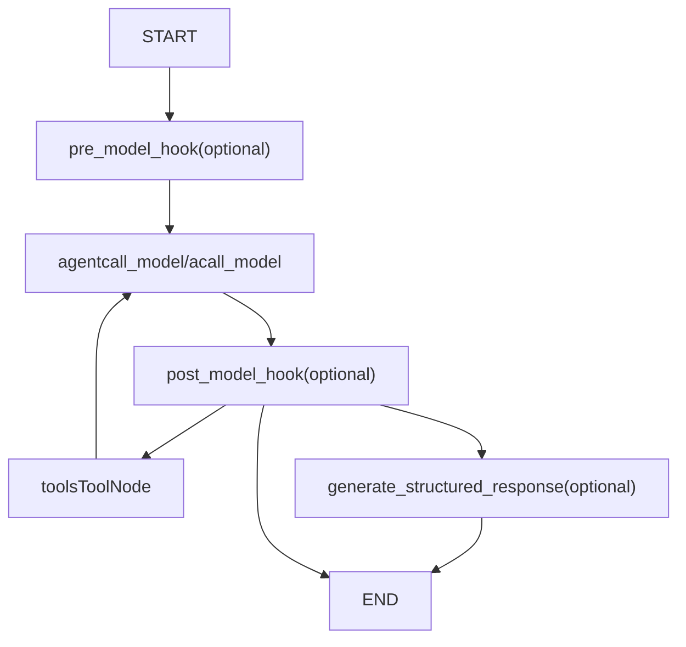
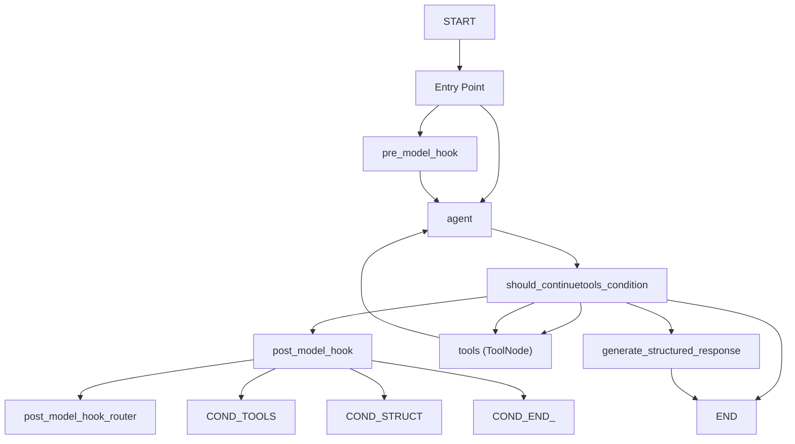
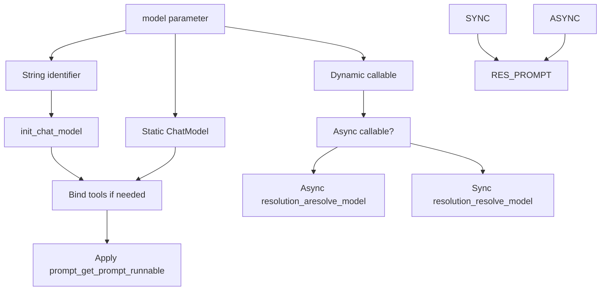
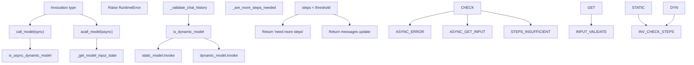
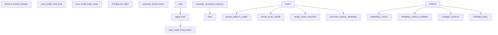
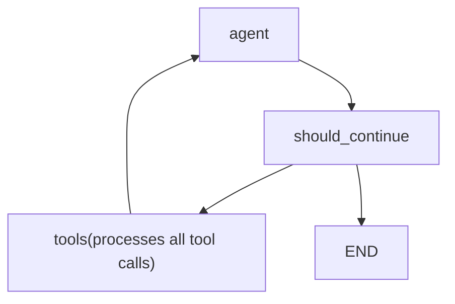
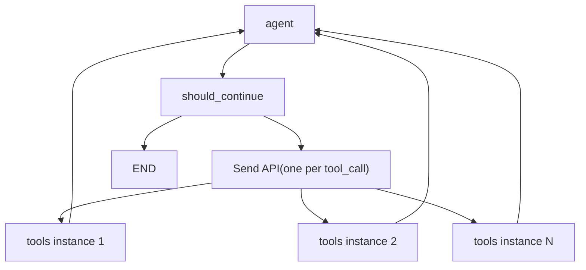

# ReAct 代理 (create\_react\_agent)

相关源文件

-   [libs/langgraph/langgraph/graph/\_\_init\_\_.py](https://github.com/langchain-ai/langgraph/blob/1fd51e8f/libs/langgraph/langgraph/graph/__init__.py)
-   [libs/prebuilt/langgraph/prebuilt/\_\_init\_\_.py](https://github.com/langchain-ai/langgraph/blob/1fd51e8f/libs/prebuilt/langgraph/prebuilt/__init__.py)
-   [libs/prebuilt/langgraph/prebuilt/chat\_agent\_executor.py](https://github.com/langchain-ai/langgraph/blob/1fd51e8f/libs/prebuilt/langgraph/prebuilt/chat_agent_executor.py)
-   [libs/prebuilt/langgraph/prebuilt/tool\_node.py](https://github.com/langchain-ai/langgraph/blob/1fd51e8f/libs/prebuilt/langgraph/prebuilt/tool_node.py)
-   [libs/prebuilt/langgraph/prebuilt/tool\_validator.py](https://github.com/langchain-ai/langgraph/blob/1fd51e8f/libs/prebuilt/langgraph/prebuilt/tool_validator.py)
-   [libs/prebuilt/tests/test\_deprecation.py](https://github.com/langchain-ai/langgraph/blob/1fd51e8f/libs/prebuilt/tests/test_deprecation.py)
-   [libs/prebuilt/tests/test\_on\_tool\_call.py](https://github.com/langchain-ai/langgraph/blob/1fd51e8f/libs/prebuilt/tests/test_on_tool_call.py)
-   [libs/prebuilt/tests/test\_react\_agent.py](https://github.com/langchain-ai/langgraph/blob/1fd51e8f/libs/prebuilt/tests/test_react_agent.py)
-   [libs/prebuilt/tests/test\_tool\_node.py](https://github.com/langchain-ai/langgraph/blob/1fd51e8f/libs/prebuilt/tests/test_tool_node.py)
-   [libs/prebuilt/tests/test\_tool\_node\_interceptor\_unregistered.py](https://github.com/langchain-ai/langgraph/blob/1fd51e8f/libs/prebuilt/tests/test_tool_node_interceptor_unregistered.py)
-   [libs/prebuilt/tests/test\_tool\_node\_validation\_error\_filtering.py](https://github.com/langchain-ai/langgraph/blob/1fd51e8f/libs/prebuilt/tests/test_tool_node_validation_error_filtering.py)

本页文档介绍 `create_react_agent` 工厂函数，该函数用于构建预构建的 ReAct（Reasoning and Acting）代理图。该函数提供高级 API，用于创建在调用语言模型与执行工具之间循环的代理，直到满足停止条件。

**范围**：本页涵盖 `create_react_agent` 工厂函数、其参数、生成的图结构以及执行模式。关于工具执行机制的细节，参见 [ToolNode and Tool Execution (8.2)](https://github.com/langchain-ai/langgraph/blob/1fd51e8f/ToolNode and Tool Execution (8.2))

**说明**：`create_react_agent` 自 LangGraph v0.1.0 起已弃用，推荐改用 `langchain.agents` 包中的 `create_agent`，该方案提供等效功能并具备更灵活的中间件系统。本文档描述的是其在 `langgraph-prebuilt` 中的现有实现。 [libs/prebuilt/langgraph/prebuilt/chat\_agent\_executor.py43-46](https://github.com/langchain-ai/langgraph/blob/1fd51e8f/libs/prebuilt/langgraph/prebuilt/chat_agent_executor.py#L43-L46)

---

## 工厂函数概览

`create_react_agent` 函数签名：

```
def create_react_agent(    model: LanguageModelLike | Callable,    tools: Sequence[BaseTool | Callable] | ToolNode,    *,    prompt: Prompt | None = None,    response_format: StructuredResponseSchema | tuple[str, StructuredResponseSchema] | None = None,    pre_model_hook: RunnableLike | None = None,    post_model_hook: RunnableLike | None = None,    state_schema: StateSchemaType | None = None,    context_schema: type[Any] | None = None,    checkpointer: Checkpointer | None = None,    store: BaseStore | None = None,    interrupt_before: list[str] | None = None,    interrupt_after: list[str] | None = None,    debug: bool = False,    version: Literal["v1", "v2"] = "v2",    name: str | None = None,) -> CompiledStateGraph
```
**来源**: [libs/prebuilt/langgraph/prebuilt/chat\_agent\_executor.py278-308](https://github.com/langchain-ai/langgraph/blob/1fd51e8f/libs/prebuilt/langgraph/prebuilt/chat_agent_executor.py#L278-L308)

---

## 图架构

### 基础图结构

`create_react_agent` 函数会构建一个 `StateGraph`，节点结构如下：


**图：生成的图节点结构**

实际边连接取决于可选参数：

-   `pre_model_hook`：若提供，则成为入口点；否则 `agent` 为入口点。 [libs/prebuilt/langgraph/prebuilt/chat\_agent\_executor.py876-881](https://github.com/langchain-ai/langgraph/blob/1fd51e8f/libs/prebuilt/langgraph/prebuilt/chat_agent_executor.py#L876-L881)
-   `post_model_hook`：若提供，则插入在 `agent` 节点之后。 [libs/prebuilt/langgraph/prebuilt/chat\_agent\_executor.py890-895](https://github.com/langchain-ai/langgraph/blob/1fd51e8f/libs/prebuilt/langgraph/prebuilt/chat_agent_executor.py#L890-L895)
-   `response_format`：若提供，则新增 `generate_structured_response` 作为终端节点。 [libs/prebuilt/langgraph/prebuilt/chat\_agent\_executor.py898-910](https://github.com/langchain-ai/langgraph/blob/1fd51e8f/libs/prebuilt/langgraph/prebuilt/chat_agent_executor.py#L898-L910)

**来源**: [libs/prebuilt/langgraph/prebuilt/chat\_agent\_executor.py787-915](https://github.com/langchain-ai/langgraph/blob/1fd51e8f/libs/prebuilt/langgraph/prebuilt/chat_agent_executor.py#L787-L915)

### 带条件分支的执行流


**图：带路由逻辑的 ReAct 代理执行流**

`should_continue` 函数会基于最后一条消息的 `tool_calls` 属性进行路由：

-   若存在工具调用 → 路由到 tools。 [libs/prebuilt/langgraph/prebuilt/chat\_agent\_executor.py843-859](https://github.com/langchain-ai/langgraph/blob/1fd51e8f/libs/prebuilt/langgraph/prebuilt/chat_agent_executor.py#L843-L859)
-   若无工具调用且提供了 `response_format` → 路由到结构化响应生成。 [libs/prebuilt/langgraph/prebuilt/chat\_agent\_executor.py837-839](https://github.com/langchain-ai/langgraph/blob/1fd51e8f/libs/prebuilt/langgraph/prebuilt/chat_agent_executor.py#L837-L839)
-   否则 → `END`。 [libs/prebuilt/langgraph/prebuilt/chat\_agent\_executor.py841](https://github.com/langchain-ai/langgraph/blob/1fd51e8f/libs/prebuilt/langgraph/prebuilt/chat_agent_executor.py#L841-L841)

**来源**: [libs/prebuilt/langgraph/prebuilt/chat\_agent\_executor.py831-943](https://github.com/langchain-ai/langgraph/blob/1fd51e8f/libs/prebuilt/langgraph/prebuilt/chat_agent_executor.py#L831-L943)

---

## 代理状态 Schema

### 默认状态：AgentState

当未提供 `state_schema` 时，使用的默认状态 schema：

```
class AgentState(TypedDict):    messages: Annotated[Sequence[BaseMessage], add_messages]    remaining_steps: NotRequired[RemainingSteps]
```
-   **`messages`**：带有 `add_messages` reducer 的消息列表，用于自动聚合消息。 [libs/prebuilt/langgraph/prebuilt/chat\_agent\_executor.py60](https://github.com/langchain-ai/langgraph/blob/1fd51e8f/libs/prebuilt/langgraph/prebuilt/chat_agent_executor.py#L60-L60)
-   **`remaining_steps`**：用于跟踪剩余执行步数的托管通道。 [libs/prebuilt/langgraph/prebuilt/chat\_agent\_executor.py62](https://github.com/langchain-ai/langgraph/blob/1fd51e8f/libs/prebuilt/langgraph/prebuilt/chat_agent_executor.py#L62-L62)

**来源**: [libs/prebuilt/langgraph/prebuilt/chat\_agent\_executor.py53-62](https://github.com/langchain-ai/langgraph/blob/1fd51e8f/libs/prebuilt/langgraph/prebuilt/chat_agent_executor.py#L53-L62)

### 自定义状态 Schema

自定义状态 schema 必须包含 `messages` 与 `remaining_steps` 键。支持 `TypedDict` 和 Pydantic `BaseModel` schema。 [libs/prebuilt/langgraph/prebuilt/chat\_agent\_executor.py538-552](https://github.com/langchain-ai/langgraph/blob/1fd51e8f/libs/prebuilt/langgraph/prebuilt/chat_agent_executor.py#L538-L552)

```
# TypedDict exampleclass CustomState(AgentState):    user_id: str    context: dict # Pydantic example  class CustomStatePydantic(AgentStatePydantic):    user_id: str    context: dict = {}
```
当提供 `state_schema` 时，函数会校验必需键是否存在；若缺失将抛出 `ValueError`。 [libs/prebuilt/langgraph/prebuilt/chat\_agent\_executor.py548-552](https://github.com/langchain-ai/langgraph/blob/1fd51e8f/libs/prebuilt/langgraph/prebuilt/chat_agent_executor.py#L548-L552)

**来源**: [libs/prebuilt/langgraph/prebuilt/chat\_agent\_executor.py538-552](https://github.com/langchain-ai/langgraph/blob/1fd51e8f/libs/prebuilt/langgraph/prebuilt/chat_agent_executor.py#L538-L552) [libs/prebuilt/tests/test\_react\_agent.py525-596](https://github.com/langchain-ai/langgraph/blob/1fd51e8f/libs/prebuilt/tests/test_react_agent.py#L525-L596)

---

## 模型配置

### 静态模型

静态模型可直接以 `BaseChatModel` 实例或字符串标识符提供。 [libs/prebuilt/langgraph/prebuilt/chat\_agent\_executor.py568-588](https://github.com/langchain-ai/langgraph/blob/1fd51e8f/libs/prebuilt/langgraph/prebuilt/chat_agent_executor.py#L568-L588)

```
# ChatModel instanceagent = create_react_agent(ChatOpenAI(model="gpt-4"), tools) # String identifier (requires langchain package)agent = create_react_agent("openai:gpt-4", tools)
```
除非模型已通过 `model.bind_tools()` 绑定工具，否则函数会自动执行绑定。 [libs/prebuilt/langgraph/prebuilt/chat\_agent\_executor.py587-588](https://github.com/langchain-ai/langgraph/blob/1fd51e8f/libs/prebuilt/langgraph/prebuilt/chat_agent_executor.py#L587-L588)

**来源**: [libs/prebuilt/langgraph/prebuilt/chat\_agent\_executor.py568-588](https://github.com/langchain-ai/langgraph/blob/1fd51e8f/libs/prebuilt/langgraph/prebuilt/chat_agent_executor.py#L568-L588)

### 动态模型选择

也可提供一个可调用对象，根据运行时状态与上下文返回模型：

```
def select_model(state: AgentState, runtime: Runtime[ModelContext]) -> BaseChatModel:    model_name = runtime.context.model_name    if model_name == "gpt-4":        return ChatOpenAI(model="gpt-4").bind_tools(tools)    else:        return ChatOpenAI(model="gpt-3.5-turbo").bind_tools(tools) agent = create_react_agent(select_model, tools, context_schema=ModelContext)
```
该可调用对象接收 `state` 和 `runtime`。 [libs/prebuilt/langgraph/prebuilt/chat\_agent\_executor.py563-567](https://github.com/langchain-ai/langgraph/blob/1fd51e8f/libs/prebuilt/langgraph/prebuilt/chat_agent_executor.py#L563-L567) 同步与异步可调用对象均受支持。函数通过 `inspect.iscoroutinefunction()` 检测异步可调用对象，并使用相应的异步解析路径。 [libs/prebuilt/langgraph/prebuilt/chat\_agent\_executor.py599-618](https://github.com/langchain-ai/langgraph/blob/1fd51e8f/libs/prebuilt/langgraph/prebuilt/chat_agent_executor.py#L599-L618)

**来源**: [libs/prebuilt/langgraph/prebuilt/chat\_agent\_executor.py563-618](https://github.com/langchain-ai/langgraph/blob/1fd51e8f/libs/prebuilt/langgraph/prebuilt/chat_agent_executor.py#L563-L618)

### 模型解析流程


**图：模型解析与绑定流程**

**来源**: [libs/prebuilt/langgraph/prebuilt/chat\_agent\_executor.py599-618](https://github.com/langchain-ai/langgraph/blob/1fd51e8f/libs/prebuilt/langgraph/prebuilt/chat_agent_executor.py#L599-L618)

---

## Prompt 配置

`prompt` 参数支持多种格式：

### Prompt 格式类型

| 格式 | 类型 | 行为 |
| --- | --- | --- |
| `None` | 默认 | 直接将 `state["messages"]` 传给模型。 [libs/prebuilt/langgraph/prebuilt/chat\_agent\_executor.py139-142](https://github.com/langchain-ai/langgraph/blob/1fd51e8f/libs/prebuilt/langgraph/prebuilt/chat_agent_executor.py#L139-L142) |
| `str` | 字符串 | 转换为 `SystemMessage` 并前置到消息列表。 [libs/prebuilt/langgraph/prebuilt/chat\_agent\_executor.py143-148](https://github.com/langchain-ai/langgraph/blob/1fd51e8f/libs/prebuilt/langgraph/prebuilt/chat_agent_executor.py#L143-L148) |
| `SystemMessage` | 消息对象 | 前置到消息列表。 [libs/prebuilt/langgraph/prebuilt/chat\_agent\_executor.py149-153](https://github.com/langchain-ai/langgraph/blob/1fd51e8f/libs/prebuilt/langgraph/prebuilt/chat_agent_executor.py#L149-L153) |
| `Callable` | 函数 | 以 state 调用，返回 `LanguageModelInput`。 [libs/prebuilt/langgraph/prebuilt/chat\_agent\_executor.py160-164](https://github.com/langchain-ai/langgraph/blob/1fd51e8f/libs/prebuilt/langgraph/prebuilt/chat_agent_executor.py#L160-L164) |
| `Runnable` | Runnable | 以 state 调用，返回 `LanguageModelInput`。 [libs/prebuilt/langgraph/prebuilt/chat\_agent\_executor.py165-166](https://github.com/langchain-ai/langgraph/blob/1fd51e8f/libs/prebuilt/langgraph/prebuilt/chat_agent_executor.py#L165-L166) |

**来源**: [libs/prebuilt/langgraph/prebuilt/chat\_agent\_executor.py119-170](https://github.com/langchain-ai/langgraph/blob/1fd51e8f/libs/prebuilt/langgraph/prebuilt/chat_agent_executor.py#L119-L170)

### 可访问存储的 Prompt

Prompt 可访问持久化存储以获取用户特定上下文：

```
def prompt_with_store(state, config, *, store):    user_id = config["configurable"]["user_id"]    user_data = store.get(("memories", user_id), "user_name")    system_msg = SystemMessage(user_data.value["data"])    return [system_msg] + state["messages"] agent = create_react_agent(    model,    tools,    prompt=prompt_with_store,    store=InMemoryStore())
```
当 prompt 可调用对象的签名中包含 store 时，`store` 参数会通过运行时依赖注入注入。 [libs/prebuilt/tests/test\_react\_agent.py207-251](https://github.com/langchain-ai/langgraph/blob/1fd51e8f/libs/prebuilt/tests/test_react_agent.py#L207-L251)

**来源**: [libs/prebuilt/tests/test\_react\_agent.py207-251](https://github.com/langchain-ai/langgraph/blob/1fd51e8f/libs/prebuilt/tests/test_react_agent.py#L207-L251)

---

## 代理节点实现

### call\_model 和 acall\_model 函数

`agent` 节点会执行以下两种函数之一：


**图：代理节点执行逻辑**

`call_model` 函数先通过 `_get_model_input_state` 执行输入校验 [libs/prebuilt/langgraph/prebuilt/chat\_agent\_executor.py636-659](https://github.com/langchain-ai/langgraph/blob/1fd51e8f/libs/prebuilt/langgraph/prebuilt/chat_agent_executor.py#L636-L659)，再调用 `_validate_chat_history`。 [libs/prebuilt/langgraph/prebuilt/chat\_agent\_executor.py672](https://github.com/langchain-ai/langgraph/blob/1fd51e8f/libs/prebuilt/langgraph/prebuilt/chat_agent_executor.py#L672-L672) 随后调用模型，并通过 `_are_more_steps_needed` 进行步数限制检查。 [libs/prebuilt/langgraph/prebuilt/chat\_agent\_executor.py684-692](https://github.com/langchain-ai/langgraph/blob/1fd51e8f/libs/prebuilt/langgraph/prebuilt/chat_agent_executor.py#L684-L692)

**来源**: [libs/prebuilt/langgraph/prebuilt/chat\_agent\_executor.py661-721](https://github.com/langchain-ai/langgraph/blob/1fd51e8f/libs/prebuilt/langgraph/prebuilt/chat_agent_executor.py#L661-L721)

### 消息历史校验

`_validate_chat_history` 函数确保所有工具调用都存在对应的工具消息。 [libs/prebuilt/langgraph/prebuilt/chat\_agent\_executor.py243-271](https://github.com/langchain-ai/langgraph/blob/1fd51e8f/libs/prebuilt/langgraph/prebuilt/chat_agent_executor.py#L243-L271)

```
def _validate_chat_history(messages: Sequence[BaseMessage]) -> None:    """Validate that all tool calls in AIMessages have a corresponding ToolMessage."""    all_tool_calls = [        tool_call        for message in messages        if isinstance(message, AIMessage)        for tool_call in message.tool_calls    ]    tool_call_ids_with_results = {        message.tool_call_id for message in messages if isinstance(message, ToolMessage)    }    tool_calls_without_results = [        tool_call        for tool_call in all_tool_calls        if tool_call["id"] not in tool_call_ids_with_results    ]    if tool_calls_without_results:        # Raises ValueError with error code INVALID_CHAT_HISTORY
```
**来源**: [libs/prebuilt/langgraph/prebuilt/chat\_agent\_executor.py243-271](https://github.com/langchain-ai/langgraph/blob/1fd51e8f/libs/prebuilt/langgraph/prebuilt/chat_agent_executor.py#L243-L271)

### 剩余步数检查

`_are_more_steps_needed` 函数通过检查 `remaining_steps` 防止无限循环。 [libs/prebuilt/langgraph/prebuilt/chat\_agent\_executor.py620-634](https://github.com/langchain-ai/langgraph/blob/1fd51e8f/libs/prebuilt/langgraph/prebuilt/chat_agent_executor.py#L620-L634)

```
def _are_more_steps_needed(state: StateSchema, response: BaseMessage) -> bool:    has_tool_calls = isinstance(response, AIMessage) and response.tool_calls    all_tools_return_direct = (        all(call["name"] in should_return_direct for call in response.tool_calls)        if isinstance(response, AIMessage)        else False    )    remaining_steps = _get_state_value(state, "remaining_steps", None)    if remaining_steps is not None:        if remaining_steps < 1 and all_tools_return_direct:            return True        elif remaining_steps < 2 and has_tool_calls:            return True    return False
```
当剩余步数不足时，代理会返回消息：`"Sorry, need more steps to process this request."` [libs/prebuilt/langgraph/prebuilt/chat\_agent\_executor.py688](https://github.com/langchain-ai/langgraph/blob/1fd51e8f/libs/prebuilt/langgraph/prebuilt/chat_agent_executor.py#L688-L688)

**来源**: [libs/prebuilt/langgraph/prebuilt/chat\_agent\_executor.py620-692](https://github.com/langchain-ai/langgraph/blob/1fd51e8f/libs/prebuilt/langgraph/prebuilt/chat_agent_executor.py#L620-L692)

---

## 模型前后钩子

### Pre-Model Hook

`pre_model_hook` 会在每次迭代中于代理节点之前执行。 [libs/prebuilt/langgraph/prebuilt/chat\_agent\_executor.py876-881](https://github.com/langchain-ai/langgraph/blob/1fd51e8f/libs/prebuilt/langgraph/prebuilt/chat_agent_executor.py#L876-L881) 常见用途包括消息裁剪或上下文注入。 [libs/prebuilt/langgraph/prebuilt/chat\_agent\_executor.py396-424](https://github.com/langchain-ai/langgraph/blob/1fd51e8f/libs/prebuilt/langgraph/prebuilt/chat_agent_executor.py#L396-L424)

```
def trim_messages(state):    messages = state["messages"]    # Keep only last 10 messages    return {        "messages": [RemoveMessage(id=REMOVE_ALL_MESSAGES)] + messages[-10:],    } agent = create_react_agent(model, tools, pre_model_hook=trim_messages)
```
**来源**: [libs/prebuilt/langgraph/prebuilt/chat\_agent\_executor.py396-881](https://github.com/langchain-ai/langgraph/blob/1fd51e8f/libs/prebuilt/langgraph/prebuilt/chat_agent_executor.py#L396-L881)

### Post-Model Hook

`post_model_hook` 会在代理节点之后执行。 [libs/prebuilt/langgraph/prebuilt/chat\_agent\_executor.py890-895](https://github.com/langchain-ai/langgraph/blob/1fd51e8f/libs/prebuilt/langgraph/prebuilt/chat_agent_executor.py#L890-L895) 使用场景包括 human-in-the-loop 审批或响应校验。仅在 `version="v2"` 下可用。 [libs/prebuilt/langgraph/prebuilt/chat\_agent\_executor.py425-430](https://github.com/langchain-ai/langgraph/blob/1fd51e8f/libs/prebuilt/langgraph/prebuilt/chat_agent_executor.py#L425-L430)

```
def require_approval(state):    last_message = state["messages"][-1]    if last_message.tool_calls:        # Pause for approval        approved = interrupt("Approve tool calls?")        if not approved:            return Command(goto=END)    return state agent = create_react_agent(    model,     tools,     post_model_hook=require_approval,    version="v2")
```
**来源**: [libs/prebuilt/langgraph/prebuilt/chat\_agent\_executor.py425-895](https://github.com/langchain-ai/langgraph/blob/1fd51e8f/libs/prebuilt/langgraph/prebuilt/chat_agent_executor.py#L425-L895)

### 钩子路由逻辑

当存在 `post_model_hook` 时，路由逻辑会更复杂：


**图：Post-Model Hook 路由流程**

`post_model_hook_router` 会通过比较 AI 消息中的工具调用 ID 与现有工具消息来检查是否存在待处理工具调用。 [libs/prebuilt/langgraph/prebuilt/chat\_agent\_executor.py917-943](https://github.com/langchain-ai/langgraph/blob/1fd51e8f/libs/prebuilt/langgraph/prebuilt/chat_agent_executor.py#L917-L943)

**来源**: [libs/prebuilt/langgraph/prebuilt/chat\_agent\_executor.py917-943](https://github.com/langchain-ai/langgraph/blob/1fd51e8f/libs/prebuilt/langgraph/prebuilt/chat_agent_executor.py#L917-L943)

---

## 结构化响应生成

当提供 `response_format` 时，代理会在循环结束后生成结构化输出。 [libs/prebuilt/langgraph/prebuilt/chat\_agent\_executor.py744-786](https://github.com/langchain-ai/langgraph/blob/1fd51e8f/libs/prebuilt/langgraph/prebuilt/chat_agent_executor.py#L744-L786)

### 生成流程

```
def generate_structured_response(    state: StateSchema, runtime: Runtime[ContextT], config: RunnableConfig) -> StateSchema:    messages = _get_state_value(state, "messages")    structured_response_schema = response_format    if isinstance(response_format, tuple):        system_prompt, structured_response_schema = response_format        messages = [SystemMessage(content=system_prompt)] + list(messages)     resolved_model = _resolve_model(state, runtime)    model_with_structured_output = _get_model(        resolved_model    ).with_structured_output(structured_response_schema)    response = model_with_structured_output.invoke(messages, config)    return {"structured_response": response}
```
结构化响应会存储在 `state["structured_response"]` 中。 [libs/prebuilt/langgraph/prebuilt/chat\_agent\_executor.py785](https://github.com/langchain-ai/langgraph/blob/1fd51e8f/libs/prebuilt/langgraph/prebuilt/chat_agent_executor.py#L785-L785)

**来源**: [libs/prebuilt/langgraph/prebuilt/chat\_agent\_executor.py744-910](https://github.com/langchain-ai/langgraph/blob/1fd51e8f/libs/prebuilt/langgraph/prebuilt/chat_agent_executor.py#L744-L910)

### 状态 Schema 要求

使用 `response_format` 时，状态 schema 必须包含 `structured_response` 键。 [libs/prebuilt/langgraph/prebuilt/chat\_agent\_executor.py538-552](https://github.com/langchain-ai/langgraph/blob/1fd51e8f/libs/prebuilt/langgraph/prebuilt/chat_agent_executor.py#L538-L552)

```
class AgentStateWithStructuredResponse(AgentState):    structured_response: StructuredResponse  # dict | BaseModel
```
**来源**: [libs/prebuilt/langgraph/prebuilt/chat\_agent\_executor.py88-552](https://github.com/langchain-ai/langgraph/blob/1fd51e8f/libs/prebuilt/langgraph/prebuilt/chat_agent_executor.py#L88-L552)

---

## 版本差异：v1 vs v2

### 版本 1：批量工具执行

在 `version="v1"` 中，`ToolNode` 会接收一条包含所有工具调用的消息，并在一次节点调用中并行执行。 [libs/prebuilt/langgraph/prebuilt/chat\_agent\_executor.py844-845](https://github.com/langchain-ai/langgraph/blob/1fd51e8f/libs/prebuilt/langgraph/prebuilt/chat_agent_executor.py#L844-L845)


**图：版本 1 工具执行流**

**来源**: [libs/prebuilt/langgraph/prebuilt/chat\_agent\_executor.py844-845](https://github.com/langchain-ai/langgraph/blob/1fd51e8f/libs/prebuilt/langgraph/prebuilt/chat_agent_executor.py#L844-L845)

### 版本 2：分布式工具执行

在 `version="v2"` 中，每个工具调用都会通过 `Send` API 分发到独立的 `ToolNode` 实例。 [libs/prebuilt/langgraph/prebuilt/chat\_agent\_executor.py846-859](https://github.com/langchain-ai/langgraph/blob/1fd51e8f/libs/prebuilt/langgraph/prebuilt/chat_agent_executor.py#L846-L859)


**图：使用 Send API 的版本 2 工具执行**

`should_continue` 函数返回一个 `Send` 对象列表。 [libs/prebuilt/langgraph/prebuilt/chat\_agent\_executor.py853-858](https://github.com/langchain-ai/langgraph/blob/1fd51e8f/libs/prebuilt/langgraph/prebuilt/chat_agent_executor.py#L853-L858)

**来源**: [libs/prebuilt/langgraph/prebuilt/chat\_agent\_executor.py846-859](https://github.com/langchain-ai/langgraph/blob/1fd51e8f/libs/prebuilt/langgraph/prebuilt/chat_agent_executor.py#L846-L859)

---

## 工具绑定与校验

### 工具绑定逻辑

`_should_bind_tools` 函数通过检查已有 `RunnableBinding` kwargs 来判断是否应将工具绑定到模型。 [libs/prebuilt/langgraph/prebuilt/chat\_agent\_executor.py173-217](https://github.com/langchain-ai/langgraph/blob/1fd51e8f/libs/prebuilt/langgraph/prebuilt/chat_agent_executor.py#L173-L217)

**来源**: [libs/prebuilt/langgraph/prebuilt/chat\_agent\_executor.py173-217](https://github.com/langchain-ai/langgraph/blob/1fd51e8f/libs/prebuilt/langgraph/prebuilt/chat_agent_executor.py#L173-L217)

### 内置工具

该工厂支持以字典形式传入内置工具（例如 MCP 工具）。 [libs/prebuilt/langgraph/prebuilt/chat\_agent\_executor.py554-561](https://github.com/langchain-ai/langgraph/blob/1fd51e8f/libs/prebuilt/langgraph/prebuilt/chat_agent_executor.py#L554-L561)

**来源**: [libs/prebuilt/langgraph/prebuilt/chat\_agent\_executor.py554-561](https://github.com/langchain-ai/langgraph/blob/1fd51e8f/libs/prebuilt/langgraph/prebuilt/chat_agent_executor.py#L554-L561) [libs/prebuilt/tests/test\_react\_agent.py312-327](https://github.com/langchain-ai/langgraph/blob/1fd51e8f/libs/prebuilt/tests/test_react_agent.py#L312-L327)

---

## 执行模式

### 基础调用

```
agent = create_react_agent(model, [tool1, tool2])result = agent.invoke({"messages": [HumanMessage("What's the weather?")]})
```
**来源**: [libs/prebuilt/tests/test\_react\_agent.py91-104](https://github.com/langchain-ai/langgraph/blob/1fd51e8f/libs/prebuilt/tests/test_react_agent.py#L91-L104)

### 带中断的人在回路（Human-in-the-Loop）

```
@dec_tooldef sensitive_action(x: int) -> Command:    approval = interrupt("Approve this action?")    if approval:        return Command(update={"messages": [ToolMessage("Done", tool_call_id=...)]})    else:        return Command(goto=END) agent = create_react_agent(model, [sensitive_action], checkpointer=checkpointer)agent.invoke({"messages": [("user", "do action")]}, config)agent.invoke(Command(resume=True), config)
```
**来源**: [libs/prebuilt/tests/test\_react\_agent.py533-596](https://github.com/langchain-ai/langgraph/blob/1fd51e8f/libs/prebuilt/tests/test_react_agent.py#L533-L596)

---

## 图构建代码映射

| 概念 | 代码实体 | 位置 |
| --- | --- | --- |
| 工厂函数 | `create_react_agent()` | [libs/prebuilt/langgraph/prebuilt/chat\_agent\_executor.py278](https://github.com/langchain-ai/langgraph/blob/1fd51e8f/libs/prebuilt/langgraph/prebuilt/chat_agent_executor.py#L278-L278) |
| 默认状态 | `AgentState` TypedDict | [libs/prebuilt/langgraph/prebuilt/chat\_agent\_executor.py57](https://github.com/langchain-ai/langgraph/blob/1fd51e8f/libs/prebuilt/langgraph/prebuilt/chat_agent_executor.py#L57-L57) |
| 代理节点函数 | `call_model()` / `acall_model()` | [libs/prebuilt/langgraph/prebuilt/chat\_agent\_executor.py661-696](https://github.com/langchain-ai/langgraph/blob/1fd51e8f/libs/prebuilt/langgraph/prebuilt/chat_agent_executor.py#L661-L696) |
| 工具路由 | `should_continue()` | [libs/prebuilt/langgraph/prebuilt/chat\_agent\_executor.py831](https://github.com/langchain-ai/langgraph/blob/1fd51e8f/libs/prebuilt/langgraph/prebuilt/chat_agent_executor.py#L831-L831) |
| Prompt 处理 | `_get_prompt_runnable()` | [libs/prebuilt/langgraph/prebuilt/chat\_agent\_executor.py137](https://github.com/langchain-ai/langgraph/blob/1fd51e8f/libs/prebuilt/langgraph/prebuilt/chat_agent_executor.py#L137-L137) |
| 消息校验 | `_validate_chat_history()` | [libs/prebuilt/langgraph/prebuilt/chat\_agent\_executor.py243](https://github.com/langchain-ai/langgraph/blob/1fd51e8f/libs/prebuilt/langgraph/prebuilt/chat_agent_executor.py#L243-L243) |
| 步数限制检查 | `_are_more_steps_needed()` | [libs/prebuilt/langgraph/prebuilt/chat\_agent\_executor.py620](https://github.com/langchain-ai/langgraph/blob/1fd51e8f/libs/prebuilt/langgraph/prebuilt/chat_agent_executor.py#L620-L620) |
| 结构化输出 | `generate_structured_response()` | [libs/prebuilt/langgraph/prebuilt/chat\_agent\_executor.py744](https://github.com/langchain-ai/langgraph/blob/1fd51e8f/libs/prebuilt/langgraph/prebuilt/chat_agent_executor.py#L744-L744) |
| 图构建器 | `StateGraph` | [libs/prebuilt/langgraph/prebuilt/chat\_agent\_executor.py789-862](https://github.com/langchain-ai/langgraph/blob/1fd51e8f/libs/prebuilt/langgraph/prebuilt/chat_agent_executor.py#L789-L862) |

**来源**: [libs/prebuilt/langgraph/prebuilt/chat\_agent\_executor.py1-943](https://github.com/langchain-ai/langgraph/blob/1fd51e8f/libs/prebuilt/langgraph/prebuilt/chat_agent_executor.py#L1-L943)
