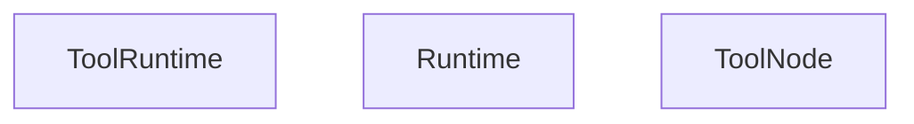
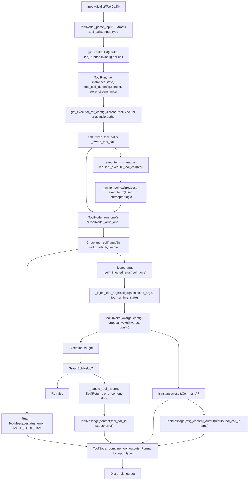
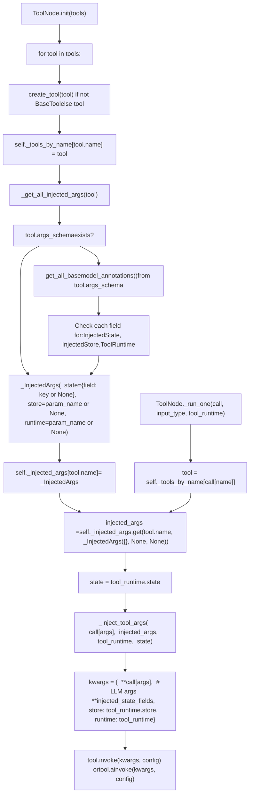
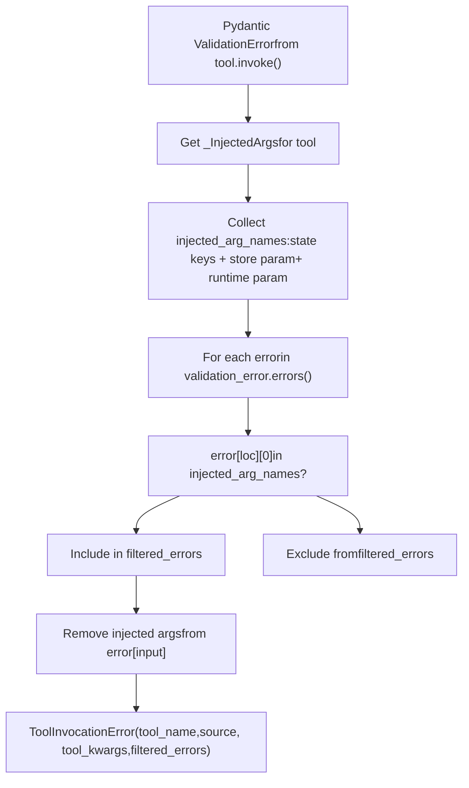
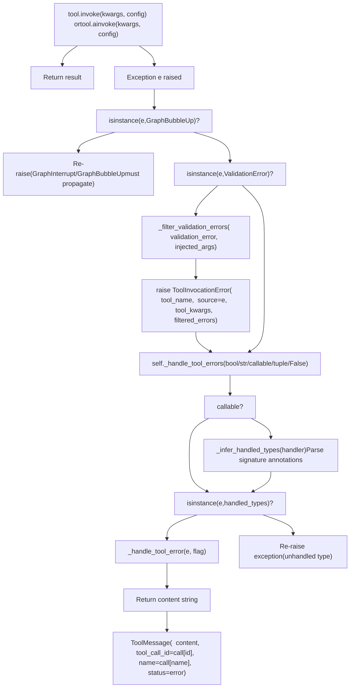
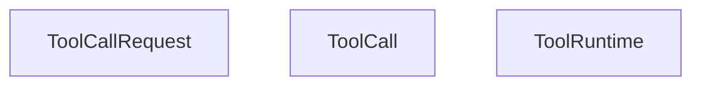
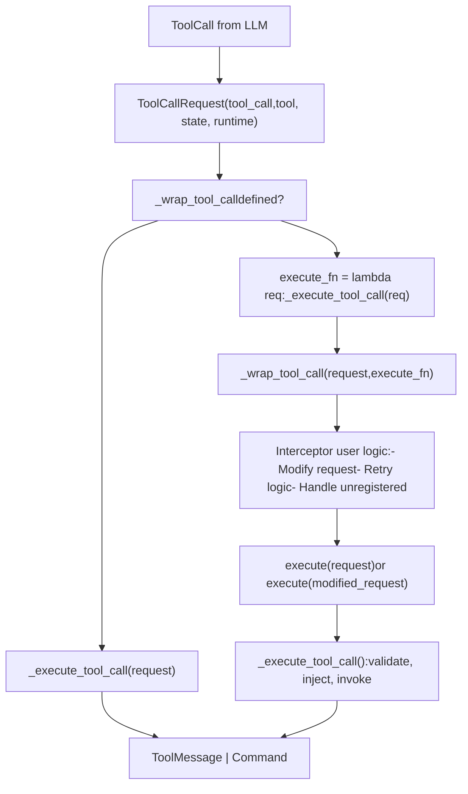
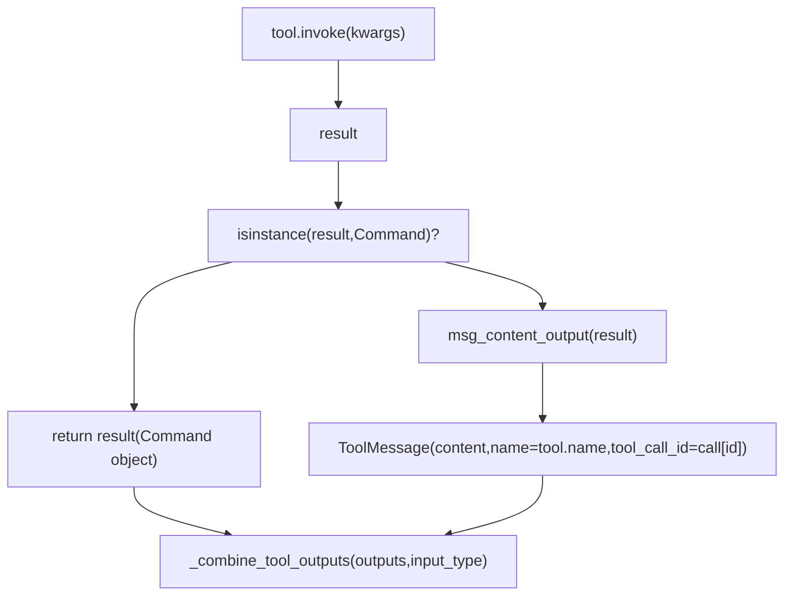
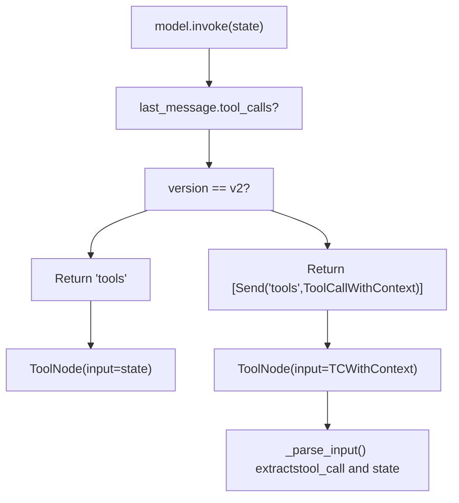

# ToolNode 与工具执行

相关源文件

-   [libs/langgraph/langgraph/graph/\_\_init\_\_.py](https://github.com/langchain-ai/langgraph/blob/1fd51e8f/libs/langgraph/langgraph/graph/__init__.py)
-   [libs/prebuilt/langgraph/prebuilt/\_\_init\_\_.py](https://github.com/langchain-ai/langgraph/blob/1fd51e8f/libs/prebuilt/langgraph/prebuilt/__init__.py)
-   [libs/prebuilt/langgraph/prebuilt/chat\_agent\_executor.py](https://github.com/langchain-ai/langgraph/blob/1fd51e8f/libs/prebuilt/langgraph/prebuilt/chat_agent_executor.py)
-   [libs/prebuilt/langgraph/prebuilt/tool\_node.py](https://github.com/langchain-ai/langgraph/blob/1fd51e8f/libs/prebuilt/langgraph/prebuilt/tool_node.py)
-   [libs/prebuilt/langgraph/prebuilt/tool\_validator.py](https://github.com/langchain-ai/langgraph/blob/1fd51e8f/libs/prebuilt/langgraph/prebuilt/tool_validator.py)
-   [libs/prebuilt/tests/test\_deprecation.py](https://github.com/langchain-ai/langgraph/blob/1fd51e8f/libs/prebuilt/tests/test_deprecation.py)
-   [libs/prebuilt/tests/test\_on\_tool\_call.py](https://github.com/langchain-ai/langgraph/blob/1fd51e8f/libs/prebuilt/tests/test_on_tool_call.py)
-   [libs/prebuilt/tests/test\_react\_agent.py](https://github.com/langchain-ai/langgraph/blob/1fd51e8f/libs/prebuilt/tests/test_react_agent.py)
-   [libs/prebuilt/tests/test\_tool\_node.py](https://github.com/langchain-ai/langgraph/blob/1fd51e8f/libs/prebuilt/tests/test_tool_node.py)
-   [libs/prebuilt/tests/test\_tool\_node\_interceptor\_unregistered.py](https://github.com/langchain-ai/langgraph/blob/1fd51e8f/libs/prebuilt/tests/test_tool_node_interceptor_unregistered.py)
-   [libs/prebuilt/tests/test\_tool\_node\_validation\_error\_filtering.py](https://github.com/langchain-ai/langgraph/blob/1fd51e8f/libs/prebuilt/tests/test_tool_node_validation_error_filtering.py)

## 目的与范围

本页文档介绍 LangGraph 预构建组件中的 `ToolNode` 类与工具执行系统。`ToolNode` 是一个复杂的执行引擎，负责代理工作流中的工具调用、依赖注入、错误处理与控制流。

`ToolNode` 提供了供更高层组件使用的底层工具执行机制。关于使用 `ToolNode` 内部能力构建完整 ReAct 风格代理的信息，参见 [ReAct Agent (create\_react\_agent)](/langchain-ai/langgraph/8.1-react-agent-(create_react_agent))。关于与 UI 相关的工具模式，参见 [UI Integration](/langchain-ai/langgraph/8.3-ui-integration)。

**来源：** [libs/prebuilt/langgraph/prebuilt/tool\_node.py1-38](https://github.com/langchain-ai/langgraph/blob/1fd51e8f/libs/prebuilt/langgraph/prebuilt/tool_node.py#L1-L38)

---

## 核心组件

### ToolNode 类

`ToolNode` 继承 `RunnableCallable`，在 LangGraph 工作流中以并行执行、依赖注入和可配置错误处理来执行工具。

**构造函数签名：**

```
ToolNode(    tools: Sequence[BaseTool | Callable],    name: str = "tools",    tags: list[str] | None = None,    handle_tool_errors: bool | str | Callable | type[Exception] | tuple = _default_handle_tool_errors,    messages_key: str = "messages",    wrap_tool_call: ToolCallWrapper | None = None,    awrap_tool_call: AsyncToolCallWrapper | None = None,)
```
**关键属性：**

-   `_tools_by_name: dict[str, BaseTool]` - 将工具名映射到工具实例 [\[libs/prebuilt/langgraph/prebuilt/tool\_node.py773-781](https://github.com/langchain-ai/langgraph/blob/1fd51e8f/[libs/prebuilt/langgraph/prebuilt/tool_node.py#L773-L781)\]
-   `_injected_args: dict[str, _InjectedArgs]` - 每个工具的已缓存注入元数据 [\[libs/prebuilt/langgraph/prebuilt/tool\_node.py773-781](https://github.com/langchain-ai/langgraph/blob/1fd51e8f/[libs/prebuilt/langgraph/prebuilt/tool_node.py#L773-L781)\]
-   `_handle_tool_errors` - 错误处理配置 [\[libs/prebuilt/langgraph/prebuilt/tool\_node.py769](https://github.com/langchain-ai/langgraph/blob/1fd51e8f/[libs/prebuilt/langgraph/prebuilt/tool_node.py#L769-L769)\]
-   `_messages_key` - 消息列表对应的状态键（默认：`"messages"`） [\[libs/prebuilt/langgraph/prebuilt/tool\_node.py770](https://github.com/langchain-ai/langgraph/blob/1fd51e8f/[libs/prebuilt/langgraph/prebuilt/tool_node.py#L770-L770)\]
-   `_wrap_tool_call` / `_awrap_tool_call` - 可选拦截器函数 [\[libs/prebuilt/langgraph/prebuilt/tool\_node.py771-772](https://github.com/langchain-ai/langgraph/blob/1fd51e8f/[libs/prebuilt/langgraph/prebuilt/tool_node.py#L771-L772)\]

**关键方法：**

-   `_func(input, config, runtime)` - 同步执行入口 [\[libs/prebuilt/langgraph/prebuilt/tool\_node.py787-817](https://github.com/langchain-ai/langgraph/blob/1fd51e8f/[libs/prebuilt/langgraph/prebuilt/tool_node.py#L787-L817)\]
-   `_afunc(input, config, runtime)` - 异步执行入口 [\[libs/prebuilt/langgraph/prebuilt/tool\_node.py819-848](https://github.com/langchain-ai/langgraph/blob/1fd51e8f/[libs/prebuilt/langgraph/prebuilt/tool_node.py#L819-L848)\]
-   `_parse_input(input)` - 从输入中提取工具调用（dict/list/ToolCall\[\]） [\[libs/prebuilt/langgraph/prebuilt/tool\_node.py916-976](https://github.com/langchain-ai/langgraph/blob/1fd51e8f/[libs/prebuilt/langgraph/prebuilt/tool_node.py#L916-L976)\]
-   `_run_one(call, input_type, tool_runtime)` - 执行单次工具调用 [\[libs/prebuilt/langgraph/prebuilt/tool\_node.py978-1001](https://github.com/langchain-ai/langgraph/blob/1fd51e8f/[libs/prebuilt/langgraph/prebuilt/tool_node.py#L978-L1001)\]
-   `_execute_tool_call(request)` - 包含校验与注入的核心执行逻辑 [\[libs/prebuilt/langgraph/prebuilt/tool\_node.py1059-1130](https://github.com/langchain-ai/langgraph/blob/1fd51e8f/[libs/prebuilt/langgraph/prebuilt/tool_node.py#L1059-L1130)\]
-   `_combine_tool_outputs(outputs, input_type)` - 按输入类型格式化结果 [\[libs/prebuilt/langgraph/prebuilt/tool\_node.py850-914](https://github.com/langchain-ai/langgraph/blob/1fd51e8f/[libs/prebuilt/langgraph/prebuilt/tool_node.py#L850-L914)\]

**来源：** [libs/prebuilt/langgraph/prebuilt/tool\_node.py616-1130](https://github.com/langchain-ai/langgraph/blob/1fd51e8f/libs/prebuilt/langgraph/prebuilt/tool_node.py#L616-L1130)

### ToolRuntime

`ToolRuntime` 是一个 dataclass，用于打包注入到工具中的运行时上下文。它提供对状态、工具调用元数据和图工具的访问。

**ToolRuntime 结构：**


**来源：** [libs/prebuilt/langgraph/prebuilt/tool\_node.py21-22](https://github.com/langchain-ai/langgraph/blob/1fd51e8f/libs/prebuilt/langgraph/prebuilt/tool_node.py#L21-L22) [libs/prebuilt/langgraph/prebuilt/tool\_node.py796-808](https://github.com/langchain-ai/langgraph/blob/1fd51e8f/libs/prebuilt/langgraph/prebuilt/tool_node.py#L796-L808) [libs/prebuilt/langgraph/prebuilt/tool\_node.py829-840](https://github.com/langchain-ai/langgraph/blob/1fd51e8f/libs/prebuilt/langgraph/prebuilt/tool_node.py#L829-L840)

### 依赖注入注解

三种主要注解可将依赖注入到工具参数中：

| 注解 | 用途 | 示例 |
| --- | --- | --- |
| `InjectedState` | 注入整个状态或特定字段 | `state: Annotated[dict, InjectedState]` |
| `InjectedStore` | 注入持久化存储 | `store: Annotated[BaseStore, InjectedStore()]` |
| `ToolRuntime` | 注入完整运行时打包对象 | `runtime: ToolRuntime` |

**来源：** [libs/prebuilt/langgraph/prebuilt/\_\_init\_\_.py1-22](https://github.com/langchain-ai/langgraph/blob/1fd51e8f/libs/prebuilt/langgraph/prebuilt/__init__.py#L1-L22) [libs/prebuilt/langgraph/prebuilt/tool\_node.py562-614](https://github.com/langchain-ai/langgraph/blob/1fd51e8f/libs/prebuilt/langgraph/prebuilt/tool_node.py#L562-L614)

### tools\_condition

`tools_condition` 是一个实用函数，用于根据最后一条消息是否包含工具调用进行条件路由。若存在工具调用则返回 `"tools"`，否则返回 `END`。

**来源：** [libs/prebuilt/langgraph/prebuilt/tool\_node.py1230-1254](https://github.com/langchain-ai/langgraph/blob/1fd51e8f/libs/prebuilt/langgraph/prebuilt/tool_node.py#L1230-L1254)

---

## 工具执行架构

下图说明了工具调用如何经过 `ToolNode` 执行流水线：

**工具执行流**


**来源：** [libs/prebuilt/langgraph/prebuilt/tool\_node.py787-848](https://github.com/langchain-ai/langgraph/blob/1fd51e8f/libs/prebuilt/langgraph/prebuilt/tool_node.py#L787-L848) [libs/prebuilt/langgraph/prebuilt/tool\_node.py916-1057](https://github.com/langchain-ai/langgraph/blob/1fd51e8f/libs/prebuilt/langgraph/prebuilt/tool_node.py#L916-L1057)

---

## 输入与输出格式

### 输入格式

`ToolNode` 通过 `_parse_input()` 处理三种主要输入格式：

**1\. 图状态字典**

```
{    "messages": [        AIMessage("", tool_calls=[            {"name": "tool1", "args": {"x": 1}, "id": "call_1"}        ])    ]}
```
**2\. 消息列表**

```
[    AIMessage("", tool_calls=[        {"name": "tool1", "args": {"x": 1}, "id": "call_1"}    ])]
```
**3\. 直接工具调用**

```
[    {"name": "tool1", "args": {"x": 1}, "id": "call_1", "type": "tool_call"}]
```
**来源：** [libs/prebuilt/langgraph/prebuilt/tool\_node.py631-656](https://github.com/langchain-ai/langgraph/blob/1fd51e8f/libs/prebuilt/langgraph/prebuilt/tool_node.py#L631-L656) [libs/prebuilt/langgraph/prebuilt/tool\_node.py916-976](https://github.com/langchain-ai/langgraph/blob/1fd51e8f/libs/prebuilt/langgraph/prebuilt/tool_node.py#L916-L976)

### 输出格式

输出由 `_combine_tool_outputs()` 按检测到的 `input_type` 进行格式化：

-   **Dict 输入：** 返回 `{"messages": [ToolMessage(...)]}` [\[libs/prebuilt/langgraph/prebuilt/tool\_node.py850-865](https://github.com/langchain-ai/langgraph/blob/1fd51e8f/[libs/prebuilt/langgraph/prebuilt/tool_node.py#L850-L865)\]
-   **List 输入：** 返回 `[ToolMessage(...)]` [\[libs/prebuilt/langgraph/prebuilt/tool\_node.py866-871](https://github.com/langchain-ai/langgraph/blob/1fd51e8f/[libs/prebuilt/langgraph/prebuilt/tool_node.py#L866-L871)\]
-   **Command 输出：** 若工具返回 `Command` 对象，它们会直接在列表中返回 [\[libs/prebuilt/langgraph/prebuilt/tool\_node.py850-914](https://github.com/langchain-ai/langgraph/blob/1fd51e8f/[libs/prebuilt/langgraph/prebuilt/tool_node.py#L850-L914)\]

**来源：** [libs/prebuilt/langgraph/prebuilt/tool\_node.py850-914](https://github.com/langchain-ai/langgraph/blob/1fd51e8f/libs/prebuilt/langgraph/prebuilt/tool_node.py#L850-L914)

---

## 依赖注入系统

### 架构

注入系统会在初始化期间分析工具签名，并将元数据存入 `_injected_args`。

**依赖注入流程**


**来源：** [libs/prebuilt/langgraph/prebuilt/tool\_node.py737-781](https://github.com/langchain-ai/langgraph/blob/1fd51e8f/libs/prebuilt/langgraph/prebuilt/tool_node.py#L737-L781) [libs/prebuilt/langgraph/prebuilt/tool\_node.py1132-1228](https://github.com/langchain-ai/langgraph/blob/1fd51e8f/libs/prebuilt/langgraph/prebuilt/tool_node.py#L1132-L1228) [libs/prebuilt/langgraph/prebuilt/tool\_node.py562-614](https://github.com/langchain-ai/langgraph/blob/1fd51e8f/libs/prebuilt/langgraph/prebuilt/tool_node.py#L562-L614) [libs/prebuilt/langgraph/prebuilt/tool\_node.py1059-1130](https://github.com/langchain-ai/langgraph/blob/1fd51e8f/libs/prebuilt/langgraph/prebuilt/tool_node.py#L1059-L1130)

### 校验错误过滤

`ToolNode` 实现了 `_filter_validation_errors()`，用于从 Pydantic `ValidationError` 消息中移除注入参数。这可确保 LLM 只接收到其可控制参数的反馈 [\[libs/prebuilt/langgraph/prebuilt/tool\_node.py506-560](https://github.com/langchain-ai/langgraph/blob/1fd51e8f/[libs/prebuilt/langgraph/prebuilt/tool_node.py#L506-L560)\]。

**校验错误处理流程：**


**来源：** [libs/prebuilt/langgraph/prebuilt/tool\_node.py506-560](https://github.com/langchain-ai/langgraph/blob/1fd51e8f/libs/prebuilt/langgraph/prebuilt/tool_node.py#L506-L560) [libs/prebuilt/tests/test\_tool\_node\_validation\_error\_filtering.py1-471](https://github.com/langchain-ai/langgraph/blob/1fd51e8f/libs/prebuilt/tests/test_tool_node_validation_error_filtering.py#L1-L471)

---

## 错误处理

### 配置策略

`handle_tool_errors` 参数支持多种模式 [\[libs/prebuilt/langgraph/prebuilt/tool\_node.py668-690](https://github.com/langchain-ai/langgraph/blob/1fd51e8f/[libs/prebuilt/langgraph/prebuilt/tool_node.py#L668-L690)\]：

-   **`True`**：捕获所有异常并返回默认错误模板 [\[libs/prebuilt/langgraph/prebuilt/tool\_node.py423-426](https://github.com/langchain-ai/langgraph/blob/1fd51e8f/[libs/prebuilt/langgraph/prebuilt/tool_node.py#L423-L426)\]。
-   **`str`**：捕获所有异常并返回提供的字符串 [\[libs/prebuilt/langgraph/prebuilt/tool\_node.py421-422](https://github.com/langchain-ai/langgraph/blob/1fd51e8f/[libs/prebuilt/langgraph/prebuilt/tool_node.py#L421-L422)\]。
-   **`Callable`**：以异常作为参数调用该函数并返回结果 [\[libs/prebuilt/langgraph/prebuilt/tool\_node.py419-420](https://github.com/langchain-ai/langgraph/blob/1fd51e8f/[libs/prebuilt/langgraph/prebuilt/tool_node.py#L419-L420)\]。
-   **`type[Exception]`**：仅捕获指定异常类型 [\[libs/prebuilt/langgraph/prebuilt/tool\_node.py423-426](https://github.com/langchain-ai/langgraph/blob/1fd51e8f/[libs/prebuilt/langgraph/prebuilt/tool_node.py#L423-L426)\]。

### 错误处理器实现

**错误处理架构：**


**来源：** [libs/prebuilt/langgraph/prebuilt/tool\_node.py379-438](https://github.com/langchain-ai/langgraph/blob/1fd51e8f/libs/prebuilt/langgraph/prebuilt/tool_node.py#L379-L438) [libs/prebuilt/langgraph/prebuilt/tool\_node.py978-1057](https://github.com/langchain-ai/langgraph/blob/1fd51e8f/libs/prebuilt/langgraph/prebuilt/tool_node.py#L978-L1057) [libs/prebuilt/langgraph/prebuilt/tool\_node.py440-504](https://github.com/langchain-ai/langgraph/blob/1fd51e8f/libs/prebuilt/langgraph/prebuilt/tool_node.py#L440-L504)

---

## 工具调用拦截器

### ToolCallRequest 与拦截器

拦截器（`wrap_tool_call`）允许用自定义逻辑包装工具执行 [\[libs/prebuilt/langgraph/prebuilt/tool\_node.py198-273](https://github.com/langchain-ai/langgraph/blob/1fd51e8f/[libs/prebuilt/langgraph/prebuilt/tool_node.py#L198-L273)\]。它们接收一个 `ToolCallRequest`，可通过 `override()` 进行修改 [\[libs/prebuilt/langgraph/prebuilt/tool\_node.py166-196](https://github.com/langchain-ai/langgraph/blob/1fd51e8f/[libs/prebuilt/langgraph/prebuilt/tool_node.py#L166-L196)\]。

**ToolCallRequest 类图：**


**来源：** [libs/prebuilt/langgraph/prebuilt/tool\_node.py128-196](https://github.com/langchain-ai/langgraph/blob/1fd51e8f/libs/prebuilt/langgraph/prebuilt/tool_node.py#L128-L196) [libs/prebuilt/langgraph/prebuilt/tool\_node.py198-280](https://github.com/langchain-ai/langgraph/blob/1fd51e8f/libs/prebuilt/langgraph/prebuilt/tool_node.py#L198-L280)

### 拦截器执行流


**来源：** [libs/prebuilt/langgraph/prebuilt/tool\_node.py749-751](https://github.com/langchain-ai/langgraph/blob/1fd51e8f/libs/prebuilt/langgraph/prebuilt/tool_node.py#L749-L751) [libs/prebuilt/langgraph/prebuilt/tool\_node.py978-1001](https://github.com/langchain-ai/langgraph/blob/1fd51e8f/libs/prebuilt/langgraph/prebuilt/tool_node.py#L978-L1001) [libs/prebuilt/tests/test\_on\_tool\_call.py1-556](https://github.com/langchain-ai/langgraph/blob/1fd51e8f/libs/prebuilt/tests/test_on_tool_call.py#L1-L556)

---

## 基于 Command 的控制流

工具可以返回 `Command` 对象以更新状态或路由图 [\[libs/prebuilt/langgraph/prebuilt/tool\_node.py1003-1057](https://github.com/langchain-ai/langgraph/blob/1fd51e8f/[libs/prebuilt/langgraph/prebuilt/tool_node.py#L1003-L1057)\]。

**Command 处理流程：**


**来源：** [libs/prebuilt/langgraph/prebuilt/tool\_node.py850-914](https://github.com/langchain-ai/langgraph/blob/1fd51e8f/libs/prebuilt/langgraph/prebuilt/tool_node.py#L850-L914) [libs/prebuilt/langgraph/prebuilt/tool\_node.py1003-1057](https://github.com/langchain-ai/langgraph/blob/1fd51e8f/libs/prebuilt/langgraph/prebuilt/tool_node.py#L1003-L1057)

---

## 与 ReAct 代理的集成

`create_react_agent` 使用 `ToolNode` 执行工具调用。在 `version="v2"` 中，它使用 `Send` 将工具调用逐个分发给 `ToolNode` [\[libs/prebuilt/langgraph/prebuilt/chat\_agent\_executor.py844-860](https://github.com/langchain-ai/langgraph/blob/1fd51e8f/[libs/prebuilt/langgraph/prebuilt/chat_agent_executor.py#L844-L860)\]。

**ReAct 代理工具流：**


**来源：** [libs/prebuilt/langgraph/prebuilt/chat\_agent\_executor.py787-953](https://github.com/langchain-ai/langgraph/blob/1fd51e8f/libs/prebuilt/langgraph/prebuilt/chat_agent_executor.py#L787-L953) [libs/prebuilt/langgraph/prebuilt/tool\_node.py282-303](https://github.com/langchain-ai/langgraph/blob/1fd51e8f/libs/prebuilt/langgraph/prebuilt/tool_node.py#L282-L303) [libs/prebuilt/langgraph/prebuilt/tool\_node.py916-976](https://github.com/langchain-ai/langgraph/blob/1fd51e8f/libs/prebuilt/langgraph/prebuilt/tool_node.py#L916-L976)
