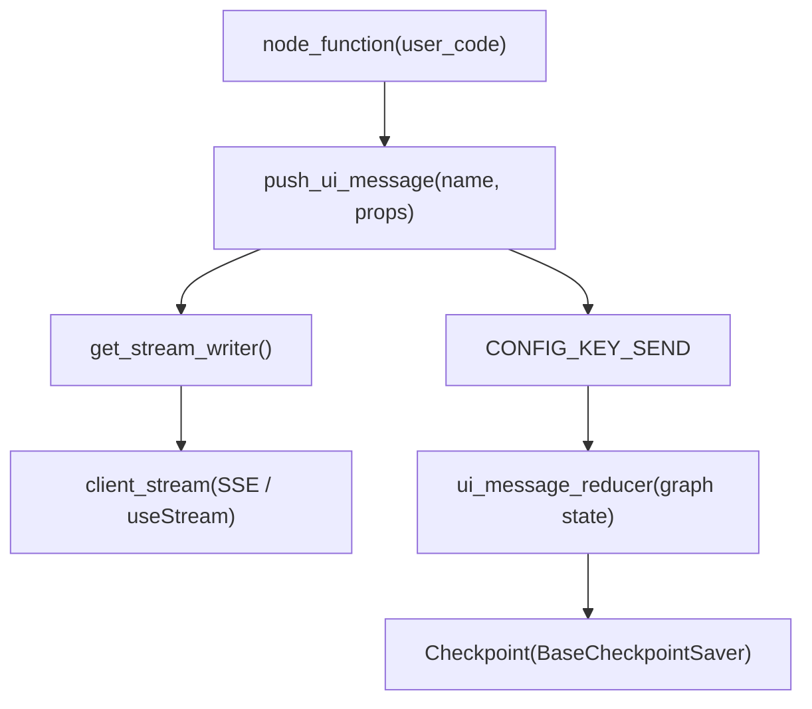
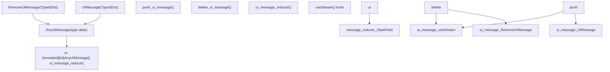

# UI 集成

相关源文件

-   [libs/langgraph/langgraph/graph/message.py](https://github.com/langchain-ai/langgraph/blob/1fd51e8f/libs/langgraph/langgraph/graph/message.py)
-   [libs/langgraph/langgraph/graph/ui.py](https://github.com/langchain-ai/langgraph/blob/1fd51e8f/libs/langgraph/langgraph/graph/ui.py)
-   [libs/langgraph/tests/test\_messages\_state.py](https://github.com/langchain-ai/langgraph/blob/1fd51e8f/libs/langgraph/tests/test_messages_state.py)

本页文档介绍 LangGraph 中的生成式 UI 系统：包括用于在图节点内发出 UI 组件消息的服务端 Python API（`push_ui_message`, `delete_ui_message`, `UIMessage`, `RemoveUIMessage`, `ui_message_reducer`），以及将其接入图状态的约定。用于前端消费这些消息的 JavaScript/TypeScript `useStream` React hook 文档见 JavaScript SDK 页面（参见 [5.2](https://github.com/langchain-ai/langgraph/blob/1fd51e8f/5.2)）。关于通用流事件模式，参见 [7.4](https://github.com/langchain-ai/langgraph/blob/1fd51e8f/7.4)

---

## 目的

生成式 UI 允许图节点在执行期间发出结构化 UI 组件描述。前端实时消费这些描述并渲染 React 组件。这使得诸如流式进度指示器、富结果卡片和交互元素等模式成为可能，并且这些内容可随图运行而更新——前端无需了解图的内部逻辑。

---

## 核心数据类型

所有类型定义在 `libs/langgraph/langgraph/graph/ui.py` [libs/langgraph/langgraph/graph/ui.py1-58](https://github.com/langchain-ai/langgraph/blob/1fd51e8f/libs/langgraph/langgraph/graph/ui.py#L1-L58)

### `UIMessage`

表示应被渲染的 UI 组件。

[libs/langgraph/langgraph/graph/ui.py22-41](https://github.com/langchain-ai/langgraph/blob/1fd51e8f/libs/langgraph/langgraph/graph/ui.py#L22-L41)

| 字段 | 类型 | 描述 |
| --- | --- | --- |
| `type` | `Literal["ui"]` | 区分字段。始终为 `"ui"`。 |
| `id` | `str` | 此 UI 消息的唯一标识符，用于更新和删除。 |
| `name` | `str` | 前端要渲染的 React 组件名称。 |
| `props` | `dict[str, Any]` | 传给组件的属性。 |
| `metadata` | `dict[str, Any]` | 内部元数据：`run_id`, `tags`, `name`, `merge`, `message_id`。 |

### `RemoveUIMessage`

表示应删除先前发出的 UI 组件。

[libs/langgraph/langgraph/graph/ui.py43-56](https://github.com/langchain-ai/langgraph/blob/1fd51e8f/libs/langgraph/langgraph/graph/ui.py#L43-L56)

| 字段 | 类型 | 描述 |
| --- | --- | --- |
| `type` | `Literal["remove-ui"]` | 区分字段。始终为 `"remove-ui"`。 |
| `id` | `str` | 要删除的 `UIMessage` 的 ID。 |

### `AnyUIMessage`

类型别名：`UIMessage | RemoveUIMessage`。

[libs/langgraph/langgraph/graph/ui.py58](https://github.com/langchain-ai/langgraph/blob/1fd51e8f/libs/langgraph/langgraph/graph/ui.py#L58-L58)

---

## 后端 API

### `push_ui_message`

[libs/langgraph/langgraph/graph/ui.py61-130](https://github.com/langchain-ai/langgraph/blob/1fd51e8f/libs/langgraph/langgraph/graph/ui.py#L61-L130)

从图节点内部调用以发出一个 UI 组件。该函数同时产生两个效果：

1.  通过当前 `StreamWriter` 将 `UIMessage` **流式发送**给已连接客户端 [libs/langgraph/langgraph/graph/ui.py126](https://github.com/langchain-ai/langgraph/blob/1fd51e8f/libs/langgraph/langgraph/graph/ui.py#L126-L126)
2.  通过内部 `CONFIG_KEY_SEND` 机制，将 `UIMessage` 注入到 `state_key` 下，从而**更新**图状态 [libs/langgraph/langgraph/graph/ui.py128](https://github.com/langchain-ai/langgraph/blob/1fd51e8f/libs/langgraph/langgraph/graph/ui.py#L128-L128)

**签名：**

```
push_ui_message(    name: str,    props: dict[str, Any],    *,    id: str | None = None,    metadata: dict[str, Any] | None = None,    message: AnyMessage | None = None,    state_key: str | None = "ui",    merge: bool = False,) -> UIMessage
```
**参数：**

| 参数 | 默认值 | 描述 |
| --- | --- | --- |
| `name` | required | 前端要渲染的 React 组件名称。 |
| `props` | required | 传给组件的 props 字典。 |
| `id` | `None` | 显式 ID。若为 `None`，会生成一个 `uuid4()` [libs/langgraph/langgraph/graph/ui.py113](https://github.com/langchain-ai/langgraph/blob/1fd51e8f/libs/langgraph/langgraph/graph/ui.py#L113-L113) |
| `metadata` | `None` | 额外元数据，会合并到消息的 `metadata` 字段中。 |
| `message` | `None` | 关联的 `AnyMessage`；其 `.id` 会以 `message_id` 记录到元数据中 [libs/langgraph/langgraph/graph/ui.py122](https://github.com/langchain-ai/langgraph/blob/1fd51e8f/libs/langgraph/langgraph/graph/ui.py#L122-L122) |
| `state_key` | `"ui"` | 消息存储到图状态中的键。设为 `None` 可跳过状态更新。 |
| `merge` | `False` | 若为 `True`，指示 reducer 合并现有与新增 `props`，而不是替换 [libs/langgraph/langgraph/graph/ui.py117](https://github.com/langchain-ai/langgraph/blob/1fd51e8f/libs/langgraph/langgraph/graph/ui.py#L117-L117) |

**返回：** 构造出的 `UIMessage` 字典 [libs/langgraph/langgraph/graph/ui.py130](https://github.com/langchain-ai/langgraph/blob/1fd51e8f/libs/langgraph/langgraph/graph/ui.py#L130-L130)

当 `state_key` 为 `None` 时，消息会流式发送给客户端，但**不会**持久化到图状态中。

---

### `delete_ui_message`

[libs/langgraph/langgraph/graph/ui.py133-162](https://github.com/langchain-ai/langgraph/blob/1fd51e8f/libs/langgraph/langgraph/graph/ui.py#L133-L162)

从图节点内部调用，用于删除先前发出的 UI 组件。

**签名：**

```
delete_ui_message(id: str, *, state_key: str = "ui") -> RemoveUIMessage
```
| 参数 | 默认值 | 描述 |
| --- | --- | --- |
| `id` | required | 要删除的 `UIMessage` 的 ID。 |
| `state_key` | `"ui"` | 从该图状态键中删除消息。 |

该函数会向客户端流式发送 `RemoveUIMessage`，并通过 `CONFIG_KEY_SEND` 将删除操作应用到图状态 [libs/langgraph/langgraph/graph/ui.py160](https://github.com/langchain-ai/langgraph/blob/1fd51e8f/libs/langgraph/langgraph/graph/ui.py#L160-L160)

来源: [libs/langgraph/langgraph/graph/ui.py133-162](https://github.com/langchain-ai/langgraph/blob/1fd51e8f/libs/langgraph/langgraph/graph/ui.py#L133-L162)

---

## 状态集成

### `ui_message_reducer`

[libs/langgraph/langgraph/graph/ui.py165-227](https://github.com/langchain-ai/langgraph/blob/1fd51e8f/libs/langgraph/langgraph/graph/ui.py#L165-L227)

这是一个 reducer 函数，可作为图 `TypedDict` 状态 schema 中 `ui` 字段的注解。它同时处理普通新增与 `remove-ui` 删除。

```
def ui_message_reducer(    left: list[AnyUIMessage] | AnyUIMessage,    right: list[AnyUIMessage] | AnyUIMessage,) -> list[AnyUIMessage]
```
**行为：**

| 情况 | 动作 |
| --- | --- |
| `right` 包含新的 `UIMessage`（其 id 不在 `left` 中） | 追加到列表 [libs/langgraph/langgraph/graph/ui.py224](https://github.com/langchain-ai/langgraph/blob/1fd51e8f/libs/langgraph/langgraph/graph/ui.py#L224-L224) |
| `right` 包含已有 id 的 `UIMessage`，且 `merge=False` | 替换已有消息 [libs/langgraph/langgraph/graph/ui.py216](https://github.com/langchain-ai/langgraph/blob/1fd51e8f/libs/langgraph/langgraph/graph/ui.py#L216-L216) |
| `right` 包含已有 id 的 `UIMessage`，且 `merge=True` | 通过 `{**prev_props, **new_props}` 合并 `props` [libs/langgraph/langgraph/graph/ui.py214](https://github.com/langchain-ai/langgraph/blob/1fd51e8f/libs/langgraph/langgraph/graph/ui.py#L214-L214) |
| `right` 包含已知 id 的 `RemoveUIMessage` | 删除匹配条目 [libs/langgraph/langgraph/graph/ui.py207](https://github.com/langchain-ai/langgraph/blob/1fd51e8f/libs/langgraph/langgraph/graph/ui.py#L207-L207) |
| `right` 包含未知 id 的 `RemoveUIMessage` | 抛出 `ValueError` [libs/langgraph/langgraph/graph/ui.py219-221](https://github.com/langchain-ai/langgraph/blob/1fd51e8f/libs/langgraph/langgraph/graph/ui.py#L219-L221) |

### `state_key` 约定

`push_ui_message` 与 `delete_ui_message` 中的 `state_key` 参数用于命名应用该 reducer 的图状态字段。默认值为 `"ui"`。

若要将 UI 消息存入图状态，请在状态 schema 中声明该字段：

```
from typing import Annotatedfrom langgraph.graph.ui import AnyUIMessage, ui_message_reducer class MyState(TypedDict):    messages: Annotated[list, add_messages]    ui: Annotated[list[AnyUIMessage], ui_message_reducer]
```
来源: [libs/langgraph/langgraph/graph/ui.py165-227](https://github.com/langchain-ai/langgraph/blob/1fd51e8f/libs/langgraph/langgraph/graph/ui.py#L165-L227)

---

## 数据流

下图展示了在节点内部调用 `push_ui_message` 时，如何同时向两个方向传播。

**图：push\_ui\_message 数据流**


来源: [libs/langgraph/langgraph/graph/ui.py61-130](https://github.com/langchain-ai/langgraph/blob/1fd51e8f/libs/langgraph/langgraph/graph/ui.py#L61-L130) [libs/langgraph/langgraph/config.py9-10](https://github.com/langchain-ai/langgraph/blob/1fd51e8f/libs/langgraph/langgraph/config.py#L9-L10)

---

## 实体映射

**图：UI 集成代码实体**


来源: [libs/langgraph/langgraph/graph/ui.py1-58](https://github.com/langchain-ai/langgraph/blob/1fd51e8f/libs/langgraph/langgraph/graph/ui.py#L1-L58) [libs/langgraph/langgraph/graph/ui.py165-188](https://github.com/langchain-ai/langgraph/blob/1fd51e8f/libs/langgraph/langgraph/graph/ui.py#L165-L188)

---

## UI 消息生命周期

下方时序展示了从节点执行到前端渲染，再到可选删除的完整往返过程。

**图：完整 UI 消息生命周期**

> **[Mermaid sequence]**
> *(图表结构无法解析)*

来源: [libs/langgraph/langgraph/graph/ui.py61-162](https://github.com/langchain-ai/langgraph/blob/1fd51e8f/libs/langgraph/langgraph/graph/ui.py#L61-L162) [libs/langgraph/langgraph/graph/ui.py211-216](https://github.com/langchain-ai/langgraph/blob/1fd51e8f/libs/langgraph/langgraph/graph/ui.py#L211-L216)

---

## 前端消费

JavaScript SDK 提供 `useStream` React hook，用于解析 SSE 流并累积 `UIMessage` 事件。完整文档见 [5.2](https://github.com/langchain-ai/langgraph/blob/1fd51e8f/5.2)

从前端视角的关键行为：

-   Hook 接收以 `id` 为键的流式 `UIMessage` 事件。
-   当收到 `RemoveUIMessage` 时，对应组件会从渲染集合中移除。
-   当 `metadata.merge` 为 `true` 时，hook 可增量更新 `props`（例如流式文本）。
-   `metadata.message_id` 允许将 UI 组件关联到特定 LangChain 消息 [libs/langgraph/langgraph/graph/ui.py122](https://github.com/langchain-ai/langgraph/blob/1fd51e8f/libs/langgraph/langgraph/graph/ui.py#L122-L122)

---

## 导出面

`UIMessage`, `RemoveUIMessage`, `AnyUIMessage`, `push_ui_message`, `delete_ui_message`, `ui_message_reducer` 均由 `langgraph.graph.ui` 导出：

[libs/langgraph/langgraph/graph/ui.py12-19](https://github.com/langchain-ai/langgraph/blob/1fd51e8f/libs/langgraph/langgraph/graph/ui.py#L12-L19)

导入路径如下：

```
from langgraph.graph.ui import push_ui_message, delete_ui_message, ui_message_reducerfrom langgraph.graph.ui import UIMessage, RemoveUIMessage, AnyUIMessage
```
来源: [libs/langgraph/langgraph/graph/ui.py12-19](https://github.com/langchain-ai/langgraph/blob/1fd51e8f/libs/langgraph/langgraph/graph/ui.py#L12-L19)
