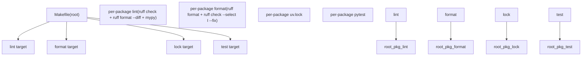
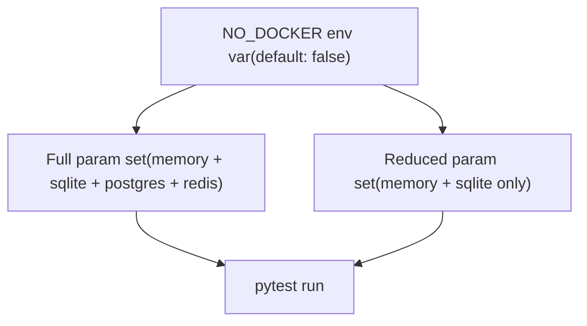

# 开发基础设施

相关源文件

-   [.github/ISSUE\_TEMPLATE/bug-report.yml](https://github.com/langchain-ai/langgraph/blob/1fd51e8f/.github/ISSUE_TEMPLATE/bug-report.yml)
-   [.github/ISSUE\_TEMPLATE/config.yml](https://github.com/langchain-ai/langgraph/blob/1fd51e8f/.github/ISSUE_TEMPLATE/config.yml)
-   [.github/ISSUE\_TEMPLATE/privileged.yml](https://github.com/langchain-ai/langgraph/blob/1fd51e8f/.github/ISSUE_TEMPLATE/privileged.yml)
-   [.github/PULL\_REQUEST\_TEMPLATE.md](https://github.com/langchain-ai/langgraph/blob/1fd51e8f/.github/PULL_REQUEST_TEMPLATE.md?plain=1)
-   [.github/actions/uv\_setup/action.yml](https://github.com/langchain-ai/langgraph/blob/1fd51e8f/.github/actions/uv_setup/action.yml)
-   [.github/workflows/\_integration\_test.yml](https://github.com/langchain-ai/langgraph/blob/1fd51e8f/.github/workflows/_integration_test.yml)
-   [.github/workflows/\_lint.yml](https://github.com/langchain-ai/langgraph/blob/1fd51e8f/.github/workflows/_lint.yml)
-   [.github/workflows/\_test.yml](https://github.com/langchain-ai/langgraph/blob/1fd51e8f/.github/workflows/_test.yml)
-   [.github/workflows/\_test\_langgraph.yml](https://github.com/langchain-ai/langgraph/blob/1fd51e8f/.github/workflows/_test_langgraph.yml)
-   [.github/workflows/\_test\_release.yml](https://github.com/langchain-ai/langgraph/blob/1fd51e8f/.github/workflows/_test_release.yml)
-   [.github/workflows/baseline.yml](https://github.com/langchain-ai/langgraph/blob/1fd51e8f/.github/workflows/baseline.yml)
-   [.github/workflows/bench.yml](https://github.com/langchain-ai/langgraph/blob/1fd51e8f/.github/workflows/bench.yml)
-   [.github/workflows/ci.yml](https://github.com/langchain-ai/langgraph/blob/1fd51e8f/.github/workflows/ci.yml)
-   [.github/workflows/release.yml](https://github.com/langchain-ai/langgraph/blob/1fd51e8f/.github/workflows/release.yml)
-   [.github/workflows/uv\_lock\_ugprade.yml](https://github.com/langchain-ai/langgraph/blob/1fd51e8f/.github/workflows/uv_lock_ugprade.yml)
-   [AGENTS.md](https://github.com/langchain-ai/langgraph/blob/1fd51e8f/AGENTS.md?plain=1)
-   [CLAUDE.md](https://github.com/langchain-ai/langgraph/blob/1fd51e8f/CLAUDE.md?plain=1)
-   [libs/checkpoint-postgres/Makefile](https://github.com/langchain-ai/langgraph/blob/1fd51e8f/libs/checkpoint-postgres/Makefile)
-   [libs/checkpoint-postgres/tests/compose-postgres.yml](https://github.com/langchain-ai/langgraph/blob/1fd51e8f/libs/checkpoint-postgres/tests/compose-postgres.yml)
-   [libs/checkpoint-sqlite/Makefile](https://github.com/langchain-ai/langgraph/blob/1fd51e8f/libs/checkpoint-sqlite/Makefile)
-   [libs/checkpoint/Makefile](https://github.com/langchain-ai/langgraph/blob/1fd51e8f/libs/checkpoint/Makefile)
-   [libs/cli/Makefile](https://github.com/langchain-ai/langgraph/blob/1fd51e8f/libs/cli/Makefile)
-   [libs/langgraph/Makefile](https://github.com/langchain-ai/langgraph/blob/1fd51e8f/libs/langgraph/Makefile)
-   [libs/langgraph/tests/conftest.py](https://github.com/langchain-ai/langgraph/blob/1fd51e8f/libs/langgraph/tests/conftest.py)
-   [libs/prebuilt/Makefile](https://github.com/langchain-ai/langgraph/blob/1fd51e8f/libs/prebuilt/Makefile)
-   [libs/prebuilt/tests/any\_str.py](https://github.com/langchain-ai/langgraph/blob/1fd51e8f/libs/prebuilt/tests/any_str.py)
-   [libs/prebuilt/tests/memory\_assert.py](https://github.com/langchain-ai/langgraph/blob/1fd51e8f/libs/prebuilt/tests/memory_assert.py)
-   [libs/prebuilt/tests/messages.py](https://github.com/langchain-ai/langgraph/blob/1fd51e8f/libs/prebuilt/tests/messages.py)
-   [libs/sdk-py/Makefile](https://github.com/langchain-ai/langgraph/blob/1fd51e8f/libs/sdk-py/Makefile)

本页提供支撑 LangGraph monorepo 开发的工具与自动化的总体概览。它从高层次介绍构建系统约定、测试基础设施、CI/CD 流水线与发布流程。

关于各主题的详细信息，参见：

-   [Monorepo Structure and Build System](/langchain-ai/langgraph/9.1-monorepo-structure-and-build-system)
-   [Testing Infrastructure](/langchain-ai/langgraph/9.2-testing-infrastructure)
-   [CI/CD Workflows](/langchain-ai/langgraph/9.3-cicd-workflows)
-   [Release Process](/langchain-ai/langgraph/9.4-release-process)

---

## 仓库布局

所有可发布包都位于 `libs/` 目录下。仓库根目录包含一个顶层 `Makefile`，用于编排所有包的操作。

```
langgraph/               ← repository root
├── Makefile             ← root orchestrator
└── libs/
    ├── langgraph/       ← core library
    ├── checkpoint/      ← base checkpoint interfaces
    ├── checkpoint-postgres/
    ├── checkpoint-sqlite/
    ├── checkpoint-conformance/ ← interface compliance tests
    ├── prebuilt/        ← prebuilt nodes and agents
    ├── sdk-py/          ← Python SDK client
    └── cli/             ← Command line interface
```
`libs/` 下每个包都拥有自己的 `Makefile`、`pyproject.toml` 和 `uv.lock`。根 `Makefile` 会遍历 `libs/*` 并委托到各包的 `Makefile`。

来源: [Makefile1-64](https://github.com/langchain-ai/langgraph/blob/1fd51e8f/Makefile#L1-L64) [libs/langgraph/Makefile1-161](https://github.com/langchain-ai/langgraph/blob/1fd51e8f/libs/langgraph/Makefile#L1-L161)

---

## 构建系统概览

**构建系统图**


来源: [Makefile1-64](https://github.com/langchain-ai/langgraph/blob/1fd51e8f/Makefile#L1-L64)

### 标准的包级 Make 目标

`libs/` 下每个包都暴露一致的一组 `make` 目标：

| 目标 | 工具 | 描述 |
| --- | --- | --- |
| `lint` | `ruff check`, `ruff format --diff`, `mypy` | 静态分析与格式检查 |
| `format` | `ruff format`, `ruff check --select I --fix` | 应用格式化与 import 排序 |
| `type` | `mypy` | 仅类型检查 |
| `test` | `pytest` | 运行单元测试（如可用会启用 Docker 服务） |
| `test_parallel` | `pytest -n auto` | 使用 `xdist` 并行运行测试 |
| `test_watch` | `pytest-watch` (`ptw`) | 文件变化时重跑测试 |
| `coverage` | `pytest --cov` | 运行测试并输出覆盖率报告 |
| `spell_check` | `codespell` | 对源码做拼写检查 |
| `spell_fix` | `codespell -w` | 自动修复拼写错误 |

根级 `lock` 目标会在每个包目录下运行 `uv lock` 以重建 lock 文件。`lock-upgrade` 则附带 `--upgrade` 以拉取更新依赖版本。

来源: [Makefile40-58](https://github.com/langchain-ai/langgraph/blob/1fd51e8f/Makefile#L40-L58) [libs/langgraph/Makefile14-139](https://github.com/langchain-ai/langgraph/blob/1fd51e8f/libs/langgraph/Makefile#L14-L139) [libs/prebuilt/Makefile1-86](https://github.com/langchain-ai/langgraph/blob/1fd51e8f/libs/prebuilt/Makefile#L1-L86) [libs/checkpoint/Makefile1-41](https://github.com/langchain-ai/langgraph/blob/1fd51e8f/libs/checkpoint/Makefile#L1-L41) [libs/checkpoint-sqlite/Makefile1-41](https://github.com/langchain-ai/langgraph/blob/1fd51e8f/libs/checkpoint-sqlite/Makefile#L1-L41) [libs/checkpoint-postgres/Makefile1-70](https://github.com/langchain-ai/langgraph/blob/1fd51e8f/libs/checkpoint-postgres/Makefile#L1-L70) [libs/cli/Makefile1-44](https://github.com/langchain-ai/langgraph/blob/1fd51e8f/libs/cli/Makefile#L1-L44) [libs/sdk-py/Makefile1-27](https://github.com/langchain-ai/langgraph/blob/1fd51e8f/libs/sdk-py/Makefile#L1-L27)

---

## 依赖管理

所有包都使用 [\`uv\`](https://github.com/langchain-ai/langgraph/blob/1fd51e8f/`uv`) 进行依赖解析与虚拟环境管理。

-   每个包都有自己的 `pyproject.toml` 与 `uv.lock`。
-   根 `Makefile` 的 `install` 目标会创建共享 venv，并通过 `uv pip install -e` 以可编辑模式安装所有包。
-   `libs/langgraph` 包使用 `uv sync --frozen --all-extras --all-packages --group dev` 一步安装完整开发环境 [libs/langgraph/Makefile14-15](https://github.com/langchain-ai/langgraph/blob/1fd51e8f/libs/langgraph/Makefile#L14-L15)

---

## 测试基础设施

**测试夹具依赖图**

```mermaid
flowchart TD
    conftest["libs/langgraph/tests/conftest.py"]
    conftest_cp["tests/conftest_checkpointer.py"]
    conftest_st["tests/conftest_store.py"]
    f_sync_checkpointer["sync_checkpointer fixture(memory, sqlite, sqlite_aes,postgres, postgres_pipe, postgres_pool)"]
    f_async_checkpointer["async_checkpointer fixture(memory, sqlite_aio,postgres_aio, postgres_aio_pipe,postgres_aio_pool)"]
    f_sync_store["sync_store fixture(in_memory, postgres,postgres_pipe, postgres_pool)"]
    f_async_store["async_store fixture(in_memory, postgres_aio,postgres_aio_pipe, postgres_aio_pool)"]
    f_cache["cache fixture(sqlite, memory, redis)"]
    f_deterministic["deterministic_uuids fixture(mocks uuid.uuid4)"]
    NO_DOCKER["NO_DOCKER env var"]

    conftest --> conftest_cp
    conftest --> conftest_st
    conftest --> f_sync_checkpointer
    conftest --> f_async_checkpointer
    conftest --> f_sync_store
    conftest --> f_async_store
    conftest --> f_cache
    conftest --> f_deterministic
    NO --> DOCKER_f_sync_checkpointer
    NO --> DOCKER_f_async_checkpointer
    NO --> DOCKER_f_sync_store
    NO --> DOCKER_f_async_store
    NO --> DOCKER_f_cache
```


来源: [libs/langgraph/tests/conftest.py1-227](https://github.com/langchain-ai/langgraph/blob/1fd51e8f/libs/langgraph/tests/conftest.py#L1-L227)

### 测试夹具

核心夹具文件是 [libs/langgraph/tests/conftest.py](https://github.com/langchain-ai/langgraph/blob/1fd51e8f/libs/langgraph/tests/conftest.py)，它组装了参数化夹具，覆盖所有受支持的后端组合。每个夹具均为 `scope="function"`，并产出一个完成初始化的后端实例。

**夹具参数集合（Docker 可用时）：**

| 夹具 | 参数 |
| --- | --- |
| `sync_checkpointer` | `memory`, `memory_migrate_sends`, `sqlite`, `sqlite_aes`, `postgres`, `postgres_pipe`, `postgres_pool` |
| `async_checkpointer` | `memory`, `sqlite_aio`, `postgres_aio`, `postgres_aio_pipe`, `postgres_aio_pool` |
| `sync_store` | `in_memory`, `postgres`, `postgres_pipe`, `postgres_pool` |
| `async_store` | `in_memory`, `postgres_aio`, `postgres_aio_pipe`, `postgres_aio_pool` |
| `cache` | `sqlite`, `memory`, `redis` |

当 `NO_DOCKER=true` 时，会排除 Postgres 与 Redis 变体，仅保留进程内后端。

### `NO_DOCKER` 控制流


来源: [libs/langgraph/tests/conftest.py39-89](https://github.com/langchain-ai/langgraph/blob/1fd51e8f/libs/langgraph/tests/conftest.py#L39-L89)

### Docker 服务管理

需要 PostgreSQL 或 Redis 的集成测试使用 Docker Compose。`langgraph` 包的 `Makefile` 定义：

-   `start-services` — 启动 `tests/compose-postgres.yml` 与 `tests/compose-redis.yml`，并等待健康检查通过 [libs/langgraph/Makefile40-41](https://github.com/langchain-ai/langgraph/blob/1fd51e8f/libs/langgraph/Makefile#L40-L41)
-   `stop-services` — 关闭容器与卷 [libs/langgraph/Makefile43-44](https://github.com/langchain-ai/langgraph/blob/1fd51e8f/libs/langgraph/Makefile#L43-L44)

`test` 目标会在 `pytest` 调用前后有条件地运行 `start-services` 与 `start-dev-server` [libs/langgraph/Makefile61-74](https://github.com/langchain-ai/langgraph/blob/1fd51e8f/libs/langgraph/Makefile#L61-L74)

### 测试工具类

`libs/prebuilt/tests/` 中定义了若干跨测试套件使用的辅助类型：

| 类 / 函数 | 文件 | 用途 |
| --- | --- | --- |
| `AnyStr` | [libs/prebuilt/tests/any\_str.py](https://github.com/langchain-ai/langgraph/blob/1fd51e8f/libs/prebuilt/tests/any_str.py) | `str` 子类，其 `__eq__` 可匹配具有给定前缀或正则模式的任意字符串。用于在未知精确值时断言消息 ID。 |
| `MemorySaverAssertImmutable` | [libs/prebuilt/tests/memory\_assert.py](https://github.com/langchain-ai/langgraph/blob/1fd51e8f/libs/prebuilt/tests/memory_assert.py) | 扩展 `InMemorySaver`，断言 checkpoint 写入后不会被修改。 |
| `_AnyIdHumanMessage` / `_AnyIdToolMessage` | [libs/prebuilt/tests/messages.py](https://github.com/langchain-ai/langgraph/blob/1fd51e8f/libs/prebuilt/tests/messages.py) | 工厂函数，创建带 `AnyStr` id 的 LangChain 消息对象，以规避 Pydantic `__eq__` 问题。 |

[libs/langgraph/tests/conftest.py47-52](https://github.com/langchain-ai/langgraph/blob/1fd51e8f/libs/langgraph/tests/conftest.py#L47-L52) 中的 `deterministic_uuids` 夹具会 patch `uuid.uuid4`，使其输出可预测 UUID 序列，从而让快照式断言在多次运行间保持稳定。

---

## 基准测试

`libs/langgraph` 包包含用于检测性能回归的基准测试工具。

| 目标 | 命令 | 描述 |
| --- | --- | --- |
| `benchmark` | `python -m bench -o out/benchmark.json --rigorous` | 完整基准测试 |
| `benchmark-fast` | `python -m bench -o out/benchmark.json --fast` | CI 用快速基准测试 |
| `profile` | `py-spy record -g -o out/profile.svg -- python $(GRAPH)` | 对特定图脚本做火焰图分析 |

`bench.yml` 工作流会在 pull request 上运行基准测试，并与存储在 GitHub Actions 缓存中的基线进行对比 [.github/workflows/bench.yml1-72](https://github.com/langchain-ai/langgraph/blob/1fd51e8f/.github/workflows/bench.yml#L1-L72) 基线会在每次推送到 `main` 时更新 [.github/workflows/baseline.yml1-38](https://github.com/langchain-ai/langgraph/blob/1fd51e8f/.github/workflows/baseline.yml#L1-L38)

来源: [libs/langgraph/Makefile17-31](https://github.com/langchain-ai/langgraph/blob/1fd51e8f/libs/langgraph/Makefile#L17-L31) [.github/workflows/bench.yml41-58](https://github.com/langchain-ai/langgraph/blob/1fd51e8f/.github/workflows/bench.yml#L41-L58)

---

## CI/CD 与发布

GitHub Actions 工作流、自动化依赖 lock 升级与 PyPI 发布流水线详见 [CI/CD Workflows](/langchain-ai/langgraph/9.3-cicd-workflows) 和 [Release Process](/langchain-ai/langgraph/9.4-release-process)。

CI 流水线使用 `changes` 作业基于修改路径检测需要执行 lint 与测试的包 [.github/workflows/ci.yml26-50](https://github.com/langchain-ai/langgraph/blob/1fd51e8f/.github/workflows/ci.yml#L26-L50) 它将结果聚合到最终 `ci_success` 作业，为 pull request 提供单一状态检查 [.github/workflows/ci.yml159-183](https://github.com/langchain-ai/langgraph/blob/1fd51e8f/.github/workflows/ci.yml#L159-L183)

CLI 包暴露 `update-schema` 目标，用于从源码重新生成 `langgraph.json` JSON Schema；CI 会校验该结果，确保 schema 与代码保持同步 [.github/workflows/ci.yml116-151](https://github.com/langchain-ai/langgraph/blob/1fd51e8f/.github/workflows/ci.yml#L116-L151)

来源: [.github/workflows/ci.yml1-184](https://github.com/langchain-ai/langgraph/blob/1fd51e8f/.github/workflows/ci.yml#L1-L184) [libs/cli/Makefile39-43](https://github.com/langchain-ai/langgraph/blob/1fd51e8f/libs/cli/Makefile#L39-L43)
