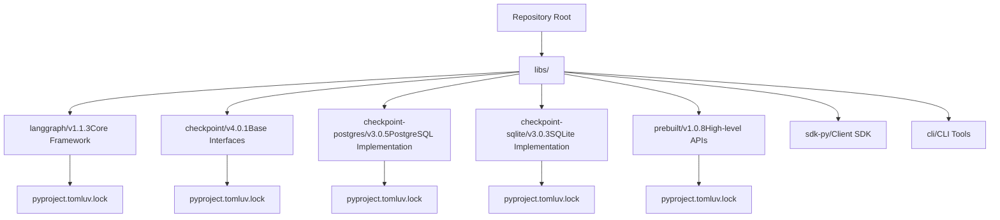
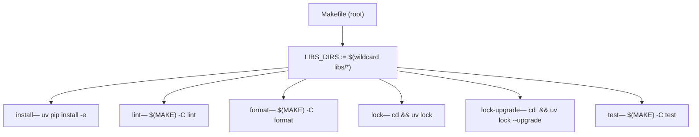
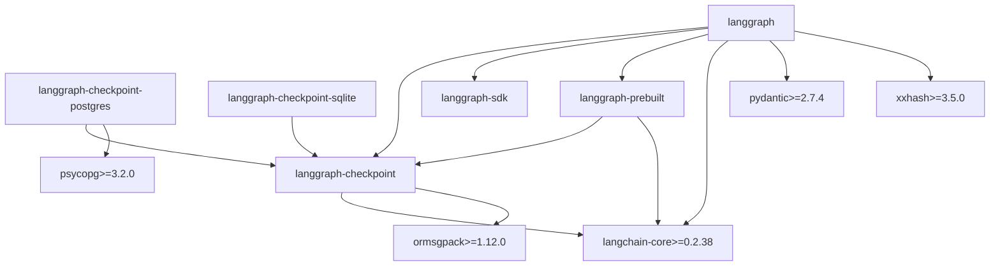
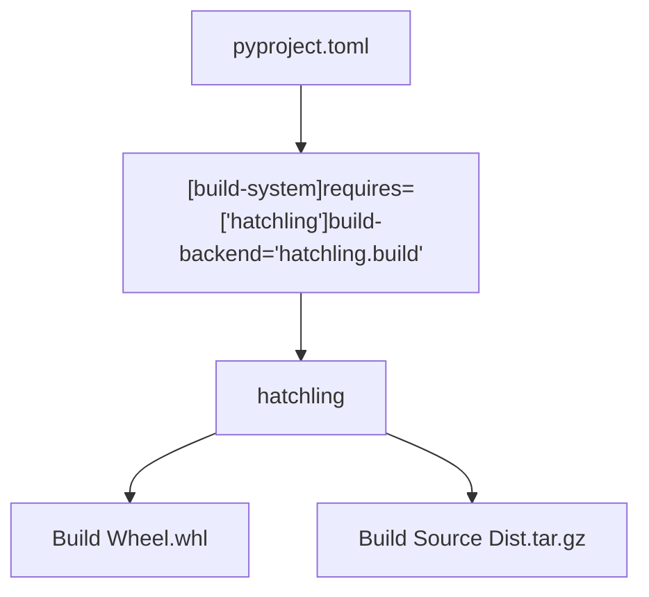
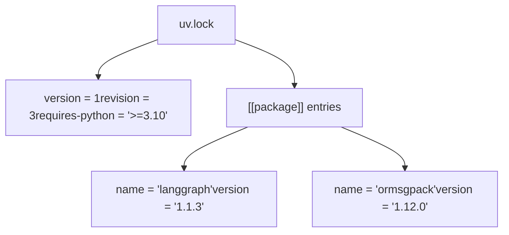
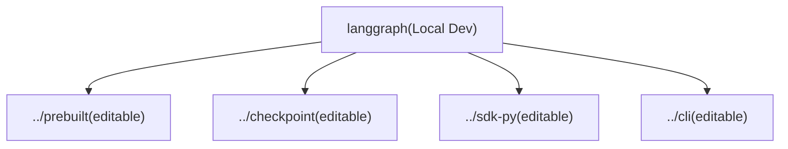

# Monorepo 结构与构建系统

相关源文件

-   [libs/checkpoint-postgres/Makefile](https://github.com/langchain-ai/langgraph/blob/1fd51e8f/libs/checkpoint-postgres/Makefile)
-   [libs/checkpoint-postgres/pyproject.toml](https://github.com/langchain-ai/langgraph/blob/1fd51e8f/libs/checkpoint-postgres/pyproject.toml)
-   [libs/checkpoint-postgres/tests/compose-postgres.yml](https://github.com/langchain-ai/langgraph/blob/1fd51e8f/libs/checkpoint-postgres/tests/compose-postgres.yml)
-   [libs/checkpoint-postgres/uv.lock](https://github.com/langchain-ai/langgraph/blob/1fd51e8f/libs/checkpoint-postgres/uv.lock)
-   [libs/checkpoint-sqlite/Makefile](https://github.com/langchain-ai/langgraph/blob/1fd51e8f/libs/checkpoint-sqlite/Makefile)
-   [libs/checkpoint-sqlite/pyproject.toml](https://github.com/langchain-ai/langgraph/blob/1fd51e8f/libs/checkpoint-sqlite/pyproject.toml)
-   [libs/checkpoint-sqlite/uv.lock](https://github.com/langchain-ai/langgraph/blob/1fd51e8f/libs/checkpoint-sqlite/uv.lock)
-   [libs/checkpoint/Makefile](https://github.com/langchain-ai/langgraph/blob/1fd51e8f/libs/checkpoint/Makefile)
-   [libs/checkpoint/langgraph/checkpoint/serde/jsonplus.py](https://github.com/langchain-ai/langgraph/blob/1fd51e8f/libs/checkpoint/langgraph/checkpoint/serde/jsonplus.py)
-   [libs/checkpoint/pyproject.toml](https://github.com/langchain-ai/langgraph/blob/1fd51e8f/libs/checkpoint/pyproject.toml)
-   [libs/checkpoint/tests/test\_jsonplus.py](https://github.com/langchain-ai/langgraph/blob/1fd51e8f/libs/checkpoint/tests/test_jsonplus.py)
-   [libs/checkpoint/uv.lock](https://github.com/langchain-ai/langgraph/blob/1fd51e8f/libs/checkpoint/uv.lock)
-   [libs/cli/Makefile](https://github.com/langchain-ai/langgraph/blob/1fd51e8f/libs/cli/Makefile)
-   [libs/langgraph/Makefile](https://github.com/langchain-ai/langgraph/blob/1fd51e8f/libs/langgraph/Makefile)
-   [libs/langgraph/pyproject.toml](https://github.com/langchain-ai/langgraph/blob/1fd51e8f/libs/langgraph/pyproject.toml)
-   [libs/langgraph/tests/\_\_snapshots\_\_/test\_pregel.ambr](https://github.com/langchain-ai/langgraph/blob/1fd51e8f/libs/langgraph/tests/__snapshots__/test_pregel.ambr)
-   [libs/langgraph/tests/\_\_snapshots\_\_/test\_pregel\_async.ambr](https://github.com/langchain-ai/langgraph/blob/1fd51e8f/libs/langgraph/tests/__snapshots__/test_pregel_async.ambr)
-   [libs/langgraph/tests/conftest.py](https://github.com/langchain-ai/langgraph/blob/1fd51e8f/libs/langgraph/tests/conftest.py)
-   [libs/langgraph/uv.lock](https://github.com/langchain-ai/langgraph/blob/1fd51e8f/libs/langgraph/uv.lock)
-   [libs/prebuilt/Makefile](https://github.com/langchain-ai/langgraph/blob/1fd51e8f/libs/prebuilt/Makefile)
-   [libs/prebuilt/pyproject.toml](https://github.com/langchain-ai/langgraph/blob/1fd51e8f/libs/prebuilt/pyproject.toml)
-   [libs/prebuilt/tests/any\_str.py](https://github.com/langchain-ai/langgraph/blob/1fd51e8f/libs/prebuilt/tests/any_str.py)
-   [libs/prebuilt/tests/memory\_assert.py](https://github.com/langchain-ai/langgraph/blob/1fd51e8f/libs/prebuilt/tests/memory_assert.py)
-   [libs/prebuilt/tests/messages.py](https://github.com/langchain-ai/langgraph/blob/1fd51e8f/libs/prebuilt/tests/messages.py)
-   [libs/prebuilt/uv.lock](https://github.com/langchain-ai/langgraph/blob/1fd51e8f/libs/prebuilt/uv.lock)
-   [libs/sdk-py/Makefile](https://github.com/langchain-ai/langgraph/blob/1fd51e8f/libs/sdk-py/Makefile)
-   [libs/sdk-py/uv.lock](https://github.com/langchain-ai/langgraph/blob/1fd51e8f/libs/sdk-py/uv.lock)

本文档描述 LangGraph 仓库作为 Python monorepo 的组织方式，包括包结构、构建系统配置、工作区依赖管理，以及 `uv` 包管理器的角色。关于测试基础设施与 CI/CD 工作流，参见 [Testing Infrastructure](/langchain-ai/langgraph/9.2-testing-infrastructure) 和 [CI/CD Workflows](/langchain-ai/langgraph/9.3-cicd-workflows)。关于发布流程，参见 [Release Process](/langchain-ai/langgraph/9.4-release-process)。

---

## 概览

LangGraph 仓库被组织为一个 **monorepo**，包含多个相互关联但可独立演进的 Python 包，位于 `libs/` 目录。每个包都可独立版本化并发布到 PyPI，但它们共享统一的开发环境与构建基础设施。该 monorepo 使用 `uv` 作为包管理器，并支持可编辑的工作区依赖，以提升本地开发效率。

---

## 目录结构

该仓库在 `libs/` 下采用扁平层级组织包：

**包层级与版本**


**来源：** [libs/langgraph/pyproject.toml6-7](https://github.com/langchain-ai/langgraph/blob/1fd51e8f/libs/langgraph/pyproject.toml#L6-L7) [libs/checkpoint/pyproject.toml6-7](https://github.com/langchain-ai/langgraph/blob/1fd51e8f/libs/checkpoint/pyproject.toml#L6-L7) [libs/checkpoint-postgres/pyproject.toml6-7](https://github.com/langchain-ai/langgraph/blob/1fd51e8f/libs/checkpoint-postgres/pyproject.toml#L6-L7) [libs/prebuilt/pyproject.toml6-7](https://github.com/langchain-ai/langgraph/blob/1fd51e8f/libs/prebuilt/pyproject.toml#L6-L7)

每个包目录包含：

-   `pyproject.toml` - 包元数据、依赖与构建配置。
-   `uv.lock` - 锁定依赖版本（适用于带开发依赖的包）。
-   与包名一致的子目录中的包源码（例如 `libs/langgraph/langgraph`）。
-   `README.md` - 包级文档。

---

## Makefile 构建系统

每个包都提供一个 `Makefile`，且目标集合保持一致。仓库根目录也有一个 `Makefile`，用于顺序编排所有包上的同名目标。

### 根 Makefile 编排

根 `Makefile` 通过 glob `libs/*` 发现所有包，并委托给每个包自己的 `Makefile`。

**根 Makefile 目标分发**


-   `install` — 遍历每个 `libs/*/pyproject.toml` 并运行 `uv pip install -e <dir>`，在根虚拟环境中创建可编辑安装。
-   `lock` — 在每个包目录中运行 `uv lock`，根据当前约束重建 `uv.lock`。
-   `lock-upgrade` — 与 `lock` 相同，但附加 `--upgrade` 以拉取最新兼容版本。
-   `lint`, `format`, `test` — 通过 `$(MAKE) -C <dir> <target>` 委托到包级 `Makefile`。

### 包级 Makefile

`libs/` 下每个包都有自己的 `Makefile`。各目标遵循一致约定。

**包级 Makefile 的标准目标**

| 目标 | 执行内容 | 说明 |
| --- | --- | --- |
| `lint` | `ruff check .`, `ruff format --diff`, `mypy` | 有任一问题即失败。 |
| `format` | `ruff format`, `ruff check --select I --fix` | 原地修改文件。 |
| `type` | `mypy <package>` | 独立类型检查。 |
| `test` | `uv run pytest` | 可能先启动 Docker 服务。 |
| `test_watch` | `uv run ptw` | 文件保存时重跑测试。 |
| `integration_tests` | `uv run pytest integration_tests` | 长耗时 / 外部依赖测试。 |
| `coverage` | `pytest --cov` | 生成 XML 与终端报告。 |
| `spell_check` / `spell_fix` | `codespell --toml pyproject.toml` | 拼写错误检测。 |

**来源：** [libs/langgraph/Makefile1-160](https://github.com/langchain-ai/langgraph/blob/1fd51e8f/libs/langgraph/Makefile#L1-L160) [libs/checkpoint/Makefile1-41](https://github.com/langchain-ai/langgraph/blob/1fd51e8f/libs/checkpoint/Makefile#L1-L41) [libs/checkpoint-postgres/Makefile1-70](https://github.com/langchain-ai/langgraph/blob/1fd51e8f/libs/checkpoint-postgres/Makefile#L1-L70) [libs/prebuilt/Makefile1-86](https://github.com/langchain-ai/langgraph/blob/1fd51e8f/libs/prebuilt/Makefile#L1-L86)

### 测试服务管理

测试依赖 PostgreSQL 或 Redis 的包会提供 `start-services` 与 `stop-services` 目标，并由 Docker Compose 文件支撑。

**`test` 目标中的服务生命周期**

> **[Mermaid sequence]**
> *(图表结构无法解析)*

**来源：** [libs/checkpoint-postgres/Makefile7-33](https://github.com/langchain-ai/langgraph/blob/1fd51e8f/libs/checkpoint-postgres/Makefile#L7-L33) [libs/prebuilt/Makefile10-25](https://github.com/langchain-ai/langgraph/blob/1fd51e8f/libs/prebuilt/Makefile#L10-L25)

---

## 包依赖图

这些包拥有清晰的依赖层级，以最小化耦合。`langgraph` 作为总包，依赖 `checkpoint` 与 `prebuilt` 中的专门逻辑。

**内部与外部依赖映射**


**来源：** [libs/langgraph/pyproject.toml26-33](https://github.com/langchain-ai/langgraph/blob/1fd51e8f/libs/langgraph/pyproject.toml#L26-L33) [libs/checkpoint/pyproject.toml14-17](https://github.com/langchain-ai/langgraph/blob/1fd51e8f/libs/checkpoint/pyproject.toml#L14-L17) [libs/checkpoint-postgres/pyproject.toml14-19](https://github.com/langchain-ai/langgraph/blob/1fd51e8f/libs/checkpoint-postgres/pyproject.toml#L14-L19) [libs/prebuilt/pyproject.toml26-29](https://github.com/langchain-ai/langgraph/blob/1fd51e8f/libs/prebuilt/pyproject.toml#L26-L29)

### 依赖约束

所有内部包依赖都使用版本范围，以在避免破坏性变更的同时保留灵活性：

| 包 | Checkpoint 版本 | SDK 版本 | Prebuilt 版本 |
| --- | --- | --- | --- |
| `langgraph` | `>=2.1.0,<5.0.0` | `>=0.3.0,<0.4.0` | `>=1.0.8,<1.1.0` |
| `langgraph-prebuilt` | `>=2.1.0,<5.0.0` | \- | \- |
| `langgraph-checkpoint-postgres` | `>=2.1.2,<5.0.0` | \- | \- |

**来源：** [libs/langgraph/pyproject.toml28-30](https://github.com/langchain-ai/langgraph/blob/1fd51e8f/libs/langgraph/pyproject.toml#L28-L30) [libs/prebuilt/pyproject.toml27](https://github.com/langchain-ai/langgraph/blob/1fd51e8f/libs/prebuilt/pyproject.toml#L27-L27) [libs/checkpoint-postgres/pyproject.toml15](https://github.com/langchain-ai/langgraph/blob/1fd51e8f/libs/checkpoint-postgres/pyproject.toml#L15-L15)

---

## 构建系统架构

### 构建后端：Hatchling

所有包都使用 `hatchling` 作为构建后端，通过 `pyproject.toml` 配置：


**来源：** [libs/langgraph/pyproject.toml1-3](https://github.com/langchain-ai/langgraph/blob/1fd51e8f/libs/langgraph/pyproject.toml#L1-L3) [libs/checkpoint/pyproject.toml1-3](https://github.com/langchain-ai/langgraph/blob/1fd51e8f/libs/checkpoint/pyproject.toml#L1-L3) [libs/checkpoint-postgres/pyproject.toml1-3](https://github.com/langchain-ai/langgraph/blob/1fd51e8f/libs/checkpoint-postgres/pyproject.toml#L1-L3)

### Wheel 配置

每个包都会指定打包到 wheel 的目录，以确保测试与开发文件不被包含：

```
[tool.hatch.build.targets.wheel]packages = ["langgraph"]
```
**来源：** [libs/langgraph/pyproject.toml120-121](https://github.com/langchain-ai/langgraph/blob/1fd51e8f/libs/langgraph/pyproject.toml#L120-L121) [libs/checkpoint/pyproject.toml48-49](https://github.com/langchain-ai/langgraph/blob/1fd51e8f/libs/checkpoint/pyproject.toml#L48-L49) [libs/checkpoint-postgres/pyproject.toml53-54](https://github.com/langchain-ai/langgraph/blob/1fd51e8f/libs/checkpoint-postgres/pyproject.toml#L53-L54)

---

## 包管理器：uv

仓库使用现代且高性能的 Python 包管理器 `uv`。

### UV Lock 文件

每个包都维护一个 `uv.lock` 文件，锁定所有传递依赖的精确版本，以实现可复现构建。

**Lock 文件结构**


**来源：** [libs/langgraph/uv.lock1-3](https://github.com/langchain-ai/langgraph/blob/1fd51e8f/libs/langgraph/uv.lock#L1-L3) [libs/checkpoint/uv.lock1-3](https://github.com/langchain-ai/langgraph/blob/1fd51e8f/libs/checkpoint/uv.lock#L1-L3) [libs/sdk-py/uv.lock1-3](https://github.com/langchain-ai/langgraph/blob/1fd51e8f/libs/sdk-py/uv.lock#L1-L3)

---

## 工作区依赖与可编辑安装

在本地开发中，包通过 `[tool.uv.sources]` 将彼此声明为可编辑工作区依赖。

**本地工作区映射**


**来源：** [libs/langgraph/pyproject.toml83-89](https://github.com/langchain-ai/langgraph/blob/1fd51e8f/libs/langgraph/pyproject.toml#L83-L89) [libs/prebuilt/pyproject.toml64-68](https://github.com/langchain-ai/langgraph/blob/1fd51e8f/libs/prebuilt/pyproject.toml#L64-L68) [libs/checkpoint-postgres/pyproject.toml50-51](https://github.com/langchain-ai/langgraph/blob/1fd51e8f/libs/checkpoint-postgres/pyproject.toml#L50-L51)

该配置确保对任一工作区包的修改都能立即反映到依赖包中，无需重新安装。

---

## 依赖分组

各包使用 `dependency-groups` 定义不同用途的依赖集合：

| 组 | 用途 | 关键依赖 |
| --- | --- | --- |
| `test` | 测试基础设施 | `pytest`, `pytest-asyncio`, `pytest-mock`, `syrupy` |
| `lint` | 代码质量工具 | `mypy`, `ruff`, `codespell` |
| `dev` | 完整开发环境 | 包含 `test` 与 `lint` 组 |

**来源：** [libs/langgraph/pyproject.toml45-80](https://github.com/langchain-ai/langgraph/blob/1fd51e8f/libs/langgraph/pyproject.toml#L45-L80) [libs/checkpoint/pyproject.toml25-46](https://github.com/langchain-ai/langgraph/blob/1fd51e8f/libs/checkpoint/pyproject.toml#L25-L46) [libs/prebuilt/pyproject.toml37-59](https://github.com/langchain-ai/langgraph/blob/1fd51e8f/libs/prebuilt/pyproject.toml#L37-L59)

---

## 开发工具配置

### Ruff（Lint 与格式化）

在整个 monorepo 中应用一致的 lint 规则：

```
[tool.ruff]lint.select = [ "E", "F", "I", "TID251", "UP" ]lint.ignore = [ "E501" ]line-length = 88target-version = "py310"
```
**来源：** [libs/langgraph/pyproject.toml91-97](https://github.com/langchain-ai/langgraph/blob/1fd51e8f/libs/langgraph/pyproject.toml#L91-L97) [libs/checkpoint/pyproject.toml55-65](https://github.com/langchain-ai/langgraph/blob/1fd51e8f/libs/checkpoint/pyproject.toml#L55-L65) [libs/prebuilt/pyproject.toml77-80](https://github.com/langchain-ai/langgraph/blob/1fd51e8f/libs/prebuilt/pyproject.toml#L77-L80)

### Mypy（类型检查）

严格类型检查配置：

```
[tool.mypy]disallow_untyped_defs = "True"explicit_package_bases = "True"warn_unused_ignores = "True"warn_redundant_casts = "True"allow_redefinition = "True"
```
**来源：** [libs/langgraph/pyproject.toml102-111](https://github.com/langchain-ai/langgraph/blob/1fd51e8f/libs/langgraph/pyproject.toml#L102-L111) [libs/checkpoint/pyproject.toml73-81](https://github.com/langchain-ai/langgraph/blob/1fd51e8f/libs/checkpoint/pyproject.toml#L73-L81) [libs/prebuilt/pyproject.toml88-96](https://github.com/langchain-ai/langgraph/blob/1fd51e8f/libs/prebuilt/pyproject.toml#L88-L96)

### Pytest 配置

测试执行设置：

```
[tool.pytest.ini_options]addopts = "--strict-markers --strict-config --durations=5"asyncio_mode = "auto"
```
**来源：** [libs/langgraph/pyproject.toml123-124](https://github.com/langchain-ai/langgraph/blob/1fd51e8f/libs/langgraph/pyproject.toml#L123-L124) [libs/checkpoint/pyproject.toml51-53](https://github.com/langchain-ai/langgraph/blob/1fd51e8f/libs/checkpoint/pyproject.toml#L51-L53) [libs/checkpoint-postgres/pyproject.toml56-58](https://github.com/langchain-ai/langgraph/blob/1fd51e8f/libs/checkpoint-postgres/pyproject.toml#L56-L58)

---

## Python 版本支持

所有包要求 Python 3.10 及以上，并支持到 Python 3.13：

```
requires-python = ">=3.10"classifiers = [    'Programming Language :: Python :: 3.10',    'Programming Language :: Python :: 3.11',    'Programming Language :: Python :: 3.12',    'Programming Language :: Python :: 3.13',]
```
**来源：** [libs/langgraph/pyproject.toml10-24](https://github.com/langchain-ai/langgraph/blob/1fd51e8f/libs/langgraph/pyproject.toml#L10-L24) [libs/prebuilt/pyproject.toml10-24](https://github.com/langchain-ai/langgraph/blob/1fd51e8f/libs/prebuilt/pyproject.toml#L10-L24)
