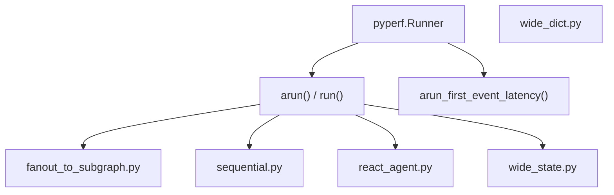

# 测试基础设施

相关源文件

-   [libs/checkpoint-conformance/langgraph/checkpoint/conformance/test\_utils.py](https://github.com/langchain-ai/langgraph/blob/1fd51e8f/libs/checkpoint-conformance/langgraph/checkpoint/conformance/test_utils.py)
-   [libs/checkpoint-conformance/uv.lock](https://github.com/langchain-ai/langgraph/blob/1fd51e8f/libs/checkpoint-conformance/uv.lock)
-   [libs/checkpoint-postgres/Makefile](https://github.com/langchain-ai/langgraph/blob/1fd51e8f/libs/checkpoint-postgres/Makefile)
-   [libs/checkpoint-postgres/tests/compose-postgres.yml](https://github.com/langchain-ai/langgraph/blob/1fd51e8f/libs/checkpoint-postgres/tests/compose-postgres.yml)
-   [libs/checkpoint-sqlite/Makefile](https://github.com/langchain-ai/langgraph/blob/1fd51e8f/libs/checkpoint-sqlite/Makefile)
-   [libs/checkpoint/Makefile](https://github.com/langchain-ai/langgraph/blob/1fd51e8f/libs/checkpoint/Makefile)
-   [libs/cli/Makefile](https://github.com/langchain-ai/langgraph/blob/1fd51e8f/libs/cli/Makefile)
-   [libs/langgraph/Makefile](https://github.com/langchain-ai/langgraph/blob/1fd51e8f/libs/langgraph/Makefile)
-   [libs/langgraph/bench/\_\_main\_\_.py](https://github.com/langchain-ai/langgraph/blob/1fd51e8f/libs/langgraph/bench/__main__.py)
-   [libs/langgraph/bench/fanout\_to\_subgraph.py](https://github.com/langchain-ai/langgraph/blob/1fd51e8f/libs/langgraph/bench/fanout_to_subgraph.py)
-   [libs/langgraph/bench/pydantic\_state.py](https://github.com/langchain-ai/langgraph/blob/1fd51e8f/libs/langgraph/bench/pydantic_state.py)
-   [libs/langgraph/bench/react\_agent.py](https://github.com/langchain-ai/langgraph/blob/1fd51e8f/libs/langgraph/bench/react_agent.py)
-   [libs/langgraph/bench/sequential.py](https://github.com/langchain-ai/langgraph/blob/1fd51e8f/libs/langgraph/bench/sequential.py)
-   [libs/langgraph/bench/wide\_dict.py](https://github.com/langchain-ai/langgraph/blob/1fd51e8f/libs/langgraph/bench/wide_dict.py)
-   [libs/langgraph/bench/wide\_state.py](https://github.com/langchain-ai/langgraph/blob/1fd51e8f/libs/langgraph/bench/wide_state.py)
-   [libs/langgraph/tests/conftest.py](https://github.com/langchain-ai/langgraph/blob/1fd51e8f/libs/langgraph/tests/conftest.py)
-   [libs/prebuilt/Makefile](https://github.com/langchain-ai/langgraph/blob/1fd51e8f/libs/prebuilt/Makefile)
-   [libs/prebuilt/tests/any\_str.py](https://github.com/langchain-ai/langgraph/blob/1fd51e8f/libs/prebuilt/tests/any_str.py)
-   [libs/prebuilt/tests/memory\_assert.py](https://github.com/langchain-ai/langgraph/blob/1fd51e8f/libs/prebuilt/tests/memory_assert.py)
-   [libs/prebuilt/tests/messages.py](https://github.com/langchain-ai/langgraph/blob/1fd51e8f/libs/prebuilt/tests/messages.py)
-   [libs/sdk-py/Makefile](https://github.com/langchain-ai/langgraph/blob/1fd51e8f/libs/sdk-py/Makefile)

本页文档介绍 LangGraph monorepo 中使用的 pytest 夹具系统、测试工具、基准测试套件与服务管理。该基础设施旨在验证核心图逻辑、持久化层（checkpointer）以及跨线程存储（store）在多种数据库后端与并发模型下的行为。

---

## 概览

测试套件围绕参数化 pytest 夹具系统构建，可将同一套测试逻辑运行在多个后端实现上（In-Memory、SQLite、PostgreSQL、Redis）。夹具在收集阶段会根据 `NO_DOCKER` 环境变量进行条件参数化，以决定是否将 PostgreSQL、Redis 等依赖 Docker 的后端纳入测试矩阵。

核心配置定义在 `libs/langgraph/tests/conftest.py`，该文件将 checkpointer、store 与 cache 夹具连接在一起。

---

## 夹具架构

下图展示了高层夹具（例如 `sync_checkpointer`）如何委托给具体后端实现工厂。

**夹具依赖图**

```mermaid
flowchart TD
    SC["sync_checkpointer(Iterator[BaseCheckpointSaver])"]
    AC["async_checkpointer(AsyncIterator[BaseCheckpointSaver])"]
    SS["sync_store(Iterator[BaseStore])"]
    AS["async_store(AsyncIterator[BaseStore])"]
    CF["cache(Iterator[BaseCache])"]
    DU["durabilityLiteral[sync,async,exit]"]
    DUUID["deterministic_uuids"]
    CM["_checkpointer_memory()"]
    CMS["_checkpointer_memory_migrate_sends()"]
    CS["_checkpointer_sqlite()"]
    CSA["_checkpointer_sqlite_aes()"]
    CSAI["_checkpointer_sqlite_aio()"]
    CP["_checkpointer_postgres()"]
    CPP["_checkpointer_postgres_pipe()"]
    CPPO["_checkpointer_postgres_pool()"]
    CPAIO["_checkpointer_postgres_aio()"]
    SM["_store_memory()"]
    SP["_store_postgres()"]
    SPAIO["_store_postgres_aio()"]

    SC --> CM
    SC --> CMS
    SC --> CS
    SC --> CSA
    SC --> CP
    SC --> CPP
    SC --> CPPO
    AC --> CM
    AC --> CSAI
    AC --> CPAIO
    SS --> SM
    SS --> SP
    AS --> SM
    AS --> SPAIO
```

来源: [libs/langgraph/tests/conftest.py1-227](https://github.com/langchain-ai/langgraph/blob/1fd51e8f/libs/langgraph/tests/conftest.py#L1-L227) [libs/langgraph/tests/conftest\_checkpointer.py16-28](https://github.com/langchain-ai/langgraph/blob/1fd51e8f/libs/langgraph/tests/conftest_checkpointer.py#L16-L28) [libs/langgraph/tests/conftest\_store.py29-37](https://github.com/langchain-ai/langgraph/blob/1fd51e8f/libs/langgraph/tests/conftest_store.py#L29-L37)

---

## `NO_DOCKER` 环境变量

[libs/langgraph/tests/conftest.py39](https://github.com/langchain-ai/langgraph/blob/1fd51e8f/libs/langgraph/tests/conftest.py#L39-L39) 读取方式为：`NO_DOCKER = os.getenv("NO_DOCKER", "false") == "true"`

这个布尔值控制所有依赖 Docker 的夹具参数化。当 `NO_DOCKER=true` 时，夹具会回退到进程内后端（Memory/SQLite）。

**对夹具参数化的影响**

| 夹具 | `NO_DOCKER=false`（默认） | `NO_DOCKER=true` |
| --- | --- | --- |
| `sync_checkpointer` | memory, memory\_migrate\_sends, sqlite, sqlite\_aes, postgres, postgres\_pipe, postgres\_pool | memory, sqlite, sqlite\_aes |
| `async_checkpointer` | memory, sqlite\_aio, postgres\_aio, postgres\_aio\_pipe, postgres\_aio\_pool | memory, sqlite\_aio |
| `sync_store` | in\_memory, postgres, postgres\_pipe, postgres\_pool | in\_memory |
| `async_store` | in\_memory, postgres\_aio, postgres\_aio\_pipe, postgres\_aio\_pool | in\_memory |
| `cache` | sqlite, memory, redis | sqlite, memory |

来源: [libs/langgraph/tests/conftest.py60-205](https://github.com/langchain-ai/langgraph/blob/1fd51e8f/libs/langgraph/tests/conftest.py#L60-L205)

---

## Checkpointer 与 Store 夹具

### Checkpointer 夹具

-   **`sync_checkpointer`**：函数作用域夹具，产出 `BaseCheckpointSaver`。会测试多种实现，包括 `SqliteSaver`（含与不含 AES 加密）和 `PostgresSaver`（含 pipeline 与 pool 变体） [libs/langgraph/tests/conftest.py162-188](https://github.com/langchain-ai/langgraph/blob/1fd51e8f/libs/langgraph/tests/conftest.py#L162-L188)
-   **`async_checkpointer`**：异步夹具，面向标记 `pytest.mark.anyio` 的测试产出 `BaseCheckpointSaver`。包含 `AsyncSqliteSaver` 与 `AsyncPostgresSaver` 变体 [libs/langgraph/tests/conftest.py206-226](https://github.com/langchain-ai/langgraph/blob/1fd51e8f/libs/langgraph/tests/conftest.py#L206-L226)

### Store 夹具

-   **`sync_store` / `async_store`**：函数作用域夹具，产出 `BaseStore`。用于跨线程持久化存储测试，提供 `InMemoryStore`、`PostgresStore` 与 `AsyncPostgresStore` [libs/langgraph/tests/conftest.py92-141](https://github.com/langchain-ai/langgraph/blob/1fd51e8f/libs/langgraph/tests/conftest.py#L92-L141)

---

## Cache 夹具

`cache` 夹具 [libs/langgraph/tests/conftest.py60-89](https://github.com/langchain-ai/langgraph/blob/1fd51e8f/libs/langgraph/tests/conftest.py#L60-L89) 提供以下 `BaseCache` 实现：

-   `SqliteCache(path=":memory:")`
-   `InMemoryCache()`
-   `RedisCache`：连接到 `localhost:6379`。为支持 `pytest-xdist` 并行测试，会使用 worker 专属前缀（例如 `test:cache:{worker_id}:*`），并在夹具 teardown 中执行清理 [libs/langgraph/tests/conftest.py70-87](https://github.com/langchain-ai/langgraph/blob/1fd51e8f/libs/langgraph/tests/conftest.py#L70-L87)

---

## 基准测试基础设施

LangGraph 在 `libs/langgraph/bench/` 下提供专用基准测试套件，用于跟踪多种图拓扑下的执行性能与时延。

**基准测试组件**

### 关键基准测试场景

-   **Fanout to Subgraph**：衡量 `Send` 原语与嵌套图执行性能 [libs/langgraph/bench/fanout\_to\_subgraph.py11-108](https://github.com/langchain-ai/langgraph/blob/1fd51e8f/libs/langgraph/bench/fanout_to_subgraph.py#L11-L108)
-   **Sequential**：创建含数千节点的空操作图，以衡量 Pregel 开销 [libs/langgraph/bench/sequential.py7-28](https://github.com/langchain-ai/langgraph/blob/1fd51e8f/libs/langgraph/bench/sequential.py#L7-L28)
-   **Wide State**：测试包含数百字段与复杂 reducer 的大型状态对象性能 [libs/langgraph/bench/wide\_state.py12-135](https://github.com/langchain-ai/langgraph/blob/1fd51e8f/libs/langgraph/bench/wide_state.py#L12-L135)
-   **Latency**：`arun_first_event_latency` 函数用于测量从流中接收到首个事件所需时间 [libs/langgraph/bench/\_\_main\_\_.py36-55](https://github.com/langchain-ai/langgraph/blob/1fd51e8f/libs/langgraph/bench/__main__.py#L36-L55)

来源: [libs/langgraph/bench/\_\_main\_\_.py1-100](https://github.com/langchain-ai/langgraph/blob/1fd51e8f/libs/langgraph/bench/__main__.py#L1-L100) [libs/langgraph/bench/sequential.py1-40](https://github.com/langchain-ai/langgraph/blob/1fd51e8f/libs/langgraph/bench/sequential.py#L1-L40) [libs/langgraph/bench/fanout\_to\_subgraph.py1-110](https://github.com/langchain-ai/langgraph/blob/1fd51e8f/libs/langgraph/bench/fanout_to_subgraph.py#L1-L110)

---

## 服务管理与 Makefile 目标

`libs/langgraph/Makefile` 负责测试环境编排，包括 Docker 服务以及用于集成测试的本地开发服务器。

| Make 目标 | 动作 |
| --- | --- |
| `start-services` | 使用 `--wait` 启动 PostgreSQL 与 Redis 容器 [libs/langgraph/Makefile40-41](https://github.com/langchain-ai/langgraph/blob/1fd51e8f/libs/langgraph/Makefile#L40-L41) |
| `start-dev-server` | 启动 `langgraph dev` 实例，用于测试 CLI/SDK 交互 [libs/langgraph/Makefile46-48](https://github.com/langchain-ai/langgraph/blob/1fd51e8f/libs/langgraph/Makefile#L46-L48) |
| `test` | 自动处理服务生命周期并运行 `pytest` [libs/langgraph/Makefile61-74](https://github.com/langchain-ai/langgraph/blob/1fd51e8f/libs/langgraph/Makefile#L61-L74) |
| `test_parallel` | 使用 `pytest-xdist` 的 `worksteal` 分发运行测试 [libs/langgraph/Makefile76-83](https://github.com/langchain-ai/langgraph/blob/1fd51e8f/libs/langgraph/Makefile#L76-L83) |
| `benchmark` | 运行严格基准测试并输出 JSON [libs/langgraph/Makefile17-20](https://github.com/langchain-ai/langgraph/blob/1fd51e8f/libs/langgraph/Makefile#L17-L20) |
| `profile` | 使用 `py-spy` 生成图执行火焰图 [libs/langgraph/Makefile29-31](https://github.com/langchain-ai/langgraph/blob/1fd51e8f/libs/langgraph/Makefile#L29-L31) |

### 多版本数据库测试

`libs/checkpoint-postgres/Makefile` 包含 `test` 目标，会遍历多个 PostgreSQL 版本（例如 15、16）以确保跨版本兼容性 [libs/checkpoint-postgres/Makefile17-35](https://github.com/langchain-ai/langgraph/blob/1fd51e8f/libs/checkpoint-postgres/Makefile#L17-L35)

来源: [libs/langgraph/Makefile1-103](https://github.com/langchain-ai/langgraph/blob/1fd51e8f/libs/langgraph/Makefile#L1-L103) [libs/checkpoint-postgres/Makefile1-42](https://github.com/langchain-ai/langgraph/blob/1fd51e8f/libs/checkpoint-postgres/Makefile#L1-L42)

---

## 测试辅助工具

### 匹配器与断言

-   **`AnyStr`**：用于非确定性字符串（如 ID）的匹配器 [libs/prebuilt/tests/any\_str.py4-17](https://github.com/langchain-ai/langgraph/blob/1fd51e8f/libs/prebuilt/tests/any_str.py#L4-L17)
-   **`deterministic_uuids`**：将 `uuid.uuid4` patch 为可预测序列的夹具，是快照测试的关键 [libs/langgraph/tests/conftest.py47-52](https://github.com/langchain-ai/langgraph/blob/1fd51e8f/libs/langgraph/tests/conftest.py#L47-L52)
-   **`MemorySaverAssertImmutable`**：专用 checkpointer，用于验证执行引擎在状态对象保存后不会对其做变更 [libs/prebuilt/tests/memory\_assert.py16-58](https://github.com/langchain-ai/langgraph/blob/1fd51e8f/libs/prebuilt/tests/memory_assert.py#L16-L58)

### 消息工厂

`libs/prebuilt/tests/messages.py` 提供 `_AnyIdAIMessage`、`_AnyIdHumanMessage` 与 `_AnyIdToolMessage`，使得测试图输出时无需断言具体消息 ID [libs/prebuilt/tests/messages.py1-28](https://github.com/langchain-ai/langgraph/blob/1fd51e8f/libs/prebuilt/tests/messages.py#L1-L28)

来源: [libs/langgraph/tests/conftest.py47-52](https://github.com/langchain-ai/langgraph/blob/1fd51e8f/libs/langgraph/tests/conftest.py#L47-L52) [libs/prebuilt/tests/any\_str.py1-18](https://github.com/langchain-ai/langgraph/blob/1fd51e8f/libs/prebuilt/tests/any_str.py#L1-L18) [libs/prebuilt/tests/messages.py1-28](https://github.com/langchain-ai/langgraph/blob/1fd51e8f/libs/prebuilt/tests/messages.py#L1-L28) [libs/prebuilt/tests/memory\_assert.py1-60](https://github.com/langchain-ai/langgraph/blob/1fd51e8f/libs/prebuilt/tests/memory_assert.py#L1-L60)
