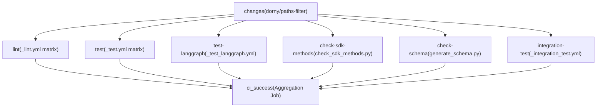
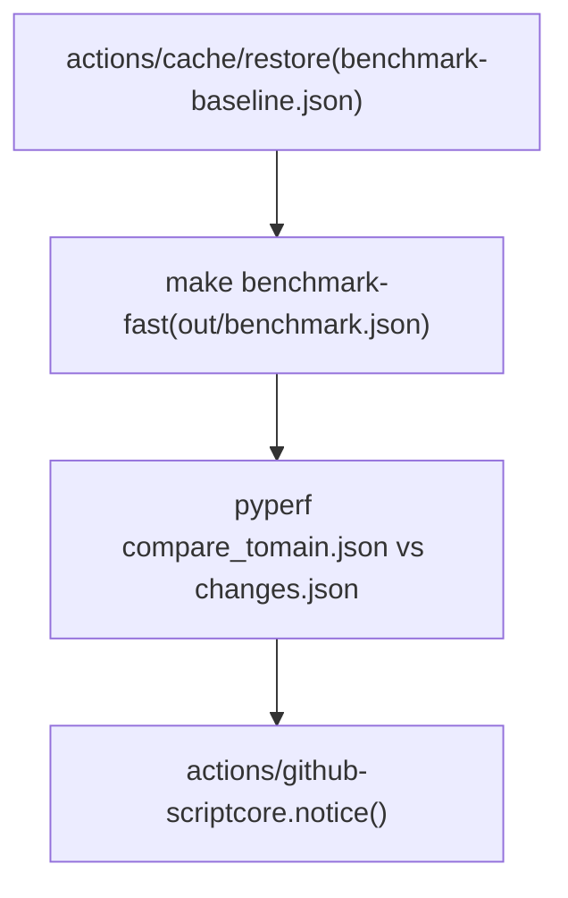
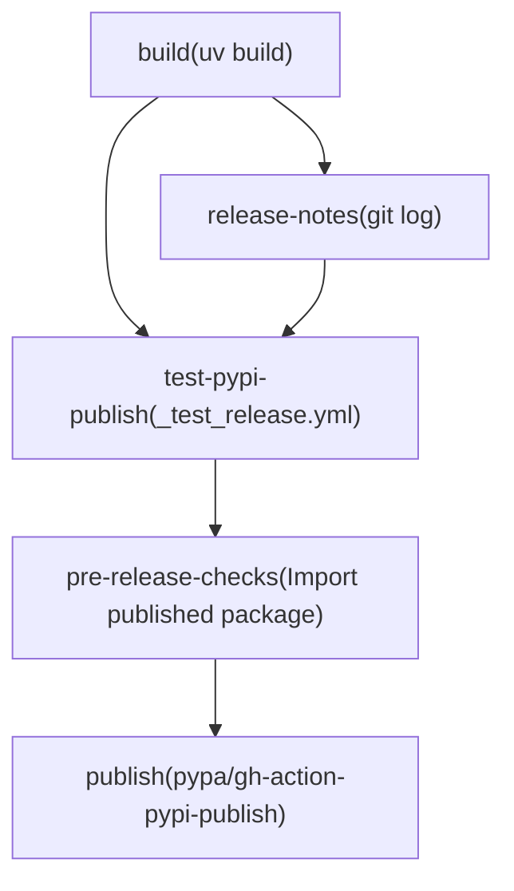

# CI/CD 工作流

相关源文件

-   [.github/ISSUE\_TEMPLATE/bug-report.yml](https://github.com/langchain-ai/langgraph/blob/1fd51e8f/.github/ISSUE_TEMPLATE/bug-report.yml)
-   [.github/ISSUE\_TEMPLATE/config.yml](https://github.com/langchain-ai/langgraph/blob/1fd51e8f/.github/ISSUE_TEMPLATE/config.yml)
-   [.github/ISSUE\_TEMPLATE/privileged.yml](https://github.com/langchain-ai/langgraph/blob/1fd51e8f/.github/ISSUE_TEMPLATE/privileged.yml)
-   [.github/PULL\_REQUEST\_TEMPLATE.md](https://github.com/langchain-ai/langgraph/blob/1fd51e8f/.github/PULL_REQUEST_TEMPLATE.md?plain=1)
-   [.github/actions/uv\_setup/action.yml](https://github.com/langchain-ai/langgraph/blob/1fd51e8f/.github/actions/uv_setup/action.yml)
-   [.github/workflows/\_integration\_test.yml](https://github.com/langchain-ai/langgraph/blob/1fd51e8f/.github/workflows/_integration_test.yml)
-   [.github/workflows/\_lint.yml](https://github.com/langchain-ai/langgraph/blob/1fd51e8f/.github/workflows/_lint.yml)
-   [.github/workflows/\_test.yml](https://github.com/langchain-ai/langgraph/blob/1fd51e8f/.github/workflows/_test.yml)
-   [.github/workflows/\_test\_langgraph.yml](https://github.com/langchain-ai/langgraph/blob/1fd51e8f/.github/workflows/_test_langgraph.yml)
-   [.github/workflows/\_test\_release.yml](https://github.com/langchain-ai/langgraph/blob/1fd51e8f/.github/workflows/_test_release.yml)
-   [.github/workflows/baseline.yml](https://github.com/langchain-ai/langgraph/blob/1fd51e8f/.github/workflows/baseline.yml)
-   [.github/workflows/bench.yml](https://github.com/langchain-ai/langgraph/blob/1fd51e8f/.github/workflows/bench.yml)
-   [.github/workflows/ci.yml](https://github.com/langchain-ai/langgraph/blob/1fd51e8f/.github/workflows/ci.yml)
-   [.github/workflows/release.yml](https://github.com/langchain-ai/langgraph/blob/1fd51e8f/.github/workflows/release.yml)
-   [.github/workflows/uv\_lock\_ugprade.yml](https://github.com/langchain-ai/langgraph/blob/1fd51e8f/.github/workflows/uv_lock_ugprade.yml)
-   [AGENTS.md](https://github.com/langchain-ai/langgraph/blob/1fd51e8f/AGENTS.md?plain=1)
-   [CLAUDE.md](https://github.com/langchain-ai/langgraph/blob/1fd51e8f/CLAUDE.md?plain=1)

本页文档介绍 LangGraph monorepo 中的全部 GitHub Actions 工作流：主 CI 流水线、可复用作业工作流、基准测试流水线、每周依赖锁升级，以及发布工作流。关于具体发布流程（PyPI 发布、打 tag 与发布说明），参见 [9.4](https://github.com/langchain-ai/langgraph/blob/1fd51e8f/9.4)；关于测试基础设施细节（fixtures、Docker 服务、conftest 设置），参见 [9.2](https://github.com/langchain-ai/langgraph/blob/1fd51e8f/9.2)；关于这些工作流调用的 monorepo 构建系统与 `make` 目标，参见 [9.1](https://github.com/langchain-ai/langgraph/blob/1fd51e8f/9.1)

---

## 工作流清单

所有工作流文件位于 `.github/workflows/` 下。以 `_` 开头的文件为可复用工作流，通过 `workflow_call` 被其他工作流调用。

| 文件 | 名称 | 触发器 | 用途 |
| --- | --- | --- | --- |
| `ci.yml` | CI | `push` 到 `main`，`pull_request` | 编排 lint、测试、schema 与集成检查 [.github/workflows/ci.yml1-10](https://github.com/langchain-ai/langgraph/blob/1fd51e8f/.github/workflows/ci.yml#L1-L10) |
| `_lint.yml` | lint | `workflow_call` | 按包运行 ruff 与 mypy [.github/workflows/\_lint.yml1-10](https://github.com/langchain-ai/langgraph/blob/1fd51e8f/.github/workflows/_lint.yml#L1-L10) |
| `_test.yml` | test | `workflow_call` | 跨 Python 版本按包运行 `make test` [.github/workflows/\_test.yml1-10](https://github.com/langchain-ai/langgraph/blob/1fd51e8f/.github/workflows/_test.yml#L1-L10) |
| `_test_langgraph.yml` | test | `workflow_call` | 专门针对 `libs/langgraph` 运行 `make test_parallel` [.github/workflows/\_test\_langgraph.yml1-10](https://github.com/langchain-ai/langgraph/blob/1fd51e8f/.github/workflows/_test_langgraph.yml#L1-L10) |
| `_integration_test.yml` | CLI integration test | `workflow_call` | 通过 `langgraph build` 构建并 smoke-test Docker 镜像 [.github/workflows/\_integration\_test.yml1-10](https://github.com/langchain-ai/langgraph/blob/1fd51e8f/.github/workflows/_integration_test.yml#L1-L10) |
| `bench.yml` | bench | 针对 `libs/**` 的 `pull_request` | 运行基准测试并与基线对比 [.github/workflows/bench.yml1-10](https://github.com/langchain-ai/langgraph/blob/1fd51e8f/.github/workflows/bench.yml#L1-L10) |
| `baseline.yml` | baseline | `push` 到 `main`，`workflow_dispatch` | 将基准测试基线保存到缓存 [.github/workflows/baseline.yml1-10](https://github.com/langchain-ai/langgraph/blob/1fd51e8f/.github/workflows/baseline.yml#L1-L10) |
| `uv_lock_ugprade.yml` | UV Lock Upgrade | 每周 cron，`workflow_dispatch` | 运行 `make lock-upgrade` 并创建 PR [.github/workflows/uv\_lock\_ugprade.yml1-10](https://github.com/langchain-ai/langgraph/blob/1fd51e8f/.github/workflows/uv_lock_ugprade.yml#L1-L10) |
| `release.yml` | release | `workflow_dispatch` | 完整发布流水线（build → test PyPI → pre-check → publish → tag） [.github/workflows/release.yml1-10](https://github.com/langchain-ai/langgraph/blob/1fd51e8f/.github/workflows/release.yml#L1-L10) |
| `_test_release.yml` | test-release | `workflow_call` | 构建并发布到 test PyPI [.github/workflows/\_test\_release.yml1-10](https://github.com/langchain-ai/langgraph/blob/1fd51e8f/.github/workflows/_test_release.yml#L1-L10) |

---

## 主 CI 流水线（`ci.yml`）

CI 工作流是所有 pull request 与推送到 `main` 的主要门禁。

### 并发控制

以 `${{ github.workflow }}-${{ github.ref }}` 为键的并发组可确保：当同一分支在 CI 运行期间有新推送到达时，旧运行会被取消 [.github/workflows/ci.yml21-23](https://github.com/langchain-ai/langgraph/blob/1fd51e8f/.github/workflows/ci.yml#L21-L23)

### 路径过滤（`changes` 作业）

首个作业使用 `dorny/paths-filter` 动作判断仓库中哪些区域发生了变化 [.github/workflows/ci.yml26-50](https://github.com/langchain-ai/langgraph/blob/1fd51e8f/.github/workflows/ci.yml#L26-L50) 两个输出标记控制下游作业：

| 标记 | 监听路径 |
| --- | --- |
| `python` | `libs/langgraph/**`, `libs/sdk-py/**`, `libs/cli/**`, `libs/checkpoint/**`, `libs/checkpoint-sqlite/**`, `libs/checkpoint-postgres/**`, `libs/checkpoint-conformance/**`, `libs/prebuilt/**` [.github/workflows/ci.yml38-46](https://github.com/langchain-ai/langgraph/blob/1fd51e8f/.github/workflows/ci.yml#L38-L46) |
| `deps` | `**/pyproject.toml`, `**/uv.lock` [.github/workflows/ci.yml47-49](https://github.com/langchain-ai/langgraph/blob/1fd51e8f/.github/workflows/ci.yml#L47-L49) |

下游作业仅在 `python == 'true'` 或 `deps == 'true'` 时运行，从而避免仅文档变更触发不必要工作 [.github/workflows/ci.yml67-97](https://github.com/langchain-ai/langgraph/blob/1fd51e8f/.github/workflows/ci.yml#L67-L97)

### 作业图

**CI 流水线作业依赖图：**

来源: [.github/workflows/ci.yml26-169](https://github.com/langchain-ai/langgraph/blob/1fd51e8f/.github/workflows/ci.yml#L26-L169)

### `ci_success` 门禁作业

最终 `ci_success` 作业 [.github/workflows/ci.yml159-184](https://github.com/langchain-ai/langgraph/blob/1fd51e8f/.github/workflows/ci.yml#L159-L184) 始终运行（通过 `if: always()`），并在任一上游作业结果为 `failure` 或 `cancelled` 时以非零退出 [.github/workflows/ci.yml176](https://github.com/langchain-ai/langgraph/blob/1fd51e8f/.github/workflows/ci.yml#L176-L176) 这样可提供一个单一必需状态检查，供分支保护规则使用，不受路径过滤导致的作业跳过影响。

---

## 可复用工作流

### `_lint.yml` — 包级 Lint

通过 `workflow_call` 触发，并接收 `working-directory` 输入 [.github/workflows/\_lint.yml4-9](https://github.com/langchain-ai/langgraph/blob/1fd51e8f/.github/workflows/_lint.yml#L4-L9) 运行于 Python 3.12 [.github/workflows/\_lint.yml31](https://github.com/langchain-ai/langgraph/blob/1fd51e8f/.github/workflows/_lint.yml#L31-L31)

步骤：

1.  **变更文件检测** — 使用 `Ana06/get-changed-files`，过滤 `${{ inputs.working-directory }}/**` [.github/workflows/\_lint.yml35-40](https://github.com/langchain-ai/langgraph/blob/1fd51e8f/.github/workflows/_lint.yml#L35-L40)
2.  **安装 lint 依赖** — `uv sync --frozen --group lint` [.github/workflows/\_lint.yml52](https://github.com/langchain-ai/langgraph/blob/1fd51e8f/.github/workflows/_lint.yml#L52-L52)
3.  **恢复 mypy 缓存** — 以 `uv.lock` 哈希为键缓存 `.mypy_cache` [.github/workflows/\_lint.yml54-62](https://github.com/langchain-ai/langgraph/blob/1fd51e8f/.github/workflows/_lint.yml#L54-L62)
4.  **`lint_package`** — 运行 `make lint_package`（回退到 `make lint`） [.github/workflows/\_lint.yml68-73](https://github.com/langchain-ai/langgraph/blob/1fd51e8f/.github/workflows/_lint.yml#L68-L73)
5.  **`lint_tests`** — 运行 `make lint_tests` [.github/workflows/\_lint.yml94-98](https://github.com/langchain-ai/langgraph/blob/1fd51e8f/.github/workflows/_lint.yml#L94-L98)

环境变量 `RUFF_OUTPUT_FORMAT=github` 会使 ruff 输出内联 PR 注释 [.github/workflows/\_lint.yml16](https://github.com/langchain-ai/langgraph/blob/1fd51e8f/.github/workflows/_lint.yml#L16-L16)

来源: [.github/workflows/\_lint.yml1-98](https://github.com/langchain-ai/langgraph/blob/1fd51e8f/.github/workflows/_lint.yml#L1-L98)

### `_test.yml` — 包级测试

通过 `workflow_call` 触发，并接收 `working-directory` 输入 [.github/workflows/\_test.yml4-9](https://github.com/langchain-ai/langgraph/blob/1fd51e8f/.github/workflows/_test.yml#L4-L9) 在 **Python 3.10、3.11、3.12、3.13、3.14** 矩阵上运行 [.github/workflows/\_test.yml18-24](https://github.com/langchain-ai/langgraph/blob/1fd51e8f/.github/workflows/_test.yml#L18-L24)

步骤：

1.  **Docker Hub 登录** — 认证以避免镜像拉取限流 [.github/workflows/\_test.yml35-40](https://github.com/langchain-ai/langgraph/blob/1fd51e8f/.github/workflows/_test.yml#L35-L40)
2.  **安装依赖** — `uv sync --frozen --group test --no-dev` [.github/workflows/\_test.yml45](https://github.com/langchain-ai/langgraph/blob/1fd51e8f/.github/workflows/_test.yml#L45-L45)
3.  **运行测试** — `make test` [.github/workflows/\_test.yml50](https://github.com/langchain-ai/langgraph/blob/1fd51e8f/.github/workflows/_test.yml#L50-L50)
4.  **工作树清洁检查** — 若测试产生未跟踪文件则失败 [.github/workflows/\_test.yml52-63](https://github.com/langchain-ai/langgraph/blob/1fd51e8f/.github/workflows/_test.yml#L52-L63)

来源: [.github/workflows/\_test.yml1-64](https://github.com/langchain-ai/langgraph/blob/1fd51e8f/.github/workflows/_test.yml#L1-L64)

### `_test_langgraph.yml` — LangGraph 专用测试

与 `_test.yml` 基本一致，但固定针对 `libs/langgraph`，并调用 `make test_parallel` [.github/workflows/\_test\_langgraph.yml46](https://github.com/langchain-ai/langgraph/blob/1fd51e8f/.github/workflows/_test_langgraph.yml#L46-L46) 同时还包含 Python 3.13 下的严格 msgpack 专项运行 [.github/workflows/\_test\_langgraph.yml48-53](https://github.com/langchain-ai/langgraph/blob/1fd51e8f/.github/workflows/_test_langgraph.yml#L48-L53)

来源: [.github/workflows/\_test\_langgraph.yml1-66](https://github.com/langchain-ai/langgraph/blob/1fd51e8f/.github/workflows/_test_langgraph.yml#L1-L66)

---

## Schema 与 SDK 一致性检查

### `check-sdk-methods`

运行 `.github/scripts/check_sdk_methods.py` [.github/workflows/ci.yml114](https://github.com/langchain-ai/langgraph/blob/1fd51e8f/.github/workflows/ci.yml#L114-L114) 用于验证 SDK 中定义的方法与服务端 API 匹配。仅在 Python 源码变更时运行 [.github/workflows/ci.yml104](https://github.com/langchain-ai/langgraph/blob/1fd51e8f/.github/workflows/ci.yml#L104-L104)

### `check-schema`

在 `libs/cli` 中通过 `uv run python generate_schema.py` 生成 `langgraph.json` 配置 schema，再与已提交的 `schemas/schema.json` 做 diff [.github/workflows/ci.yml137-149](https://github.com/langchain-ai/langgraph/blob/1fd51e8f/.github/workflows/ci.yml#L137-L149) 运行于 Python 3.13 [.github/workflows/ci.yml130](https://github.com/langchain-ai/langgraph/blob/1fd51e8f/.github/workflows/ci.yml#L130-L130)

来源: [.github/workflows/ci.yml102-151](https://github.com/langchain-ai/langgraph/blob/1fd51e8f/.github/workflows/ci.yml#L102-L151)

---

## CLI 集成测试（`_integration_test.yml`）

该可复用工作流使用 `langgraph build` 构建真实 Docker 镜像，并对构建出的容器运行测试 [.github/workflows/\_integration\_test.yml61-74](https://github.com/langchain-ai/langgraph/blob/1fd51e8f/.github/workflows/_integration_test.yml#L61-L74)

### 矩阵

矩阵覆盖 Python 版本（3.10、3.14）及多个示例场景（A、B、C、D） [.github/workflows/\_integration\_test.yml17-32](https://github.com/langchain-ai/langgraph/blob/1fd51e8f/.github/workflows/_integration_test.yml#L17-L32)

| 示例 | 工作目录 | Tag |
| --- | --- | --- |
| A | `libs/cli/examples` | `langgraph-test-a` |
| B | `libs/cli/examples/graphs` | `langgraph-test-b` |
| C | `libs/cli/examples/graphs_reqs_a` | `langgraph-test-c` |
| D | `libs/cli/examples/graphs_reqs_b` | `langgraph-test-d` |

### 特殊构建（仅 Example A）

当选择 Example A 时，工作流还会构建：

-   JS 服务（`libs/cli/js-examples`） [.github/workflows/\_integration\_test.yml76-80](https://github.com/langchain-ai/langgraph/blob/1fd51e8f/.github/workflows/_integration_test.yml#L76-L80)
-   JS monorepo 服务（`libs/cli/js-monorepo-example`） [.github/workflows/\_integration\_test.yml82-86](https://github.com/langchain-ai/langgraph/blob/1fd51e8f/.github/workflows/_integration_test.yml#L82-L86)
-   Python monorepo 服务（`libs/cli/python-monorepo-example`） [.github/workflows/\_integration\_test.yml88-92](https://github.com/langchain-ai/langgraph/blob/1fd51e8f/.github/workflows/_integration_test.yml#L88-L92)
-   预发布 requirements 服务（`libs/cli/examples/graph_prerelease_reqs`） [.github/workflows/\_integration\_test.yml103-107](https://github.com/langchain-ai/langgraph/blob/1fd51e8f/.github/workflows/_integration_test.yml#L103-L107)

来源: [.github/workflows/\_integration\_test.yml1-139](https://github.com/langchain-ai/langgraph/blob/1fd51e8f/.github/workflows/_integration_test.yml#L1-L139)

---

## 基准测试工作流

### `baseline.yml` — 保存基线

**触发器：** 推送到 `main` [.github/workflows/baseline.yml5-6](https://github.com/langchain-ai/langgraph/blob/1fd51e8f/.github/workflows/baseline.yml#L5-L6) 在 `libs/langgraph` 运行 `make benchmark`，并将 `out/benchmark-baseline.json` 保存到 Actions 缓存 [.github/workflows/baseline.yml31-37](https://github.com/langchain-ai/langgraph/blob/1fd51e8f/.github/workflows/baseline.yml#L31-L37)

### `bench.yml` — PR 对比

**触发器：** 修改 `libs/**` 的 pull request [.github/workflows/bench.yml4-6](https://github.com/langchain-ai/langgraph/blob/1fd51e8f/.github/workflows/bench.yml#L4-L6)

**基准对比图：**

来源: [.github/workflows/bench.yml12-71](https://github.com/langchain-ai/langgraph/blob/1fd51e8f/.github/workflows/bench.yml#L12-L71) [.github/workflows/baseline.yml14-38](https://github.com/langchain-ai/langgraph/blob/1fd51e8f/.github/workflows/baseline.yml#L14-L38)

---

## 每周依赖锁升级（`uv_lock_ugprade.yml`）

**触发器：** 每周日午夜 cron [.github/workflows/uv\_lock\_ugprade.yml4-6](https://github.com/langchain-ai/langgraph/blob/1fd51e8f/.github/workflows/uv_lock_ugprade.yml#L4-L6) 运行 `make lock-upgrade` [.github/workflows/uv\_lock\_ugprade.yml28](https://github.com/langchain-ai/langgraph/blob/1fd51e8f/.github/workflows/uv_lock_ugprade.yml#L28-L28) 并使用 `peter-evans/create-pull-request` 创建 PR [.github/workflows/uv\_lock\_ugprade.yml31-46](https://github.com/langchain-ai/langgraph/blob/1fd51e8f/.github/workflows/uv_lock_ugprade.yml#L31-L46)

来源: [.github/workflows/uv\_lock\_ugprade.yml1-46](https://github.com/langchain-ai/langgraph/blob/1fd51e8f/.github/workflows/uv_lock_ugprade.yml#L1-L46)

---

## 发布流水线

发布工作流 `release.yml` 负责构建、发布到 test PyPI、预发布检查以及最终发布。

### 作业顺序

**发布工作流作业依赖图：**

来源: [.github/workflows/release.yml17-328](https://github.com/langchain-ai/langgraph/blob/1fd51e8f/.github/workflows/release.yml#L17-L328)

### 权限隔离

`build` 作业以 `contents: read` 权限运行 [.github/workflows/release.yml11-12](https://github.com/langchain-ai/langgraph/blob/1fd51e8f/.github/workflows/release.yml#L11-L12) `test-pypi-publish` 与 `publish` 作业需要 `id-token: write` 以支持 Trusted Publishing [.github/workflows/release.yml147-260](https://github.com/langchain-ai/langgraph/blob/1fd51e8f/.github/workflows/release.yml#L147-L260)

### `_test_release.yml` 可复用工作流

由 `release.yml` 调用，用于构建项目并发布到 Test PyPI [.github/workflows/\_test\_release.yml4-90](https://github.com/langchain-ai/langgraph/blob/1fd51e8f/.github/workflows/_test_release.yml#L4-L90)

来源: [.github/workflows/release.yml1-328](https://github.com/langchain-ai/langgraph/blob/1fd51e8f/.github/workflows/release.yml#L1-L328) [.github/workflows/\_test\_release.yml1-98](https://github.com/langchain-ai/langgraph/blob/1fd51e8f/.github/workflows/_test_release.yml#L1-L98)

---

## Python 版本覆盖摘要

| 工作流 | Python 版本 |
| --- | --- |
| `_lint.yml` | 3.12 [.github/workflows/\_lint.yml31](https://github.com/langchain-ai/langgraph/blob/1fd51e8f/.github/workflows/_lint.yml#L31-L31) |
| `_test.yml` | 3.10, 3.11, 3.12, 3.13, 3.14 [.github/workflows/\_test.yml20-24](https://github.com/langchain-ai/langgraph/blob/1fd51e8f/.github/workflows/_test.yml#L20-L24) |
| `_test_langgraph.yml` | 3.10, 3.11, 3.12, 3.13, 3.14 [.github/workflows/\_test\_langgraph.yml15-19](https://github.com/langchain-ai/langgraph/blob/1fd51e8f/.github/workflows/_test_langgraph.yml#L15-L19) |
| `_integration_test.yml` | 3.10, 3.14 [.github/workflows/\_integration\_test.yml18-19](https://github.com/langchain-ai/langgraph/blob/1fd51e8f/.github/workflows/_integration_test.yml#L18-L19) |
| `bench.yml` | 3.11 [.github/workflows/bench.yml24](https://github.com/langchain-ai/langgraph/blob/1fd51e8f/.github/workflows/bench.yml#L24-L24) |
| `baseline.yml` | 3.11 [.github/workflows/baseline.yml22](https://github.com/langchain-ai/langgraph/blob/1fd51e8f/.github/workflows/baseline.yml#L22-L22) |
| `release.yml` | 3.11 [.github/workflows/release.yml15](https://github.com/langchain-ai/langgraph/blob/1fd51e8f/.github/workflows/release.yml#L15-L15) |
| `_test_release.yml` | 3.10 [.github/workflows/\_test\_release.yml12](https://github.com/langchain-ai/langgraph/blob/1fd51e8f/.github/workflows/_test_release.yml#L12-L12) |
| `uv_lock_ugprade.yml` | 3.10 [.github/workflows/uv\_lock\_ugprade.yml24](https://github.com/langchain-ai/langgraph/blob/1fd51e8f/.github/workflows/uv_lock_ugprade.yml#L24-L24) |
