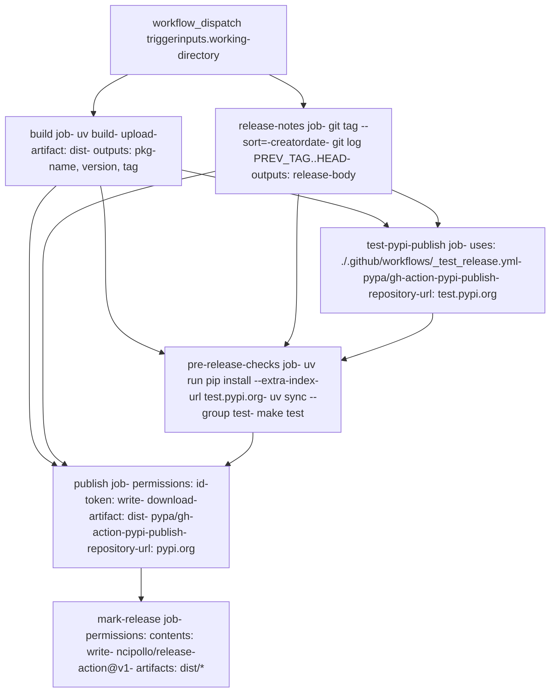
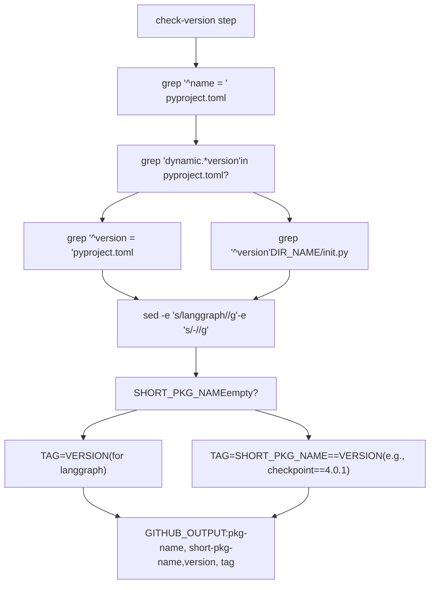

# 发布流程

相关源文件

-   [.github/workflows/\_integration\_test.yml](https://github.com/langchain-ai/langgraph/blob/1fd51e8f/.github/workflows/_integration_test.yml)
-   [.github/workflows/\_lint.yml](https://github.com/langchain-ai/langgraph/blob/1fd51e8f/.github/workflows/_lint.yml)
-   [.github/workflows/\_test.yml](https://github.com/langchain-ai/langgraph/blob/1fd51e8f/.github/workflows/_test.yml)
-   [.github/workflows/\_test\_langgraph.yml](https://github.com/langchain-ai/langgraph/blob/1fd51e8f/.github/workflows/_test_langgraph.yml)
-   [.github/workflows/\_test\_release.yml](https://github.com/langchain-ai/langgraph/blob/1fd51e8f/.github/workflows/_test_release.yml)
-   [.github/workflows/baseline.yml](https://github.com/langchain-ai/langgraph/blob/1fd51e8f/.github/workflows/baseline.yml)
-   [.github/workflows/bench.yml](https://github.com/langchain-ai/langgraph/blob/1fd51e8f/.github/workflows/bench.yml)
-   [.github/workflows/ci.yml](https://github.com/langchain-ai/langgraph/blob/1fd51e8f/.github/workflows/ci.yml)
-   [.github/workflows/release.yml](https://github.com/langchain-ai/langgraph/blob/1fd51e8f/.github/workflows/release.yml)
-   [.github/workflows/uv\_lock\_ugprade.yml](https://github.com/langchain-ai/langgraph/blob/1fd51e8f/.github/workflows/uv_lock_ugprade.yml)
-   [libs/checkpoint-postgres/uv.lock](https://github.com/langchain-ai/langgraph/blob/1fd51e8f/libs/checkpoint-postgres/uv.lock)
-   [libs/checkpoint-sqlite/uv.lock](https://github.com/langchain-ai/langgraph/blob/1fd51e8f/libs/checkpoint-sqlite/uv.lock)
-   [libs/checkpoint/langgraph/checkpoint/serde/jsonplus.py](https://github.com/langchain-ai/langgraph/blob/1fd51e8f/libs/checkpoint/langgraph/checkpoint/serde/jsonplus.py)
-   [libs/checkpoint/pyproject.toml](https://github.com/langchain-ai/langgraph/blob/1fd51e8f/libs/checkpoint/pyproject.toml)
-   [libs/checkpoint/tests/test\_jsonplus.py](https://github.com/langchain-ai/langgraph/blob/1fd51e8f/libs/checkpoint/tests/test_jsonplus.py)
-   [libs/checkpoint/uv.lock](https://github.com/langchain-ai/langgraph/blob/1fd51e8f/libs/checkpoint/uv.lock)
-   [libs/langgraph/pyproject.toml](https://github.com/langchain-ai/langgraph/blob/1fd51e8f/libs/langgraph/pyproject.toml)
-   [libs/langgraph/tests/\_\_snapshots\_\_/test\_pregel.ambr](https://github.com/langchain-ai/langgraph/blob/1fd51e8f/libs/langgraph/tests/__snapshots__/test_pregel.ambr)
-   [libs/langgraph/tests/\_\_snapshots\_\_/test\_pregel\_async.ambr](https://github.com/langchain-ai/langgraph/blob/1fd51e8f/libs/langgraph/tests/__snapshots__/test_pregel_async.ambr)
-   [libs/langgraph/uv.lock](https://github.com/langchain-ai/langgraph/blob/1fd51e8f/libs/langgraph/uv.lock)
-   [libs/prebuilt/pyproject.toml](https://github.com/langchain-ai/langgraph/blob/1fd51e8f/libs/prebuilt/pyproject.toml)
-   [libs/prebuilt/uv.lock](https://github.com/langchain-ai/langgraph/blob/1fd51e8f/libs/prebuilt/uv.lock)
-   [libs/sdk-py/uv.lock](https://github.com/langchain-ai/langgraph/blob/1fd51e8f/libs/sdk-py/uv.lock)

LangGraph 的发布流程通过手动触发的 GitHub Actions 工作流实现（[.github/workflows/release.yml1-328](https://github.com/langchain-ai/langgraph/blob/1fd51e8f/.github/workflows/release.yml#L1-L328)），用于将包发布到 PyPI。该工作流在构建与发布阶段之间实施权限隔离，在正式发布前先于 TestPyPI 验证包，并基于 git 日志创建 GitHub release。

相关文档：

-   **CI/CD workflows**（第 2.3 页）：pull request 上的自动化测试
-   **Monorepo structure**（第 2.1 页）：包组织与构建系统
-   **Testing infrastructure**（第 2.2 页）：测试配置与辅助工具

## 工作流作业

`release.yml` 工作流按严格依赖顺序执行 6 个作业，以确保发布安全且可验证：

| 作业名 | 依赖 | 用途 |
| --- | --- | --- |
| `build` | \- | 执行 `uv build` 并提取 `pkg-name`、`version`、`tag` 输出 [.github/workflows/release.yml18-81](https://github.com/langchain-ai/langgraph/blob/1fd51e8f/.github/workflows/release.yml#L18-L81) |
| `release-notes` | `build` | 比较 git tag 并通过 `git log` 生成变更日志 [.github/workflows/release.yml82-140](https://github.com/langchain-ai/langgraph/blob/1fd51e8f/.github/workflows/release.yml#L82-L140) |
| `test-pypi-publish` | `build`, `release-notes` | 调用可复用工作流发布到 test.pypi.org [.github/workflows/release.yml141-152](https://github.com/langchain-ai/langgraph/blob/1fd51e8f/.github/workflows/release.yml#L141-L152) |
| `pre-release-checks` | `build`, `release-notes`, `test-pypi-publish` | 从 TestPyPI 安装并运行 `make test` [.github/workflows/release.yml153-242](https://github.com/langchain-ai/langgraph/blob/1fd51e8f/.github/workflows/release.yml#L153-L242) |
| `publish` | `build`, `release-notes`, `pre-release-checks` | 通过 trusted publishing 发布到 pypi.org [.github/workflows/release.yml243-285](https://github.com/langchain-ai/langgraph/blob/1fd51e8f/.github/workflows/release.yml#L243-L285) |
| `mark-release` | `publish` | 使用 git tag 与产物创建 GitHub release [.github/workflows/release.yml286-328](https://github.com/langchain-ai/langgraph/blob/1fd51e8f/.github/workflows/release.yml#L286-L328) |

来源: [.github/workflows/release.yml17-328](https://github.com/langchain-ai/langgraph/blob/1fd51e8f/.github/workflows/release.yml#L17-L328)

## 作业依赖图

下图展示发布作业之间的执行流与数据流（artifacts 与 outputs）。

### 发布工作流编排

**目的**：映射 GitHub Actions 工作流作业依赖，以及每个作业使用的关键动作与权限。

来源: [.github/workflows/release.yml17-328](https://github.com/langchain-ai/langgraph/blob/1fd51e8f/.github/workflows/release.yml#L17-L328)

## 触发器与输入

发布工作流通过 `workflow_dispatch` 手动触发 [.github/workflows/release.yml4-9](https://github.com/langchain-ai/langgraph/blob/1fd51e8f/.github/workflows/release.yml#L4-L9)

| 输入 | 类型 | 默认值 | 描述 |
| --- | --- | --- | --- |
| `working-directory` | string | `libs/langgraph` | 要发布的包目录（例如 `libs/checkpoint`） |

**支持的包**（monorepo 结构）：

-   `langgraph`：核心框架 [libs/langgraph/pyproject.toml6](https://github.com/langchain-ai/langgraph/blob/1fd51e8f/libs/langgraph/pyproject.toml#L6-L6)
-   `langgraph-checkpoint`：基础接口 [libs/checkpoint/pyproject.toml6](https://github.com/langchain-ai/langgraph/blob/1fd51e8f/libs/checkpoint/pyproject.toml#L6-L6)
-   `langgraph-prebuilt`：预构建组件 [libs/prebuilt/pyproject.toml6](https://github.com/langchain-ai/langgraph/blob/1fd51e8f/libs/prebuilt/pyproject.toml#L6-L6)
-   `langgraph-sdk`：Python 客户端 [libs/langgraph/pyproject.toml29](https://github.com/langchain-ai/langgraph/blob/1fd51e8f/libs/langgraph/pyproject.toml#L29-L29)

来源: [.github/workflows/release.yml4-9](https://github.com/langchain-ai/langgraph/blob/1fd51e8f/.github/workflows/release.yml#L4-L9) [libs/langgraph/pyproject.toml6-33](https://github.com/langchain-ai/langgraph/blob/1fd51e8f/libs/langgraph/pyproject.toml#L6-L33)

## 构建阶段

`build` 作业通过 `uv build` 提取版本信息并生成分发产物 [.github/workflows/release.yml49](https://github.com/langchain-ai/langgraph/blob/1fd51e8f/.github/workflows/release.yml#L49-L49)

### 版本检测逻辑

该工作流使用 bash 脚本来处理 monorepo 包中静态与动态两种版本策略。

### 包元数据提取

**目的**：展示从 `pyproject.toml` 或 `__init__.py` 提取版本信息的 bash 脚本逻辑。

版本检测脚本执行以下步骤 [.github/workflows/release.yml58-80](https://github.com/langchain-ai/langgraph/blob/1fd51e8f/.github/workflows/release.yml#L58-L80)：

1.  **提取包名**：读取 `pyproject.toml` 中的 `name` 字段。
2.  **处理动态版本**：若 `version` 标记为 dynamic，则从包的 `__init__.py` 读取 `__version__`；否则直接从 `pyproject.toml` 读取。
3.  **生成 Tag**：
    -   对主 `langgraph` 包，tag 仅为版本号（例如 `1.1.3`）。
    -   对子包（如 `langgraph-checkpoint`），生成带前缀的 tag（例如 `checkpoint==4.0.1`）。

### 构建产物

构建步骤使用 `uv build` 生成源码包与 wheel。仓库使用 `hatchling` 作为构建后端 [libs/langgraph/pyproject.toml3](https://github.com/langchain-ai/langgraph/blob/1fd51e8f/libs/langgraph/pyproject.toml#L3-L3) 产物通过 `actions/upload-artifact@v7` 上传 [.github/workflows/release.yml52-57](https://github.com/langchain-ai/langgraph/blob/1fd51e8f/.github/workflows/release.yml#L52-L57)，供后续发布作业使用。

来源: [.github/workflows/release.yml18-81](https://github.com/langchain-ai/langgraph/blob/1fd51e8f/.github/workflows/release.yml#L18-L81) [libs/langgraph/pyproject.toml1-3](https://github.com/langchain-ai/langgraph/blob/1fd51e8f/libs/langgraph/pyproject.toml#L1-L3)

## 发布说明生成

`release-notes` 作业通过比较当前版本 tag 与最近上一个 tag 来生成变更日志 [.github/workflows/release.yml82-140](https://github.com/langchain-ai/langgraph/blob/1fd51e8f/.github/workflows/release.yml#L82-L140)

1.  **上一个 tag 发现**：使用 `git tag --sort=-creatordate` 并结合包级正则过滤，查找该包最近一次发布 tag [.github/workflows/release.yml113](https://github.com/langchain-ai/langgraph/blob/1fd51e8f/.github/workflows/release.yml#L113-L113)
2.  **提交日志**：使用 `git log --format="%s" "$PREV_TAG"..HEAD -- $WORKING_DIR` 生成变更列表 [.github/workflows/release.yml136](https://github.com/langchain-ai/langgraph/blob/1fd51e8f/.github/workflows/release.yml#L136-L136) 这确保发布说明只包含该包目录下的变更。

来源: [.github/workflows/release.yml82-140](https://github.com/langchain-ai/langgraph/blob/1fd51e8f/.github/workflows/release.yml#L82-L140)

## TestPyPI 验证

`test-pypi-publish` 作业使用可复用工作流 [./.github/workflows/\_test\_release.yml](https://github.com/langchain-ai/langgraph/blob/1fd51e8f/./.github/workflows/_test_release.yml) 发布到 TestPyPI [.github/workflows/release.yml141-152](https://github.com/langchain-ai/langgraph/blob/1fd51e8f/.github/workflows/release.yml#L141-L152)

### 预发布验证（`pre-release-checks`）

正式发布前，工作流会执行“冒烟测试”：从 TestPyPI 安装新发布包 [.github/workflows/release.yml153-242](https://github.com/langchain-ai/langgraph/blob/1fd51e8f/.github/workflows/release.yml#L153-L242)

-   **隔离性**：显式禁用缓存，以确保所有依赖都已正确声明且可解析 [.github/workflows/release.yml179](https://github.com/langchain-ai/langgraph/blob/1fd51e8f/.github/workflows/release.yml#L179-L179)
-   **双索引安装**：使用 `--extra-index-url https://test.pypi.org/simple/`，使依赖（如 `langchain-core`）来自生产 PyPI，而候选发布包来自 TestPyPI [.github/workflows/release.yml189-192](https://github.com/langchain-ai/langgraph/blob/1fd51e8f/.github/workflows/release.yml#L189-L192)
-   **测试执行**：针对从 TestPyPI 安装的包运行 `make test` [.github/workflows/release.yml239-241](https://github.com/langchain-ai/langgraph/blob/1fd51e8f/.github/workflows/release.yml#L239-L241)

来源: [.github/workflows/release.yml141-242](https://github.com/langchain-ai/langgraph/blob/1fd51e8f/.github/workflows/release.yml#L141-L242) [.github/workflows/\_test\_release.yml1-98](https://github.com/langchain-ai/langgraph/blob/1fd51e8f/.github/workflows/_test_release.yml#L1-L98)

## 使用 Trusted Publishing 发布到 PyPI

LangGraph 使用 **Trusted Publishing**（OIDC）发布到 PyPI，无需长期凭据（如 API token）。

1.  **权限**：`publish` 作业需要 `id-token: write` 权限，以向 GitHub OIDC 提供方请求 JWT [.github/workflows/release.yml250-256](https://github.com/langchain-ai/langgraph/blob/1fd51e8f/.github/workflows/release.yml#L250-L256)
2.  **发布动作**：使用 `pypa/gh-action-pypi-publish@release/v1` 上传 `dist/` 产物 [.github/workflows/release.yml277-284](https://github.com/langchain-ai/langgraph/blob/1fd51e8f/.github/workflows/release.yml#L277-L284)
3.  **安全隔离**：构建过程与发布过程分离，防止构建步骤受损后访问 PyPI 凭据 [.github/workflows/release.yml37-47](https://github.com/langchain-ai/langgraph/blob/1fd51e8f/.github/workflows/release.yml#L37-L47)

来源: [.github/workflows/release.yml243-285](https://github.com/langchain-ai/langgraph/blob/1fd51e8f/.github/workflows/release.yml#L243-L285)

## GitHub Release 与版本管理

最后的 `mark-release` 作业会创建正式 GitHub release [.github/workflows/release.yml286-328](https://github.com/langchain-ai/langgraph/blob/1fd51e8f/.github/workflows/release.yml#L286-L328)

-   **产物**：将与 PyPI 发布相同的 `.tar.gz` 与 `.whl` 文件上传到 GitHub release 页面 [.github/workflows/release.yml318-327](https://github.com/langchain-ai/langgraph/blob/1fd51e8f/.github/workflows/release.yml#L318-L327)
-   **打标**：创建 git tag（例如 `1.1.3` 或 `checkpoint==4.0.1`）并指向发布对应的 commit SHA [.github/workflows/release.yml323-327](https://github.com/langchain-ai/langgraph/blob/1fd51e8f/.github/workflows/release.yml#L323-L327)
-   **版本策略**：遵循语义化版本（Semantic Versioning）。主包版本见 [libs/langgraph/pyproject.toml7](https://github.com/langchain-ai/langgraph/blob/1fd51e8f/libs/langgraph/pyproject.toml#L7-L7)；`langgraph-checkpoint` 等子包独立版本管理 [libs/checkpoint/pyproject.toml7](https://github.com/langchain-ai/langgraph/blob/1fd51e8f/libs/checkpoint/pyproject.toml#L7-L7)

来源: [.github/workflows/release.yml286-328](https://github.com/langchain-ai/langgraph/blob/1fd51e8f/.github/workflows/release.yml#L286-L328) [libs/langgraph/pyproject.toml7](https://github.com/langchain-ai/langgraph/blob/1fd51e8f/libs/langgraph/pyproject.toml#L7-L7) [libs/checkpoint/pyproject.toml7](https://github.com/langchain-ai/langgraph/blob/1fd51e8f/libs/checkpoint/pyproject.toml#L7-L7)
