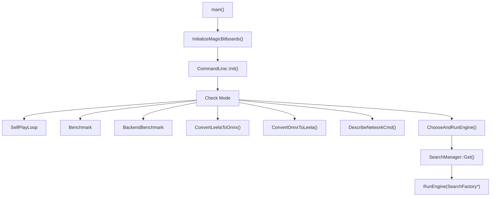
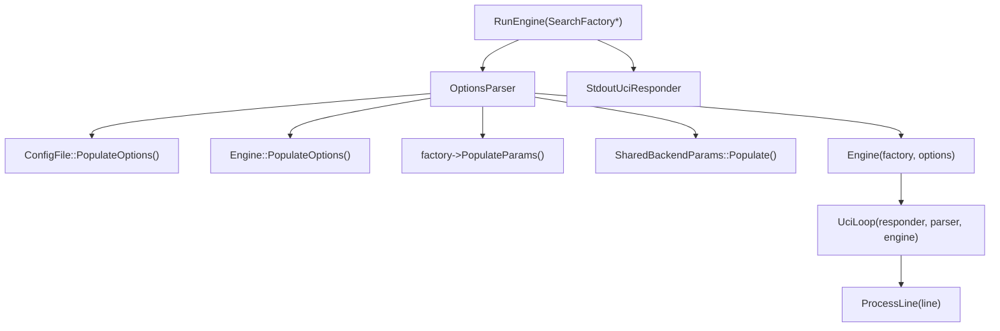
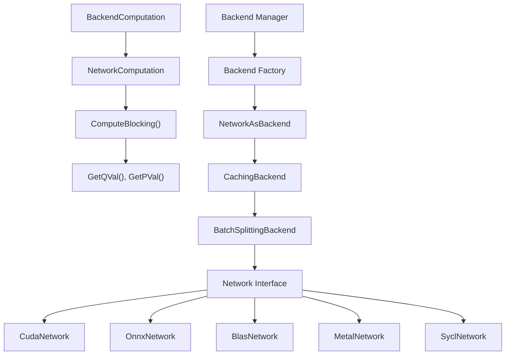
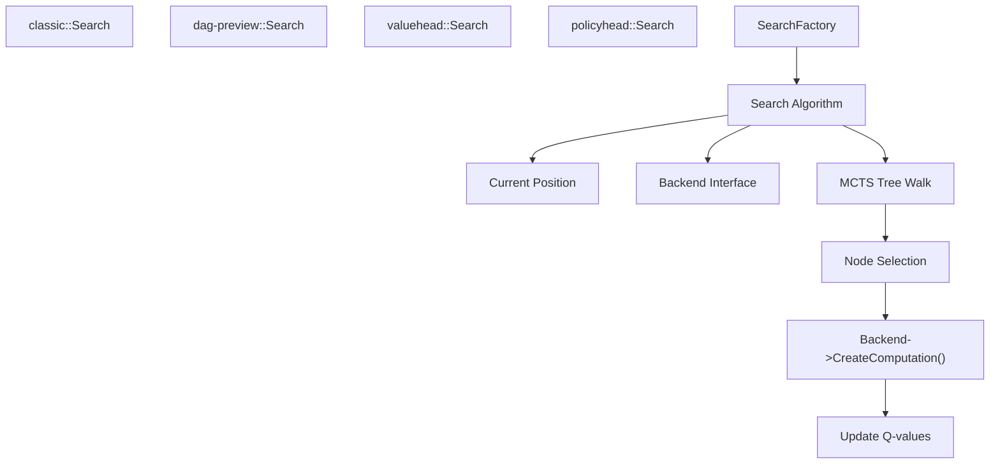
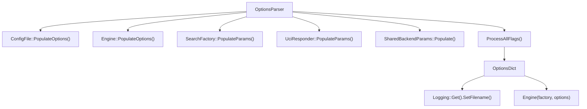
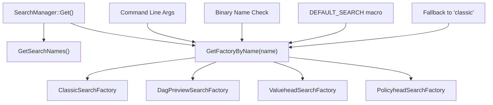
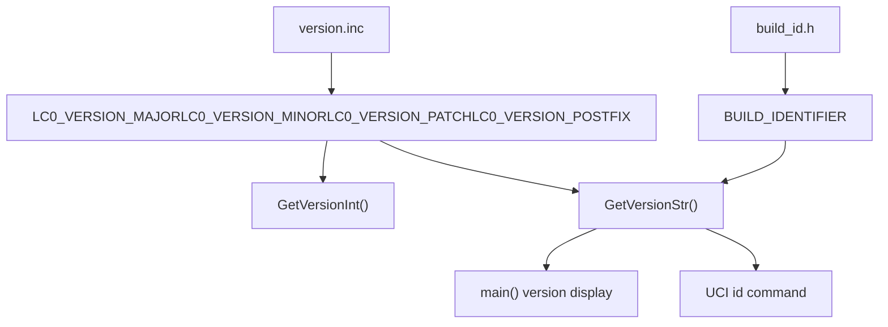
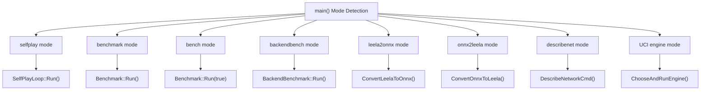
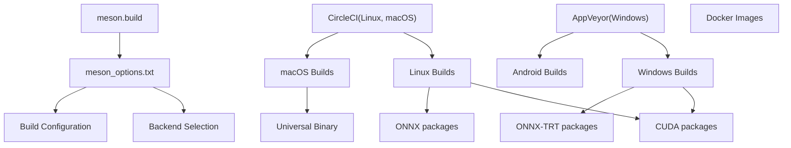

# Lc0 概览

相关源文件

-   [AUTHORS](https://github.com/LeelaChessZero/lc0/blob/b4e98c19/AUTHORS)
-   [CONTRIBUTING.md](https://github.com/LeelaChessZero/lc0/blob/b4e98c19/CONTRIBUTING.md)
-   [README.md](https://github.com/LeelaChessZero/lc0/blob/b4e98c19/README.md)
-   [changelog.txt](https://github.com/LeelaChessZero/lc0/blob/b4e98c19/changelog.txt)
-   [install\_openSUSE\_lc0.sh](https://github.com/LeelaChessZero/lc0/blob/b4e98c19/install_openSUSE_lc0.sh)
-   [openSUSE\_install.md](https://github.com/LeelaChessZero/lc0/blob/b4e98c19/openSUSE_install.md)
-   [pyproject.toml](https://github.com/LeelaChessZero/lc0/blob/b4e98c19/pyproject.toml)
-   [scripts/bumpversion.py](https://github.com/LeelaChessZero/lc0/blob/b4e98c19/scripts/bumpversion.py)
-   [src/engine\_loop.cc](https://github.com/LeelaChessZero/lc0/blob/b4e98c19/src/engine_loop.cc)
-   [src/engine\_loop.h](https://github.com/LeelaChessZero/lc0/blob/b4e98c19/src/engine_loop.h)
-   [src/main.cc](https://github.com/LeelaChessZero/lc0/blob/b4e98c19/src/main.cc)
-   [src/version.cc](https://github.com/LeelaChessZero/lc0/blob/b4e98c19/src/version.cc)
-   [src/version.h](https://github.com/LeelaChessZero/lc0/blob/b4e98c19/src/version.h)
-   [src/version.inc](https://github.com/LeelaChessZero/lc0/blob/b4e98c19/src/version.inc)

## 目的与范围

Lc0 是一个符合 UCI 标准的国际象棋引擎，它使用神经网络评估替代传统的手工评估函数。该引擎实现了由 [LeelaChessZero 项目](https://lczero.org) 训练的神经网络，并将其与蒙特卡洛树搜索（MCTS）结合来选择棋步。

代码库围绕几个关键系统构建：UCI 协议处理、棋局表示、MCTS 搜索算法以及硬件抽象的神经网络后端系统。引擎支持多种搜索算法（`classic`, `dag-preview`, `valuehead`, `policyhead`）和神经网络后端（CUDA, ONNX, BLAS, Metal, SYCL），以便在不同的硬件平台上高效运行。

本概览重点介绍高层架构以及主要系统之间如何交互。有关具体实现细节，请参阅每个子系统的专门页面。

来源：[README.md6](https://github.com/LeelaChessZero/lc0/blob/b4e98c19/README.md#L6-L6) [main.cc27-60](https://github.com/LeelaChessZero/lc0/blob/b4e98c19/main.cc#L27-L60) [engine\_loop.cc47-83](https://github.com/LeelaChessZero/lc0/blob/b4e98c19/engine_loop.cc#L47-L83)

## 系统架构

### 入口点与引擎选择

**入口点流程图**

[main.cc78-140](https://github.com/LeelaChessZero/lc0/blob/b4e98c19/main.cc#L78-L140) 中的 `main()` 函数作为入口点并确定执行模式。对于正常的国际象棋引擎操作，它调用 `ChooseAndRunEngine()`，该函数使用 `SearchManager` 选择合适的 `SearchFactory` 并调用 `RunEngine()`。

**核心引擎架构**

`RunEngine()` 函数创建主要的引擎组件：用于配置的 `OptionsParser`、使用所选 `SearchFactory` 的 `Engine` 实例，以及用于处理 UCI 协议通信的 `UciLoop`。

来源：[main.cc44-75](https://github.com/LeelaChessZero/lc0/blob/b4e98c19/main.cc#L44-L75) [main.cc78-140](https://github.com/LeelaChessZero/lc0/blob/b4e98c19/main.cc#L78-L140) [engine\_loop.cc47-82](https://github.com/LeelaChessZero/lc0/blob/b4e98c19/engine_loop.cc#L47-L82)

### 神经网络后端系统

**后端接口架构**

神经网络系统使用分层架构，其中 `Backend` 提供主接口，由缓存层和批处理层封装，最终委托给特定硬件的 `Network` 实现。

**搜索算法集成**

搜索系统支持通过 `SearchManager::GetFactoryByName()` 选择多种算法。每种搜索算法在树遍历期间与 `Backend` 接口交互以进行神经网络评估。

来源：[README.md27-50](https://github.com/LeelaChessZero/lc0/blob/b4e98c19/README.md#L27-L50) [main.cc46-74](https://github.com/LeelaChessZero/lc0/blob/b4e98c19/main.cc#L46-L74) [changelog.txt27-46](https://github.com/LeelaChessZero/lc0/blob/b4e98c19/changelog.txt#L27-L46)

## 配置与选项系统

**选项处理流程**

配置系统使用 `OptionsParser` 从多个来源收集选项，并创建用于引擎初始化的 `OptionsDict`。

**关键配置组件**

| 组件 | 目的 | 关键选项 |
| --- | --- | --- |
| `ConfigFile` | 基于文件的配置 | 配置文件解析与加载 |
| `Engine::PopulateOptions()` | 核心引擎选项 | UCI 选项，引擎行为 |
| `SearchFactory::PopulateParams()` | 搜索算法参数 | MCTS 参数，搜索限制 |
| `SharedBackendParams` | 神经网络后端选项 | 后端选择，硬件设置 |

来源：[engine\_loop.cc52-63](https://github.com/LeelaChessZero/lc0/blob/b4e98c19/engine_loop.cc#L52-L63) [engine\_loop.cc38-44](https://github.com/LeelaChessZero/lc0/blob/b4e98c19/engine_loop.cc#L38-L44)

## 搜索算法选择

**搜索算法架构**

`ChooseAndRunEngine()` 中的搜索算法选择遵循以下优先级顺序：

1.  显式的命令行搜索名称参数
2.  `DEFAULT_SEARCH` 编译时宏
3.  在二进制文件名中发现的搜索名称
4.  回退到 `"classic"` 搜索

**可用的搜索算法**

| 算法 | 目的 | 实现 |
| --- | --- | --- |
| `classic` | 带有神经网络评估的标准 MCTS | 默认生产算法 |
| `dag-preview` | 带有共享节点的基于 DAG 的搜索 | 来自独立分支的实验性算法 |
| `valuehead` | 仅基于价值（value）的走法选择 | 替代 `ValueOnly` 模式，选择最佳价值走法 |
| `policyhead` | 仅基于策略（policy）的走法选择 | 仅使用策略头的单节点搜索 |

来源：[main.cc44-75](https://github.com/LeelaChessZero/lc0/blob/b4e98c19/main.cc#L44-L75) [changelog.txt27-46](https://github.com/LeelaChessZero/lc0/blob/b4e98c19/changelog.txt#L27-L46)

## 版本与构建信息

**版本管理**

版本信息通过 `version.inc` 集中管理，并通过 `version.h` 中的函数访问。当前版本是 0.33.0-dev。

**构建系统概览**

| 组件 | 技术 | 目的 |
| --- | --- | --- |
| 构建系统 | Meson | 跨平台构建配置 |
| CI/CD | CircleCI, AppVeyor | 自动化测试与发布 |
| 后端 | Multiple | 硬件加速支持 |
| Python 绑定 | meson-python | Python API 访问 |

**支持的后端矩阵**

| 后端 | 平台 | 硬件 | 特性 |
| --- | --- | --- | --- |
| `cuda` | Linux, Windows | NVIDIA GPU | cuDNN 集成，FP16 支持 |
| `onnx-cpu` | All | CPU | 跨平台推理 |
| `onnx-cuda` | Linux, Windows | NVIDIA GPU | 带有 CUDA 的 ONNX Runtime |
| `onnx-trt` | Linux, Windows | NVIDIA GPU | TensorRT 加速 |
| `onnx-dml` | Windows | GPU | DirectML 后端 |
| `blas` | All | CPU | OpenBLAS, DNNL 支持 |
| `metal` | macOS | Apple GPU | Metal Performance Shaders |
| `sycl` | Linux, Windows | Intel/AMD GPU | 实验性 oneAPI 支持 |

来源：[version.inc1-4](https://github.com/LeelaChessZero/lc0/blob/b4e98c19/version.inc#L1-L4) [version.h37-45](https://github.com/LeelaChessZero/lc0/blob/b4e98c19/version.h#L37-L45) [version.cc29-41](https://github.com/LeelaChessZero/lc0/blob/b4e98c19/version.cc#L29-L41) [README.md122-161](https://github.com/LeelaChessZero/lc0/blob/b4e98c19/README.md#L122-L161) [changelog.txt50-51](https://github.com/LeelaChessZero/lc0/blob/b4e98c19/changelog.txt#L50-L51)

## 实用工具与模式

**可用的执行模式**

除了标准的 UCI 引擎操作外，Lc0 还支持多种执行模式：

| 模式 | 函数 | 目的 |
| --- | --- | --- |
| `selfplay` | `SelfPlayLoop::Run()` | 生成用于神经网络训练的训练对局 |
| `benchmark` | `Benchmark::Run()` | 使用标准局面进行性能测试 |
| `bench` | `Benchmark::Run(true)` | 快速性能基准测试 |
| `backendbench` | `BackendBenchmark::Run()` | 神经网络后端性能测试 |
| `leela2onnx` | `ConvertLeelaToOnnx()` | 将 Leela 权重转换为 ONNX 格式 |
| `onnx2leela` | `ConvertOnnxToLeela()` | 将 ONNX 模型转换为 Leela 格式 |
| `describenet` | `DescribeNetworkCmd()` | 显示神经网络架构详情 |

**特殊的二进制名称**

可以通过在二进制文件名中包含特定术语来修改引擎行为：

-   `lc0simple`: 启用简化接口模式
-   `lc0-valuehead`: 强制使用 valuehead 搜索算法
-   搜索算法名称: 自动选择该搜索算法

来源：[main.cc91-134](https://github.com/LeelaChessZero/lc0/blob/b4e98c19/main.cc#L91-L134) [main.cc63-71](https://github.com/LeelaChessZero/lc0/blob/b4e98c19/main.cc#L63-L71) [changelog.txt108-109](https://github.com/LeelaChessZero/lc0/blob/b4e98c19/changelog.txt#L108-L109)

## 开发与构建基础设施

**构建系统架构**

**开发工具与指南**

| 工具/标准 | 目的 | 配置 |
| --- | --- | --- |
| C++20 | 语言标准 | GCC 10+, Clang 10+, MSVC 2019+ |
| Meson | 构建系统 | 跨平台配置 |
| clang-format | 代码格式化 | Google C++ 风格指南 |
| gtest/gmock | 测试框架 | `*_test.cc` 文件中的单元测试 |
| Protocol Buffers | 数据序列化 | 自定义代码生成 |
| Abseil | 实用程序库 | 自 v0.32 起 |

**Python 绑定**

`lczero_bindings` 包提供对 Lc0 功能的 Python 访问：

-   包名: `lczero_bindings`
-   模块: `lczero.backends`
-   构建方式: `pip install --user git+https://github.com/LeelaChessZero/lc0.git`
-   配置: [pyproject.toml1-27](https://github.com/LeelaChessZero/lc0/blob/b4e98c19/pyproject.toml#L1-L27)

来源：[README.md175-185](https://github.com/LeelaChessZero/lc0/blob/b4e98c19/README.md#L175-L185) [CONTRIBUTING.md78-84](https://github.com/LeelaChessZero/lc0/blob/b4e98c19/CONTRIBUTING.md#L78-L84) [CONTRIBUTING.md19-29](https://github.com/LeelaChessZero/lc0/blob/b4e98c19/CONTRIBUTING.md#L19-L29) [pyproject.toml5-8](https://github.com/LeelaChessZero/lc0/blob/b4e98c19/pyproject.toml#L5-L8)

## 总结

Lc0 是一个现代国际象棋引擎，它用神经网络推理取代了传统的评估函数。该架构围绕几个关键组件：

1.  **入口点**: `main()` 函数处理模式选择并委托给相应的子系统
2.  **引擎核心**: `RunEngine()` 使用 `SearchFactory` 模式创建 `Engine` 实例以进行算法选择
3.  **搜索系统**: 可通过 `SearchManager` 访问的多种算法（`classic`, `dag-preview`, `valuehead`, `policyhead`）
4.  **神经网络**: 支持 CUDA, ONNX, BLAS, Metal, 和 SYCL 的硬件抽象后端系统
5.  **配置**: `OptionsParser` 系统从多个来源收集设置
6.  **UCI 协议**: `UciLoop` 处理标准国际象棋引擎通信

代码库强调模块化和硬件可移植性，允许同一引擎在 CPU、NVIDIA GPU、AMD GPU 和 Apple Silicon 上高效运行。构建系统使用 Meson 进行跨平台编译，并通过 CircleCI 和 AppVeyor 进行持续集成。

关键的技术决策包括用于算法选择的 `SearchFactory` 模式、用于神经网络计算的分层后端抽象，以及用于运行时配置的综合选项系统。这种架构使得研究和开发既能保持高性能又能易于扩展。

来源：[main.cc78-140](https://github.com/LeelaChessZero/lc0/blob/b4e98c19/main.cc#L78-L140) [engine\_loop.cc47-82](https://github.com/LeelaChessZero/lc0/blob/b4e98c19/engine_loop.cc#L47-L82) [README.md6](https://github.com/LeelaChessZero/lc0/blob/b4e98c19/README.md#L6-L6)

## 总结

Lc0 是一个复杂的国际象棋引擎，结合了传统的国际象棋编程技术与现代神经网络评估。其模块化架构使其能够从高端 GPU 到基础 CPU 的各种硬件平台上高效运行。引擎的优势来自于其基于神经网络的评估和高效的 MCTS 搜索算法。

对于希望更深入了解引擎特定部分的用户，以下 wiki 页面提供了更深入的信息：

-   [构建与安装](/LeelaChessZero/lc0/2-building-and-installation)
-   [核心架构](/LeelaChessZero/lc0/3-core-engine-architecture)
-   [棋局表示](/LeelaChessZero/lc0/4-chess-representation)
-   [搜索算法](/LeelaChessZero/lc0/5-search-algorithm)
-   [神经网络系统](/LeelaChessZero/lc0/6-neural-network-system)

Lc0 项目仍在不断发展，引擎本身及其使用的神经网络都在持续改进。
