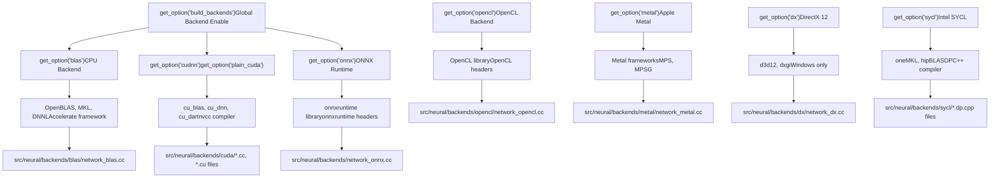
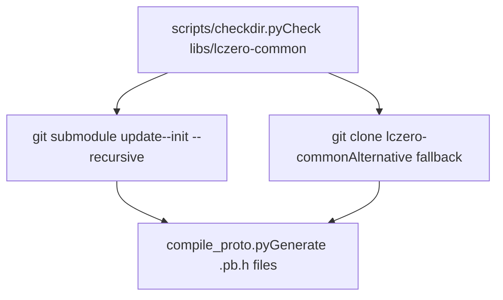
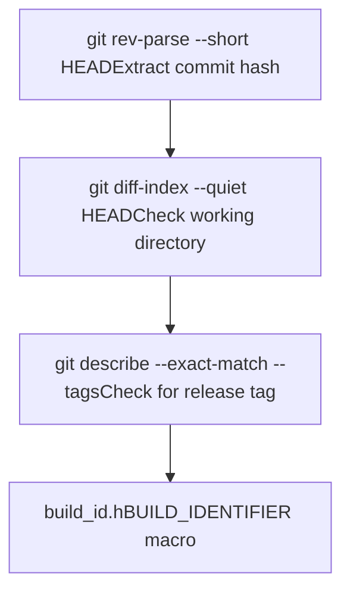

# 构建与安装

相关源文件

-   [CONTRIBUTING.md](https://github.com/LeelaChessZero/lc0/blob/b4e98c19/CONTRIBUTING.md)
-   [README.md](https://github.com/LeelaChessZero/lc0/blob/b4e98c19/README.md)
-   [appveyor.yml](https://github.com/LeelaChessZero/lc0/blob/b4e98c19/appveyor.yml)
-   [install\_openSUSE\_lc0.sh](https://github.com/LeelaChessZero/lc0/blob/b4e98c19/install_openSUSE_lc0.sh)
-   [meson.build](https://github.com/LeelaChessZero/lc0/blob/b4e98c19/meson.build)
-   [meson\_options.txt](https://github.com/LeelaChessZero/lc0/blob/b4e98c19/meson_options.txt)
-   [openSUSE\_install.md](https://github.com/LeelaChessZero/lc0/blob/b4e98c19/openSUSE_install.md)
-   [pyproject.toml](https://github.com/LeelaChessZero/lc0/blob/b4e98c19/pyproject.toml)

本文档提供了在不同平台和后端配置下构建和安装 lc0 (Leela Chess Zero) 的综合指南。它涵盖了 Meson 构建系统架构、依赖管理以及各种可用的神经网络后端。

有关特定平台的详细构建过程，请参阅 [Linux 和 macOS 构建过程](/LeelaChessZero/lc0/2.2-linux-and-macos-build-process) 和 [Windows 构建过程](/LeelaChessZero/lc0/2.3-windows-build-process)。有关底层构建系统机制的信息，请参阅 [构建系统架构](/LeelaChessZero/lc0/2.1-build-system-architecture)。有关发布管理和版本控制的信息，请参阅 [版本管理](/LeelaChessZero/lc0/2.4-version-management)。

## 前置条件与依赖

Lc0 需要几个核心依赖项，必须在构建之前满足这些依赖项：

**核心要求：**

-   兼容 C++20 的编译器（GCC 10+, Clang 12+, 或 Visual Studio 2019 16.11+）
-   Meson 构建系统 (0.55+)
-   Python 3.7+
-   Git（用于子模块管理）
-   至少一个神经网络后端库

**神经网络后端：** 构建系统支持多种用于神经网络推理的后端。必须至少有一个可用：

| 后端类型 | 库 | 平台 | 硬件支持 |
| --- | --- | --- | --- |
| CPU BLAS | OpenBLAS, Intel MKL, DNNL, Accelerate | 所有 | CPU |
| CUDA | CUDA Toolkit, cuDNN (可选) | Linux, Windows | NVIDIA GPU |
| ONNX | ONNX Runtime | 所有 | CPU, GPU, TPU |
| OpenCL | OpenCL | Linux, Windows, macOS | AMD/Intel GPU |
| Metal | Metal Performance Shaders | macOS | Apple GPU |
| DirectX | DirectX 12 | Windows | 兼容 DirectX 的 GPU |
| SYCL | Intel oneAPI DPC++ | Linux, Windows | Intel/AMD GPU |

来源：[meson.build43-47](https://github.com/LeelaChessZero/lc0/blob/b4e98c19/meson.build#L43-L47) [README.md43-47](https://github.com/LeelaChessZero/lc0/blob/b4e98c19/README.md#L43-L47) [meson\_options.txt51-261](https://github.com/LeelaChessZero/lc0/blob/b4e98c19/meson_options.txt#L51-L261)

## 构建系统架构

Lc0 构建系统以 Meson 为中心，具有广泛的后端检测和配置能力：

```mermaid
flowchart TD
    MesonBuild["meson.buildMain Configuration"]
    MesonOptions["meson_options.txtBuild Options"]
    CrossFiles["cross-files/Target Platforms"]
    GitSubmodules["Git Submoduleslczero-common"]
    ProtoCompiler["scripts/compile_proto.pyProtobuf Generation"]
    VersionExtractor["Git Version Extractionbuild_id.h generation"]
    CudaDetection["CUDA/cuDNN Detectionnvcc, libraries"]
    OnnxDetection["ONNX Runtime Detectiononnxruntime libraries"]
    BlasDetection["BLAS Library DetectionOpenBLAS, MKL, DNNL"]
    OtherBackends["Metal, OpenCL, DirectXPlatform-specific"]
    Lc0Binary["lc0 executableMain engine binary"]
    Tests["Test Executablesgtest-based tests"]
    PythonBindings["Python Extensionslczero.backends module"]
    Rescorer["rescorer executableTraining data rescoring"]

    MesonBuild --> GitSubmodules
    MesonBuild --> ProtoCompiler
    MesonBuild --> VersionExtractor
    MesonOptions --> CudaDetection
    MesonOptions --> OnnxDetection
    MesonOptions --> BlasDetection
    MesonOptions --> OtherBackends
    CudaDetection --> Lc0Binary
    OnnxDetection --> Lc0Binary
    BlasDetection --> Lc0Binary
    OtherBackends --> Lc0Binary
    MesonBuild --> Tests
    MesonBuild --> PythonBindings
    MesonBuild --> Rescorer
```


来源：[meson.build17-19](https://github.com/LeelaChessZero/lc0/blob/b4e98c19/meson.build#L17-L19) [meson.build67-83](https://github.com/LeelaChessZero/lc0/blob/b4e98c19/meson.build#L67-L83) [meson.build852-856](https://github.com/LeelaChessZero/lc0/blob/b4e98c19/meson.build#L852-L856)

## 后端选择矩阵

构建系统会自动检测可用的后端，并根据配置选项和库的可用性启用它们：


来源：[meson.build261-777](https://github.com/LeelaChessZero/lc0/blob/b4e98c19/meson.build#L261-L777) [meson\_options.txt46-261](https://github.com/LeelaChessZero/lc0/blob/b4e98c19/meson_options.txt#L46-L261)

## 构建过程概览

标准构建过程遵循以下阶段：

**1\. 子模块初始化** 构建系统自动处理包含共享 Protocol Buffer 定义的 `lczero-common` 子模块：


**2\. 版本检测** 从 git 仓库状态生成构建标识符：


**3\. 后端检测与编译** 对于每个启用的后端，系统会检测库并编译相应的源文件。

来源：[meson.build67-83](https://github.com/LeelaChessZero/lc0/blob/b4e98c19/meson.build#L67-L83) [meson.build92-111](https://github.com/LeelaChessZero/lc0/blob/b4e98c19/meson.build#L92-L111) [meson.build261-777](https://github.com/LeelaChessZero/lc0/blob/b4e98c19/meson.build#L261-L777)

## 平台特定注意事项

**Linux/macOS:**

-   使用标准 Unix 构建工具和库检测
-   支持通过包管理器安装的依赖项
-   通过 CircleCI 进行自动化 CI

**Windows:**

-   需要 Visual Studio 2019+
-   使用 AppVeyor 进行持续集成
-   对 MSVC 运行时链接进行特殊处理
-   基于 PowerShell 的构建脚本

**交叉编译：**

-   通过 NDK 支持 Android 交叉编译
-   支持 ARM/AArch64 目标
-   `cross-files/` 目录中的交叉文件配置

来源：[meson.build237-241](https://github.com/LeelaChessZero/lc0/blob/b4e98c19/meson.build#L237-L241) [appveyor.yml1-192](https://github.com/LeelaChessZero/lc0/blob/b4e98c19/appveyor.yml#L1-L192) [README.md83-105](https://github.com/LeelaChessZero/lc0/blob/b4e98c19/README.md#L83-L105)

## 安装方法

**本地开发构建：**

```
meson setup builddir
ninja -C builddir lc0
```
**系统安装：**

```
meson setup builddir --prefix=/usr/local
ninja -C builddir install
```
**Python 绑定：**

```
pip install --user git+https://github.com/LeelaChessZero/lc0.git
```
**包分发：**

-   Windows: 包含依赖项的 ZIP 归档
-   Linux: 特定于发行版的包
-   macOS: 通用二进制文件 (Universal binaries)
-   Android: APK 包

来源：[meson.build852-856](https://github.com/LeelaChessZero/lc0/blob/b4e98c19/meson.build#L852-L856) [appveyor.yml154-181](https://github.com/LeelaChessZero/lc0/blob/b4e98c19/appveyor.yml#L154-L181) [pyproject.toml1-27](https://github.com/LeelaChessZero/lc0/blob/b4e98c19/pyproject.toml#L1-L27)

## 构建验证

构建系统包含通过 Google Test 框架进行的全面测试：

**测试类别：**

-   `ChessBoard` - 棋盘表示和走法生成
-   `Position` - 游戏状态管理
-   `Encoder` - 神经网络输入编码
-   `OptionsParser` - 配置系统
-   `Syzygy` - 残局库集成

**后端基准测试：** `backendbench` 工具提供了性能测量功能，用于比较不同的神经网络后端。

来源：[meson.build873-914](https://github.com/LeelaChessZero/lc0/blob/b4e98c19/meson.build#L873-L914) [meson.build216-217](https://github.com/LeelaChessZero/lc0/blob/b4e98c19/meson.build#L216-L217)
