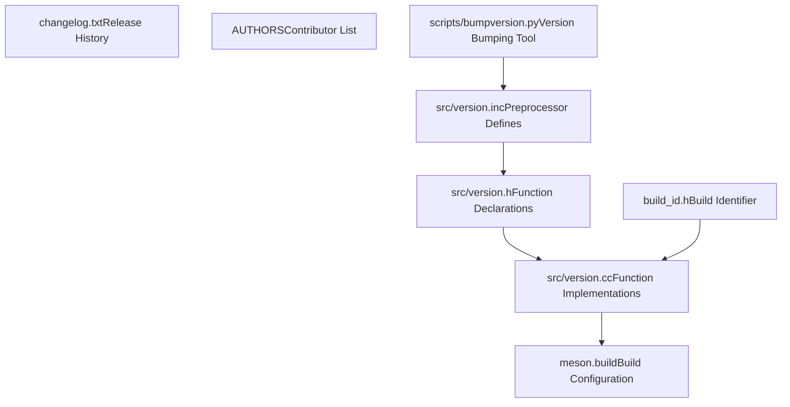
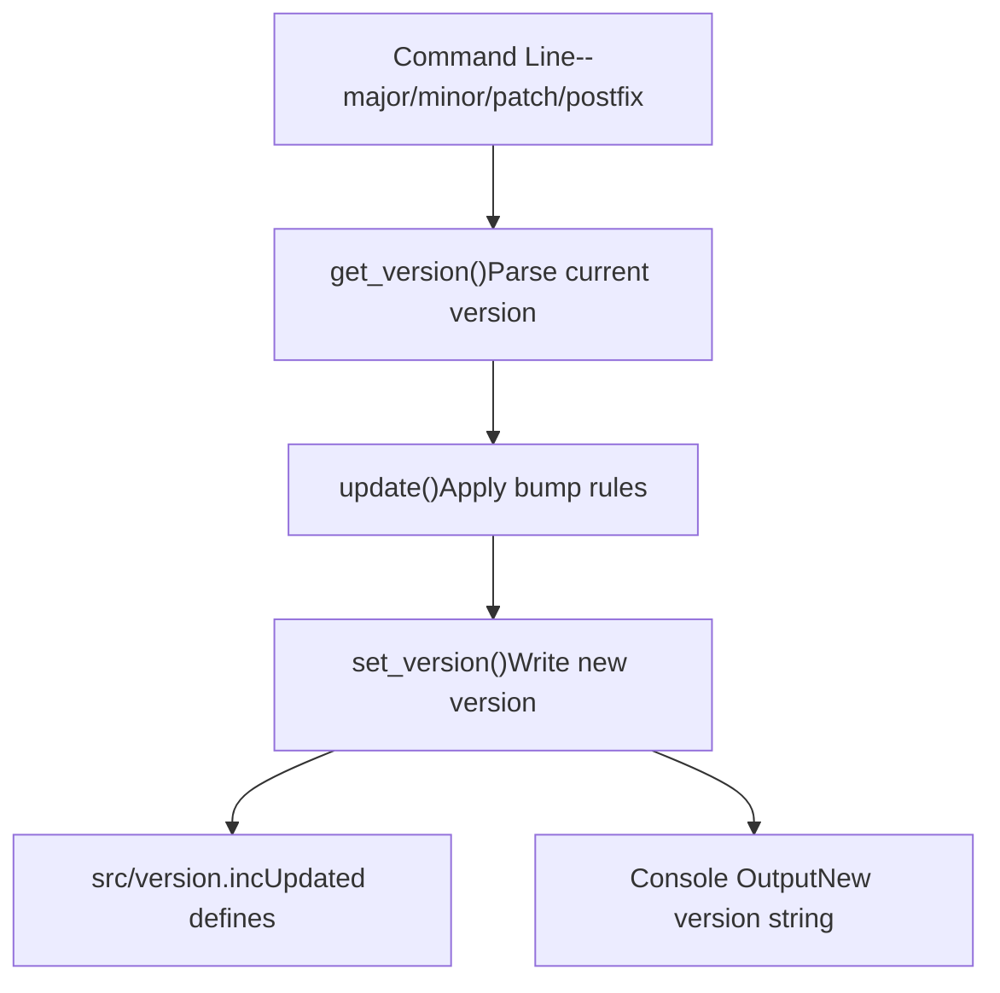
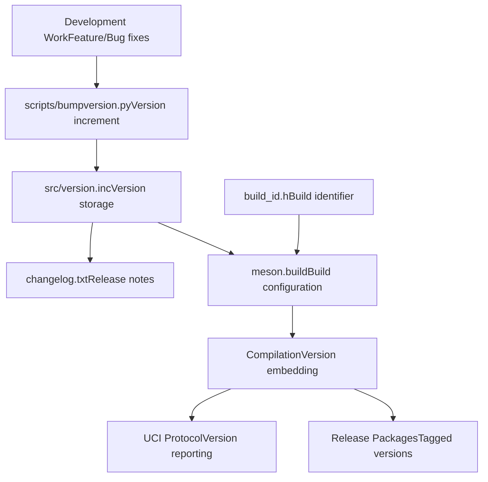

# 版本管理

相关源文件

-   [AUTHORS](https://github.com/LeelaChessZero/lc0/blob/b4e98c19/AUTHORS)
-   [changelog.txt](https://github.com/LeelaChessZero/lc0/blob/b4e98c19/changelog.txt)
-   [scripts/bumpversion.py](https://github.com/LeelaChessZero/lc0/blob/b4e98c19/scripts/bumpversion.py)
-   [src/version.cc](https://github.com/LeelaChessZero/lc0/blob/b4e98c19/src/version.cc)
-   [src/version.h](https://github.com/LeelaChessZero/lc0/blob/b4e98c19/src/version.h)
-   [src/version.inc](https://github.com/LeelaChessZero/lc0/blob/b4e98c19/src/version.inc)

本文档涵盖了 lc0 中的版本管理系统，包括版本存储、自动版本更新、更新日志维护和发布流程。该系统遵循语义化版本控制原则，并提供了用于管理开发、候选发布和稳定版本的工具。

有关构建系统和发布打包的信息，请参阅 [构建系统架构](/LeelaChessZero/lc0/2.1-build-system-architecture) 和 [Windows 构建过程](/LeelaChessZero/lc0/2.3-windows-build-process)。

## 版本存储与格式

lc0 版本管理系统遵循 [语义化版本控制](https://semver.org/) 标准，使用 主版本.次版本.补丁版本 编号以及用于开发和候选发布版本的可选后缀标识符。

### 核心版本定义

版本信息使用 C 预处理器宏集中存储在 [src/version.inc1-4](https://github.com/LeelaChessZero/lc0/blob/b4e98c19/src/version.inc#L1-L4) 中：

```
#define LC0_VERSION_MAJOR 0
#define LC0_VERSION_MINOR 33
#define LC0_VERSION_PATCH 0
#define LC0_VERSION_POSTFIX "dev"
```
这种方法允许在编译时将版本嵌入到整个代码库中。后缀字段支持开发标记（如 "dev"）和候选发布标识符（如 "rc1", "rc2"）。

### 版本实用函数

[src/version.h37-45](https://github.com/LeelaChessZero/lc0/blob/b4e98c19/src/version.h#L37-L45) 和 [src/version.cc29-41](https://github.com/LeelaChessZero/lc0/blob/b4e98c19/src/version.cc#L29-L41) 文件提供了用于版本处理的实用函数：

-   `GetVersionInt()` - 使用公式 `major * 1000000 + minor * 1000 + patch` 将版本转换为整数格式
-   `GetVersionStr()` - 将版本格式化为带有可选后缀和构建标识符的字符串

字符串格式遵循模式：`major.minor.patch[-postfix][+build_id]`

**版本管理架构**


来源：[src/version.inc1-4](https://github.com/LeelaChessZero/lc0/blob/b4e98c19/src/version.inc#L1-L4) [src/version.h37-45](https://github.com/LeelaChessZero/lc0/blob/b4e98c19/src/version.h#L37-L45) [src/version.cc29-41](https://github.com/LeelaChessZero/lc0/blob/b4e98c19/src/version.cc#L29-L41) [scripts/bumpversion.py7-33](https://github.com/LeelaChessZero/lc0/blob/b4e98c19/scripts/bumpversion.py#L7-L33)

## 自动版本更新 (Automated Version Bumping)

[scripts/bumpversion.py1-80](https://github.com/LeelaChessZero/lc0/blob/b4e98c19/scripts/bumpversion.py#L1-L80) 脚本提供了支持语义化版本控制规则的自动版本管理。

### 版本更新操作

该脚本支持四种主要操作：

| 操作 | 效果 | 重置规则 |
| --- | --- | --- |
| `--major` | 增加主版本号 | 重置 minor=0, patch=0, postfix="" |
| `--minor` | 增加次版本号 | 重置 patch=0, postfix="" |
| `--patch` | 增加补丁版本号 | 重置 postfix="" |
| `--postfix` | 设置版本后缀 | 保持 major.minor.patch 不变 |

### 版本读写

该脚本通过文件 I/O 操作实现版本持久化：

-   `get_version()` [scripts/bumpversion.py17-25](https://github.com/LeelaChessZero/lc0/blob/b4e98c19/scripts/bumpversion.py#L17-L25) - 从 `version.inc` 解析当前版本
-   `set_version()` [scripts/bumpversion.py28-32](https://github.com/LeelaChessZero/lc0/blob/b4e98c19/scripts/bumpversion.py#L28-L32) - 将新版本写入 `version.inc`
-   使用 `VERSION_CONTENT` 格式字符串生成基于模板的内容

**版本更新工作流**


来源：[scripts/bumpversion.py17-32](https://github.com/LeelaChessZero/lc0/blob/b4e98c19/scripts/bumpversion.py#L17-L32) [scripts/bumpversion.py39-65](https://github.com/LeelaChessZero/lc0/blob/b4e98c19/scripts/bumpversion.py#L39-L65)

## 更新日志系统

[changelog.txt1-856](https://github.com/LeelaChessZero/lc0/blob/b4e98c19/changelog.txt#L1-L856) 文件为每个版本维护了遵循结构化格式的全面发布文档。

### 更新日志格式

每个发布条目遵循以下模式：

```
v{major}.{minor}.{patch}[-postfix] (YYYY-MM-DD)
~~~~~~~
* Feature/fix description
* Another change description
...
```
候选发布版本使用后缀格式：`v0.32.0-rc2`, `v0.32.0-rc1` 等。

### 发布类别

更新日志跟踪多种类型的发布：

-   **稳定发布 (Stable releases)**: `v0.32.0`, `v0.31.2` - 生产就绪版本
-   **候选发布 (Release candidates)**: `v0.32.0-rc2`, `v0.31.0-rc1` - 发布前测试版本
-   **开发版本 (Development versions)**: 在 version.inc 中通过 "dev" 后缀指示

### 变更文档

每个更新日志条目记录：

-   后端改进和新后端支持
-   搜索算法修改
-   神经网络架构更新
-   构建系统变更
-   错误修复和性能优化
-   破坏性变更和迁移说明

**发布时间线结构**

> **[Mermaid timeline]**
> *(图表结构无法解析)*

来源：[changelog.txt1-65](https://github.com/LeelaChessZero/lc0/blob/b4e98c19/changelog.txt#L1-L65) [changelog.txt66-143](https://github.com/LeelaChessZero/lc0/blob/b4e98c19/changelog.txt#L66-L143) [changelog.txt144-187](https://github.com/LeelaChessZero/lc0/blob/b4e98c19/changelog.txt#L144-L187)

## 发布流程集成

版本管理系统与持续集成和构建流程集成，以确所有分发包的版本一致性。

### 构建标识符集成

[src/version.h35](https://github.com/LeelaChessZero/lc0/blob/b4e98c19/src/version.h#L35-L35) 包含 `build_id.h`，它提供了版本字符串中使用的 `BUILD_IDENTIFIER`。这允许构建包含 git 提交哈希或其他构建特定信息。

### UCI 中的版本显示

版本信息通过 UCI (通用国际象棋接口) 协议公开，允许国际象棋 GUI 显示确切的 lc0 版本。[src/version.cc33-41](https://github.com/LeelaChessZero/lc0/blob/b4e98c19/src/version.cc#L33-L41) 中的 `GetVersionStr()` 函数格式化包含构建标识符的完整版本字符串。

### 发布验证

更新日志作为发布验证的权威来源，每个版本需要：

-   详细的功能和错误修复文档
-   发布日期规范
-   破坏性变更的迁移说明
-   性能和兼容性信息

**版本集成流程**


来源：[src/version.h34-45](https://github.com/LeelaChessZero/lc0/blob/b4e98c19/src/version.h#L34-L45) [src/version.cc33-41](https://github.com/LeelaChessZero/lc0/blob/b4e98c19/src/version.cc#L33-L41) [changelog.txt1-856](https://github.com/LeelaChessZero/lc0/blob/b4e98c19/changelog.txt#L1-L856)
