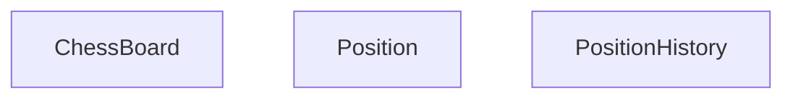
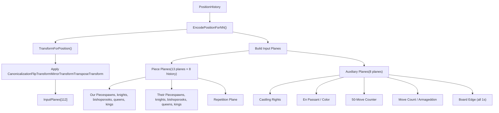
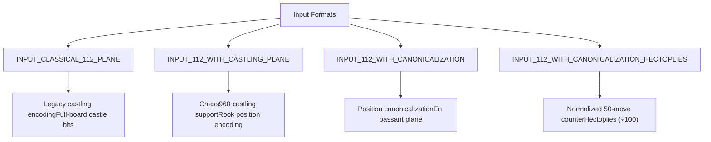
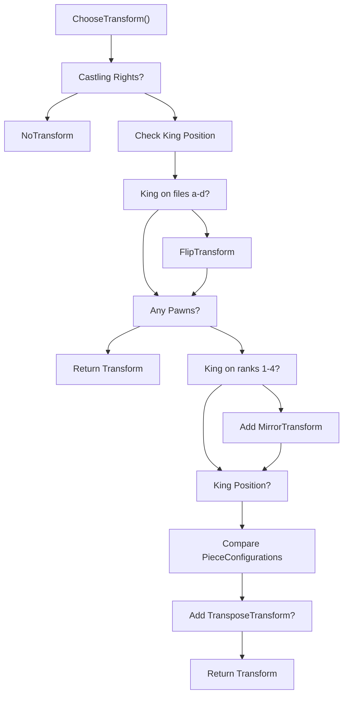

# 局面编码与历史

相关源文件

-   [src/chess/board.cc](https://github.com/LeelaChessZero/lc0/blob/b4e98c19/src/chess/board.cc)
-   [src/chess/board.h](https://github.com/LeelaChessZero/lc0/blob/b4e98c19/src/chess/board.h)
-   [src/chess/board\_test.cc](https://github.com/LeelaChessZero/lc0/blob/b4e98c19/src/chess/board_test.cc)
-   [src/chess/position.cc](https://github.com/LeelaChessZero/lc0/blob/b4e98c19/src/chess/position.cc)
-   [src/chess/position.h](https://github.com/LeelaChessZero/lc0/blob/b4e98c19/src/chess/position.h)
-   [src/chess/position\_test.cc](https://github.com/LeelaChessZero/lc0/blob/b4e98c19/src/chess/position_test.cc)
-   [src/neural/encoder.cc](https://github.com/LeelaChessZero/lc0/blob/b4e98c19/src/neural/encoder.cc)
-   [src/neural/encoder.h](https://github.com/LeelaChessZero/lc0/blob/b4e98c19/src/neural/encoder.h)
-   [src/neural/encoder\_test.cc](https://github.com/LeelaChessZero/lc0/blob/b4e98c19/src/neural/encoder_test.cc)

## 目的与范围

本文档涵盖了 Leela Chess Zero 中如何表示、管理和为神经网络推理编码国际象棋局面。它包括核心局面表示类、对局历史跟踪以及将国际象棋局面转换为神经网络所需的 112 平面输入格式的编码流水线。

有关神经网络架构本身的信息，请参阅 [神经网络系统](/LeelaChessZero/lc0/6-neural-network-system)。有关走法生成和国际象棋规则实现的详细信息，请参阅 [位棋盘与走法生成](/LeelaChessZero/lc0/4.1-bitboards-and-move-generation)。

## 核心局面表示

局面编码系统围绕三个主要类构建，它们协同工作以表示国际象棋游戏状态：

**来源：** [src/chess/board.h59-254](https://github.com/LeelaChessZero/lc0/blob/b4e98c19/src/chess/board.h#L59-L254) [src/chess/position.h38-91](https://github.com/LeelaChessZero/lc0/blob/b4e98c19/src/chess/position.h#L38-L91) [src/chess/position.h99-159](https://github.com/LeelaChessZero/lc0/blob/b4e98c19/src/chess/position.h#L99-L159)

### ChessBoard 类

`ChessBoard` 类使用位棋盘表示基础棋盘状态，以实现高效的棋子表示。关键特征：

-   **玩家视角**: 始终从当前行棋玩家的视角表示局面
-   **镜像**: 黑方局面被镜像，因此黑方棋子出现在第 1-2 行而不是第 7-8 行
-   **位棋盘存储**: 使用独立的位棋盘存储棋子类型 (`rooks_`, `bishops_`, `pawns_`) 和颜色 (`our_pieces_`, `their_pieces_`)
-   **王车易位权**: 通过支持 Chess960 的 `Castlings` 类跟踪王车易位的可用性

**来源：** [src/chess/board.h59-254](https://github.com/LeelaChessZero/lc0/blob/b4e98c19/src/chess/board.h#L59-L254) [src/chess/board.cc54-68](https://github.com/LeelaChessZero/lc0/blob/b4e98c19/src/chess/board.cc#L54-L68)

### Position 类

`Position` 类包装了 `ChessBoard` 并添加了额外的游戏元数据：

-   **Rule50 计数器**: 跟踪自上次吃子或兵移动以来的半步数，用于 50 回合规则
-   **重复跟踪**: 计算局面重复和循环长度，用于三次重复规则
-   **对局层数 (Ply)**: 自对局开始以来的总半步数
-   **哈希函数**: 提供用于局面比较的唯一哈希

**来源：** [src/chess/position.h38-91](https://github.com/LeelaChessZero/lc0/blob/b4e98c19/src/chess/position.h#L38-L91) [src/chess/position.cc40-61](https://github.com/LeelaChessZero/lc0/blob/b4e98c19/src/chess/position.cc#L40-L61)

### PositionHistory 类

`PositionHistory` 类管理对局中完整的局面序列：

-   **走法应用**: 通过将走法应用到最后一个局面来追加新局面
-   **重复检测**: 添加走法时自动计算重复
-   **对局终止**: 根据局面历史确定和局/胜利条件
-   **哈希计算**: 提供近期局面的滚动哈希

**来源：** [src/chess/position.h99-159](https://github.com/LeelaChessZero/lc0/blob/b4e98c19/src/chess/position.h#L99-L159) [src/chess/position.cc105-149](https://github.com/LeelaChessZero/lc0/blob/b4e98c19/src/chess/position.cc#L105-L149)

## 神经网络编码流水线

编码系统将国际象棋局面转换为神经网络所需的 112 平面输入格式：

**来源：** [src/neural/encoder.cc134-336](https://github.com/LeelaChessZero/lc0/blob/b4e98c19/src/neural/encoder.cc#L134-L336) [src/neural/encoder.h48-57](https://github.com/LeelaChessZero/lc0/blob/b4e98c19/src/neural/encoder.h#L48-L57)

### 输入平面结构

112 平面输入格式包括：

| 平面范围 | 描述 | 内容 |
| --- | --- | --- |
| 0-103 | 局面历史 | 8 个局面 × 每个 13 个平面 |
| 104-111 | 辅助数据 | 王车易位、吃过路兵、计数器 |

8 个历史局面中的每一个都使用 13 个平面：

-   平面 0-5: 我方棋子（兵、马、象、车、后、王）
-   平面 6-11: 对方棋子（兵、马、象、车、后、王）
-   平面 12: 重复指示器

**来源：** [src/neural/encoder.h38-40](https://github.com/LeelaChessZero/lc0/blob/b4e98c19/src/neural/encoder.h#L38-L40) [src/neural/encoder.cc275-290](https://github.com/LeelaChessZero/lc0/blob/b4e98c19/src/neural/encoder.cc#L275-L290)

### 编码格式

支持多种用于不同网络架构的输入格式：

**来源：** [src/neural/encoder.cc154-208](https://github.com/LeelaChessZero/lc0/blob/b4e98c19/src/neural/encoder.cc#L154-L208) [src/neural/encoder.h59-63](https://github.com/LeelaChessZero/lc0/blob/b4e98c19/src/neural/encoder.h#L59-L63)

## 局面规范化 (Canonicalization)

对于规范化输入格式，局面经过几何变换以减少输入空间：

### 变换选择逻辑

**来源：** [src/neural/encoder.cc50-102](https://github.com/LeelaChessZero/lc0/blob/b4e98c19/src/neural/encoder.cc#L50-L102) [src/neural/encoder.cc309-325](https://github.com/LeelaChessZero/lc0/blob/b4e98c19/src/neural/encoder.cc#L309-L325)

### 变换类型

系统最多应用三种几何变换：

-   **FlipTransform**: 水平翻转（a 列↔h 列, b 列↔g 列 等）
-   **MirrorTransform**: 垂直翻转（1 行↔8 行, 2 行↔7 行 等）
-   **TransposeTransform**: 对角线转置（列变成行）

这些变换在保留国际象棋语义的同时减少了有效输入空间，提高了训练效率。

**来源：** [src/neural/encoder.cc314-323](https://github.com/LeelaChessZero/lc0/blob/b4e98c19/src/neural/encoder.cc#L314-L323)

## 历史管理与重复检测

系统实现了复杂的重复检测以确定和局：

### 重复检测算法

> **[Mermaid sequence]**
> *(图表结构无法解析)*

**来源：** [src/chess/position.cc105-130](https://github.com/LeelaChessZero/lc0/blob/b4e98c19/src/chess/position.cc#L105-L130) [src/chess/position.h114-151](https://github.com/LeelaChessZero/lc0/blob/b4e98c19/src/chess/position.h#L114-L151)

### 游戏状态跟踪

局面历史跟踪多个游戏状态指标：

-   **50 回合规则**: 吃子和兵移动时自动重置
-   **三次重复**: 具有相同行棋方的确切局面匹配
-   **和局检测**: 材力不足、逼和、重复、50 回合规则
-   **循环长度**: 重复局面之间的距离

**来源：** [src/chess/position.cc75-92](https://github.com/LeelaChessZero/lc0/blob/b4e98c19/src/chess/position.cc#L75-L92) [src/chess/position.cc115-130](https://github.com/LeelaChessZero/lc0/blob/b4e98c19/src/chess/position.cc#L115-L130)

## 实现细节

### 内存与性能

编码系统针对神经网络批处理进行了优化：

-   **位棋盘操作**: 使用位运算进行高效的棋子查询
-   **平面重用**: 输入平面使用掩码和值来最小化内存分配
-   **变换缓存**: 变换计算一次并应用于所有平面
-   **历史限制**: 固定的 8 局面历史防止无界增长

**来源：** [src/neural/encoder.cc309-327](https://github.com/LeelaChessZero/lc0/blob/b4e98c19/src/neural/encoder.cc#L309-L327) [src/chess/board.cc429-573](https://github.com/LeelaChessZero/lc0/blob/b4e98c19/src/chess/board.cc#L429-L573)

### FEN 集成

系统提供无缝的 FEN (福斯-爱德华兹记号法) 集成：

-   **FEN 解析**: `ChessBoard::SetFromFen()` 处理标准和部分 FEN 字符串
-   **FEN 生成**: `PositionToFen()` 以标准格式导出局面
-   **元数据保留**: Rule50 层数和走法计数器通过 FEN 往返保留

**来源：** [src/chess/board.cc948-1103](https://github.com/LeelaChessZero/lc0/blob/b4e98c19/src/chess/board.cc#L948-L1103) [src/chess/position.cc151-157](https://github.com/LeelaChessZero/lc0/blob/b4e98c19/src/chess/position.cc#L151-L157)
