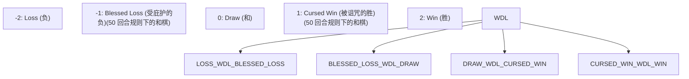
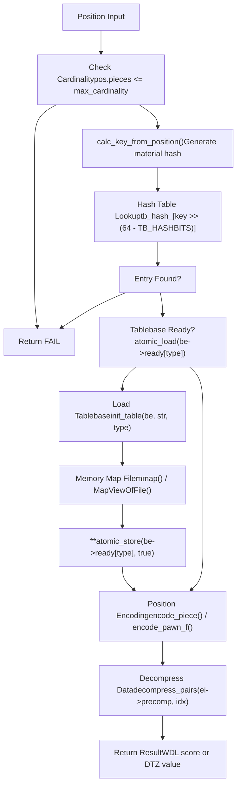
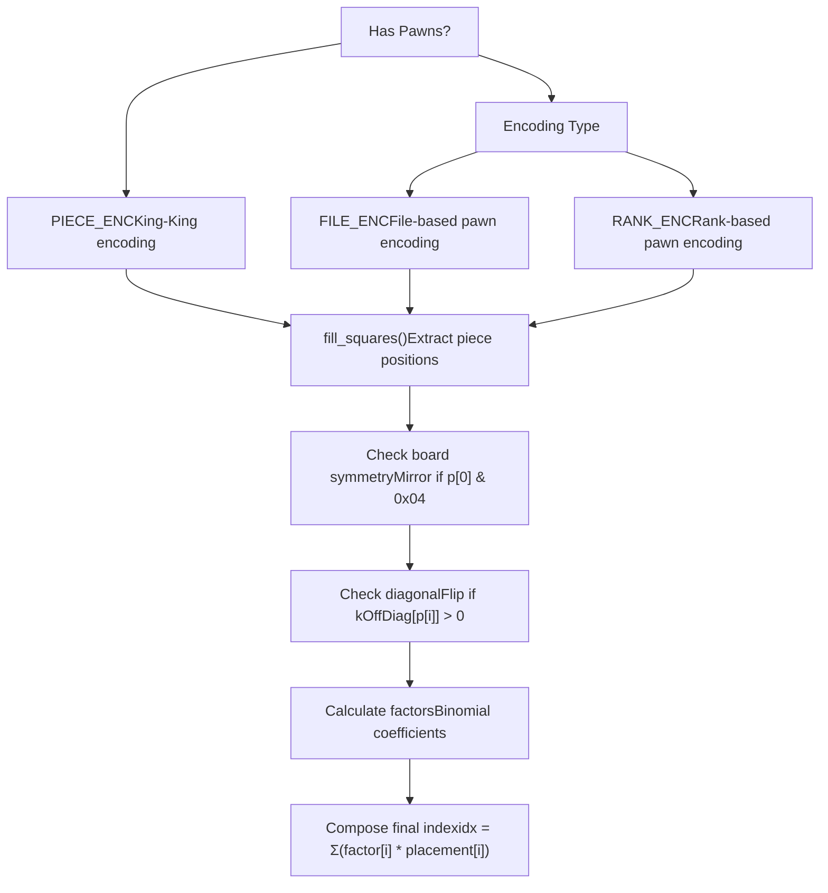
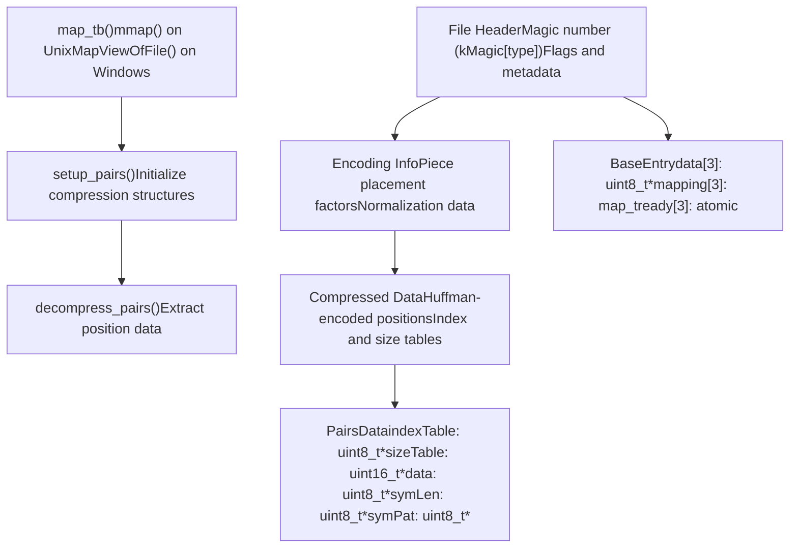

# Syzygy 残局库集成

相关源文件

-   [src/chess/bitboard.h](https://github.com/LeelaChessZero/lc0/blob/b4e98c19/src/chess/bitboard.h)
-   [src/syzygy/syzygy.cc](https://github.com/LeelaChessZero/lc0/blob/b4e98c19/src/syzygy/syzygy.cc)
-   [src/syzygy/syzygy.h](https://github.com/LeelaChessZero/lc0/blob/b4e98c19/src/syzygy/syzygy.h)
-   [src/syzygy/syzygy\_test.cc](https://github.com/LeelaChessZero/lc0/blob/b4e98c19/src/syzygy/syzygy_test.cc)
-   [src/utils/bititer.h](https://github.com/LeelaChessZero/lc0/blob/b4e98c19/src/utils/bititer.h)

本文档涵盖了 Leela Chess Zero 中的 Syzygy 残局库集成，包括 WDL 和 DTZ 探测、局面编码、文件管理以及与搜索系统的集成。有关棋局表示本身的信息，请参阅 [棋局表示](/LeelaChessZero/lc0/4-chess-representation)。有关使用残局库探测的搜索算法的详细信息，请参阅 [搜索算法](/LeelaChessZero/lc0/5-search-algorithm)。

## 概览

Syzygy 残局库是压缩的残局数据库，为具有有限数量棋子的局面提供完美的博弈信息。lc0 集成支持 WDL（胜/和/负）和 DTZ（归零距离）残局库格式，使引擎在残局库文件可用时能够以完美的准确性进行残局博弈。

该系统使用内存映射文件访问来实现高效的残局库读取，使用复杂的局面编码方案来最小化存储需求，并使用线程安全的探测操作与蒙特卡洛树搜索无缝集成。

来源：[src/syzygy/syzygy.h1-113](https://github.com/LeelaChessZero/lc0/blob/b4e98c19/src/syzygy/syzygy.h#L1-L113) [src/syzygy/syzygy.cc1-100](https://github.com/LeelaChessZero/lc0/blob/b4e98c19/src/syzygy/syzygy.cc#L1-L100)

## 主要接口

`SyzygyTablebase` 类提供了残局库操作的主要接口。它遵循 PIMPL（指向实现的指针）模式，实际实现隐藏在 `SyzygyTablebaseImpl` 中。

来源：[src/syzygy/syzygy.h58-111](https://github.com/LeelaChessZero/lc0/blob/b4e98c19/src/syzygy/syzygy.h#L58-L111) [src/syzygy/syzygy.cc865-1008](https://github.com/LeelaChessZero/lc0/blob/b4e98c19/src/syzygy/syzygy.cc#L865-L1008) [src/syzygy/syzygy.cc131-165](https://github.com/LeelaChessZero/lc0/blob/b4e98c19/src/syzygy/syzygy.cc#L131-L165)

## 残局库类型与评分

该系统支持三种类型的残局库文件，每种文件在残局评估中服务于不同的目的：

| 类型 | 扩展名 | 目的 | 值范围 |
| --- | --- | --- | --- |
| WDL | `.rtbw` | 胜/和/负评估 | WDL\_LOSS (-2) 到 WDL\_WIN (2) |
| DTM | `.rtbm` | 距离杀棋的步数 (Distance to Mate) | 杀棋/被杀的层数 |
| DTZ | `.rtbz` | 归零距离 (Distance to Zeroing move) | 兵移动/吃子的层数 |

`WDLScore` 枚举包括针对 50 回合规则的特殊情况：

来源：[src/syzygy/syzygy.h40-54](https://github.com/LeelaChessZero/lc0/blob/b4e98c19/src/syzygy/syzygy.h#L40-L54) [src/syzygy/syzygy.cc81-83](https://github.com/LeelaChessZero/lc0/blob/b4e98c19/src/syzygy/syzygy.cc#L81-L83) [src/syzygy/syzygy.cc172-177](https://github.com/LeelaChessZero/lc0/blob/b4e98c19/src/syzygy/syzygy.cc#L172-L177)

## 探测工作流

残局库探测过程遵循结构化的工作流，处理局面编码、文件访问和结果解释：

来源：[src/syzygy/syzygy.cc1327-1443](https://github.com/LeelaChessZero/lc0/blob/b4e98c19/src/syzygy/syzygy.cc#L1327-L1443) [src/syzygy/syzygy.cc1041-1087](https://github.com/LeelaChessZero/lc0/blob/b4e98c19/src/syzygy/syzygy.cc#L1041-L1087) [src/syzygy/syzygy.cc1188-1325](https://github.com/LeelaChessZero/lc0/blob/b4e98c19/src/syzygy/syzygy.cc#L1188-L1325)

## 局面编码系统

残局库系统使用复杂的局面编码将天文数字般的可能国际象棋局面压缩为可管理的索引：

编码函数处理不同的棋子配置：

-   `encode_piece()` 用于没有兵的无兵残局
-   `encode_pawn_f()` 用于基于列 (file-based) 编码的兵残局
-   `encode_pawn_r()` 用于基于行 (rank-based) 编码的兵残局

来源：[src/syzygy/syzygy.cc490-601](https://github.com/LeelaChessZero/lc0/blob/b4e98c19/src/syzygy/syzygy.cc#L490-L601) [src/syzygy/syzygy.cc851-861](https://github.com/LeelaChessZero/lc0/blob/b4e98c19/src/syzygy/syzygy.cc#L851-L861) [src/syzygy/syzygy.cc1395-1416](https://github.com/LeelaChessZero/lc0/blob/b4e98c19/src/syzygy/syzygy.cc#L1395-L1416)

## 文件管理与压缩

系统通过内存映射管理残局库文件，并使用基于类霍夫曼 (Huffman-like) 编码的复杂压缩：

来源：[src/syzygy/syzygy.cc1041-1096](https://github.com/LeelaChessZero/lc0/blob/b4e98c19/src/syzygy/syzygy.cc#L1041-L1096) [src/syzygy/syzygy.cc723-781](https://github.com/LeelaChessZero/lc0/blob/b4e98c19/src/syzygy/syzygy.cc#L723-L781) [src/syzygy/syzygy.cc783-845](https://github.com/LeelaChessZero/lc0/blob/b4e98c19/src/syzygy/syzygy.cc#L783-L845) [src/syzygy/syzygy.cc110-122](https://github.com/LeelaChessZero/lc0/blob/b4e98c19/src/syzygy/syzygy.cc#L110-L122)

## 与搜索系统集成

残局库系统通过几个关键接口与搜索算法集成，提供局面评估和走法过滤：

> **[Mermaid sequence]**
> *(图表结构无法解析)*

关键集成点：

-   `max_cardinality()` 确定残局库是否可以处理该局面
-   `probe_wdl()` 为终局局面提供精确评估
-   `root_probe()` 过滤走法以保持最佳博弈
-   线程安全设计允许在并行搜索期间进行并发探测

来源：[src/syzygy/syzygy.h91-99](https://github.com/LeelaChessZero/lc0/blob/b4e98c19/src/syzygy/syzygy.h#L91-L99) [src/syzygy/syzygy.cc1012-1022](https://github.com/LeelaChessZero/lc0/blob/b4e98c19/src/syzygy/syzygy.cc#L1012-L1022) [src/syzygy/syzygy\_test.cc39-77](https://github.com/LeelaChessZero/lc0/blob/b4e98c19/src/syzygy/syzygy_test.cc#L39-L77)
