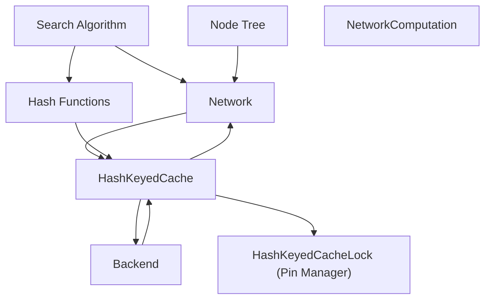
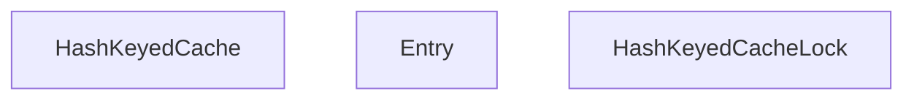

# 缓存系统

相关源文件

-   [build.sh](https://github.com/LeelaChessZero/lc0/blob/b4e98c19/build.sh)
-   [src/utils/cache-old.h](https://github.com/LeelaChessZero/lc0/blob/b4e98c19/src/utils/cache-old.h)
-   [src/utils/cache.h](https://github.com/LeelaChessZero/lc0/blob/b4e98c19/src/utils/cache.h)
-   [src/utils/hashcat.h](https://github.com/LeelaChessZero/lc0/blob/b4e98c19/src/utils/hashcat.h)
-   [src/utils/hashcat\_test.cc](https://github.com/LeelaChessZero/lc0/blob/b4e98c19/src/utils/hashcat_test.cc)

## 目的与范围

Leela Chess Zero (lc0) 中的缓存系统通过存储和重用昂贵的计算结果来提高性能。本文档涵盖了 `HashKeyedCache` 模板类的实现和使用，它是 lc0 中的主要缓存机制。缓存对于神经网络系统尤为重要，它显著减少了多余的局面评估。

有关神经网络系统本身的信息，请参阅 [神经网络系统](/LeelaChessZero/lc0/6-neural-network-system)。

来源：[src/utils/cache.h39-329](https://github.com/LeelaChessZero/lc0/blob/b4e98c19/src/utils/cache.h#L39-L329)

## 缓存系统概览

lc0 中的缓存系统设计为：

-   **线程安全**: 多个线程可以安全地并发访问缓存
-   **基于哈希**: 使用 64 位哈希键进行高效查找
-   **内存管理**: 实现固定 (pinning) 机制以安全地处理缓存值
-   **FIFO 驱逐**: 使用先进先出策略进行缓存驱逐


**图表：缓存系统集成**

来源：[src/utils/cache.h39-329](https://github.com/LeelaChessZero/lc0/blob/b4e98c19/src/utils/cache.h#L39-L329) [src/utils/hashcat.h32-53](https://github.com/LeelaChessZero/lc0/blob/b4e98c19/src/utils/hashcat.h#L32-L53)

## 核心缓存组件

缓存系统由两个主要组件组成：

1.  `HashKeyedCache<V>`: 主要缓存模板类，存储由 64 位哈希键索引的类型为 `V` 的值
2.  `HashKeyedCacheLock<V>`: 一个便利类，用于管理缓存项的固定 (pinning) 和取消固定 (unpinning)

### HashKeyedCache

`HashKeyedCache` 实现为具有开放寻址的哈希表，并使用双端队列跟踪插入顺序以进行 FIFO 驱逐。


**图表：缓存类结构**

来源：[src/utils/cache.h49-285](https://github.com/LeelaChessZero/lc0/blob/b4e98c19/src/utils/cache.h#L49-L285) [src/utils/cache.h288-327](https://github.com/LeelaChessZero/lc0/blob/b4e98c19/src/utils/cache.h#L288-L327)

## 缓存操作

### 插入与查找

缓存提供两个主要操作：

1.  **插入**: 将具有特定键的新值添加到缓存
2.  **查找**: 根据键在缓存中查找值

当缓存达到容量时，最旧的项目首先被驱逐（FIFO 策略）。

> **[Mermaid sequence]**
> *(图表结构无法解析)*

**图表：缓存操作流程**

来源：[src/utils/cache.h64-129](https://github.com/LeelaChessZero/lc0/blob/b4e98c19/src/utils/cache.h#L64-L129) [src/utils/cache.h288-321](https://github.com/LeelaChessZero/lc0/blob/b4e98c19/src/utils/cache.h#L288-L321)

## 固定 (Pinning) 机制

缓存使用固定机制来安全地管理内存。当一个值被访问时，它被“固定”在缓存中，以防止即使它通常会被驱逐的情况下被删除。当客户端使用完该值后，它被“取消固定”。

### 为什么需要固定

缓存拥有所有插入值的所有权（使用 `std::unique_ptr`）。当需要访问一个值时，必须将其固定以防止它在使用时被删除。使用后，必须取消固定以允许缓存在需要时最终删除它。

### HashKeyedCacheLock

`HashKeyedCacheLock` 类使用 RAII (资源获取即初始化) 自动执行此固定/取消固定过程，类似于 `std::lock_guard` 对互斥锁的工作方式。

```
// Example usage of HashKeyedCacheLock
HashKeyedCacheLock<MyValue> lock(&cache, key);
if (lock) {  // Check if the key was found
    // Use the value through the lock
    lock->DoSomething();
    // No need to manually unpin - will be done automatically when lock goes out of scope
}
```
来源：[src/utils/cache.h110-161](https://github.com/LeelaChessZero/lc0/blob/b4e98c19/src/utils/cache.h#L110-L161) [src/utils/cache.h288-327](https://github.com/LeelaChessZero/lc0/blob/b4e98c19/src/utils/cache.h#L288-L327)

## 缓存实现细节

### 哈希表结构

缓存使用带有线性探测的开放寻址来解决冲突。哈希表大小根据容量和 1.9 的负载因子确定。

```
hash_table_size = capacity * 1.9 + 1
```
当从哈希表中移除项目时，实现会处理“空洞”，可能会移动后续项目以保持高效查找。

### 驱逐策略

缓存使用严格的 FIFO (先进先出) 驱逐策略：

1.  插入顺序在 `std::deque` 中跟踪
2.  当需要驱逐时，从双端队列的前端移除项目
3.  将被驱逐的固定项目移动到“已驱逐”列表，而不是立即删除
4.  当“已驱逐”列表中的项目被取消固定时，它们被删除

来源：[src/utils/cache.h213-268](https://github.com/LeelaChessZero/lc0/blob/b4e98c19/src/utils/cache.h#L213-L268)

## 缓存配置

缓存的容量可以在运行时使用 `SetCapacity` 方法进行配置。当容量减少时，较旧的条目被驱逐，直到大小满足新容量。

> **[Mermaid stateDiagram]**
> *(图表结构无法解析)*

**图表：缓存状态转换**

来源：[src/utils/cache.h166-203](https://github.com/LeelaChessZero/lc0/blob/b4e98c19/src/utils/cache.h#L166-L203)

## 与神经网络系统的集成

lc0 中缓存系统的主要用途是缓存神经网络评估。当搜索算法需要评估一个局面时，它首先检查评估是否已存在于缓存中。

1.  对局面进行哈希处理以创建唯一键
2.  检查缓存中是否有此键
3.  如果找到（缓存命中），直接返回评估，避免昂贵的神经网络计算
4.  如果未找到（缓存未命中），神经网络评估该局面，并将结果存储在缓存中

这显著提高了性能，因为在搜索过程中多次遇到相同局面（由于置换）在国际象棋引擎中很常见。

**图表：神经网络缓存流**

来源：[src/utils/cache.h39-329](https://github.com/LeelaChessZero/lc0/blob/b4e98c19/src/utils/cache.h#L39-L329) [src/utils/hashcat.h32-53](https://github.com/LeelaChessZero/lc0/blob/b4e98c19/src/utils/hashcat.h#L32-L53)

## 哈希函数

缓存系统使用的哈希函数定义在 `hashcat.h` 中。它们提供了生成 64 位哈希键并将多个值组合成单个哈希的高效方法。

主要函数包括：

-   `Hash(uint64_t val)`: 打乱一个 64 位值以生成哈希
-   `HashCat(uint64_t hash, uint64_t x)`: 将一个值追加到现有的哈希中
-   `HashCat(std::initializer_list<uint64_t> args)`: 将多个 64 位值组合成一个单一的哈希

这些函数用于从棋盘局面和其他相关数据生成缓存键。

来源：[src/utils/hashcat.h32-53](https://github.com/LeelaChessZero/lc0/blob/b4e98c19/src/utils/hashcat.h#L32-L53)

## 性能考量

缓存系统在设计时考虑了性能：

1.  **线程安全** 使用 `SpinMutex` 实现，这对于短锁持续时间是高效的
2.  **高效的内存管理** 通过固定/取消固定机制
3.  **开放寻址** 带有线性探测，实现快速查找
4.  **可配置容量** 以平衡内存使用和命中率

缓存性能直接影响引擎的整体性能，特别是在具有许多置换的局面中，或者在不同深度分析同一局面时。

来源：[src/utils/cache.h39-329](https://github.com/LeelaChessZero/lc0/blob/b4e98c19/src/utils/cache.h#L39-L329)

## 总结

Leela Chess Zero 中的缓存系统为存储和重用计算结果（特别是神经网络评估）提供了一种高效机制。主要特性包括：

-   线程安全、基于哈希的缓存
-   FIFO 驱逐策略
-   通过固定机制实现的内存安全
-   通过 `HashKeyedCacheLock` 实现的自动化资源管理

该系统通过减少冗余计算，显著提高了引擎的整体性能。

来源：[src/utils/cache.h39-329](https://github.com/LeelaChessZero/lc0/blob/b4e98c19/src/utils/cache.h#L39-L329) [src/utils/hashcat.h32-53](https://github.com/LeelaChessZero/lc0/blob/b4e98c19/src/utils/hashcat.h#L32-L53)
