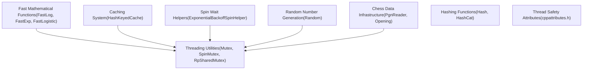
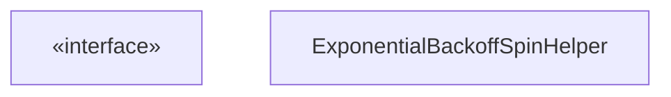
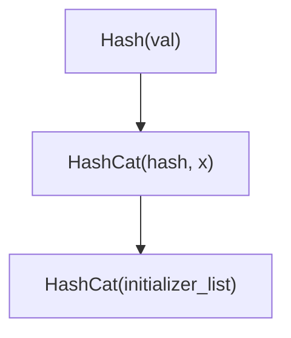
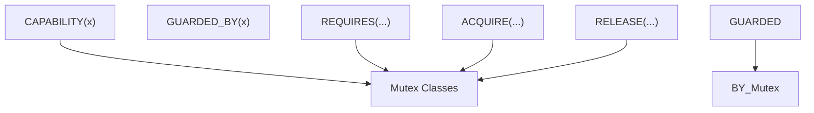
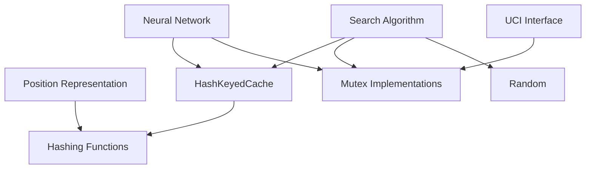

# 实用工具与基础设施

相关源文件

-   [src/chess/pgn.h](https://github.com/LeelaChessZero/lc0/blob/b4e98c19/src/chess/pgn.h)
-   [src/utils/cppattributes.h](https://github.com/LeelaChessZero/lc0/blob/b4e98c19/src/utils/cppattributes.h)
-   [src/utils/fastmath.h](https://github.com/LeelaChessZero/lc0/blob/b4e98c19/src/utils/fastmath.h)
-   [src/utils/mutex.h](https://github.com/LeelaChessZero/lc0/blob/b4e98c19/src/utils/mutex.h)
-   [src/utils/random.cc](https://github.com/LeelaChessZero/lc0/blob/b4e98c19/src/utils/random.cc)
-   [src/utils/random.h](https://github.com/LeelaChessZero/lc0/blob/b4e98c19/src/utils/random.h)
-   [src/utils/spinhelper.h](https://github.com/LeelaChessZero/lc0/blob/b4e98c19/src/utils/spinhelper.h)

本页面记录了为整个 Leela Chess Zero 代码库提供基础支持的核心实用工具、数学函数、线程原语和基础设施组件。这些包括快速数学近似、线程同步原语、缓存机制、随机数生成和国际象棋数据处理基础设施。有关神经网络组件等特定子系统的信息，请参阅 [神经网络系统](/LeelaChessZero/lc0/6-neural-network-system)，有关搜索算法的详细信息，请参阅 [搜索算法](/LeelaChessZero/lc0/5-search-algorithm)。

## 概览

Leela Chess Zero (lc0) 的实用工具和基础设施为国际象棋引擎的核心功能提供了基础支持，重点在于性能关键的数学函数、线程安全和高效的资源管理。这些组件在整个代码库中用于处理常见的计算任务、数据处理和系统协调。

来源：[src/utils/fastmath.h](https://github.com/LeelaChessZero/lc0/blob/b4e98c19/src/utils/fastmath.h) [src/utils/mutex.h](https://github.com/LeelaChessZero/lc0/blob/b4e98c19/src/utils/mutex.h) [src/utils/cache.h](https://github.com/LeelaChessZero/lc0/blob/b4e98c19/src/utils/cache.h) [src/utils/random.h](https://github.com/LeelaChessZero/lc0/blob/b4e98c19/src/utils/random.h) [src/chess/pgn.h](https://github.com/LeelaChessZero/lc0/blob/b4e98c19/src/chess/pgn.h) [src/utils/spinhelper.h](https://github.com/LeelaChessZero/lc0/blob/b4e98c19/src/utils/spinhelper.h) [src/utils/hashcat.h](https://github.com/LeelaChessZero/lc0/blob/b4e98c19/src/utils/hashcat.h) [src/utils/cppattributes.h](https://github.com/LeelaChessZero/lc0/blob/b4e98c19/src/utils/cppattributes.h)

## 线程同步实用工具

Lc0 实现了多种线程同步原语以处理对共享资源的并发访问。这对于确保高性能国际象棋引擎中的线程安全至关重要。

### 互斥锁 (Mutex) 实现

代码库提供了几种具有不同特征的互斥锁实现：

-   **Mutex**: `std::mutex` 的包装器，带有 Clang 线程安全注解
-   **SharedMutex**: `std::shared_timed_mutex` 的包装器，用于读写锁功能
-   **RpSharedMutex**: 基于公平共享互斥锁的读者优先 (Reader-preference) 共享互斥锁
-   **SpinMutex**: 用于短临界区的低开销互斥锁，使用原子操作

每个互斥锁都提供了一个相应的 `Lock` 类，实现了 RAII 风格的锁定，当锁超出作用域时自动释放锁。

来源：[src/utils/mutex.h42-171](https://github.com/LeelaChessZero/lc0/blob/b4e98c19/src/utils/mutex.h#L42-L171)

### 自旋等待 (Spin Wait) 辅助工具

`SpinHelper` 类为传统阻塞开销过大的情况提供了高效的忙等待 (busy-waiting) 机制。

`ExponentialBackoffSpinHelper` 实现了指数退避策略，以减少自旋等待期间的 CPU 使用率，并具有用于休眠前最小和最大迭代次数的可配置参数。

来源：[src/utils/spinhelper.h37-81](https://github.com/LeelaChessZero/lc0/blob/b4e98c19/src/utils/spinhelper.h#L37-L81)

## 缓存实用工具

Lc0 中的缓存系统提供了一种存储和高效检索计算结果的方法，显著提高了重复操作的性能。

### HashKeyedCache

`HashKeyedCache` 是一个线程安全的、哈希键控的缓存，具有以下特征：

-   拥有值的所有权，值在驱逐时被删除
-   使用 FIFO (先进先出) 驱逐策略
-   需要在使用前固定 (pin) 项目，并在使用后取消固定 (unpin)
-   使用线性探测处理冲突

`HashKeyedCacheLock` 提供了一个方便的 RAII 包装器，用于自动固定和取消固定缓存项，简化了缓存使用并防止内存泄漏。

来源：[src/utils/cache.h39-327](https://github.com/LeelaChessZero/lc0/blob/b4e98c19/src/utils/cache.h#L39-L327)

## 随机数生成

`Random` 类提供了一个线程安全的单例，用于生成具有各种分布的随机数。

关键特性：

-   带有 `Random::Get()` 的单例模式，用于全局访问
-   生成不同类型随机值的方法
-   通过互斥锁保护实现的线程安全
-   支持包括均匀分布、Gamma 分布等在内的多种分布

来源：[src/utils/random.h37-63](https://github.com/LeelaChessZero/lc0/blob/b4e98c19/src/utils/random.h#L37-L63) [src/utils/random.cc31-74](https://github.com/LeelaChessZero/lc0/blob/b4e98c19/src/utils/random.cc#L31-L74)

## 哈希实用工具

哈希函数在整个代码库中用于为各种数据结构创建哈希键。

关键的哈希函数包括：

-   `Hash(uint64_t val)`: 打乱一个 64 位值以产生哈希
-   `HashCat(uint64_t hash, uint64_t x)`: 将一个值追加到现有的哈希中
-   `HashCat(std::initializer_list<uint64_t> args)`: 将多个 64 位值组合成一个单一的哈希

这些函数用于在整个引擎中为缓存、局面评估和其他目的创建唯一标识符。

来源：[src/utils/hashcat.h35-51](https://github.com/LeelaChessZero/lc0/blob/b4e98c19/src/utils/hashcat.h#L35-L51)

## 用于线程安全的 C++ 属性

`cppattributes.h` 文件定义了用于线程安全注解的宏，这些注解与 Clang 一起使用，以便在编译时检测潜在的线程问题。

这些属性通过以下方式帮助强制执行线程安全约束：

-   使用 `CAPABILITY` 标记互斥锁类以定义保护域
-   使用 `GUARDED_BY` 注解受互斥锁保护的数据
-   使用 `REQUIRES`, `ACQUIRE`, 和 `RELEASE` 指定锁定要求

这些注解仅在使用 Clang 时有条件地编译，在其他编译器中无效。

来源：[src/utils/cppattributes.h30-60](https://github.com/LeelaChessZero/lc0/blob/b4e98c19/src/utils/cppattributes.h#L30-L60)

## 与核心系统的集成

实用工具类在整个 Leela Chess Zero 代码库中被广泛使用，为主系统中的关键功能提供支持。

来源：[src/utils/cache.h](https://github.com/LeelaChessZero/lc0/blob/b4e98c19/src/utils/cache.h) [src/utils/mutex.h](https://github.com/LeelaChessZero/lc0/blob/b4e98c19/src/utils/mutex.h) [src/utils/random.h](https://github.com/LeelaChessZero/lc0/blob/b4e98c19/src/utils/random.h) [src/utils/hashcat.h](https://github.com/LeelaChessZero/lc0/blob/b4e98c19/src/utils/hashcat.h)

## 性能考量

Lc0 中的实用工具和基础设施在设计时将性能作为首要考虑因素，涵盖了数学计算、线程和数据处理：

| 组件 | 性能特征 | 用例 |
| --- | --- | --- |
| `FastLog`, `FastExp` | 比标准库快约 10-20 倍 | 神经网络激活函数 |
| `FastLogistic` | 具有范围安全性的优化 Sigmoid | 搜索中的概率计算 |
| `SpinMutex` | 短临界区的低开销 | 保护小的、频繁访问的数据 |
| `HashKeyedCache` | O(1) 平均查找时间 | 存储计算结果以供重用 |
| `RpSharedMutex` | 读者优先优化 | 具有许多读者、少量写者的数据结构 |
| `PgnReader` | 带压缩的流式解析器 | 处理大型开局数据库 |

实用工具采用了多种性能优化：

-   **数学函数**: 位操作和多项式近似避免了昂贵的超越函数调用
-   **线程**: 自旋循环中特定于 CPU 的暂停指令（x86 上的 `_mm_pause()`）
-   **同步**: 用于轻量级协调的原子操作
-   **退避策略**: 指数退避以减少争用
-   **内存布局**: 缓存友好的数据结构和内存访问模式
-   **压缩**: 内置 gzip 支持以减少 I/O 开销

来源：[src/utils/fastmath.h42-106](https://github.com/LeelaChessZero/lc0/blob/b4e98c19/src/utils/fastmath.h#L42-L106) [src/utils/mutex.h127-135](https://github.com/LeelaChessZero/lc0/blob/b4e98c19/src/utils/mutex.h#L127-L135) [src/utils/spinhelper.h44-80](https://github.com/LeelaChessZero/lc0/blob/b4e98c19/src/utils/spinhelper.h#L44-L80) [src/utils/cache.h52-56](https://github.com/LeelaChessZero/lc0/blob/b4e98c19/src/utils/cache.h#L52-L56) [src/chess/pgn.h50-64](https://github.com/LeelaChessZero/lc0/blob/b4e98c19/src/chess/pgn.h#L50-L64)

## 测试

实用工具类包含用于验证其正确性的测试用例。例如，`hashcat_test.cc` 测试了 `HashCat` 函数的哈希冲突属性。

来源：[src/utils/hashcat\_test.cc33-39](https://github.com/LeelaChessZero/lc0/blob/b4e98c19/src/utils/hashcat_test.cc#L33-L39)
