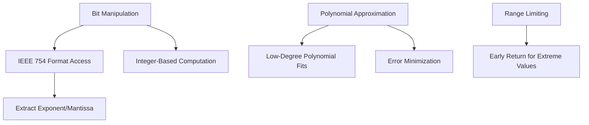
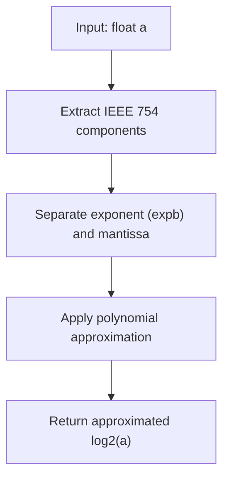
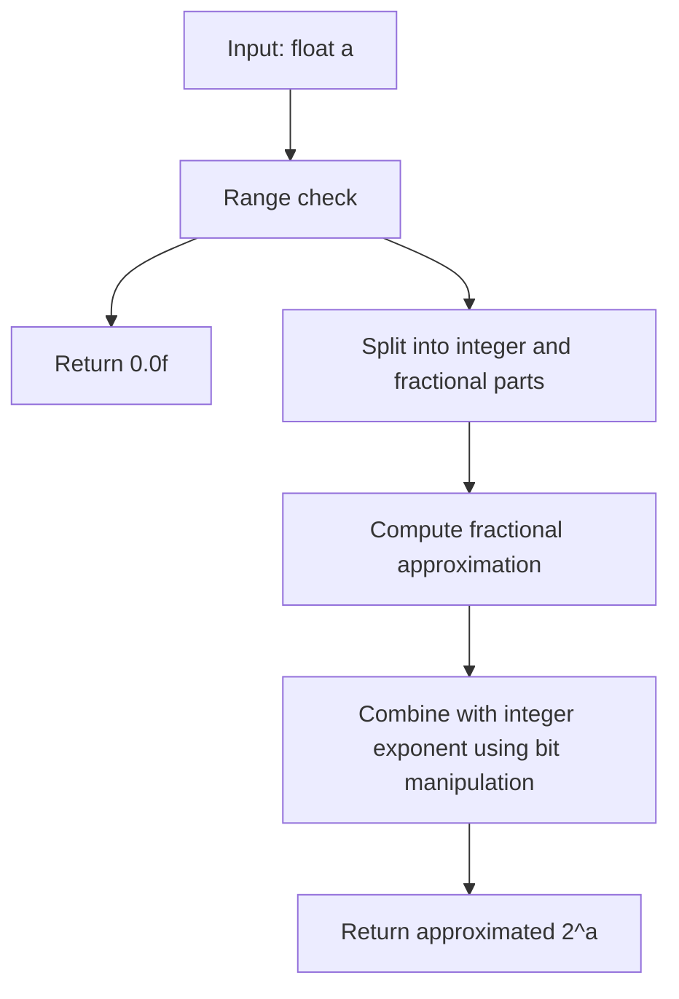
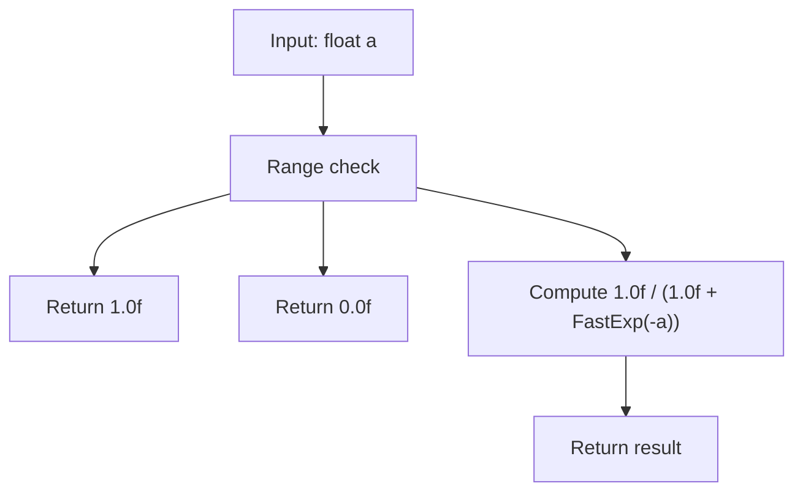
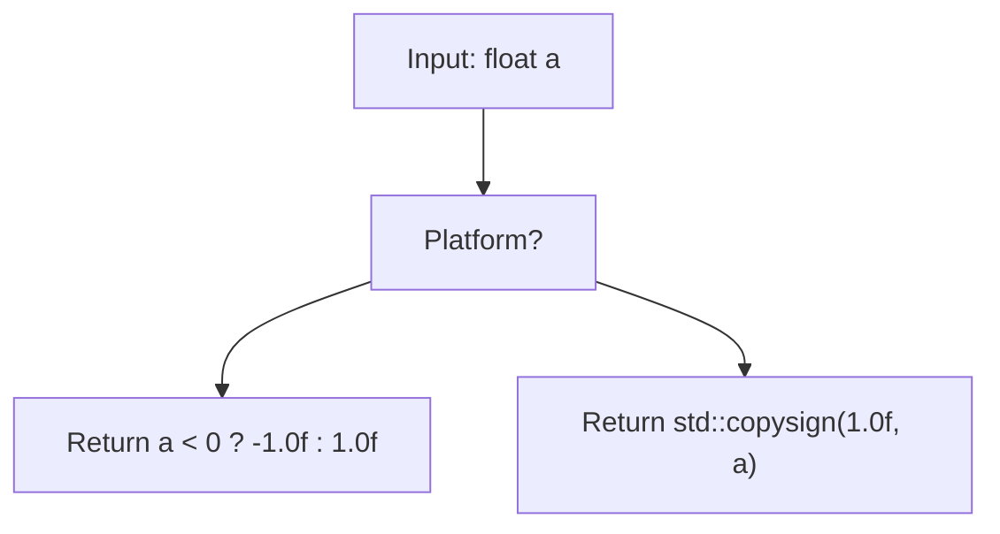
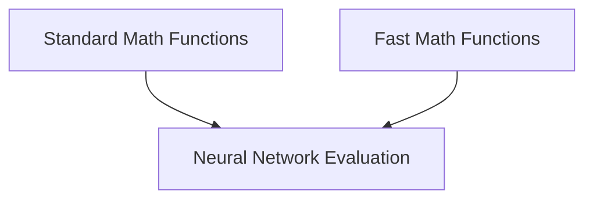
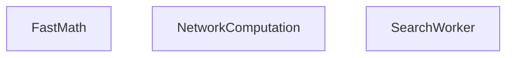
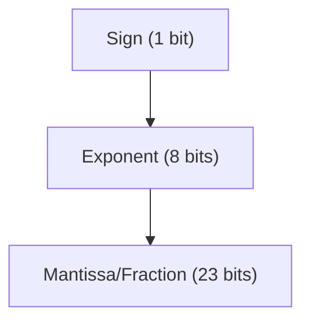

# 快速数学函数

相关源文件

-   [src/utils/fastmath.h](https://github.com/LeelaChessZero/lc0/blob/b4e98c19/src/utils/fastmath.h)

## 目的与范围

本文档详细介绍了 Leela Chess Zero 中用于提高计算性能的优化数学函数。这些快速数学函数提供了常见数学运算（如对数和指数）的高效近似，通过牺牲少量精度来换取在性能关键代码路径中的显著速度提升。本页面重点介绍代码库中使用的数学近似技术及其实现细节。

有关其他实用函数的信息，请参阅 [实用工具](/LeelaChessZero/lc0/8-utilities-and-infrastructure)，有关线程相关的优化，请参阅 [线程与同步](/LeelaChessZero/lc0/8.2-threading-and-synchronization)。

## 快速数学函数概览

Leela Chess Zero 在 `lczero` 命名空间中实现了几个优化的数学函数：

| 函数 | 目的 | 标准等效项 |
| --- | --- | --- |
| `FastLog2` | log₂(x) 的快速近似 | `std::log2` |
| `FastExp2` | 2ˣ 的快速近似 | `std::exp2` |
| `FastLog` | 自然对数的快速近似 | `std::log` |
| `FastExp` | eˣ 的快速近似 | `std::exp` |
| `FastLogistic` | 快速 Sigmoid 函数 1/(1+e⁻ˣ) | `1.0f/(1.0f+std::exp(-x))` |
| `FastSign` | 符号函数的快速实现 | `std::copysign` |

来源：[src/utils/fastmath.h37-105](https://github.com/LeelaChessZero/lc0/blob/b4e98c19/src/utils/fastmath.h#L37-L105)

## 实现原理

Lc0 中的快速数学函数使用巧妙的位操作和多项式近似来实现高性能，同时保持引擎所需的精度。


来源：[src/utils/fastmath.h42-78](https://github.com/LeelaChessZero/lc0/blob/b4e98c19/src/utils/fastmath.h#L42-L78)

## 快速对数函数

### FastLog2

`FastLog2` 函数通过以下方式计算 log₂(x) 的近似值：

1.  从 IEEE 754 浮点表示中提取指数和尾数
2.  应用形式为 `log2(2^N*(1+f)) ≈ N+f*(1+k-k*f)` 的多项式近似
3.  调整常数以在 32 位浮点运算中获得最佳精度


实现细节：

```
FastLog2(a) = mantissa * (1.3465552f - 0.34655523f * mantissa) - 127 + exponent
```
来源：[src/utils/fastmath.h42-52](https://github.com/LeelaChessZero/lc0/blob/b4e98c19/src/utils/fastmath.h#L42-L52)

### FastLog

`FastLog` 函数通过使用 `FastLog2` 并乘以转换因子 ln(2) 来计算自然对数：

```
FastLog(a) = 0.6931471805599453f * FastLog2(a)
```
来源：[src/utils/fastmath.h80-83](https://github.com/LeelaChessZero/lc0/blob/b4e98c19/src/utils/fastmath.h#L80-L83)

## 快速指数函数

### FastExp2

`FastExp2` 函数通过以下方式计算 2ˣ 的近似值：

1.  将输入分为整数和小数部分
2.  对小数部分应用多项式近似：`2^(N+f) ≈ 2^N*(1+f*(1-k+k*f))`
3.  直接在 IEEE 754 表示中设置指数位

该函数包括范围检查以防止下溢/上溢。


来源：[src/utils/fastmath.h59-78](https://github.com/LeelaChessZero/lc0/blob/b4e98c19/src/utils/fastmath.h#L59-L78)

### FastExp

`FastExp` 函数通过利用 `FastExp2` 和适当的转换因子来计算 eˣ：

```
FastExp(a) = FastExp2(1.442695040f * a)
```
其中 1.442695040f 近似等于 1/ln(2)。

来源：[src/utils/fastmath.h86](https://github.com/LeelaChessZero/lc0/blob/b4e98c19/src/utils/fastmath.h#L86-L86)

## Logistic 和符号函数

### FastLogistic

Logistic 函数 (Sigmoid) 实现为使用 `FastExp` 的安全版本：


范围检查防止了非常大正数或负数输入可能导致的数值问题。

来源：[src/utils/fastmath.h89-93](https://github.com/LeelaChessZero/lc0/blob/b4e98c19/src/utils/fastmath.h#L89-L93)

### FastSign

`FastSign` 函数实现了符号函数的更快版本，具有平台特定的优化：


在 Microsoft Visual C++ 编译器上，该函数使用简单的比较以避免 `std::copysign` 可能生成的库调用，而其他编译器可以直接使用标准函数。

来源：[src/utils/fastmath.h95-105](https://github.com/LeelaChessZero/lc0/blob/b4e98c19/src/utils/fastmath.h#L95-L105)

## 精度与性能考量

快速数学函数牺牲了少量精度以换取显著的性能提升。多项式近似经过精心调整，以最小化最大绝对误差（对于对数函数）或最大相对误差（对于指数函数），具体取决于对特定函数而言哪个指标更重要。


对于像神经网络推理这样的操作（引擎需要评估数千或数百万个局面），这些优化函数提供了实质性的性能提升，而对博弈质量的影响微乎其微。

来源：[src/utils/fastmath.h50-51](https://github.com/LeelaChessZero/lc0/blob/b4e98c19/src/utils/fastmath.h#L50-L51) [src/utils/fastmath.h71-72](https://github.com/LeelaChessZero/lc0/blob/b4e98c19/src/utils/fastmath.h#L71-L72)

## 代码库中的使用

这些快速数学函数主要用于代码的性能关键部分，特别是：

1.  神经网络激活函数
2.  搜索算法计算
3.  局面评估归一化


通过在引擎计算最密集的部分使用这些优化函数，Lc0 在不牺牲棋力的情况下实现了更好的性能。

来源：[src/utils/fastmath.h28-107](https://github.com/LeelaChessZero/lc0/blob/b4e98c19/src/utils/fastmath.h#L28-L107)

## 实现细节与位操作

快速数学函数广泛利用 IEEE 754 浮点表示知识和位操作来实现其速度。例如，在 `FastLog2` 和 `FastExp2` 中，代码使用内存复制和按位运算直接访问和修改浮点数的指数和尾数部分。


这种对二进制表示的直接操作允许比标准库函数更快的计算，标准库函数必须处理所有边缘情况并提供完全的精度。

来源：[src/utils/fastmath.h43-48](https://github.com/LeelaChessZero/lc0/blob/b4e98c19/src/utils/fastmath.h#L43-L48) [src/utils/fastmath.h73-76](https://github.com/LeelaChessZero/lc0/blob/b4e98c19/src/utils/fastmath.h#L73-L76)

## 总结

Leela Chess Zero 中的快速数学函数提供了常见数学运算的高效近似，针对神经网络国际象棋引擎的特定需求进行了优化。通过牺牲少量精度换取显著的性能提升，这些函数有助于引擎搜索更深并更快地评估局面。

这些优化代表了竞争性国际象棋引擎开发中精度与速度之间的谨慎平衡，在这些引擎中，每秒评估数百万个局面对于强大的博弈至关重要。

来源：[src/utils/fastmath.h35-107](https://github.com/LeelaChessZero/lc0/blob/b4e98c19/src/utils/fastmath.h#L35-L107)
