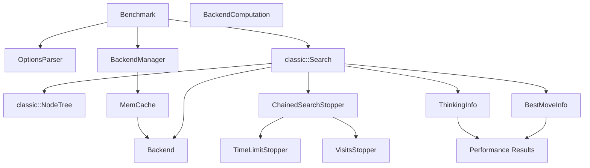
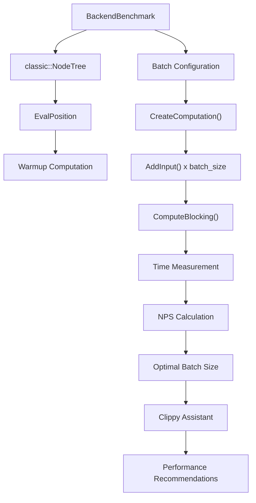
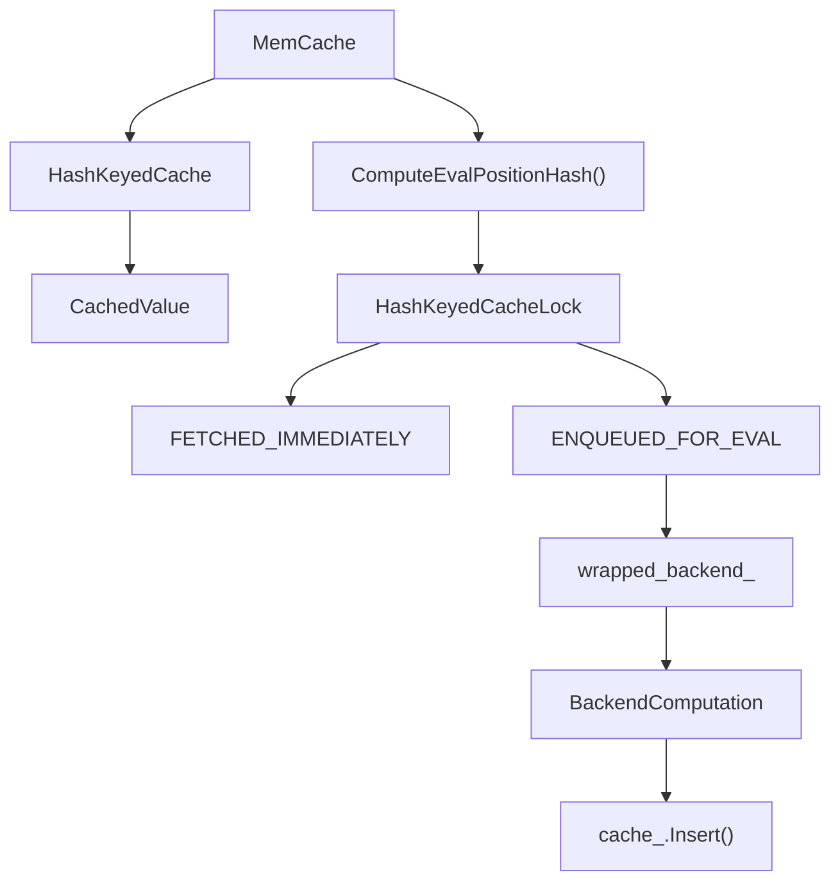
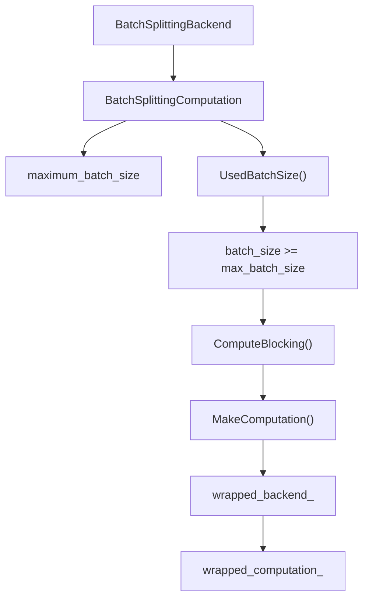
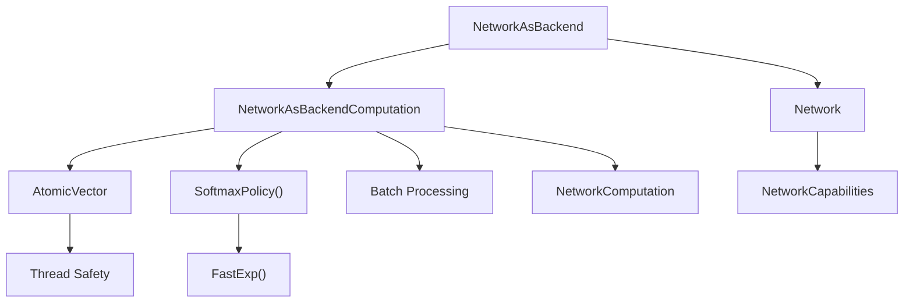

# 基准测试与性能测试

相关源文件

-   [src/neural/backend.cc](https://github.com/LeelaChessZero/lc0/blob/b4e98c19/src/neural/backend.cc)
-   [src/neural/backend.h](https://github.com/LeelaChessZero/lc0/blob/b4e98c19/src/neural/backend.h)
-   [src/neural/batchsplit.cc](https://github.com/LeelaChessZero/lc0/blob/b4e98c19/src/neural/batchsplit.cc)
-   [src/neural/memcache.cc](https://github.com/LeelaChessZero/lc0/blob/b4e98c19/src/neural/memcache.cc)
-   [src/neural/memcache.h](https://github.com/LeelaChessZero/lc0/blob/b4e98c19/src/neural/memcache.h)
-   [src/neural/shared\_params.cc](https://github.com/LeelaChessZero/lc0/blob/b4e98c19/src/neural/shared_params.cc)
-   [src/neural/shared\_params.h](https://github.com/LeelaChessZero/lc0/blob/b4e98c19/src/neural/shared_params.h)
-   [src/neural/wrapper.cc](https://github.com/LeelaChessZero/lc0/blob/b4e98c19/src/neural/wrapper.cc)
-   [src/tools/backendbench.cc](https://github.com/LeelaChessZero/lc0/blob/b4e98c19/src/tools/backendbench.cc)
-   [src/tools/benchmark.cc](https://github.com/LeelaChessZero/lc0/blob/b4e98c19/src/tools/benchmark.cc)
-   [src/tools/benchmark.h](https://github.com/LeelaChessZero/lc0/blob/b4e98c19/src/tools/benchmark.h)

本文档涵盖了 lc0 中的基准测试和性能测试基础设施，包括搜索性能测量、神经网络后端优化和缓存系统。有关通用引擎配置选项，请参阅 [配置系统](/LeelaChessZero/lc0/3.2-configuration-system)。有关神经网络系统架构，请参阅 [神经网络系统](/LeelaChessZero/lc0/6-neural-network-system)。

## 概览

lc0 代码库包含全面的基准测试工具，用于测量和优化不同组件的性能：

-   **搜索基准测试**: 测量每秒节点数 (NPS) 的整体引擎性能
-   **后端基准测试**: 测试不同批次大小下的神经网络推理性能
-   **缓存系统**: 通过评估的内存缓存优化性能
-   **批次管理**: 通过智能批处理优化神经网络利用率

## 搜索性能基准测试

主要的搜索基准测试工具在 `Benchmark` 类中实现，它使用标准化的国际象棋局面评估引擎性能。

### 基准测试工具架构

### 配置选项

基准测试工具接受在 [src/tools/benchmark.cc43-50](https://github.com/LeelaChessZero/lc0/blob/b4e98c19/src/tools/benchmark.cc#L43-L50) 中定义的几个配置参数：

| 选项 | 描述 | 默认值 |
| --- | --- | --- |
| `threads` | CPU 工作线程数 | 2 |
| `nodes` | 要搜索的节点数 | \-1 (无限制) |
| `movetime` | 时间分配（毫秒） | 10000 (完整) / 500 (简短) |
| `fen` | 自定义局面 FEN | "" (使用标准局面) |
| `num-positions` | 测试局面数量 | 34 (完整) / 10 (简短) |

### 基准测试执行流程

`Benchmark::Run()` 方法 [src/tools/benchmark.cc53-147](https://github.com/LeelaChessZero/lc0/blob/b4e98c19/src/tools/benchmark.cc#L53-L147) 遵循此过程：

1.  **设置**: 配置选项并创建带有内存缓存的后端
2.  **局面循环**: 迭代测试局面（与 Stockfish 相同）
3.  **搜索**: 运行带有配置的终止器和时间限制的搜索
4.  **测量**: 收集计时和节点计数数据
5.  **结果**: 计算所有局面的总每秒节点数

来源：[src/tools/benchmark.cc1-162](https://github.com/LeelaChessZero/lc0/blob/b4e98c19/src/tools/benchmark.cc#L1-L162) [src/tools/benchmark.h1-86](https://github.com/LeelaChessZero/lc0/blob/b4e98c19/src/tools/benchmark.h#L1-L86)

## 神经网络后端基准测试

`BackendBenchmark` 类为神经网络推理性能提供专门的基准测试，测试各种批次大小以找到最佳配置。

### 后端基准测试架构

### 批次大小优化

后端基准测试测试从 `start-batch-size` 到 `max-batch-size` 的不同批次大小，并带有可配置的 `batch-step` 增量。`Clippy` 助手 [src/tools/backendbench.cc54-75](https://github.com/LeelaChessZero/lc0/blob/b4e98c19/src/tools/backendbench.cc#L54-L75) 为不同的时间控制提供建议：

-   **超快棋 (Bullet)** (1s/move): 针对低延迟进行优化
-   **快棋 (Rapid)** (15s/move): 平衡延迟/吞吐量
-   **锦标赛 (Tournament)** (3min/move): 针对最大吞吐量进行优化

来源：[src/tools/backendbench.cc1-188](https://github.com/LeelaChessZero/lc0/blob/b4e98c19/src/tools/backendbench.cc#L1-L188)

## 性能优化组件

### 内存缓存系统

`MemCache` 类实现神经网络评估缓存以避免冗余计算。

缓存存储 `CachedValue` 结构，包含：

-   `float q, d, m`: 价值、和棋及步数估计
-   `uint8_t num_moves`: 合法走法数量
-   `std::unique_ptr<float[]> p`: 策略概率

缓存配置由 `SharedBackendParams::kNNCacheSizeId` 控制 [src/neural/shared\_params.cc63-66](https://github.com/LeelaChessZero/lc0/blob/b4e98c19/src/neural/shared_params.cc#L63-L66)，默认大小为 2,000,000 个局面。

来源：[src/neural/memcache.cc1-194](https://github.com/LeelaChessZero/lc0/blob/b4e98c19/src/neural/memcache.cc#L1-L194) [src/neural/memcache.h1-47](https://github.com/LeelaChessZero/lc0/blob/b4e98c19/src/neural/memcache.h#L1-L47)

### 批次拆分后端 (Batch Splitting Backend)

`BatchSplittingBackend` 自动管理批次大小以防止超出后端限制。

当批次达到容量时，系统会自动触发计算 [src/neural/batchsplit.cc72-77](https://github.com/LeelaChessZero/lc0/blob/b4e98c19/src/neural/batchsplit.cc#L72-L77)，确保最佳利用且不溢出。

来源：[src/neural/batchsplit.cc1-101](https://github.com/LeelaChessZero/lc0/blob/b4e98c19/src/neural/batchsplit.cc#L1-L101)

### 网络即后端包装器 (Network-as-Backend Wrapper)

`NetworkAsBackend` 类包装神经网络以提供具有性能优化的标准后端接口。

关键性能特性包括：

-   **原子向量 (Atomic Vector)**: 线程安全的批次条目管理 [src/neural/wrapper.cc165](https://github.com/LeelaChessZero/lc0/blob/b4e98c19/src/neural/wrapper.cc#L165-L165)
-   **快速数学 (Fast Math)**: 用于 Softmax 计算的优化 `FastExp()` [src/neural/wrapper.cc148](https://github.com/LeelaChessZero/lc0/blob/b4e98c19/src/neural/wrapper.cc#L148-L148)
-   **批次属性**: 通过 `BackendAttributes` 可配置的批次大小 [src/neural/wrapper.cc62-63](https://github.com/LeelaChessZero/lc0/blob/b4e98c19/src/neural/wrapper.cc#L62-L63)

来源：[src/neural/wrapper.cc1-195](https://github.com/LeelaChessZero/lc0/blob/b4e98c19/src/neural/wrapper.cc#L1-L195) [src/neural/backend.h1-136](https://github.com/LeelaChessZero/lc0/blob/b4e98c19/src/neural/backend.h#L1-L136)

## 后端属性与配置

性能特征通过 `BackendAttributes` 结构公开 [src/neural/backend.h43-50](https://github.com/LeelaChessZero/lc0/blob/b4e98c19/src/neural/backend.h#L43-L50)：

| 属性 | 描述 |
| --- | --- |
| `suggested_num_search_threads` | 推荐的搜索线程数 |
| `recommended_batch_size` | 此后端的最佳批次大小 |
| `maximum_batch_size` | 支持的最大批次大小 |
| `runs_on_cpu` | 后端是否使用 CPU 资源 |

配置更新通过 `UpdateConfiguration()` 方法管理，该方法根据更改是否需要重建后端返回 `UPDATE_OK` 或 `NEED_RESTART` [src/neural/backend.h106-114](https://github.com/LeelaChessZero/lc0/blob/b4e98c19/src/neural/backend.h#L106-L114)。

来源：[src/neural/backend.h1-136](https://github.com/LeelaChessZero/lc0/blob/b4e98c19/src/neural/backend.h#L1-L136) [src/neural/backend.cc1-68](https://github.com/LeelaChessZero/lc0/blob/b4e98c19/src/neural/backend.cc#L1-L68) [src/neural/shared\_params.cc1-86](https://github.com/LeelaChessZero/lc0/blob/b4e98c19/src/neural/shared_params.cc#L1-L86)
