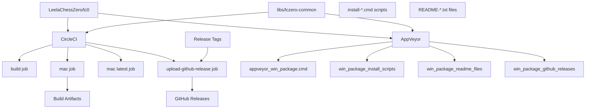
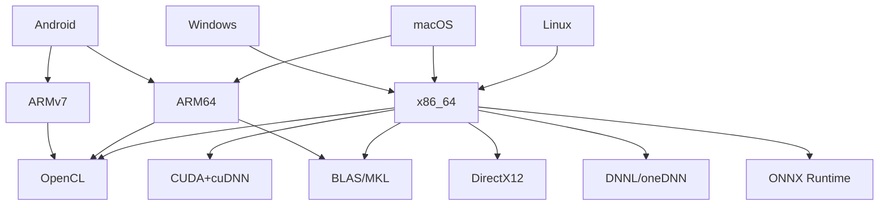
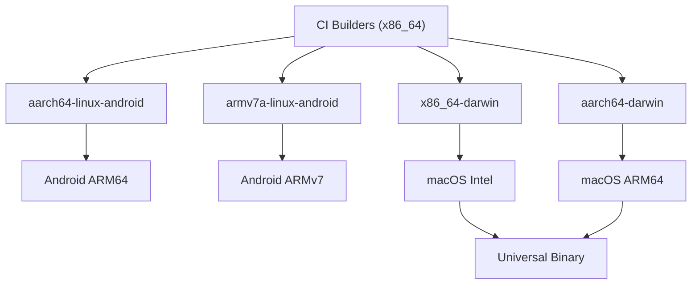

# 持续集成与部署

相关源文件

-   [.circleci/Dockerfile](https://github.com/LeelaChessZero/lc0/blob/b4e98c19/.circleci/Dockerfile)
-   [.circleci/config.yml](https://github.com/LeelaChessZero/lc0/blob/b4e98c19/.circleci/config.yml)
-   [.clang-format](https://github.com/LeelaChessZero/lc0/blob/b4e98c19/.clang-format)
-   [.gitmodules](https://github.com/LeelaChessZero/lc0/blob/b4e98c19/.gitmodules)
-   [cross-files/x86\_64-darwin](https://github.com/LeelaChessZero/lc0/blob/b4e98c19/cross-files/x86_64-darwin)
-   [dist/README-onnx-dml.txt](https://github.com/LeelaChessZero/lc0/blob/b4e98c19/dist/README-onnx-dml.txt)
-   [dist/README-onnx-trt.txt](https://github.com/LeelaChessZero/lc0/blob/b4e98c19/dist/README-onnx-trt.txt)
-   [dist/install-cuda\_12\_9.cmd](https://github.com/LeelaChessZero/lc0/blob/b4e98c19/dist/install-cuda_12_9.cmd)
-   [dist/install-dml.cmd](https://github.com/LeelaChessZero/lc0/blob/b4e98c19/dist/install-dml.cmd)
-   [dist/install-trt.cmd](https://github.com/LeelaChessZero/lc0/blob/b4e98c19/dist/install-trt.cmd)
-   [scripts/appveyor\_win\_package.cmd](https://github.com/LeelaChessZero/lc0/blob/b4e98c19/scripts/appveyor_win_package.cmd)
-   [subprojects/protobuf.wrap](https://github.com/LeelaChessZero/lc0/blob/b4e98c19/subprojects/protobuf.wrap)

本页面记录了 Leela Chess Zero (lc0) 用于跨多个平台和硬件配置自动构建、测试、打包和发布的持续集成与部署 (CI/CD) 系统。该系统处理常规开发构建和将标记版本自动部署到 GitHub 发布。有关构建过程本身的信息，请参阅 [构建与安装](/LeelaChessZero/lc0/2-building-and-installation)。

## 概览

Leela Chess Zero 使用多平台 CI/CD 设置，以确保代码库可以在各种操作系统、硬件架构以及不同的神经网络后端上正确构建。当提交更改时，系统会自动构建项目，并将标记版本的打包二进制文件部署到 GitHub 发布 (GitHub Releases)。

### CI/CD 流水线架构

来源：[.circleci/config.yml1-148](https://github.com/LeelaChessZero/lc0/blob/b4e98c19/.circleci/config.yml#L1-L148) [scripts/appveyor\_win\_package.cmd1-72](https://github.com/LeelaChessZero/lc0/blob/b4e98c19/scripts/appveyor_win_package.cmd#L1-L72) [dist/install-dml.cmd1-25](https://github.com/LeelaChessZero/lc0/blob/b4e98c19/dist/install-dml.cmd#L1-L25) [dist/README-onnx-trt.txt1-89](https://github.com/LeelaChessZero/lc0/blob/b4e98c19/dist/README-onnx-trt.txt#L1-L89)

## CI 平台

### CircleCI

CircleCI 用于在 Linux 和 macOS 平台上构建 lc0。CircleCI 配置定义了通过工作流编排的四个主要作业 (jobs)：

#### 作业定义

1.  **`build` 作业**:

    -   使用 `nvidia/cuda:11.6.1-cudnn8-devel-ubuntu20.04` Docker 镜像
    -   安装构建工具：`gcc-10`, `g++-10`, `clang-12`, `meson==0.63`, `ninja`
    -   下载适用于 Linux x64 的 ONNX Runtime 1.22.0
    -   使用 Meson 通过 GCC 和 Clang 编译器进行构建
2.  **`mac` 作业**:

    -   在带有 Xcode 14.1.0 的 `macos.m1.medium.gen1` 上运行
    -   使用交叉编译创建 x86\_64 和 ARM64 构建
    -   使用 `lipo` 生成通用二进制文件
    -   存储构建产物 (artifacts) 并持久化到工作区以供发布上传
3.  **`mac latest` 作业**:

    -   类似于 `mac`，但使用 Xcode 16.4.0 进行最新兼容性测试
    -   仅构建 ARM64 变体
4.  **`upload-github-release` 作业**:

    -   下载 GitHub CLI 并将 macOS 构建产物上传到 GitHub 发布
    -   仅对匹配模式 `/v[0-9]+(\.[0-9]+)*(\-.+)?/` 的标记发布运行

### CircleCI 构建流程

```mermaid
flowchart TD
    mac_checkout["checkout"]
    mac_submodules["git submodule update --init"]
    ispc_install["Install ispc-v1.21.0"]
    x86_build["meson build --cross-file cross-files/x86_64-darwin"]
    arm_build["meson build-arm --buildtype=release"]
    lipo_universal["lipo -create -o /tmp/lc0 build/lc0 build-arm/lc0"]
    store_artifacts["store_artifacts: path=/tmp/lc0"]
    persist_workspace["persist_to_workspace"]
    nvidia_cuda["nvidia/cuda:11.6.1-cudnn8-devel-ubuntu20.04"]
    build_tools["gcc-10, g++-10, clang-12, meson, ninja"]
    onnx_download["onnxruntime-linux-x64-1.22.0.tgz"]
    checkout["checkout"]
    submodules["git submodule update --init"]
    meson_gcc["meson build-gcc -Dgtest=false -Donnx_include=... -Donnx_libdir=..."]
    meson_clang["meson build-clang -Dgtest=false -Db_lto=false -Donnx_include=... -Donnx_libdir=..."]
    ninja_gcc["ninja -j 4 (build-gcc)"]
    ninja_clang["ninja -j 4 (build-clang)"]

    nvidia --> cuda_build_tools
    build --> tools_checkout
    checkout --> submodules
    submodules --> onnx_download
    onnx --> download_meson_gcc
    meson --> gcc_meson_clang
    meson --> clang_ninja_gcc
    ninja --> gcc_ninja_clang
    mac --> checkout_mac_submodules
    mac --> submodules_ispc_install
    ispc --> install_x86_build
    x86 --> build_arm_build
    arm --> build_lipo_universal
    lipo --> universal_store_artifacts
    store --> artifacts_persist_workspace
```

来源：[.circleci/config.yml3-44](https://github.com/LeelaChessZero/lc0/blob/b4e98c19/.circleci/config.yml#L3-L44) [.circleci/config.yml45-88](https://github.com/LeelaChessZero/lc0/blob/b4e98c19/.circleci/config.yml#L45-L88) [.circleci/config.yml89-108](https://github.com/LeelaChessZero/lc0/blob/b4e98c19/.circleci/config.yml#L89-L108) [.circleci/config.yml109-129](https://github.com/LeelaChessZero/lc0/blob/b4e98c19/.circleci/config.yml#L109-L129)

### AppVeyor

AppVeyor 用于 Windows 和 Android 构建。AppVeyor 配置在提供的文件中不直接可见，但打包脚本揭示了有关构建过程的细节：

1.  **Windows 构建**:

    -   为各种后端（CUDA, OpenCL, BLAS, DNNL, DirectX, ONNX）创建包
    -   在包中包含所需的 DLL 和依赖项
    -   基于构建配置创建专用包
2.  **Android 构建**:

    -   为 ARM64 (arm64-v8a) 和 ARMv7 (armeabi-v7a) 架构构建
    -   使用 Android NDK 进行交叉编译

来源：[scripts/appveyor\_win\_package.cmd1-48](https://github.com/LeelaChessZero/lc0/blob/b4e98c19/scripts/appveyor_win_package.cmd#L1-L48) [scripts/appveyor\_android\_build.cmd1-8](https://github.com/LeelaChessZero/lc0/blob/b4e98c19/scripts/appveyor_android_build.cmd#L1-L8)

## 构建矩阵

Leela Chess Zero 在复杂的配置矩阵中构建：

| 操作系统 | 架构 | 神经网络后端 | 编译器 |
| --- | --- | --- | --- |
| Linux | x86\_64 | CUDA+cuDNN | GCC, Clang |
| Linux | x86\_64 | OpenCL | GCC, Clang |
| Linux | x86\_64 | BLAS | GCC, Clang |
| macOS | x86\_64 | BLAS | Clang |
| macOS | ARM64 | BLAS | Clang |
| Windows | x86\_64 | CUDA+cuDNN | MSVC |
| Windows | x86\_64 | OpenCL | MSVC |
| Windows | x86\_64 | DirectX12 | MSVC |
| Windows | x86\_64 | DNNL/oneDNN | MSVC |
| Windows | x86\_64 | ONNX | MSVC |
| Android | ARM64 | OpenCL | Clang |
| Android | ARMv7 | OpenCL | Clang |

此矩阵确保 lc0 可以在各种硬件和软件配置上运行，最大限度地提高兼容性和性能。

来源：[.circleci/config.yml3-74](https://github.com/LeelaChessZero/lc0/blob/b4e98c19/.circleci/config.yml#L3-L74) [scripts/appveyor\_win\_package.cmd1-48](https://github.com/LeelaChessZero/lc0/blob/b4e98c19/scripts/appveyor_win_package.cmd#L1-L48) [cross-files/aarch64-linux-android1-25](https://github.com/LeelaChessZero/lc0/blob/b4e98c19/cross-files/aarch64-linux-android#L1-L25) [cross-files/armv7a-linux-android1-32](https://github.com/LeelaChessZero/lc0/blob/b4e98c19/cross-files/armv7a-linux-android#L1-L32)

## 交叉编译

交叉编译是 CI 系统的一个重要方面，它使得能够为不同的架构进行构建：

### Android 交叉编译

Android 构建使用定义了目标架构、系统和工具链的交叉编译文件：

-   **ARM64 Android**: 使用 aarch64-linux-android21-clang 工具链，针对 API 级别 21
-   **ARMv7 Android**: 使用 armv7a-linux-androideabi21-clang 工具链，针对 API 级别 21

交叉编译文件指定：

-   目标机器属性（CPU，字节序）
-   编译器和链接器标志
-   工具链二进制文件（编译器，链接器等）

### macOS 交叉编译

对于 macOS，交叉编译支持为 Intel (x86\_64) 和 Apple Silicon (ARM64) 架构进行构建：

-   **x86\_64 macOS**: 指定 x86\_64 的特定于架构的标志
-   **ARM64 macOS**: 指定 ARM64 (arm64) 的特定于架构的标志

这些交叉文件使得能够创建可以在 Intel 和 Apple Silicon Mac 上原生运行的通用二进制文件。

来源：[cross-files/aarch64-linux-android1-25](https://github.com/LeelaChessZero/lc0/blob/b4e98c19/cross-files/aarch64-linux-android#L1-L25) [cross-files/armv7a-linux-android1-32](https://github.com/LeelaChessZero/lc0/blob/b4e98c19/cross-files/armv7a-linux-android#L1-L32) [cross-files/x86\_64-darwin1-28](https://github.com/LeelaChessZero/lc0/blob/b4e98c19/cross-files/x86_64-darwin#L1-L28) [cross-files/aarch64-darwin1-28](https://github.com/LeelaChessZero/lc0/blob/b4e98c19/cross-files/aarch64-darwin#L1-L28) [.circleci/config.yml70-72](https://github.com/LeelaChessZero/lc0/blob/b4e98c19/.circleci/config.yml#L70-L72)

## 发布打包与部署

### Windows 打包流程

`appveyor_win_package.cmd` 脚本处理针对不同神经网络后端的综合 Windows 包创建。该脚本根据构建配置变量（`%NAME%`, `%CUDA%`, `%OPENCL%` 等）创建专用包：

#### 包创建逻辑

### 自动化依赖安装

打包系统包含用于复杂依赖项的自动化安装脚本：

| 脚本 | 目的 | 下载的依赖项 |
| --- | --- | --- |
| `install-dml.cmd` | 用于 ONNX-DML 后端的 DirectML | `microsoft.ai.directml.1.15.4.nupkg` |
| `install-trt.cmd` | 用于 ONNX-TRT 的 CUDA/cuDNN/TensorRT | CUDA 12.9, cuDNN 9.11, TensorRT 10.12 |
| `install-cuda_12_9.cmd` | 用于 CUDA 后端的 CUDA 运行时 | CUDA runtime 12.9, cuBLAS 12.9 |

### GitHub 发布部署

CircleCI `upload-github-release` 作业处理到 GitHub 发布的自动部署：

```mermaid
flowchart TD
    tag_push["Tag Push (v[0-9]+...)"]
    workflow_filter["Workflow Filters"]
    attach_workspace["attach_workspace: at=/tmp/workspace"]
    install_gh["brew install gh"]
    verify_workspace["ls -lah /tmp/workspace"]
    rename_binary["mv /tmp/workspace/lc0 /tmp/lc0-$CIRCLE_TAG-macos_12.6.1"]
    gh_upload["gh release upload $CIRCLE_TAG /tmp/lc0-$CIRCLE_TAG-macos_12.6.1 --clobber --repo LeelaChessZero/lc0"]
    mac_job_complete["mac job completion"]
    branch_ignore["branches: ignore: /.*/"]

    tag --> push_workflow_filter
    workflow --> filter_mac_job_complete
    mac --> job_complete_attach_workspace
    attach --> workspace_install_gh
    install --> gh_verify_workspace
    verify --> workspace_rename_binary
    rename --> binary_gh_upload
    branch --> ignore_gh_upload
```

来源：[scripts/appveyor\_win\_package.cmd1-72](https://github.com/LeelaChessZero/lc0/blob/b4e98c19/scripts/appveyor_win_package.cmd#L1-L72) [.circleci/config.yml109-147](https://github.com/LeelaChessZero/lc0/blob/b4e98c19/.circleci/config.yml#L109-L147) [dist/install-dml.cmd1-25](https://github.com/LeelaChessZero/lc0/blob/b4e98c19/dist/install-dml.cmd#L1-L25) [dist/install-trt.cmd1-89](https://github.com/LeelaChessZero/lc0/blob/b4e98c19/dist/install-trt.cmd#L1-L89) [dist/install-cuda\_12\_9.cmd1-44](https://github.com/LeelaChessZero/lc0/blob/b4e98c19/dist/install-cuda_12_9.cmd#L1-L44)

## 工作流集成

持续集成工作流在每次提交到仓库以及进行标记发布时触发：

1.  **常规提交**:

    -   CI 构建项目以确保其正确编译
    -   运行测试以验证功能
    -   不发布任何包
2.  **标记发布**:

    -   CI 在所有平台上构建项目
    -   为每个配置创建包
    -   将构建产物上传到 GitHub 发布

此工作流确保代码库始终可构建，并通过自动创建二进制包简化了发布过程。

来源：[.circleci/config.yml75-81](https://github.com/LeelaChessZero/lc0/blob/b4e98c19/.circleci/config.yml#L75-L81) [scripts/appveyor\_win\_package.cmd1-48](https://github.com/LeelaChessZero/lc0/blob/b4e98c19/scripts/appveyor_win_package.cmd#L1-L48)
