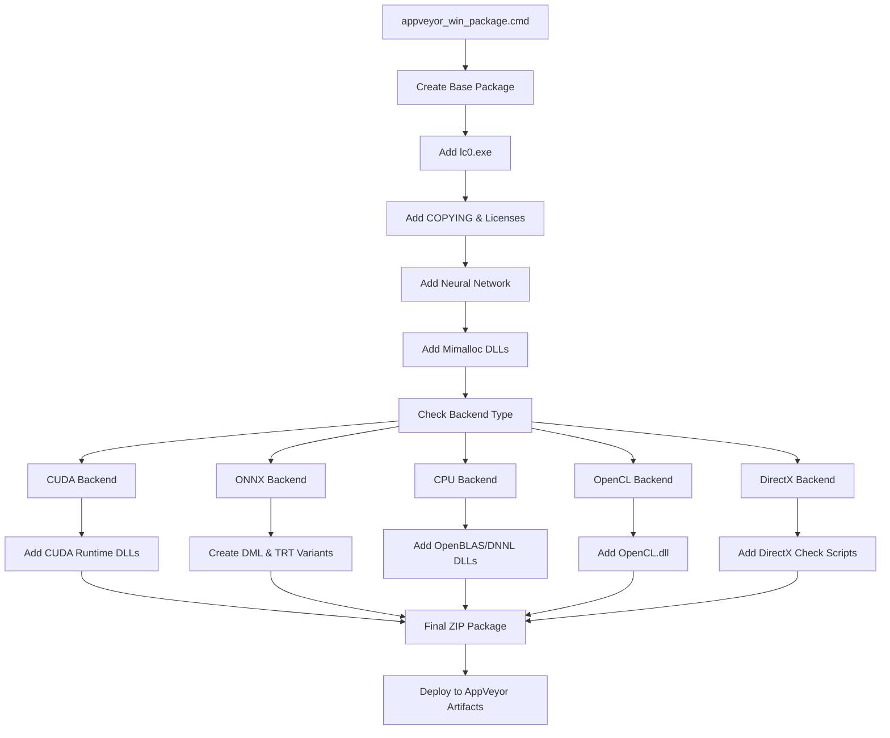
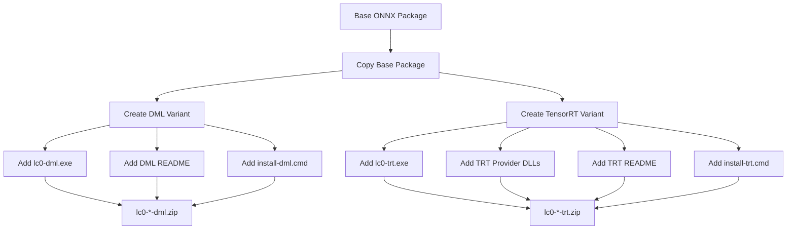
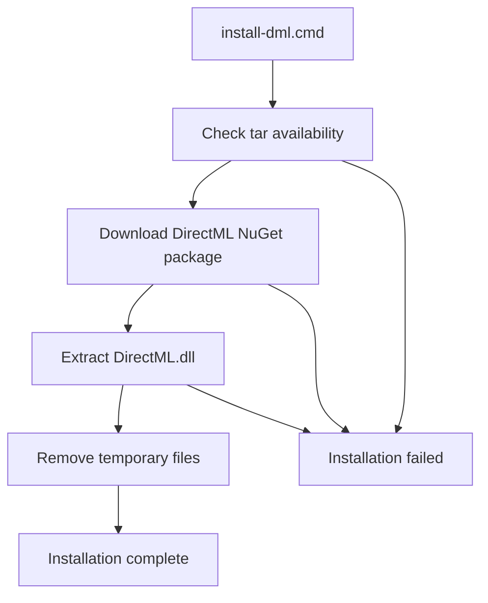

# Windows 构建与打包

相关源文件

-   [dist/README-onnx-dml.txt](https://github.com/LeelaChessZero/lc0/blob/b4e98c19/dist/README-onnx-dml.txt)
-   [dist/README-onnx-trt.txt](https://github.com/LeelaChessZero/lc0/blob/b4e98c19/dist/README-onnx-trt.txt)
-   [dist/install-cuda\_12\_9.cmd](https://github.com/LeelaChessZero/lc0/blob/b4e98c19/dist/install-cuda_12_9.cmd)
-   [dist/install-dml.cmd](https://github.com/LeelaChessZero/lc0/blob/b4e98c19/dist/install-dml.cmd)
-   [dist/install-trt.cmd](https://github.com/LeelaChessZero/lc0/blob/b4e98c19/dist/install-trt.cmd)
-   [scripts/appveyor\_win\_package.cmd](https://github.com/LeelaChessZero/lc0/blob/b4e98c19/scripts/appveyor_win_package.cmd)

本文档涵盖了 Lc0 的 Windows 特定构建和打包基础设施，通过 AppVeyor 持续集成实现。它详细介绍了自动化打包脚本、分发产物创建以及 Windows 平台上各种神经网络后端的依赖项管理。

有关通用构建系统架构和跨平台构建配置，请参阅 [构建系统架构](/LeelaChessZero/lc0/2.1-build-system-architecture)。有关 Linux 和 macOS 构建过程，请参阅 [Linux 和 macOS 构建过程](/LeelaChessZero/lc0/2.2-linux-and-macos-build-process)。

## 概览

Windows 构建和打包系统创建可分发的 ZIP 归档，其中包含 Lc0 可执行文件、所需的依赖项、许可证文件和安装脚本。该系统支持多种神经网络后端，包括 CUDA, ONNX, DirectML, OpenCL 和纯 CPU 变体，每种都有特定的依赖项要求和打包逻辑。

## AppVeyor 打包工作流

主要的打包过程由 `appveyor_win_package.cmd` 脚本控制，该脚本根据 AppVeyor 构建过程中设置的环境变量创建特定于后端的发布包。

**打包工作流**

来源：[scripts/appveyor\_win\_package.cmd1-72](https://github.com/LeelaChessZero/lc0/blob/b4e98c19/scripts/appveyor_win_package.cmd#L1-L72)

## 后端特定打包逻辑

打包脚本为不同的神经网络后端实现条件逻辑，每种后端都需要特定的运行时依赖项和配置文件。

### CUDA 后端打包

CUDA 构建包括多个 CUDA 运行时版本，并创建常规和 "nodll" 变体：

| CUDA 版本 | 运行时 DLL | 构建变体 |
| --- | --- | --- |
| CUDA 10 | `cudart64_101.dll`, `cublas64_10.dll`, `cublasLt64_10.dll` | Standard |
| CUDA 11 | `cudart64_110.dll`, `cublas64_11.dll`, `cublasLt64_11.dll` | Standard |
| CUDA 12 | `cudart64_12.dll`, `cublas64_12.dll`, `cublasLt64_12.dll` | Standard + No-DLL |

来源：[scripts/appveyor\_win\_package.cmd18-25](https://github.com/LeelaChessZero/lc0/blob/b4e98c19/scripts/appveyor_win_package.cmd#L18-L25)

### ONNX 后端变体

ONNX 构建创建三个具有不同执行提供程序的独特包：

**ONNX 包创建**

来源：[scripts/appveyor\_win\_package.cmd38-61](https://github.com/LeelaChessZero/lc0/blob/b4e98c19/scripts/appveyor_win_package.cmd#L38-L61)

### CPU 后端依赖项

仅 CPU 构建包括优化的数学库：

-   **OpenBLAS**: 包含来自缓存 OpenBLAS 安装的 `libopenblas.dll`
-   **DNNL/OneDNN**: 包含 `dnnl.dll` 以及许可证文件 (`DNNL-LICENSE`, `DNNL-THIRD-PARTY-PROGRAMS`)

来源：[scripts/appveyor\_win\_package.cmd14-37](https://github.com/LeelaChessZero/lc0/blob/b4e98c19/scripts/appveyor_win_package.cmd#L14-L37)

## 分发产物

每个构建配置生成具有标准化命名约定和内容的特定产物。

### 包命名约定

所有包遵循模式：`lc0-{VERSION}-windows-{BACKEND_NAME}.zip`

其中 `{BACKEND_NAME}` 包括：

-   `gpu-nvidia-cuda12`
-   `cpu-openblas`
-   `cpu-dnnl`
-   `onednn`
-   `gpu-dx12` (重命名为 `windows10-gpu-dx12`)

### 标准包内容

每个包都包含以下核心组件：

| 组件 | 来源 | 目的 |
| --- | --- | --- |
| `lc0.exe` | 构建输出 | 主可执行文件 |
| `COPYING` | 仓库根目录 | GPL 许可证 |
| `*.pb.gz` | 下载的网络 | 神经网络权重 |
| `mimalloc-*.dll` | Mimalloc 构建 | 内存分配器 |
| `mimalloc-readme.md` | Mimalloc 文档 | 内存分配器文档 |

来源：[scripts/appveyor\_win\_package.cmd1-12](https://github.com/LeelaChessZero/lc0/blob/b4e98c19/scripts/appveyor_win_package.cmd#L1-L12)

## 安装脚本

分发包包含自动化安装脚本，用于下载无法直接重新分发的运行时依赖项。

### DirectML 安装

DirectML 安装脚本下载并提取所需的 DirectML 运行时：

**DirectML 安装流程**

该脚本从 `https://globalcdn.nuget.org/packages/microsoft.ai.directml.1.15.4.nupkg` 下载并提取 `bin/x64-win/DirectML.dll`。

来源：[dist/install-dml.cmd1-25](https://github.com/LeelaChessZero/lc0/blob/b4e98c19/dist/install-dml.cmd#L1-L25)

### CUDA 安装脚本

CUDA 安装脚本处理多个 CUDA 组件下载：

-   **CUDA 12.9**: 从 NVIDIA redistributables 下载 `cudart`, `cublas`, 和 `cublasLt`
-   **TensorRT**: 下载 CUDA/cuDNN 依赖项并将用户引导至 TensorRT 下载页面

TensorRT 安装程序自动下载这些组件：

-   CUDA 运行时库 (`cudart64_12.dll`, `cublas64_12.dll`, `cublasLt64_12.dll`, `cufft64_11.dll`)
-   cuDNN 库 (`cudnn64_9.dll`, `cudnn_graph64_9.dll`)

来源：[dist/install-cuda\_12\_9.cmd1-44](https://github.com/LeelaChessZero/lc0/blob/b4e98c19/dist/install-cuda_12_9.cmd#L1-L44) [dist/install-trt.cmd1-89](https://github.com/LeelaChessZero/lc0/blob/b4e98c19/dist/install-trt.cmd#L1-L89)

## 后端配置文件

分发包包括后端特定的文档和配置：

### TensorRT 文档

TensorRT 包在 `README-onnx-trt.txt` 中包含全面的设置说明，涵盖：

-   所需的 DLL 依赖项 (CUDA, cuDNN, TensorRT)
-   所有组件的手动下载 URL
-   TensorRT 缓存管理 (`trt_cache` 文件夹)
-   性能优化说明

来源：[dist/README-onnx-trt.txt1-89](https://github.com/LeelaChessZero/lc0/blob/b4e98c19/dist/README-onnx-trt.txt#L1-L89)

### DirectML 文档

DirectML 包在 `README-onnx-dml.txt` 中包含简化的设置说明，重点关注 DirectML 运行时要求和自动安装过程。

来源：[dist/README-onnx-dml.txt1-39](https://github.com/LeelaChessZero/lc0/blob/b4e98c19/dist/README-onnx-dml.txt#L1-L39)
