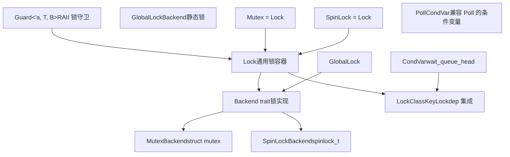
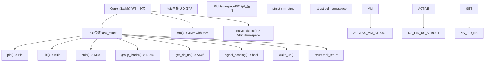
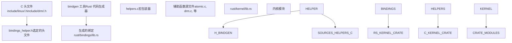
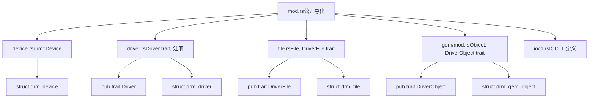

# Rust for Linux

相关源文件

-   [MAINTAINERS](https://github.com/torvalds/linux/blob/fcb70a56/MAINTAINERS)
-   [drivers/gpu/drm/drm\_panic\_qr.rs](https://github.com/torvalds/linux/blob/fcb70a56/drivers/gpu/drm/drm_panic_qr.rs)
-   [drivers/gpu/drm/nova/Kconfig](https://github.com/torvalds/linux/blob/fcb70a56/drivers/gpu/drm/nova/Kconfig)
-   [drivers/gpu/drm/nova/Makefile](https://github.com/torvalds/linux/blob/fcb70a56/drivers/gpu/drm/nova/Makefile)
-   [drivers/gpu/drm/nova/driver.rs](https://github.com/torvalds/linux/blob/fcb70a56/drivers/gpu/drm/nova/driver.rs)
-   [drivers/gpu/drm/nova/file.rs](https://github.com/torvalds/linux/blob/fcb70a56/drivers/gpu/drm/nova/file.rs)
-   [drivers/gpu/drm/nova/gem.rs](https://github.com/torvalds/linux/blob/fcb70a56/drivers/gpu/drm/nova/gem.rs)
-   [drivers/gpu/drm/nova/nova.rs](https://github.com/torvalds/linux/blob/fcb70a56/drivers/gpu/drm/nova/nova.rs)
-   [include/linux/rwlock\_rt.h](https://github.com/torvalds/linux/blob/fcb70a56/include/linux/rwlock_rt.h)
-   [include/linux/spinlock\_rt.h](https://github.com/torvalds/linux/blob/fcb70a56/include/linux/spinlock_rt.h)
-   [include/uapi/drm/nova\_drm.h](https://github.com/torvalds/linux/blob/fcb70a56/include/uapi/drm/nova_drm.h)
-   [rust/bindings/bindings\_helper.h](https://github.com/torvalds/linux/blob/fcb70a56/rust/bindings/bindings_helper.h)
-   [rust/helpers/barrier.c](https://github.com/torvalds/linux/blob/fcb70a56/rust/helpers/barrier.c)
-   [rust/helpers/bitmap.c](https://github.com/torvalds/linux/blob/fcb70a56/rust/helpers/bitmap.c)
-   [rust/helpers/bitops.c](https://github.com/torvalds/linux/blob/fcb70a56/rust/helpers/bitops.c)
-   [rust/helpers/drm.c](https://github.com/torvalds/linux/blob/fcb70a56/rust/helpers/drm.c)
-   [rust/helpers/helpers.c](https://github.com/torvalds/linux/blob/fcb70a56/rust/helpers/helpers.c)
-   [rust/helpers/mutex.c](https://github.com/torvalds/linux/blob/fcb70a56/rust/helpers/mutex.c)
-   [rust/helpers/pid\_namespace.c](https://github.com/torvalds/linux/blob/fcb70a56/rust/helpers/pid_namespace.c)
-   [rust/helpers/poll.c](https://github.com/torvalds/linux/blob/fcb70a56/rust/helpers/poll.c)
-   [rust/helpers/security.c](https://github.com/torvalds/linux/blob/fcb70a56/rust/helpers/security.c)
-   [rust/helpers/spinlock.c](https://github.com/torvalds/linux/blob/fcb70a56/rust/helpers/spinlock.c)
-   [rust/helpers/sync.c](https://github.com/torvalds/linux/blob/fcb70a56/rust/helpers/sync.c)
-   [rust/helpers/task.c](https://github.com/torvalds/linux/blob/fcb70a56/rust/helpers/task.c)
-   [rust/kernel/block/mq/tag\_set.rs](https://github.com/torvalds/linux/blob/fcb70a56/rust/kernel/block/mq/tag_set.rs)
-   [rust/kernel/cred.rs](https://github.com/torvalds/linux/blob/fcb70a56/rust/kernel/cred.rs)
-   [rust/kernel/drm/device.rs](https://github.com/torvalds/linux/blob/fcb70a56/rust/kernel/drm/device.rs)
-   [rust/kernel/drm/driver.rs](https://github.com/torvalds/linux/blob/fcb70a56/rust/kernel/drm/driver.rs)
-   [rust/kernel/drm/file.rs](https://github.com/torvalds/linux/blob/fcb70a56/rust/kernel/drm/file.rs)
-   [rust/kernel/drm/gem/mod.rs](https://github.com/torvalds/linux/blob/fcb70a56/rust/kernel/drm/gem/mod.rs)
-   [rust/kernel/drm/mod.rs](https://github.com/torvalds/linux/blob/fcb70a56/rust/kernel/drm/mod.rs)
-   [rust/kernel/lib.rs](https://github.com/torvalds/linux/blob/fcb70a56/rust/kernel/lib.rs)
-   [rust/kernel/pid\_namespace.rs](https://github.com/torvalds/linux/blob/fcb70a56/rust/kernel/pid_namespace.rs)
-   [rust/kernel/security.rs](https://github.com/torvalds/linux/blob/fcb70a56/rust/kernel/security.rs)
-   [rust/kernel/sync.rs](https://github.com/torvalds/linux/blob/fcb70a56/rust/kernel/sync.rs)
-   [rust/kernel/sync/barrier.rs](https://github.com/torvalds/linux/blob/fcb70a56/rust/kernel/sync/barrier.rs)
-   [rust/kernel/sync/condvar.rs](https://github.com/torvalds/linux/blob/fcb70a56/rust/kernel/sync/condvar.rs)
-   [rust/kernel/sync/lock.rs](https://github.com/torvalds/linux/blob/fcb70a56/rust/kernel/sync/lock.rs)
-   [rust/kernel/sync/lock/global.rs](https://github.com/torvalds/linux/blob/fcb70a56/rust/kernel/sync/lock/global.rs)
-   [rust/kernel/sync/lock/mutex.rs](https://github.com/torvalds/linux/blob/fcb70a56/rust/kernel/sync/lock/mutex.rs)
-   [rust/kernel/sync/lock/spinlock.rs](https://github.com/torvalds/linux/blob/fcb70a56/rust/kernel/sync/lock/spinlock.rs)
-   [rust/kernel/sync/poll.rs](https://github.com/torvalds/linux/blob/fcb70a56/rust/kernel/sync/poll.rs)
-   [rust/kernel/sync/set\_once.rs](https://github.com/torvalds/linux/blob/fcb70a56/rust/kernel/sync/set_once.rs)
-   [rust/kernel/task.rs](https://github.com/torvalds/linux/blob/fcb70a56/rust/kernel/task.rs)

## 目的与范围

本文档提供了 Linux 内核中 Rust 集成的概览，涵盖了支持用 Rust 编写内核代码的核心基础设施。它描述了绑定生成系统、用于 C 互操作性的辅助函数，以及 `rust/kernel` crate 提供的基础抽象。

有关特定 Rust 内核 API 和抽象的详细信息，请参阅 [Rust 内核 API 与抽象](/torvalds/linux/2.1-rust-kernel-apis-and-abstractions)。有关 Rust 驱动实现的具体示例，请参阅 [Nova DRM 图形驱动](/torvalds/linux/2.2-nova-drm-graphics-driver)。

Rust for Linux 项目允许用 Rust 编写内核模块和驱动程序，同时保持与现有 C 代码库的完全互操作性。这提供了内存安全保证和现代语言特性，同时能与内核子系统无缝集成。

## 架构概览

Rust for Linux 基础设施由三个主要层组成：与 C 接口的 FFI 绑定层、`rust/kernel` 中的核心内核抽象，以及构建在这些抽象之上的驱动程序实现。

### Rust-C 集成架构

```mermaid
flowchart TD
    NOVA["Nova DRM 驱动drivers/gpu/drm/nova/"]
    DRIVER_IMPL["驱动实现driver.rs, gem.rs, file.rs"]
    KERNEL_LIB["kernel::lib.rsCore crate"]
    DRM_ABS["drm 模块device, driver, file, gem, ioctl"]
    DEVICE_ABS["device 模块"]
    ALLOC_ABS["alloc 模块"]
    SYNC_ABS["sync 模块ARef, Arc, Mutex"]
    ERROR_ABS["error 模块Result, Error"]
    BINDINGS["bindings从 C 头文件自动生成"]
    HELPERS["helpers.cC 宏包装器"]
    BINDINGS_HELPER["bindings_helper.h头文件选择"]
    DRM_C["DRM 子系统drm_device.h, drm_drv.h"]
    DEVICE_C["设备模型device.h"]
    SLAB_C["内存分配器slab.h"]

    NOVA --> DRIVER_IMPL
    DRIVER --> IMPL_DRM_ABS
    DRM --> ABS_KERNEL_LIB
    DRIVER --> IMPL_DEVICE_ABS
    DRIVER --> IMPL_ALLOC_ABS
    DRM --> ABS_SYNC_ABS
    DRM --> ABS_ERROR_ABS
    DEVICE --> ABS_BINDINGS
    DRM --> ABS_BINDINGS
    ALLOC --> ABS_BINDINGS
    BINDINGS --> BINDINGS_HELPER
    BINDINGS --> HELPER_DRM_C
    BINDINGS --> HELPER_DEVICE_C
    BINDINGS --> HELPER_SLAB_C
    KERNEL --> LIB_HELPERS
    HELPERS --> DRM_C
    HELPERS --> DEVICE_C
    HELPERS --> SLAB_C
```


**来源：** [rust/kernel/lib.rs1-357](https://github.com/torvalds/linux/blob/fcb70a56/rust/kernel/lib.rs#L1-L357) [rust/kernel/drm/mod.rs1-20](https://github.com/torvalds/linux/blob/fcb70a56/rust/kernel/drm/mod.rs#L1-L20) [rust/bindings/bindings\_helper.h1-118](https://github.com/torvalds/linux/blob/fcb70a56/rust/bindings/bindings_helper.h#L1-L118) [rust/helpers/helpers.c1-63](https://github.com/torvalds/linux/blob/fcb70a56/rust/helpers/helpers.c#L1-L63) [drivers/gpu/drm/nova/driver.rs1-50](https://github.com/torvalds/linux/blob/fcb70a56/drivers/gpu/drm/nova/driver.rs#L1-L50)

## 核心 Rust 基础设施

### kernel Crate

`kernel` crate ([rust/kernel/lib.rs1-357](https://github.com/torvalds/linux/blob/fcb70a56/rust/kernel/lib.rs#L1-L357)) 是内核中所有 Rust 代码的基础。它是一个 `#![no_std]` crate，提供：

-   **核心 trait**：用于内核模块的 `Module` trait ([rust/kernel/lib.rs156-164](https://github.com/torvalds/linux/blob/fcb70a56/rust/kernel/lib.rs#L156-L164))
-   **错误处理**：`Result` 类型和内核错误码 ([rust/kernel/lib.rs91](https://github.com/torvalds/linux/blob/fcb70a56/rust/kernel/lib.rs#L91-L91))
-   **内存管理**：分配器抽象 ([rust/kernel/lib.rs65](https://github.com/torvalds/linux/blob/fcb70a56/rust/kernel/lib.rs#L65-L65))
-   **同步原语**：`Arc`、`Mutex` 等 ([rust/kernel/lib.rs135](https://github.com/torvalds/linux/blob/fcb70a56/rust/kernel/lib.rs#L135-L135))
-   **子系统抽象**：DRM、设备模型、网络等

该 crate 暴露了关键模块：

| 模块 | 用途 | 关键类型 |
| --- | --- | --- |
| `drm` | DRM 子系统抽象 | `Device`, `Driver`, `File`, `gem::Object` |
| `device` | 设备模型 | `Device` |
| `alloc` | 内存分配 | `KBox`, `VBox` |
| `sync` | 同步原语 | `Arc`, `ARef`, `Mutex`, `SpinLock`, `CondVar` |
| `task` | 进程/线程管理 | `Task`, `CurrentTask`, `Kuid`, `Pid` |
| `error` | 错误处理 | `Error`, `Result` |
| `types` | 基础类型 | `Opaque`, `ARef`, `AlwaysRefCounted` |
| `cred` | 安全凭证 | `Credential` |
| `security` | Linux 安全模块 | `SecurityCtx`, `binder_*` 函数 |
| `bindings` | 原始 FFI 绑定 | 自动生成的 C 类型 |
| `macros` | 过程宏 | `#[pin_data]`, `module!` |

**来源：** [rust/kernel/lib.rs67-156](https://github.com/torvalds/linux/blob/fcb70a56/rust/kernel/lib.rs#L67-L156) [rust/kernel/sync.rs1-34](https://github.com/torvalds/linux/blob/fcb70a56/rust/kernel/sync.rs#L1-L34) [rust/kernel/task.rs1-96](https://github.com/torvalds/linux/blob/fcb70a56/rust/kernel/task.rs#L1-L96) [rust/kernel/cred.rs1-93](https://github.com/torvalds/linux/blob/fcb70a56/rust/kernel/cred.rs#L1-L93) [rust/kernel/security.rs1-112](https://github.com/torvalds/linux/blob/fcb70a56/rust/kernel/security.rs#L1-L112)

### 模块系统

Rust 内核模块实现 `Module` trait：

```
pub trait Module: Sized + Sync + Send {
    fn init(module: &'static ThisModule) -> error::Result<Self>;
}
```
`ThisModule` 类型 ([rust/kernel/lib.rs210-231](https://github.com/torvalds/linux/blob/fcb70a56/rust/kernel/lib.rs#L210-L231)) 包装了 C `struct module` 指针，并提供对模块元数据的安全访问。`InPlaceModule` trait ([rust/kernel/lib.rs179-199](https://github.com/torvalds/linux/blob/fcb70a56/rust/kernel/lib.rs#L179-L199)) 允许使用 pin-init 基础设施就地初始化模块，这对于初始化后无法移动的类型非常有用。

**来源：** [rust/kernel/lib.rs168-199](https://github.com/torvalds/linux/blob/fcb70a56/rust/kernel/lib.rs#L168-L199) [rust/kernel/lib.rs210-231](https://github.com/torvalds/linux/blob/fcb70a56/rust/kernel/lib.rs#L210-L231)

## 同步基础设施

Rust for Linux 提供了对内核同步原语的安全抽象。该设计遵循通用后端模式，允许多种锁类型共享通用实现逻辑。

### 锁架构

锁后端模式：


**关键抽象：**

-   **`Lock<T, B>`** ([rust/kernel/sync/lock.rs106-120](https://github.com/torvalds/linux/blob/fcb70a56/rust/kernel/sync/lock.rs#L106-L120))：包装 `B::State` 和受保护数据 `T` 的通用锁
-   **`Backend` trait** ([rust/kernel/sync/lock.rs37-98](https://github.com/torvalds/linux/blob/fcb70a56/rust/kernel/sync/lock.rs#L37-L98))：定义 `init()`、`lock()`、`unlock()`、`try_lock()`、`relock()` 操作
-   **`Guard<'a, T, B>`** ([rust/kernel/sync/lock.rs198-202](https://github.com/torvalds/linux/blob/fcb70a56/rust/kernel/sync/lock.rs#L198-L202))：在 drop 时自动解锁的 RAII 守卫
-   **`LockClassKey`** ([rust/kernel/sync.rs38-96](https://github.com/torvalds/linux/blob/fcb70a56/rust/kernel/sync.rs#L38-L96))：用于 lockdep 集成的 `lock_class_key` 包装器

**后端实现：**

-   `MutexBackend` ([rust/kernel/sync/lock/mutex.rs88-119](https://github.com/torvalds/linux/blob/fcb70a56/rust/kernel/sync/lock/mutex.rs#L88-L119))：包装 `struct mutex`，可睡眠锁
-   `SpinLockBackend` ([rust/kernel/sync/lock/spinlock.rs88-120](https://github.com/torvalds/linux/blob/fcb70a56/rust/kernel/sync/lock/spinlock.rs#L88-L120))：包装 `spinlock_t`，不可睡眠锁
-   `GlobalLockBackend` ([rust/kernel/sync/lock/global.rs22-31](https://github.com/torvalds/linux/blob/fcb70a56/rust/kernel/sync/lock/global.rs#L22-L31))：用于静态分配的锁

**条件变量：**

-   **`CondVar`** ([rust/kernel/sync/condvar.rs82-92](https://github.com/torvalds/linux/blob/fcb70a56/rust/kernel/sync/condvar.rs#L82-L92))：包装 `wait_queue_head`，提供 `wait()`、`wait_interruptible()`、`notify_one()`、`notify_all()`
-   **`PollCondVar`** ([rust/kernel/sync/poll.rs69-106](https://github.com/torvalds/linux/blob/fcb70a56/rust/kernel/sync/poll.rs#L69-L106))：通过 `PollTable` 兼容 epoll/poll 的条件变量

**来源：** [rust/kernel/sync.rs1-126](https://github.com/torvalds/linux/blob/fcb70a56/rust/kernel/sync.rs#L1-L126) [rust/kernel/sync/lock.rs1-318](https://github.com/torvalds/linux/blob/fcb70a56/rust/kernel/sync/lock.rs#L1-L318) [rust/kernel/sync/lock/mutex.rs1-119](https://github.com/torvalds/linux/blob/fcb70a56/rust/kernel/sync/lock/mutex.rs#L1-L119) [rust/kernel/sync/lock/spinlock.rs1-120](https://github.com/torvalds/linux/blob/fcb70a56/rust/kernel/sync/lock/spinlock.rs#L1-L120) [rust/kernel/sync/lock/global.rs1-228](https://github.com/torvalds/linux/blob/fcb70a56/rust/kernel/sync/lock/global.rs#L1-L228) [rust/kernel/sync/condvar.rs1-259](https://github.com/torvalds/linux/blob/fcb70a56/rust/kernel/sync/condvar.rs#L1-L259) [rust/kernel/sync/poll.rs1-107](https://github.com/torvalds/linux/blob/fcb70a56/rust/kernel/sync/poll.rs#L1-L107)

## 任务抽象

内核通过 `task` 模块为进程和线程提供了一等公民抽象。

### 任务类型与操作

任务类型层次结构：


**Task** ([rust/kernel/task.rs97](https://github.com/torvalds/linux/blob/fcb70a56/rust/kernel/task.rs#L97-L97))：表示一个线程或进程

-   **`Task::current()`** ([rust/kernel/task.rs178-199](https://github.com/torvalds/linux/blob/fcb70a56/rust/kernel/task.rs#L178-L199))：返回当前任务的引用（使用 `current!()` 宏）
-   **`pid()`** ([rust/kernel/task.rs220-224](https://github.com/torvalds/linux/blob/fcb70a56/rust/kernel/task.rs#L220-L224))：获取进程 ID
-   **`uid()`** / **`euid()`** ([rust/kernel/task.rs228-238](https://github.com/torvalds/linux/blob/fcb70a56/rust/kernel/task.rs#L228-L238))：获取用户 ID
-   **`group_leader()`** ([rust/kernel/task.rs208-217](https://github.com/torvalds/linux/blob/fcb70a56/rust/kernel/task.rs#L208-L217))：获取线程组组长
-   **`signal_pending()`** ([rust/kernel/task.rs242-245](https://github.com/torvalds/linux/blob/fcb70a56/rust/kernel/task.rs#L242-L245))：检查挂起的信号
-   **`get_pid_ns()`** ([rust/kernel/task.rs249-260](https://github.com/torvalds/linux/blob/fcb70a56/rust/kernel/task.rs#L249-L260))：获取带有引用计数的 PID 命名空间
-   **`wake_up()`** ([rust/kernel/task.rs279-283](https://github.com/torvalds/linux/blob/fcb70a56/rust/kernel/task.rs#L279-L283))：唤醒睡眠的任务

**CurrentTask** ([rust/kernel/task.rs137](https://github.com/torvalds/linux/blob/fcb70a56/rust/kernel/task.rs#L137-L137))：具有额外保证的当前任务

-   **`mm()`** ([rust/kernel/task.rs291-315](https://github.com/torvalds/linux/blob/fcb70a56/rust/kernel/task.rs#L291-L315))：访问地址空间（对 current 来说无需 RCU 即可安全访问）
-   **`active_pid_ns()`** ([rust/kernel/task.rs324-347](https://github.com/torvalds/linux/blob/fcb70a56/rust/kernel/task.rs#L324-L347))：访问 PID 命名空间（对 current 来说无需 RCU 即可安全访问）

`current!()` 宏 ([rust/kernel/task.rs36-50](https://github.com/torvalds/linux/blob/fcb70a56/rust/kernel/task.rs#L36-L50)) 通过 `Task::current()` 提供对当前任务的安全访问。

**来源：** [rust/kernel/task.rs1-428](https://github.com/torvalds/linux/blob/fcb70a56/rust/kernel/task.rs#L1-L428) [rust/kernel/pid\_namespace.rs1-73](https://github.com/torvalds/linux/blob/fcb70a56/rust/kernel/pid_namespace.rs#L1-L73) [rust/kernel/cred.rs1-93](https://github.com/torvalds/linux/blob/fcb70a56/rust/kernel/cred.rs#L1-L93)

## FFI 与绑定生成

### 绑定生成系统


绑定生成过程使用 [rust/bindings/bindings\_helper.h1-118](https://github.com/torvalds/linux/blob/fcb70a56/rust/bindings/bindings_helper.h#L1-L118) 来选择向 Rust 暴露哪些 C 头文件。该文件包含 DRM、设备模型、内存管理和其他子系统的头文件。

关键包含的头文件：

-   DRM：`drm/drm_device.h`、`drm/drm_drv.h`、`drm/drm_file.h`、`drm/drm_gem.h` ([rust/bindings/bindings\_helper.h32-36](https://github.com/torvalds/linux/blob/fcb70a56/rust/bindings/bindings_helper.h#L32-L36))
-   设备：`linux/device.h`、`linux/platform_device.h` ([rust/bindings/bindings\_helper.h51-71](https://github.com/torvalds/linux/blob/fcb70a56/rust/bindings/bindings_helper.h#L51-L71))
-   内存：`linux/slab.h`、`linux/mm.h` ([rust/bindings/bindings\_helper.h65-80](https://github.com/torvalds/linux/blob/fcb70a56/rust/bindings/bindings_helper.h#L65-L80))

**来源：** [rust/bindings/bindings\_helper.h1-118](https://github.com/torvalds/linux/blob/fcb70a56/rust/bindings/bindings_helper.h#L1-L118)

### 辅助函数

C 宏和内联函数无法直接从 Rust 调用。[rust/helpers/helpers.c1-63](https://github.com/torvalds/linux/blob/fcb70a56/rust/helpers/helpers.c#L1-L63) 文件包含包装器实现：

-   `atomic.c`：原子操作
-   `drm.c`：DRM 特定辅助函数
-   `device.c`：设备模型辅助函数
-   `slab.c`：内存分配辅助函数
-   `mutex.c`、`spinlock.c`：锁原语

这些辅助函数链接到内核中，并可通过 `extern "C"` 声明从 Rust 调用。

**来源：** [rust/helpers/helpers.c1-63](https://github.com/torvalds/linux/blob/fcb70a56/rust/helpers/helpers.c#L1-L63)

## DRM 子系统抽象

`rust/kernel/drm` 模块提供了对 DRM 子系统的安全 Rust 抽象。这作为一个全面的示例，展示了如何为 Rust 包装 C 内核子系统。

### DRM 模块结构


**来源：** [rust/kernel/drm/mod.rs1-20](https://github.com/torvalds/linux/blob/fcb70a56/rust/kernel/drm/mod.rs#L1-L20) [rust/kernel/drm/device.rs1-230](https://github.com/torvalds/linux/blob/fcb70a56/rust/kernel/drm/device.rs#L1-L230) [rust/kernel/drm/driver.rs1-171](https://github.com/torvalds/linux/blob/fcb70a56/rust/kernel/drm/driver.rs#L1-L171) [rust/kernel/drm/file.rs1-100](https://github.com/torvalds/linux/blob/fcb70a56/rust/kernel/drm/file.rs#L1-L100) [rust/kernel/drm/gem/mod.rs1-280](https://github.com/torvalds/linux/blob/fcb70a56/rust/kernel/drm/gem/mod.rs#L1-L280)

### 驱动程序实现模式

驱动程序实现 `Driver` trait ([rust/kernel/drm/driver.rs101-116](https://github.com/torvalds/linux/blob/fcb70a56/rust/kernel/drm/driver.rs#L101-L116))：

```
pub trait Driver {
    type Data: Sync + Send;
    type Object: AllocImpl;
    type File: drm::file::DriverFile;
    const INFO: DriverInfo;
    const IOCTLS: &'static [drm::ioctl::DrmIoctlDescriptor];
}
```
`Device<T>` 类型 ([rust/kernel/drm/device.rs58-61](https://github.com/torvalds/linux/blob/fcb70a56/rust/kernel/drm/device.rs#L58-L61)) 表示一个 DRM 设备实例：

-   将 `bindings::drm_device` 包装在 `Opaque` 类型中
-   实现 `AlwaysRefCounted` 以进行自动引用计数 ([rust/kernel/drm/device.rs201-214](https://github.com/torvalds/linux/blob/fcb70a56/rust/kernel/drm/device.rs#L201-L214))
-   通过调用 `drm_dev_alloc` 的 `Device::new()` 创建 ([rust/kernel/drm/device.rs98-136](https://github.com/torvalds/linux/blob/fcb70a56/rust/kernel/drm/device.rs#L98-L136))

**来源：** [rust/kernel/drm/driver.rs96-116](https://github.com/torvalds/linux/blob/fcb70a56/rust/kernel/drm/driver.rs#L96-L116) [rust/kernel/drm/device.rs50-189](https://github.com/torvalds/linux/blob/fcb70a56/rust/kernel/drm/device.rs#L50-L189)

### GEM 对象管理

GEM 抽象 ([rust/kernel/drm/gem/mod.rs1-280](https://github.com/torvalds/linux/blob/fcb70a56/rust/kernel/drm/gem/mod.rs#L1-L280)) 提供图形缓冲区的内存管理：

**关键 trait：**

-   `DriverObject`：由驱动程序特定的 GEM 对象实现 ([rust/kernel/drm/gem/mod.rs26-40](https://github.com/torvalds/linux/blob/fcb70a56/rust/kernel/drm/gem/mod.rs#L26-L40))
-   `IntoGEMObject`：转换为/自原始 `drm_gem_object` 指针 ([rust/kernel/drm/gem/mod.rs43-56](https://github.com/torvalds/linux/blob/fcb70a56/rust/kernel/drm/gem/mod.rs#L43-L56))
-   `BaseObject`：通用操作，如 `size()`、`create_handle()` ([rust/kernel/drm/gem/mod.rs122-183](https://github.com/torvalds/linux/blob/fcb70a56/rust/kernel/drm/gem/mod.rs#L122-L183))

`Object<T>` 类型 ([rust/kernel/drm/gem/mod.rs192-198](https://github.com/torvalds/linux/blob/fcb70a56/rust/kernel/drm/gem/mod.rs#L192-L198)) 嵌入 `bindings::drm_gem_object` 和驱动数据：

```
#[repr(C)]
pub struct Object<T: DriverObject> {
    obj: Opaque<bindings::drm_gem_object>,
    dev: NonNull<drm::Device<T::Driver>>,
    data: T,
}
```
**来源：** [rust/kernel/drm/gem/mod.rs1-280](https://github.com/torvalds/linux/blob/fcb70a56/rust/kernel/drm/gem/mod.rs#L1-L280)

## Nova DRM 驱动示例

Nova 驱动 ([drivers/gpu/drm/nova/](https://github.com/torvalds/linux/blob/fcb70a56/drivers/gpu/drm/nova/)) 演示了一个完整的 Rust DRM 驱动实现。

### Nova 驱动架构

```mermaid
flowchart TD
    NOVA_LIB["lib.rs模块入口点"]
    NOVA_DRIVER["driver.rsNovaDriver, NovaData"]
    NOVA_FILE["file.rsFile"]
    NOVA_GEM["gem.rsNovaObject"]
    IMPL_DRIVER["impl Driver for NovaDriver"]
    IMPL_FILE["impl DriverFile for File"]
    IMPL_OBJ["impl DriverObject for NovaObject"]
    DRM_DRIVER["drm::Driver"]
    DRM_FILE["drm::file::DriverFile"]
    DRM_GEM["drm::gem::DriverObject"]
    DRM_DEVICE["drm::Device<NovaDriver>"]
    REG["Registration<NovaDriver>"]
    MODULE["kernel::Module"]

    NOVA --> LIB_NOVA_DRIVER
    NOVA --> LIB_NOVA_FILE
    NOVA --> LIB_NOVA_GEM
    NOVA --> LIB_REG
    NOVA --> DRIVER_IMPL_DRIVER
    NOVA --> FILE_IMPL_FILE
    NOVA --> GEM_IMPL_OBJ
    IMPL --> DRIVER_DRM_DRIVER
    IMPL --> FILE_DRM_FILE
    IMPL --> OBJ_DRM_GEM
    REG --> DRM_DEVICE
    REG --> MODULE
```


### 驱动结构

**NovaDriver** ([drivers/gpu/drm/nova/driver.rs1-50](https://github.com/torvalds/linux/blob/fcb70a56/drivers/gpu/drm/nova/driver.rs#L1-L50))：

-   定义实现 `drm::Driver` 的 `NovaDriver` 类型
-   指定包含驱动元数据的 `INFO`
-   提供空 `IOCTLS` 数组（尚无自定义 IOCTL）
-   关联 `File` 和 `NovaObject` 类型

**NovaObject** ([drivers/gpu/drm/nova/gem.rs16-48](https://github.com/torvalds/linux/blob/fcb70a56/drivers/gpu/drm/nova/gem.rs#L16-L48))：

-   实现用于 GEM 缓冲区管理的 `gem::DriverObject`
-   `new()` 创建对齐分配（页对齐大小）
-   `lookup_handle()` 通过文件句柄查找对象

**File** ([drivers/gpu/drm/nova/file.rs1-20](https://github.com/torvalds/linux/blob/fcb70a56/drivers/gpu/drm/nova/file.rs#L1-L20))：

-   实现用于每个客户端状态的 `drm::file::DriverFile`
-   当前为空实现（最小驱动）

**来源：** [drivers/gpu/drm/nova/driver.rs1-50](https://github.com/torvalds/linux/blob/fcb70a56/drivers/gpu/drm/nova/driver.rs#L1-L50) [drivers/gpu/drm/nova/gem.rs1-48](https://github.com/torvalds/linux/blob/fcb70a56/drivers/gpu/drm/nova/gem.rs#L1-L48) [drivers/gpu/drm/nova/file.rs1-20](https://github.com/torvalds/linux/blob/fcb70a56/drivers/gpu/drm/nova/file.rs#L1-L20)

### 驱动注册流程

> **[Mermaid sequence]**
> *(图表结构无法解析)*

注册过程：

1.  `Device::new()` 通过 C 分配 `drm_device` ([rust/kernel/drm/device.rs98-136](https://github.com/torvalds/linux/blob/fcb70a56/rust/kernel/drm/device.rs#L98-L136))
2.  `Registration::new_foreign_owned()` 注册设备 ([rust/kernel/drm/driver.rs133-149](https://github.com/torvalds/linux/blob/fcb70a56/rust/kernel/drm/driver.rs#L133-L149))
3.  在 drop 时，`Registration` 自动注销 ([rust/kernel/drm/driver.rs164-170](https://github.com/torvalds/linux/blob/fcb70a56/rust/kernel/drm/driver.rs#L164-L170))

**来源：** [rust/kernel/drm/device.rs98-136](https://github.com/torvalds/linux/blob/fcb70a56/rust/kernel/drm/device.rs#L98-L136) [rust/kernel/drm/driver.rs124-170](https://github.com/torvalds/linux/blob/fcb70a56/rust/kernel/drm/driver.rs#L124-L170)

## 内存安全与类型系统

Rust for Linux 基础设施利用 Rust 的类型系统来强制执行内核安全要求：

### 安全不变量

关键类型通过类型系统保证维护安全不变量：

| 类型 | 不变量 | 强制方式 |
| --- | --- | --- |
| `Device<T>` | 有效的 `drm_device` 指针 | 私有字段，受控构造 ([rust/kernel/drm/device.rs58-61](https://github.com/torvalds/linux/blob/fcb70a56/rust/kernel/drm/device.rs#L58-L61)) |
| `Task` | 有效的 `task_struct` 指针 | 透明包装器，`AlwaysRefCounted` ([rust/kernel/task.rs97](https://github.com/torvalds/linux/blob/fcb70a56/rust/kernel/task.rs#L97-L97) [rust/kernel/task.rs351-363](https://github.com/torvalds/linux/blob/fcb70a56/rust/kernel/task.rs#L351-L363)) |
| `ARef<T>` | 非零引用计数 | `AlwaysRefCounted` trait，自动 inc/dec\_ref |
| `Opaque<T>` | 有效 C 类型，无直接 Rust 访问 | `UnsafeCell<MaybeUninit<T>>`，仅指针访问 |
| `Pin<KBox<T>>` | 钉住的堆分配 | Pin API 防止移动 ([rust/kernel/drm/file.rs18](https://github.com/torvalds/linux/blob/fcb70a56/rust/kernel/drm/file.rs#L18-L18)) |
| `CurrentTask` | 仅限当前上下文 | `NotThreadSafe` 字段防止跨线程使用 ([rust/kernel/task.rs137](https://github.com/torvalds/linux/blob/fcb70a56/rust/kernel/task.rs#L137-L137)) |
| `Guard<'a, T, B>` | 在生命周期 `'a` 内持有锁 | `NotThreadSafe`，drop 解锁锁 ([rust/kernel/sync/lock.rs198-202](https://github.com/torvalds/linux/blob/fcb70a56/rust/kernel/sync/lock.rs#L198-L202)) |
| `Credential` | 有效的 `cred` 指针，总是引用计数的 | 透明包装器，`AlwaysRefCounted` ([rust/kernel/cred.rs28](https://github.com/torvalds/linux/blob/fcb70a56/rust/kernel/cred.rs#L28-L28) [rust/kernel/cred.rs79-92](https://github.com/torvalds/linux/blob/fcb70a56/rust/kernel/cred.rs#L79-L92)) |

### 引用计数集成

`AlwaysRefCounted` trait 将 Rust 的所有权模型与 C 引用计数集成在一起：

**DRM 设备示例：**

```
unsafe impl<T: drm::Driver> AlwaysRefCounted for Device<T> {
    fn inc_ref(&self) {
        unsafe { bindings::drm_dev_get(self.as_raw()) };
    }
    unsafe fn dec_ref(obj: NonNull<Self>) {
        unsafe { bindings::drm_dev_put(Self::into_drm_device(obj)) };
    }
}
```
**Task 示例：**

```
unsafe impl AlwaysRefCounted for Task {
    fn inc_ref(&self) {
        unsafe { bindings::get_task_struct(self.as_ptr()) };
    }
    unsafe fn dec_ref(obj: NonNull<Self>) {
        unsafe { bindings::put_task_struct(obj.cast().as_ptr()) };
    }
}
```
这确保了：

-   `ARef<Device<T>>` / `ARef<Task>` 自动管理引用计数
-   无释放后使用（use-after-free）：只要引用存在，对象就存活
-   即使存在循环引用，Drop 顺序也是正确的
-   与 C 子系统的无缝互操作

### 上下文绑定安全

**`CurrentTask`** 通过 `NotThreadSafe` 强制执行仅限当前任务的操作：

-   不能跨线程发送
-   防止在上下文切换后访问 `current->mm`
-   确保 `active_pid_ns()` 不需要 RCU ([rust/kernel/task.rs324-347](https://github.com/torvalds/linux/blob/fcb70a56/rust/kernel/task.rs#L324-L347))

**`Guard<T, B>`** 通过生命周期强制执行锁所有权：

-   `&mut Guard` 证明对受保护数据的独占访问
-   Drop trait 自动调用 `Backend::unlock()`
-   不能跨线程发送（锁在特定 CPU 上持有）

**来源：** [rust/kernel/drm/device.rs200-214](https://github.com/torvalds/linux/blob/fcb70a56/rust/kernel/drm/device.rs#L200-L214) [rust/kernel/task.rs351-363](https://github.com/torvalds/linux/blob/fcb70a56/rust/kernel/task.rs#L351-L363) [rust/kernel/cred.rs79-92](https://github.com/torvalds/linux/blob/fcb70a56/rust/kernel/cred.rs#L79-L92) [rust/kernel/sync/lock.rs294-299](https://github.com/torvalds/linux/blob/fcb70a56/rust/kernel/sync/lock.rs#L294-L299) [rust/kernel/task.rs137](https://github.com/torvalds/linux/blob/fcb70a56/rust/kernel/task.rs#L137-L137)

## 构建系统集成

Rust 代码通过以下方式集成到内核构建系统中：

-   Kconfig：`CONFIG_RUST=y` 启用 Rust 支持
-   每个驱动程序的 Kconfig：Nova 的 [drivers/gpu/drm/nova/Kconfig1-8](https://github.com/torvalds/linux/blob/fcb70a56/drivers/gpu/drm/nova/Kconfig#L1-L8)
-   Makefile 集成：将 `.rs` 文件编译为 `.o` 对象
-   Bindgen 调用：在构建期间生成绑定

`CONFIG_DRM="y"` 要求 ([rust/kernel/lib.rs89](https://github.com/torvalds/linux/blob/fcb70a56/rust/kernel/lib.rs#L89-L89)) 确保在使用 Rust DRM 抽象时 DRM 核心是内置的。

**来源：** [drivers/gpu/drm/nova/Kconfig1-8](https://github.com/torvalds/linux/blob/fcb70a56/drivers/gpu/drm/nova/Kconfig#L1-L8) [rust/kernel/lib.rs89-90](https://github.com/torvalds/linux/blob/fcb70a56/rust/kernel/lib.rs#L89-L90)
