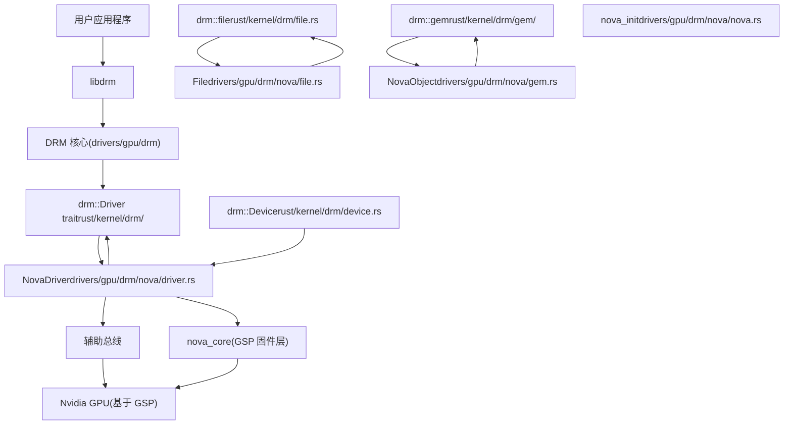
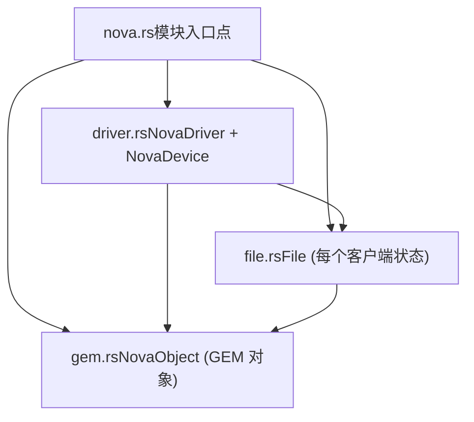
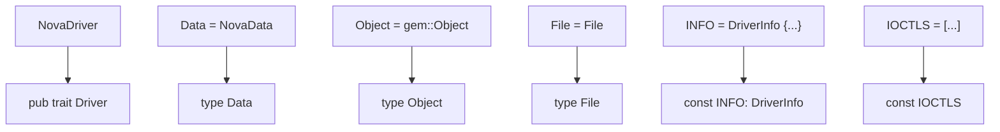
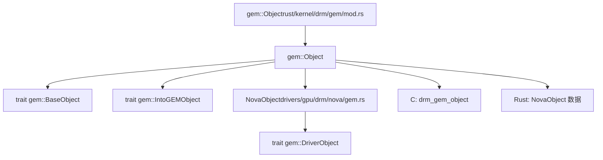
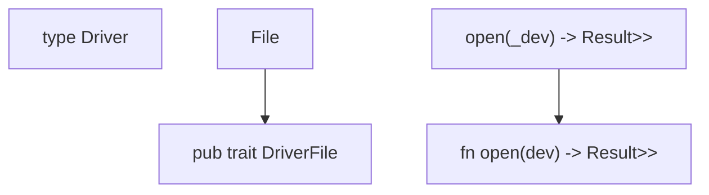
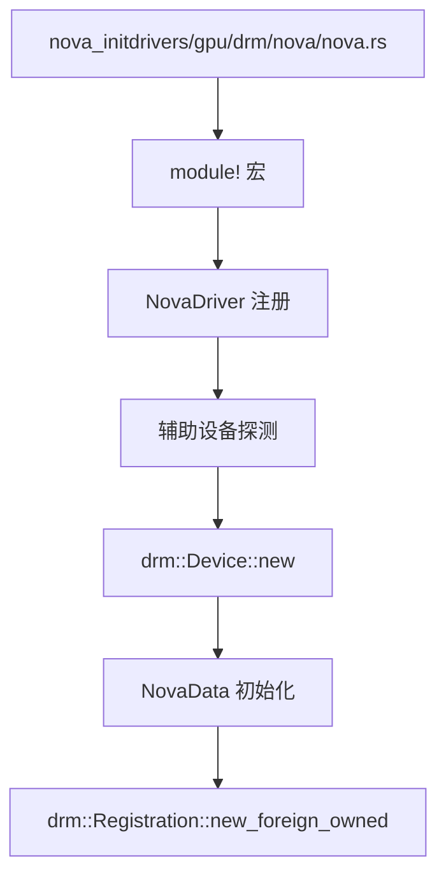
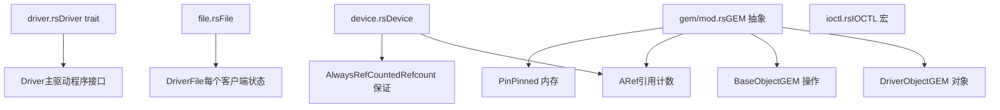
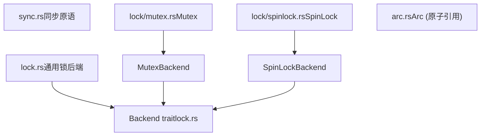
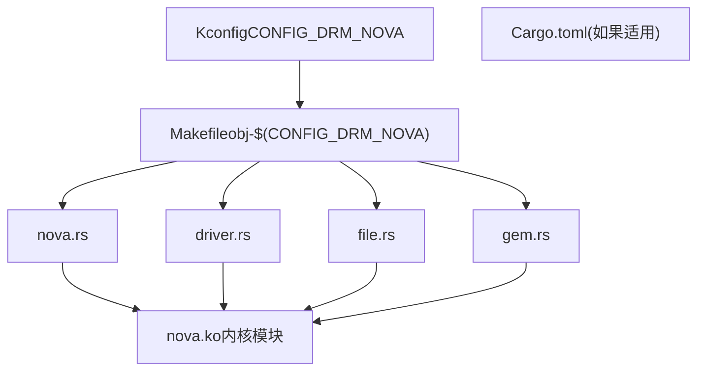

# Nova DRM 图形驱动

相关源文件

-   [MAINTAINERS](https://github.com/torvalds/linux/blob/fcb70a56/MAINTAINERS)
-   [drivers/gpu/drm/drm\_panic\_qr.rs](https://github.com/torvalds/linux/blob/fcb70a56/drivers/gpu/drm/drm_panic_qr.rs)
-   [drivers/gpu/drm/nova/Kconfig](https://github.com/torvalds/linux/blob/fcb70a56/drivers/gpu/drm/nova/Kconfig)
-   [drivers/gpu/drm/nova/Makefile](https://github.com/torvalds/linux/blob/fcb70a56/drivers/gpu/drm/nova/Makefile)
-   [drivers/gpu/drm/nova/driver.rs](https://github.com/torvalds/linux/blob/fcb70a56/drivers/gpu/drm/nova/driver.rs)
-   [drivers/gpu/drm/nova/file.rs](https://github.com/torvalds/linux/blob/fcb70a56/drivers/gpu/drm/nova/file.rs)
-   [drivers/gpu/drm/nova/gem.rs](https://github.com/torvalds/linux/blob/fcb70a56/drivers/gpu/drm/nova/gem.rs)
-   [drivers/gpu/drm/nova/nova.rs](https://github.com/torvalds/linux/blob/fcb70a56/drivers/gpu/drm/nova/nova.rs)
-   [include/linux/rwlock\_rt.h](https://github.com/torvalds/linux/blob/fcb70a56/include/linux/rwlock_rt.h)
-   [include/linux/spinlock\_rt.h](https://github.com/torvalds/linux/blob/fcb70a56/include/linux/spinlock_rt.h)
-   [include/uapi/drm/nova\_drm.h](https://github.com/torvalds/linux/blob/fcb70a56/include/uapi/drm/nova_drm.h)
-   [rust/bindings/bindings\_helper.h](https://github.com/torvalds/linux/blob/fcb70a56/rust/bindings/bindings_helper.h)
-   [rust/helpers/barrier.c](https://github.com/torvalds/linux/blob/fcb70a56/rust/helpers/barrier.c)
-   [rust/helpers/bitmap.c](https://github.com/torvalds/linux/blob/fcb70a56/rust/helpers/bitmap.c)
-   [rust/helpers/bitops.c](https://github.com/torvalds/linux/blob/fcb70a56/rust/helpers/bitops.c)
-   [rust/helpers/drm.c](https://github.com/torvalds/linux/blob/fcb70a56/rust/helpers/drm.c)
-   [rust/helpers/helpers.c](https://github.com/torvalds/linux/blob/fcb70a56/rust/helpers/helpers.c)
-   [rust/helpers/mutex.c](https://github.com/torvalds/linux/blob/fcb70a56/rust/helpers/mutex.c)
-   [rust/helpers/pid\_namespace.c](https://github.com/torvalds/linux/blob/fcb70a56/rust/helpers/pid_namespace.c)
-   [rust/helpers/poll.c](https://github.com/torvalds/linux/blob/fcb70a56/rust/helpers/poll.c)
-   [rust/helpers/security.c](https://github.com/torvalds/linux/blob/fcb70a56/rust/helpers/security.c)
-   [rust/helpers/spinlock.c](https://github.com/torvalds/linux/blob/fcb70a56/rust/helpers/spinlock.c)
-   [rust/helpers/sync.c](https://github.com/torvalds/linux/blob/fcb70a56/rust/helpers/sync.c)
-   [rust/helpers/task.c](https://github.com/torvalds/linux/blob/fcb70a56/rust/helpers/task.c)
-   [rust/kernel/block/mq/tag\_set.rs](https://github.com/torvalds/linux/blob/fcb70a56/rust/kernel/block/mq/tag_set.rs)
-   [rust/kernel/cred.rs](https://github.com/torvalds/linux/blob/fcb70a56/rust/kernel/cred.rs)
-   [rust/kernel/drm/device.rs](https://github.com/torvalds/linux/blob/fcb70a56/rust/kernel/drm/device.rs)
-   [rust/kernel/drm/driver.rs](https://github.com/torvalds/linux/blob/fcb70a56/rust/kernel/drm/driver.rs)
-   [rust/kernel/drm/file.rs](https://github.com/torvalds/linux/blob/fcb70a56/rust/kernel/drm/file.rs)
-   [rust/kernel/drm/gem/mod.rs](https://github.com/torvalds/linux/blob/fcb70a56/rust/kernel/drm/gem/mod.rs)
-   [rust/kernel/drm/mod.rs](https://github.com/torvalds/linux/blob/fcb70a56/rust/kernel/drm/mod.rs)
-   [rust/kernel/lib.rs](https://github.com/torvalds/linux/blob/fcb70a56/rust/kernel/lib.rs)
-   [rust/kernel/pid\_namespace.rs](https://github.com/torvalds/linux/blob/fcb70a56/rust/kernel/pid_namespace.rs)
-   [rust/kernel/security.rs](https://github.com/torvalds/linux/blob/fcb70a56/rust/kernel/security.rs)
-   [rust/kernel/sync.rs](https://github.com/torvalds/linux/blob/fcb70a56/rust/kernel/sync.rs)
-   [rust/kernel/sync/barrier.rs](https://github.com/torvalds/linux/blob/fcb70a56/rust/kernel/sync/barrier.rs)
-   [rust/kernel/sync/condvar.rs](https://github.com/torvalds/linux/blob/fcb70a56/rust/kernel/sync/condvar.rs)
-   [rust/kernel/sync/lock.rs](https://github.com/torvalds/linux/blob/fcb70a56/rust/kernel/sync/lock.rs)
-   [rust/kernel/sync/lock/global.rs](https://github.com/torvalds/linux/blob/fcb70a56/rust/kernel/sync/lock/global.rs)
-   [rust/kernel/sync/lock/mutex.rs](https://github.com/torvalds/linux/blob/fcb70a56/rust/kernel/sync/lock/mutex.rs)
-   [rust/kernel/sync/lock/spinlock.rs](https://github.com/torvalds/linux/blob/fcb70a56/rust/kernel/sync/lock/spinlock.rs)
-   [rust/kernel/sync/poll.rs](https://github.com/torvalds/linux/blob/fcb70a56/rust/kernel/sync/poll.rs)
-   [rust/kernel/sync/set\_once.rs](https://github.com/torvalds/linux/blob/fcb70a56/rust/kernel/sync/set_once.rs)
-   [rust/kernel/task.rs](https://github.com/torvalds/linux/blob/fcb70a56/rust/kernel/task.rs)

## 目的与范围

Nova DRM 图形驱动是一个用于 Nvidia GSP (GPU 系统处理器) 架构 GPU 的 Rust 基础直接渲染管理器 (DRM) 驱动程序。本文档涵盖了驱动程序的架构、核心组件、内存管理以及与 Linux DRM 子系统的集成。该驱动程序目前处于开发阶段，可能尚未完全发挥作用。

有关 Linux 内核中 Rust 集成的通用信息，请参阅 [Rust for Linux](/torvalds/linux/2-rust-for-linux)。有关 Nova 使用的 DRM 核心抽象的详细信息，请参阅 [Rust 内核 API 与抽象](/torvalds/linux/2.1-rust-kernel-apis-and-abstractions) 中的 Rust 内核 API 文档。

## 架构概览

Nova 是作为利用内核中 Rust DRM 抽象的 DRM 驱动程序实现的。它位于 GPU/显示子系统内，并通过标准 DRM IOCTL 与用户空间接口。

来源：[drivers/gpu/drm/nova/Kconfig1-17](https://github.com/torvalds/linux/blob/fcb70a56/drivers/gpu/drm/nova/Kconfig#L1-L17) [drivers/gpu/drm/nova/nova.rs1-9](https://github.com/torvalds/linux/blob/fcb70a56/drivers/gpu/drm/nova/nova.rs#L1-L9) [rust/kernel/drm/mod.rs1-20](https://github.com/torvalds/linux/blob/fcb70a56/rust/kernel/drm/mod.rs#L1-L20)

Nova 驱动程序架构遵循标准 DRM 驱动程序模型，但使用 Rust 实现：

1.  **DRM Core** 为 GPU 驱动程序提供基础设施
2.  **Rust DRM Abstractions** 用安全的 Rust 接口包装 C DRM API
3.  **Nova Driver** 为 Nvidia GSP 架构 GPU 实现这些抽象
4.  **Auxiliary Bus** 和 **Nova Core** 处理与 GPU 固件的通信

## 驱动程序结构

Nova 驱动程序由四个主要的 Rust 模块组成：

来源：[drivers/gpu/drm/nova/nova.rs1-9](https://github.com/torvalds/linux/blob/fcb70a56/drivers/gpu/drm/nova/nova.rs#L1-L9) [drivers/gpu/drm/nova/Makefile1-4](https://github.com/torvalds/linux/blob/fcb70a56/drivers/gpu/drm/nova/Makefile#L1-L4)

### NovaDriver 实现

`NovaDriver` 结构体实现了 `drm::Driver` trait，这是 Rust 中 DRM 驱动程序的主要接口。

**关键组件：**

| 组件 | 类型 | 用途 |
| --- | --- | --- |
| `NovaDriver` | `struct` | 主驱动程序实现 |
| `NovaDevice` | 类型别名 `drm::Device<NovaDriver>` | 设备实例 |
| `File` | `struct` | 每个客户端文件状态 |
| `NovaObject` | `struct` | GEM 对象实现 |

来源：[drivers/gpu/drm/nova/driver.rs1-68](https://github.com/torvalds/linux/blob/fcb70a56/drivers/gpu/drm/nova/driver.rs#L1-L68)

### Driver Trait 实现

`NovaDriver` 实现了必需的 `drm::Driver` trait：

来源：[rust/kernel/drm/driver.rs96-116](https://github.com/torvalds/linux/blob/fcb70a56/rust/kernel/drm/driver.rs#L96-L116) [drivers/gpu/drm/nova/driver.rs13-46](https://github.com/torvalds/linux/blob/fcb70a56/drivers/gpu/drm/nova/driver.rs#L13-L46)

`NovaData` 结构体持有驱动程序的设备特定数据：

-   `adev`：辅助设备的引用
-   初始化期间检索到的设备信息

来源：[drivers/gpu/drm/nova/driver.rs15-22](https://github.com/torvalds/linux/blob/fcb70a56/drivers/gpu/drm/nova/driver.rs#L15-L22)

## 内存管理：GEM 对象

Nova 使用 DRM 图形执行管理器 (GEM) API 进行 GPU 内存管理。实现位于 [drivers/gpu/drm/nova/gem.rs1-48](https://github.com/torvalds/linux/blob/fcb70a56/drivers/gpu/drm/nova/gem.rs#L1-L48)

### NovaObject 结构

来源：[drivers/gpu/drm/nova/gem.rs1-48](https://github.com/torvalds/linux/blob/fcb70a56/drivers/gpu/drm/nova/gem.rs#L1-L48) [rust/kernel/drm/gem/mod.rs1-316](https://github.com/torvalds/linux/blob/fcb70a56/rust/kernel/drm/gem/mod.rs#L1-L316)

### GEM 对象操作

`NovaObject` 结构体实现了需要以下的 `gem::DriverObject`：

**必需方法：**

| 方法 | 签名 | 用途 |
| --- | --- | --- |
| `new()` | `fn new(dev: &NovaDevice, size: usize) -> impl PinInit<Self, Error>` | 创建新的 GEM 对象 |

**附加操作：**

Nova 为通用 GEM 操作提供了包装器方法：

-   `NovaObject::new()` - 创建具有页对齐大小的新 GEM 对象
-   `NovaObject::lookup_handle()` - 通过给定文件的句柄查找 GEM 对象

来源：[drivers/gpu/drm/nova/gem.rs19-47](https://github.com/torvalds/linux/blob/fcb70a56/drivers/gpu/drm/nova/gem.rs#L19-L47) [rust/kernel/drm/gem/mod.rs26-40](https://github.com/torvalds/linux/blob/fcb70a56/rust/kernel/drm/gem/mod.rs#L26-L40)

### 内存分配流程

> **[Mermaid sequence]**
> *(图表结构无法解析)*

来源：[drivers/gpu/drm/nova/file.rs45-55](https://github.com/torvalds/linux/blob/fcb70a56/drivers/gpu/drm/nova/file.rs#L45-L55) [drivers/gpu/drm/nova/gem.rs29-37](https://github.com/torvalds/linux/blob/fcb70a56/drivers/gpu/drm/nova/gem.rs#L29-L37) [rust/kernel/drm/gem/mod.rs198-221](https://github.com/torvalds/linux/blob/fcb70a56/rust/kernel/drm/gem/mod.rs#L198-L221)

## 文件操作与 IOCTL

Nova 驱动程序暴露了几个 IOCTL 用于用户空间交互。这些由 [drivers/gpu/drm/nova/file.rs1-70](https://github.com/torvalds/linux/blob/fcb70a56/drivers/gpu/drm/nova/file.rs#L1-L70) 中的 `File` 结构体处理。

### 文件结构

`File` 结构体表示每个客户端状态。它实现了 `drm::file::DriverFile` trait：

**实现：**

来源：[drivers/gpu/drm/nova/file.rs13-21](https://github.com/torvalds/linux/blob/fcb70a56/drivers/gpu/drm/nova/file.rs#L13-L21) [rust/kernel/drm/file.rs1-133](https://github.com/torvalds/linux/blob/fcb70a56/rust/kernel/drm/file.rs#L1-L133)

### IOCTL 操作

Nova 实现了三个主要的 IOCTL：

**IOCTL 摘要：**

| IOCTL | 处理程序 | 用途 | UAPI 结构体 |
| --- | --- | --- | --- |
| `DRM_IOCTL_NOVA_GETPARAM` | `File::get_param()` | 查询 GPU/驱动程序元数据 | `drm_nova_getparam` |
| `DRM_IOCTL_NOVA_GEM_CREATE` | `File::gem_create()` | 创建新 GEM 对象 | `drm_nova_gem_create` |
| `DRM_IOCTL_NOVA_GEM_INFO` | `File::gem_info()` | 查询 GEM 对象元数据 | `drm_nova_gem_info` |

来源：[drivers/gpu/drm/nova/file.rs24-69](https://github.com/torvalds/linux/blob/fcb70a56/drivers/gpu/drm/nova/file.rs#L24-L69) [include/uapi/drm/nova\_drm.h1-81](https://github.com/torvalds/linux/blob/fcb70a56/include/uapi/drm/nova_drm.h#L1-L81)

### IOCTL 实现流程

> **[Mermaid sequence]**
> *(图表结构无法解析)*

来源：[drivers/gpu/drm/nova/file.rs24-69](https://github.com/torvalds/linux/blob/fcb70a56/drivers/gpu/drm/nova/file.rs#L24-L69) [rust/kernel/drm/ioctl.rs1-138](https://github.com/torvalds/linux/blob/fcb70a56/rust/kernel/drm/ioctl.rs#L1-L138)

### GETPARAM 实现

`get_param()` 方法查询设备参数：

**支持的参数：**

| 参数 | 值来源 | 描述 |
| --- | --- | --- |
| `NOVA_GETPARAM_VRAM_BAR_SIZE` | `pdev.resource_len(1)` | VRAM BAR 的大小（PCI 资源 1） |

来源：[drivers/gpu/drm/nova/file.rs25-42](https://github.com/torvalds/linux/blob/fcb70a56/drivers/gpu/drm/nova/file.rs#L25-L42) [include/uapi/drm/nova\_drm.h10-23](https://github.com/torvalds/linux/blob/fcb70a56/include/uapi/drm/nova_drm.h#L10-L23)

## 初始化与注册

Nova 驱动程序初始化遵循带有 DRM 注册的标准内核模块初始化模式。

### 模块入口点

来源：[drivers/gpu/drm/nova/nova.rs1-9](https://github.com/torvalds/linux/blob/fcb70a56/drivers/gpu/drm/nova/nova.rs#L1-L9) [drivers/gpu/drm/nova/driver.rs48-68](https://github.com/torvalds/linux/blob/fcb70a56/drivers/gpu/drm/nova/driver.rs#L48-L68)

### 设备创建流程

驱动程序在 probe 期间创建 `drm::Device` 实例：

**步骤：**

1.  **Probe 回调** 接收辅助设备
2.  **NovaData 初始化** 包装设备引用
3.  **drm::Device::new()** 分配设备结构
4.  **Registration** 通过 `drm::Registration::new_foreign_owned()` 向 DRM 子系统注册

来源：[drivers/gpu/drm/nova/driver.rs48-68](https://github.com/torvalds/linux/blob/fcb70a56/drivers/gpu/drm/nova/driver.rs#L48-L68) [rust/kernel/drm/device.rs98-136](https://github.com/torvalds/linux/blob/fcb70a56/rust/kernel/drm/device.rs#L98-L136) [rust/kernel/drm/driver.rs124-149](https://github.com/torvalds/linux/blob/fcb70a56/rust/kernel/drm/driver.rs#L124-L149)

### 驱动程序信息

驱动程序通过 `INFO` 常量提供元数据：

**DriverInfo 字段：**

| 字段 | 值 | 用途 |
| --- | --- | --- |
| `major` | 0 | 主版本号 |
| `minor` | 0 | 次版本号 |
| `patchlevel` | 0 | 补丁级别 |
| `name` | `c"nova"` | 驱动程序名称 |
| `desc` | `c"NVIDIA Nova"` | 描述 |

来源：[drivers/gpu/drm/nova/driver.rs32-38](https://github.com/torvalds/linux/blob/fcb70a56/drivers/gpu/drm/nova/driver.rs#L32-L38) [rust/kernel/drm/driver.rs18-30](https://github.com/torvalds/linux/blob/fcb70a56/rust/kernel/drm/driver.rs#L18-L30)

## Rust DRM 抽象

Nova 利用内核提供的 Rust DRM 抽象。这些抽象确保内存安全并为 C DRM 子系统提供符合 Rust 惯用的接口。

### 核心抽象

来源：[rust/kernel/drm/mod.rs1-20](https://github.com/torvalds/linux/blob/fcb70a56/rust/kernel/drm/mod.rs#L1-L20) [rust/kernel/drm/driver.rs1-171](https://github.com/torvalds/linux/blob/fcb70a56/rust/kernel/drm/driver.rs#L1-L171) [rust/kernel/drm/gem/mod.rs1-316](https://github.com/torvalds/linux/blob/fcb70a56/rust/kernel/drm/gem/mod.rs#L1-L316)

### 类型安全特性

Rust 抽象提供了几个安全保证：

**安全保证：**

| 特性 | 实现 | 优势 |
| --- | --- | --- |
| 引用计数 | 带有 `AlwaysRefCounted` 的 `ARef<T>` | 防止释放后使用 (use-after-free) |
| Pinning | 用于自引用结构体的 `Pin<T>` | 防止内存破坏 |
| 类型状态 | 编译时文件/对象关联 | 防止类型混淆 |
| 生命周期跟踪 | Rust 借用检查器 | 确保引用有效 |

来源：[rust/kernel/sync/aref.rs1-437](https://github.com/torvalds/linux/blob/fcb70a56/rust/kernel/sync/aref.rs#L1-L437) [rust/kernel/drm/device.rs50-230](https://github.com/torvalds/linux/blob/fcb70a56/rust/kernel/drm/device.rs#L50-L230) [rust/kernel/drm/gem/mod.rs42-56](https://github.com/torvalds/linux/blob/fcb70a56/rust/kernel/drm/gem/mod.rs#L42-L56)

### 同步原语

Nova 使用 Rust 同步原语以确保线程安全：

来源：[rust/kernel/sync/mod.rs1-126](https://github.com/torvalds/linux/blob/fcb70a56/rust/kernel/sync/mod.rs#L1-L126) [rust/kernel/sync/lock.rs1-318](https://github.com/torvalds/linux/blob/fcb70a56/rust/kernel/sync/lock.rs#L1-L318) [rust/kernel/sync/lock/mutex.rs1-186](https://github.com/torvalds/linux/blob/fcb70a56/rust/kernel/sync/lock/mutex.rs#L1-L186) [rust/kernel/sync/lock/spinlock.rs1-131](https://github.com/torvalds/linux/blob/fcb70a56/rust/kernel/sync/lock/spinlock.rs#L1-L131)

### 设备生命周期

`drm::Device<T>` 管理具有自动清理功能的设备生命周期：

**生命周期事件：**

1.  **创建** - `drm::Device::new()` 分配设备
2.  **注册** - `drm::Registration::new_foreign_owned()` 向 DRM 注册
3.  **引用计数** - `ARef<drm::Device<T>>` 跟踪引用
4.  **清理** - Drop 实现释放资源
5.  **注销** - `Registration` drop 注销设备

来源：[rust/kernel/drm/device.rs98-189](https://github.com/torvalds/linux/blob/fcb70a56/rust/kernel/drm/device.rs#L98-L189) [rust/kernel/drm/driver.rs119-170](https://github.com/torvalds/linux/blob/fcb70a56/rust/kernel/drm/driver.rs#L119-L170)

## 配置与构建系统

### Kconfig 集成

Nova 需要特定的内核配置：

**必需选项：**

| 选项 | 要求 | 原因 |
| --- | --- | --- |
| `CONFIG_64BIT` | 必需 | 64 位架构 |
| `CONFIG_DRM=y` | 内置 | DRM 必须内置以支持 Rust |
| `CONFIG_PCI` | 必需 | PCI 设备支持 |
| `CONFIG_RUST` | 必需 | Rust 支持 |
| `CONFIG_AUXILIARY_BUS` | 选中 | 辅助总线框架 |
| `CONFIG_NOVA_CORE` | 选中 | Nova 核心固件层 |

来源：[drivers/gpu/drm/nova/Kconfig1-17](https://github.com/torvalds/linux/blob/fcb70a56/drivers/gpu/drm/nova/Kconfig#L1-L17)

### 构建配置

驱动程序构建为内核模块：

来源：[drivers/gpu/drm/nova/Kconfig1-17](https://github.com/torvalds/linux/blob/fcb70a56/drivers/gpu/drm/nova/Kconfig#L1-L17) [drivers/gpu/drm/nova/Makefile1-4](https://github.com/torvalds/linux/blob/fcb70a56/drivers/gpu/drm/nova/Makefile#L1-L4)

模块名为 `nova`，如果构建为模块 (`CONFIG_DRM_NOVA=m`)，则可以使用 `modprobe nova` 加载。
