# 虚拟化

相关源文件

-   [Documentation/virt/kvm/api.rst](https://github.com/torvalds/linux/blob/fcb70a56/Documentation/virt/kvm/api.rst)
-   [Documentation/virt/kvm/locking.rst](https://github.com/torvalds/linux/blob/fcb70a56/Documentation/virt/kvm/locking.rst)
-   [Documentation/virt/kvm/x86/index.rst](https://github.com/torvalds/linux/blob/fcb70a56/Documentation/virt/kvm/x86/index.rst)
-   [Documentation/virt/kvm/x86/intel-tdx.rst](https://github.com/torvalds/linux/blob/fcb70a56/Documentation/virt/kvm/x86/intel-tdx.rst)
-   [arch/arm64/include/asm/esr.h](https://github.com/torvalds/linux/blob/fcb70a56/arch/arm64/include/asm/esr.h)
-   [arch/arm64/include/asm/kvm\_arm.h](https://github.com/torvalds/linux/blob/fcb70a56/arch/arm64/include/asm/kvm_arm.h)
-   [arch/arm64/include/asm/kvm\_asm.h](https://github.com/torvalds/linux/blob/fcb70a56/arch/arm64/include/asm/kvm_asm.h)
-   [arch/arm64/include/asm/kvm\_emulate.h](https://github.com/torvalds/linux/blob/fcb70a56/arch/arm64/include/asm/kvm_emulate.h)
-   [arch/arm64/include/asm/kvm\_host.h](https://github.com/torvalds/linux/blob/fcb70a56/arch/arm64/include/asm/kvm_host.h)
-   [arch/arm64/include/asm/kvm\_mmu.h](https://github.com/torvalds/linux/blob/fcb70a56/arch/arm64/include/asm/kvm_mmu.h)
-   [arch/arm64/include/asm/kvm\_nested.h](https://github.com/torvalds/linux/blob/fcb70a56/arch/arm64/include/asm/kvm_nested.h)
-   [arch/arm64/include/asm/kvm\_pgtable.h](https://github.com/torvalds/linux/blob/fcb70a56/arch/arm64/include/asm/kvm_pgtable.h)
-   [arch/arm64/include/asm/kvm\_pkvm.h](https://github.com/torvalds/linux/blob/fcb70a56/arch/arm64/include/asm/kvm_pkvm.h)
-   [arch/arm64/include/asm/memory.h](https://github.com/torvalds/linux/blob/fcb70a56/arch/arm64/include/asm/memory.h)
-   [arch/arm64/include/asm/por.h](https://github.com/torvalds/linux/blob/fcb70a56/arch/arm64/include/asm/por.h)
-   [arch/arm64/include/asm/stacktrace/nvhe.h](https://github.com/torvalds/linux/blob/fcb70a56/arch/arm64/include/asm/stacktrace/nvhe.h)
-   [arch/arm64/include/asm/sysreg.h](https://github.com/torvalds/linux/blob/fcb70a56/arch/arm64/include/asm/sysreg.h)
-   [arch/arm64/kvm/Makefile](https://github.com/torvalds/linux/blob/fcb70a56/arch/arm64/kvm/Makefile)
-   [arch/arm64/kvm/arch\_timer.c](https://github.com/torvalds/linux/blob/fcb70a56/arch/arm64/kvm/arch_timer.c)
-   [arch/arm64/kvm/arm.c](https://github.com/torvalds/linux/blob/fcb70a56/arch/arm64/kvm/arm.c)
-   [arch/arm64/kvm/at.c](https://github.com/torvalds/linux/blob/fcb70a56/arch/arm64/kvm/at.c)
-   [arch/arm64/kvm/config.c](https://github.com/torvalds/linux/blob/fcb70a56/arch/arm64/kvm/config.c)
-   [arch/arm64/kvm/debug.c](https://github.com/torvalds/linux/blob/fcb70a56/arch/arm64/kvm/debug.c)
-   [arch/arm64/kvm/emulate-nested.c](https://github.com/torvalds/linux/blob/fcb70a56/arch/arm64/kvm/emulate-nested.c)
-   [arch/arm64/kvm/fpsimd.c](https://github.com/torvalds/linux/blob/fcb70a56/arch/arm64/kvm/fpsimd.c)
-   [arch/arm64/kvm/guest.c](https://github.com/torvalds/linux/blob/fcb70a56/arch/arm64/kvm/guest.c)
-   [arch/arm64/kvm/handle\_exit.c](https://github.com/torvalds/linux/blob/fcb70a56/arch/arm64/kvm/handle_exit.c)
-   [arch/arm64/kvm/hyp/entry.S](https://github.com/torvalds/linux/blob/fcb70a56/arch/arm64/kvm/hyp/entry.S)
-   [arch/arm64/kvm/hyp/exception.c](https://github.com/torvalds/linux/blob/fcb70a56/arch/arm64/kvm/hyp/exception.c)
-   [arch/arm64/kvm/hyp/include/hyp/debug-sr.h](https://github.com/torvalds/linux/blob/fcb70a56/arch/arm64/kvm/hyp/include/hyp/debug-sr.h)
-   [arch/arm64/kvm/hyp/include/hyp/fault.h](https://github.com/torvalds/linux/blob/fcb70a56/arch/arm64/kvm/hyp/include/hyp/fault.h)
-   [arch/arm64/kvm/hyp/include/hyp/switch.h](https://github.com/torvalds/linux/blob/fcb70a56/arch/arm64/kvm/hyp/include/hyp/switch.h)
-   [arch/arm64/kvm/hyp/include/hyp/sysreg-sr.h](https://github.com/torvalds/linux/blob/fcb70a56/arch/arm64/kvm/hyp/include/hyp/sysreg-sr.h)
-   [arch/arm64/kvm/hyp/include/nvhe/gfp.h](https://github.com/torvalds/linux/blob/fcb70a56/arch/arm64/kvm/hyp/include/nvhe/gfp.h)
-   [arch/arm64/kvm/hyp/include/nvhe/mem\_protect.h](https://github.com/torvalds/linux/blob/fcb70a56/arch/arm64/kvm/hyp/include/nvhe/mem_protect.h)
-   [arch/arm64/kvm/hyp/include/nvhe/memory.h](https://github.com/torvalds/linux/blob/fcb70a56/arch/arm64/kvm/hyp/include/nvhe/memory.h)
-   [arch/arm64/kvm/hyp/include/nvhe/mm.h](https://github.com/torvalds/linux/blob/fcb70a56/arch/arm64/kvm/hyp/include/nvhe/mm.h)
-   [arch/arm64/kvm/hyp/include/nvhe/pkvm.h](https://github.com/torvalds/linux/blob/fcb70a56/arch/arm64/kvm/hyp/include/nvhe/pkvm.h)
-   [arch/arm64/kvm/hyp/nvhe/debug-sr.c](https://github.com/torvalds/linux/blob/fcb70a56/arch/arm64/kvm/hyp/nvhe/debug-sr.c)
-   [arch/arm64/kvm/hyp/nvhe/hyp-main.c](https://github.com/torvalds/linux/blob/fcb70a56/arch/arm64/kvm/hyp/nvhe/hyp-main.c)
-   [arch/arm64/kvm/hyp/nvhe/mem\_protect.c](https://github.com/torvalds/linux/blob/fcb70a56/arch/arm64/kvm/hyp/nvhe/mem_protect.c)
-   [arch/arm64/kvm/hyp/nvhe/mm.c](https://github.com/torvalds/linux/blob/fcb70a56/arch/arm64/kvm/hyp/nvhe/mm.c)
-   [arch/arm64/kvm/hyp/nvhe/page\_alloc.c](https://github.com/torvalds/linux/blob/fcb70a56/arch/arm64/kvm/hyp/nvhe/page_alloc.c)
-   [arch/arm64/kvm/hyp/nvhe/pkvm.c](https://github.com/torvalds/linux/blob/fcb70a56/arch/arm64/kvm/hyp/nvhe/pkvm.c)
-   [arch/arm64/kvm/hyp/nvhe/setup.c](https://github.com/torvalds/linux/blob/fcb70a56/arch/arm64/kvm/hyp/nvhe/setup.c)
-   [arch/arm64/kvm/hyp/nvhe/stacktrace.c](https://github.com/torvalds/linux/blob/fcb70a56/arch/arm64/kvm/hyp/nvhe/stacktrace.c)
-   [arch/arm64/kvm/hyp/nvhe/switch.c](https://github.com/torvalds/linux/blob/fcb70a56/arch/arm64/kvm/hyp/nvhe/switch.c)
-   [arch/arm64/kvm/hyp/nvhe/sys\_regs.c](https://github.com/torvalds/linux/blob/fcb70a56/arch/arm64/kvm/hyp/nvhe/sys_regs.c)
-   [arch/arm64/kvm/hyp/nvhe/sysreg-sr.c](https://github.com/torvalds/linux/blob/fcb70a56/arch/arm64/kvm/hyp/nvhe/sysreg-sr.c)
-   [arch/arm64/kvm/hyp/nvhe/timer-sr.c](https://github.com/torvalds/linux/blob/fcb70a56/arch/arm64/kvm/hyp/nvhe/timer-sr.c)
-   [arch/arm64/kvm/hyp/pgtable.c](https://github.com/torvalds/linux/blob/fcb70a56/arch/arm64/kvm/hyp/pgtable.c)
-   [arch/arm64/kvm/hyp/vhe/debug-sr.c](https://github.com/torvalds/linux/blob/fcb70a56/arch/arm64/kvm/hyp/vhe/debug-sr.c)
-   [arch/arm64/kvm/hyp/vhe/switch.c](https://github.com/torvalds/linux/blob/fcb70a56/arch/arm64/kvm/hyp/vhe/switch.c)
-   [arch/arm64/kvm/hyp/vhe/sysreg-sr.c](https://github.com/torvalds/linux/blob/fcb70a56/arch/arm64/kvm/hyp/vhe/sysreg-sr.c)
-   [arch/arm64/kvm/inject\_fault.c](https://github.com/torvalds/linux/blob/fcb70a56/arch/arm64/kvm/inject_fault.c)
-   [arch/arm64/kvm/mmu.c](https://github.com/torvalds/linux/blob/fcb70a56/arch/arm64/kvm/mmu.c)
-   [arch/arm64/kvm/nested.c](https://github.com/torvalds/linux/blob/fcb70a56/arch/arm64/kvm/nested.c)
-   [arch/arm64/kvm/pkvm.c](https://github.com/torvalds/linux/blob/fcb70a56/arch/arm64/kvm/pkvm.c)
-   [arch/arm64/kvm/pmu-emul.c](https://github.com/torvalds/linux/blob/fcb70a56/arch/arm64/kvm/pmu-emul.c)
-   [arch/arm64/kvm/reset.c](https://github.com/torvalds/linux/blob/fcb70a56/arch/arm64/kvm/reset.c)
-   [arch/arm64/kvm/stacktrace.c](https://github.com/torvalds/linux/blob/fcb70a56/arch/arm64/kvm/stacktrace.c)
-   [arch/arm64/kvm/sys\_regs.c](https://github.com/torvalds/linux/blob/fcb70a56/arch/arm64/kvm/sys_regs.c)
-   [arch/arm64/kvm/sys\_regs.h](https://github.com/torvalds/linux/blob/fcb70a56/arch/arm64/kvm/sys_regs.h)
-   [arch/arm64/kvm/va\_layout.c](https://github.com/torvalds/linux/blob/fcb70a56/arch/arm64/kvm/va_layout.c)
-   [arch/arm64/kvm/vgic/vgic-v5.c](https://github.com/torvalds/linux/blob/fcb70a56/arch/arm64/kvm/vgic/vgic-v5.c)
-   [arch/arm64/tools/sysreg](https://github.com/torvalds/linux/blob/fcb70a56/arch/arm64/tools/sysreg)
-   [arch/loongarch/kvm/Kconfig](https://github.com/torvalds/linux/blob/fcb70a56/arch/loongarch/kvm/Kconfig)
-   [arch/mips/kvm/Kconfig](https://github.com/torvalds/linux/blob/fcb70a56/arch/mips/kvm/Kconfig)
-   [arch/powerpc/kvm/Kconfig](https://github.com/torvalds/linux/blob/fcb70a56/arch/powerpc/kvm/Kconfig)
-   [arch/riscv/kvm/Kconfig](https://github.com/torvalds/linux/blob/fcb70a56/arch/riscv/kvm/Kconfig)
-   [arch/s390/kvm/Kconfig](https://github.com/torvalds/linux/blob/fcb70a56/arch/s390/kvm/Kconfig)
-   [arch/x86/coco/tdx/Makefile](https://github.com/torvalds/linux/blob/fcb70a56/arch/x86/coco/tdx/Makefile)
-   [arch/x86/coco/tdx/debug.c](https://github.com/torvalds/linux/blob/fcb70a56/arch/x86/coco/tdx/debug.c)
-   [arch/x86/coco/tdx/tdx.c](https://github.com/torvalds/linux/blob/fcb70a56/arch/x86/coco/tdx/tdx.c)
-   [arch/x86/include/asm/apic.h](https://github.com/torvalds/linux/blob/fcb70a56/arch/x86/include/asm/apic.h)
-   [arch/x86/include/asm/hw\_irq.h](https://github.com/torvalds/linux/blob/fcb70a56/arch/x86/include/asm/hw_irq.h)
-   [arch/x86/include/asm/irq\_remapping.h](https://github.com/torvalds/linux/blob/fcb70a56/arch/x86/include/asm/irq_remapping.h)
-   [arch/x86/include/asm/kvm-x86-ops.h](https://github.com/torvalds/linux/blob/fcb70a56/arch/x86/include/asm/kvm-x86-ops.h)
-   [arch/x86/include/asm/kvm\_host.h](https://github.com/torvalds/linux/blob/fcb70a56/arch/x86/include/asm/kvm_host.h)
-   [arch/x86/include/asm/posted\_intr.h](https://github.com/torvalds/linux/blob/fcb70a56/arch/x86/include/asm/posted_intr.h)
-   [arch/x86/include/asm/shared/tdx.h](https://github.com/torvalds/linux/blob/fcb70a56/arch/x86/include/asm/shared/tdx.h)
-   [arch/x86/include/asm/svm.h](https://github.com/torvalds/linux/blob/fcb70a56/arch/x86/include/asm/svm.h)
-   [arch/x86/include/asm/tdx.h](https://github.com/torvalds/linux/blob/fcb70a56/arch/x86/include/asm/tdx.h)
-   [arch/x86/include/asm/tdx\_global\_metadata.h](https://github.com/torvalds/linux/blob/fcb70a56/arch/x86/include/asm/tdx_global_metadata.h)
-   [arch/x86/include/asm/vmx.h](https://github.com/torvalds/linux/blob/fcb70a56/arch/x86/include/asm/vmx.h)
-   [arch/x86/include/uapi/asm/kvm.h](https://github.com/torvalds/linux/blob/fcb70a56/arch/x86/include/uapi/asm/kvm.h)
-   [arch/x86/include/uapi/asm/svm.h](https://github.com/torvalds/linux/blob/fcb70a56/arch/x86/include/uapi/asm/svm.h)
-   [arch/x86/include/uapi/asm/vmx.h](https://github.com/torvalds/linux/blob/fcb70a56/arch/x86/include/uapi/asm/vmx.h)
-   [arch/x86/kernel/apic/io\_apic.c](https://github.com/torvalds/linux/blob/fcb70a56/arch/x86/kernel/apic/io_apic.c)
-   [arch/x86/kernel/apic/msi.c](https://github.com/torvalds/linux/blob/fcb70a56/arch/x86/kernel/apic/msi.c)
-   [arch/x86/kernel/irq.c](https://github.com/torvalds/linux/blob/fcb70a56/arch/x86/kernel/irq.c)
-   [arch/x86/kvm/Kconfig](https://github.com/torvalds/linux/blob/fcb70a56/arch/x86/kvm/Kconfig)
-   [arch/x86/kvm/Makefile](https://github.com/torvalds/linux/blob/fcb70a56/arch/x86/kvm/Makefile)
-   [arch/x86/kvm/hyperv.c](https://github.com/torvalds/linux/blob/fcb70a56/arch/x86/kvm/hyperv.c)
-   [arch/x86/kvm/irq.c](https://github.com/torvalds/linux/blob/fcb70a56/arch/x86/kvm/irq.c)
-   [arch/x86/kvm/irq.h](https://github.com/torvalds/linux/blob/fcb70a56/arch/x86/kvm/irq.h)
-   [arch/x86/kvm/kvm\_onhyperv.c](https://github.com/torvalds/linux/blob/fcb70a56/arch/x86/kvm/kvm_onhyperv.c)
-   [arch/x86/kvm/lapic.c](https://github.com/torvalds/linux/blob/fcb70a56/arch/x86/kvm/lapic.c)
-   [arch/x86/kvm/lapic.h](https://github.com/torvalds/linux/blob/fcb70a56/arch/x86/kvm/lapic.h)
-   [arch/x86/kvm/mmu.h](https://github.com/torvalds/linux/blob/fcb70a56/arch/x86/kvm/mmu.h)
-   [arch/x86/kvm/mmu/mmu.c](https://github.com/torvalds/linux/blob/fcb70a56/arch/x86/kvm/mmu/mmu.c)
-   [arch/x86/kvm/mmu/mmu\_internal.h](https://github.com/torvalds/linux/blob/fcb70a56/arch/x86/kvm/mmu/mmu_internal.h)
-   [arch/x86/kvm/mmu/paging\_tmpl.h](https://github.com/torvalds/linux/blob/fcb70a56/arch/x86/kvm/mmu/paging_tmpl.h)
-   [arch/x86/kvm/mmu/spte.c](https://github.com/torvalds/linux/blob/fcb70a56/arch/x86/kvm/mmu/spte.c)
-   [arch/x86/kvm/mmu/spte.h](https://github.com/torvalds/linux/blob/fcb70a56/arch/x86/kvm/mmu/spte.h)
-   [arch/x86/kvm/mmu/tdp\_iter.c](https://github.com/torvalds/linux/blob/fcb70a56/arch/x86/kvm/mmu/tdp_iter.c)
-   [arch/x86/kvm/mmu/tdp\_iter.h](https://github.com/torvalds/linux/blob/fcb70a56/arch/x86/kvm/mmu/tdp_iter.h)
-   [arch/x86/kvm/mmu/tdp\_mmu.c](https://github.com/torvalds/linux/blob/fcb70a56/arch/x86/kvm/mmu/tdp_mmu.c)
-   [arch/x86/kvm/mmu/tdp\_mmu.h](https://github.com/torvalds/linux/blob/fcb70a56/arch/x86/kvm/mmu/tdp_mmu.h)
-   [arch/x86/kvm/pmu.c](https://github.com/torvalds/linux/blob/fcb70a56/arch/x86/kvm/pmu.c)
-   [arch/x86/kvm/pmu.h](https://github.com/torvalds/linux/blob/fcb70a56/arch/x86/kvm/pmu.h)
-   [arch/x86/kvm/smm.c](https://github.com/torvalds/linux/blob/fcb70a56/arch/x86/kvm/smm.c)
-   [arch/x86/kvm/smm.h](https://github.com/torvalds/linux/blob/fcb70a56/arch/x86/kvm/smm.h)
-   [arch/x86/kvm/svm/avic.c](https://github.com/torvalds/linux/blob/fcb70a56/arch/x86/kvm/svm/avic.c)
-   [arch/x86/kvm/svm/nested.c](https://github.com/torvalds/linux/blob/fcb70a56/arch/x86/kvm/svm/nested.c)
-   [arch/x86/kvm/svm/pmu.c](https://github.com/torvalds/linux/blob/fcb70a56/arch/x86/kvm/svm/pmu.c)
-   [arch/x86/kvm/svm/sev.c](https://github.com/torvalds/linux/blob/fcb70a56/arch/x86/kvm/svm/sev.c)
-   [arch/x86/kvm/svm/svm.c](https://github.com/torvalds/linux/blob/fcb70a56/arch/x86/kvm/svm/svm.c)
-   [arch/x86/kvm/svm/svm.h](https://github.com/torvalds/linux/blob/fcb70a56/arch/x86/kvm/svm/svm.h)
-   [arch/x86/kvm/svm/svm\_onhyperv.c](https://github.com/torvalds/linux/blob/fcb70a56/arch/x86/kvm/svm/svm_onhyperv.c)
-   [arch/x86/kvm/svm/svm\_onhyperv.h](https://github.com/torvalds/linux/blob/fcb70a56/arch/x86/kvm/svm/svm_onhyperv.h)
-   [arch/x86/kvm/vmx/capabilities.h](https://github.com/torvalds/linux/blob/fcb70a56/arch/x86/kvm/vmx/capabilities.h)
-   [arch/x86/kvm/vmx/common.h](https://github.com/torvalds/linux/blob/fcb70a56/arch/x86/kvm/vmx/common.h)
-   [arch/x86/kvm/vmx/main.c](https://github.com/torvalds/linux/blob/fcb70a56/arch/x86/kvm/vmx/main.c)
-   [arch/x86/kvm/vmx/nested.c](https://github.com/torvalds/linux/blob/fcb70a56/arch/x86/kvm/vmx/nested.c)
-   [arch/x86/kvm/vmx/nested.h](https://github.com/torvalds/linux/blob/fcb70a56/arch/x86/kvm/vmx/nested.h)
-   [arch/x86/kvm/vmx/pmu\_intel.c](https://github.com/torvalds/linux/blob/fcb70a56/arch/x86/kvm/vmx/pmu_intel.c)
-   [arch/x86/kvm/vmx/pmu\_intel.h](https://github.com/torvalds/linux/blob/fcb70a56/arch/x86/kvm/vmx/pmu_intel.h)
-   [arch/x86/kvm/vmx/posted\_intr.c](https://github.com/torvalds/linux/blob/fcb70a56/arch/x86/kvm/vmx/posted_intr.c)
-   [arch/x86/kvm/vmx/posted\_intr.h](https://github.com/torvalds/linux/blob/fcb70a56/arch/x86/kvm/vmx/posted_intr.h)
-   [arch/x86/kvm/vmx/tdx.c](https://github.com/torvalds/linux/blob/fcb70a56/arch/x86/kvm/vmx/tdx.c)
-   [arch/x86/kvm/vmx/tdx.h](https://github.com/torvalds/linux/blob/fcb70a56/arch/x86/kvm/vmx/tdx.h)
-   [arch/x86/kvm/vmx/tdx\_arch.h](https://github.com/torvalds/linux/blob/fcb70a56/arch/x86/kvm/vmx/tdx_arch.h)
-   [arch/x86/kvm/vmx/tdx\_errno.h](https://github.com/torvalds/linux/blob/fcb70a56/arch/x86/kvm/vmx/tdx_errno.h)
-   [arch/x86/kvm/vmx/vmx.c](https://github.com/torvalds/linux/blob/fcb70a56/arch/x86/kvm/vmx/vmx.c)
-   [arch/x86/kvm/vmx/vmx.h](https://github.com/torvalds/linux/blob/fcb70a56/arch/x86/kvm/vmx/vmx.h)
-   [arch/x86/kvm/vmx/x86\_ops.h](https://github.com/torvalds/linux/blob/fcb70a56/arch/x86/kvm/vmx/x86_ops.h)
-   [arch/x86/kvm/x86.c](https://github.com/torvalds/linux/blob/fcb70a56/arch/x86/kvm/x86.c)
-   [arch/x86/kvm/x86.h](https://github.com/torvalds/linux/blob/fcb70a56/arch/x86/kvm/x86.h)
-   [arch/x86/mm/mem\_encrypt.c](https://github.com/torvalds/linux/blob/fcb70a56/arch/x86/mm/mem_encrypt.c)
-   [arch/x86/platform/uv/uv\_irq.c](https://github.com/torvalds/linux/blob/fcb70a56/arch/x86/platform/uv/uv_irq.c)
-   [arch/x86/virt/vmx/tdx/seamcall.S](https://github.com/torvalds/linux/blob/fcb70a56/arch/x86/virt/vmx/tdx/seamcall.S)
-   [arch/x86/virt/vmx/tdx/tdx.c](https://github.com/torvalds/linux/blob/fcb70a56/arch/x86/virt/vmx/tdx/tdx.c)
-   [arch/x86/virt/vmx/tdx/tdx.h](https://github.com/torvalds/linux/blob/fcb70a56/arch/x86/virt/vmx/tdx/tdx.h)
-   [drivers/gpu/drm/drm\_panic\_qr.rs](https://github.com/torvalds/linux/blob/fcb70a56/drivers/gpu/drm/drm_panic_qr.rs)
-   [drivers/gpu/drm/nova/Kconfig](https://github.com/torvalds/linux/blob/fcb70a56/drivers/gpu/drm/nova/Kconfig)
-   [drivers/gpu/drm/nova/Makefile](https://github.com/torvalds/linux/blob/fcb70a56/drivers/gpu/drm/nova/Makefile)
-   [drivers/gpu/drm/nova/driver.rs](https://github.com/torvalds/linux/blob/fcb70a56/drivers/gpu/drm/nova/driver.rs)
-   [drivers/gpu/drm/nova/file.rs](https://github.com/torvalds/linux/blob/fcb70a56/drivers/gpu/drm/nova/file.rs)
-   [drivers/gpu/drm/nova/gem.rs](https://github.com/torvalds/linux/blob/fcb70a56/drivers/gpu/drm/nova/gem.rs)
-   [drivers/gpu/drm/nova/nova.rs](https://github.com/torvalds/linux/blob/fcb70a56/drivers/gpu/drm/nova/nova.rs)
-   [drivers/iommu/intel/irq\_remapping.c](https://github.com/torvalds/linux/blob/fcb70a56/drivers/iommu/intel/irq_remapping.c)
-   [drivers/nvme/host/ioctl.c](https://github.com/torvalds/linux/blob/fcb70a56/drivers/nvme/host/ioctl.c)
-   [drivers/xen/events/events\_base.c](https://github.com/torvalds/linux/blob/fcb70a56/drivers/xen/events/events_base.c)
-   [include/kvm/arm\_arch\_timer.h](https://github.com/torvalds/linux/blob/fcb70a56/include/kvm/arm_arch_timer.h)
-   [include/kvm/arm\_pmu.h](https://github.com/torvalds/linux/blob/fcb70a56/include/kvm/arm_pmu.h)
-   [include/linux/io\_uring/cmd.h](https://github.com/torvalds/linux/blob/fcb70a56/include/linux/io_uring/cmd.h)
-   [include/linux/io\_uring\_types.h](https://github.com/torvalds/linux/blob/fcb70a56/include/linux/io_uring_types.h)
-   [include/linux/kvm\_dirty\_ring.h](https://github.com/torvalds/linux/blob/fcb70a56/include/linux/kvm_dirty_ring.h)
-   [include/linux/kvm\_host.h](https://github.com/torvalds/linux/blob/fcb70a56/include/linux/kvm_host.h)
-   [include/linux/misc\_cgroup.h](https://github.com/torvalds/linux/blob/fcb70a56/include/linux/misc_cgroup.h)
-   [include/linux/rwlock\_rt.h](https://github.com/torvalds/linux/blob/fcb70a56/include/linux/rwlock_rt.h)
-   [include/linux/sched.h](https://github.com/torvalds/linux/blob/fcb70a56/include/linux/sched.h)
-   [include/linux/sched/sd\_flags.h](https://github.com/torvalds/linux/blob/fcb70a56/include/linux/sched/sd_flags.h)
-   [include/linux/sched/topology.h](https://github.com/torvalds/linux/blob/fcb70a56/include/linux/sched/topology.h)
-   [include/linux/spinlock\_rt.h](https://github.com/torvalds/linux/blob/fcb70a56/include/linux/spinlock_rt.h)
-   [include/uapi/drm/nova\_drm.h](https://github.com/torvalds/linux/blob/fcb70a56/include/uapi/drm/nova_drm.h)
-   [include/uapi/linux/io\_uring.h](https://github.com/torvalds/linux/blob/fcb70a56/include/uapi/linux/io_uring.h)
-   [include/uapi/linux/io\_uring/query.h](https://github.com/torvalds/linux/blob/fcb70a56/include/uapi/linux/io_uring/query.h)
-   [include/uapi/linux/kvm.h](https://github.com/torvalds/linux/blob/fcb70a56/include/uapi/linux/kvm.h)
-   [include/uapi/linux/magic.h](https://github.com/torvalds/linux/blob/fcb70a56/include/uapi/linux/magic.h)
-   [io\_uring/Makefile](https://github.com/torvalds/linux/blob/fcb70a56/io_uring/Makefile)
-   [io\_uring/advise.c](https://github.com/torvalds/linux/blob/fcb70a56/io_uring/advise.c)
-   [io\_uring/alloc\_cache.c](https://github.com/torvalds/linux/blob/fcb70a56/io_uring/alloc_cache.c)
-   [io\_uring/alloc\_cache.h](https://github.com/torvalds/linux/blob/fcb70a56/io_uring/alloc_cache.h)
-   [io\_uring/cancel.c](https://github.com/torvalds/linux/blob/fcb70a56/io_uring/cancel.c)
-   [io\_uring/cancel.h](https://github.com/torvalds/linux/blob/fcb70a56/io_uring/cancel.h)
-   [io\_uring/cmd\_net.c](https://github.com/torvalds/linux/blob/fcb70a56/io_uring/cmd_net.c)
-   [io\_uring/epoll.c](https://github.com/torvalds/linux/blob/fcb70a56/io_uring/epoll.c)
-   [io\_uring/epoll.h](https://github.com/torvalds/linux/blob/fcb70a56/io_uring/epoll.h)
-   [io\_uring/fdinfo.c](https://github.com/torvalds/linux/blob/fcb70a56/io_uring/fdinfo.c)
-   [io\_uring/filetable.c](https://github.com/torvalds/linux/blob/fcb70a56/io_uring/filetable.c)
-   [io\_uring/filetable.h](https://github.com/torvalds/linux/blob/fcb70a56/io_uring/filetable.h)
-   [io\_uring/fs.c](https://github.com/torvalds/linux/blob/fcb70a56/io_uring/fs.c)
-   [io\_uring/futex.c](https://github.com/torvalds/linux/blob/fcb70a56/io_uring/futex.c)
-   [io\_uring/io-wq.c](https://github.com/torvalds/linux/blob/fcb70a56/io_uring/io-wq.c)
-   [io\_uring/io\_uring.c](https://github.com/torvalds/linux/blob/fcb70a56/io_uring/io_uring.c)
-   [io\_uring/io\_uring.h](https://github.com/torvalds/linux/blob/fcb70a56/io_uring/io_uring.h)
-   [io\_uring/kbuf.c](https://github.com/torvalds/linux/blob/fcb70a56/io_uring/kbuf.c)
-   [io\_uring/kbuf.h](https://github.com/torvalds/linux/blob/fcb70a56/io_uring/kbuf.h)
-   [io\_uring/memmap.c](https://github.com/torvalds/linux/blob/fcb70a56/io_uring/memmap.c)
-   [io\_uring/memmap.h](https://github.com/torvalds/linux/blob/fcb70a56/io_uring/memmap.h)
-   [io\_uring/msg\_ring.c](https://github.com/torvalds/linux/blob/fcb70a56/io_uring/msg_ring.c)
-   [io\_uring/net.c](https://github.com/torvalds/linux/blob/fcb70a56/io_uring/net.c)
-   [io\_uring/net.h](https://github.com/torvalds/linux/blob/fcb70a56/io_uring/net.h)
-   [io\_uring/nop.c](https://github.com/torvalds/linux/blob/fcb70a56/io_uring/nop.c)
-   [io\_uring/notif.c](https://github.com/torvalds/linux/blob/fcb70a56/io_uring/notif.c)
-   [io\_uring/opdef.c](https://github.com/torvalds/linux/blob/fcb70a56/io_uring/opdef.c)
-   [io\_uring/openclose.c](https://github.com/torvalds/linux/blob/fcb70a56/io_uring/openclose.c)
-   [io\_uring/poll.c](https://github.com/torvalds/linux/blob/fcb70a56/io_uring/poll.c)
-   [io\_uring/poll.h](https://github.com/torvalds/linux/blob/fcb70a56/io_uring/poll.h)
-   [io\_uring/query.c](https://github.com/torvalds/linux/blob/fcb70a56/io_uring/query.c)
-   [io\_uring/query.h](https://github.com/torvalds/linux/blob/fcb70a56/io_uring/query.h)
-   [io\_uring/register.c](https://github.com/torvalds/linux/blob/fcb70a56/io_uring/register.c)
-   [io\_uring/rsrc.c](https://github.com/torvalds/linux/blob/fcb70a56/io_uring/rsrc.c)
-   [io\_uring/rsrc.h](https://github.com/torvalds/linux/blob/fcb70a56/io_uring/rsrc.h)
-   [io\_uring/rw.c](https://github.com/torvalds/linux/blob/fcb70a56/io_uring/rw.c)
-   [io\_uring/rw.h](https://github.com/torvalds/linux/blob/fcb70a56/io_uring/rw.h)
-   [io\_uring/splice.c](https://github.com/torvalds/linux/blob/fcb70a56/io_uring/splice.c)
-   [io\_uring/sqpoll.c](https://github.com/torvalds/linux/blob/fcb70a56/io_uring/sqpoll.c)
-   [io\_uring/sqpoll.h](https://github.com/torvalds/linux/blob/fcb70a56/io_uring/sqpoll.h)
-   [io\_uring/tctx.c](https://github.com/torvalds/linux/blob/fcb70a56/io_uring/tctx.c)
-   [io\_uring/timeout.c](https://github.com/torvalds/linux/blob/fcb70a56/io_uring/timeout.c)
-   [io\_uring/uring\_cmd.c](https://github.com/torvalds/linux/blob/fcb70a56/io_uring/uring_cmd.c)
-   [io\_uring/uring\_cmd.h](https://github.com/torvalds/linux/blob/fcb70a56/io_uring/uring_cmd.h)
-   [io\_uring/waitid.c](https://github.com/torvalds/linux/blob/fcb70a56/io_uring/waitid.c)
-   [io\_uring/zcrx.c](https://github.com/torvalds/linux/blob/fcb70a56/io_uring/zcrx.c)
-   [io\_uring/zcrx.h](https://github.com/torvalds/linux/blob/fcb70a56/io_uring/zcrx.h)
-   [kernel/cgroup/misc.c](https://github.com/torvalds/linux/blob/fcb70a56/kernel/cgroup/misc.c)
-   [kernel/sched/autogroup.c](https://github.com/torvalds/linux/blob/fcb70a56/kernel/sched/autogroup.c)
-   [kernel/sched/build\_utility.c](https://github.com/torvalds/linux/blob/fcb70a56/kernel/sched/build_utility.c)
-   [kernel/sched/core.c](https://github.com/torvalds/linux/blob/fcb70a56/kernel/sched/core.c)
-   [kernel/sched/core\_sched.c](https://github.com/torvalds/linux/blob/fcb70a56/kernel/sched/core_sched.c)
-   [kernel/sched/deadline.c](https://github.com/torvalds/linux/blob/fcb70a56/kernel/sched/deadline.c)
-   [kernel/sched/debug.c](https://github.com/torvalds/linux/blob/fcb70a56/kernel/sched/debug.c)
-   [kernel/sched/ext.c](https://github.com/torvalds/linux/blob/fcb70a56/kernel/sched/ext.c)
-   [kernel/sched/ext.h](https://github.com/torvalds/linux/blob/fcb70a56/kernel/sched/ext.h)
-   [kernel/sched/ext\_idle.c](https://github.com/torvalds/linux/blob/fcb70a56/kernel/sched/ext_idle.c)
-   [kernel/sched/ext\_idle.h](https://github.com/torvalds/linux/blob/fcb70a56/kernel/sched/ext_idle.h)
-   [kernel/sched/fair.c](https://github.com/torvalds/linux/blob/fcb70a56/kernel/sched/fair.c)
-   [kernel/sched/idle.c](https://github.com/torvalds/linux/blob/fcb70a56/kernel/sched/idle.c)
-   [kernel/sched/pelt.c](https://github.com/torvalds/linux/blob/fcb70a56/kernel/sched/pelt.c)
-   [kernel/sched/pelt.h](https://github.com/torvalds/linux/blob/fcb70a56/kernel/sched/pelt.h)
-   [kernel/sched/rt.c](https://github.com/torvalds/linux/blob/fcb70a56/kernel/sched/rt.c)
-   [kernel/sched/sched.h](https://github.com/torvalds/linux/blob/fcb70a56/kernel/sched/sched.h)
-   [kernel/sched/stats.c](https://github.com/torvalds/linux/blob/fcb70a56/kernel/sched/stats.c)
-   [kernel/sched/stats.h](https://github.com/torvalds/linux/blob/fcb70a56/kernel/sched/stats.h)
-   [kernel/sched/stop\_task.c](https://github.com/torvalds/linux/blob/fcb70a56/kernel/sched/stop_task.c)
-   [kernel/sched/syscalls.c](https://github.com/torvalds/linux/blob/fcb70a56/kernel/sched/syscalls.c)
-   [kernel/sched/topology.c](https://github.com/torvalds/linux/blob/fcb70a56/kernel/sched/topology.c)
-   [rust/bindings/bindings\_helper.h](https://github.com/torvalds/linux/blob/fcb70a56/rust/bindings/bindings_helper.h)
-   [rust/helpers/barrier.c](https://github.com/torvalds/linux/blob/fcb70a56/rust/helpers/barrier.c)
-   [rust/helpers/bitmap.c](https://github.com/torvalds/linux/blob/fcb70a56/rust/helpers/bitmap.c)
-   [rust/helpers/bitops.c](https://github.com/torvalds/linux/blob/fcb70a56/rust/helpers/bitops.c)
-   [rust/helpers/drm.c](https://github.com/torvalds/linux/blob/fcb70a56/rust/helpers/drm.c)
-   [rust/helpers/helpers.c](https://github.com/torvalds/linux/blob/fcb70a56/rust/helpers/helpers.c)
-   [rust/helpers/mutex.c](https://github.com/torvalds/linux/blob/fcb70a56/rust/helpers/mutex.c)
-   [rust/helpers/pid\_namespace.c](https://github.com/torvalds/linux/blob/fcb70a56/rust/helpers/pid_namespace.c)
-   [rust/helpers/poll.c](https://github.com/torvalds/linux/blob/fcb70a56/rust/helpers/poll.c)
-   [rust/helpers/security.c](https://github.com/torvalds/linux/blob/fcb70a56/rust/helpers/security.c)
-   [rust/helpers/spinlock.c](https://github.com/torvalds/linux/blob/fcb70a56/rust/helpers/spinlock.c)
-   [rust/helpers/sync.c](https://github.com/torvalds/linux/blob/fcb70a56/rust/helpers/sync.c)
-   [rust/helpers/task.c](https://github.com/torvalds/linux/blob/fcb70a56/rust/helpers/task.c)
-   [rust/kernel/block/mq/tag\_set.rs](https://github.com/torvalds/linux/blob/fcb70a56/rust/kernel/block/mq/tag_set.rs)
-   [rust/kernel/cred.rs](https://github.com/torvalds/linux/blob/fcb70a56/rust/kernel/cred.rs)
-   [rust/kernel/drm/device.rs](https://github.com/torvalds/linux/blob/fcb70a56/rust/kernel/drm/device.rs)
-   [rust/kernel/drm/driver.rs](https://github.com/torvalds/linux/blob/fcb70a56/rust/kernel/drm/driver.rs)
-   [rust/kernel/drm/file.rs](https://github.com/torvalds/linux/blob/fcb70a56/rust/kernel/drm/file.rs)
-   [rust/kernel/drm/gem/mod.rs](https://github.com/torvalds/linux/blob/fcb70a56/rust/kernel/drm/gem/mod.rs)
-   [rust/kernel/drm/mod.rs](https://github.com/torvalds/linux/blob/fcb70a56/rust/kernel/drm/mod.rs)
-   [rust/kernel/lib.rs](https://github.com/torvalds/linux/blob/fcb70a56/rust/kernel/lib.rs)
-   [rust/kernel/pid\_namespace.rs](https://github.com/torvalds/linux/blob/fcb70a56/rust/kernel/pid_namespace.rs)
-   [rust/kernel/security.rs](https://github.com/torvalds/linux/blob/fcb70a56/rust/kernel/security.rs)
-   [rust/kernel/sync.rs](https://github.com/torvalds/linux/blob/fcb70a56/rust/kernel/sync.rs)
-   [rust/kernel/sync/barrier.rs](https://github.com/torvalds/linux/blob/fcb70a56/rust/kernel/sync/barrier.rs)
-   [rust/kernel/sync/condvar.rs](https://github.com/torvalds/linux/blob/fcb70a56/rust/kernel/sync/condvar.rs)
-   [rust/kernel/sync/lock.rs](https://github.com/torvalds/linux/blob/fcb70a56/rust/kernel/sync/lock.rs)
-   [rust/kernel/sync/lock/global.rs](https://github.com/torvalds/linux/blob/fcb70a56/rust/kernel/sync/lock/global.rs)
-   [rust/kernel/sync/lock/mutex.rs](https://github.com/torvalds/linux/blob/fcb70a56/rust/kernel/sync/lock/mutex.rs)
-   [rust/kernel/sync/lock/spinlock.rs](https://github.com/torvalds/linux/blob/fcb70a56/rust/kernel/sync/lock/spinlock.rs)
-   [rust/kernel/sync/poll.rs](https://github.com/torvalds/linux/blob/fcb70a56/rust/kernel/sync/poll.rs)
-   [rust/kernel/sync/set\_once.rs](https://github.com/torvalds/linux/blob/fcb70a56/rust/kernel/sync/set_once.rs)
-   [rust/kernel/task.rs](https://github.com/torvalds/linux/blob/fcb70a56/rust/kernel/task.rs)
-   [tools/arch/arm64/include/asm/sysreg.h](https://github.com/torvalds/linux/blob/fcb70a56/tools/arch/arm64/include/asm/sysreg.h)
-   [tools/include/linux/kasan-tags.h](https://github.com/torvalds/linux/blob/fcb70a56/tools/include/linux/kasan-tags.h)
-   [tools/sched\_ext/include/scx/common.bpf.h](https://github.com/torvalds/linux/blob/fcb70a56/tools/sched_ext/include/scx/common.bpf.h)
-   [tools/sched\_ext/include/scx/common.h](https://github.com/torvalds/linux/blob/fcb70a56/tools/sched_ext/include/scx/common.h)
-   [tools/sched\_ext/include/scx/compat.bpf.h](https://github.com/torvalds/linux/blob/fcb70a56/tools/sched_ext/include/scx/compat.bpf.h)
-   [tools/sched\_ext/include/scx/compat.h](https://github.com/torvalds/linux/blob/fcb70a56/tools/sched_ext/include/scx/compat.h)
-   [tools/sched\_ext/include/scx/enum\_defs.autogen.h](https://github.com/torvalds/linux/blob/fcb70a56/tools/sched_ext/include/scx/enum_defs.autogen.h)
-   [tools/sched\_ext/include/scx/enums.autogen.bpf.h](https://github.com/torvalds/linux/blob/fcb70a56/tools/sched_ext/include/scx/enums.autogen.bpf.h)
-   [tools/sched\_ext/include/scx/enums.autogen.h](https://github.com/torvalds/linux/blob/fcb70a56/tools/sched_ext/include/scx/enums.autogen.h)
-   [tools/sched\_ext/include/scx/enums.bpf.h](https://github.com/torvalds/linux/blob/fcb70a56/tools/sched_ext/include/scx/enums.bpf.h)
-   [tools/sched\_ext/include/scx/enums.h](https://github.com/torvalds/linux/blob/fcb70a56/tools/sched_ext/include/scx/enums.h)
-   [tools/sched\_ext/include/scx/user\_exit\_info.h](https://github.com/torvalds/linux/blob/fcb70a56/tools/sched_ext/include/scx/user_exit_info.h)
-   [tools/sched\_ext/scx\_central.bpf.c](https://github.com/torvalds/linux/blob/fcb70a56/tools/sched_ext/scx_central.bpf.c)
-   [tools/sched\_ext/scx\_central.c](https://github.com/torvalds/linux/blob/fcb70a56/tools/sched_ext/scx_central.c)
-   [tools/sched\_ext/scx\_flatcg.bpf.c](https://github.com/torvalds/linux/blob/fcb70a56/tools/sched_ext/scx_flatcg.bpf.c)
-   [tools/sched\_ext/scx\_qmap.bpf.c](https://github.com/torvalds/linux/blob/fcb70a56/tools/sched_ext/scx_qmap.bpf.c)
-   [tools/sched\_ext/scx\_qmap.c](https://github.com/torvalds/linux/blob/fcb70a56/tools/sched_ext/scx_qmap.c)
-   [tools/sched\_ext/scx\_simple.bpf.c](https://github.com/torvalds/linux/blob/fcb70a56/tools/sched_ext/scx_simple.bpf.c)
-   [tools/testing/selftests/kvm/guest\_memfd\_test.c](https://github.com/torvalds/linux/blob/fcb70a56/tools/testing/selftests/kvm/guest_memfd_test.c)
-   [tools/testing/selftests/kvm/include/test\_util.h](https://github.com/torvalds/linux/blob/fcb70a56/tools/testing/selftests/kvm/include/test_util.h)
-   [tools/testing/selftests/kvm/lib/test\_util.c](https://github.com/torvalds/linux/blob/fcb70a56/tools/testing/selftests/kvm/lib/test_util.c)
-   [virt/kvm/Kconfig](https://github.com/torvalds/linux/blob/fcb70a56/virt/kvm/Kconfig)
-   [virt/kvm/Makefile.kvm](https://github.com/torvalds/linux/blob/fcb70a56/virt/kvm/Makefile.kvm)
-   [virt/kvm/dirty\_ring.c](https://github.com/torvalds/linux/blob/fcb70a56/virt/kvm/dirty_ring.c)
-   [virt/kvm/guest\_memfd.c](https://github.com/torvalds/linux/blob/fcb70a56/virt/kvm/guest_memfd.c)
-   [virt/kvm/kvm\_main.c](https://github.com/torvalds/linux/blob/fcb70a56/virt/kvm/kvm_main.c)
-   [virt/kvm/kvm\_mm.h](https://github.com/torvalds/linux/blob/fcb70a56/virt/kvm/kvm_mm.h)

本文档涵盖了 Linux 内核的虚拟化基础设施，主要关注 KVM (基于内核的虚拟机) 及其硬件加速技术。它提供了核心管理程序组件、硬件虚拟化支持、内存管理和 I/O 虚拟化功能的概览。

有关 x86 平台的具体实现细节，请参阅 [KVM x86 虚拟化](/torvalds/linux/3.1-kvm-x86-virtualization)。有关 ARM64 特有的虚拟化特性，请参阅 [KVM ARM64 虚拟化](/torvalds/linux/3.2-kvm-arm64-virtualization)。有关 I/O 设备虚拟化和透传功能，请参阅 [IOMMU 基础设施](#3.3)。

## 架构概览

KVM 利用现代处理器上可用的硬件虚拟化扩展提供 1 型管理程序 (Type-1 Hypervisor) 功能。该架构包括位于 [virt/kvm/kvm\_main.c](https://github.com/torvalds/linux/blob/fcb70a56/virt/kvm/kvm_main.c) 的核心 KVM 层、位于 [arch/x86/kvm/](https://github.com/torvalds/linux/blob/fcb70a56/arch/x86/kvm/) 和 [arch/arm64/kvm/](https://github.com/torvalds/linux/blob/fcb70a56/arch/arm64/kvm/) 的架构特定实现以及硬件特定的虚拟化模块。

### KVM 核心架构

```mermaid
flowchart TD
    QEMU["QEMU/VMM"]
    MGMT["管理工具"]
    KVM_MAIN["kvm_main.ckvm_create_vm()kvm_vcpu_ioctl()"]
    KVM_DEV["/dev/kvm字符设备"]
    X86_KVM["arch/x86/kvm/x86.ckvm_x86_opskvm_arch_vcpu_run()"]
    ARM64_KVM["arch/arm64/kvm/arm.ckvm_arch_init_vm()kvm_handle_exit()"]
    VMX["arch/x86/kvm/vmx/vmx_vcpu_run()vmx_handle_exit()"]
    SVM["arch/x86/kvm/svm/svm_vcpu_run()svm_handle_exit()"]
    ARM64_HYP["ARM64 管理程序__kvm_vcpu_run_vhe()handle_exit()"]
    INTEL_VT["Intel VT-xVMX 操作"]
    AMD_V["AMD-VSVM 操作"]
    ARM_VIRT["ARM 虚拟化EL2 扩展"]

    QEMU --> KVM_DEV
    MGMT --> KVM_DEV
    KVM --> DEV_KVM_MAIN
    KVM --> MAIN_X86_KVM
    KVM --> MAIN_ARM64_KVM
    X86 --> KVM_VMX
    X86 --> KVM_SVM
    ARM64 --> KVM_ARM64_HYP
    VMX --> INTEL_VT
    SVM --> AMD_V
    ARM64 --> HYP_ARM_VIRT
```

**来源：** [virt/kvm/kvm\_main.c1-6000](https://github.com/torvalds/linux/blob/fcb70a56/virt/kvm/kvm_main.c#L1-L6000) [arch/x86/kvm/x86.c1-500](https://github.com/torvalds/linux/blob/fcb70a56/arch/x86/kvm/x86.c#L1-L500) [arch/arm64/kvm/arm.c1-200](https://github.com/torvalds/linux/blob/fcb70a56/arch/arm64/kvm/arm.c#L1-L200)

## 核心 KVM 组件

### 虚拟机管理

`struct kvm` 表示一个虚拟机实例，包含所有 VM 范围的状态，包括内存槽、虚拟 CPU 和架构特定数据。关键操作包括：

-   `kvm_create_vm()` - 在 [virt/kvm/kvm\_main.c4500-4600](https://github.com/torvalds/linux/blob/fcb70a56/virt/kvm/kvm_main.c#L4500-L4600) 中创建一个新的 VM 实例
-   `kvm_arch_init_vm()` - 架构特定的 VM 初始化
-   `kvm_destroy_vm()` - 清理 VM 资源

### 虚拟 CPU 管理

每个客户机 CPU 由 `struct kvm_vcpu` 表示，包含客户机的寄存器状态、执行上下文和运行时信息。核心 VCPU 操作：

-   `kvm_vcpu_create()` - 分配并初始化一个 VCPU
-   `kvm_arch_vcpu_run()` - 主 VCPU 执行循环
-   `kvm_handle_exit()` - 处理 VM 退出并实现虚拟化

### 内存虚拟化

KVM 实现了几种内存虚拟化方法：

| 技术 | 平台 | 实现 | 描述 |
| --- | --- | --- | --- |
| EPT | Intel x86 | [arch/x86/kvm/mmu/mmu.c](https://github.com/torvalds/linux/blob/fcb70a56/arch/x86/kvm/mmu/mmu.c) | 用于硬件辅助内存虚拟化的扩展页表 (Extended Page Tables) |
| NPT | AMD x86 | [arch/x86/kvm/svm/svm.c](https://github.com/torvalds/linux/blob/fcb70a56/arch/x86/kvm/svm/svm.c) | 用于 AMD 处理器的嵌套页表 (Nested Page Tables) |
| Stage-2 | ARM64 | [arch/arm64/kvm/mmu.c](https://github.com/torvalds/linux/blob/fcb70a56/arch/arm64/kvm/mmu.c) | 两阶段地址翻译 |
| TDP MMU | x86 | [arch/x86/kvm/mmu/tdp\_mmu.c](https://github.com/torvalds/linux/blob/fcb70a56/arch/x86/kvm/mmu/tdp_mmu.c) | 用于提高性能的二维分页 (Two Dimensional Paging) MMU |

**来源：** [arch/x86/kvm/mmu/mmu.c1-100](https://github.com/torvalds/linux/blob/fcb70a56/arch/x86/kvm/mmu/mmu.c#L1-L100) [arch/arm64/kvm/mmu.c1-50](https://github.com/torvalds/linux/blob/fcb70a56/arch/arm64/kvm/mmu.c#L1-L50)

## 硬件虚拟化支持

### x86 虚拟化扩展

```mermaid
flowchart TD
    X86_OPS["struct kvm_x86_opsarch/x86/kvm/x86.c:139"]
    VCPU_RUN["kvm_arch_vcpu_run()入口点"]
    VMX_OPS["vmx_x86_opsarch/x86/kvm/vmx/vmx.c"]
    VMX_RUN["vmx_vcpu_run()客户机入口/退出"]
    VMX_EXIT["vmx_handle_exit()VM 退出处理"]
    VMCS["VMCS 管理vmcs_write/read()"]
    SVM_OPS["svm_x86_opsarch/x86/kvm/svm/svm.c"]
    SVM_RUN["svm_vcpu_run()客户机入口/退出"]
    SVM_EXIT["svm_handle_exit()VMEXIT 处理"]
    VMCB["VMCB 管理vmcb 控制"]
    EPT_NPT["EPT/NPT硬件 MMU"]
    APICV["APICv/AVIC虚拟中断"]
    SECURITY["TDX/SEV机密计算"]

    X86 --> OPS_VCPU_RUN
    VCPU --> RUN_VMX_OPS
    VCPU --> RUN_SVM_OPS
    VMX --> OPS_VMX_RUN
    VMX --> RUN_VMX_EXIT
    VMX --> OPS_VMCS
    SVM --> OPS_SVM_RUN
    SVM --> RUN_SVM_EXIT
    SVM --> OPS_VMCB
    VMX --> OPS_EPT_NPT
    SVM --> OPS_EPT_NPT
    VMX --> OPS_APICV
    SVM --> OPS_APICV
    VMX --> OPS_SECURITY
    SVM --> OPS_SECURITY
```

[arch/x86/kvm/x86.c139-147](https://github.com/torvalds/linux/blob/fcb70a56/arch/x86/kvm/x86.c#L139-L147) 中的 `kvm_x86_ops` 结构体为硬件特定操作提供了统一接口，并在 VMX 和 SVM 模块中有具体实现。

**来源：** [arch/x86/kvm/x86.c139-147](https://github.com/torvalds/linux/blob/fcb70a56/arch/x86/kvm/x86.c#L139-L147) [arch/x86/kvm/vmx/vmx.c7950-8000](https://github.com/torvalds/linux/blob/fcb70a56/arch/x86/kvm/vmx/vmx.c#L7950-L8000) [arch/x86/kvm/svm/svm.c4900-5000](https://github.com/torvalds/linux/blob/fcb70a56/arch/x86/kvm/svm/svm.c#L4900-L5000)

### ARM64 虚拟化

ARM64 KVM 利用 ARMv8 虚拟化扩展，提供 EL2 管理程序功能：

-   **系统寄存器虚拟化** - 在 [arch/arm64/kvm/sys\_regs.c295-393](https://github.com/torvalds/linux/blob/fcb70a56/arch/arm64/kvm/sys_regs.c#L295-L393) 中实现
-   **Stage-2 MMU** - 在 [arch/arm64/kvm/mmu.c](https://github.com/torvalds/linux/blob/fcb70a56/arch/arm64/kvm/mmu.c) 中管理的两阶段地址翻译
-   **嵌套虚拟化** - 在 [arch/arm64/kvm/nested.c](https://github.com/torvalds/linux/blob/fcb70a56/arch/arm64/kvm/nested.c) 中支持 VHE (虚拟化主机扩展)
-   **GIC 虚拟化** - 虚拟中断控制器集成

**来源：** [arch/arm64/kvm/arm.c153-200](https://github.com/torvalds/linux/blob/fcb70a56/arch/arm64/kvm/arm.c#L153-L200) [arch/arm64/kvm/sys\_regs.c295-393](https://github.com/torvalds/linux/blob/fcb70a56/arch/arm64/kvm/sys_regs.c#L295-L393)

## 安全与机密计算

### Intel TDX (信任域扩展)

TDX 为虚拟机提供硬件隔离的执行环境。[arch/x86/kvm/vmx/tdx.c](https://github.com/torvalds/linux/blob/fcb70a56/arch/x86/kvm/vmx/tdx.c) 中的实现包括：

-   `tdx_vcpu_create()` - 创建受 TDX 保护的 VCPU
-   `tdx_vcpu_run()` - 安全 VCPU 执行
-   `tdh_*()` 函数 - TDX 超级调用 (hypercall) 接口

### AMD SEV (安全加密虚拟化)

SEV 加密客户机内存以防止管理程序攻击。[arch/x86/kvm/svm/sev.c](https://github.com/torvalds/linux/blob/fcb70a56/arch/x86/kvm/svm/sev.c) 中的关键组件：

-   `sev_guest_init()` - 初始化加密客户机
-   `sev_launch_*()` - 安全客户机启动过程
-   `sev_handle_vmgexit()` - 处理加密客户机退出

**来源：** [arch/x86/kvm/vmx/tdx.c42-100](https://github.com/torvalds/linux/blob/fcb70a56/arch/x86/kvm/vmx/tdx.c#L42-L100) [arch/x86/kvm/svm/sev.c180-300](https://github.com/torvalds/linux/blob/fcb70a56/arch/x86/kvm/svm/sev.c#L180-L300)

## I/O 虚拟化

KVM 提供了多种虚拟化 I/O 设备的方法：

### 设备透传

-   **VFIO 集成** - 使用 IOMMU 保护的直接设备分配
-   **SR-IOV 支持** - 用于网络和存储设备的单根 I/O 虚拟化

### 半虚拟化 I/O

-   **Virtio 集成** - 高性能半虚拟化设备
-   **Hypercall 接口** - 客户机到主机的通信通道

### 中断虚拟化

-   **Posted Interrupts (发布中断)** - x86 上的硬件辅助中断投递
-   **GICv3/v4 集成** - ARM64 中断控制器虚拟化

**来源：** [arch/x86/kvm/vmx/posted\_intr.c](https://github.com/torvalds/linux/blob/fcb70a56/arch/x86/kvm/vmx/posted_intr.c) [include/linux/kvm\_host.h1700-1800](https://github.com/torvalds/linux/blob/fcb70a56/include/linux/kvm_host.h#L1700-L1800)

## 性能优化

KVM 实现了多种性能增强：

-   **Halt Polling (停机轮询)** - 减少短时间客户机空闲的延迟
-   **Eager Page Splitting (急切页面拆分)** - 优化大页的内存管理
-   **TDP MMU** - 用于大型 VM 的可扩展内存管理
-   **APICv/AVIC** - 硬件加速的虚拟中断处理

Halt polling 机制可通过 [virt/kvm/kvm\_main.c78-95](https://github.com/torvalds/linux/blob/fcb70a56/virt/kvm/kvm_main.c#L78-L95) 中的模块参数进行配置，而内存优化在 [arch/x86/kvm/mmu/tdp\_mmu.c](https://github.com/torvalds/linux/blob/fcb70a56/arch/x86/kvm/mmu/tdp_mmu.c) 的 TDP MMU 中实现。

**来源：** [virt/kvm/kvm\_main.c78-95](https://github.com/torvalds/linux/blob/fcb70a56/virt/kvm/kvm_main.c#L78-L95) [arch/x86/kvm/mmu/tdp\_mmu.c15-50](https://github.com/torvalds/linux/blob/fcb70a56/arch/x86/kvm/mmu/tdp_mmu.c#L15-L50)
