# KVM ARM64 虚拟化

相关源文件

-   [arch/arm64/include/asm/esr.h](https://github.com/torvalds/linux/blob/fcb70a56/arch/arm64/include/asm/esr.h)
-   [arch/arm64/include/asm/kvm\_arm.h](https://github.com/torvalds/linux/blob/fcb70a56/arch/arm64/include/asm/kvm_arm.h)
-   [arch/arm64/include/asm/kvm\_asm.h](https://github.com/torvalds/linux/blob/fcb70a56/arch/arm64/include/asm/kvm_asm.h)
-   [arch/arm64/include/asm/kvm\_emulate.h](https://github.com/torvalds/linux/blob/fcb70a56/arch/arm64/include/asm/kvm_emulate.h)
-   [arch/arm64/include/asm/kvm\_host.h](https://github.com/torvalds/linux/blob/fcb70a56/arch/arm64/include/asm/kvm_host.h)
-   [arch/arm64/include/asm/kvm\_mmu.h](https://github.com/torvalds/linux/blob/fcb70a56/arch/arm64/include/asm/kvm_mmu.h)
-   [arch/arm64/include/asm/kvm\_nested.h](https://github.com/torvalds/linux/blob/fcb70a56/arch/arm64/include/asm/kvm_nested.h)
-   [arch/arm64/include/asm/kvm\_pgtable.h](https://github.com/torvalds/linux/blob/fcb70a56/arch/arm64/include/asm/kvm_pgtable.h)
-   [arch/arm64/include/asm/kvm\_pkvm.h](https://github.com/torvalds/linux/blob/fcb70a56/arch/arm64/include/asm/kvm_pkvm.h)
-   [arch/arm64/include/asm/memory.h](https://github.com/torvalds/linux/blob/fcb70a56/arch/arm64/include/asm/memory.h)
-   [arch/arm64/include/asm/por.h](https://github.com/torvalds/linux/blob/fcb70a56/arch/arm64/include/asm/por.h)
-   [arch/arm64/include/asm/stacktrace/nvhe.h](https://github.com/torvalds/linux/blob/fcb70a56/arch/arm64/include/asm/stacktrace/nvhe.h)
-   [arch/arm64/include/asm/sysreg.h](https://github.com/torvalds/linux/blob/fcb70a56/arch/arm64/include/asm/sysreg.h)
-   [arch/arm64/kvm/Makefile](https://github.com/torvalds/linux/blob/fcb70a56/arch/arm64/kvm/Makefile)
-   [arch/arm64/kvm/arch\_timer.c](https://github.com/torvalds/linux/blob/fcb70a56/arch/arm64/kvm/arch_timer.c)
-   [arch/arm64/kvm/arm.c](https://github.com/torvalds/linux/blob/fcb70a56/arch/arm64/kvm/arm.c)
-   [arch/arm64/kvm/at.c](https://github.com/torvalds/linux/blob/fcb70a56/arch/arm64/kvm/at.c)
-   [arch/arm64/kvm/config.c](https://github.com/torvalds/linux/blob/fcb70a56/arch/arm64/kvm/config.c)
-   [arch/arm64/kvm/debug.c](https://github.com/torvalds/linux/blob/fcb70a56/arch/arm64/kvm/debug.c)
-   [arch/arm64/kvm/emulate-nested.c](https://github.com/torvalds/linux/blob/fcb70a56/arch/arm64/kvm/emulate-nested.c)
-   [arch/arm64/kvm/fpsimd.c](https://github.com/torvalds/linux/blob/fcb70a56/arch/arm64/kvm/fpsimd.c)
-   [arch/arm64/kvm/guest.c](https://github.com/torvalds/linux/blob/fcb70a56/arch/arm64/kvm/guest.c)
-   [arch/arm64/kvm/handle\_exit.c](https://github.com/torvalds/linux/blob/fcb70a56/arch/arm64/kvm/handle_exit.c)
-   [arch/arm64/kvm/hyp/entry.S](https://github.com/torvalds/linux/blob/fcb70a56/arch/arm64/kvm/hyp/entry.S)
-   [arch/arm64/kvm/hyp/exception.c](https://github.com/torvalds/linux/blob/fcb70a56/arch/arm64/kvm/hyp/exception.c)
-   [arch/arm64/kvm/hyp/include/hyp/debug-sr.h](https://github.com/torvalds/linux/blob/fcb70a56/arch/arm64/kvm/hyp/include/hyp/debug-sr.h)
-   [arch/arm64/kvm/hyp/include/hyp/fault.h](https://github.com/torvalds/linux/blob/fcb70a56/arch/arm64/kvm/hyp/include/hyp/fault.h)
-   [arch/arm64/kvm/hyp/include/hyp/switch.h](https://github.com/torvalds/linux/blob/fcb70a56/arch/arm64/kvm/hyp/include/hyp/switch.h)
-   [arch/arm64/kvm/hyp/include/hyp/sysreg-sr.h](https://github.com/torvalds/linux/blob/fcb70a56/arch/arm64/kvm/hyp/include/hyp/sysreg-sr.h)
-   [arch/arm64/kvm/hyp/include/nvhe/gfp.h](https://github.com/torvalds/linux/blob/fcb70a56/arch/arm64/kvm/hyp/include/nvhe/gfp.h)
-   [arch/arm64/kvm/hyp/include/nvhe/mem\_protect.h](https://github.com/torvalds/linux/blob/fcb70a56/arch/arm64/kvm/hyp/include/nvhe/mem_protect.h)
-   [arch/arm64/kvm/hyp/include/nvhe/memory.h](https://github.com/torvalds/linux/blob/fcb70a56/arch/arm64/kvm/hyp/include/nvhe/memory.h)
-   [arch/arm64/kvm/hyp/include/nvhe/mm.h](https://github.com/torvalds/linux/blob/fcb70a56/arch/arm64/kvm/hyp/include/nvhe/mm.h)
-   [arch/arm64/kvm/hyp/include/nvhe/pkvm.h](https://github.com/torvalds/linux/blob/fcb70a56/arch/arm64/kvm/hyp/include/nvhe/pkvm.h)
-   [arch/arm64/kvm/hyp/nvhe/debug-sr.c](https://github.com/torvalds/linux/blob/fcb70a56/arch/arm64/kvm/hyp/nvhe/debug-sr.c)
-   [arch/arm64/kvm/hyp/nvhe/hyp-main.c](https://github.com/torvalds/linux/blob/fcb70a56/arch/arm64/kvm/hyp/nvhe/hyp-main.c)
-   [arch/arm64/kvm/hyp/nvhe/mem\_protect.c](https://github.com/torvalds/linux/blob/fcb70a56/arch/arm64/kvm/hyp/nvhe/mem_protect.c)
-   [arch/arm64/kvm/hyp/nvhe/mm.c](https://github.com/torvalds/linux/blob/fcb70a56/arch/arm64/kvm/hyp/nvhe/mm.c)
-   [arch/arm64/kvm/hyp/nvhe/page\_alloc.c](https://github.com/torvalds/linux/blob/fcb70a56/arch/arm64/kvm/hyp/nvhe/page_alloc.c)
-   [arch/arm64/kvm/hyp/nvhe/pkvm.c](https://github.com/torvalds/linux/blob/fcb70a56/arch/arm64/kvm/hyp/nvhe/pkvm.c)
-   [arch/arm64/kvm/hyp/nvhe/setup.c](https://github.com/torvalds/linux/blob/fcb70a56/arch/arm64/kvm/hyp/nvhe/setup.c)
-   [arch/arm64/kvm/hyp/nvhe/stacktrace.c](https://github.com/torvalds/linux/blob/fcb70a56/arch/arm64/kvm/hyp/nvhe/stacktrace.c)
-   [arch/arm64/kvm/hyp/nvhe/switch.c](https://github.com/torvalds/linux/blob/fcb70a56/arch/arm64/kvm/hyp/nvhe/switch.c)
-   [arch/arm64/kvm/hyp/nvhe/sys\_regs.c](https://github.com/torvalds/linux/blob/fcb70a56/arch/arm64/kvm/hyp/nvhe/sys_regs.c)
-   [arch/arm64/kvm/hyp/nvhe/sysreg-sr.c](https://github.com/torvalds/linux/blob/fcb70a56/arch/arm64/kvm/hyp/nvhe/sysreg-sr.c)
-   [arch/arm64/kvm/hyp/nvhe/timer-sr.c](https://github.com/torvalds/linux/blob/fcb70a56/arch/arm64/kvm/hyp/nvhe/timer-sr.c)
-   [arch/arm64/kvm/hyp/pgtable.c](https://github.com/torvalds/linux/blob/fcb70a56/arch/arm64/kvm/hyp/pgtable.c)
-   [arch/arm64/kvm/hyp/vhe/debug-sr.c](https://github.com/torvalds/linux/blob/fcb70a56/arch/arm64/kvm/hyp/vhe/debug-sr.c)
-   [arch/arm64/kvm/hyp/vhe/switch.c](https://github.com/torvalds/linux/blob/fcb70a56/arch/arm64/kvm/hyp/vhe/switch.c)
-   [arch/arm64/kvm/hyp/vhe/sysreg-sr.c](https://github.com/torvalds/linux/blob/fcb70a56/arch/arm64/kvm/hyp/vhe/sysreg-sr.c)
-   [arch/arm64/kvm/inject\_fault.c](https://github.com/torvalds/linux/blob/fcb70a56/arch/arm64/kvm/inject_fault.c)
-   [arch/arm64/kvm/mmu.c](https://github.com/torvalds/linux/blob/fcb70a56/arch/arm64/kvm/mmu.c)
-   [arch/arm64/kvm/nested.c](https://github.com/torvalds/linux/blob/fcb70a56/arch/arm64/kvm/nested.c)
-   [arch/arm64/kvm/pkvm.c](https://github.com/torvalds/linux/blob/fcb70a56/arch/arm64/kvm/pkvm.c)
-   [arch/arm64/kvm/pmu-emul.c](https://github.com/torvalds/linux/blob/fcb70a56/arch/arm64/kvm/pmu-emul.c)
-   [arch/arm64/kvm/reset.c](https://github.com/torvalds/linux/blob/fcb70a56/arch/arm64/kvm/reset.c)
-   [arch/arm64/kvm/stacktrace.c](https://github.com/torvalds/linux/blob/fcb70a56/arch/arm64/kvm/stacktrace.c)
-   [arch/arm64/kvm/sys\_regs.c](https://github.com/torvalds/linux/blob/fcb70a56/arch/arm64/kvm/sys_regs.c)
-   [arch/arm64/kvm/sys\_regs.h](https://github.com/torvalds/linux/blob/fcb70a56/arch/arm64/kvm/sys_regs.h)
-   [arch/arm64/kvm/va\_layout.c](https://github.com/torvalds/linux/blob/fcb70a56/arch/arm64/kvm/va_layout.c)
-   [arch/arm64/kvm/vgic/vgic-v5.c](https://github.com/torvalds/linux/blob/fcb70a56/arch/arm64/kvm/vgic/vgic-v5.c)
-   [arch/arm64/tools/sysreg](https://github.com/torvalds/linux/blob/fcb70a56/arch/arm64/tools/sysreg)
-   [arch/loongarch/kvm/Kconfig](https://github.com/torvalds/linux/blob/fcb70a56/arch/loongarch/kvm/Kconfig)
-   [arch/mips/kvm/Kconfig](https://github.com/torvalds/linux/blob/fcb70a56/arch/mips/kvm/Kconfig)
-   [arch/powerpc/kvm/Kconfig](https://github.com/torvalds/linux/blob/fcb70a56/arch/powerpc/kvm/Kconfig)
-   [arch/riscv/kvm/Kconfig](https://github.com/torvalds/linux/blob/fcb70a56/arch/riscv/kvm/Kconfig)
-   [arch/s390/kvm/Kconfig](https://github.com/torvalds/linux/blob/fcb70a56/arch/s390/kvm/Kconfig)
-   [arch/x86/coco/tdx/Makefile](https://github.com/torvalds/linux/blob/fcb70a56/arch/x86/coco/tdx/Makefile)
-   [arch/x86/coco/tdx/debug.c](https://github.com/torvalds/linux/blob/fcb70a56/arch/x86/coco/tdx/debug.c)
-   [arch/x86/coco/tdx/tdx.c](https://github.com/torvalds/linux/blob/fcb70a56/arch/x86/coco/tdx/tdx.c)
-   [arch/x86/include/asm/apic.h](https://github.com/torvalds/linux/blob/fcb70a56/arch/x86/include/asm/apic.h)
-   [arch/x86/include/asm/hw\_irq.h](https://github.com/torvalds/linux/blob/fcb70a56/arch/x86/include/asm/hw_irq.h)
-   [arch/x86/include/asm/irq\_remapping.h](https://github.com/torvalds/linux/blob/fcb70a56/arch/x86/include/asm/irq_remapping.h)
-   [arch/x86/include/asm/kvm-x86-ops.h](https://github.com/torvalds/linux/blob/fcb70a56/arch/x86/include/asm/kvm-x86-ops.h)
-   [arch/x86/include/asm/kvm\_host.h](https://github.com/torvalds/linux/blob/fcb70a56/arch/x86/include/asm/kvm_host.h)
-   [arch/x86/include/asm/posted\_intr.h](https://github.com/torvalds/linux/blob/fcb70a56/arch/x86/include/asm/posted_intr.h)
-   [arch/x86/include/asm/shared/tdx.h](https://github.com/torvalds/linux/blob/fcb70a56/arch/x86/include/asm/shared/tdx.h)
-   [arch/x86/include/asm/svm.h](https://github.com/torvalds/linux/blob/fcb70a56/arch/x86/include/asm/svm.h)
-   [arch/x86/include/asm/tdx.h](https://github.com/torvalds/linux/blob/fcb70a56/arch/x86/include/asm/tdx.h)
-   [arch/x86/include/asm/tdx\_global\_metadata.h](https://github.com/torvalds/linux/blob/fcb70a56/arch/x86/include/asm/tdx_global_metadata.h)
-   [arch/x86/include/asm/vmx.h](https://github.com/torvalds/linux/blob/fcb70a56/arch/x86/include/asm/vmx.h)
-   [arch/x86/include/uapi/asm/kvm.h](https://github.com/torvalds/linux/blob/fcb70a56/arch/x86/include/uapi/asm/kvm.h)
-   [arch/x86/include/uapi/asm/svm.h](https://github.com/torvalds/linux/blob/fcb70a56/arch/x86/include/uapi/asm/svm.h)
-   [arch/x86/include/uapi/asm/vmx.h](https://github.com/torvalds/linux/blob/fcb70a56/arch/x86/include/uapi/asm/vmx.h)
-   [arch/x86/kernel/apic/io\_apic.c](https://github.com/torvalds/linux/blob/fcb70a56/arch/x86/kernel/apic/io_apic.c)
-   [arch/x86/kernel/apic/msi.c](https://github.com/torvalds/linux/blob/fcb70a56/arch/x86/kernel/apic/msi.c)
-   [arch/x86/kernel/irq.c](https://github.com/torvalds/linux/blob/fcb70a56/arch/x86/kernel/irq.c)
-   [arch/x86/kvm/Kconfig](https://github.com/torvalds/linux/blob/fcb70a56/arch/x86/kvm/Kconfig)
-   [arch/x86/kvm/Makefile](https://github.com/torvalds/linux/blob/fcb70a56/arch/x86/kvm/Makefile)
-   [arch/x86/kvm/hyperv.c](https://github.com/torvalds/linux/blob/fcb70a56/arch/x86/kvm/hyperv.c)
-   [arch/x86/kvm/irq.c](https://github.com/torvalds/linux/blob/fcb70a56/arch/x86/kvm/irq.c)
-   [arch/x86/kvm/irq.h](https://github.com/torvalds/linux/blob/fcb70a56/arch/x86/kvm/irq.h)
-   [arch/x86/kvm/kvm\_onhyperv.c](https://github.com/torvalds/linux/blob/fcb70a56/arch/x86/kvm/kvm_onhyperv.c)
-   [arch/x86/kvm/lapic.c](https://github.com/torvalds/linux/blob/fcb70a56/arch/x86/kvm/lapic.c)
-   [arch/x86/kvm/lapic.h](https://github.com/torvalds/linux/blob/fcb70a56/arch/x86/kvm/lapic.h)
-   [arch/x86/kvm/mmu.h](https://github.com/torvalds/linux/blob/fcb70a56/arch/x86/kvm/mmu.h)
-   [arch/x86/kvm/mmu/mmu.c](https://github.com/torvalds/linux/blob/fcb70a56/arch/x86/kvm/mmu/mmu.c)
-   [arch/x86/kvm/mmu/mmu\_internal.h](https://github.com/torvalds/linux/blob/fcb70a56/arch/x86/kvm/mmu/mmu_internal.h)
-   [arch/x86/kvm/mmu/paging\_tmpl.h](https://github.com/torvalds/linux/blob/fcb70a56/arch/x86/kvm/mmu/paging_tmpl.h)
-   [arch/x86/kvm/mmu/spte.c](https://github.com/torvalds/linux/blob/fcb70a56/arch/x86/kvm/mmu/spte.c)
-   [arch/x86/kvm/mmu/spte.h](https://github.com/torvalds/linux/blob/fcb70a56/arch/x86/kvm/mmu/spte.h)
-   [arch/x86/kvm/mmu/tdp\_iter.c](https://github.com/torvalds/linux/blob/fcb70a56/arch/x86/kvm/mmu/tdp_iter.c)
-   [arch/x86/kvm/mmu/tdp\_iter.h](https://github.com/torvalds/linux/blob/fcb70a56/arch/x86/kvm/mmu/tdp_iter.h)
-   [arch/x86/kvm/mmu/tdp\_mmu.c](https://github.com/torvalds/linux/blob/fcb70a56/arch/x86/kvm/mmu/tdp_mmu.c)
-   [arch/x86/kvm/mmu/tdp\_mmu.h](https://github.com/torvalds/linux/blob/fcb70a56/arch/x86/kvm/mmu/tdp_mmu.h)
-   [arch/x86/kvm/pmu.c](https://github.com/torvalds/linux/blob/fcb70a56/arch/x86/kvm/pmu.c)
-   [arch/x86/kvm/pmu.h](https://github.com/torvalds/linux/blob/fcb70a56/arch/x86/kvm/pmu.h)
-   [arch/x86/kvm/smm.c](https://github.com/torvalds/linux/blob/fcb70a56/arch/x86/kvm/smm.c)
-   [arch/x86/kvm/smm.h](https://github.com/torvalds/linux/blob/fcb70a56/arch/x86/kvm/smm.h)
-   [arch/x86/kvm/svm/avic.c](https://github.com/torvalds/linux/blob/fcb70a56/arch/x86/kvm/svm/avic.c)
-   [arch/x86/kvm/svm/nested.c](https://github.com/torvalds/linux/blob/fcb70a56/arch/x86/kvm/svm/nested.c)
-   [arch/x86/kvm/svm/pmu.c](https://github.com/torvalds/linux/blob/fcb70a56/arch/x86/kvm/svm/pmu.c)
-   [arch/x86/kvm/svm/sev.c](https://github.com/torvalds/linux/blob/fcb70a56/arch/x86/kvm/svm/sev.c)
-   [arch/x86/kvm/svm/svm.c](https://github.com/torvalds/linux/blob/fcb70a56/arch/x86/kvm/svm/svm.c)
-   [arch/x86/kvm/svm/svm.h](https://github.com/torvalds/linux/blob/fcb70a56/arch/x86/kvm/svm/svm.h)
-   [arch/x86/kvm/svm/svm\_onhyperv.c](https://github.com/torvalds/linux/blob/fcb70a56/arch/x86/kvm/svm/svm_onhyperv.c)
-   [arch/x86/kvm/svm/svm\_onhyperv.h](https://github.com/torvalds/linux/blob/fcb70a56/arch/x86/kvm/svm/svm_onhyperv.h)
-   [arch/x86/kvm/vmx/capabilities.h](https://github.com/torvalds/linux/blob/fcb70a56/arch/x86/kvm/vmx/capabilities.h)
-   [arch/x86/kvm/vmx/common.h](https://github.com/torvalds/linux/blob/fcb70a56/arch/x86/kvm/vmx/common.h)
-   [arch/x86/kvm/vmx/main.c](https://github.com/torvalds/linux/blob/fcb70a56/arch/x86/kvm/vmx/main.c)
-   [arch/x86/kvm/vmx/nested.c](https://github.com/torvalds/linux/blob/fcb70a56/arch/x86/kvm/vmx/nested.c)
-   [arch/x86/kvm/vmx/nested.h](https://github.com/torvalds/linux/blob/fcb70a56/arch/x86/kvm/vmx/nested.h)
-   [arch/x86/kvm/vmx/pmu\_intel.c](https://github.com/torvalds/linux/blob/fcb70a56/arch/x86/kvm/vmx/pmu_intel.c)
-   [arch/x86/kvm/vmx/pmu\_intel.h](https://github.com/torvalds/linux/blob/fcb70a56/arch/x86/kvm/vmx/pmu_intel.h)
-   [arch/x86/kvm/vmx/posted\_intr.c](https://github.com/torvalds/linux/blob/fcb70a56/arch/x86/kvm/vmx/posted_intr.c)
-   [arch/x86/kvm/vmx/posted\_intr.h](https://github.com/torvalds/linux/blob/fcb70a56/arch/x86/kvm/vmx/posted_intr.h)
-   [arch/x86/kvm/vmx/tdx.c](https://github.com/torvalds/linux/blob/fcb70a56/arch/x86/kvm/vmx/tdx.c)
-   [arch/x86/kvm/vmx/tdx.h](https://github.com/torvalds/linux/blob/fcb70a56/arch/x86/kvm/vmx/tdx.h)
-   [arch/x86/kvm/vmx/tdx\_arch.h](https://github.com/torvalds/linux/blob/fcb70a56/arch/x86/kvm/vmx/tdx_arch.h)
-   [arch/x86/kvm/vmx/tdx\_errno.h](https://github.com/torvalds/linux/blob/fcb70a56/arch/x86/kvm/vmx/tdx_errno.h)
-   [arch/x86/kvm/vmx/vmx.c](https://github.com/torvalds/linux/blob/fcb70a56/arch/x86/kvm/vmx/vmx.c)
-   [arch/x86/kvm/vmx/vmx.h](https://github.com/torvalds/linux/blob/fcb70a56/arch/x86/kvm/vmx/vmx.h)
-   [arch/x86/kvm/vmx/x86\_ops.h](https://github.com/torvalds/linux/blob/fcb70a56/arch/x86/kvm/vmx/x86_ops.h)
-   [arch/x86/kvm/x86.c](https://github.com/torvalds/linux/blob/fcb70a56/arch/x86/kvm/x86.c)
-   [arch/x86/kvm/x86.h](https://github.com/torvalds/linux/blob/fcb70a56/arch/x86/kvm/x86.h)
-   [arch/x86/mm/mem\_encrypt.c](https://github.com/torvalds/linux/blob/fcb70a56/arch/x86/mm/mem_encrypt.c)
-   [arch/x86/platform/uv/uv\_irq.c](https://github.com/torvalds/linux/blob/fcb70a56/arch/x86/platform/uv/uv_irq.c)
-   [arch/x86/virt/vmx/tdx/seamcall.S](https://github.com/torvalds/linux/blob/fcb70a56/arch/x86/virt/vmx/tdx/seamcall.S)
-   [arch/x86/virt/vmx/tdx/tdx.c](https://github.com/torvalds/linux/blob/fcb70a56/arch/x86/virt/vmx/tdx/tdx.c)
-   [arch/x86/virt/vmx/tdx/tdx.h](https://github.com/torvalds/linux/blob/fcb70a56/arch/x86/virt/vmx/tdx/tdx.h)
-   [drivers/iommu/intel/irq\_remapping.c](https://github.com/torvalds/linux/blob/fcb70a56/drivers/iommu/intel/irq_remapping.c)
-   [drivers/xen/events/events\_base.c](https://github.com/torvalds/linux/blob/fcb70a56/drivers/xen/events/events_base.c)
-   [include/kvm/arm\_arch\_timer.h](https://github.com/torvalds/linux/blob/fcb70a56/include/kvm/arm_arch_timer.h)
-   [include/kvm/arm\_pmu.h](https://github.com/torvalds/linux/blob/fcb70a56/include/kvm/arm_pmu.h)
-   [tools/arch/arm64/include/asm/sysreg.h](https://github.com/torvalds/linux/blob/fcb70a56/tools/arch/arm64/include/asm/sysreg.h)
-   [tools/include/linux/kasan-tags.h](https://github.com/torvalds/linux/blob/fcb70a56/tools/include/linux/kasan-tags.h)

## 目的与范围

本文档描述了 KVM (基于内核的虚拟机) 虚拟化在 ARM64 上的具体实现。它涵盖了系统寄存器模拟、嵌套虚拟化支持、受保护的 KVM (pKVM)、第二阶段 (Stage 2) 内存管理以及 ARM64 特有的虚拟化特性。有关 x86 虚拟化，请参阅 [KVM x86 虚拟化](/torvalds/linux/3.1-kvm-x86-virtualization)。有关通用 KVM 核心，请参阅 [虚拟化与硬件隔离](/torvalds/linux/3-virtualization-(kvm))。

## 硬件架构概览

ARM64 虚拟化依赖于提供特权分离和内存隔离的硬件扩展。该架构定义了异常级别 (EL)，其中 EL0 是非特权用户空间，EL1 是内核空间，EL2 是管理程序级别。

### 执行模式

```mermaid
flowchart TD
    L1_HYP["L1 管理程序(vEL2)"]
    L0["KVM L0(EL2)"]
    L2_GUEST["L2 客户机(vEL1)"]
    HOST_VHE["主机 Linux + KVM(EL2)"]
    GUEST_VHE_EL1["客户机内核(EL1)"]
    GUEST_VHE_EL0["客户机用户(EL0)"]
    HOST_EL1["主机 Linux(EL1)"]
    HOST_EL2["KVM 管理程序(EL2)"]
    GUEST_EL1["客户机内核(EL1)"]
    GUEST_EL0["客户机用户(EL0)"]

    L0 --> L1_HYP
    L1 --> HYP_L2_GUEST
    HOST --> VHE_GUEST_VHE_EL1
    GUEST --> VHE_EL1_GUEST_VHE_EL0
    HOST --> EL2_HOST_EL1
    HOST --> EL2_GUEST_EL1
    GUEST --> EL1_GUEST_EL0
```
**VHE (虚拟化主机扩展)**：当启用时，主机内核在 EL2 运行，消除了单独的 EL1/EL2 上下文切换的需要。这通过 `HCR_EL2.E2H=1` 指示。

**NVHE (非 VHE)**：传统模式，主机在 EL1 运行，KVM 管理程序代码在 EL2 运行。

来源：[arch/arm64/include/asm/kvm\_host.h1-100](https://github.com/torvalds/linux/blob/fcb70a56/arch/arm64/include/asm/kvm_host.h#L1-L100) [arch/arm64/kvm/arm.c1-100](https://github.com/torvalds/linux/blob/fcb70a56/arch/arm64/kvm/arm.c#L1-L100)

### 关键 ARM64 虚拟化能力

| 特性 | 描述 | 代码支持 |
| --- | --- | --- |
| **HCR\_EL2** | 管理程序配置寄存器 - 控制 VM 行为 | [arch/arm64/kvm/arm.c1100-1200](https://github.com/torvalds/linux/blob/fcb70a56/arch/arm64/kvm/arm.c#L1100-L1200) |
| **VHE** | 虚拟化主机扩展 - 主机在 EL2 运行 | 通过 `has_vhe()` 检测 |
| **Stage 2 Translation** | 第二级地址翻译 (IPA→PA) | [arch/arm64/kvm/mmu.c1-100](https://github.com/torvalds/linux/blob/fcb70a56/arch/arm64/kvm/mmu.c#L1-L100) |
| **Nested Virtualization** | NV/NV2 用于在 VM 中运行管理程序 | [arch/arm64/kvm/nested.c1-100](https://github.com/torvalds/linux/blob/fcb70a56/arch/arm64/kvm/nested.c#L1-L100) |
| **pKVM** | 具有内存隔离的受保护 KVM | [arch/arm64/kvm/pkvm.c1-100](https://github.com/torvalds/linux/blob/fcb70a56/arch/arm64/kvm/pkvm.c#L1-L100) |

来源：[arch/arm64/include/asm/kvm\_host.h1-100](https://github.com/torvalds/linux/blob/fcb70a56/arch/arm64/include/asm/kvm_host.h#L1-L100) [arch/arm64/kvm/arm.c1-100](https://github.com/torvalds/linux/blob/fcb70a56/arch/arm64/kvm/arm.c#L1-L100)

## 核心数据结构

### VM 和 vCPU 架构

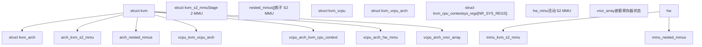
**`struct kvm_arch`**：VM 范围的 ARM64 特定状态，包括主 Stage 2 MMU (`mmu`)、用于嵌套虚拟化的嵌套 MMU 数组以及模拟的 ID 寄存器。

**`struct kvm_vcpu_arch`**：每 vCPU 状态，包括系统寄存器 (`ctxt.sys_regs`)、陷阱配置 (`hcr_el2`, `mdcr_el2`) 以及指向活动 Stage 2 MMU 的指针 (`hw_mmu`)。

**`struct kvm_cpu_context`**：持有架构状态，包括通用寄存器、系统寄存器数组和 FP/SIMD 状态。

**`struct kvm_s2_mmu`**：表示一个 Stage 2 MMU 上下文，包含页表基址 (`pgd_phys`)、VMID 和配置 (`vtcr`)。

来源：[arch/arm64/include/asm/kvm\_host.h294-408](https://github.com/torvalds/linux/blob/fcb70a56/arch/arm64/include/asm/kvm_host.h#L294-L408) [arch/arm64/include/asm/kvm\_host.h152-230](https://github.com/torvalds/linux/blob/fcb70a56/arch/arm64/include/asm/kvm_host.h#L152-L230) [arch/arm64/include/asm/kvm\_host.h664-680](https://github.com/torvalds/linux/blob/fcb70a56/arch/arm64/include/asm/kvm_host.h#L664-L680) [arch/arm64/include/asm/kvm\_host.h794-896](https://github.com/torvalds/linux/blob/fcb70a56/arch/arm64/include/asm/kvm_host.h#L794-L896)

### 系统寄存器状态管理

```mermaid
flowchart TD
    MEMORY["SR_LOC_MEMORY在 sys_regs[] 数组中"]
    LOADED["SR_LOC_LOADED在物理 CPU 上"]
    MAPPED["SR_LOC_MAPPEDEL2→EL1 映射"]
    XLATED["SR_LOC_XLATED需要翻译"]
    vcpu_read["vcpu_read_sys_reg()"]
    vcpu_write["vcpu_write_sys_reg()"]
    locate_register["locate_register()"]
    read_sr_from_cpu["read_sr_from_cpu()"]
    write_sr_to_cpu["write_sr_to_cpu()"]

    vcpu --> read_locate_register
    vcpu --> write_locate_register
    locate --> register_MEMORY
    locate --> register_LOADED
    locate --> register_MAPPED
    locate --> register_XLATED
    LOADED --> read_sr_from_cpu
    LOADED --> write_sr_to_cpu
```
根据上下文，系统寄存器状态可以驻留在不同位置：

-   **`SR_LOC_MEMORY`**：寄存器存储在内存中的 `sys_regs[]` 数组中
-   **`SR_LOC_LOADED`**：寄存器当前加载在物理 CPU 上
-   **`SR_LOC_MAPPED`**：EL2 寄存器映射到 EL1 等效项 (VHE 模式)
-   **`SR_LOC_XLATED`**：寄存器需要在 EL1/EL2 之间进行格式转换

`locate_register()` 函数根据 vCPU 是否已加载以及 VHE 是否处于活动状态来确定寄存器当前驻留的位置。

来源：[arch/arm64/kvm/sys\_regs.c85-216](https://github.com/torvalds/linux/blob/fcb70a56/arch/arm64/kvm/sys_regs.c#L85-L216) [arch/arm64/kvm/sys\_regs.c218-292](https://github.com/torvalds/linux/blob/fcb70a56/arch/arm64/kvm/sys_regs.c#L218-L292) [arch/arm64/kvm/sys\_regs.c294-392](https://github.com/torvalds/linux/blob/fcb70a56/arch/arm64/kvm/sys_regs.c#L294-L392)

## 系统寄存器模拟

系统寄存器模拟通过陷阱和模拟 (trap-and-emulate) 机制处理客户机对特权 ARM64 系统寄存器的访问。实现位于 `arch/arm64/kvm/sys_regs.c`。

### 寄存器陷阱和模拟流程

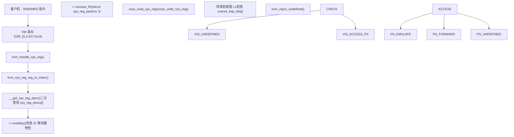
**陷阱入口**：异常综合寄存器 (`ESR_EL2`) 包含：

-   `EC=0x18`：系统寄存器陷阱
-   `Op0, Op1, CRn, CRm, Op2`：寄存器编码
-   `Rt`：目标寄存器
-   方向位指示读 vs 写

**`struct sys_reg_desc`**：每个系统寄存器的描述符，位于 [arch/arm64/kvm/sys\_regs.c50-84](https://github.com/torvalds/linux/blob/fcb70a56/arch/arm64/kvm/sys_regs.c#L50-L84)：

```
struct sys_reg_desc {
    enum vcpu_sysreg reg;                    // sys_regs[] 中的索引
    bool (*access_fn)(...);                  // 陷阱处理程序
    unsigned int (*visibility)(...);         // 基于特性的可见性
    u64 (*reset)(struct kvm_vcpu *, ...);   // 重置函数
    u64 val;                                 // 重置值
};
```
**访问函数行为**：

-   `access_rw()` [arch/arm64/kvm/sys\_regs.c487-497](https://github.com/torvalds/linux/blob/fcb70a56/arch/arm64/kvm/sys_regs.c#L487-L497)：通过 `vcpu_read_sys_reg()`/`vcpu_write_sys_reg()` 进行读/写
-   `trap_raz_wi()` [arch/arm64/kvm/sys\_regs.c684-692](https://github.com/torvalds/linux/blob/fcb70a56/arch/arm64/kvm/sys_regs.c#L684-L692)：读为零，忽略写 (Read-as-zero, writes ignored)
-   `access_vm_reg()` [arch/arm64/kvm/sys\_regs.c556-579](https://github.com/torvalds/linux/blob/fcb70a56/arch/arm64/kvm/sys_regs.c#L556-L579)：VM 寄存器，写入时调用 `kvm_toggle_cache()`
-   `access_gic_sgi()` [arch/arm64/kvm/sys\_regs.c602-648](https://github.com/torvalds/linux/blob/fcb70a56/arch/arm64/kvm/sys_regs.c#L602-L648)：转发到 `vgic_v3_dispatch_sgi()`

来源：[arch/arm64/kvm/sys\_regs.c1-100](https://github.com/torvalds/linux/blob/fcb70a56/arch/arm64/kvm/sys_regs.c#L1-L100) [arch/arm64/kvm/sys\_regs.c487-692](https://github.com/torvalds/linux/blob/fcb70a56/arch/arm64/kvm/sys_regs.c#L487-L692)

### 重要寄存器类别

```mermaid
flowchart TD
    DBGBVR["DBGBVRn_EL1断点值"]
    DBGBCR["DBGBCRn_EL1断点控制"]
    MDSCR["MDSCR_EL1监控调试"]
    ICC_SGI1R["ICC_SGI1R_EL1软件生成中断"]
    ICC_SRE["ICC_SRE_EL1系统寄存器启用"]
    PMCR["PMCR_EL0PMU 控制"]
    PMEVCNTR["PMEVCNTRn_EL0事件计数器"]
    PMCCNTR["PMCCNTR_EL0周期计数器"]
    ID_AA64PFR0["ID_AA64PFR0_EL1处理器特性"]
    ID_AA64MMFR0["ID_AA64MMFR0_EL1内存模型特性"]
    MIDR["MIDR_EL1CPU 标识"]
    SCTLR["SCTLR_EL1系统控制"]
    TCR["TCR_EL1翻译控制"]
    TTBR["TTBR0/1_EL1页表基址"]
```
**配置寄存器**：控制 MMU、缓存和系统行为。当设置 `HCR_EL2.TVM` 时，许多寄存器会被捕获，以允许 KVM 跟踪客户机页表配置。

**ID 寄存器**：提供特性发现。KVM 虚拟化这些寄存器以在整个 VM 中暴露一致的特性集，可能隐藏主机特性或通告模拟特性。

**PMU 寄存器**：性能监控计数器。KVM 创建主机 perf 事件来支持客户机 PMU 计数器，允许在客户机中进行精确的性能测量。

**GIC 寄存器**：中断控制器访问。SGI 生成被捕获并转发到 VGIC 进行模拟。

来源：[arch/arm64/kvm/sys\_regs.c100-145](https://github.com/torvalds/linux/blob/fcb70a56/arch/arm64/kvm/sys_regs.c#L100-L145) [arch/arm64/kvm/sys\_regs.c602-667](https://github.com/torvalds/linux/blob/fcb70a56/arch/arm64/kvm/sys_regs.c#L602-L667) [arch/arm64/kvm/pmu-emul.c1-100](https://github.com/torvalds/linux/blob/fcb70a56/arch/arm64/kvm/pmu-emul.c#L1-L100)

### 寄存器访问优化 (VHE)

使用 VHE (`HCR_EL2.E2H=1`) 时，EL1 寄存器通过 EL12 别名访问以避免保存/恢复。`locate_register()` 函数 [arch/arm64/kvm/sys\_regs.c175-216](https://github.com/torvalds/linux/blob/fcb70a56/arch/arm64/kvm/sys_regs.c#L175-L216) 使用 `enum sr_loc_attr` 确定寄存器位置：

**寄存器位置状态** (`enum sr_loc_attr` 位于 [arch/arm64/kvm/sys\_regs.c85-91](https://github.com/torvalds/linux/blob/fcb70a56/arch/arm64/kvm/sys_regs.c#L85-L91))：

-   `SR_LOC_MEMORY (0x0)`：在 `ctxt.sys_regs[]` 数组中
-   `SR_LOC_LOADED (0x1)`：在物理 CPU 上
-   `SR_LOC_MAPPED (0x2)`：EL2 寄存器映射到 EL1 (例如 `SCTLR_EL2` → `SCTLR_EL1`)
-   `SR_LOC_XLATED (0x4)`：需要格式转换 (例如 `translate_sctlr_el2_to_sctlr_el1()`)
-   `SR_LOC_SPECIAL (0x8)`：特殊处理 (例如 `CNTHCTL_EL2`)

**EL12 别名映射** (VHE 模式, 非嵌套)：

| EL1 寄存器 | 物理寄存器 | 转换函数 |
| --- | --- | --- |
| `SCTLR_EL1` | `SYS_SCTLR_EL12` | 无 |
| `TCR_EL1` | `SYS_TCR_EL12` | 无 |
| `TTBR0_EL1` | `SYS_TTBR0_EL12` | 无 |
| `SCTLR_EL2` | `SYS_SCTLR_EL12` (映射时) | `translate_sctlr_el2_to_sctlr_el1()` |

**读/写函数**：

-   `vcpu_read_sys_reg()` [arch/arm64/kvm/sys\_regs.c294-339](https://github.com/torvalds/linux/blob/fcb70a56/arch/arm64/kvm/sys_regs.c#L294-L339)：检查 `SR_LOC_LOADED`，如果在 CPU 上则调用 `read_sr_from_cpu()`
-   `vcpu_write_sys_reg()` [arch/arm64/kvm/sys\_regs.c341-392](https://github.com/torvalds/linux/blob/fcb70a56/arch/arm64/kvm/sys_regs.c#L341-L392)：检查 `SR_LOC_LOADED`，如果在 CPU 上则调用 `write_sr_to_cpu()`
-   `read_sr_from_cpu()` [arch/arm64/kvm/sys\_regs.c218-256](https://github.com/torvalds/linux/blob/fcb70a56/arch/arm64/kvm/sys_regs.c#L218-L256)：从 `SYS_*_EL12` 别名读取
-   `write_sr_to_cpu()` [arch/arm64/kvm/sys\_regs.c258-292](https://github.com/torvalds/linux/blob/fcb70a56/arch/arm64/kvm/sys_regs.c#L258-L292)：写入到 `SYS_*_EL12` 别名

来源：[arch/arm64/kvm/sys\_regs.c85-392](https://github.com/torvalds/linux/blob/fcb70a56/arch/arm64/kvm/sys_regs.c#L85-L392)

## 嵌套虚拟化

ARM64 KVM 支持嵌套虚拟化，允许客户机运行自己的管理程序 (L1) 和嵌套客户机 (L2)。这是使用 ARMv8.4-NV (Nested Virtualization) 和 ARMv8.3-NV 扩展实现的。

### 嵌套虚拟化架构

```mermaid
flowchart TD
    L0_KVM["KVM 管理程序(EL2)"]
    HOST_MMU["主机 S2 MMU"]
    NESTED_MMUS["nested_mmus[]影子 S2 上下文"]
    L1_VIRT["L1 客户机管理程序(vEL2)"]
    L1_S2["L1 的 S2 页表(VTTBR_EL2)"]
    VNCR["VNCR_EL2虚拟嵌套控制寄存器"]
    L2_GUEST["L2 客户机(vEL1)"]
    L2_S1["L2 S1 页表"]
    SHADOW_S2["影子 S2 MMUkvm_s2_mmu"]
    SHADOW_PT["影子页表L1 S2 的组合"]

    L0 --> KVM_HOST_MMU
    L0 --> KVM_NESTED_MMUS
    L0 --> KVM_L1_VIRT
    L1 --> VIRT_L1_S2
    L1 --> VIRT_VNCR
    L1 --> VIRT_L2_GUEST
    L2 --> GUEST_L2_S1
    NESTED --> MMUS_SHADOW_S2
    SHADOW --> S2_SHADOW_PT
    L1 --> S2_SHADOW_PT
```
**L0 (主机 KVM)**：在 EL2 运行并管理所有虚拟化。为嵌套客户机维护影子 S2 上下文。

**L1 (客户机管理程序)**：在 VM 上下文中的 vEL2 (虚拟 EL2) 运行。通过 `VTTBR_EL2` 配置其自己的 S2 页表。

**L2 (嵌套客户机)**：在 L1 控制下于 vEL1 运行。其内存访问通过 L2 的 S1 (由 L2 控制) 和影子 S2 (由 L0 控制)。

**影子 S2 MMU**：KVM L0 通过遍历 L1 的 S2 页表并翻译 L1 使用的中间物理地址 (IPA) 来维护影子 S2 页表。

来源：[arch/arm64/kvm/nested.c1-52](https://github.com/torvalds/linux/blob/fcb70a56/arch/arm64/kvm/nested.c#L1-L52) [arch/arm64/kvm/nested.c612-659](https://github.com/torvalds/linux/blob/fcb70a56/arch/arm64/kvm/nested.c#L612-L659)

### 影子 Stage 2 MMU 管理

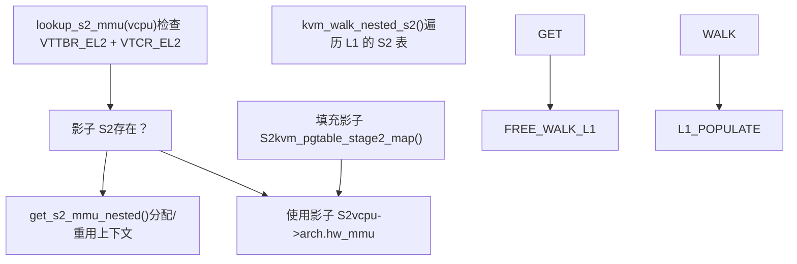
**上下文分配**：每个 VM 都有一个 `nested_mmus` 数组 (大小为 `num_vcpus * S2_MMU_PER_VCPU`)。当 vCPU 在启用 L1 S2 的情况下运行时，KVM 会搜索匹配的影子上下文或分配一个新的。

**上下文匹配**：影子 S2 MMU 通过以下方式匹配：

-   `VTTBR_EL2` 值 (VMID + 基地址)
-   `VTCR_EL2` 配置
-   `HCR_EL2.VM` 状态 (S2 启用/禁用)

**页表遍历**：`kvm_walk_nested_s2()` 执行 L1 的 S2 页表的软件遍历，将 L2 GPA 翻译为 L1 IPA，然后翻译为主机 PA。

**影子填充**：在 L2 缺页时，KVM 遍历 L1 的 S2，通过主机 S2 翻译生成的 L1 IPA，并使用最终 PA 填充影子 S2。

来源：[arch/arm64/kvm/nested.c612-728](https://github.com/torvalds/linux/blob/fcb70a56/arch/arm64/kvm/nested.c#L612-L728) [arch/arm64/kvm/nested.c209-380](https://github.com/torvalds/linux/blob/fcb70a56/arch/arm64/kvm/nested.c#L209-L380) [arch/arm64/kvm/nested.c661-720](https://github.com/torvalds/linux/blob/fcb70a56/arch/arm64/kvm/nested.c#L661-L720)

### 嵌套 S2 页表遍历

函数 `walk_nested_s2_pgd()` [arch/arm64/kvm/nested.c244-374](https://github.com/torvalds/linux/blob/fcb70a56/arch/arm64/kvm/nested.c#L244-L374) 实现了 ARMv8 Stage 2 翻译：

```mermaid
flowchart TD
    START["walk_nested_s2_pgd()phys_addr_t ipa"]
    PARSE["vtcr_to_walk_info()struct s2_walk_info wi"]
    CALC_BASE["wi.baddr = VTTBR_EL2 & masklevel = 3 - wi.sl"]
    LOOP_START["级别循环"]
    CALC_INDEX["索引 = ipa bits[va_top:va_bottom] >> 3"]
    READ_DESC["read_guest_s2_desc()kvm_read_guest()"]
    CHECK_VALID["desc & KVM_PTE_VALID"]
    CHECK_TYPE["desc & KVM_PTE_TYPE块还是表？"]
    CHECK_AF["desc & KVM_PTE_LEAF_ATTR_LO_S2_AF"]
    TRANSLATE["out->pa = desc_to_oa()out->readable/writable 从 S2AP"]
    FAULT["out->esr = compute_fsc(level, FSC)"]
    NEXT_LEVEL["baddr = desc_to_oa()level++"]
    RETURN_OK["返回 0"]
    RETURN_FAULT["返回 1"]

    START --> PARSE
    PARSE --> CALC_BASE
    CALC --> BASE_LOOP_START
    LOOP --> START_CALC_INDEX
    CALC --> INDEX_READ_DESC
    READ --> DESC_CHECK_VALID
    CHECK --> VALID_FAULT
    CHECK --> VALID_CHECK_TYPE
    CHECK --> TYPE_NEXT_LEVEL
    CHECK --> TYPE_CHECK_AF
    CHECK --> AF_FAULT
    CHECK --> AF_TRANSLATE
    NEXT --> LEVEL_LOOP_START
    TRANSLATE --> RETURN_OK
    FAULT --> RETURN_FAULT
```
**`struct s2_walk_info`** [arch/arm64/kvm/nested.c126-134](https://github.com/torvalds/linux/blob/fcb70a56/arch/arm64/kvm/nested.c#L126-L134)：

```
struct s2_walk_info {
    u64 baddr;              // 来自 VTTBR_EL2 的基地址
    unsigned int max_oa_bits; // 输出地址大小
    unsigned int pgshift;   // 页面移位 (12/14/16)
    unsigned int sl;        // 起始级别
    unsigned int t0sz;      // VTCR_EL2.T0SZ
    bool be;                // 大端序
    bool ha;                // 硬件访问标志更新
};
```
**`struct kvm_s2_trans`** (输出) [arch/arm64/include/asm/kvm\_nested.h70-80](https://github.com/torvalds/linux/blob/fcb70a56/arch/arm64/include/asm/kvm_nested.h#L70-L80)：

```
struct kvm_s2_trans {
    phys_addr_t output;     // 翻译后的 PA
    unsigned long block_size;
    bool readable, writable;
    int level;              // 页表级别
    u64 desc;               // 最终描述符
    u64 esr;                // 如果失败的故障综合症
};
```
**描述符处理**：

-   `desc_to_oa()` [arch/arm64/kvm/at.c59-80](https://github.com/torvalds/linux/blob/fcb70a56/arch/arm64/kvm/at.c#L59-L80)：提取处理 52 位 PA 的输出地址
-   `check_output_size()` [arch/arm64/kvm/nested.c191-199](https://github.com/torvalds/linux/blob/fcb70a56/arch/arm64/kvm/nested.c#L191-L199)：针对 `wi->max_oa_bits` 进行验证
-   `swap_guest_s2_desc()` [arch/arm64/kvm/nested.c223-235](https://github.com/torvalds/linux/blob/fcb70a56/arch/arm64/kvm/nested.c#L223-L235)：为硬件 AF 更新描述符

来源：[arch/arm64/kvm/nested.c126-374](https://github.com/torvalds/linux/blob/fcb70a56/arch/arm64/kvm/nested.c#L126-L374) [arch/arm64/kvm/at.c59-80](https://github.com/torvalds/linux/blob/fcb70a56/arch/arm64/kvm/at.c#L59-L80) [arch/arm64/include/asm/kvm\_nested.h70-80](https://github.com/torvalds/linux/blob/fcb70a56/arch/arm64/include/asm/kvm_nested.h#L70-L80)

### VNCR (虚拟嵌套控制寄存器)

NV2 扩展允许 L1 的 EL2 系统寄存器存储在内存页中，消除了大多数陷阱开销：

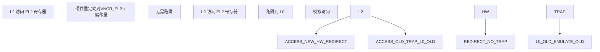
**VNCR 数组**：每个 vCPU 都有一个 `vncr_array` (4KB 页面)，其中存储了支持 NV2 的寄存器。硬件自动将 EL2 寄存器访问重定向到此内存。

**寄存器映射**：`vcpu_sysreg` 枚举中的 `VNCR()` 宏定义了哪些寄存器支持 VNCR 及其偏移量。

**TLB 管理**：KVM 维护一个 `vncr_tlb` 结构来跟踪 VNCR 页面的虚拟到物理翻译，并在内存更改时使其失效。

来源：[arch/arm64/include/asm/kvm\_host.h417-433](https://github.com/torvalds/linux/blob/fcb70a56/arch/arm64/include/asm/kvm_host.h#L417-L433) [arch/arm64/include/asm/kvm\_host.h532-622](https://github.com/torvalds/linux/blob/fcb70a56/arch/arm64/include/asm/kvm_host.h#L532-L622) [arch/arm64/kvm/nested.c813-858](https://github.com/torvalds/linux/blob/fcb70a56/arch/arm64/kvm/nested.c#L813-L858)

### 地址翻译 (AT) 指令模拟

AT 指令执行地址翻译，当由 L1 管理程序发出时会被捕获：

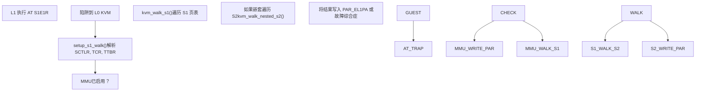
**翻译机制**：系统支持多种翻译机制：

-   `TR_EL10`：EL1&0 翻译机制
-   `TR_EL2`：EL2 翻译机制
-   `TR_EL20`：EL2&0 翻译机制 (VHE)

**AT 指令支持**：KVM 模拟各种 AT 指令：

-   `AT S1E0R/W`：EL0 翻译 (读/写)
-   `AT S1E1R/W`：EL1 翻译
-   `AT S1E2R/W`：EL2 翻译 (嵌套上下文)

**复杂特性**：实现处理了高级特性，如：

-   52 位物理寻址 (LPA/LPA2)
-   权限间接 (PIE, POE)
-   分层权限禁用 (HPD)

来源：[arch/arm64/kvm/at.c1-80](https://github.com/torvalds/linux/blob/fcb70a56/arch/arm64/kvm/at.c#L1-L80) [arch/arm64/kvm/at.c82-137](https://github.com/torvalds/linux/blob/fcb70a56/arch/arm64/kvm/at.c#L82-L137) [arch/arm64/kvm/at.c138-400](https://github.com/torvalds/linux/blob/fcb70a56/arch/arm64/kvm/at.c#L138-L400)

## 受保护的 KVM (pKVM)

pKVM 通过利用 EL2 保护客户机内存免受主机内核影响，为机密 VM 提供强隔离。

### pKVM 架构

```mermaid
flowchart TD
    PKVM_HYP["pKVM 管理程序(常驻 EL2)"]
    HOST_S2["主机 Stage 2 MMU(限制主机访问)"]
    GUEST_S2["客户机 Stage 2 MMU(保护客户机内存)"]
    HOST_KERNEL["主机 Linux 内核(不可信)"]
    KVM_MODULE["KVM 模块(不可信)"]
    PROTECTED_VM["受保护 VM(与主机隔离)"]
    GUEST_MEMORY["客户机内存(主机无法访问)"]
    OWNED_BY_HOST["主机拥有的页面"]
    OWNED_BY_GUEST["捐赠给客户机的页面(不可撤销)"]
    OWNED_BY_HYP["管理程序拥有的页面"]

    HOST --> KERNEL_KVM_MODULE
    KVM --> MODULE_PKVM_HYP
    PKVM --> HYP_HOST_S2
    PKVM --> HYP_GUEST_S2
    HOST --> S2_HOST_KERNEL
    GUEST --> S2_PROTECTED_VM
    PROTECTED --> VM_GUEST_MEMORY
    GUEST --> MEMORY_OWNED_BY_GUEST
```
**主机 Stage 2**：在 pKVM 中，主机 Linux 内核运行在由 EL2 管理程序控制的 Stage 2 MMU 之后。这限制了主机对物理内存的视图，防止其访问客户机页面。

**客户机保护**：客户机内存页被捐赠给客户机并标记为对主机不可访问。EL2 管理程序强制执行这些限制。

**Hypercall 接口**：主机 KVM 模块通过 hypercall 与 pKVM 管理程序通信，进行 VM 生命周期操作。

来源：[arch/arm64/kvm/hyp/nvhe/mem\_protect.c1-52](https://github.com/torvalds/linux/blob/fcb70a56/arch/arm64/kvm/hyp/nvhe/mem_protect.c#L1-L52) [arch/arm64/kvm/pkvm.c1-50](https://github.com/torvalds/linux/blob/fcb70a56/arch/arm64/kvm/pkvm.c#L1-L50)

### pKVM 内存所有权

在 `arch/arm64/kvm/hyp/nvhe/mem_protect.c` 中实现的页面所有权状态机：

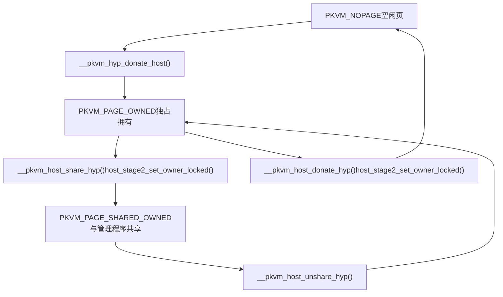
**`struct hyp_page`** 每页元数据 [arch/arm64/kvm/hyp/include/nvhe/memory.h1-50](https://github.com/torvalds/linux/blob/fcb70a56/arch/arm64/kvm/hyp/include/nvhe/memory.h#L1-L50)：

```
struct hyp_page {
    unsigned short refcount;  // 引用计数
    unsigned short order;     // 分配阶数
};
```
**页面状态值** (`enum pkvm_page_state`)：

-   `PKVM_NOPAGE (0)`：未拥有，可用
-   `PKVM_PAGE_OWNED`：由单个组件拥有
-   `PKVM_PAGE_SHARED_OWNED`：主机与管理程序共享
-   `PKVM_PAGE_RESTRICTED_PROT`：客户机受保护页面

**关键函数**：

-   `host_stage2_set_owner_locked()` [arch/arm64/kvm/hyp/nvhe/mem\_protect.c700-800](https://github.com/torvalds/linux/blob/fcb70a56/arch/arm64/kvm/hyp/nvhe/mem_protect.c#L700-L800)：使用所有者元数据更新主机 S2 PTE
-   `__pkvm_host_donate_hyp()` [arch/arm64/kvm/hyp/nvhe/mem\_protect.c800-900](https://github.com/torvalds/linux/blob/fcb70a56/arch/arm64/kvm/hyp/nvhe/mem_protect.c#L800-L900)：将所有权从主机转移到管理程序
-   `check_host_page_state_range()` [arch/arm64/kvm/hyp/nvhe/mem\_protect.c600-700](https://github.com/torvalds/linux/blob/fcb70a56/arch/arm64/kvm/hyp/nvhe/mem_protect.c#L600-L700)：在转换前验证状态
-   `hyp_page_ref_inc/dec()`：原子引用计数操作

**内存保护**：主机 S2 MMU (`host_mmu.pgt`) 强制执行所有权 - 尝试从主机访问客户机拥有的页面会触发 S2 故障。

来源：[arch/arm64/kvm/hyp/nvhe/mem\_protect.c600-900](https://github.com/torvalds/linux/blob/fcb70a56/arch/arm64/kvm/hyp/nvhe/mem_protect.c#L600-900) [arch/arm64/kvm/hyp/include/nvhe/memory.h1-50](https://github.com/torvalds/linux/blob/fcb70a56/arch/arm64/kvm/hyp/include/nvhe/memory.h#L1-50)

### pKVM VM 生命周期

```mermaid
flowchart TD
    CREATE_VM["主机: kvm_arch_init_vm()"]
    INIT_PKVM["pkvm_init_host_vm()预留管理程序 VM 句柄"]
    ALLOC_SHADOW["在 EL2 分配影子 VM"]
    CREATE_VCPU["主机: kvm_arch_vcpu_create()"]
    DONATE_VCPU["捐赠 vCPU 内存给管理程序"]
    INIT_TRAPS["pkvm_vcpu_init_traps()配置陷阱处理程序"]
    RUN["主机: KVM_RUN"]
    ENTER_GUEST["__pkvm_vcpu_run()世界切换到客户机"]
    GUEST_EXIT["VM 退出"]
    HANDLE_EXIT["在 EL2 处理退出或转发给主机"]
    DESTROY["主机: kvm_arch_destroy_vm()"]
    TEARDOWN["pkvm_destroy_hyp_vm()回收内存"]

    CREATE --> VM_INIT_PKVM
    INIT --> PKVM_ALLOC_SHADOW
    ALLOC --> SHADOW_CREATE_VCPU
    CREATE --> VCPU_DONATE_VCPU
    DONATE --> VCPU_INIT_TRAPS
    INIT --> TRAPS_RUN
    RUN --> ENTER_GUEST
    ENTER --> GUEST_GUEST_EXIT
    GUEST --> EXIT_HANDLE_EXIT
    HANDLE --> EXIT_ENTER_GUEST
    HANDLE --> EXIT_DESTROY
    DESTROY --> TEARDOWN
```
**影子 VM 结构**：管理程序为每个受保护 VM 维护一个影子 `pkvm_hyp_vm` 结构，与不可信主机的 `struct kvm` 分开。

**内存缓存**：受保护 VM 使用专用的内存缓存 (`pkvm_memcache`)，由主机预填充但由管理程序管理。

**退出处理**：许多 VM 退出完全在 EL2 中处理（例如 GIC 访问，一些系统寄存器陷阱），避免返回到不可信主机。

来源：[arch/arm64/kvm/hyp/nvhe/pkvm.c200-400](https://github.com/torvalds/linux/blob/fcb70a56/arch/arm64/kvm/hyp/nvhe/pkvm.c#L200-400) [arch/arm64/kvm/pkvm.c1-200](https://github.com/torvalds/linux/blob/fcb70a56/arch/arm64/kvm/pkvm.c#L1-200) [arch/arm64/kvm/hyp/nvhe/mem\_protect.c250-400](https://github.com/torvalds/linux/blob/fcb70a56/arch/arm64/kvm/hyp/nvhe/mem_protect.c#L250-400)

## Stage 2 内存管理

Stage 2 (S2) 翻译提供第二级地址翻译，将客户机使用的中间物理地址 (IPA) 映射到主机上的物理地址 (PA)。

### Stage 2 翻译结构

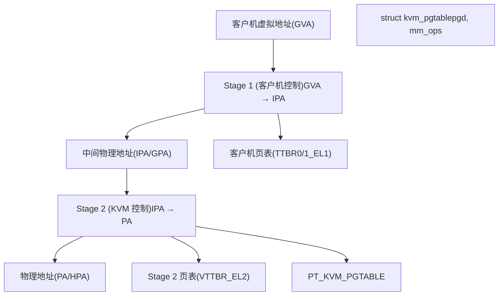
**Stage 1**：由客户机操作系统控制。将客户机虚拟地址翻译为客户机认为是物理地址的地址 (IPA)。

**Stage 2**：由 KVM 控制。提供额外的翻译层和内存隔离。捕获客户机内存访问以进行模拟或保护。

**kvm\_pgtable**：通用页表抽象，具有 map、unmap 和 walk 操作。

来源：[arch/arm64/kvm/mmu.c1-100](https://github.com/torvalds/linux/blob/fcb70a56/arch/arm64/kvm/mmu.c#L1-100) [arch/arm64/include/asm/kvm\_host.h152-230](https://github.com/torvalds/linux/blob/fcb70a56/arch/arm64/include/asm/kvm_host.h#L152-230)

### Stage 2 故障处理

Stage 2 中止入口点是 `kvm_handle_guest_abort()` [arch/arm64/kvm/mmu.c1350-1450](https://github.com/torvalds/linux/blob/fcb70a56/arch/arm64/kvm/mmu.c#L1350-1450)：

```mermaid
flowchart TD
    ABORT["kvm_handle_guest_abort()ESR_EL2.EC=0x24/0x25"]
    GET_IPA["fault_ipa = kvm_vcpu_get_fault_ipa()HPFAR_EL2[47:12] | FAR_EL2[11:0]"]
    NESTED["vcpu_has_nv() &&is_hyp_ctxt()"]
    WALK_L1["kvm_walk_nested_s2()struct kvm_s2_trans *trans"]
    CHECK_L1["trans->esr != 0"]
    INJECT["kvm_inject_s2_fault()写入 FAR_EL2, HPFAR_EL2"]
    USER_FAULT["user_mem_abort()"]
    LOOKUP_SLOT["gfn_to_memslot()struct kvm_memory_slot"]
    MMIO_CHECK["slot == NULL"]
    EMULATE_MMIO["io_mem_abort()kvm_io_bus_write()"]
    GET_PFN["__gfn_to_pfn_memslot()gup_longterm()"]
    MAP_S2["kvm_pgtable_stage2_map()pgt->mm_ops->zalloc_page()"]
    TLB_FLUSH["__kvm_tlb_flush_vmid_ipa()"]

    ABORT --> GET_IPA
    GET --> IPA_NESTED
    NESTED --> WALK_L1
    NESTED --> USER_FAULT
    WALK --> L1_CHECK_L1
    CHECK --> L1_INJECT
    CHECK --> L1_USER_FAULT
    USER --> FAULT_LOOKUP_SLOT
    LOOKUP --> SLOT_MMIO_CHECK
    MMIO --> CHECK_EMULATE_MMIO
    MMIO --> CHECK_GET_PFN
    GET --> PFN_MAP_S2
    MAP --> S2_TLB_FLUSH
```
**故障信息提取**：

-   `kvm_vcpu_get_fault_ipa()` [arch/arm64/include/asm/kvm\_emulate.h350-360](https://github.com/torvalds/linux/blob/fcb70a56/arch/arm64/include/asm/kvm_emulate.h#L350-360)：结合 `HPFAR_EL2` (位 [47:12]) 和 `FAR_EL2` (位 [11:0])
-   `kvm_vcpu_get_esr()`：读取 `ESR_EL2` 以获取故障类型
-   `kvm_vcpu_dabt_iswrite()`：从 `ESR_EL2.WnR` 检查写 vs 读

**嵌套 S2 翻译** [arch/arm64/kvm/nested.c398-421](https://github.com/torvalds/linux/blob/fcb70a56/arch/arm64/kvm/nested.c#L398-421)：

-   `kvm_walk_nested_s2()`：遍历 L1 的 S2 页表
-   如果 `trans->esr != 0`：L1 级别的故障，注入到 L1 管理程序
-   如果成功：使用 `trans->output` 作为 L1 IPA 继续主机映射

**内存槽查找** [arch/arm64/kvm/mmu.c1250-1300](https://github.com/torvalds/linux/blob/fcb70a56/arch/arm64/kvm/mmu.c#L1250-1300)：

-   `gfn_to_memslot()`：为 GFN 查找 `struct kvm_memory_slot`
-   如果无槽：视为 MMIO，调用 `io_mem_abort()`
-   如果找到槽：正常 RAM，继续映射

**S2 映射安装** [arch/arm64/kvm/mmu.c1300-1400](https://github.com/torvalds/linux/blob/fcb70a56/arch/arm64/kvm/mmu.c#L1300-1400)：

-   `__gfn_to_pfn_memslot()`：通过 `get_user_pages()` 将 GFN 翻译为主机 PFN
-   `kvm_pgtable_stage2_map()`：在 S2 页表中安装 PTE
-   `__kvm_tlb_flush_vmid_ipa()`：刷新 TLB 以获取新映射

来源：[arch/arm64/kvm/mmu.c1250-1450](https://github.com/torvalds/linux/blob/fcb70a56/arch/arm64/kvm/mmu.c#L1250-1450) [arch/arm64/kvm/nested.c398-421](https://github.com/torvalds/linux/blob/fcb70a56/arch/arm64/kvm/nested.c#L398-421) [arch/arm64/include/asm/kvm\_emulate.h350-360](https://github.com/torvalds/linux/blob/fcb70a56/arch/arm64/include/asm/kvm_emulate.h#L350-360)

### Stage 2 页表操作

**`struct kvm_pgtable`** [arch/arm64/include/asm/kvm\_pgtable.h200-250](https://github.com/torvalds/linux/blob/fcb70a56/arch/arm64/include/asm/kvm_pgtable.h#L200-250)：

```
struct kvm_pgtable {
    kvm_pte_t *pgd;                    // 页表根
    struct kvm_pgtable_mm_ops *mm_ops; // 内存操作
    struct kvm_s2_mmu *mmu;           // 反向指针
    int ia_bits;                      // 输入地址大小
    u8 start_level;                   // 起始级别
    u32 flags;                        // KVM_PGTABLE_S2_*
};
```
**核心页表操作**：

| 函数 | 位置 | 用途 |
| --- | --- | --- |
| `kvm_pgtable_stage2_map()` | [arch/arm64/kvm/hyp/pgtable.c800-900](https://github.com/torvalds/linux/blob/fcb70a56/arch/arm64/kvm/hyp/pgtable.c#L800-900) | 使用 `enum kvm_pgtable_prot` 映射 IPA→PA |
| `kvm_pgtable_stage2_unmap()` | [arch/arm64/kvm/hyp/pgtable.c950-1000](https://github.com/torvalds/linux/blob/fcb70a56/arch/arm64/kvm/hyp/pgtable.c#L950-1000) | 取消映射范围，调用 `mm_ops->put_page()` |
| `kvm_pgtable_stage2_wrprotect()` | [arch/arm64/kvm/hyp/pgtable.c1100-1150](https://github.com/torvalds/linux/blob/fcb70a56/arch/arm64/kvm/hyp/pgtable.c#L1100-1150) | 清除 `KVM_PTE_LEAF_ATTR_LO_S2_S2AP_W` |
| `kvm_pgtable_stage2_test_clear_young()` | [arch/arm64/kvm/hyp/pgtable.c1200-1250](https://github.com/torvalds/linux/blob/fcb70a56/arch/arm64/kvm/hyp/pgtable.c#L1200-1250) | 清除 `KVM_PTE_LEAF_ATTR_LO_S2_AF` |
| `kvm_pgtable_stage2_flush()` | [arch/arm64/kvm/hyp/pgtable.c1300-1350](https://github.com/torvalds/linux/blob/fcb70a56/arch/arm64/kvm/hyp/pgtable.c#L1300-1350) | 缓存清理设备内存 |
| `kvm_pgtable_stage2_split()` | [arch/arm64/kvm/hyp/pgtable.c1400-1500](https://github.com/torvalds/linux/blob/fcb70a56/arch/arm64/kvm/hyp/pgtable.c#L1400-1500) | 将块拆分为页面映射 |

**内存操作** (`struct kvm_pgtable_mm_ops` 位于 [arch/arm64/kvm/mmu.c229-246](https://github.com/torvalds/linux/blob/fcb70a56/arch/arm64/kvm/mmu.c#L229-246))：

-   `zalloc_page()`：分配零页 (调用 `stage2_memcache_zalloc_page()`)
-   `get_page()`, `put_page()`：引用计数
-   `phys_to_virt()`, `virt_to_phys()`：地址翻译
-   `free_unlinked_table()`：通过 `stage2_free_unlinked_table()` 进行 RCU 延迟释放

**脏日志记录** [arch/arm64/kvm/mmu.c1100-1200](https://github.com/torvalds/linux/blob/fcb70a56/arch/arm64/kvm/mmu.c#L1100-1200)：

-   启用：对所有客户机内存调用 `kvm_pgtable_stage2_wrprotect()`
-   写故障时：在 memslot 位图中设置 `KVM_MEM_LOG_DIRTY_PAGES` 位
-   查询：通过 `KVM_GET_DIRTY_LOG` ioctl 读取脏位图

**块映射策略**：

-   如果对齐且连续，尝试 1GB 块 (level 1)
-   否则回退到 2MB 块 (level 2)
-   对于部分映射或 `KVM_PGTABLE_S2_NOFWB` 强制 4KB 页面 (level 3)

来源：[arch/arm64/include/asm/kvm\_pgtable.h200-250](https://github.com/torvalds/linux/blob/fcb70a56/arch/arm64/include/asm/kvm_pgtable.h#L200-250) [arch/arm64/kvm/hyp/pgtable.c800-1500](https://github.com/torvalds/linux/blob/fcb70a56/arch/arm64/kvm/hyp/pgtable.c#L800-1500) [arch/arm64/kvm/mmu.c229-246](https://github.com/torvalds/linux/blob/fcb70a56/arch/arm64/kvm/mmu.c#L229-246)

### 内存槽管理

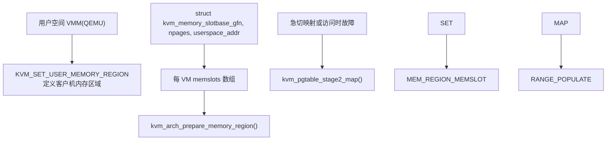
**内存区域**：每个客户机内存区域由 `struct kvm_memory_slot` 描述：

-   `base_gfn`：客户机帧号 (IPA >> PAGE\_SHIFT)
-   `npages`：以页为单位的大小
-   `userspace_addr`：支持此区域的主机虚拟地址

**按需分页**：默认情况下，S2 映射是通过缺页异常按需创建的。这允许内存过量使用 (overcommit) 和交换。

**急切映射 (Eager Mapping)**：对于某些用例（例如大页预分配），KVM 可以在区域创建时急切地填充 S2 映射。

来源：[arch/arm64/kvm/mmu.c1400-1600](https://github.com/torvalds/linux/blob/fcb70a56/arch/arm64/kvm/mmu.c#L1400-1600)

## 附加子系统

### 性能监控单元 (PMU)

```mermaid
flowchart TD
    GUEST_READ["客户机读取 PMEVCNTRn"]
    GUEST_WRITE["客户机写入 PMCR_EL0"]
    PMC["struct kvm_pmc每计数器状态"]
    PERF_EVENT["主机 perf_event支持计数器"]
    PMU_IRQ["PMU 溢出中断到 VGIC"]
    ACCESS_EVCNTR["access_pmu_evcntr()"]
    ACCESS_PMCR["access_pmcr()"]
    CREATE_EVENT["kvm_pmu_create_perf_event()"]
    OVERFLOW["kvm_pmu_overflow_status()"]

    GUEST --> READ_ACCESS_EVCNTR
    GUEST --> WRITE_ACCESS_PMCR
    ACCESS --> EVCNTR_PMC
    ACCESS --> PMCR_PMC
    PMC --> PERF_EVENT
    ACCESS --> PMCR_CREATE_EVENT
    CREATE --> EVENT_PERF_EVENT
    PERF --> EVENT_OVERFLOW
    OVERFLOW --> PMU_IRQ
```
**计数器虚拟化**：每个客户机 PMU 计数器由主机 `perf_event` 支持，允许在不直接访问硬件的情况下进行精确的性能测量。

**事件过滤**：KVM 提供 `PMCEID0/1_EL0` 来通告支持的 PMU 事件。VM 范围的过滤器可以进一步限制事件。

**溢出中断**：当计数器溢出时，KVM 通过 VGIC 向客户机注入 PMU 中断。

来源：[arch/arm64/kvm/pmu-emul.c1-100](https://github.com/torvalds/linux/blob/fcb70a56/arch/arm64/kvm/pmu-emul.c#L1-100) [arch/arm64/kvm/pmu-emul.c100-300](https://github.com/torvalds/linux/blob/fcb70a56/arch/arm64/kvm/pmu-emul.c#L100-300) [arch/arm64/kvm/sys\_regs.c1004-1047](https://github.com/torvalds/linux/blob/fcb70a56/arch/arm64/kvm/sys_regs.c#L1004-1047)

### 虚拟 GIC (VGIC)

VGIC 模拟 ARM 通用中断控制器，向 vCPU 投递中断：

**分发器 (GICD)**：管理全局中断状态和路由。

**重分发器 (GICR)**：每 CPU 中断接口。

**CPU 接口**：通过系统寄存器 (`ICC_*_EL1`) 访问。使用 GICv3，这些由 KVM 捕获并模拟。

**vGIC 集成**：

-   `vgic_v3_dispatch_sgi()`：处理客户机 SGI 生成
-   `kvm_vgic_inject_irq()`：向客户机注入中断
-   `vgic_v3_sync_hardware_irq()`：同步虚拟 IRQ 状态

来源：[arch/arm64/kvm/sys\_regs.c602-648](https://github.com/torvalds/linux/blob/fcb70a56/arch/arm64/kvm/sys_regs.c#L602-648) [arch/arm64/kvm/sys\_regs.c650-667](https://github.com/torvalds/linux/blob/fcb70a56/arch/arm64/kvm/sys_regs.c#L650-667)

### 定时器

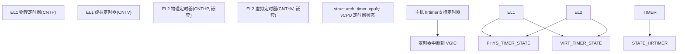
**定时器虚拟化**：KVM 提供 ARM 架构定时器的虚拟视图。每个定时器可以在编程时间产生中断。

**计数器偏移**：KVM 维护一个 VM 范围的虚拟计数器偏移 (`CNTVOFF_EL2`)，允许客户机看到独立于主机挂起/恢复的单调时间基准。

**嵌套定时器支持**：对于嵌套虚拟化，KVM 模拟 L1 管理程序使用的 EL2 定时器 (`CNTHP`, `CNTHV`)。

来源：[arch/arm64/kvm/arch\_timer.c1-100](https://github.com/torvalds/linux/blob/fcb70a56/arch/arm64/kvm/arch_timer.c#L1-100)

### 调试支持

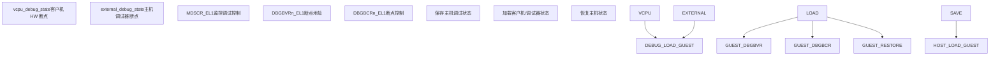
**客户机调试寄存器**：每个 vCPU 都有其自己的调试寄存器视图（断点、观察点）。

**外部调试**：主机调试器（通过 `KVM_SET_GUEST_DEBUG` ioctl）可以设置应用于客户机执行的断点。

**调试所有权**：`debug_owner` 字段跟踪调试寄存器当前属于客户机还是主机调试器。

来源：[arch/arm64/kvm/debug.c1-100](https://github.com/torvalds/linux/blob/fcb70a56/arch/arm64/kvm/debug.c#L1-100) [arch/arm64/include/asm/kvm\_host.h845-862](https://github.com/torvalds/linux/blob/fcb70a56/arch/arm64/include/asm/kvm_host.h#L845-862)

## 关键配置和陷阱寄存器

### 关键控制寄存器

| 寄存器 | 用途 | 关键字段 |
| --- | --- | --- |
| **HCR\_EL2** | 管理程序配置 | `VM` (启用 S2), `TVM` (捕获 VM 寄存器), `NV`/`NV1`/`NV2` (嵌套虚拟化) |
| **VTCR\_EL2** | 虚拟翻译控制 | `T0SZ` (IPA 大小), `SL0` (起始级别), `TG0` (粒度大小), `PS` (PA 大小) |
| **VTTBR\_EL2** | 虚拟翻译表基址 | `VMID`, `BADDR` (S2 页表基址) |
| **MDCR\_EL2** | 监控调试配置 | `TPM` (捕获 PMU), `TDA` (捕获调试), `HPMN` (PMU 计数器计数) |
| **CPTR\_EL2** | 架构特性陷阱 | `TTA` (捕获追踪), `FPEN` (FP/SIMD 陷阱), `ZEN` (SVE 陷阱) |

来源：[arch/arm64/include/asm/kvm\_arm.h1-100](https://github.com/torvalds/linux/blob/fcb70a56/arch/arm64/include/asm/kvm_arm.h#L1-100) [arch/arm64/kvm/sys\_regs.c1-100](https://github.com/torvalds/linux/blob/fcb70a56/arch/arm64/kvm/sys_regs.c#L1-100)

### 细粒度陷阱 (FGT)

ARM v8.6 引入了细粒度陷阱，允许对哪些系统寄存器进行更细粒度的控制：

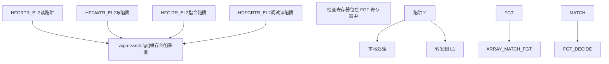
**FGT 用法**：KVM 配置 FGT 寄存器以仅捕获它需要模拟或控制的系统寄存器，减少对行为良好的客户机的不必要捕获。

**嵌套 FGT**：对于嵌套虚拟化，L1 的 FGT 设置通过与 L0 的设置一起评估来得到尊重。

来源：[arch/arm64/include/asm/kvm\_host.h276-292](https://github.com/torvalds/linux/blob/fcb70a56/arch/arm64/include/asm/kvm_host.h#L276-292) [arch/arm64/include/asm/kvm\_host.h819-822](https://github.com/torvalds/linux/blob/fcb70a56/arch/arm64/include/asm/kvm_host.h#L819-822) [arch/arm64/kvm/emulate-nested.c1-100](https://github.com/torvalds/linux/blob/fcb70a56/arch/arm64/kvm/emulate-nested.c#L1-100)

## 总结

KVM ARM64 利用 ARM 的硬件虚拟化扩展提供全面的虚拟化支持。关键能力包括：

-   **系统寄存器模拟**：具有 VHE 优化的高效陷阱和模拟
-   **嵌套虚拟化**：通过影子 S2 MMU 和 VNCR 完全支持在 VM 中运行管理程序
-   **pKVM**：具有内存隔离的硬件强制机密计算
-   **Stage 2 MMU**：具有大页支持的灵活 IPA→PA 翻译
-   **设备模拟**：用于中断的 VGIC、定时器虚拟化、PMU 模拟

该实现仔细平衡了性能（最小化陷阱，使用硬件特性）与灵活性（支持嵌套 VM、受保护 VM 和各种 ARM64 CPU 特性）。

来源：[arch/arm64/kvm/arm.c1-500](https://github.com/torvalds/linux/blob/fcb70a56/arch/arm64/kvm/arm.c#L1-500) [arch/arm64/kvm/sys\_regs.c1-500](https://github.com/torvalds/linux/blob/fcb70a56/arch/arm64/kvm/sys_regs.c#L1-500) [arch/arm64/kvm/nested.c1-500](https://github.com/torvalds/linux/blob/fcb70a56/arch/arm64/kvm/nested.c#L1-500) [arch/arm64/kvm/mmu.c1-500](https://github.com/torvalds/linux/blob/fcb70a56/arch/arm64/kvm/mmu.c#L1-500)
