# 进程调度与 sched\_ext

相关源文件

-   [Documentation/scheduler/sched-debug.rst](https://github.com/torvalds/linux/blob/fcb70a56/Documentation/scheduler/sched-debug.rst)
-   [Documentation/scheduler/sched-design-CFS.rst](https://github.com/torvalds/linux/blob/fcb70a56/Documentation/scheduler/sched-design-CFS.rst)
-   [Documentation/scheduler/sched-domains.rst](https://github.com/torvalds/linux/blob/fcb70a56/Documentation/scheduler/sched-domains.rst)
-   [Documentation/scheduler/sched-ext.rst](https://github.com/torvalds/linux/blob/fcb70a56/Documentation/scheduler/sched-ext.rst)
-   [Documentation/scheduler/sched-stats.rst](https://github.com/torvalds/linux/blob/fcb70a56/Documentation/scheduler/sched-stats.rst)
-   [Documentation/translations/sp\_SP/scheduler/sched-design-CFS.rst](https://github.com/torvalds/linux/blob/fcb70a56/Documentation/translations/sp_SP/scheduler/sched-design-CFS.rst)
-   [include/linux/sched.h](https://github.com/torvalds/linux/blob/fcb70a56/include/linux/sched.h)
-   [include/linux/sched/sd\_flags.h](https://github.com/torvalds/linux/blob/fcb70a56/include/linux/sched/sd_flags.h)
-   [include/linux/sched/topology.h](https://github.com/torvalds/linux/blob/fcb70a56/include/linux/sched/topology.h)
-   [kernel/sched/autogroup.c](https://github.com/torvalds/linux/blob/fcb70a56/kernel/sched/autogroup.c)
-   [kernel/sched/build\_utility.c](https://github.com/torvalds/linux/blob/fcb70a56/kernel/sched/build_utility.c)
-   [kernel/sched/core.c](https://github.com/torvalds/linux/blob/fcb70a56/kernel/sched/core.c)
-   [kernel/sched/core\_sched.c](https://github.com/torvalds/linux/blob/fcb70a56/kernel/sched/core_sched.c)
-   [kernel/sched/deadline.c](https://github.com/torvalds/linux/blob/fcb70a56/kernel/sched/deadline.c)
-   [kernel/sched/debug.c](https://github.com/torvalds/linux/blob/fcb70a56/kernel/sched/debug.c)
-   [kernel/sched/ext.c](https://github.com/torvalds/linux/blob/fcb70a56/kernel/sched/ext.c)
-   [kernel/sched/ext.h](https://github.com/torvalds/linux/blob/fcb70a56/kernel/sched/ext.h)
-   [kernel/sched/ext\_idle.c](https://github.com/torvalds/linux/blob/fcb70a56/kernel/sched/ext_idle.c)
-   [kernel/sched/ext\_idle.h](https://github.com/torvalds/linux/blob/fcb70a56/kernel/sched/ext_idle.h)
-   [kernel/sched/fair.c](https://github.com/torvalds/linux/blob/fcb70a56/kernel/sched/fair.c)
-   [kernel/sched/idle.c](https://github.com/torvalds/linux/blob/fcb70a56/kernel/sched/idle.c)
-   [kernel/sched/pelt.c](https://github.com/torvalds/linux/blob/fcb70a56/kernel/sched/pelt.c)
-   [kernel/sched/pelt.h](https://github.com/torvalds/linux/blob/fcb70a56/kernel/sched/pelt.h)
-   [kernel/sched/rt.c](https://github.com/torvalds/linux/blob/fcb70a56/kernel/sched/rt.c)
-   [kernel/sched/sched.h](https://github.com/torvalds/linux/blob/fcb70a56/kernel/sched/sched.h)
-   [kernel/sched/stats.c](https://github.com/torvalds/linux/blob/fcb70a56/kernel/sched/stats.c)
-   [kernel/sched/stats.h](https://github.com/torvalds/linux/blob/fcb70a56/kernel/sched/stats.h)
-   [kernel/sched/stop\_task.c](https://github.com/torvalds/linux/blob/fcb70a56/kernel/sched/stop_task.c)
-   [kernel/sched/syscalls.c](https://github.com/torvalds/linux/blob/fcb70a56/kernel/sched/syscalls.c)
-   [kernel/sched/topology.c](https://github.com/torvalds/linux/blob/fcb70a56/kernel/sched/topology.c)
-   [tools/sched\_ext/include/scx/common.bpf.h](https://github.com/torvalds/linux/blob/fcb70a56/tools/sched_ext/include/scx/common.bpf.h)
-   [tools/sched\_ext/include/scx/common.h](https://github.com/torvalds/linux/blob/fcb70a56/tools/sched_ext/include/scx/common.h)
-   [tools/sched\_ext/include/scx/compat.bpf.h](https://github.com/torvalds/linux/blob/fcb70a56/tools/sched_ext/include/scx/compat.bpf.h)
-   [tools/sched\_ext/include/scx/compat.h](https://github.com/torvalds/linux/blob/fcb70a56/tools/sched_ext/include/scx/compat.h)
-   [tools/sched\_ext/include/scx/enum\_defs.autogen.h](https://github.com/torvalds/linux/blob/fcb70a56/tools/sched_ext/include/scx/enum_defs.autogen.h)
-   [tools/sched\_ext/include/scx/enums.autogen.bpf.h](https://github.com/torvalds/linux/blob/fcb70a56/tools/sched_ext/include/scx/enums.autogen.bpf.h)
-   [tools/sched\_ext/include/scx/enums.autogen.h](https://github.com/torvalds/linux/blob/fcb70a56/tools/sched_ext/include/scx/enums.autogen.h)
-   [tools/sched\_ext/include/scx/enums.bpf.h](https://github.com/torvalds/linux/blob/fcb70a56/tools/sched_ext/include/scx/enums.bpf.h)
-   [tools/sched\_ext/include/scx/enums.h](https://github.com/torvalds/linux/blob/fcb70a56/tools/sched_ext/include/scx/enums.h)
-   [tools/sched\_ext/include/scx/user\_exit\_info.h](https://github.com/torvalds/linux/blob/fcb70a56/tools/sched_ext/include/scx/user_exit_info.h)
-   [tools/sched\_ext/scx\_central.bpf.c](https://github.com/torvalds/linux/blob/fcb70a56/tools/sched_ext/scx_central.bpf.c)
-   [tools/sched\_ext/scx\_central.c](https://github.com/torvalds/linux/blob/fcb70a56/tools/sched_ext/scx_central.c)
-   [tools/sched\_ext/scx\_flatcg.bpf.c](https://github.com/torvalds/linux/blob/fcb70a56/tools/sched_ext/scx_flatcg.bpf.c)
-   [tools/sched\_ext/scx\_qmap.bpf.c](https://github.com/torvalds/linux/blob/fcb70a56/tools/sched_ext/scx_qmap.bpf.c)
-   [tools/sched\_ext/scx\_qmap.c](https://github.com/torvalds/linux/blob/fcb70a56/tools/sched_ext/scx_qmap.c)
-   [tools/sched\_ext/scx\_simple.bpf.c](https://github.com/torvalds/linux/blob/fcb70a56/tools/sched_ext/scx_simple.bpf.c)

## 目的与范围

本文档描述了 Linux 内核的进程调度基础设施，重点是 **sched\_ext** (可扩展调度器) 类。sched\_ext 允许将自定义调度策略实现为在运行时加载的 BPF 程序，而无需内核补丁或重启。

有关特定传统调度类（如 CFS 或 SCHED\_DEADLINE）的信息，请参阅它们在 [kernel/sched/fair.c](https://github.com/torvalds/linux/blob/fcb70a56/kernel/sched/fair.c) 和 [kernel/sched/deadline.c](https://github.com/torvalds/linux/blob/fcb70a56/kernel/sched/deadline.c) 中的各自实现。有关调度决策的追踪和可观测性，请参阅 [追踪与可观测性](/torvalds/linux/4.2-tracing-and-observability)。

## 调度类层次结构

Linux 调度器被组织成调度类的层次结构，每个类处理具有特定实时或公平性要求的不同类型任务。

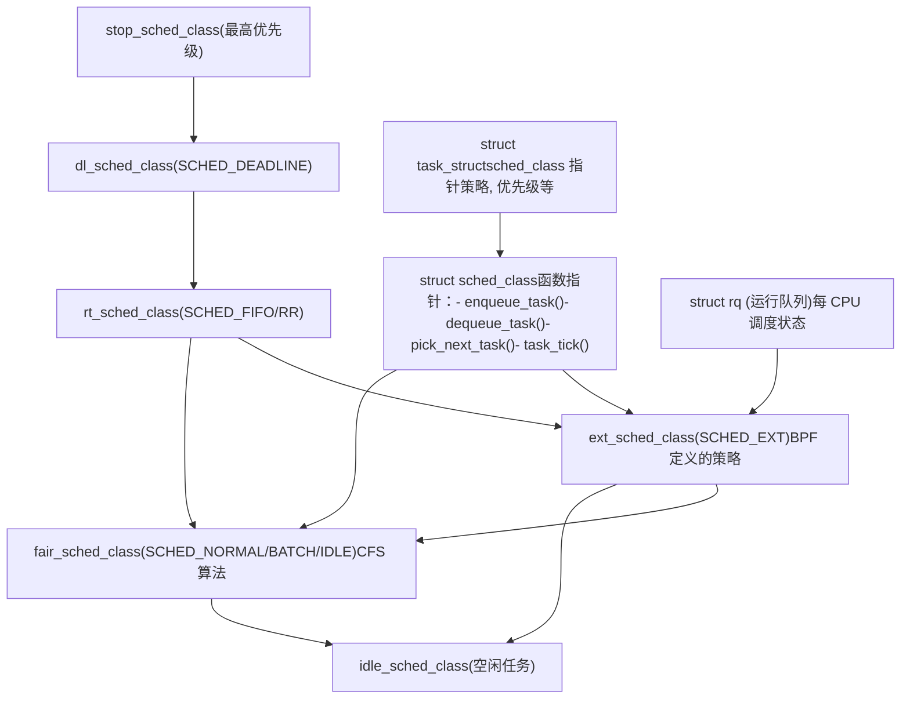
**调度类选择逻辑**

每个任务都有一个 `sched_class` 指针，决定哪个调度器管理它。该指针基于任务的调度策略设置：

-   `SCHED_DEADLINE` → `dl_sched_class`
-   `SCHED_FIFO`, `SCHED_RR` → `rt_sched_class`
-   `SCHED_EXT` → `ext_sched_class` (当启用 sched\_ext 时)
-   `SCHED_NORMAL`, `SCHED_BATCH`, `SCHED_IDLE` → `fair_sched_class`

调度器在 `pick_next_task()` 期间按优先级顺序遍历类，以选择最高优先级的可运行任务。

来源：[kernel/sched/sched.h1-1500](https://github.com/torvalds/linux/blob/fcb70a56/kernel/sched/sched.h#L1-L1500) [kernel/sched/core.c192-260](https://github.com/torvalds/linux/blob/fcb70a56/kernel/sched/core.c#L192-L260)

## sched\_ext 架构概览

**sched\_ext** 是 Linux 调度器的一个革命性扩展，允许在运行时将调度策略定义并加载为 BPF 程序。这消除了在试验或部署自定义调度器时对内核补丁和重启的需求。

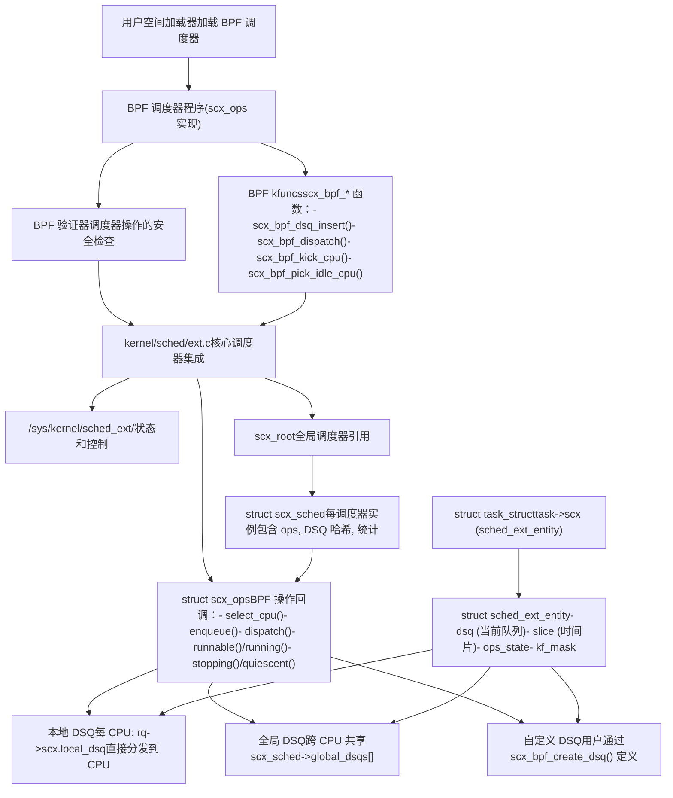
**关键创新**：BPF 调度器定义任务排队和分发逻辑。当任务变为可运行时，`ops.enqueue()` 回调决定将其放置在哪个分发队列。`ops.dispatch()` 回调将任务从分发队列移动到 CPU 本地队列以执行。

来源：[kernel/sched/ext.c1-10000](https://github.com/torvalds/linux/blob/fcb70a56/kernel/sched/ext.c#L1-L10000) [kernel/sched/ext.h1-100](https://github.com/torvalds/linux/blob/fcb70a56/kernel/sched/ext.h#L1-L100)

## 核心数据结构

### struct sched\_ext\_entity

每个任务的 sched\_ext 状态在 `task->scx` 中跟踪：

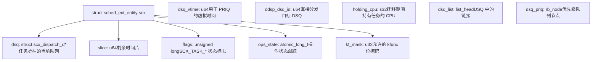
**ops\_state 跟踪**：`ops_state` 字段使用原子操作来跟踪任务当前是正在排队 (`SCX_QUEUEING`) 还是分发 (`SCX_DISPATCHING`)。这实现了安全的并发访问以及 BPF 操作与核心调度器代码之间的适当同步。

来源：[include/linux/sched.h850-900](https://github.com/torvalds/linux/blob/fcb70a56/include/linux/sched.h#L850-L900) [kernel/sched/ext.c758-763](https://github.com/torvalds/linux/blob/fcb70a56/kernel/sched/ext.c#L758-L763)

### struct scx\_dispatch\_q (分发队列)

分发队列是 sched\_ext 中任务排队的基础数据结构：

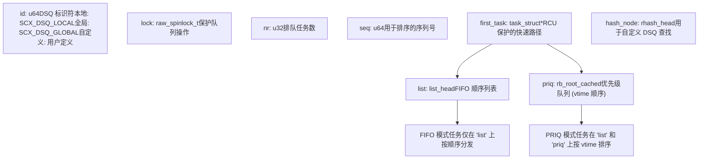
**两种分发模式**：

-   **FIFO 模式**：任务按入队顺序分发（使用 `list`）
-   **PRIQ 模式**：任务按虚拟时间 (`dsq_vtime`) 分发，同时使用 `list` 和 `priq` (红黑树)

来源：[kernel/sched/ext.c1010-1125](https://github.com/torvalds/linux/blob/fcb70a56/kernel/sched/ext.c#L1010-L1125)

### struct scx\_ops (BPF 操作)

`scx_ops` 结构体定义了 BPF 调度器的回调：

| 回调 | 用途 | 何时调用 |
| --- | --- | --- |
| `select_cpu(p, prev_cpu, wake_flags)` | 为唤醒任务选择目标 CPU | 在任务唤醒期间 |
| `enqueue(p, enq_flags)` | 决定任务排在哪里 | 当任务变为可运行时 |
| `dispatch(cpu, prev)` | 将任务从 DSQ 移动到本地队列 | 在调度决策期间 |
| `runnable(p, enq_flags)` | 任务是可运行的（可能尚未运行） | 入队前 |
| `running(p)` | 任务即将在 CPU 上运行 | 选择后，执行前 |
| `stopping(p, runnable)` | 任务正在停止执行 | 当任务停止运行时 |
| `quiescent(p, deq_flags)` | 任务不再可运行 | 出队后 |
| `yield(p, prev)` | 任务显式让出 CPU | 在 sched\_yield() 时 |
| `core_sched_before(a, b)` | 比较任务以进行核心调度 | 在核心调度选择期间 |
| `enable(p)` | 任务正在为 sched\_ext 启用 | 在策略更改为 SCHED\_EXT 期间 |
| `init_task(p)` | 初始化 sched\_ext 任务 | 在任务 fork/创建时 |
| `exit_task(p)` | 清理任务状态 | 在任务退出时 |

来源：[kernel/sched/ext.c310-383](https://github.com/torvalds/linux/blob/fcb70a56/kernel/sched/ext.c#L310-L383)

## sched\_ext 中的任务生命周期

### 唤醒与 CPU 选择

当任务唤醒时，sched\_ext 确定哪个 CPU 应该运行它：

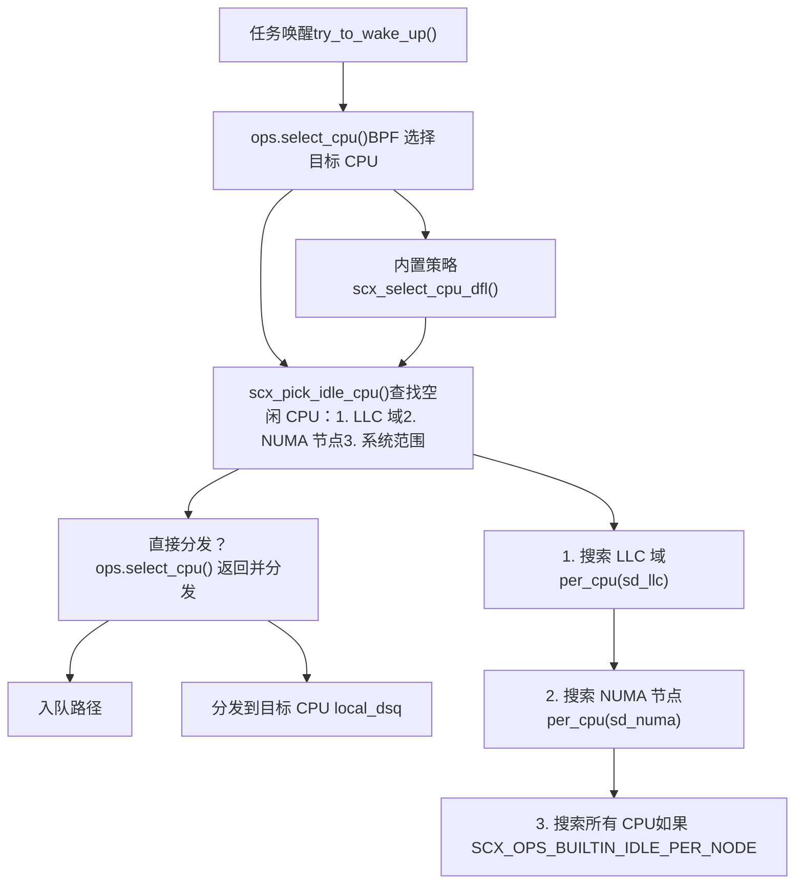
**空闲 CPU 选择**：内置策略 `scx_select_cpu_dfl()` 实现了一种尊重缓存拓扑的分层搜索策略：

1.  **LLC 域** (末级缓存)：优先选择共享同一 LLC 的 CPU 以保持热缓存行
2.  **NUMA 节点**：优先选择同一 NUMA 节点中的 CPU 以减少内存访问延迟
3.  **系统范围**：如果节点本地搜索失败，则搜索所有 CPU

这可以由 BPF 调度器自定义或完全禁用。

来源：[kernel/sched/ext\_idle.c200-225](https://github.com/torvalds/linux/blob/fcb70a56/kernel/sched/ext_idle.c#L200-L225) [kernel/sched/ext.c1800-1900](https://github.com/torvalds/linux/blob/fcb70a56/kernel/sched/ext.c#L1800-L1900)

### 入队与分发流程

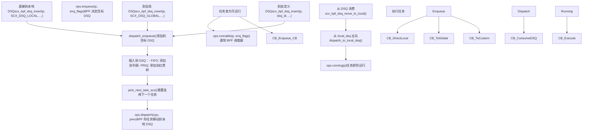
**关键见解**：`enqueue()` 和 `dispatch()` 操作的分离允许 BPF 调度器实现复杂的排队策略。任务可以放置在中间队列（全局或自定义 DSQ）上，随后基于全局状态或公平性策略移动到 CPU 本地队列。

来源：[kernel/sched/ext.c1010-1200](https://github.com/torvalds/linux/blob/fcb70a56/kernel/sched/ext.c#L1010-L1200) [kernel/sched/ext.c2500-2700](https://github.com/torvalds/linux/blob/fcb70a56/kernel/sched/ext.c#L2500-L2700)

## 分发队列 (DSQ) 类型与操作

### 内置 DSQ 类型

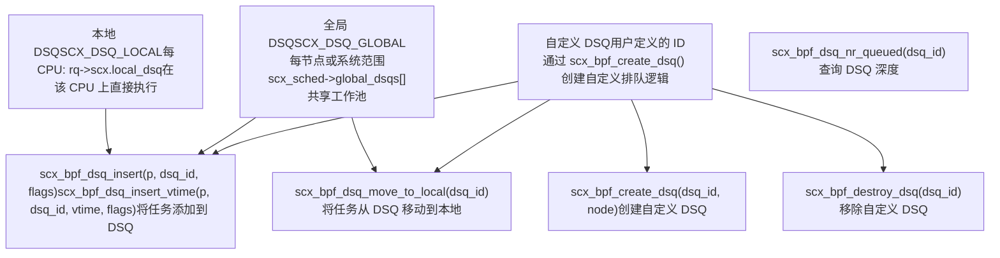
**本地 DSQ 优先级**：CPU 本地 DSQ 上的任务在 `pick_next_task_scx()` 期间总是首先被选中。这实现了对延迟敏感任务的低延迟直接分发。

**全局 DSQ 分区**：当启用 `SCX_OPS_BUILTIN_IDLE_PER_NODE` 时，全局 DSQ 按 NUMA 节点分区 (`global_dsqs[node_id]`) 以减少跨节点迁移。

来源：[kernel/sched/ext.c247-256](https://github.com/torvalds/linux/blob/fcb70a56/kernel/sched/ext.c#L247-L256) [kernel/sched/ext.c1010-1100](https://github.com/torvalds/linux/blob/fcb70a56/kernel/sched/ext.c#L1010-L1100)

### DSQ 迭代器与批量操作

sched\_ext 提供了一个迭代器接口，用于高效地在 DSQ 之间移动多个任务：

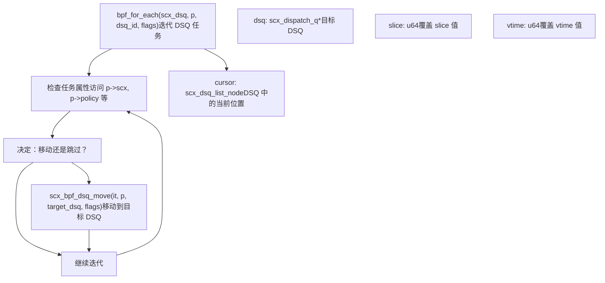
**批量操作**：迭代器允许 BPF 调度器通过在单个 `ops.dispatch()` 回调中检查并移动多个任务，来高效地跨 DSQ 重新平衡工作或实现复杂的公平性策略。

来源：[kernel/sched/ext.c440-500](https://github.com/torvalds/linux/blob/fcb70a56/kernel/sched/ext.c#L440-L500) [kernel/sched/ext.c3700-3900](https://github.com/torvalds/linux/blob/fcb70a56/kernel/sched/ext.c#L3700-L3900)

## 内置空闲 CPU 选择策略

默认的空闲 CPU 选择策略实现了拓扑感知的 CPU 选择，以优化缓存局部性和 NUMA 亲和性。

### 空闲 CPU 跟踪

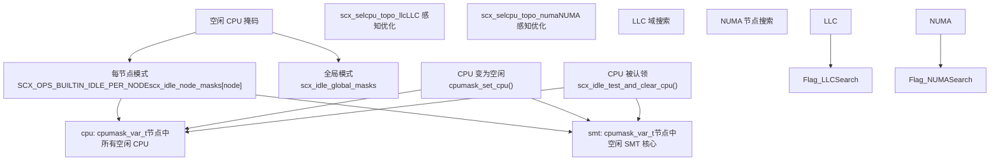
**SMT 核心偏好**：当 SMT (同步多线程) 处于活动状态时，`scx_pick_idle_cpu()` 在接受部分空闲的核心之前，首先搜索完全空闲的 SMT 核心（所有同级线程空闲）。这通过避免资源争用来最大化单线程性能。

### 拓扑感知搜索策略

空闲 CPU 选择遵循尊重缓存和 NUMA 拓扑的分层策略：

| 搜索级别 | 理由 | 实现 |
| --- | --- | --- |
| **LLC 域** | 最大化 L2/L3 缓存命中率 | 首先搜索 `cpu_smt_mask()`，然后搜索 `sched_domain_span(sd_llc)` |
| **NUMA 节点** | 最小化远程内存访问延迟 | 搜索 `sched_group_span(sd_numa)` |
| **系统范围** | 当无本地空闲 CPU 时确保进度 | 通过 `pick_idle_cpu_from_online_nodes()` 搜索所有节点 |

**自适应拓扑检测**：在调度器初始化时，`scx_idle_update_selcpu_topology()` 检测系统是否具有多个 LLC 域或多个 NUMA 节点，并相应地启用优化。对于单 LLC 或单节点系统，禁用优化以减少开销。

来源：[kernel/sched/ext\_idle.c115-225](https://github.com/torvalds/linux/blob/fcb70a56/kernel/sched/ext_idle.c#L115-L225) [kernel/sched/ext\_idle.c344-400](https://github.com/torvalds/linux/blob/fcb70a56/kernel/sched/ext_idle.c#L344-L400)

## BPF 操作上下文与 kfunc 限制

sched\_ext 对每个 `scx_ops` 回调可以调用哪些 BPF kfuncs (内核函数) 实施严格限制。这是通过 `kf_mask` 字段跟踪的。

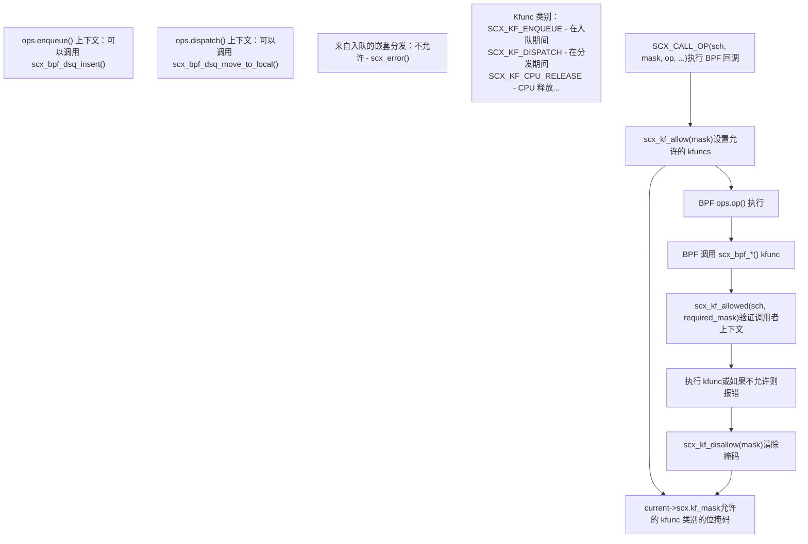
**防止嵌套**：kfunc 掩码强制执行嵌套边界。例如，不能从嵌套在分发操作内部的入队回调中调用分发操作。这防止了无限递归并确保可预测的调度器行为。

**验证**：当调用像 `scx_bpf_dsq_insert()` 这样的 BPF kfunc 时，它会检查 `scx_kf_allowed(sch, SCX_KF_ENQUEUE)`。如果当前操作上下文未设置所需的标志，则触发 `scx_error()` 并禁用调度器。

来源：[kernel/sched/ext.c274-413](https://github.com/torvalds/linux/blob/fcb70a56/kernel/sched/ext.c#L274-L413)

## 安全机制与错误处理

sched\_ext 包含全面的安全机制，以检测行为异常的 BPF 调度器并从中恢复。

### 监视器定时器 (Watchdog Timer)

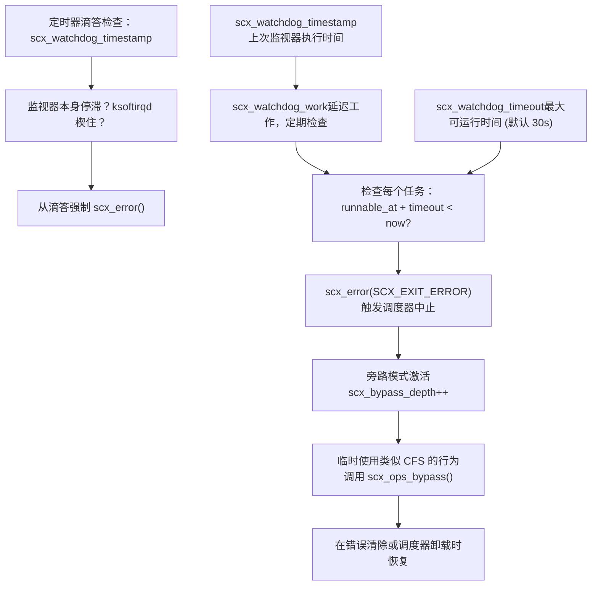
**监视器用途**：监视器通过检测保持可运行太久而未被分发的任务来确保系统向前推进。这防止了有缺陷的 BPF 调度器导致系统挂起。

**旁路模式 (Bypass Mode)**：当检测到错误时，sched\_ext 进入“旁路模式”，在此模式下它使用简化的回退调度策略。这允许系统在卸载或调试有问题的 BPF 调度器时保持运行。

来源：[kernel/sched/ext.c66-76](https://github.com/torvalds/linux/blob/fcb70a56/kernel/sched/ext.c#L66-L76) [kernel/sched/ext.c4800-5000](https://github.com/torvalds/linux/blob/fcb70a56/kernel/sched/ext.c#L4800-L5000)

### 错误报告与恢复

错误条件触发调度器禁用：

| 错误类型 | 触发 | 处理程序 | 恢复 |
| --- | --- | --- | --- |
| **无效 CPU** | BPF 返回无效 CPU ID | `ops_cpu_valid()` | `scx_error()`，进入旁路 |
| **无效 errno** | BPF 返回超出范围的错误 | `ops_sanitize_err()` | `scx_error()`，映射到 -EPROTO |
| **Kfunc 违规** | 在错误上下文中调用 Kfunc | `scx_kf_allowed()` | `scx_error()`，详细消息 |
| **监视器超时** | 任务可运行太久 | `scx_watchdog_work()` | `scx_error()`，转储任务信息 |
| **DSQ 损坏** | 无效 DSQ 状态 | 各种检查 | `WARN_ON_ONCE()`，`scx_error()` |

**错误信息**：当触发 `scx_error()` 时，错误消息存储在 `scx_exit_info` 中，并通过 `/sys/kernel/sched_ext/` 暴露以进行调试。BPF 调度器还可以通过 `scx_bpf_exit_bstr()` 提供自定义退出消息。

来源：[kernel/sched/ext.c770-810](https://github.com/torvalds/linux/blob/fcb70a56/kernel/sched/ext.c#L770-L810) [kernel/sched/ext.c199-217](https://github.com/torvalds/linux/blob/fcb70a56/kernel/sched/ext.c#L199-L217)

## 与核心调度器集成

sched\_ext 作为常规调度类集成到核心调度器中，与其他类和核心调度特性交互。

### 任务状态转换

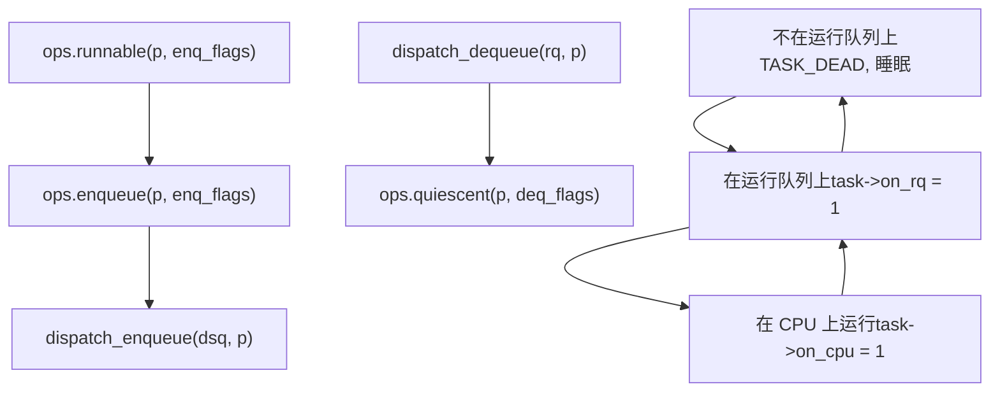
**状态一致性**：`ops_state` 字段确保原子性。在入队期间，它被设置为 `SCX_OPSS_QUEUEING`；在分发期间，为 `SCX_OPSS_DISPATCHING`。这防止了当 BPF 调度器和核心调度器并发操作同一任务时的竞争条件。

来源：[kernel/sched/ext.c1400-1600](https://github.com/torvalds/linux/blob/fcb70a56/kernel/sched/ext.c#L1400-L1600) [kernel/sched/ext.c2100-2300](https://github.com/torvalds/linux/blob/fcb70a56/kernel/sched/ext.c#L2100-L2300)

### 核心调度支持

sched\_ext 支持 Linux 的核心调度 (Core Scheduling) 特性，该特性确保只有受信任的任务在 SMT 兄弟线程上同时运行：

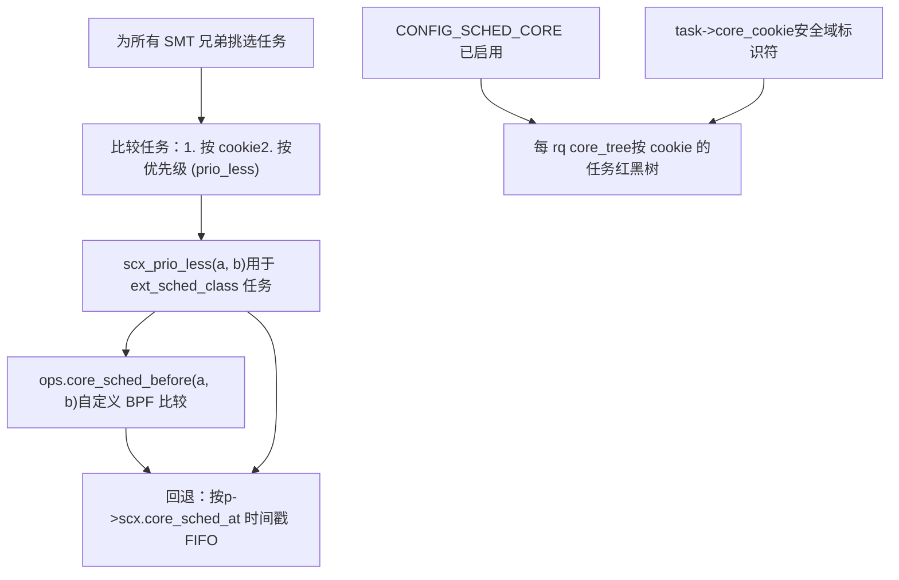
**自定义核心调度排序**：BPF 调度器可以实现 `ops.core_sched_before()` 来定义用于核心调度的自定义任务优先级。如果未提供，sched\_ext 使用基于任务上次分发时间戳的 FIFO 排序。

来源：[kernel/sched/core.c254-260](https://github.com/torvalds/linux/blob/fcb70a56/kernel/sched/core.c#L254-L260) [kernel/sched/ext.c900-945](https://github.com/torvalds/linux/blob/fcb70a56/kernel/sched/ext.c#L900-L945)

## 示例调度器

Linux 内核树包含几个演示不同调度策略的示例 BPF 调度器：

### scx\_qmap - 优先级队列调度器

**实现**：五个 FIFO 队列（使用 `BPF_MAP_TYPE_QUEUE`），具有不同的优先级。任务根据权重分配给队列，CPU 轮询队列，从高优先级队列分发更多任务。

**关键特性**：

-   演示使用 PID 的 BPF 侧排队
-   展示可睡眠的每任务存储分配
-   实现 `ops.cpu_release()` 用于抢占处理

来源：[tools/sched\_ext/scx\_qmap.bpf.c1-700](https://github.com/torvalds/linux/blob/fcb70a56/tools/sched_ext/scx_qmap.bpf.c#L1-L700)

### scx\_central - 集中式调度器

**实现**：单个 CPU 做出所有调度决策，将工作分发给其他 CPU。演示用于测试目的的极端集中化。

**关键特性**：

-   中心 CPU 使用 `ops.dispatch()` 将工作移动到远程 CPU
-   展示用于远程 CPU 唤醒的 `scx_bpf_kick_cpu()`
-   测试带有本地分发的全局决策

来源：[tools/sched\_ext/scx\_central.bpf.c1-500](https://github.com/torvalds/linux/blob/fcb70a56/tools/sched_ext/scx_central.bpf.c#L1-L500)

### scx\_flatcg - 扁平 Cgroup 调度器

**实现**：将 cgroup 层次结构扁平化为单层，通过权重复合实现基于权重的分层 CPU 控制。

**关键特性**：

-   演示 cgroup 集成 (`scx_bpf_task_cgroup()`)
-   展示基于虚拟时间 (vtime) 的调度以实现公平性
-   实现分层权重计算

来源：[tools/sched\_ext/scx\_flatcg.bpf.c1-900](https://github.com/torvalds/linux/blob/fcb70a56/tools/sched_ext/scx_flatcg.bpf.c#L1-L900)

## 性能考量

### 快速路径与优化

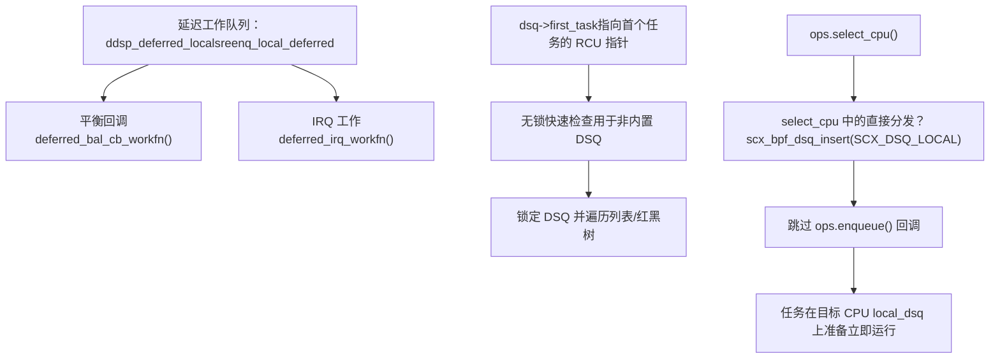
**直接分发**：最有效的路径是当 `ops.select_cpu()` 立即分发到目标 CPU 的本地 DSQ 时。这完全避免了 `ops.enqueue()` 和随后的 `ops.dispatch()` 回调，减少了对延迟敏感任务的开销。

**RCU 保护的首个任务**：对于自定义 DSQ，`dsq->first_task` 提供了一个指向首个任务的 RCU 保护指针，启用无锁查看。这被 BPF 调度器用于快速检查 DSQ 是否有工作而无需获取锁。

来源：[kernel/sched/ext.c1800-1900](https://github.com/torvalds/linux/blob/fcb70a56/kernel/sched/ext.c#L1800-L1900) [kernel/sched/ext.c1141-1146](https://github.com/torvalds/linux/blob/fcb70a56/kernel/sched/ext.c#L1141-L1146)

### 可扩展性特性

| 特性 | 优势 | 实现 |
| --- | --- | --- |
| **每 CPU 本地 DSQ** | 消除常见情况下的争用 | `rq->scx.local_dsq`，对本地 CPU 无锁 |
| **NUMA 感知全局 DSQ** | 减少跨节点流量 | 具有 `SCX_OPS_BUILTIN_IDLE_PER_NODE` 的 `global_dsqs[node]` |
| **自定义 DSQ 分区** | 允许 BPF 实现层次结构 | BPF 创建每实体或每组 DSQ |
| **批量分发** | 分摊分发开销 | `scx_dsp_max_batch` 控制批量大小 |
| **无锁 DSQ 迭代** | 减少再平衡期间的争用 | 具有 RCU 保护的 BPF 迭代器 |

来源：[kernel/sched/ext.c37-50](https://github.com/torvalds/linux/blob/fcb70a56/kernel/sched/ext.c#L37-L50) [kernel/sched/ext\_idle.c18-63](https://github.com/torvalds/linux/blob/fcb70a56/kernel/sched/ext_idle.c#L18-L63)

---

本文档提供了 Linux 进程调度的全面概述，重点介绍了 sched\_ext 可扩展调度器类。有关特定调度策略 (CFS, SCHED\_DEADLINE) 的详细信息，请参阅其各自的实现文件。有关调度器行为的可观测性和调试，请参阅 [追踪与可观测性](/torvalds/linux/4.2-tracing-and-observability)。
