# 追踪与可观测性

相关源文件

-   [Documentation/trace/events.rst](https://github.com/torvalds/linux/blob/fcb70a56/Documentation/trace/events.rst)
-   [Documentation/trace/ftrace.rst](https://github.com/torvalds/linux/blob/fcb70a56/Documentation/trace/ftrace.rst)
-   [arch/arm64/include/asm/ftrace.h](https://github.com/torvalds/linux/blob/fcb70a56/arch/arm64/include/asm/ftrace.h)
-   [arch/arm64/kernel/ftrace.c](https://github.com/torvalds/linux/blob/fcb70a56/arch/arm64/kernel/ftrace.c)
-   [arch/loongarch/include/asm/ftrace.h](https://github.com/torvalds/linux/blob/fcb70a56/arch/loongarch/include/asm/ftrace.h)
-   [arch/loongarch/kernel/ftrace\_dyn.c](https://github.com/torvalds/linux/blob/fcb70a56/arch/loongarch/kernel/ftrace_dyn.c)
-   [arch/powerpc/include/asm/ftrace.h](https://github.com/torvalds/linux/blob/fcb70a56/arch/powerpc/include/asm/ftrace.h)
-   [arch/powerpc/kernel/trace/ftrace.c](https://github.com/torvalds/linux/blob/fcb70a56/arch/powerpc/kernel/trace/ftrace.c)
-   [arch/powerpc/kernel/trace/ftrace\_64\_pg.c](https://github.com/torvalds/linux/blob/fcb70a56/arch/powerpc/kernel/trace/ftrace_64_pg.c)
-   [arch/powerpc/kernel/trace/ftrace\_entry.S](https://github.com/torvalds/linux/blob/fcb70a56/arch/powerpc/kernel/trace/ftrace_entry.S)
-   [arch/s390/include/asm/ftrace.h](https://github.com/torvalds/linux/blob/fcb70a56/arch/s390/include/asm/ftrace.h)
-   [arch/x86/include/asm/ftrace.h](https://github.com/torvalds/linux/blob/fcb70a56/arch/x86/include/asm/ftrace.h)
-   [arch/x86/kernel/ftrace.c](https://github.com/torvalds/linux/blob/fcb70a56/arch/x86/kernel/ftrace.c)
-   [arch/x86/kernel/ftrace\_64.S](https://github.com/torvalds/linux/blob/fcb70a56/arch/x86/kernel/ftrace_64.S)
-   [include/linux/fprobe.h](https://github.com/torvalds/linux/blob/fcb70a56/include/linux/fprobe.h)
-   [include/linux/ftrace.h](https://github.com/torvalds/linux/blob/fcb70a56/include/linux/ftrace.h)
-   [include/linux/ftrace\_regs.h](https://github.com/torvalds/linux/blob/fcb70a56/include/linux/ftrace_regs.h)
-   [include/linux/ring\_buffer.h](https://github.com/torvalds/linux/blob/fcb70a56/include/linux/ring_buffer.h)
-   [include/linux/string.h](https://github.com/torvalds/linux/blob/fcb70a56/include/linux/string.h)
-   [include/linux/trace\_events.h](https://github.com/torvalds/linux/blob/fcb70a56/include/linux/trace_events.h)
-   [include/trace/events/block.h](https://github.com/torvalds/linux/blob/fcb70a56/include/trace/events/block.h)
-   [include/trace/stages/stage3\_trace\_output.h](https://github.com/torvalds/linux/blob/fcb70a56/include/trace/stages/stage3_trace_output.h)
-   [include/trace/stages/stage7\_class\_define.h](https://github.com/torvalds/linux/blob/fcb70a56/include/trace/stages/stage7_class_define.h)
-   [kernel/trace/Kconfig](https://github.com/torvalds/linux/blob/fcb70a56/kernel/trace/Kconfig)
-   [kernel/trace/Makefile](https://github.com/torvalds/linux/blob/fcb70a56/kernel/trace/Makefile)
-   [kernel/trace/blktrace.c](https://github.com/torvalds/linux/blob/fcb70a56/kernel/trace/blktrace.c)
-   [kernel/trace/fgraph.c](https://github.com/torvalds/linux/blob/fcb70a56/kernel/trace/fgraph.c)
-   [kernel/trace/fprobe.c](https://github.com/torvalds/linux/blob/fcb70a56/kernel/trace/fprobe.c)
-   [kernel/trace/ftrace.c](https://github.com/torvalds/linux/blob/fcb70a56/kernel/trace/ftrace.c)
-   [kernel/trace/pid\_list.c](https://github.com/torvalds/linux/blob/fcb70a56/kernel/trace/pid_list.c)
-   [kernel/trace/pid\_list.h](https://github.com/torvalds/linux/blob/fcb70a56/kernel/trace/pid_list.h)
-   [kernel/trace/ring\_buffer.c](https://github.com/torvalds/linux/blob/fcb70a56/kernel/trace/ring_buffer.c)
-   [kernel/trace/trace.c](https://github.com/torvalds/linux/blob/fcb70a56/kernel/trace/trace.c)
-   [kernel/trace/trace.h](https://github.com/torvalds/linux/blob/fcb70a56/kernel/trace/trace.h)
-   [kernel/trace/trace\_dynevent.c](https://github.com/torvalds/linux/blob/fcb70a56/kernel/trace/trace_dynevent.c)
-   [kernel/trace/trace\_dynevent.h](https://github.com/torvalds/linux/blob/fcb70a56/kernel/trace/trace_dynevent.h)
-   [kernel/trace/trace\_entries.h](https://github.com/torvalds/linux/blob/fcb70a56/kernel/trace/trace_entries.h)
-   [kernel/trace/trace\_eprobe.c](https://github.com/torvalds/linux/blob/fcb70a56/kernel/trace/trace_eprobe.c)
-   [kernel/trace/trace\_events.c](https://github.com/torvalds/linux/blob/fcb70a56/kernel/trace/trace_events.c)
-   [kernel/trace/trace\_events\_hist.c](https://github.com/torvalds/linux/blob/fcb70a56/kernel/trace/trace_events_hist.c)
-   [kernel/trace/trace\_events\_synth.c](https://github.com/torvalds/linux/blob/fcb70a56/kernel/trace/trace_events_synth.c)
-   [kernel/trace/trace\_events\_trigger.c](https://github.com/torvalds/linux/blob/fcb70a56/kernel/trace/trace_events_trigger.c)
-   [kernel/trace/trace\_fprobe.c](https://github.com/torvalds/linux/blob/fcb70a56/kernel/trace/trace_fprobe.c)
-   [kernel/trace/trace\_functions.c](https://github.com/torvalds/linux/blob/fcb70a56/kernel/trace/trace_functions.c)
-   [kernel/trace/trace\_functions\_graph.c](https://github.com/torvalds/linux/blob/fcb70a56/kernel/trace/trace_functions_graph.c)
-   [kernel/trace/trace\_irqsoff.c](https://github.com/torvalds/linux/blob/fcb70a56/kernel/trace/trace_irqsoff.c)
-   [kernel/trace/trace\_kdb.c](https://github.com/torvalds/linux/blob/fcb70a56/kernel/trace/trace_kdb.c)
-   [kernel/trace/trace\_kprobe.c](https://github.com/torvalds/linux/blob/fcb70a56/kernel/trace/trace_kprobe.c)
-   [kernel/trace/trace\_output.c](https://github.com/torvalds/linux/blob/fcb70a56/kernel/trace/trace_output.c)
-   [kernel/trace/trace\_output.h](https://github.com/torvalds/linux/blob/fcb70a56/kernel/trace/trace_output.h)
-   [kernel/trace/trace\_probe.c](https://github.com/torvalds/linux/blob/fcb70a56/kernel/trace/trace_probe.c)
-   [kernel/trace/trace\_probe.h](https://github.com/torvalds/linux/blob/fcb70a56/kernel/trace/trace_probe.h)
-   [kernel/trace/trace\_probe\_tmpl.h](https://github.com/torvalds/linux/blob/fcb70a56/kernel/trace/trace_probe_tmpl.h)
-   [kernel/trace/trace\_sched\_switch.c](https://github.com/torvalds/linux/blob/fcb70a56/kernel/trace/trace_sched_switch.c)
-   [kernel/trace/trace\_sched\_wakeup.c](https://github.com/torvalds/linux/blob/fcb70a56/kernel/trace/trace_sched_wakeup.c)
-   [kernel/trace/trace\_selftest.c](https://github.com/torvalds/linux/blob/fcb70a56/kernel/trace/trace_selftest.c)
-   [kernel/trace/trace\_uprobe.c](https://github.com/torvalds/linux/blob/fcb70a56/kernel/trace/trace_uprobe.c)
-   [lib/tests/string\_kunit.c](https://github.com/torvalds/linux/blob/fcb70a56/lib/tests/string_kunit.c)
-   [samples/fprobe/fprobe\_example.c](https://github.com/torvalds/linux/blob/fcb70a56/samples/fprobe/fprobe_example.c)
-   [samples/trace\_events/trace-events-sample.h](https://github.com/torvalds/linux/blob/fcb70a56/samples/trace_events/trace-events-sample.h)

Linux 内核追踪与可观测性基础设施为调试、性能分析和运行时自省提供了全面的机制。该系统使开发人员能够以最小的开销追踪函数调用、捕获内核事件、测量延迟并分析系统行为。

有关编译追踪基础设施的构建系统信息，请参阅 [构建系统与 Kbuild](/torvalds/linux/4.3-build-system-and-kbuild)。有关调度器与追踪集成的信息 (sched\_ext 追踪)，请参阅 [进程调度与 sched\_ext](/torvalds/linux/4.1-process-scheduling-and-sched_ext)。

## 架构概览

追踪基础设施由几个相互连接的子系统组成，共同工作以捕获、存储和报告内核活动：

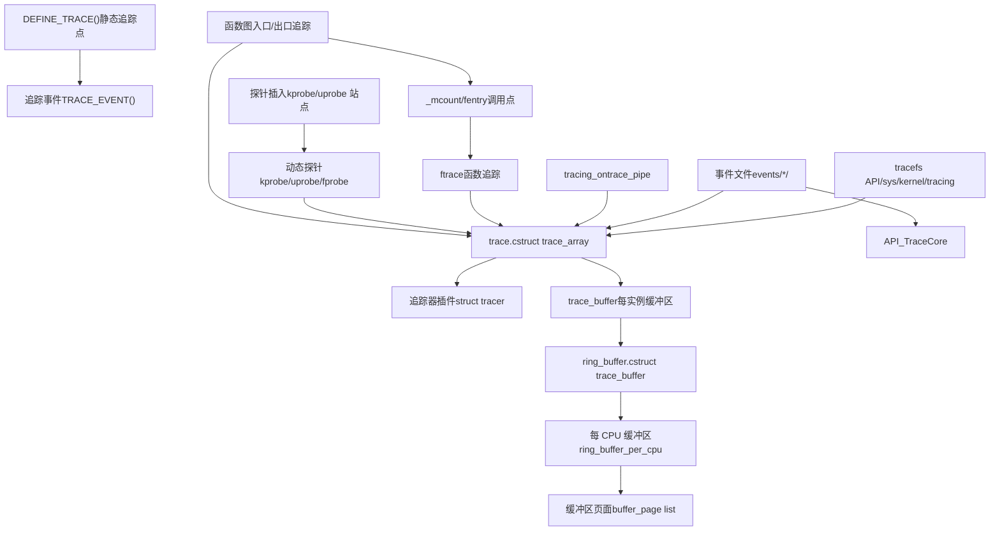
**架构：核心追踪子系统与数据流**

追踪系统是分层组织的：

-   **用户空间接口**：tracefs 文件系统提供基于文件的控制和输出
-   **前端 API**：针对不同用例的不同追踪机制（ftrace、事件、探针）
-   **核心基础设施**：通过 `struct trace_array` 和追踪器插件进行中央协调
-   **环形缓冲区**：用于高效数据存储的无锁每 CPU 循环缓冲区
-   **数据收集**：遍布内核的插桩点

来源：[kernel/trace/trace.c534-536](https://github.com/torvalds/linux/blob/fcb70a56/kernel/trace/trace.c#L534-L536) [kernel/trace/trace.h328-449](https://github.com/torvalds/linux/blob/fcb70a56/kernel/trace/trace.h#L328-L449) [kernel/trace/ring\_buffer.c570-597](https://github.com/torvalds/linux/blob/fcb70a56/kernel/trace/ring_buffer.c#L570-L597)

## 环形缓冲区实现

环形缓冲区是追踪系统的基础，以最小的开销为追踪数据提供无锁的每 CPU 存储。

### 环形缓冲区架构

```mermaid
flowchart TD
    TB_cpus["cpus: int"]
    TB_buffers["buffers: ring_buffer_per_cpu**"]
    TB_clock["clock: u64 (*)(void)"]
    TB_mutex["mutex: struct mutex"]
    RBPC_cpu["cpu: int"]
    RBPC_pages["pages: list_head"]
    RBPC_head_page["head_page: buffer_page*"]
    RBPC_tail_page["tail_page: buffer_page*"]
    RBPC_commit_page["commit_page: buffer_page*"]
    RBPC_reader_page["reader_page: buffer_page*"]
    RBPC_lock["lock: arch_spinlock_t"]
    BP_list["list: list_head"]
    BP_write["write: local_t"]
    BP_read["read: unsigned"]
    BP_page["page: buffer_data_page*"]
    BDP_time_stamp["time_stamp: u64"]
    BDP_commit["commit: local_t"]
    BDP_data["data: unsigned char[]"]

    TB --> buffers_RBPC_cpu
    RBPC --> pages_BP_list
    RBPC --> head_page_BP_list
    RBPC --> tail_page_BP_list
    RBPC --> commit_page_BP_list
    RBPC --> reader_page_BP_list
    BP --> page_BDP_time_stamp
```
**图表：环形缓冲区数据结构**

环形缓冲区使用一种复杂的页面交换机制来实现无锁读取：

-   **写入者操作**：写入尾部页面，满时推进
-   **读取者操作**：将其专用读取器页面与缓冲区页面交换
-   **页面结构**：每个页面包含时间戳、提交计数器和数据数组
-   **每 CPU 设计**：消除了跨 CPU 同步开销

来源：[kernel/trace/ring\_buffer.c512-568](https://github.com/torvalds/linux/blob/fcb70a56/kernel/trace/ring_buffer.c#L512-L568) [kernel/trace/ring\_buffer.c340-369](https://github.com/torvalds/linux/blob/fcb70a56/kernel/trace/ring_buffer.c#L340-L369)

### 环形缓冲区页面管理

环形缓冲区使用每 CPU 的页面循环列表和特殊的读取器页面来实现无锁设计：

| 组件 | 用途 | 关键字段 |
| --- | --- | --- |
| `ring_buffer_per_cpu` | 每 CPU 缓冲区实例 | `head_page`, `tail_page`, `commit_page`, `reader_page` |
| `buffer_page` | 页面元数据 | `write` (local\_t), `read`, `entries`, `real_end` |
| `buffer_data_page` | 实际数据存储 | `time_stamp`, `commit`, `data[]` |
| 页面列表 | 循环链表 | 写入者在填满时移动通过页面 |
| 读取器页面 | 专用读取页面 | 与缓冲区页面交换以进行无锁读取 |

关键的见解是读取器页面允许在不阻塞写入的情况下进行读取。当读取器完成消费其页面时，它会与环形缓冲区中的下一页交换，如 [kernel/trace/ring\_buffer.c88-154](https://github.com/torvalds/linux/blob/fcb70a56/kernel/trace/ring_buffer.c#L88-L154) 中的 ASCII 艺术所示。

来源：[kernel/trace/ring\_buffer.c359-369](https://github.com/torvalds/linux/blob/fcb70a56/kernel/trace/ring_buffer.c#L359-L369) [kernel/trace/ring\_buffer.c512-568](https://github.com/torvalds/linux/blob/fcb70a56/kernel/trace/ring_buffer.c#L512-L568)

### 环形缓冲区事件格式

存储在环形缓冲区中的事件使用压缩格式以最小化开销：

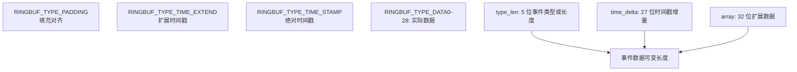
**图表：环形缓冲区事件编码**

事件格式使用位压缩来最小化空间：

-   **type\_len 字段 (5 位)**：编码事件类型（填充、时间扩展、时间戳）或数据长度
-   **time\_delta 字段 (27 位)**：存储与前一个事件的时间戳增量
-   **array 字段**：当 type\_len 为 0 时用于扩展长度，或用于扩展时间戳

这种压缩格式允许环形缓冲区在支持精确时间戳的同时，以最小的每事件开销存储事件。

来源：[kernel/trace/ring\_buffer.c66-86](https://github.com/torvalds/linux/blob/fcb70a56/kernel/trace/ring_buffer.c#L66-L86) [kernel/trace/ring\_buffer.c202-242](https://github.com/torvalds/linux/blob/fcb70a56/kernel/trace/ring_buffer.c#L202-L242)

## Ftrace: 函数追踪基础设施

Ftrace 通过编译器插桩和动态修补提供具有最小运行时开销的全面函数调用追踪。

### Ftrace 核心组件

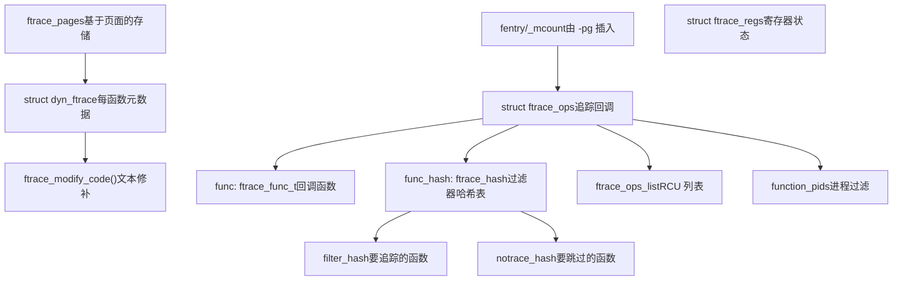
**图表：Ftrace 架构与控制流**

Ftrace 通过多个层级运行：

-   **编译器插桩**：GCC/Clang 在函数入口插入 `__fentry__` 调用
-   **动态修补**：运行时修改插桩以启用/禁用追踪
-   **回调系统**：`ftrace_ops` 结构体注册带有过滤器的回调
-   **哈希表**：通过函数名称或地址进行高效过滤

来源：[kernel/trace/ftrace.c88-102](https://github.com/torvalds/linux/blob/fcb70a56/kernel/trace/ftrace.c#L88-L102) [kernel/trace/ftrace.c1143-1149](https://github.com/torvalds/linux/blob/fcb70a56/kernel/trace/ftrace.c#L1143-L1149) [include/linux/ftrace.h1-69](https://github.com/torvalds/linux/blob/fcb70a56/include/linux/ftrace.h#L1-L69)

### Ftrace 操作与过滤

`struct ftrace_ops` 为函数追踪消费者提供了接口：

| 字段 | 类型 | 用途 |
| --- | --- | --- |
| `func` | `ftrace_func_t` | 为每个被追踪函数调用的回调 |
| `flags` | `unsigned long` | 操作标志 (SAVE\_REGS, PID 等) |
| `func_hash` | `struct ftrace_hash*` | 用于过滤的哈希表 |
| `local_hash.filter_hash` | `struct ftrace_hash*` | 要包含的函数 |
| `local_hash.notrace_hash` | `struct ftrace_hash*` | 要排除的函数 |
| `trampoline` | `unsigned long` | 自定义蹦床 (trampoline) 地址 |

过滤系统使用哈希表来高效地确定要追踪哪些函数。`ftrace_hash` 结构体 [kernel/trace/ftrace.c1087-1090](https://github.com/torvalds/linux/blob/fcb70a56/kernel/trace/ftrace.c#L1087-L1090) 包含由函数地址索引的 `ftrace_func_entry` 元素的桶。

进程级过滤通过存储要追踪或排除的 PID 集合的 `trace_pid_list` 结构体实现。

来源：[kernel/trace/ftrace.c1092-1099](https://github.com/torvalds/linux/blob/fcb70a56/kernel/trace/ftrace.c#L1092-L1099) [kernel/trace/trace.c652-724](https://github.com/torvalds/linux/blob/fcb70a56/kernel/trace/trace.c#L652-L724)

### 动态函数修补

当启用 `CONFIG_DYNAMIC_FTRACE` 时，ftrace 使用运行时代码修改来最小化开销：

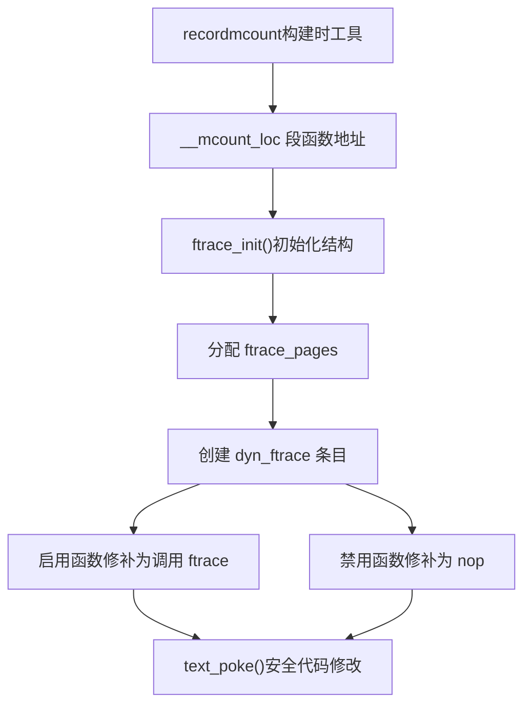
**图表：动态 Ftrace 初始化与运行时修补**

过程如下：

1.  **构建时**：`recordmcount` 工具识别所有函数入口点
2.  **启动时**：`ftrace_init()` 为每个函数创建 `dyn_ftrace` 条目
3.  **运行时**：代码被修补为调用 ftrace 处理程序或作为 NOP 执行

这允许在禁用时以零开销启用/禁用追踪。

来源：[kernel/trace/ftrace.c1143-1153](https://github.com/torvalds/linux/blob/fcb70a56/kernel/trace/ftrace.c#L1143-L1153) [kernel/trace/ftrace.c331-392](https://github.com/torvalds/linux/blob/fcb70a56/kernel/trace/ftrace.c#L331-L392)

## 追踪事件与追踪点

追踪事件使用 `TRACE_EVENT()` 宏系统在整个内核中提供静态插桩点。

### 追踪事件架构

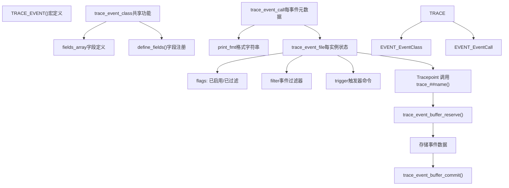
**图表：追踪事件基础设施**

追踪事件系统使用代码生成来创建高效的追踪代码：

-   **TRACE\_EVENT() 宏**：定义事件名称、参数、字段和打印格式
-   **trace\_event\_class**：具有相同签名的事件的共享代码
-   **trace\_event\_call**：每事件元数据，包括名称、系统和格式
-   **trace\_event\_file**：每实例状态，跟踪启用/过滤状态

来源：[kernel/trace/trace\_events.c1-49](https://github.com/torvalds/linux/blob/fcb70a56/kernel/trace/trace_events.c#L1-L49) [kernel/trace/trace.h181-227](https://github.com/torvalds/linux/blob/fcb70a56/kernel/trace/trace.h#L181-L227) [include/linux/trace\_events.h1-700](https://github.com/torvalds/linux/blob/fcb70a56/include/linux/trace_events.h#L1-L700)

### 事件注册与启用

追踪事件在启动或模块加载时注册，并且可以动态启用：

| 状态 | 描述 | 实现 |
| --- | --- | --- |
| 已注册 | 事件存在于系统中 | `ftrace_events` 列表中的 `trace_event_call` |
| 已启用 | 事件记录到缓冲区 | 设置 `TRACE_EVENT_FL_ENABLED` 标志 |
| 已过滤 | 事件有过滤器 | 附加到 `trace_event_file` 的 `event_filter` |
| 已触发 | 事件有触发器 | 附加的 `event_trigger_data` 列表 |

启用路径流程：

1.  用户写入 "1" 到 `events/<system>/<event>/enable`
2.  `event_enable_write()` 处理写入 [kernel/trace/trace\_events.c](https://github.com/torvalds/linux/blob/fcb70a56/kernel/trace/trace_events.c)
3.  调用 `ftrace_event_enable_disable()` 更新状态
4.  更新标志并可能注册/注销追踪点

来源：[kernel/trace/trace\_events.c618-700](https://github.com/torvalds/linux/blob/fcb70a56/kernel/trace/trace_events.c#L618-L700) [kernel/trace/trace.h324-449](https://github.com/torvalds/linux/blob/fcb70a56/kernel/trace/trace.h#L324-L449)

### 事件过滤

事件支持使用简单表达式语言的运行时过滤：

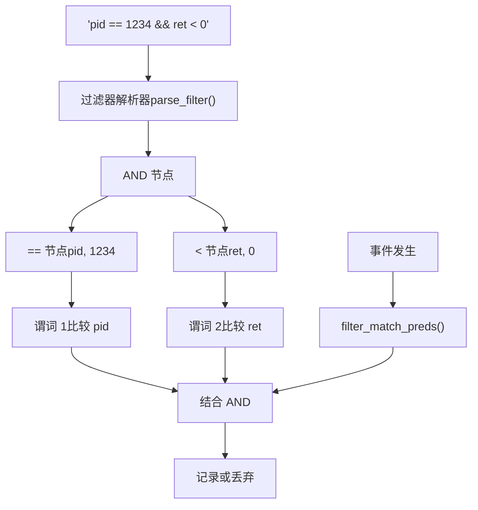
**图表：事件过滤器处理管道**

过滤器被编译为谓词树，在事件发生时进行评估。这允许在不影响无关事件的情况下进行高效过滤。

来源：[kernel/trace/trace\_events.c1-700](https://github.com/torvalds/linux/blob/fcb70a56/kernel/trace/trace_events.c#L1-L700) [kernel/trace/trace\_events\_filter.c](https://github.com/torvalds/linux/blob/fcb70a56/kernel/trace/trace_events_filter.c)

## 动态探针：kprobes, uprobes, fprobes

动态探针允许在不重新编译的情况下对任意内核和用户空间函数进行插桩。

### 动态探针类型

```mermaid
flowchart TD
    Kprobe_Define["trace_kprobestruct trace_probe"]
    Kprobe_Attach["附加到内核函数符号或地址"]
    Kprobe_Handler["前/后处理程序kprobe.h"]
    Uprobe_Define["trace_uprobestruct trace_probe"]
    Uprobe_Attach["附加到用户二进制路径:偏移量"]
    Uprobe_Handler["Uprobe 处理程序uprobes.h"]
    Fprobe_Define["trace_fprobestruct trace_probe"]
    Fprobe_Attach["附加到函数使用 ftrace"]
    Fprobe_Handler["入口/出口处理程序fprobe.h"]
    TraceProbe["struct trace_probe通用基类"]
    ProbeArgs["tp.args[]参数捕获"]
    TraceEvent["trace_event_call生成的事件"]

    Kprobe --> Define_TraceProbe
    Uprobe --> Define_TraceProbe
    Fprobe --> Define_TraceProbe
    TraceProbe --> ProbeArgs
    TraceProbe --> TraceEvent
    Kprobe --> Attach_Kprobe_Handler
    Uprobe --> Attach_Uprobe_Handler
    Fprobe --> Attach_Fprobe_Handler
```
**图表：动态探针类型与架构**

所有探针类型通过 `struct trace_probe` 共享通用基础设施，但连接机制不同：

-   **kprobes**：在内核地址使用断点或基于跳转的探测
-   **uprobes**：在用户空间程序文本中使用断点注入
-   **fprobes**：利用 ftrace 基础设施进行函数入口/出口追踪

来源：[kernel/trace/trace\_kprobe.c1-100](https://github.com/torvalds/linux/blob/fcb70a56/kernel/trace/trace_kprobe.c#L1-L100) [kernel/trace/trace\_uprobe.c1-100](https://github.com/torvalds/linux/blob/fcb70a56/kernel/trace/trace_uprobe.c#L1-L100) [kernel/trace/trace\_fprobe.c1-100](https://github.com/torvalds/linux/blob/fcb70a56/kernel/trace/trace_fprobe.c#L1-L100)

### 探针事件创建与参数

动态探针支持使用获取 (fetch) 方法的灵活参数捕获：

| 获取类型 | 语法 | 描述 | 实现 |
| --- | --- | --- | --- |
| 寄存器 | `%ax`, `%di` | CPU 寄存器值 | `FETCH_OP_ARG` |
| 内存 | `+0(%di)` | 解引用地址 | `FETCH_OP_DEREF` |
| 栈 | `$stack0` | 栈参数 | `FETCH_OP_STACK` |
| 返回值 | `$retval` | 函数返回 | `FETCH_OP_RETVAL` |
| 符号 | `$comm` | 任务 comm 字符串 | 特殊处理程序 |
| 立即数 | `\1234` | 立即数值 | `FETCH_OP_IMM` |

通过 tracefs 创建探针事件：

```
# 创建 kprobe 事件
echo 'p:myprobe do_sys_open filename=+0(%di):string flags=%si' > kprobe_events

# 创建 uprobe 事件
echo 'p:myuprobe /bin/bash:0x1234 arg1=%di' > uprobe_events

# 创建 fprobe 事件
echo 'f:myfprobe vfs_read count=%dx' > dynamic_events
```
获取指令系统在 [kernel/trace/trace\_probe.h100-200](https://github.com/torvalds/linux/blob/fcb70a56/kernel/trace/trace_probe.h#L100-L200) 中定义，执行在 [kernel/trace/trace\_kprobe.c800-1000](https://github.com/torvalds/linux/blob/fcb70a56/kernel/trace/trace_kprobe.c#L800-L1000) 中。

来源：[kernel/trace/trace\_probe.c1-100](https://github.com/torvalds/linux/blob/fcb70a56/kernel/trace/trace_probe.c#L1-L100) [kernel/trace/trace\_probe.h100-300](https://github.com/torvalds/linux/blob/fcb70a56/kernel/trace/trace_probe.h#L100-L300)

### Fprobe 与函数图集成

Fprobes 使用 ftrace 的函数入口机制，但为返回探针添加了复杂的影子栈管理：

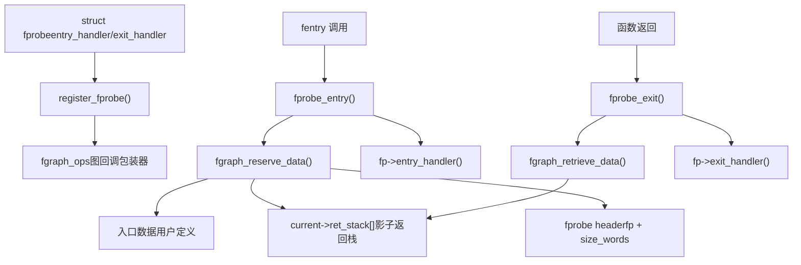
**图表：Fprobe 影子栈管理**

Fprobes 与函数图追踪器的影子栈集成，以跟踪返回地址并存储每次调用的数据。这使得能够关联函数入口和出口事件以及相关数据。

来源：[kernel/trace/fprobe.c160-238](https://github.com/torvalds/linux/blob/fcb70a56/kernel/trace/fprobe.c#L160-L238) [kernel/trace/fgraph.c1-200](https://github.com/torvalds/linux/blob/fcb70a56/kernel/trace/fgraph.c#L1-L200)

## 函数图追踪器

函数图追踪器提供带有计时信息的调用/返回追踪，创建内核执行流的可视化表示。

### 函数图基础设施

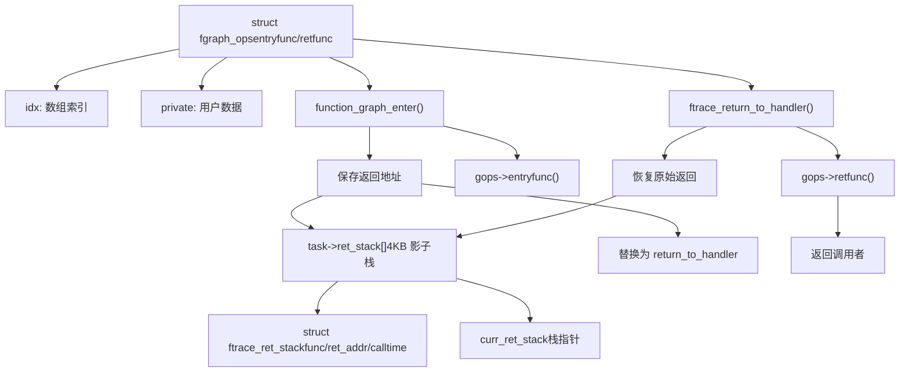
**图表：函数图追踪器架构**

函数图追踪器通过劫持函数返回地址来运行：

1.  **入口**：保存真实返回地址，替换为 `return_to_handler`
2.  **影子栈**：维护 `ftrace_ret_stack` 条目的每任务栈
3.  **出口**：`return_to_handler` 恢复真实返回地址并调用回调
4.  **多重操作**：通过数组索引支持多个并发图操作

来源：[kernel/trace/fgraph.c1-300](https://github.com/torvalds/linux/blob/fcb70a56/kernel/trace/fgraph.c#L1-L300) [kernel/trace/trace\_functions\_graph.c1-100](https://github.com/torvalds/linux/blob/fcb70a56/kernel/trace/trace_functions_graph.c#L1-L100)

### 函数图数据结构

影子栈实现使用精心的内存布局以提高效率：

| 结构体 | 大小 | 用途 | 关键字段 |
| --- | --- | --- | --- |
| `ftrace_ret_stack` | 32 字节 | 返回栈条目 | `ret` (返回地址), `func` (函数), `calltime` |
| 影子栈 | 4096 字节 | 每任务存储 | `task->ret_stack[]` 数组 |
| 位图头 | 1 个字 | 条目元数据 | 类型、偏移量、索引位图 |
| 保留数据 | 可变 | 每调用数据 | 存储在条目之后，由 `gops->idx` 索引 |

影子栈格式在 [kernel/trace/fgraph.c22-99](https://github.com/torvalds/linux/blob/fcb70a56/kernel/trace/fgraph.c#L22-L99) 中有详细记录。每个条目使用位图来跟踪哪些 `fgraph_ops` 希望调用其返回函数，并且附加字可以存储每调用数据。

来源：[kernel/trace/fgraph.c22-170](https://github.com/torvalds/linux/blob/fcb70a56/kernel/trace/fgraph.c#L22-L170) [kernel/trace/fgraph.c100-200](https://github.com/torvalds/linux/blob/fcb70a56/kernel/trace/fgraph.c#L100-L200)

### 图追踪器输出格式

函数图追踪器生成显示调用流的层次结构输出：

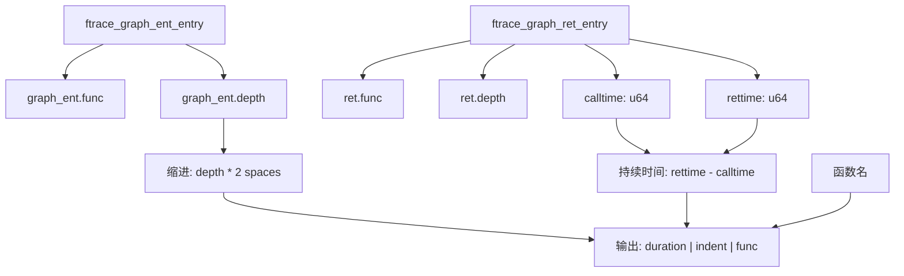
**图表：函数图追踪器输出生成**

追踪器记录入口和返回事件，然后将它们格式化为带有计时信息的层次显示。示例输出：

```
 0)               |  do_sys_open() {
 0)   0.123 us    |    getname();
 0)   0.456 us    |    path_lookup();
 0)   1.234 us    |  }
```
来源：[kernel/trace/trace\_functions\_graph.c100-500](https://github.com/torvalds/linux/blob/fcb70a56/kernel/trace/trace_functions_graph.c#L100-L500)

## 直方图触发器

直方图触发器提供强大的内核内追踪事件数据聚合和分析。

### 直方图架构

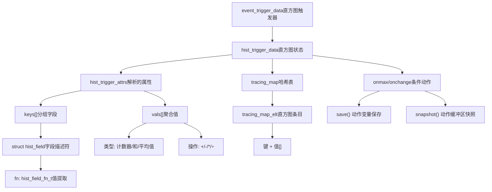
**图表：直方图触发器组件**

直方图触发器将事件流转换为聚合统计信息：

-   **键 (Keys)**：定义分组（例如，按 pid、cpu、函数名）
-   **值 (Values)**：累积数据（计数、求和、平均值）
-   **追踪映射 (Tracing Map)**：用于直方图存储的高效哈希表
-   **动作 (Actions)**：条件操作（最大值快照、保存变量）

来源：[kernel/trace/trace\_events\_hist.c1-300](https://github.com/torvalds/linux/blob/fcb70a56/kernel/trace/trace_events_hist.c#L1-L300) [kernel/trace/tracing\_map.h](https://github.com/torvalds/linux/blob/fcb70a56/kernel/trace/tracing_map.h)

### 直方图触发器语法

直方图通过 tracefs 创建，具有丰富的语法：

| 组件 | 语法 | 示例 | 描述 |
| --- | --- | --- | --- |
| 键 | `keys=field1,field2` | `keys=pid,cpu` | 按这些字段分组 |
| 值 | `vals=field:op` | `vals=bytes:sum` | 带操作的聚合 |
| 排序 | `sort=key:order` | `sort=hitcount:desc` | 对直方图输出排序 |
| 大小 | `size=N` | `size=2048` | 哈希表大小 |
| 动作 | `onmax($var).action` | `onmax($lat).snapshot()` | 条件触发 |

示例直方图命令：

```
echo 'hist:keys=pid:vals=bytes:sort=bytes:size=2048' > events/syscalls/sys_enter_read/trigger
```
高级特性包括：

-   **变量引用**：`$var`, `$var.field` 用于跨事件关联
-   **算术**：`bytes/time` 用于计算值
-   **动作**：`snapshot()`, `save()`, 合成事件生成
-   **过滤器**：结合事件过滤器进行选择性聚合

来源：[kernel/trace/trace\_events\_hist.c4000-5000](https://github.com/torvalds/linux/blob/fcb70a56/kernel/trace/trace_events_hist.c#L4000-L5000)

### 直方图追踪映射实现

`tracing_map` 为直方图数据提供高效的基于哈希的存储：

```mermaid
flowchart TD
    TM_map["tracing_map映射描述符"]
    TM_ops["map_ops操作"]
    TM_array["arraytracing_map_array[]"]
    TMA_entries["entries[]每 CPU 哈希数组"]
    TMA_n_entries["n_entries数组大小"]
    ELT_key["key[]键值"]
    ELT_val["val[]聚合值"]
    ELT_var["var[]变量存储"]
    Lookup["tracing_map_lookup()"]
    Insert["tracing_map_insert()"]
    Update["更新值"]

    TM --> map_TM_ops
    TM --> map_TM_array
    TM --> array_TMA_entries
    TMA --> entries_ELT_key
    ELT --> key_ELT_val
    ELT --> val_ELT_var
    Lookup --> TMA_entries
    Insert --> TMA_entries
    Update --> ELT_val
```
**图表：追踪映射数据结构**

追踪映射使用每 CPU 哈希表来最小化锁争用：

-   **哈希函数**：将键元组映射到数组索引
-   **每 CPU 设计**：每个 CPU 维护自己的映射数组
-   **无锁更新**：每个 CPU 原 update 值
-   **聚合**：读取直方图时合并结果

这种设计允许以极小的开销进行高频事件聚合。

来源：[kernel/trace/tracing\_map.c](https://github.com/torvalds/linux/blob/fcb70a56/kernel/trace/tracing_map.c) [kernel/trace/tracing\_map.h](https://github.com/torvalds/linux/blob/fcb70a56/kernel/trace/tracing_map.h)

## Tracefs 接口

tracefs 文件系统提供追踪基础设施的主要用户空间接口。

### Tracefs 文件层次结构

```mermaid
flowchart TD
    Root["tracing/ 根"]
    TracingOn["tracing_on启用/禁用"]
    CurrentTracer["current_tracer选择追踪器"]
    TraceOptions["trace_options追踪器标志"]
    BufferSize["buffer_size_kb环形缓冲区大小"]
    Trace["trace格式化输出"]
    TracePipe["trace_pipe消费读取"]
    RawTrace["trace_raw二进制输出"]
    PerCPUTrace["per_cpu/cpu*/trace"]
    EventsDir["events/事件目录"]
    SystemDir["/子系统事件"]
    EventEnable["/enable"]
    EventFormat["/format"]
    EventFilter["/filter"]
    EventTrigger["/trigger"]
    KprobeEvents["kprobe_eventskprobe 定义"]
    UprobeEvents["uprobe_eventsuprobe 定义"]
    DynamicEvents["dynamic_eventsfprobe/eprobe"]
    AvailFilterFuncs["available_filter_functions"]
    SetFtraceFilter["set_ftrace_filter"]
    SetFtraceNotrace["set_ftrace_notrace"]
    SetFtracePid["set_ftrace_pid"]

    Root --> TracingOn
    Root --> CurrentTracer
    Root --> TraceOptions
    Root --> BufferSize
    Root --> Trace
    Root --> TracePipe
    Root --> RawTrace
    Root --> PerCPUTrace
    Root --> EventsDir
    Root --> KprobeEvents
    Root --> UprobeEvents
    Root --> DynamicEvents
    Root --> AvailFilterFuncs
    Root --> SetFtraceFilter
    Root --> SetFtraceNotrace
    Root --> SetFtracePid
    EventsDir --> SystemDir
    SystemDir --> EventEnable
    SystemDir --> EventFormat
    SystemDir --> EventFilter
    SystemDir --> EventTrigger
```
**图表：Tracefs 文件系统结构**

tracefs 层次结构组织追踪控制和输出：

-   **控制文件**：启用/禁用追踪、选择追踪器、配置选项
-   **输出文件**：以各种格式读取追踪数据
-   **事件控制**：每事件启用、格式、过滤、触发
-   **动态事件**：创建/删除动态探针
-   **函数追踪**：过滤要追踪的函数

来源：[kernel/trace/trace.c1-500](https://github.com/torvalds/linux/blob/fcb70a56/kernel/trace/trace.c#L1-L500) [kernel/trace/trace\_events.c1-500](https://github.com/torvalds/linux/blob/fcb70a56/kernel/trace/trace_events.c#L1-L500)

### 常见 Tracefs 操作

| 操作 | 文件路径 | 示例 | 效果 |
| --- | --- | --- | --- |
| 启用追踪 | `tracing_on` | `echo 1 > tracing_on` | 开始记录事件 |
| 选择追踪器 | `current_tracer` | `echo function_graph > current_tracer` | 切换到图追踪器 |
| 启用事件 | `events/sched/sched_switch/enable` | `echo 1 > enable` | 启用 sched\_switch 事件 |
| 设置过滤器 | `events/sched/sched_switch/filter` | `echo 'pid == 1234' > filter` | 按条件过滤 |
| 创建 kprobe | `kprobe_events` | `echo 'p:probe1 vfs_read' >> kprobe_events` | 添加 kprobe |
| 读取追踪 | `trace` | `cat trace` | 读取格式化追踪 |
| 流式追踪 | `trace_pipe` | `cat trace_pipe` | 阻塞式追踪读取 |
| 设置函数过滤器 | `set_ftrace_filter` | `echo 'vfs_*' > set_ftrace_filter` | 追踪 vfs\_\* 函数 |

该接口设计用于交互式使用和通过简单文件操作进行的程序化控制。

来源：[kernel/trace/trace.c5000-7000](https://github.com/torvalds/linux/blob/fcb70a56/kernel/trace/trace.c#L5000-L7000)

## 追踪器插件

追踪基础设施通过 `struct tracer` 接口支持可插拔的追踪器。

### 追踪器插件接口

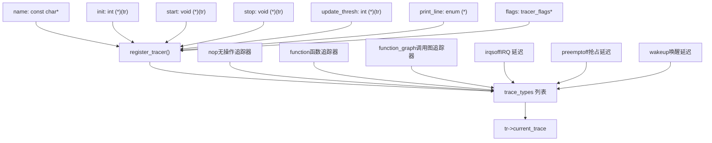
**图表：追踪器插件架构**

追踪器实现标准接口：

-   **生命周期**：`init()`, `start()`, `stop()` 控制追踪器状态
-   **输出**：`print_line()` 格式化追踪输出
-   **配置**：`tracer_flags` 用于每追踪器选项
-   **注册**：添加到全局列表，可通过 `current_tracer` 选择

来源：[kernel/trace/trace.h610-650](https://github.com/torvalds/linux/blob/fcb70a56/kernel/trace/trace.h#L610-L650) [kernel/trace/trace.c946-952](https://github.com/torvalds/linux/blob/fcb70a56/kernel/trace/trace.c#L946-L952)

### 延迟追踪器

延迟追踪器测量特定事件的最大延迟：

| 追踪器 | 用途 | 测量 | 实现 |
| --- | --- | --- | --- |
| `irqsoff` | IRQ 禁用延迟 | IRQ 禁用的时间 | [kernel/trace/trace\_irqsoff.c](https://github.com/torvalds/linux/blob/fcb70a56/kernel/trace/trace_irqsoff.c) |
| `preemptoff` | 抢占延迟 | 抢占禁用的时间 | [kernel/trace/trace\_irqsoff.c](https://github.com/torvalds/linux/blob/fcb70a56/kernel/trace/trace_irqsoff.c) |
| `preemptirqsoff` | 组合延迟 | IRQ 或抢占禁用 | [kernel/trace/trace\_irqsoff.c](https://github.com/torvalds/linux/blob/fcb70a56/kernel/trace/trace_irqsoff.c) |
| `wakeup` | 唤醒延迟 | 从唤醒到调度的时间 | [kernel/trace/trace\_sched\_wakeup.c](https://github.com/torvalds/linux/blob/fcb70a56/kernel/trace/trace_sched_wakeup.c) |
| `wakeup_rt` | RT 唤醒延迟 | RT 任务唤醒延迟 | [kernel/trace/trace\_sched\_wakeup.c](https://github.com/torvalds/linux/blob/fcb70a56/kernel/trace/trace_sched_wakeup.c) |

这些追踪器使用快照缓冲区来捕获最长延迟期间：

1.  连续追踪函数调用
2.  检测延迟期间的开始（例如，IRQ 禁用）
3.  当期间结束时，比较持续时间与最大值
4.  如果是新最大值，快照追踪缓冲区
5.  报告最大延迟和回溯

来源：[kernel/trace/trace\_irqsoff.c1-100](https://github.com/torvalds/linux/blob/fcb70a56/kernel/trace/trace_irqsoff.c#L1-L100) [kernel/trace/trace\_sched\_wakeup.c1-100](https://github.com/torvalds/linux/blob/fcb70a56/kernel/trace/trace_sched_wakeup.c#L1-L100)

## 性能考量

追踪基础设施设计为启用时开销极小，禁用时零开销。

### 开销缓解技术

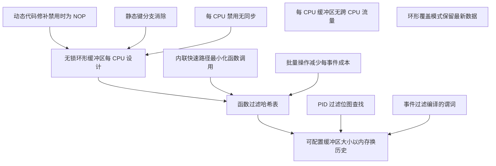
**图表：性能优化策略**

关键性能技术：

-   **动态修补**：追踪禁用时函数调用替换为 NOP
-   **静态键 (Static Keys)**：消除禁用特性的分支预测
-   **无锁环形缓冲区**：每 CPU 设计消除了锁定开销
-   **过滤**：早期过滤防止不必要的数据捕获
-   **每 CPU 架构**：消除缓存行抖动和同步

来源：[kernel/trace/ring\_buffer.c1-500](https://github.com/torvalds/linux/blob/fcb70a56/kernel/trace/ring_buffer.c#L1-L500) [kernel/trace/ftrace.c1-500](https://github.com/torvalds/linux/blob/fcb70a56/kernel/trace/ftrace.c#L1-L500)

### 缓冲区管理

环形缓冲区使用复杂的页面管理以提高效率：

| 特性 | 实现 | 优势 |
| --- | --- | --- |
| 每 CPU 缓冲区 | 每个 CPU 独立缓冲区 | 无跨 CPU 同步 |
| 无锁写入 | 原子操作 | 最小写入者开销 |
| 读取器页面交换 | 专用读取器页面 | 写入者从不被读取者阻塞 |
| 覆盖模式 | 环形包裹，丢弃旧数据 | 始终拥有最新数据 |
| 非覆盖模式 | 满时停止 | 保留所有数据 |
| 可变页面大小 | 可配置页面 | 内存/历史权衡 |

当追踪开始时，缓冲区自动从小的默认大小 [kernel/trace/trace.c942](https://github.com/torvalds/linux/blob/fcb70a56/kernel/trace/trace.c#L942-L942) 扩展，在追踪禁用时减少内存使用。

来源：[kernel/trace/ring\_buffer.c88-154](https://github.com/torvalds/linux/blob/fcb70a56/kernel/trace/ring_buffer.c#L88-L154) [kernel/trace/trace.c932-944](https://github.com/torvalds/linux/blob/fcb70a56/kernel/trace/trace.c#L932-L944)

## 与其他子系统集成

追踪基础设施与其他内核子系统深度集成。

### 调度器集成

调度器广泛使用追踪事件进行性能分析：

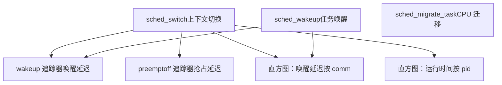
**图表：调度器追踪集成**

调度器事件启用：

-   延迟测量（唤醒、抢占、IRQ）
-   性能分析（运行时间分布、迁移模式）
-   行为分析（任务交互、调度决策）

有关调度器内部的信息，请参阅 [进程调度与 sched\_ext](/torvalds/linux/4.1-process-scheduling-and-sched_ext)。

来源：[include/trace/events/sched.h](https://github.com/torvalds/linux/blob/fcb70a56/include/trace/events/sched.h) [kernel/trace/trace\_sched\_wakeup.c](https://github.com/torvalds/linux/blob/fcb70a56/kernel/trace/trace_sched_wakeup.c)

### BPF 集成

BPF 程序可以访问追踪基础设施：

| 集成点 | 描述 | 用例 |
| --- | --- | --- |
| `bpf_trace_printk()` | 打印到追踪缓冲区 | 来自 BPF 的调试输出 |
| Kprobe BPF | 将 BPF 附加到 kprobes | 动态插桩 |
| Tracepoint BPF | 将 BPF 附加到事件 | 事件驱动程序 |
| Fentry/Fexit | 直接函数追踪 | 低开销追踪 |

BPF 程序既可以生成追踪数据，也可以消费数据用于决策。

来源：[kernel/trace/trace\_kprobe.c](https://github.com/torvalds/linux/blob/fcb70a56/kernel/trace/trace_kprobe.c) [kernel/trace/bpf\_trace.c](https://github.com/torvalds/linux/blob/fcb70a56/kernel/trace/bpf_trace.c)

### 合成事件

合成事件允许从现有追踪数据创建自定义事件：

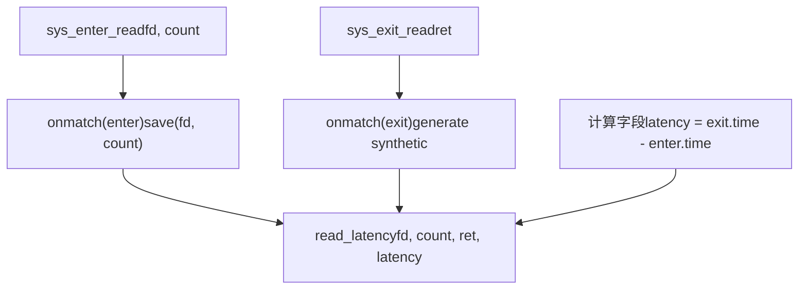
**图表：合成事件创建**

合成事件关联跨多个事件的数据，实现复杂分析：

-   通过公共字段匹配事件
-   保存早期事件的变量
-   使用计算字段生成新事件
-   启用派生指标的直方图分析

来源：[kernel/trace/trace\_events\_synth.c1-500](https://github.com/torvalds/linux/blob/fcb70a56/kernel/trace/trace_events_synth.c#L1-L500) [kernel/trace/trace\_events\_hist.c4000-5000](https://github.com/torvalds/linux/blob/fcb70a56/kernel/trace/trace_events_hist.c#L4000-L5000)

## 总结

Linux 内核追踪基础设施提供了一个全面的、低开销的系统来观察内核行为。关键组件包括：

-   **环形缓冲区**：用于高效数据存储的无锁每 CPU 循环缓冲区
-   **Ftrace**：具有动态修补和过滤的函数级追踪
-   **追踪事件**：具有丰富格式和过滤的静态追踪点
-   **动态探针**：通过 kprobes、uprobes 和 fprobes 进行运行时插桩
-   **函数图**：具有计时和层次结构的调用/返回追踪
-   **直方图触发器**：内核内聚合和分析
-   **Tracefs 接口**：通过文件系统操作的用户空间控制

该基础设施使得能够以最小的运行时开销进行性能分析、调试和对内核的理解。

来源：[kernel/trace/trace.c](https://github.com/torvalds/linux/blob/fcb70a56/kernel/trace/trace.c) [kernel/trace/ftrace.c](https://github.com/torvalds/linux/blob/fcb70a56/kernel/trace/ftrace.c) [kernel/trace/ring\_buffer.c](https://github.com/torvalds/linux/blob/fcb70a56/kernel/trace/ring_buffer.c) [kernel/trace/trace\_events.c](https://github.com/torvalds/linux/blob/fcb70a56/kernel/trace/trace_events.c) [kernel/trace/trace\_events\_hist.c](https://github.com/torvalds/linux/blob/fcb70a56/kernel/trace/trace_events_hist.c)
