# 构建系统与 Kbuild

相关源文件

-   [.gitignore](https://github.com/torvalds/linux/blob/fcb70a56/.gitignore)
-   [Documentation/kbuild/reproducible-builds.rst](https://github.com/torvalds/linux/blob/fcb70a56/Documentation/kbuild/reproducible-builds.rst)
-   [Makefile](https://github.com/torvalds/linux/blob/fcb70a56/Makefile)
-   [arch/mips/Makefile.postlink](https://github.com/torvalds/linux/blob/fcb70a56/arch/mips/Makefile.postlink)
-   [arch/riscv/Makefile.postlink](https://github.com/torvalds/linux/blob/fcb70a56/arch/riscv/Makefile.postlink)
-   [arch/riscv/boot/Makefile](https://github.com/torvalds/linux/blob/fcb70a56/arch/riscv/boot/Makefile)
-   [arch/s390/Makefile.postlink](https://github.com/torvalds/linux/blob/fcb70a56/arch/s390/Makefile.postlink)
-   [arch/x86/boot/startup/Makefile](https://github.com/torvalds/linux/blob/fcb70a56/arch/x86/boot/startup/Makefile)
-   [arch/x86/include/asm/setup.h](https://github.com/torvalds/linux/blob/fcb70a56/arch/x86/include/asm/setup.h)
-   [arch/x86/mm/mem_encrypt_boot.S](https://github.com/torvalds/linux/blob/fcb70a56/arch/x86/mm/mem_encrypt_boot.S)
-   [mm/kasan/Makefile](https://github.com/torvalds/linux/blob/fcb70a56/mm/kasan/Makefile)
-   [rust/Makefile](https://github.com/torvalds/linux/blob/fcb70a56/rust/Makefile)
-   [rust/helpers/bug.c](https://github.com/torvalds/linux/blob/fcb70a56/rust/helpers/bug.c)
-   [rust/helpers/jump_label.c](https://github.com/torvalds/linux/blob/fcb70a56/rust/helpers/jump_label.c)
-   [rust/kernel/.gitignore](https://github.com/torvalds/linux/blob/fcb70a56/rust/kernel/.gitignore)
-   [rust/kernel/bug.rs](https://github.com/torvalds/linux/blob/fcb70a56/rust/kernel/bug.rs)
-   [rust/kernel/generated_arch_reachable_asm.rs.S](https://github.com/torvalds/linux/blob/fcb70a56/rust/kernel/generated_arch_reachable_asm.rs.S)
-   [rust/kernel/generated_arch_static_branch_asm.rs.S](https://github.com/torvalds/linux/blob/fcb70a56/rust/kernel/generated_arch_static_branch_asm.rs.S)
-   [rust/kernel/generated_arch_warn_asm.rs.S](https://github.com/torvalds/linux/blob/fcb70a56/rust/kernel/generated_arch_warn_asm.rs.S)
-   [rust/kernel/jump_label.rs](https://github.com/torvalds/linux/blob/fcb70a56/rust/kernel/jump_label.rs)
-   [scripts/Makefile.build](https://github.com/torvalds/linux/blob/fcb70a56/scripts/Makefile.build)
-   [scripts/Makefile.lib](https://github.com/torvalds/linux/blob/fcb70a56/scripts/Makefile.lib)
-   [scripts/generate_rust_analyzer.py](https://github.com/torvalds/linux/blob/fcb70a56/scripts/generate_rust_analyzer.py)
-   [scripts/livepatch/fix-patch-lines](https://github.com/torvalds/linux/blob/fcb70a56/scripts/livepatch/fix-patch-lines)
-   [scripts/livepatch/klp-build](https://github.com/torvalds/linux/blob/fcb70a56/scripts/livepatch/klp-build)
-   [scripts/misc-check](https://github.com/torvalds/linux/blob/fcb70a56/scripts/misc-check)
-   [tools/objtool/klp-diff.c](https://github.com/torvalds/linux/blob/fcb70a56/tools/objtool/klp-diff.c)
-   [tools/power/cpupower/.gitignore](https://github.com/torvalds/linux/blob/fcb70a56/tools/power/cpupower/.gitignore)

## 目的与范围

本文档描述了 Linux 内核构建系统（称为 Kbuild），它编排从 C、汇编和 Rust 源文件编译内核及其模块的过程。构建系统处理配置管理、依赖跟踪、交叉编译、树外构建、外部模块和 Rust 集成。

有关正在构建的特定内核子系统的信息，请参阅其各自的文档（例如，[Rust for Linux](/torvalds/linux/2-rust-for-linux)，[进程调度](/torvalds/linux/4.1-process-scheduling-and-sched_ext)）。对于内核配置选项，本文档涵盖了 Kconfig 如何与构建集成，但不涉及配置选项本身。

## Kbuild 系统架构

### 递归 Make 结构

Kbuild 使用递归 make 方法，其中顶层 Makefile 在子目录上调用 `make`。每个子目录包含一个指定要构建内容的 Makefile 或 Kbuild 文件。

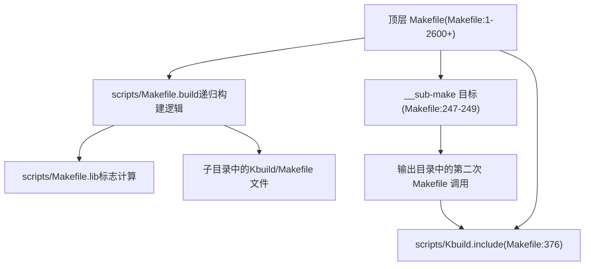
**来源：** [Makefile239-249](https://github.com/torvalds/linux/blob/fcb70a56/Makefile#L239-L249) [Makefile376](https://github.com/torvalds/linux/blob/fcb70a56/Makefile#L376-L376) [scripts/Makefile.build1-40](https://github.com/torvalds/linux/blob/fcb70a56/scripts/Makefile.build#L1-L40)

### 关键构建文件

| 文件 | 用途 | 行引用 |
| --- | --- | --- |
| `Makefile` | 顶层构建编排、工具选择、标志定义 | [Makefile1-2600](https://github.com/torvalds/linux/blob/fcb70a56/Makefile#L1-L2600) |
| `scripts/Kbuild.include` | 通用 make 实用程序和辅助函数 | [Makefile376](https://github.com/torvalds/linux/blob/fcb70a56/Makefile#L376-L376) |
| `scripts/Makefile.build` | 递归目录构建、编译规则 | [scripts/Makefile.build1-530](https://github.com/torvalds/linux/blob/fcb70a56/scripts/Makefile.build#L1-L530) |
| `scripts/Makefile.lib` | 标志计算、sanitizer 集成、objtool | [scripts/Makefile.lib1-492](https://github.com/torvalds/linux/blob/fcb70a56/scripts/Makefile.lib#L1-L492) |
| `scripts/Makefile.compiler` | 编译器能力检测 | [Makefile724](https://github.com/torvalds/linux/blob/fcb70a56/Makefile#L724-L724) |
| `rust/Makefile` | Rust 特定构建规则和 bindgen | [rust/Makefile1-695](https://github.com/torvalds/linux/blob/fcb70a56/rust/Makefile#L1-L695) |

**来源：** [Makefile376](https://github.com/torvalds/linux/blob/fcb70a56/Makefile#L376-L376) [Makefile724](https://github.com/torvalds/linux/blob/fcb70a56/Makefile#L724-L724) [scripts/Makefile.build35-38](https://github.com/torvalds/linux/blob/fcb70a56/scripts/Makefile.build#L35-L38)

## 配置系统集成

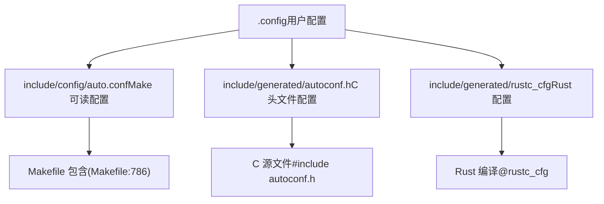
配置系统使用 Kconfig 生成多种输出格式：

-   `.config` - 人类可编辑的配置文件
-   `include/config/auto.conf` - Make 可读的变量定义，由 Makefiles 包含
-   `include/generated/autoconf.h` - C 预处理器定义
-   `include/generated/rustc_cfg` - Rust `--cfg` 标志

当 `.config` 更改时，`syncconfig` 目标（自动调用）会重新生成这些文件。

**来源：** [Makefile785-862](https://github.com/torvalds/linux/blob/fcb70a56/Makefile#L785-L862) [Makefile860-862](https://github.com/torvalds/linux/blob/fcb70a56/Makefile#L860-L862) [rust/Makefile162](https://github.com/torvalds/linux/blob/fcb70a56/rust/Makefile#L162-L162)

## 构建阶段与目标

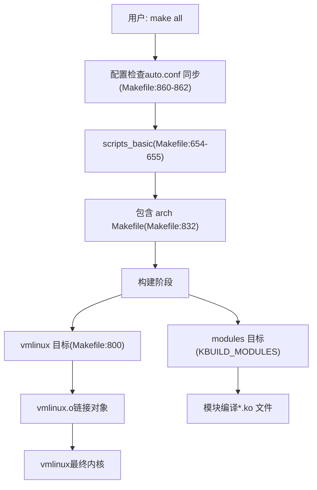
### 核心构建目标

| 目标 | 用途 | 关键变量 |
| --- | --- | --- |
| `all` | 默认目标，构建 vmlinux 和模块 | `__all` [Makefile752-755](https://github.com/torvalds/linux/blob/fcb70a56/Makefile#L752-L755) |
| `vmlinux` | 构建内核二进制文件 | [Makefile800](https://github.com/torvalds/linux/blob/fcb70a56/Makefile#L800-L800) |
| `modules` | 构建可加载内核模块 | `KBUILD_MODULES` [Makefile763-781](https://github.com/torvalds/linux/blob/fcb70a56/Makefile#L763-L781) |
| `clean` | 移除构建产物 | `clean-targets` [Makefile293](https://github.com/torvalds/linux/blob/fcb70a56/Makefile#L293-L293) |
| `mrproper` | 移除所有生成的文件 | [Makefile293](https://github.com/torvalds/linux/blob/fcb70a56/Makefile#L293-L293) |
| `*config` | 配置目标 (menuconfig 等) | [Makefile738-742](https://github.com/torvalds/linux/blob/fcb70a56/Makefile#L738-L742) |

**来源：** [Makefile752-800](https://github.com/torvalds/linux/blob/fcb70a56/Makefile#L752-800) [Makefile763-781](https://github.com/torvalds/linux/blob/fcb70a56/Makefile#L763-L781) [Makefile738-742](https://github.com/torvalds/linux/blob/fcb70a56/Makefile#L738-L742)

## 编译器与工具选择

### 工具变量

构建系统根据配置和命令行覆盖选择编译器和工具：

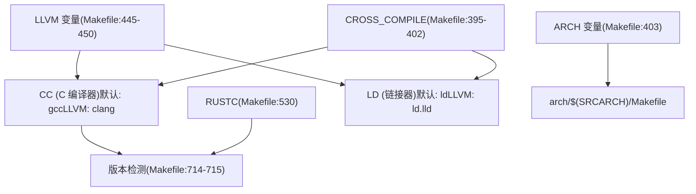
| 变量 | 默认 | 使用 LLVM | 用途 |
| --- | --- | --- | --- |
| `CC` | `$(CROSS_COMPILE)gcc` | `$(LLVM_PREFIX)clang$(LLVM_SUFFIX)` | C 编译器 [Makefile511-521](https://github.com/torvalds/linux/blob/fcb70a56/Makefile#L511-L521) |
| `RUSTC` | `rustc` | `rustc` | Rust 编译器 [Makefile530](https://github.com/torvalds/linux/blob/fcb70a56/Makefile#L530-L530) |
| `LD` | `$(CROSS_COMPILE)ld` | `$(LLVM_PREFIX)ld.lld$(LLVM_SUFFIX)` | 链接器 [Makefile513-522](https://github.com/torvalds/linux/blob/fcb70a56/Makefile#L513-L522) |
| `AR` | `$(CROSS_COMPILE)ar` | `$(LLVM_PREFIX)llvm-ar$(LLVM_SUFFIX)` | 归档器 [Makefile514-523](https://github.com/torvalds/linux/blob/fcb70a56/Makefile#L514-L523) |
| `BINDGEN` | `bindgen` | `bindgen` | Rust 绑定生成器 [Makefile534](https://github.com/torvalds/linux/blob/fcb70a56/Makefile#L534-L534) |

**来源：** [Makefile445-534](https://github.com/torvalds/linux/blob/fcb70a56/Makefile#L445-L534) [Makefile627-632](https://github.com/torvalds/linux/blob/fcb70a56/Makefile#L627-L632)

## 标志管理

### 标志组合

编译标志由多个来源以特定优先级组合而成：

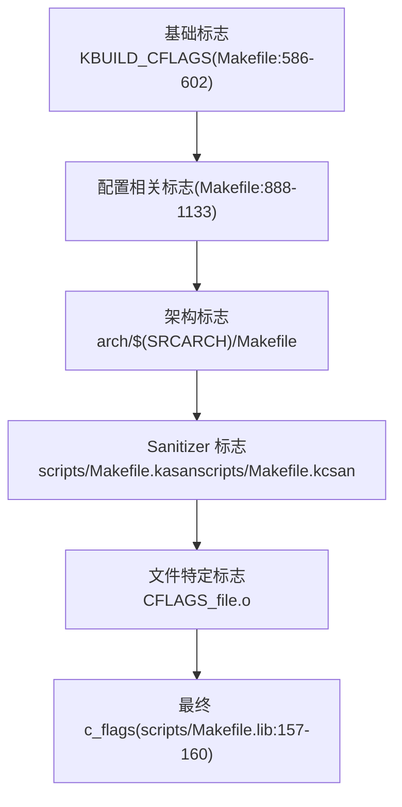
### C 编译标志

用于 C 编译的最终 `c_flags` 在 [scripts/Makefile.lib157-160](https://github.com/torvalds/linux/blob/fcb70a56/scripts/Makefile.lib#L157-L160) 中计算：

```
c_flags = -Wp,-MMD,$(depfile) $(NOSTDINC_FLAGS) $(LINUXINCLUDE) \
          -include $(srctree)/include/linux/compiler_types.h \
          $(_c_flags) $(modkern_cflags) \
          $(basename_flags) $(modname_flags)
```
其中：

-   `_c_flags` 包括基础 KBUILD_CFLAGS 加上 sanitizer 标志 [scripts/Makefile.lib26-29](https://github.com/torvalds/linux/blob/fcb70a56/scripts/Makefile.lib#L26-L29)
-   `modkern_cflags` 区分内置代码和模块代码 [scripts/Makefile.lib143-146](https://github.com/torvalds/linux/blob/fcb70a56/scripts/Makefile.lib#L143-L146)
-   `basename_flags` 定义 `KBUILD_BASENAME` [scripts/Makefile.lib21](https://github.com/torvalds/linux/blob/fcb70a56/scripts/Makefile.lib#L21-L21)
-   `modname_flags` 定义 `KBUILD_MODNAME` [scripts/Makefile.lib22-23](https://github.com/torvalds/linux/blob/fcb70a56/scripts/Makefile.lib#L22-L23)

**来源：** [scripts/Makefile.lib26-160](https://github.com/torvalds/linux/blob/fcb70a56/scripts/Makefile.lib#L26-L160) [Makefile586-602](https://github.com/torvalds/linux/blob/fcb70a56/Makefile#L586-L602)

### Rust 编译标志

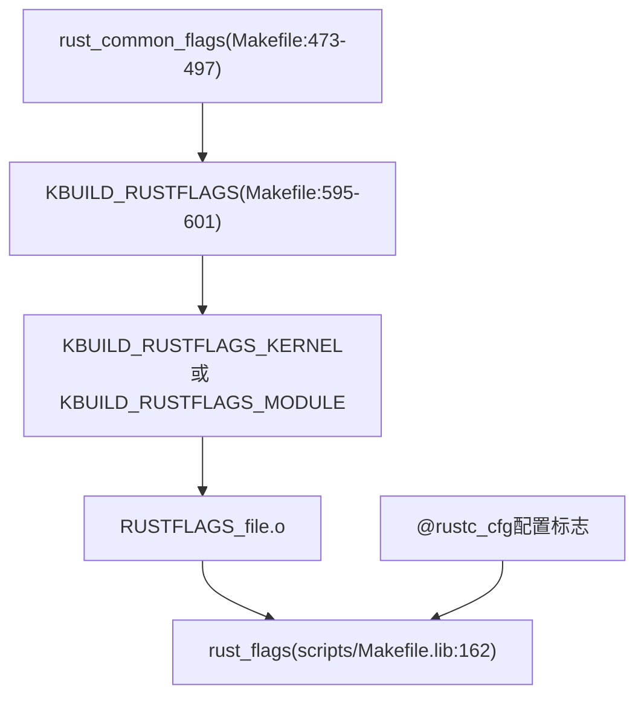
`rust_common_flags` [Makefile473-497](https://github.com/torvalds/linux/blob/fcb70a56/Makefile#L473-L497) 包括：

-   Edition 2021
-   Clippy lints
-   Feature flags
-   警告配置

内核特定标志 [Makefile595-601](https://github.com/torvalds/linux/blob/fcb70a56/Makefile#L595-L601) 添加：

-   `-Cpanic=abort`
-   `-Clto=n`
-   `-Ccodegen-units=1`
-   `-Csymbol-mangling-version=v0`

**来源：** [Makefile473-601](https://github.com/torvalds/linux/blob/fcb70a56/Makefile#L473-L601) [scripts/Makefile.lib30-162](https://github.com/torvalds/linux/blob/fcb70a56/scripts/Makefile.lib#L30-L162)

## Rust 集成

### Rust 构建组件

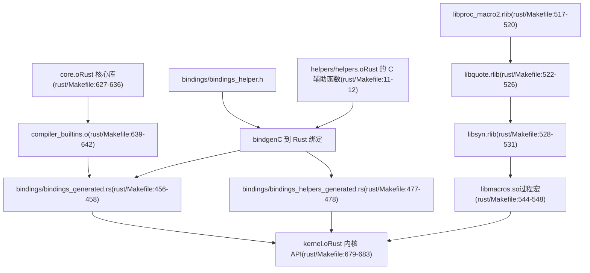
### 绑定生成

`bindgen` 工具从 C 头文件生成 Rust FFI 绑定：

**主绑定** [rust/Makefile456-458](https://github.com/torvalds/linux/blob/fcb70a56/rust/Makefile#L456-L458)：

-   输入：`bindings/bindings_helper.h`
-   输出：`bindings/bindings_generated.rs`
-   标志：`--use-core --with-derive-default --ctypes-prefix ffi`

**辅助绑定** [rust/Makefile477-478](https://github.com/torvalds/linux/blob/fcb70a56/rust/Makefile#L477-L478)：

-   输入：`helpers/helpers.c` (编译后)
-   输出：`bindings/bindings_helpers_generated.rs`
-   提取 `rust_helper_*` 函数原型

### Rust 编译命令

对于内核 Rust 代码 [scripts/Makefile.build325-335](https://github.com/torvalds/linux/blob/fcb70a56/scripts/Makefile.build#L325-L335)：

```rust
rust_common_cmd = \
    OBJTREE=$(abspath $(objtree)) \
    RUST_MODFILE=$(modfile) $(RUSTC_OR_CLIPPY) $(rust_flags) \
    -Zallow-features=$(rust_allowed_features) \
    -Zcrate-attr=no_std \
    --extern pin_init --extern kernel \
    --crate-type rlib -L $(objtree)/rust/ \
    --sysroot=/dev/null \
    --out-dir $(dir $@) --emit=dep-info=$(depfile)
```
**来源：** [rust/Makefile6-695](https://github.com/torvalds/linux/blob/fcb70a56/rust/Makefile#L6-L695) [scripts/Makefile.build320-354](https://github.com/torvalds/linux/blob/fcb70a56/scripts/Makefile.build#L320-L354) [scripts/generate_rust_analyzer.py1-227](https://github.com/torvalds/linux/blob/fcb70a56/scripts/generate_rust_analyzer.py#L1-L227)

## 模块构建

### 对象类别

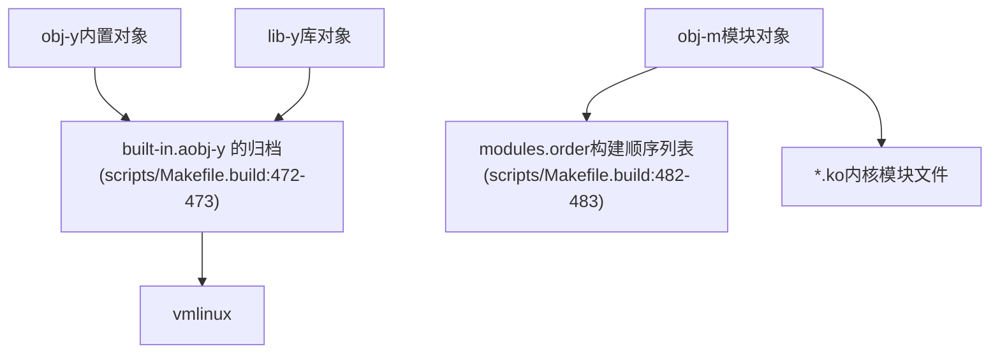
### 模块编译

每个目录的 Makefile 或 Kbuild 文件指定对象：

```makefile
obj-y += built_in_file.o
obj-m += module_file.o
lib-y += library_file.o

module_file-y := src1.o src2.o  # 复合模块
```
构建系统处理这些：

1.  **内置对象** (`obj-y`) 被编译并归档到 `built-in.a` [scripts/Makefile.build472-473](https://github.com/torvalds/linux/blob/fcb70a56/scripts/Makefile.build#L472-L473)
2.  **模块对象** (`obj-m`) 被编译并链接到 `.ko` 文件 [scripts/Makefile.build492-503](https://github.com/torvalds/linux/blob/fcb70a56/scripts/Makefile.build#L492-L503)
3.  **库对象** (`lib-y`) 被归档到 `lib.a` [scripts/Makefile.build489-490](https://github.com/torvalds/linux/blob/fcb70a56/scripts/Makefile.build#L489-L490)

### 模块链接

对于多文件模块 [scripts/Makefile.build500-503](https://github.com/torvalds/linux/blob/fcb70a56/scripts/Makefile.build#L500-L503)：

```makefile
cmd_ld_multi_m = $(LD) $(ld_flags) -r -o $@ @$< $(cmd_objtool)
```
这将多个 `.o` 文件链接为单个模块 `.o`，然后打包为 `.ko`。

**来源：** [scripts/Makefile.build14-503](https://github.com/torvalds/linux/blob/fcb70a56/scripts/Makefile.build#L14-L503)

## 依赖跟踪

### 依赖生成

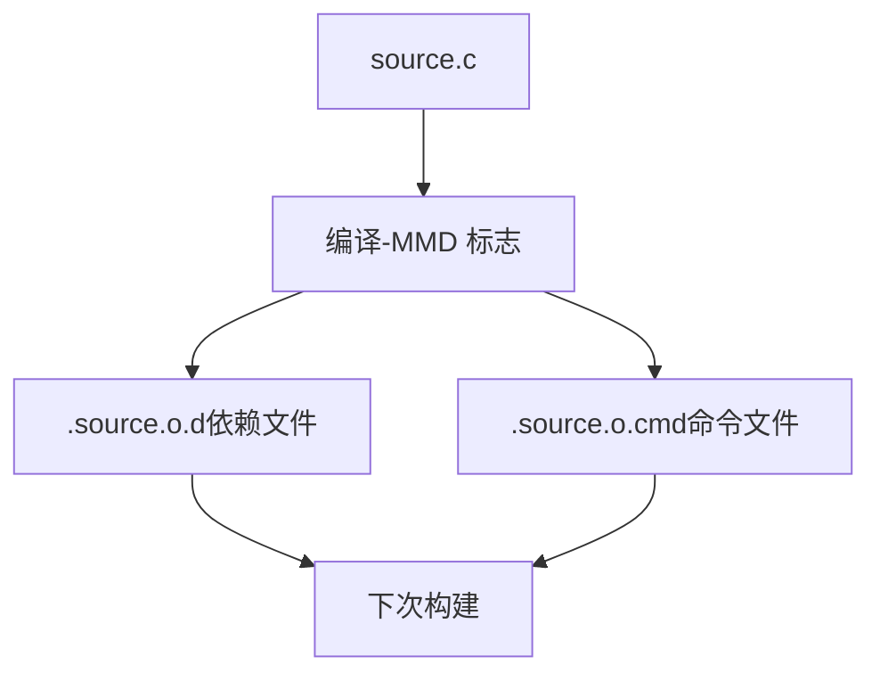
依赖通过以下方式跟踪：

1.  **`.d` 文件**：由 `-MMD` 标志生成，列出头文件依赖 [scripts/Makefile.lib157](https://github.com/torvalds/linux/blob/fcb70a56/scripts/Makefile.lib#L157-L157)
2.  **`.cmd` 文件**：记录确切的编译命令以检测标志更改

`fixdep` 工具处理 `.d` 文件以自动添加 `CONFIG_*` 依赖。

**来源：** [scripts/Makefile.lib157](https://github.com/torvalds/linux/blob/fcb70a56/scripts/Makefile.lib#L157-L157) [Makefile63-69](https://github.com/torvalds/linux/blob/fcb70a56/Makefile#L63-L69)

## Objtool 集成

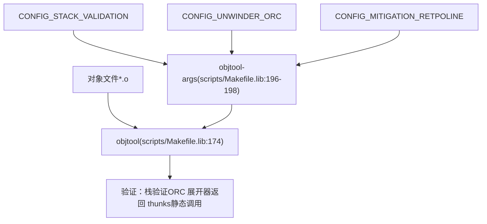
Objtool 对对象文件执行编译后验证和转换：

| 特性 | 配置 | 标志 |
| --- | --- | --- |
| 栈验证 | `CONFIG_STACK_VALIDATION` | `--stackval` [scripts/Makefile.lib189](https://github.com/torvalds/linux/blob/fcb70a56/scripts/Makefile.lib#L189-L189) |
| ORC 展开器 | `CONFIG_UNWINDER_ORC` | `--orc` [scripts/Makefile.lib185](https://github.com/torvalds/linux/blob/fcb70a56/scripts/Makefile.lib#L185-L185) |
| Retpoline | `CONFIG_MITIGATION_RETPOLINE` | `--retpoline` [scripts/Makefile.lib186](https://github.com/torvalds/linux/blob/fcb70a56/scripts/Makefile.lib#L186-L186) |
| 静态调用 | `CONFIG_HAVE_STATIC_CALL_INLINE` | `--static-call` [scripts/Makefile.lib190](https://github.com/torvalds/linux/blob/fcb70a56/scripts/Makefile.lib#L190-L190) |

该命令通过 `cmd_objtool` [scripts/Makefile.lib202](https://github.com/torvalds/linux/blob/fcb70a56/scripts/Makefile.lib#L202-L202) 在编译后调用。

**来源：** [scripts/Makefile.lib172-207](https://github.com/torvalds/linux/blob/fcb70a56/scripts/Makefile.lib#L172-L207)

## 树外构建

### 构建目录设置

树外构建分离源代码和构建目录：

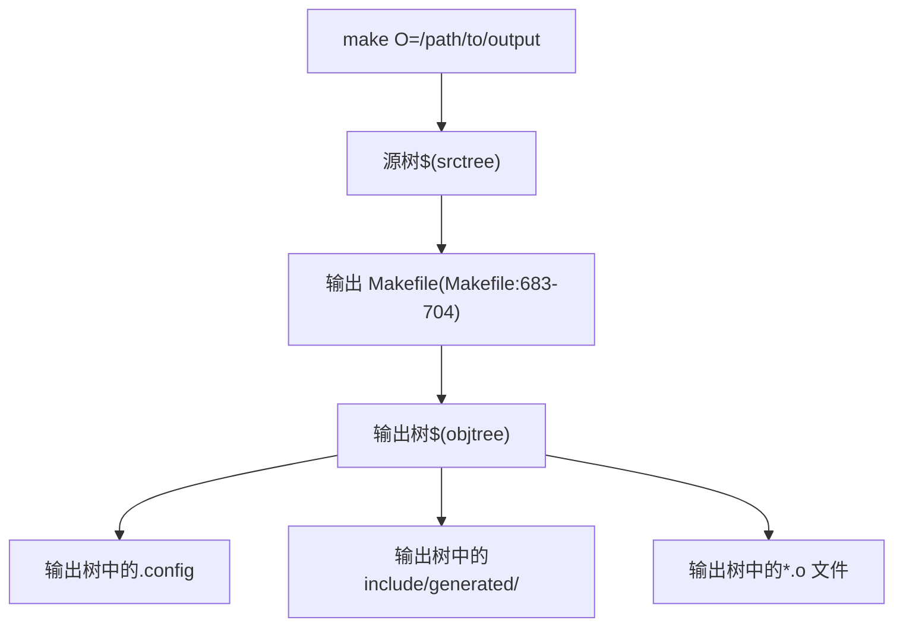
过程：

1.  首次 make 调用检测 `O=` 或 `KBUILD_OUTPUT` [Makefile180-214](https://github.com/torvalds/linux/blob/fcb70a56/Makefile#L180-L214)
2.  创建输出目录并在那里生成 Makefile [Makefile676-681](https://github.com/torvalds/linux/blob/fcb70a56/Makefile#L676-L681)
3.  第二次 make 调用在输出目录运行，`srctree` 指向源代码

关键变量：

-   `srctree`：源代码目录路径 [Makefile275](https://github.com/torvalds/linux/blob/fcb70a56/Makefile#L275-L275)
-   `objtree`：输出目录路径 [Makefile186-202](https://github.com/torvalds/linux/blob/fcb70a56/Makefile#L186-L202)
-   `VPATH`：Make 源代码搜索路径 [Makefile278](https://github.com/torvalds/linux/blob/fcb70a56/Makefile#L278-L278)

**来源：** [Makefile160-282](https://github.com/torvalds/linux/blob/fcb70a56/Makefile#L160-L282) [Makefile658-707](https://github.com/torvalds/linux/blob/fcb70a56/Makefile#L658-L707)

## 外部模块构建

### 外部模块系统

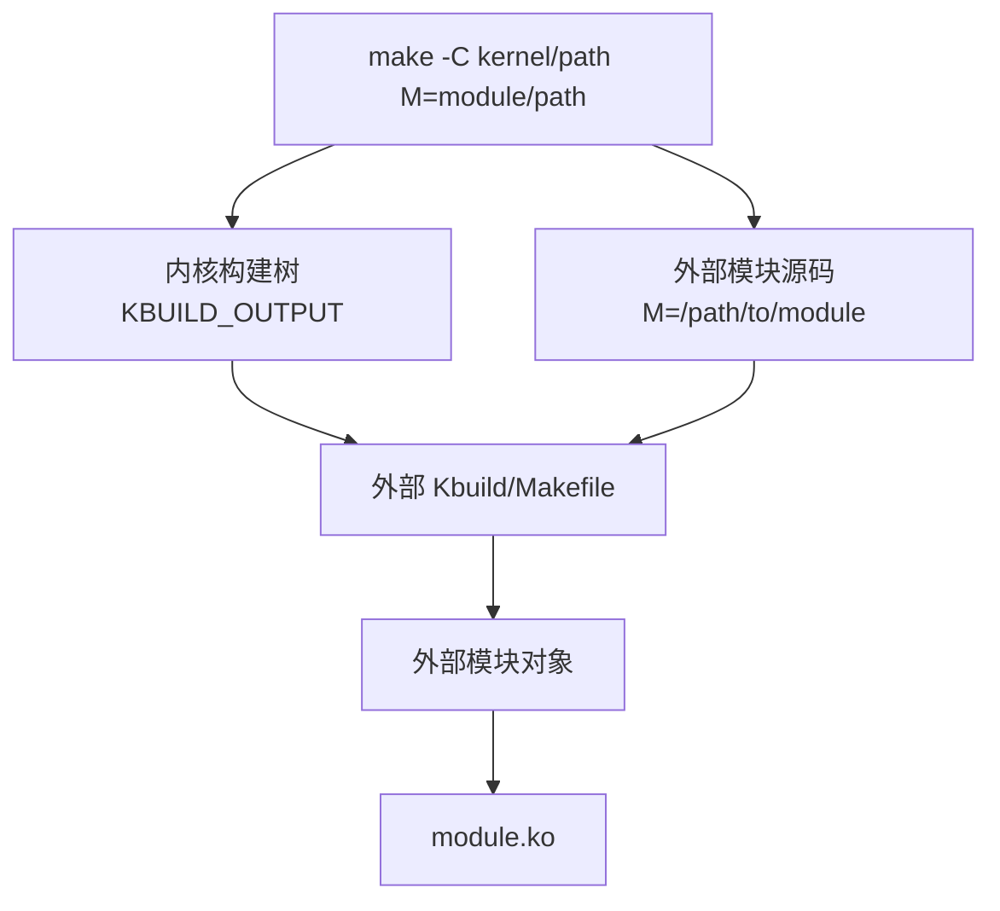
外部模块是对照现有内核构建进行构建的：

```bash
make -C /lib/modules/$(uname -r)/build M=$PWD
```
关键变量：

-   `KBUILD_EXTMOD`：外部模块目录 [Makefile132-152](https://github.com/torvalds/linux/blob/fcb70a56/Makefile#L132-L152)
-   `M=`：`KBUILD_EXTMOD` 的命令行覆盖 [Makefile133-135](https://github.com/torvalds/linux/blob/fcb70a56/Makefile#L133-L135)

外部模块继承：

-   来自内核构建的编译器和标志
-   来自内核 `.config` 的配置
-   来自内核构建的生成头文件

**来源：** [Makefile131-205](https://github.com/torvalds/linux/blob/fcb70a56/Makefile#L131-L205) [Makefile752-755](https://github.com/torvalds/linux/blob/fcb70a56/Makefile#L752-L755)

## 交叉编译

### 架构设置

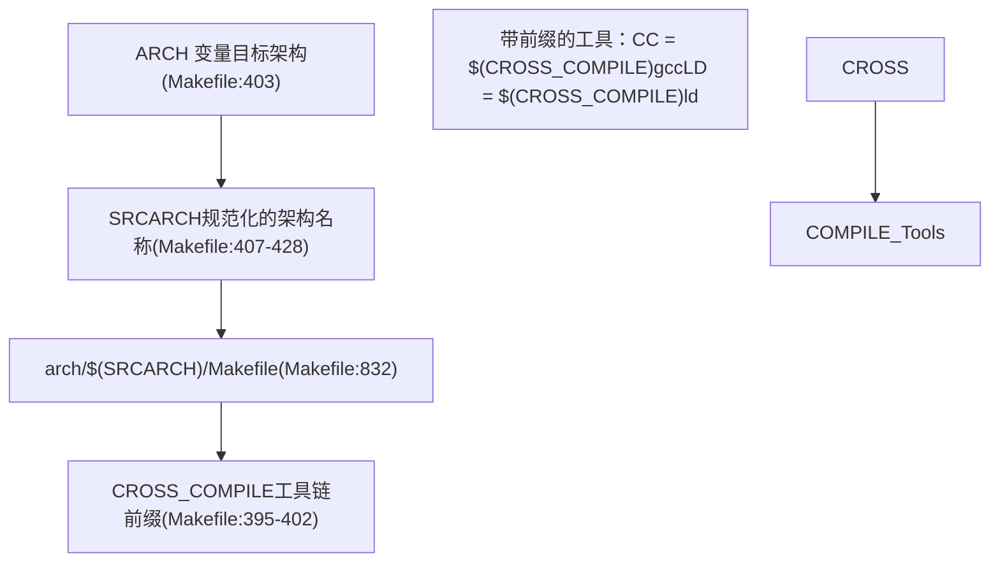
交叉编译通过以下方式配置：

```bash
make ARCH=arm64 CROSS_COMPILE=aarch64-linux-gnu-
```
| 变量 | 用途 | 示例 |
| --- | --- | --- |
| `ARCH` | 目标架构 | `arm64`, `x86`, `riscv` [Makefile403](https://github.com/torvalds/linux/blob/fcb70a56/Makefile#L403-L403) |
| `SRCARCH` | 源代码架构路径 | `arm64`, `x86`, `riscv` [Makefile407](https://github.com/torvalds/linux/blob/fcb70a56/Makefile#L407-L407) |
| `CROSS_COMPILE` | 工具链前缀 | `aarch64-linux-gnu-` [Makefile395-402](https://github.com/torvalds/linux/blob/fcb70a56/Makefile#L395-L402) |
| `SUBARCH` | 主机架构 | 从 `uname -m` 检测 [Makefile383](https://github.com/torvalds/linux/blob/fcb70a56/Makefile#L383-L383) |

当 `SRCARCH != SUBARCH` 时，设置 `cross_compiling` 变量 [Makefile430-433](https://github.com/torvalds/linux/blob/fcb70a56/Makefile#L430-L433)。

**来源：** [Makefile383-433](https://github.com/torvalds/linux/blob/fcb70a56/Makefile#L383-L433) [Makefile832](https://github.com/torvalds/linux/blob/fcb70a56/Makefile#L832-L832)

## 热补丁 (Livepatching) 支持

### 热补丁构建系统

热补丁机制允许运行时内核修补。构建系统支持通过 `scripts/livepatch/klp-build` 创建热补丁模块：

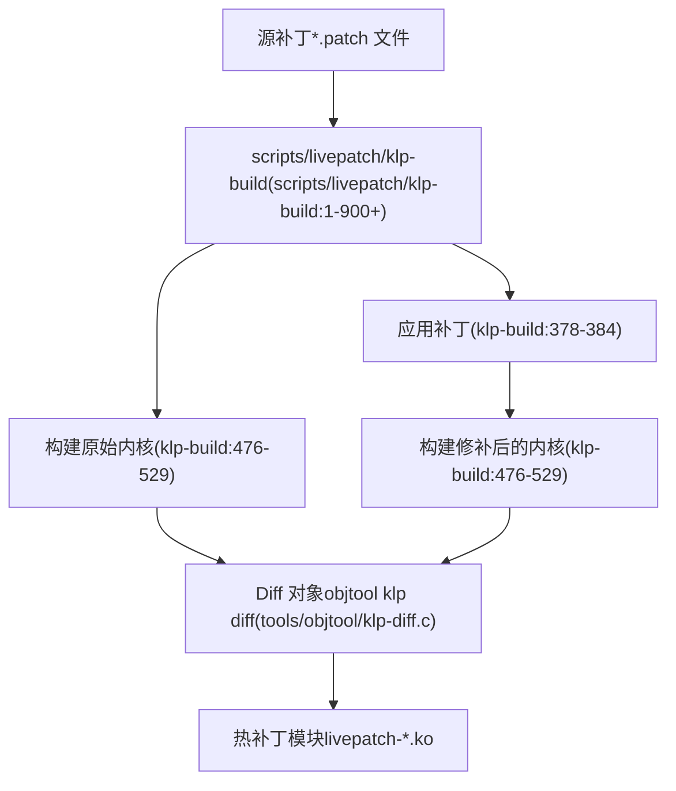
构建步骤 [scripts/livepatch/klp-build189-217](https://github.com/torvalds/linux/blob/fcb70a56/scripts/livepatch/klp-build#L189-L217)：

1.  **构建原始内核**：使用 `--checksum` objtool 标志编译内核
2.  **应用补丁**：应用源补丁并调整行号 [scripts/livepatch/fix-patch-lines1-80](https://github.com/torvalds/linux/blob/fcb70a56/scripts/livepatch/fix-patch-lines#L1-L80)
3.  **构建修补后的内核**：在应用补丁的情况下重新编译
4.  **Diff 对象**：使用 `objtool klp diff` 查找更改的函数 [tools/objtool/klp-diff.c1-1500](https://github.com/torvalds/linux/blob/fcb70a56/tools/objtool/klp-diff.c#L1-L1500)
5.  **构建模块**：生成带有重定位的热补丁模块

热补丁基础设施需要 `CONFIG_LIVEPATCH` 和 `CONFIG_KLP_BUILD`。

**来源：** [scripts/livepatch/klp-build1-900](https://github.com/torvalds/linux/blob/fcb70a56/scripts/livepatch/klp-build#L1-L900) [scripts/livepatch/fix-patch-lines1-80](https://github.com/torvalds/linux/blob/fcb70a56/scripts/livepatch/fix-patch-lines#L1-L80) [tools/objtool/klp-diff.c1-200](https://github.com/torvalds/linux/blob/fcb70a56/tools/objtool/klp-diff.c#L1-L200)

## 构建可复现性

### 可复现构建机制


内核在以下情况下支持可复现构建：

1.  **时间戳** 通过 `KBUILD_BUILD_TIMESTAMP` 固定 [Makefile32](https://github.com/torvalds/linux/blob/fcb70a56/Makefile#L32-L32)
2.  **用户/主机** 通过 `KBUILD_BUILD_USER` 和 `KBUILD_BUILD_HOST` 覆盖
3.  **绝对路径** 通过 `-fmacro-prefix-map` 映射 [Makefile1105-1106](https://github.com/torvalds/linux/blob/fcb70a56/Makefile#L1105-L1106)
4.  **构建盐 (Build salt)** 通过 `CONFIG_BUILD_SALT` 提供版本区分

对于热补丁，`setlocalversion` 是硬编码的 [scripts/livepatch/klp-build282-292](https://github.com/torvalds/linux/blob/fcb70a56/scripts/livepatch/klp-build#L282-L292) 以防止 git 状态影响输出。

**来源：** [Makefile1104-1106](https://github.com/torvalds/linux/blob/fcb70a56/Makefile#L1104-L1106) [Documentation/kbuild/reproducible-builds.rst1-141](https://github.com/torvalds/linux/blob/fcb70a56/Documentation/kbuild/reproducible-builds.rst#L1-L141) [scripts/livepatch/klp-build282-292](https://github.com/torvalds/linux/blob/fcb70a56/scripts/livepatch/klp-build#L282-L292)

## 特殊构建段

### 生成的架构文件

一些 Rust 内核代码需要构建时生成的架构特定汇编片段：

| 生成的文件 | 来源 | 用途 |
| --- | --- | --- |
| `generated_arch_static_branch_asm.rs` | [rust/kernel/generated_arch_static_branch_asm.rs.S1-8](https://github.com/torvalds/linux/blob/fcb70a56/rust/kernel/generated_arch_static_branch_asm.rs.S#L1-L8) | 用于 Rust 的静态分支跳转标签汇编 |
| `generated_arch_warn_asm.rs` | [rust/kernel/generated_arch_warn_asm.rs.S1-8](https://github.com/torvalds/linux/blob/fcb70a56/rust/kernel/generated_arch_warn_asm.rs.S#L1-L8) | 用于 Rust 的 WARN 宏汇编 |
| `generated_arch_reachable_asm.rs` | [rust/kernel/generated_arch_reachable_asm.rs.S1-8](https://github.com/torvalds/linux/blob/fcb70a56/rust/kernel/generated_arch_reachable_asm.rs.S#L1-L8) | 不可达代码注解 |

这些是从 `.rs.S` 文件预处理的 [rust/Makefile38-41](https://github.com/torvalds/linux/blob/fcb70a56/rust/Makefile#L38-L41) 并通过 `include!()` 包含在 Rust 代码中 [rust/kernel/jump_label.rs40-43](https://github.com/torvalds/linux/blob/fcb70a56/rust/kernel/jump_label.rs#L40-L43) [rust/kernel/bug.rs37-39](https://github.com/torvalds/linux/blob/fcb70a56/rust/kernel/bug.rs#L37-L39)

### 位置无关启动代码

架构特定的启动代码使用特殊的构建规则。对于 x86 [arch/x86/boot/startup/Makefile38-52](https://github.com/torvalds/linux/blob/fcb70a56/arch/x86/boot/startup/Makefile#L38-L52)：

```makefile
$(obj)/%.pi.o: OBJCOPYFLAGS := --prefix-symbols=__pi_
$(obj)/%.pi.o: $(obj)/%.o FORCE
    $(call if_changed,objcopy)
```
这通过为早期启动代码的所有符号加上 `__pi_` 前缀来创建位置无关代码。

**来源：** [rust/Makefile38-41](https://github.com/torvalds/linux/blob/fcb70a56/rust/Makefile#L38-L41) [rust/kernel/jump_label.rs40-43](https://github.com/torvalds/linux/blob/fcb70a56/rust/kernel/jump_label.rs#L40-L43) [arch/x86/boot/startup/Makefile38-52](https://github.com/torvalds/linux/blob/fcb70a56/arch/x86/boot/startup/Makefile#L38-L52)

## 构建产物与清理

### 生成的文件

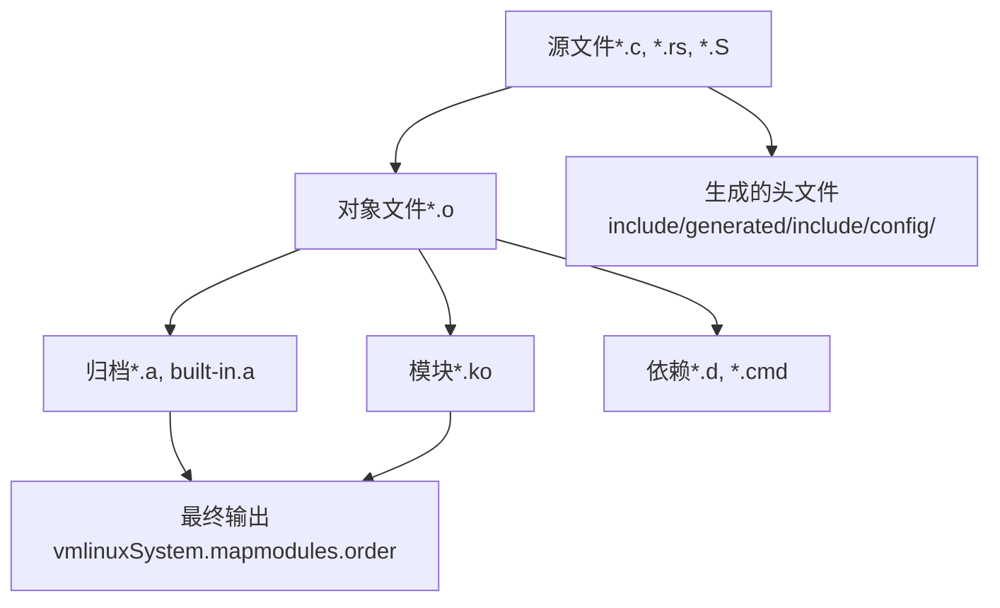
### 清理目标

| 目标 | 范围 | 移除的文件 |
| --- | --- | --- |
| `clean` | 构建产物 | `*.o`, `*.ko`, `*.a`, `*.d`, `*.cmd` [Makefile293](https://github.com/torvalds/linux/blob/fcb70a56/Makefile#L293-L293) |
| `mrproper` | 所有生成 | 来自 `clean` 的所有内容加上配置文件、生成的头文件 [Makefile293](https://github.com/torvalds/linux/blob/fcb70a56/Makefile#L293-L293) |
| `distclean` | 发行版清理 | `mrproper` 加上编辑器备份文件

`.gitignore` 文件 [.gitignore1-187](https://github.com/torvalds/linux/blob/fcb70a56/.gitignore#L1-L187) 列出了版本控制忽略的标准构建产物。

**来源：** [Makefile293-357](https://github.com/torvalds/linux/blob/fcb70a56/Makefile#L293-L357) [.gitignore1-187](https://github.com/torvalds/linux/blob/fcb70a56/.gitignore#L1-L187)

## 构建详细程度与调试

### 详细程度控制

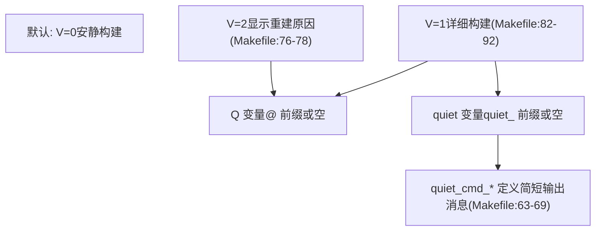
构建详细程度由 `V` 变量控制：

-   `V=0` (默认)：显示简短消息如 `CC file.o` [Makefile86-87](https://github.com/torvalds/linux/blob/fcb70a56/Makefile#L86-L87)
-   `V=1`：显示完整编译命令 [Makefile89-92](https://github.com/torvalds/linux/blob/fcb70a56/Makefile#L89-L92)
-   `V=2`：显示文件重建原因 [Makefile76-78](https://github.com/torvalds/linux/blob/fcb70a56/Makefile#L76-L78)

对于 Rust 构建，`VERBOSE=V=1` 被传递给 cargo 风格的命令 [rust/Makefile59-62](https://github.com/torvalds/linux/blob/fcb70a56/rust/Makefile#L59-L62)

**来源：** [Makefile63-101](https://github.com/torvalds/linux/blob/fcb70a56/Makefile#L63-L101) [rust/Makefile59-62](https://github.com/torvalds/linux/blob/fcb70a56/rust/Makefile#L59-L62) [scripts/Makefile.lib242-245](https://github.com/torvalds/linux/blob/fcb70a56/scripts/Makefile.lib#L242-L245)
