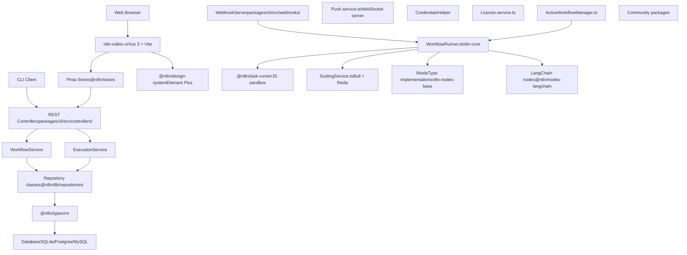
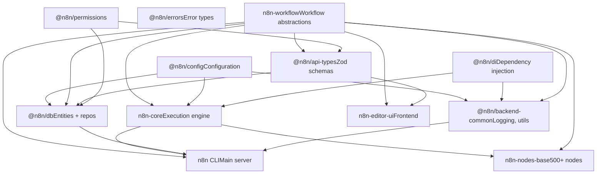
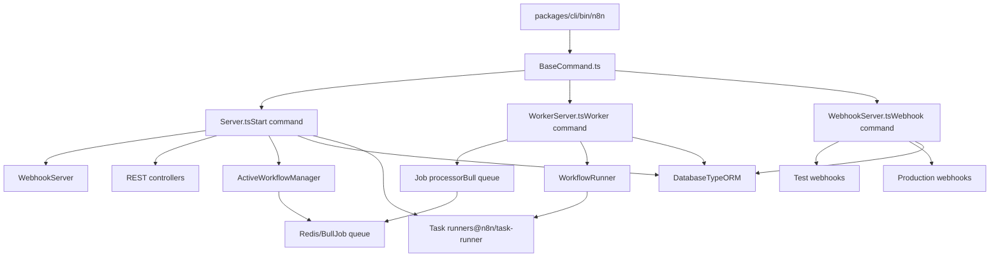
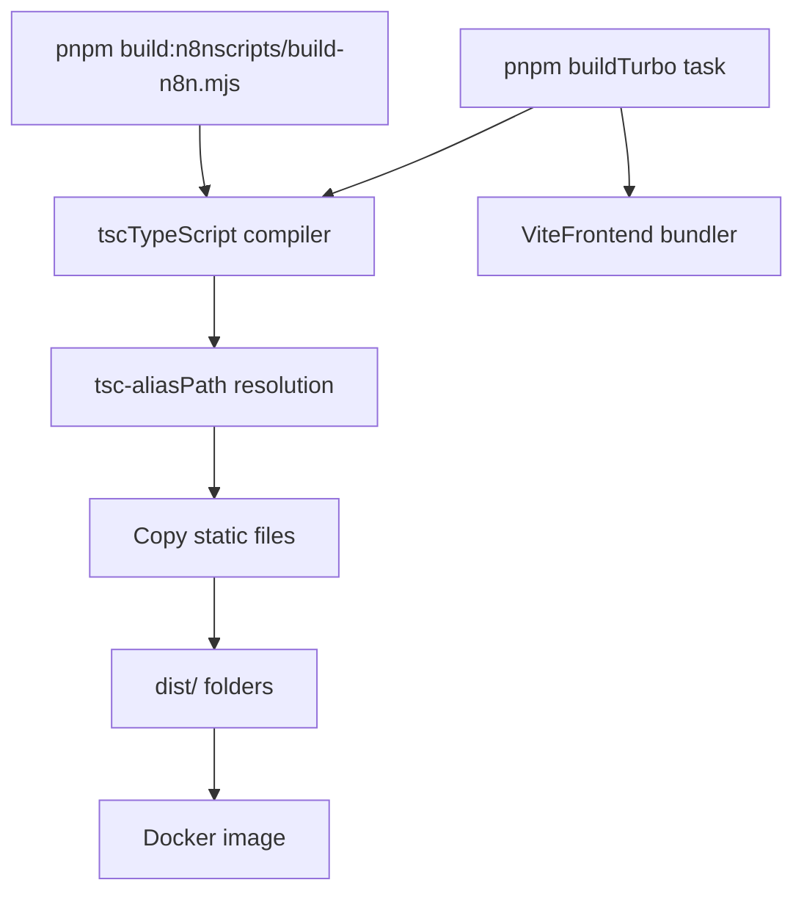

# n8n 概览

相关源文件

-   [CHANGELOG.md](https://github.com/n8n-io/n8n/blob/88f170b9/CHANGELOG.md?plain=1)
-   [package.json](https://github.com/n8n-io/n8n/blob/88f170b9/package.json)
-   [packages/@n8n/api-types/package.json](https://github.com/n8n-io/n8n/blob/88f170b9/packages/@n8n/api-types/package.json)
-   [packages/@n8n/api-types/src/frontend-settings.ts](https://github.com/n8n-io/n8n/blob/88f170b9/packages/@n8n/api-types/src/frontend-settings.ts)
-   [packages/@n8n/api-types/src/push/collaboration.ts](https://github.com/n8n-io/n8n/blob/88f170b9/packages/@n8n/api-types/src/push/collaboration.ts)
-   [packages/@n8n/backend-common/src/license-state.ts](https://github.com/n8n-io/n8n/blob/88f170b9/packages/@n8n/backend-common/src/license-state.ts)
-   [packages/@n8n/config/package.json](https://github.com/n8n-io/n8n/blob/88f170b9/packages/@n8n/config/package.json)
-   [packages/@n8n/config/src/decorators.ts](https://github.com/n8n-io/n8n/blob/88f170b9/packages/@n8n/config/src/decorators.ts)
-   [packages/@n8n/config/src/index.ts](https://github.com/n8n-io/n8n/blob/88f170b9/packages/@n8n/config/src/index.ts)
-   [packages/@n8n/config/test/config.test.ts](https://github.com/n8n-io/n8n/blob/88f170b9/packages/@n8n/config/test/config.test.ts)
-   [packages/@n8n/config/test/decorators.test.ts](https://github.com/n8n-io/n8n/blob/88f170b9/packages/@n8n/config/test/decorators.test.ts)
-   [packages/@n8n/config/test/string-normalization.test.ts](https://github.com/n8n-io/n8n/blob/88f170b9/packages/@n8n/config/test/string-normalization.test.ts)
-   [packages/@n8n/constants/src/index.ts](https://github.com/n8n-io/n8n/blob/88f170b9/packages/@n8n/constants/src/index.ts)
-   [packages/@n8n/nodes-langchain/package.json](https://github.com/n8n-io/n8n/blob/88f170b9/packages/@n8n/nodes-langchain/package.json)
-   [packages/@n8n/task-runner/package.json](https://github.com/n8n-io/n8n/blob/88f170b9/packages/@n8n/task-runner/package.json)
-   [packages/cli/package.json](https://github.com/n8n-io/n8n/blob/88f170b9/packages/cli/package.json)
-   [packages/cli/src/__tests__/license.test.ts](https://github.com/n8n-io/n8n/blob/88f170b9/packages/cli/src/__tests__/license.test.ts)
-   [packages/cli/src/commands/base-command.ts](https://github.com/n8n-io/n8n/blob/88f170b9/packages/cli/src/commands/base-command.ts)
-   [packages/cli/src/commands/start.ts](https://github.com/n8n-io/n8n/blob/88f170b9/packages/cli/src/commands/start.ts)
-   [packages/cli/src/commands/webhook.ts](https://github.com/n8n-io/n8n/blob/88f170b9/packages/cli/src/commands/webhook.ts)
-   [packages/cli/src/commands/worker.ts](https://github.com/n8n-io/n8n/blob/88f170b9/packages/cli/src/commands/worker.ts)
-   [packages/cli/src/config/index.ts](https://github.com/n8n-io/n8n/blob/88f170b9/packages/cli/src/config/index.ts)
-   [packages/cli/src/config/schema.ts](https://github.com/n8n-io/n8n/blob/88f170b9/packages/cli/src/config/schema.ts)
-   [packages/cli/src/constants.ts](https://github.com/n8n-io/n8n/blob/88f170b9/packages/cli/src/constants.ts)
-   [packages/cli/src/controllers/e2e.controller.ts](https://github.com/n8n-io/n8n/blob/88f170b9/packages/cli/src/controllers/e2e.controller.ts)
-   [packages/cli/src/errors/response-errors/locked.error.ts](https://github.com/n8n-io/n8n/blob/88f170b9/packages/cli/src/errors/response-errors/locked.error.ts)
-   [packages/cli/src/license.ts](https://github.com/n8n-io/n8n/blob/88f170b9/packages/cli/src/license.ts)
-   [packages/cli/src/services/__tests__/frontend.service.test.ts](https://github.com/n8n-io/n8n/blob/88f170b9/packages/cli/src/services/__tests__/frontend.service.test.ts)
-   [packages/cli/src/services/frontend.service.ts](https://github.com/n8n-io/n8n/blob/88f170b9/packages/cli/src/services/frontend.service.ts)
-   [packages/cli/test/integration/commands/worker.cmd.test.ts](https://github.com/n8n-io/n8n/blob/88f170b9/packages/cli/test/integration/commands/worker.cmd.test.ts)
-   [packages/core/package.json](https://github.com/n8n-io/n8n/blob/88f170b9/packages/core/package.json)
-   [packages/frontend/@n8n/design-system/package.json](https://github.com/n8n-io/n8n/blob/88f170b9/packages/frontend/@n8n/design-system/package.json)
-   [packages/frontend/@n8n/design-system/src/components/CanvasCollaborationPill/CanvasCollaborationPill.vue](https://github.com/n8n-io/n8n/blob/88f170b9/packages/frontend/@n8n/design-system/src/components/CanvasCollaborationPill/CanvasCollaborationPill.vue)
-   [packages/frontend/@n8n/design-system/src/components/N8nLogo/Logo.vue](https://github.com/n8n-io/n8n/blob/88f170b9/packages/frontend/@n8n/design-system/src/components/N8nLogo/Logo.vue)
-   [packages/frontend/@n8n/stores/src/useRootStore.ts](https://github.com/n8n-io/n8n/blob/88f170b9/packages/frontend/@n8n/stores/src/useRootStore.ts)
-   [packages/frontend/editor-ui/package.json](https://github.com/n8n-io/n8n/blob/88f170b9/packages/frontend/editor-ui/package.json)
-   [packages/frontend/editor-ui/src/__tests__/defaults.ts](https://github.com/n8n-io/n8n/blob/88f170b9/packages/frontend/editor-ui/src/__tests__/defaults.ts)
-   [packages/frontend/editor-ui/src/app/components/MainHeader/TabBar.vue](https://github.com/n8n-io/n8n/blob/88f170b9/packages/frontend/editor-ui/src/app/components/MainHeader/TabBar.vue)
-   [packages/frontend/editor-ui/src/app/stores/settings.store.test.ts](https://github.com/n8n-io/n8n/blob/88f170b9/packages/frontend/editor-ui/src/app/stores/settings.store.test.ts)
-   [packages/frontend/editor-ui/src/app/stores/settings.store.ts](https://github.com/n8n-io/n8n/blob/88f170b9/packages/frontend/editor-ui/src/app/stores/settings.store.ts)
-   [packages/node-dev/package.json](https://github.com/n8n-io/n8n/blob/88f170b9/packages/node-dev/package.json)
-   [packages/nodes-base/package.json](https://github.com/n8n-io/n8n/blob/88f170b9/packages/nodes-base/package.json)
-   [packages/workflow/package.json](https://github.com/n8n-io/n8n/blob/88f170b9/packages/workflow/package.json)
-   [pnpm-lock.yaml](https://github.com/n8n-io/n8n/blob/88f170b9/pnpm-lock.yaml)
-   [pnpm-workspace.yaml](https://github.com/n8n-io/n8n/blob/88f170b9/pnpm-workspace.yaml)

本文档对 n8n 的架构、Monorepo 结构和核心包进行了高层级的介绍。它解释了代码库如何被组织成具有清晰依赖边界的独立包，以及系统如何在不同的运行模式下运行。

有关特定子系统的详细信息，请参阅：

-   工作流执行内部原理：[Workflow Execution Engine](/n8n-io/n8n/2-workflow-execution-engine)
-   REST API 架构：[API and Resource Management](/n8n-io/n8n/3-api-and-resource-management)
-   节点开发：[Node System](/n8n-io/n8n/4-node-system)
-   前端架构：[User Interface](/n8n-io/n8n/6-user-interface)
-   部署和配置：[Configuration and Deployment](/n8n-io/n8n/7-configuration-and-deployment)

---

## 什么是 n8n

n8n 是一个**工作流自动化平台**，允许用户创建、执行和监控由互连节点组成的工作流。每个节点代表与外部服务的集成或数据转换操作。该平台由以下部分组成：

-   **工作流画布 (Workflow Canvas)**：一个基于 Vue 3 的可视化编辑器，用户通过连接节点来设计工作流。
-   **执行引擎 (Execution Engine)**：一个 Node.js 后端，在本地运行工作流，或通过队列工作进程 (Queue Worker) 分布式运行。
-   **节点生态系统 (Node Ecosystem)**：500 多个内置集成，并支持自定义社区节点。
-   **AI 功能**：LangChain 集成、用于对话式工作流的 Chat Hub 以及 AI 辅助的工作流构建。

该系统是作为一个使用 pnpm workspaces 的 **TypeScript Monorepo** 构建的，前端、后端和共享包之间有清晰的分离。

**来源：** [package.json1-4](https://github.com/n8n-io/n8n/blob/88f170b9/package.json#L1-L4) [packages/cli/package.json1-4](https://github.com/n8n-io/n8n/blob/88f170b9/packages/cli/package.json#L1-L4) [CHANGELOG.md1-30](https://github.com/n8n-io/n8n/blob/88f170b9/CHANGELOG.md?plain=1#L1-L30)

---

## Monorepo 结构

n8n 被组织为一个 pnpm 工作区，包按功能分组。该 Monorepo 使用 **Turbo** 进行构建编排和依赖图管理。

### 包组织

**来源：** [pnpm-workspace.yaml1-6](https://github.com/n8n-io/n8n/blob/88f170b9/pnpm-workspace.yaml#L1-L6) [package.json1-53](https://github.com/n8n-io/n8n/blob/88f170b9/package.json#L1-L53)

### 关键包角色

| 包 | 路径 | 用途 | 入口点 |
| --- | --- | --- | --- |
| `n8n-workflow` | `packages/workflow/` | 核心工作流抽象、类型和表达式引擎 | [packages/workflow/package.json5-12](https://github.com/n8n-io/n8n/blob/88f170b9/packages/workflow/package.json#L5-L12) |
| `n8n-core` | `packages/core/` | 工作流执行引擎、节点加载、凭据 | [packages/core/package.json5-6](https://github.com/n8n-io/n8n/blob/88f170b9/packages/core/package.json#L5-L6) |
| `n8n` (CLI) | `packages/cli/` | 主应用服务器、REST API、数据库、webhook | [packages/cli/package.json5-6](https://github.com/n8n-io/n8n/blob/88f170b9/packages/cli/package.json#L5-L6) |
| `n8n-nodes-base` | `packages/nodes-base/` | 500 多个内置节点集成 | [packages/nodes-base/package.json5](https://github.com/n8n-io/n8n/blob/88f170b9/packages/nodes-base/package.json#L5-L5) |
| `@n8n/n8n-nodes-langchain` | `packages/@n8n/nodes-langchain/` | 使用 LangChain 的 AI/LLM 节点 | [packages/@n8n/nodes-langchain/package.json5-18](https://github.com/n8n-io/n8n/blob/88f170b9/packages/@n8n/nodes-langchain/package.json#L5-L18) |
| `n8n-editor-ui` | `packages/frontend/editor-ui/` | Vue 3 工作流画布和 UI | [packages/frontend/editor-ui/package.json2-6](https://github.com/n8n-io/n8n/blob/88f170b9/packages/frontend/editor-ui/package.json#L2-L6) |
| `@n8n/design-system` | `packages/frontend/@n8n/design-system/` | 可重用的 UI 组件 | [packages/frontend/@n8n/design-system/package.json3-5](https://github.com/n8n-io/n8n/blob/88f170b9/packages/frontend/@n8n/design-system/package.json#L3-L5) |
| `@n8n/config` | `packages/@n8n/config/` | 配置架构和校验 | [packages/@n8n/config/package.json5-6](https://github.com/n8n-io/n8n/blob/88f170b9/packages/@n8n/config/package.json#L5-L6) |
| `@n8n/di` | `packages/@n8n/di/` | 依赖注入 (Dependency Injection) 框架 | [pnpm-lock.yaml1110-1118](https://github.com/n8n-io/n8n/blob/88f170b9/pnpm-lock.yaml#L1110-L1118) |
| `@n8n/db` | `packages/@n8n/db/` | 数据库实体和存储库 | [pnpm-lock.yaml112](https://github.com/n8n-io/n8n/blob/88f170b9/pnpm-lock.yaml#L112-L112) |
| `@n8n/api-types` | `packages/@n8n/api-types/` | API 的共享类型和 Zod 架构 | [packages/@n8n/api-types/package.json2-3](https://github.com/n8n-io/n8n/blob/88f170b9/packages/@n8n/api-types/package.json#L2-L3) |
| `@n8n/task-runner` | `packages/@n8n/task-runner/` | 沙盒化的 JavaScript/Python 执行 | [packages/@n8n/task-runner/package.json2-3](https://github.com/n8n-io/n8n/blob/88f170b9/packages/@n8n/task-runner/package.json#L2-L3) |

**来源：** [pnpm-workspace.yaml1-6](https://github.com/n8n-io/n8n/blob/88f170b9/pnpm-workspace.yaml#L1-L6) [packages/cli/package.json1-130](https://github.com/n8n-io/n8n/blob/88f170b9/packages/cli/package.json#L1-L130) [packages/workflow/package.json1-75](https://github.com/n8n-io/n8n/blob/88f170b9/packages/workflow/package.json#L1-L75)

---

## 架构分层

n8n 遵循**分层架构 (Layered Architecture)**，具有清晰的职责分离。系统在概念上可以分为以下几层：

### 系统架构图

**来源：** [packages/cli/package.json96-160](https://github.com/n8n-io/n8n/blob/88f170b9/packages/cli/package.json#L96-L160) [packages/core/package.json42-83](https://github.com/n8n-io/n8n/blob/88f170b9/packages/core/package.json#L42-L83) [packages/frontend/editor-ui/package.json20-110](https://github.com/n8n-io/n8n/blob/88f170b9/packages/frontend/editor-ui/package.json#L20-L110)

---

## 包依赖图

下图显示了核心包之间的依赖关系，说明了单向依赖流：

**关键原则：**

-   **无循环依赖**：该图是无环的，支持干净的构建和 Tree-shaking。
-   **基础独立性**：`n8n-workflow`、`@n8n/config`、`@n8n/di`、`@n8n/errors` 具有极少的依赖项。
-   **共享类型**：`@n8n/api-types` 通过 Zod 校验的架构连接前端和后端。
-   **应用层**：`n8n` CLI、`n8n-nodes-base` 和 `n8n-editor-ui` 是主要的执行构件。

**来源：** [packages/cli/package.json96-130](https://github.com/n8n-io/n8n/blob/88f170b9/packages/cli/package.json#L96-L130) [packages/workflow/package.json53-74](https://github.com/n8n-io/n8n/blob/88f170b9/packages/workflow/package.json#L53-L74) [packages/core/package.json42-83](https://github.com/n8n-io/n8n/blob/88f170b9/packages/core/package.json#L42-L83)

---

## 运行模式和进程架构

n8n 可以根据部署配置以多种模式运行。每种模式都从同一个 `n8n` CLI 入口点启动，但执行不同的服务器逻辑。

### 进程模式

**来源：** [packages/cli/package.json20-52](https://github.com/n8n-io/n8n/blob/88f170b9/packages/cli/package.json#L20-L52) [package.json40-52](https://github.com/n8n-io/n8n/blob/88f170b9/package.json#L40-L52)

### 模式描述

| 模式 | 命令 | 用途 | 关键类 |
| --- | --- | --- | --- |
| **Main (主模式)** | `n8n start` | 包含 UI、API、webhook 和本地执行的全功能服务器 | `Server.ts`, `ActiveWorkflowManager.ts` |
| **Worker (工作进程模式)** | `n8n worker` | 基于队列的任务处理器，用于分布式执行 | `WorkerServer.ts`, `ScalingService.ts` |
| **Webhook (Webhook 模式)** | `n8n webhook` | 专用的 webhook 接收器（无 UI/API） | `WebhookServer.ts` |

**执行模式：**

-   **常规模式 (Regular Mode)**：工作流在主进程中本地执行。
-   **队列模式 (Queue Mode)**：工作流排队到 Bull/Redis，由工作进程处理。
    -   通过 `EXECUTIONS_MODE=queue` 启用。
    -   使用 `bull` 进行任务分发 [packages/cli/package.json138](https://github.com/n8n-io/n8n/blob/88f170b9/packages/cli/package.json#L138-L138)

**来源：** [packages/cli/package.json13-15](https://github.com/n8n-io/n8n/blob/88f170b9/packages/cli/package.json#L13-L15) [packages/cli/src/config/schema.ts34-40](https://github.com/n8n-io/n8n/blob/88f170b9/packages/cli/src/config/schema.ts#L34-L40)

---

## 构建系统

该 Monorepo 使用 **Turbo** 进行增量构建，并使用 **pnpm** 进行包管理。

### 构建流水线 (Build Pipeline)

**构建配置：**

-   **Turbo**：具有依赖感知和缓存功能的构建编排工具 [package.json82](https://github.com/n8n-io/n8n/blob/88f170b9/package.json#L82-L82)
-   **TypeScript**：包通过 `tsc` 使用工作区配置进行编译 [packages/cli/package.json10](https://github.com/n8n-io/n8n/blob/88f170b9/packages/cli/package.json#L10-L10)
-   **Vite**：前端包使用 Vite 进行打包 [packages/workflow/package.json25](https://github.com/n8n-io/n8n/blob/88f170b9/packages/workflow/package.json#L25-L25)
-   **路径别名 (Path Aliases)**：`tsc-alias` 在编译后解析 TypeScript 路径映射 [packages/core/package.json16](https://github.com/n8n-io/n8n/blob/88f170b9/packages/core/package.json#L16-L16)

**来源：** [package.json10-52](https://github.com/n8n-io/n8n/blob/88f170b9/package.json#L10-L52) [packages/cli/package.json7-12](https://github.com/n8n-io/n8n/blob/88f170b9/packages/cli/package.json#L7-L12) [packages/workflow/package.json21-35](https://github.com/n8n-io/n8n/blob/88f170b9/packages/workflow/package.json#L21-L35)

---

## 后续步骤

要深入了解特定子系统，请参阅：

-   **[Monorepo Structure and Core Packages](/n8n-io/n8n/1.1-monorepo-structure-and-core-packages)**：详细的包描述和依赖分析。
-   **[Runtime Architecture and Process Models](/n8n-io/n8n/1.2-runtime-architecture-and-process-models)**：服务器初始化、进程通信和模式切换。
-   **[Package Dependencies and Build System](/n8n-io/n8n/1.3-package-dependencies-and-build-system)**：Turbo 流水线和构建编排详情。
