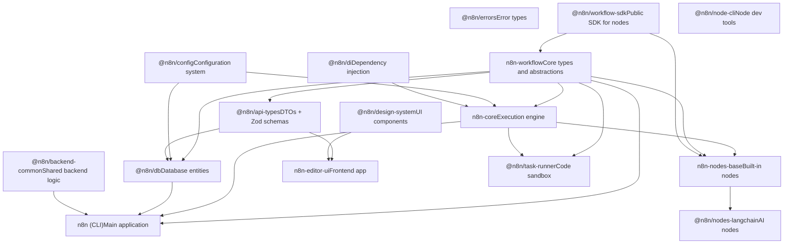
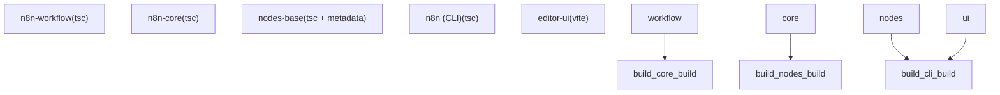

# Monorepo 结构与核心包

相关源文件

-   [CHANGELOG.md](https://github.com/n8n-io/n8n/blob/88f170b9/CHANGELOG.md?plain=1)
-   [codecov.yml](https://github.com/n8n-io/n8n/blob/88f170b9/codecov.yml)
-   [jest.config.js](https://github.com/n8n-io/n8n/blob/88f170b9/jest.config.js)
-   [package.json](https://github.com/n8n-io/n8n/blob/88f170b9/package.json)
-   [packages/@n8n/api-types/package.json](https://github.com/n8n-io/n8n/blob/88f170b9/packages/@n8n/api-types/package.json)
-   [packages/@n8n/backend-common/src/modules/__tests__/module-registry.test.ts](https://github.com/n8n-io/n8n/blob/88f170b9/packages/@n8n/backend-common/src/modules/__tests__/module-registry.test.ts)
-   [packages/@n8n/backend-common/src/modules/module-registry.ts](https://github.com/n8n-io/n8n/blob/88f170b9/packages/@n8n/backend-common/src/modules/module-registry.ts)
-   [packages/@n8n/backend-common/src/modules/modules.config.ts](https://github.com/n8n-io/n8n/blob/88f170b9/packages/@n8n/backend-common/src/modules/modules.config.ts)
-   [packages/@n8n/client-oauth2/tsconfig.build.json](https://github.com/n8n-io/n8n/blob/88f170b9/packages/@n8n/client-oauth2/tsconfig.build.json)
-   [packages/@n8n/config/package.json](https://github.com/n8n-io/n8n/blob/88f170b9/packages/@n8n/config/package.json)
-   [packages/@n8n/decorators/src/__tests__/redactable.test.ts](https://github.com/n8n-io/n8n/blob/88f170b9/packages/@n8n/decorators/src/__tests__/redactable.test.ts)
-   [packages/@n8n/decorators/src/controller/__tests__/args.test.ts](https://github.com/n8n-io/n8n/blob/88f170b9/packages/@n8n/decorators/src/controller/__tests__/args.test.ts)
-   [packages/@n8n/decorators/src/controller/__tests__/license.test.ts](https://github.com/n8n-io/n8n/blob/88f170b9/packages/@n8n/decorators/src/controller/__tests__/license.test.ts)
-   [packages/@n8n/decorators/src/controller/__tests__/scoped.test.ts](https://github.com/n8n-io/n8n/blob/88f170b9/packages/@n8n/decorators/src/controller/__tests__/scoped.test.ts)
-   [packages/@n8n/decorators/src/execution-lifecycle/__tests__/on-lifecycle-event.test.ts](https://github.com/n8n-io/n8n/blob/88f170b9/packages/@n8n/decorators/src/execution-lifecycle/__tests__/on-lifecycle-event.test.ts)
-   [packages/@n8n/decorators/src/execution-lifecycle/index.ts](https://github.com/n8n-io/n8n/blob/88f170b9/packages/@n8n/decorators/src/execution-lifecycle/index.ts)
-   [packages/@n8n/decorators/src/execution-lifecycle/lifecycle-metadata.ts](https://github.com/n8n-io/n8n/blob/88f170b9/packages/@n8n/decorators/src/execution-lifecycle/lifecycle-metadata.ts)
-   [packages/@n8n/decorators/src/module/__tests__/module.test.ts](https://github.com/n8n-io/n8n/blob/88f170b9/packages/@n8n/decorators/src/module/__tests__/module.test.ts)
-   [packages/@n8n/decorators/src/module/index.ts](https://github.com/n8n-io/n8n/blob/88f170b9/packages/@n8n/decorators/src/module/index.ts)
-   [packages/@n8n/decorators/src/module/module-metadata.ts](https://github.com/n8n-io/n8n/blob/88f170b9/packages/@n8n/decorators/src/module/module-metadata.ts)
-   [packages/@n8n/decorators/src/module/module.ts](https://github.com/n8n-io/n8n/blob/88f170b9/packages/@n8n/decorators/src/module/module.ts)
-   [packages/@n8n/expression-runtime/tsconfig.build.cjs.json](https://github.com/n8n-io/n8n/blob/88f170b9/packages/@n8n/expression-runtime/tsconfig.build.cjs.json)
-   [packages/@n8n/expression-runtime/tsconfig.build.esm.json](https://github.com/n8n-io/n8n/blob/88f170b9/packages/@n8n/expression-runtime/tsconfig.build.esm.json)
-   [packages/@n8n/nodes-langchain/package.json](https://github.com/n8n-io/n8n/blob/88f170b9/packages/@n8n/nodes-langchain/package.json)
-   [packages/@n8n/nodes-langchain/tsconfig.build.json](https://github.com/n8n-io/n8n/blob/88f170b9/packages/@n8n/nodes-langchain/tsconfig.build.json)
-   [packages/@n8n/nodes-langchain/tsconfig.json](https://github.com/n8n-io/n8n/blob/88f170b9/packages/@n8n/nodes-langchain/tsconfig.json)
-   [packages/@n8n/task-runner/package.json](https://github.com/n8n-io/n8n/blob/88f170b9/packages/@n8n/task-runner/package.json)
-   [packages/cli/package.json](https://github.com/n8n-io/n8n/blob/88f170b9/packages/cli/package.json)
-   [packages/cli/src/modules/community-packages/community-packages.module.ts](https://github.com/n8n-io/n8n/blob/88f170b9/packages/cli/src/modules/community-packages/community-packages.module.ts)
-   [packages/cli/src/modules/external-secrets.ee/external-secrets.module.ts](https://github.com/n8n-io/n8n/blob/88f170b9/packages/cli/src/modules/external-secrets.ee/external-secrets.module.ts)
-   [packages/cli/src/modules/otel/README.md](https://github.com/n8n-io/n8n/blob/88f170b9/packages/cli/src/modules/otel/README.md?plain=1)
-   [packages/cli/src/modules/otel/__tests__/otel-test-provider.ts](https://github.com/n8n-io/n8n/blob/88f170b9/packages/cli/src/modules/otel/__tests__/otel-test-provider.ts)
-   [packages/cli/src/modules/otel/__tests__/otel-workflow-tracing.integration.test.ts](https://github.com/n8n-io/n8n/blob/88f170b9/packages/cli/src/modules/otel/__tests__/otel-workflow-tracing.integration.test.ts)
-   [packages/cli/src/modules/otel/__tests__/span-registry.test.ts](https://github.com/n8n-io/n8n/blob/88f170b9/packages/cli/src/modules/otel/__tests__/span-registry.test.ts)
-   [packages/cli/src/modules/otel/handlers/interfaces.ts](https://github.com/n8n-io/n8n/blob/88f170b9/packages/cli/src/modules/otel/handlers/interfaces.ts)
-   [packages/cli/src/modules/otel/handlers/workflow-end.handler.ts](https://github.com/n8n-io/n8n/blob/88f170b9/packages/cli/src/modules/otel/handlers/workflow-end.handler.ts)
-   [packages/cli/src/modules/otel/handlers/workflow-start.handler.ts](https://github.com/n8n-io/n8n/blob/88f170b9/packages/cli/src/modules/otel/handlers/workflow-start.handler.ts)
-   [packages/cli/tsconfig.build.json](https://github.com/n8n-io/n8n/blob/88f170b9/packages/cli/tsconfig.build.json)
-   [packages/cli/tsconfig.json](https://github.com/n8n-io/n8n/blob/88f170b9/packages/cli/tsconfig.json)
-   [packages/core/package.json](https://github.com/n8n-io/n8n/blob/88f170b9/packages/core/package.json)
-   [packages/core/tsconfig.build.json](https://github.com/n8n-io/n8n/blob/88f170b9/packages/core/tsconfig.build.json)
-   [packages/core/tsconfig.json](https://github.com/n8n-io/n8n/blob/88f170b9/packages/core/tsconfig.json)
-   [packages/frontend/@n8n/design-system/package.json](https://github.com/n8n-io/n8n/blob/88f170b9/packages/frontend/@n8n/design-system/package.json)
-   [packages/frontend/@n8n/stores/src/__tests__/metaTagConfig.test.ts](https://github.com/n8n-io/n8n/blob/88f170b9/packages/frontend/@n8n/stores/src/__tests__/metaTagConfig.test.ts)
-   [packages/frontend/@n8n/stores/src/metaTagConfig.ts](https://github.com/n8n-io/n8n/blob/88f170b9/packages/frontend/@n8n/stores/src/metaTagConfig.ts)
-   [packages/frontend/editor-ui/index.html](https://github.com/n8n-io/n8n/blob/88f170b9/packages/frontend/editor-ui/index.html)
-   [packages/frontend/editor-ui/package.json](https://github.com/n8n-io/n8n/blob/88f170b9/packages/frontend/editor-ui/package.json)
-   [packages/frontend/editor-ui/public/static/posthog.init.js](https://github.com/n8n-io/n8n/blob/88f170b9/packages/frontend/editor-ui/public/static/posthog.init.js)
-   [packages/frontend/editor-ui/public/static/prefers-color-scheme.css](https://github.com/n8n-io/n8n/blob/88f170b9/packages/frontend/editor-ui/public/static/prefers-color-scheme.css)
-   [packages/frontend/editor-ui/tsconfig.json](https://github.com/n8n-io/n8n/blob/88f170b9/packages/frontend/editor-ui/tsconfig.json)
-   [packages/frontend/editor-ui/vite.config.mts](https://github.com/n8n-io/n8n/blob/88f170b9/packages/frontend/editor-ui/vite.config.mts)
-   [packages/node-dev/package.json](https://github.com/n8n-io/n8n/blob/88f170b9/packages/node-dev/package.json)
-   [packages/node-dev/tsconfig.json](https://github.com/n8n-io/n8n/blob/88f170b9/packages/node-dev/tsconfig.json)
-   [packages/nodes-base/package.json](https://github.com/n8n-io/n8n/blob/88f170b9/packages/nodes-base/package.json)
-   [packages/nodes-base/tsconfig.json](https://github.com/n8n-io/n8n/blob/88f170b9/packages/nodes-base/tsconfig.json)
-   [packages/workflow/package.json](https://github.com/n8n-io/n8n/blob/88f170b9/packages/workflow/package.json)
-   [packages/workflow/test/expression-vm-errors.test.ts](https://github.com/n8n-io/n8n/blob/88f170b9/packages/workflow/test/expression-vm-errors.test.ts)
-   [packages/workflow/test/setup-vm-evaluator.ts](https://github.com/n8n-io/n8n/blob/88f170b9/packages/workflow/test/setup-vm-evaluator.ts)
-   [packages/workflow/tsconfig.json](https://github.com/n8n-io/n8n/blob/88f170b9/packages/workflow/tsconfig.json)
-   [pnpm-lock.yaml](https://github.com/n8n-io/n8n/blob/88f170b9/pnpm-lock.yaml)
-   [pnpm-workspace.yaml](https://github.com/n8n-io/n8n/blob/88f170b9/pnpm-workspace.yaml)
-   [tsconfig.json](https://github.com/n8n-io/n8n/blob/88f170b9/tsconfig.json)
-   [turbo.json](https://github.com/n8n-io/n8n/blob/88f170b9/turbo.json)

本文档描述了 n8n Monorepo 的组织方式、工作区结构、核心包及其依赖关系。它涵盖了代码库如何划分为多个包、每个主要包的作用，以及它们如何相互依赖。

有关构建系统和编译流水线的信息，请参阅**包依赖与构建系统 (1.3)**。有关运行时架构以及不同进程如何通信的详细信息，请参阅**运行时架构与进程模型 (1.2)**。

---

## 工作区组织 (Workspace Organization)

n8n 被组织为一个 **pnpm Monorepo**，包按功能分组。工作区在 `pnpm-workspace.yaml` 中定义，并遵循以下结构：

```
packages:  - packages/*  - packages/@n8n/*  - packages/frontend/**  - packages/extensions/**  - packages/testing/**
```
该 Monorepo 使用 **pnpm v10.22.0** 作为其包管理器 [package.json9](https://github.com/n8n-io/n8n/blob/88f170b9/package.json#L9-L9)，并使用 **Turbo v2.8.9** 进行构建编排 [package.json82](https://github.com/n8n-io/n8n/blob/88f170b9/package.json#L82-L82)。

### 物理目录布局

| 目录 | 描述 | 关键包 |
| --- | --- | --- |
| `packages/` | n8n 核心引擎和 CLI | `cli`, `core`, `workflow`, `nodes-base` |
| `packages/@n8n/` | 作用域限定的工具和领域包 | `db`, `config`, `di`, `workflow-sdk`, `node-cli` |
| `packages/frontend/` | UI 相关包 | `editor-ui`, `@n8n/design-system`, `@n8n/stores` |
| `packages/testing/` | 测试基础设施 | `n8n-playwright` |

**来源：** [pnpm-workspace.yaml1-6](https://github.com/n8n-io/n8n/blob/88f170b9/pnpm-workspace.yaml#L1-L6) [package.json1-85](https://github.com/n8n-io/n8n/blob/88f170b9/package.json#L1-L85)

---

## 包依赖层级

包遵循分层架构，具有清晰的依赖边界。依赖图是**无环的 (Acyclic)**，这使得 Tree-shaking 和增量构建更加高效。

### 包依赖图


**关键模式：**

-   **基础包 (Foundation packages)** 具有极少的依赖项，通常与前端共享。
-   **后端包 (Backend packages)** 构建在基础层之上，但仅限于 Node.js 环境。
-   **应用包 (Application packages)**（如 `cli`）消费所有层级以提供最终用户产品。

**来源：** [pnpm-lock.yaml1-200](https://github.com/n8n-io/n8n/blob/88f170b9/pnpm-lock.yaml#L1-L200) [packages/cli/package.json96-130](https://github.com/n8n-io/n8n/blob/88f170b9/packages/cli/package.json#L96-L130) [packages/core/package.json42-83](https://github.com/n8n-io/n8n/blob/88f170b9/packages/core/package.json#L42-L83)

---

## 核心包

### n8n-workflow：基础包

**包：** `n8n-workflow` [packages/workflow/package.json2](https://github.com/n8n-io/n8n/blob/88f170b9/packages/workflow/package.json#L2-L2)

包含核心类型定义、接口和抽象的基础包。它被设计为与环境无关（可在浏览器和 Node.js 中运行）。

**关键导出：**

-   `INodeType`, `INodeTypeDescription`：定义节点行为的接口。
-   `Workflow`：负责管理工作流结构和执行状态的类。
-   表达式评估逻辑（通过 `@n8n/expression-runtime`）。

**构建输出：**

-   ESM/CJS 双重构建 [packages/workflow/package.json5-13](https://github.com/n8n-io/n8n/blob/88f170b9/packages/workflow/package.json#L5-L13)
-   ESM: `dist/esm/index.js`
-   CJS: `dist/cjs/index.js`

**来源：** [packages/workflow/package.json1-76](https://github.com/n8n-io/n8n/blob/88f170b9/packages/workflow/package.json#L1-L76)

---

### n8n-core：执行引擎

**包：** `n8n-core` [packages/core/package.json2](https://github.com/n8n-io/n8n/blob/88f170b9/packages/core/package.json#L2-L2)

**工作流执行引擎**，负责运行工作流、管理节点执行以及处理数据流。

**关键组件：**

-   `WorkflowExecute`：主要的执行编排器。
-   `CredentialsHelper`：处理凭据解析和加密。
-   `BinaryDataService`：管理二进制文件存储。

**二进制命令：**

-   `n8n-copy-static-files`：用于复制节点资源的工具。
-   `n8n-generate-translations`：从节点中收集国际化 (i18n) 字符串。
-   `n8n-generate-node-defs`：为前端生成元数据。

**来源：** [packages/core/package.json1-85](https://github.com/n8n-io/n8n/blob/88f170b9/packages/core/package.json#L1-L85)

---

### n8n (CLI)：主应用

**包：** `n8n` [packages/cli/package.json2](https://github.com/n8n-io/n8n/blob/88f170b9/packages/cli/package.json#L2-L2)

**主应用包**，包含 REST API、webhook 服务器、工作进程 (worker processes) 以及所有后端服务。

**入口点：** `bin/n8n` [packages/cli/package.json41-43](https://github.com/n8n-io/n8n/blob/88f170b9/packages/cli/package.json#L41-L43)

**关键服务：**

-   `WorkflowsController`, `ExecutionsController`：REST API 端点。
-   `ScalingService`：用于分布式执行（队列模式）的 Bull 队列集成。
-   `PushService`：用于实时 UI 更新的 WebSocket 服务器。
-   `LicenseService`：管理企业版功能的激活。

**执行模式：**

-   `main`：API + Webhook + 执行。
-   `worker`：队列工作进程。
-   `webhook`：专用的 webhook 接收器。

**来源：** [packages/cli/package.json1-201](https://github.com/n8n-io/n8n/blob/88f170b9/packages/cli/package.json#L1-L201)

---

### n8n-nodes-base：内置节点

**包：** `n8n-nodes-base` [packages/nodes-base/package.json2](https://github.com/n8n-io/n8n/blob/88f170b9/packages/nodes-base/package.json#L2-L2)

包含 **500 多个内置集成节点**和凭据。节点通过 `package.json` 中的 `n8n` 字段进行注册 [packages/nodes-base/package.json24-137](https://github.com/n8n-io/n8n/blob/88f170b9/packages/nodes-base/package.json#L24-L137)。

**注册示例：**

```
{  "n8n": {    "credentials": [ "dist/credentials/AirtableApi.credentials.js" ],    "nodes": [ "dist/nodes/HttpRequest/HttpRequest.node.js" ]  }}
```
**来源：** [packages/nodes-base/package.json1-150](https://github.com/n8n-io/n8n/blob/88f170b9/packages/nodes-base/package.json#L1-L150)

---

### 新开发者 SDK

为了改善自定义节点作者的开发体验，n8n 引入了专门的 SDK 包：

#### @n8n/workflow-sdk

一个精简的包，仅包含节点开发者所需的类型和工具。它是 `n8n-core` [packages/core/package.json69](https://github.com/n8n-io/n8n/blob/88f170b9/packages/core/package.json#L69-L69) 和 `n8n-workflow` 的依赖项。

#### @n8n/node-cli

传统 `n8n-node-dev` 工具的现代替代品，提供用于脚手架搭建、构建和测试自定义节点的命令。

---

## 共享作用域包 (@n8n/*)

| 包 | 用途 |
| --- | --- |
| `@n8n/db` | 数据库实体 (TypeORM) 和迁移。 |
| `@n8n/config` | 使用 Zod 进行校验的集中配置系统。 |
| `@n8n/backend-common` | 共享逻辑，如 `ModuleRegistry` [packages/@n8n/backend-common/src/modules/module-registry.ts5-10](https://github.com/n8n-io/n8n/blob/88f170b9/packages/@n8n/backend-common/src/modules/module-registry.ts#L5-L10)。 |
| `@n8n/api-types` | 用于 API 合约的共享 DTO 和 Zod 架构 [packages/@n8n/api-types/package.json1-34](https://github.com/n8n-io/n8n/blob/88f170b9/packages/@n8n/api-types/package.json#L1-L34)。 |
| `@n8n/permissions` | 基于项目的访问控制逻辑。 |
| `@n8n/task-runner` | 用于沙盒化代码执行（JavaScript/Python）的基础设施 [packages/@n8n/task-runner/package.json38-51](https://github.com/n8n-io/n8n/blob/88f170b9/packages/@n8n/task-runner/package.json#L38-L51)。 |

**来源：** [pnpm-lock.yaml1-200](https://github.com/n8n-io/n8n/blob/88f170b9/pnpm-lock.yaml#L1-L200) [packages/cli/package.json104-122](https://github.com/n8n-io/n8n/blob/88f170b9/packages/cli/package.json#L104-L122)

---

## 依赖管理与目录 (Catalogs)

n8n 使用 **pnpm catalogs** 来集中管理整个 Monorepo 的依赖版本 [pnpm-workspace.yaml8-86](https://github.com/n8n-io/n8n/blob/88f170b9/pnpm-workspace.yaml#L8-L86)。这可以防止包之间的版本不匹配错误。

**示例目录用法：**

```
catalog:  axios: 1.13.5  lodash: 4.17.23  zod: 3.25.67
```
包使用 `catalog:` 协议引用这些版本：

```
"dependencies": {  "axios": "catalog:",  "zod": "catalog:"}
```
**来源：** [pnpm-workspace.yaml8-86](https://github.com/n8n-io/n8n/blob/88f170b9/pnpm-workspace.yaml#L8-L86) [packages/cli/package.json136](https://github.com/n8n-io/n8n/blob/88f170b9/packages/cli/package.json#L136-L136)

---

## Monorepo 构建流

构建过程由 **Turbo** 编排。


**关键构建脚本：**

-   `pnpm build`：在所有包中运行 `turbo run build` [package.json13](https://github.com/n8n-io/n8n/blob/88f170b9/package.json#L13-L13)。
-   `pnpm build:n8n`：用于生产就绪的 CLI 构建的专门脚本 [package.json14](https://github.com/n8n-io/n8n/blob/88f170b9/package.json#L14-L14)。

**来源：** [package.json10-20](https://github.com/n8n-io/n8n/blob/88f170b9/package.json#L10-L20) [packages/cli/package.json10-11](https://github.com/n8n-io/n8n/blob/88f170b9/packages/cli/package.json#L10-L11) [packages/nodes-base/package.json11](https://github.com/n8n-io/n8n/blob/88f170b9/packages/nodes-base/package.json#L11-L11)
