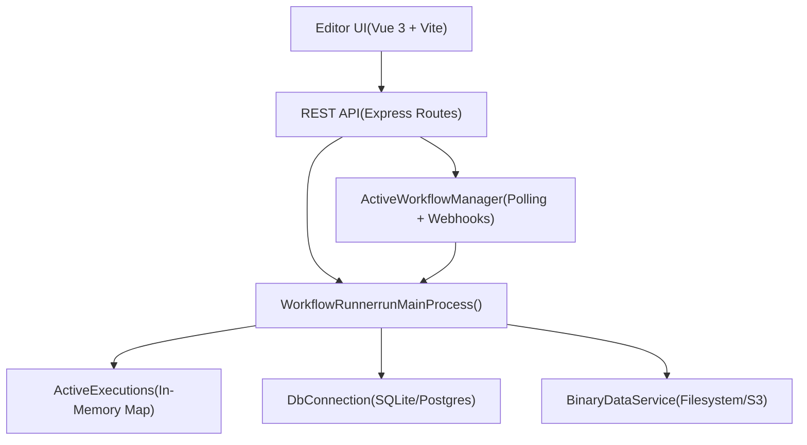
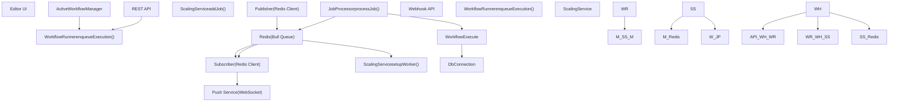
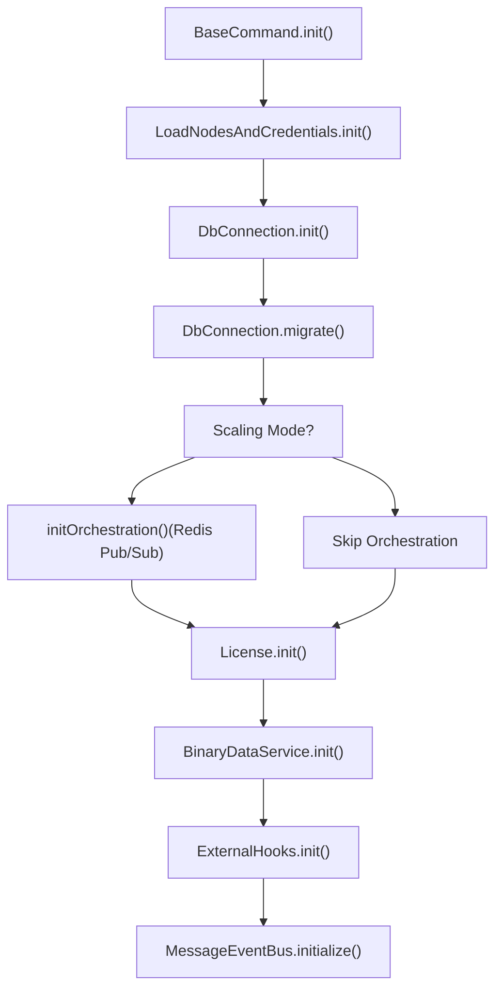
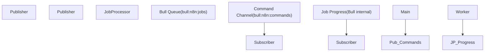

# 运行时架构与进程模型

相关源文件

-   [packages/@n8n/api-types/src/frontend-settings.ts](https://github.com/n8n-io/n8n/blob/88f170b9/packages/@n8n/api-types/src/frontend-settings.ts)
-   [packages/@n8n/api-types/src/push/collaboration.ts](https://github.com/n8n-io/n8n/blob/88f170b9/packages/@n8n/api-types/src/push/collaboration.ts)
-   [packages/@n8n/backend-common/src/license-state.ts](https://github.com/n8n-io/n8n/blob/88f170b9/packages/@n8n/backend-common/src/license-state.ts)
-   [packages/@n8n/benchmark/src/n8n-api-client/n8n-api-client.ts](https://github.com/n8n-io/n8n/blob/88f170b9/packages/@n8n/benchmark/src/n8n-api-client/n8n-api-client.ts)
-   [packages/@n8n/config/src/configs/endpoints.config.ts](https://github.com/n8n-io/n8n/blob/88f170b9/packages/@n8n/config/src/configs/endpoints.config.ts)
-   [packages/@n8n/config/src/configs/scaling-mode.config.ts](https://github.com/n8n-io/n8n/blob/88f170b9/packages/@n8n/config/src/configs/scaling-mode.config.ts)
-   [packages/@n8n/config/src/decorators.ts](https://github.com/n8n-io/n8n/blob/88f170b9/packages/@n8n/config/src/decorators.ts)
-   [packages/@n8n/config/src/index.ts](https://github.com/n8n-io/n8n/blob/88f170b9/packages/@n8n/config/src/index.ts)
-   [packages/@n8n/config/test/config.test.ts](https://github.com/n8n-io/n8n/blob/88f170b9/packages/@n8n/config/test/config.test.ts)
-   [packages/@n8n/config/test/decorators.test.ts](https://github.com/n8n-io/n8n/blob/88f170b9/packages/@n8n/config/test/decorators.test.ts)
-   [packages/@n8n/config/test/string-normalization.test.ts](https://github.com/n8n-io/n8n/blob/88f170b9/packages/@n8n/config/test/string-normalization.test.ts)
-   [packages/@n8n/constants/src/index.ts](https://github.com/n8n-io/n8n/blob/88f170b9/packages/@n8n/constants/src/index.ts)
-   [packages/cli/BREAKING-CHANGES.md](https://github.com/n8n-io/n8n/blob/88f170b9/packages/cli/BREAKING-CHANGES.md?plain=1)
-   [packages/cli/src/__tests__/license.test.ts](https://github.com/n8n-io/n8n/blob/88f170b9/packages/cli/src/__tests__/license.test.ts)
-   [packages/cli/src/abstract-server.ts](https://github.com/n8n-io/n8n/blob/88f170b9/packages/cli/src/abstract-server.ts)
-   [packages/cli/src/commands/base-command.ts](https://github.com/n8n-io/n8n/blob/88f170b9/packages/cli/src/commands/base-command.ts)
-   [packages/cli/src/commands/start.ts](https://github.com/n8n-io/n8n/blob/88f170b9/packages/cli/src/commands/start.ts)
-   [packages/cli/src/commands/webhook.ts](https://github.com/n8n-io/n8n/blob/88f170b9/packages/cli/src/commands/webhook.ts)
-   [packages/cli/src/commands/worker.ts](https://github.com/n8n-io/n8n/blob/88f170b9/packages/cli/src/commands/worker.ts)
-   [packages/cli/src/config/index.ts](https://github.com/n8n-io/n8n/blob/88f170b9/packages/cli/src/config/index.ts)
-   [packages/cli/src/config/schema.ts](https://github.com/n8n-io/n8n/blob/88f170b9/packages/cli/src/config/schema.ts)
-   [packages/cli/src/constants.ts](https://github.com/n8n-io/n8n/blob/88f170b9/packages/cli/src/constants.ts)
-   [packages/cli/src/controllers/e2e.controller.ts](https://github.com/n8n-io/n8n/blob/88f170b9/packages/cli/src/controllers/e2e.controller.ts)
-   [packages/cli/src/errors/response-errors/locked.error.ts](https://github.com/n8n-io/n8n/blob/88f170b9/packages/cli/src/errors/response-errors/locked.error.ts)
-   [packages/cli/src/generic-helpers.ts](https://github.com/n8n-io/n8n/blob/88f170b9/packages/cli/src/generic-helpers.ts)
-   [packages/cli/src/license.ts](https://github.com/n8n-io/n8n/blob/88f170b9/packages/cli/src/license.ts)
-   [packages/cli/src/metrics/__tests__/prometheus-metrics.service.test.ts](https://github.com/n8n-io/n8n/blob/88f170b9/packages/cli/src/metrics/__tests__/prometheus-metrics.service.test.ts)
-   [packages/cli/src/metrics/__tests__/prometheus-metrics.service.unmocked.test.ts](https://github.com/n8n-io/n8n/blob/88f170b9/packages/cli/src/metrics/__tests__/prometheus-metrics.service.unmocked.test.ts)
-   [packages/cli/src/metrics/prometheus-metrics.service.ts](https://github.com/n8n-io/n8n/blob/88f170b9/packages/cli/src/metrics/prometheus-metrics.service.ts)
-   [packages/cli/src/metrics/types.ts](https://github.com/n8n-io/n8n/blob/88f170b9/packages/cli/src/metrics/types.ts)
-   [packages/cli/src/middlewares/list-query/filter.ts](https://github.com/n8n-io/n8n/blob/88f170b9/packages/cli/src/middlewares/list-query/filter.ts)
-   [packages/cli/src/middlewares/list-query/select.ts](https://github.com/n8n-io/n8n/blob/88f170b9/packages/cli/src/middlewares/list-query/select.ts)
-   [packages/cli/src/scaling/__tests__/worker-server.test.ts](https://github.com/n8n-io/n8n/blob/88f170b9/packages/cli/src/scaling/__tests__/worker-server.test.ts)
-   [packages/cli/src/scaling/worker-server.ts](https://github.com/n8n-io/n8n/blob/88f170b9/packages/cli/src/scaling/worker-server.ts)
-   [packages/cli/src/server.ts](https://github.com/n8n-io/n8n/blob/88f170b9/packages/cli/src/server.ts)
-   [packages/cli/src/services/__tests__/frontend.service.test.ts](https://github.com/n8n-io/n8n/blob/88f170b9/packages/cli/src/services/__tests__/frontend.service.test.ts)
-   [packages/cli/src/services/__tests__/redis-client.service.test.ts](https://github.com/n8n-io/n8n/blob/88f170b9/packages/cli/src/services/__tests__/redis-client.service.test.ts)
-   [packages/cli/src/services/frontend.service.ts](https://github.com/n8n-io/n8n/blob/88f170b9/packages/cli/src/services/frontend.service.ts)
-   [packages/cli/src/services/redis-client.service.ts](https://github.com/n8n-io/n8n/blob/88f170b9/packages/cli/src/services/redis-client.service.ts)
-   [packages/cli/test/integration/commands/worker.cmd.test.ts](https://github.com/n8n-io/n8n/blob/88f170b9/packages/cli/test/integration/commands/worker.cmd.test.ts)
-   [packages/cli/test/integration/deduplication/deduplication-helper.test.ts](https://github.com/n8n-io/n8n/blob/88f170b9/packages/cli/test/integration/deduplication/deduplication-helper.test.ts)
-   [packages/cli/test/integration/prometheus-metrics.test.ts](https://github.com/n8n-io/n8n/blob/88f170b9/packages/cli/test/integration/prometheus-metrics.test.ts)
-   [packages/cli/test/integration/shared/types.ts](https://github.com/n8n-io/n8n/blob/88f170b9/packages/cli/test/integration/shared/types.ts)
-   [packages/cli/test/integration/shared/utils/node-types-data.ts](https://github.com/n8n-io/n8n/blob/88f170b9/packages/cli/test/integration/shared/utils/node-types-data.ts)
-   [packages/cli/test/integration/shared/utils/test-server.ts](https://github.com/n8n-io/n8n/blob/88f170b9/packages/cli/test/integration/shared/utils/test-server.ts)
-   [packages/frontend/@n8n/design-system/src/components/CanvasCollaborationPill/CanvasCollaborationPill.vue](https://github.com/n8n-io/n8n/blob/88f170b9/packages/frontend/@n8n/design-system/src/components/CanvasCollaborationPill/CanvasCollaborationPill.vue)
-   [packages/frontend/@n8n/design-system/src/components/N8nLogo/Logo.vue](https://github.com/n8n-io/n8n/blob/88f170b9/packages/frontend/@n8n/design-system/src/components/N8nLogo/Logo.vue)
-   [packages/frontend/@n8n/stores/src/useRootStore.ts](https://github.com/n8n-io/n8n/blob/88f170b9/packages/frontend/@n8n/stores/src/useRootStore.ts)
-   [packages/frontend/editor-ui/src/__tests__/defaults.ts](https://github.com/n8n-io/n8n/blob/88f170b9/packages/frontend/editor-ui/src/__tests__/defaults.ts)
-   [packages/frontend/editor-ui/src/app/components/MainHeader/TabBar.vue](https://github.com/n8n-io/n8n/blob/88f170b9/packages/frontend/editor-ui/src/app/components/MainHeader/TabBar.vue)
-   [packages/frontend/editor-ui/src/app/composables/useBackendStatus.spec.ts](https://github.com/n8n-io/n8n/blob/88f170b9/packages/frontend/editor-ui/src/app/composables/useBackendStatus.spec.ts)
-   [packages/frontend/editor-ui/src/app/composables/useBackendStatus.ts](https://github.com/n8n-io/n8n/blob/88f170b9/packages/frontend/editor-ui/src/app/composables/useBackendStatus.ts)
-   [packages/frontend/editor-ui/src/app/stores/settings.store.test.ts](https://github.com/n8n-io/n8n/blob/88f170b9/packages/frontend/editor-ui/src/app/stores/settings.store.test.ts)
-   [packages/frontend/editor-ui/src/app/stores/settings.store.ts](https://github.com/n8n-io/n8n/blob/88f170b9/packages/frontend/editor-ui/src/app/stores/settings.store.ts)

本文档描述了 n8n 的运行时架构，重点关注不同的进程模型、执行模式以及它们如何交互。它涵盖了初始化序列、进程间通信以及决定运行时行为的配置系统。

---

## 概览 (Overview)

n8n 可以在两种不同的执行模式下运行，每种模式支持不同的进程拓扑：

-   **常规模式 (Regular Mode)**：单进程架构，主进程处理所有操作。
-   **队列模式 (Queue Mode)**：多进程架构，使用 Redis 和 Bull 进行分布式执行。

执行模式通过 `N8N_EXECUTIONS_MODE` 环境变量进行配置，并决定了可以部署哪些进程类型。

**进程类型 (Process Types)**：

-   `main`：主进程，提供 UI、API 服务，并可选择性地执行工作流。
-   `worker`：专门用于执行工作流的进程（仅限队列模式）。
-   `webhook`：专门用于处理生产环境 webhook 调用的进程（仅限队列模式）。

来源：[packages/@n8n/config/src/configs/executions.config.ts1-80](https://github.com/n8n-io/n8n/blob/88f170b9/packages/@n8n/config/src/configs/executions.config.ts#L1-L80) [packages/cli/src/commands/start.ts49-117](https://github.com/n8n-io/n8n/blob/88f170b9/packages/cli/src/commands/start.ts#L49-L117)

---

## 执行模式 (Execution Modes)

### 常规模式 (Regular Mode)


**常规模式架构**

在常规模式下，单个进程 (`main`) 处理所有操作。`WorkflowRunner` 通过 `runMainProcess()` 直接在同一个进程中执行工作流。

**关键特征**：

-   通过 `N8N_EXECUTIONS_MODE=regular`（默认值）进行配置 [packages/@n8n/config/src/configs/executions.config.ts15-16](https://github.com/n8n-io/n8n/blob/88f170b9/packages/@n8n/config/src/configs/executions.config.ts#L15-L16)。
-   所有执行都通过 `WorkflowRunner.runMainProcess()` 在进程内发生。
-   `ActiveExecutions` 在内存中跟踪正在运行的工作流。
-   无需依赖 Redis。
-   适用于中小型工作负载。

**初始化流程**：

> **[Mermaid sequence]**
> *(图表结构无法解析)*

**关键组件**：

-   **`Start` 命令** [packages/cli/src/commands/start.ts49-55](https://github.com/n8n-io/n8n/blob/88f170b9/packages/cli/src/commands/start.ts#L49-L55)：编排初始化的入口点。
-   **`Server`** [packages/cli/src/server.ts71-72](https://github.com/n8n-io/n8n/blob/88f170b9/packages/cli/src/server.ts#L71-L72)：配置 Express 应用、路由和中间件。
-   **`WorkflowRunner`**：在当前进程中执行工作流或将其加入队列。
-   **`ActiveWorkflowManager`** [packages/cli/src/active-workflow-manager.ts](https://github.com/n8n-io/n8n/blob/88f170b9/packages/cli/src/active-workflow-manager.ts)：管理轮询触发器和 webhook。

来源：[packages/cli/src/commands/start.ts189-282](https://github.com/n8n-io/n8n/blob/88f170b9/packages/cli/src/commands/start.ts#L189-L282) [packages/cli/src/server.ts91-113](https://github.com/n8n-io/n8n/blob/88f170b9/packages/cli/src/server.ts#L91-L113) [packages/cli/src/commands/base-command.ts84-186](https://github.com/n8n-io/n8n/blob/88f170b9/packages/cli/src/commands/base-command.ts#L84-L186)

---

### 队列模式 (Queue Mode)


**队列模式架构**

队列模式使用 Redis 和 Bull 任务队列库将执行分发到多个进程。任务由主进程/webhook 进程入队，并由工作进程 (Worker Process) 领取。

**关键特征**：

-   通过 `N8N_EXECUTIONS_MODE=queue` 进行配置 [packages/cli/src/commands/worker.ts67-69](https://github.com/n8n-io/n8n/blob/88f170b9/packages/cli/src/commands/worker.ts#L67-L69)。
-   需要 Redis 用于任务队列和发布/订阅 (Pub/Sub) [packages/@n8n/config/src/configs/scaling-mode.config.ts265-283](https://github.com/n8n-io/n8n/blob/88f170b9/packages/@n8n/config/src/configs/scaling-mode.config.ts#L265-L283)。
-   工作流通过 `ScalingService.addJob()` 作为任务入队。
-   工作进程使用 `JobProcessor.processJob()` 处理任务。
-   支持工作进程的水平扩展。
-   主进程和 webhook 进程可以通过多主 (Multi-Main) 设置进行扩展 [packages/cli/src/scaling/multi-main-setup.ee.ts](https://github.com/n8n-io/n8n/blob/88f170b9/packages/cli/src/scaling/multi-main-setup.ee.ts)。

**关键组件**：

-   **`ScalingService`**：管理 Bull 队列和任务生命周期。
-   **`JobProcessor`**：在工作进程上执行任务。
-   **`Publisher` / `Subscriber`** [packages/cli/src/scaling/pubsub/publisher.service.ts](https://github.com/n8n-io/n8n/blob/88f170b9/packages/cli/src/scaling/pubsub/publisher.service.ts) [packages/cli/src/scaling/pubsub/subscriber.service.ts](https://github.com/n8n-io/n8n/blob/88f170b9/packages/cli/src/scaling/pubsub/subscriber.service.ts)：用于命令和事件的 Redis 发布/订阅。

来源：[packages/cli/src/commands/worker.ts165-172](https://github.com/n8n-io/n8n/blob/88f170b9/packages/cli/src/commands/worker.ts#L165-L172) [packages/cli/src/commands/worker.ts141-149](https://github.com/n8n-io/n8n/blob/88f170b9/packages/cli/src/commands/worker.ts#L141-L149) [packages/cli/src/commands/start.ts101-104](https://github.com/n8n-io/n8n/blob/88f170b9/packages/cli/src/commands/start.ts#L101-L104)

---

## 进程类型 (Process Types)

### 主进程 (Main Process)

主进程负责提供 Web UI、REST API，并可选地处理 webhook 执行。

**命令**：`n8n start` [packages/cli/src/commands/start.ts49-55](https://github.com/n8n-io/n8n/blob/88f170b9/packages/cli/src/commands/start.ts#L49-L55)

**职责**：

| 职责 | 组件 | 描述 |
| --- | --- | --- |
| 提供 Web UI | `Server` | 静态资源 + API 路由 [packages/cli/src/server.ts92-97](https://github.com/n8n-io/n8n/blob/88f170b9/packages/cli/src/server.ts#L92-L97) |
| REST API | `ControllerRegistry` | 工作流、执行、凭据、用户 [packages/cli/src/server.ts18-65](https://github.com/n8n-io/n8n/blob/88f170b9/packages/cli/src/server.ts#L18-65) |
| WebSocket 推送 | `Push` | 向已连接客户端发送实时更新 [packages/cli/src/server.ts191-192](https://github.com/n8n-io/n8n/blob/88f170b9/packages/cli/src/server.ts#L191-L192) |
| 工作流激活 | `ActiveWorkflowManager` | 启动/停止轮询触发器和 webhook [packages/cli/src/commands/start.ts95](https://github.com/n8n-io/n8n/blob/88f170b9/packages/cli/src/commands/start.ts#L95-L95) |
| 执行（常规模式） | `WorkflowRunner` | 在进程内直接执行工作流 |
| 执行（队列模式） | `WorkflowRunner` | 将任务入队到 Redis |

**初始化序列**：

```
// packages/cli/src/commands/start.tsasync init() {    await this.initCrashJournal();    await super.init(); // BaseCommand.init()    if (this.globalConfig.executions.mode === 'queue') {        await this.initOrchestration(); // Publisher/Subscriber    }    await this.generateStaticAssets(); // Prepare UI files}
```
来源：[packages/cli/src/commands/start.ts189-282](https://github.com/n8n-io/n8n/blob/88f170b9/packages/cli/src/commands/start.ts#L189-282) [packages/cli/src/server.ts91-113](https://github.com/n8n-io/n8n/blob/88f170b9/packages/cli/src/server.ts#L91-L113)

---

### 工作进程 (Worker Process)

工作进程执行从 Redis 出队的工作流。默认情况下它们不运行 Web 服务器（健康检查/指标除外），且仅连接到数据库和 Redis。

**命令**：`n8n worker` [packages/cli/src/commands/worker.ts26-32](https://github.com/n8n-io/n8n/blob/88f170b9/packages/cli/src/commands/worker.ts#L26-L32)

**职责**：

| 职责 | 组件 | 描述 |
| --- | --- | --- |
| 处理任务 | `ScalingService` | 向 Bull 注册任务处理器 [packages/cli/src/commands/worker.ts171](https://github.com/n8n-io/n8n/blob/88f170b9/packages/cli/src/commands/worker.ts#L171-L171) |
| 执行工作流 | `JobProcessor` | 运行工作流并跟踪执行情况 |
| 报告进度 | `Bull` | 向 Redis 发送进度消息 |
| 处理命令 | `Subscriber` | 处理 `stopJob` 或许可证重载 [packages/cli/src/commands/worker.ts146-147](https://github.com/n8n-io/n8n/blob/88f170b9/packages/cli/src/commands/worker.ts#L146-L147) |

**初始化序列**：

```
// packages/cli/src/commands/worker.tsasync init() {    await this.setConcurrency(); // N8N_CONCURRENCY_PRODUCTION_LIMIT    await super.init(); // DB, Nodes, License    await this.initScalingService(); // Setup Bull worker    await this.initOrchestration(); // Redis Pub/Sub}
```
**并发性**：工作进程支持通过 `--concurrency` 标志或 `N8N_CONCURRENCY_PRODUCTION_LIMIT` 进行并发任务处理 [packages/cli/src/commands/worker.ts151-163](https://github.com/n8n-io/n8n/blob/88f170b9/packages/cli/src/commands/worker.ts#L151-L163)。

来源：[packages/cli/src/commands/worker.ts74-126](https://github.com/n8n-io/n8n/blob/88f170b9/packages/cli/src/commands/worker.ts#L74-L126) [packages/cli/src/commands/worker.ts165-172](https://github.com/n8n-io/n8n/blob/88f170b9/packages/cli/src/commands/worker.ts#L165-L172)

---

### Webhook 进程 (Webhook Process)

Webhook 进程处理生产环境 webhook 调用并立即将其入队以便处理。它们提供一个极简的 HTTP API。

**命令**：`n8n webhook` [packages/cli/src/commands/webhook.ts](https://github.com/n8n-io/n8n/blob/88f170b9/packages/cli/src/commands/webhook.ts)

**要求**：

-   必须启用队列模式 (`N8N_EXECUTIONS_MODE=queue`)。

**与主进程的关键区别**：

-   不提供编辑器 UI。
-   不运行轮询触发器。
-   仅启用生产环境 webhook；禁用测试环境 webhook [packages/cli/src/server.ts87-88](https://github.com/n8n-io/n8n/blob/88f170b9/packages/cli/src/server.ts#L87-L88)。

来源：[packages/cli/src/server.ts87-89](https://github.com/n8n-io/n8n/blob/88f170b9/packages/cli/src/server.ts#L87-L89) [packages/cli/src/commands/webhook.ts](https://github.com/n8n-io/n8n/blob/88f170b9/packages/cli/src/commands/webhook.ts)

---

## 服务器初始化

### 初始化阶段

所有进程类型都遵循 `BaseCommand` 中定义的通用初始化序列：


**阶段 1：数据库与核心**

-   连接到数据库 (SQLite/PostgreSQL) [packages/cli/src/commands/base-command.ts125-130](https://github.com/n8n-io/n8n/blob/88f170b9/packages/cli/src/commands/base-command.ts#L125-L130)。
-   运行迁移 [packages/cli/src/commands/base-command.ts140-145](https://github.com/n8n-io/n8n/blob/88f170b9/packages/cli/src/commands/base-command.ts#L140-L145)。

**阶段 2：节点与凭据**

-   加载内置和社区节点 [packages/cli/src/commands/base-command.ts123](https://github.com/n8n-io/n8n/blob/88f170b9/packages/cli/src/commands/base-command.ts#L123-L123)。
-   初始化凭据类型。

**阶段 3：编排（仅限队列模式）**

-   初始化 `Publisher` 和 `Subscriber` [packages/cli/src/commands/worker.ts141-149](https://github.com/n8n-io/n8n/blob/88f170b9/packages/cli/src/commands/worker.ts#L141-L149)。
-   连接到 Redis 以进行进程间通信。

**阶段 4：任务执行器 (Task Runners)**

-   如果需要，启动用于 JavaScript/Python 的沙盒执行环境 [packages/cli/src/commands/base-command.ts169-178](https://github.com/n8n-io/n8n/blob/88f170b9/packages/cli/src/commands/base-command.ts#L169-L178)。

来源：[packages/cli/src/commands/base-command.ts84-186](https://github.com/n8n-io/n8n/blob/88f170b9/packages/cli/src/commands/base-command.ts#L84-L186) [packages/cli/src/commands/worker.ts141-149](https://github.com/n8n-io/n8n/blob/88f170b9/packages/cli/src/commands/worker.ts#L141-L149)

---

## 进程间通信

### 队列模式通信

队列模式使用 Redis 进行任务队列管理和进程间消息传递。


**Redis 发布/订阅频道**：

-   `commands`：主进程用于向工作进程发送指令，如 `stopJob` 或 `reloadLicense` [packages/cli/src/scaling/pubsub/subscriber.service.ts](https://github.com/n8n-io/n8n/blob/88f170b9/packages/cli/src/scaling/pubsub/subscriber.service.ts)。
-   `worker-response`：工作进程用于向主进程反馈任务完成信号 [packages/cli/src/scaling/pubsub/pubsub.registry.ts](https://github.com/n8n-io/n8n/blob/88f170b9/packages/cli/src/scaling/pubsub/pubsub.registry.ts)。

来源：[packages/cli/src/commands/worker.ts141-149](https://github.com/n8n-io/n8n/blob/88f170b9/packages/cli/src/commands/worker.ts#L141-L149) [packages/cli/src/scaling/pubsub/publisher.service.ts](https://github.com/n8n-io/n8n/blob/88f170b9/packages/cli/src/scaling/pubsub/publisher.service.ts) [packages/cli/src/scaling/pubsub/subscriber.service.ts](https://github.com/n8n-io/n8n/blob/88f170b9/packages/cli/src/scaling/pubsub/subscriber.service.ts)

---

### 多主 (Multi-Main) 设置

当 `N8N_MULTI_MAIN_SETUP_ENABLED=true` 时，可以运行多个主实例，并通过 Redis 进行自动领导者选举 (Leader Election) [packages/cli/src/scaling/multi-main-setup.ee.ts](https://github.com/n8n-io/n8n/blob/88f170b9/packages/cli/src/scaling/multi-main-setup.ee.ts)。

**领导者 (Leader) 职责**：

-   队列恢复（检测并重新入队停滞的任务）。
-   工作流激活跟踪。
-   清理服务 [packages/cli/src/commands/start.ts97-99](https://github.com/n8n-io/n8n/blob/88f170b9/packages/cli/src/commands/start.ts#L97-L99)。

**跟随者 (Follower) 职责**：

-   提供 UI 和 API 服务。
-   将新的执行任务入队。

来源：[packages/cli/src/scaling/multi-main-setup.ee.ts](https://github.com/n8n-io/n8n/blob/88f170b9/packages/cli/src/scaling/multi-main-setup.ee.ts) [packages/@n8n/config/src/configs/multi-main-setup.config.ts1-20](https://github.com/n8n-io/n8n/blob/88f170b9/packages/@n8n/config/src/configs/multi-main-setup.config.ts#L1-L20)

---

## 配置系统

### GlobalConfig 架构

配置系统使用装饰器将环境变量映射到强类型的类 [packages/@n8n/config/src/index.ts74-75](https://github.com/n8n-io/n8n/blob/88f170b9/packages/@n8n/config/src/index.ts#L74-L75)。

```
// packages/@n8n/config/src/index.ts@Configexport class GlobalConfig {    @Env('N8N_PORT')    port: number = 5678;     @Nested    executions: ExecutionsConfig;     @Nested    database: DatabaseConfig;}
```
**关键配置组**：

-   `executions`：模式（常规/队列）、超时和并发性 [packages/@n8n/config/src/configs/executions.config.ts](https://github.com/n8n-io/n8n/blob/88f170b9/packages/@n8n/config/src/configs/executions.config.ts)。
-   `database`：SQLite 或 Postgres 的连接设置 [packages/@n8n/config/src/configs/database.config.ts](https://github.com/n8n-io/n8n/blob/88f170b9/packages/@n8n/config/src/configs/database.config.ts)。
-   `queue`：Redis 和 Bull 设置 [packages/@n8n/config/src/configs/scaling-mode.config.ts](https://github.com/n8n-io/n8n/blob/88f170b9/packages/@n8n/config/src/configs/scaling-mode.config.ts)。

来源：[packages/@n8n/config/src/index.ts74-241](https://github.com/n8n-io/n8n/blob/88f170b9/packages/@n8n/config/src/index.ts#L74-L241) [packages/@n8n/config/test/config.test.ts42-113](https://github.com/n8n-io/n8n/blob/88f170b9/packages/@n8n/config/test/config.test.ts#L42-L113)

---

## 进程生命周期

### 停机序列 (Shutdown Sequence)

优雅停机由优先级组管理，以确保依赖项按正确顺序关闭 [packages/cli/src/constants.ts127-130](https://github.com/n8n-io/n8n/blob/88f170b9/packages/cli/src/constants.ts#L127-L130)。

1.  **收到信号**：捕获 `SIGTERM` 或 `SIGINT` [packages/cli/src/commands/base-command.ts118-119](https://github.com/n8n-io/n8n/blob/88f170b9/packages/cli/src/commands/base-command.ts#L118-L119)。
2.  **停止跟踪**：停止 `WaitTracker` 和 `ActiveWorkflowManager` [packages/cli/src/commands/start.ts89-95](https://github.com/n8n-io/n8n/blob/88f170b9/packages/cli/src/commands/start.ts#L89-L95)。
3.  **多主设置**：关闭领导者选举（如果适用） [packages/cli/src/commands/start.ts97-99](https://github.com/n8n-io/n8n/blob/88f170b9/packages/cli/src/commands/start.ts#L97-L99)。
4.  **队列**：关闭 `Publisher` 和 `Subscriber` [packages/cli/src/commands/start.ts101-104](https://github.com/n8n-io/n8n/blob/88f170b9/packages/cli/src/commands/start.ts#L101-L104)。
5.  **最终清理**：关闭 `MessageEventBus` 和数据库连接 [packages/cli/src/commands/start.ts111](https://github.com/n8n-io/n8n/blob/88f170b9/packages/cli/src/commands/start.ts#L111-L111) [packages/cli/src/commands/base-command.ts198](https://github.com/n8n-io/n8n/blob/88f170b9/packages/cli/src/commands/base-command.ts#L198-L198)。

来源：[packages/cli/src/commands/start.ts84-117](https://github.com/n8n-io/n8n/blob/88f170b9/packages/cli/src/commands/start.ts#L84-L117) [packages/cli/src/commands/base-command.ts188-202](https://github.com/n8n-io/n8n/blob/88f170b9/packages/cli/src/commands/base-command.ts#L188-L202) [packages/cli/src/constants.ts127-130](https://github.com/n8n-io/n8n/blob/88f170b9/packages/cli/src/constants.ts#L127-L130)
