# 软件包依赖与构建系统

相关源文件

-   [CHANGELOG.md](https://github.com/n8n-io/n8n/blob/88f170b9/CHANGELOG.md?plain=1)
-   [codecov.yml](https://github.com/n8n-io/n8n/blob/88f170b9/codecov.yml)
-   [jest.config.js](https://github.com/n8n-io/n8n/blob/88f170b9/jest.config.js)
-   [package.json](https://github.com/n8n-io/n8n/blob/88f170b9/package.json)
-   [packages/@n8n/api-types/package.json](https://github.com/n8n-io/n8n/blob/88f170b9/packages/@n8n/api-types/package.json)
-   [packages/@n8n/backend-common/src/modules/\_\_tests\_\_/module-registry.test.ts](https://github.com/n8n-io/n8n/blob/88f170b9/packages/@n8n/backend-common/src/modules/__tests__/module-registry.test.ts)
-   [packages/@n8n/backend-common/src/modules/module-registry.ts](https://github.com/n8n-io/n8n/blob/88f170b9/packages/@n8n/backend-common/src/modules/module-registry.ts)
-   [packages/@n8n/backend-common/src/modules/modules.config.ts](https://github.com/n8n-io/n8n/blob/88f170b9/packages/@n8n/backend-common/src/modules/modules.config.ts)
-   [packages/@n8n/client-oauth2/tsconfig.build.json](https://github.com/n8n-io/n8n/blob/88f170b9/packages/@n8n/client-oauth2/tsconfig.build.json)
-   [packages/@n8n/config/package.json](https://github.com/n8n-io/n8n/blob/88f170b9/packages/@n8n/config/package.json)
-   [packages/@n8n/decorators/src/\_\_tests\_\_/redactable.test.ts](https://github.com/n8n-io/n8n/blob/88f170b9/packages/@n8n/decorators/src/__tests__/redactable.test.ts)
-   [packages/@n8n/decorators/src/controller/\_\_tests\_\_/args.test.ts](https://github.com/n8n-io/n8n/blob/88f170b9/packages/@n8n/decorators/src/controller/__tests__/args.test.ts)
-   [packages/@n8n/decorators/src/controller/\_\_tests\_\_/license.test.ts](https://github.com/n8n-io/n8n/blob/88f170b9/packages/@n8n/decorators/src/controller/__tests__/license.test.ts)
-   [packages/@n8n/decorators/src/controller/\_\_tests\_\_/scoped.test.ts](https://github.com/n8n-io/n8n/blob/88f170b9/packages/@n8n/decorators/src/controller/__tests__/scoped.test.ts)
-   [packages/@n8n/decorators/src/execution-lifecycle/\_\_tests\_\_/on-lifecycle-event.test.ts](https://github.com/n8n-io/n8n/blob/88f170b9/packages/@n8n/decorators/src/execution-lifecycle/__tests__/on-lifecycle-event.test.ts)
-   [packages/@n8n/decorators/src/execution-lifecycle/index.ts](https://github.com/n8n-io/n8n/blob/88f170b9/packages/@n8n/decorators/src/execution-lifecycle/index.ts)
-   [packages/@n8n/decorators/src/execution-lifecycle/lifecycle-metadata.ts](https://github.com/n8n-io/n8n/blob/88f170b9/packages/@n8n/decorators/src/execution-lifecycle/lifecycle-metadata.ts)
-   [packages/@n8n/decorators/src/module/\_\_tests\_\_/module.test.ts](https://github.com/n8n-io/n8n/blob/88f170b9/packages/@n8n/decorators/src/module/__tests__/module.test.ts)
-   [packages/@n8n/decorators/src/module/index.ts](https://github.com/n8n-io/n8n/blob/88f170b9/packages/@n8n/decorators/src/module/index.ts)
-   [packages/@n8n/decorators/src/module/module-metadata.ts](https://github.com/n8n-io/n8n/blob/88f170b9/packages/@n8n/decorators/src/module/module-metadata.ts)
-   [packages/@n8n/decorators/src/module/module.ts](https://github.com/n8n-io/n8n/blob/88f170b9/packages/@n8n/decorators/src/module/module.ts)
-   [packages/@n8n/expression-runtime/tsconfig.build.cjs.json](https://github.com/n8n-io/n8n/blob/88f170b9/packages/@n8n/expression-runtime/tsconfig.build.cjs.json)
-   [packages/@n8n/expression-runtime/tsconfig.build.esm.json](https://github.com/n8n-io/n8n/blob/88f170b9/packages/@n8n/expression-runtime/tsconfig.build.esm.json)
-   [packages/@n8n/nodes-langchain/package.json](https://github.com/n8n-io/n8n/blob/88f170b9/packages/@n8n/nodes-langchain/package.json)
-   [packages/@n8n/nodes-langchain/tsconfig.build.json](https://github.com/n8n-io/n8n/blob/88f170b9/packages/@n8n/nodes-langchain/tsconfig.build.json)
-   [packages/@n8n/nodes-langchain/tsconfig.json](https://github.com/n8n-io/n8n/blob/88f170b9/packages/@n8n/nodes-langchain/tsconfig.json)
-   [packages/@n8n/task-runner/package.json](https://github.com/n8n-io/n8n/blob/88f170b9/packages/@n8n/task-runner/package.json)
-   [packages/cli/package.json](https://github.com/n8n-io/n8n/blob/88f170b9/packages/cli/package.json)
-   [packages/cli/src/modules/community-packages/community-packages.module.ts](https://github.com/n8n-io/n8n/blob/88f170b9/packages/cli/src/modules/community-packages/community-packages.module.ts)
-   [packages/cli/src/modules/external-secrets.ee/external-secrets.module.ts](https://github.com/n8n-io/n8n/blob/88f170b9/packages/cli/src/modules/external-secrets.ee/external-secrets.module.ts)
-   [packages/cli/src/modules/otel/README.md](https://github.com/n8n-io/n8n/blob/88f170b9/packages/cli/src/modules/otel/README.md?plain=1)
-   [packages/cli/src/modules/otel/\_\_tests\_\_/otel-test-provider.ts](https://github.com/n8n-io/n8n/blob/88f170b9/packages/cli/src/modules/otel/__tests__/otel-test-provider.ts)
-   [packages/cli/src/modules/otel/\_\_tests\_\_/otel-workflow-tracing.integration.test.ts](https://github.com/n8n-io/n8n/blob/88f170b9/packages/cli/src/modules/otel/__tests__/otel-workflow-tracing.integration.test.ts)
-   [packages/cli/src/modules/otel/\_\_tests\_\_/span-registry.test.ts](https://github.com/n8n-io/n8n/blob/88f170b9/packages/cli/src/modules/otel/__tests__/span-registry.test.ts)
-   [packages/cli/src/modules/otel/handlers/interfaces.ts](https://github.com/n8n-io/n8n/blob/88f170b9/packages/cli/src/modules/otel/handlers/interfaces.ts)
-   [packages/cli/src/modules/otel/handlers/workflow-end.handler.ts](https://github.com/n8n-io/n8n/blob/88f170b9/packages/cli/src/modules/otel/handlers/workflow-end.handler.ts)
-   [packages/cli/src/modules/otel/handlers/workflow-start.handler.ts](https://github.com/n8n-io/n8n/blob/88f170b9/packages/cli/src/modules/otel/handlers/workflow-start.handler.ts)
-   [packages/cli/tsconfig.build.json](https://github.com/n8n-io/n8n/blob/88f170b9/packages/cli/tsconfig.build.json)
-   [packages/cli/tsconfig.json](https://github.com/n8n-io/n8n/blob/88f170b9/packages/cli/tsconfig.json)
-   [packages/core/package.json](https://github.com/n8n-io/n8n/blob/88f170b9/packages/core/package.json)
-   [packages/core/tsconfig.build.json](https://github.com/n8n-io/n8n/blob/88f170b9/packages/core/tsconfig.build.json)
-   [packages/core/tsconfig.json](https://github.com/n8n-io/n8n/blob/88f170b9/packages/core/tsconfig.json)
-   [packages/frontend/@n8n/design-system/package.json](https://github.com/n8n-io/n8n/blob/88f170b9/packages/frontend/@n8n/design-system/package.json)
-   [packages/frontend/@n8n/stores/src/\_\_tests\_\_/metaTagConfig.test.ts](https://github.com/n8n-io/n8n/blob/88f170b9/packages/frontend/@n8n/stores/src/__tests__/metaTagConfig.test.ts)
-   [packages/frontend/@n8n/stores/src/metaTagConfig.ts](https://github.com/n8n-io/n8n/blob/88f170b9/packages/frontend/@n8n/stores/src/metaTagConfig.ts)
-   [packages/frontend/editor-ui/index.html](https://github.com/n8n-io/n8n/blob/88f170b9/packages/frontend/editor-ui/index.html)
-   [packages/frontend/editor-ui/package.json](https://github.com/n8n-io/n8n/blob/88f170b9/packages/frontend/editor-ui/package.json)
-   [packages/frontend/editor-ui/public/static/posthog.init.js](https://github.com/n8n-io/n8n/blob/88f170b9/packages/frontend/editor-ui/public/static/posthog.init.js)
-   [packages/frontend/editor-ui/public/static/prefers-color-scheme.css](https://github.com/n8n-io/n8n/blob/88f170b9/packages/frontend/editor-ui/public/static/prefers-color-scheme.css)
-   [packages/frontend/editor-ui/tsconfig.json](https://github.com/n8n-io/n8n/blob/88f170b9/packages/frontend/editor-ui/tsconfig.json)
-   [packages/frontend/editor-ui/vite.config.mts](https://github.com/n8n-io/n8n/blob/88f170b9/packages/frontend/editor-ui/vite.config.mts)
-   [packages/node-dev/package.json](https://github.com/n8n-io/n8n/blob/88f170b9/packages/node-dev/package.json)
-   [packages/node-dev/tsconfig.json](https://github.com/n8n-io/n8n/blob/88f170b9/packages/node-dev/tsconfig.json)
-   [packages/nodes-base/package.json](https://github.com/n8n-io/n8n/blob/88f170b9/packages/nodes-base/package.json)
-   [packages/nodes-base/tsconfig.json](https://github.com/n8n-io/n8n/blob/88f170b9/packages/nodes-base/tsconfig.json)
-   [packages/workflow/package.json](https://github.com/n8n-io/n8n/blob/88f170b9/packages/workflow/package.json)
-   [packages/workflow/test/expression-vm-errors.test.ts](https://github.com/n8n-io/n8n/blob/88f170b9/packages/workflow/test/expression-vm-errors.test.ts)
-   [packages/workflow/test/setup-vm-evaluator.ts](https://github.com/n8n-io/n8n/blob/88f170b9/packages/workflow/test/setup-vm-evaluator.ts)
-   [packages/workflow/tsconfig.json](https://github.com/n8n-io/n8n/blob/88f170b9/packages/workflow/tsconfig.json)
-   [pnpm-lock.yaml](https://github.com/n8n-io/n8n/blob/88f170b9/pnpm-lock.yaml)
-   [pnpm-workspace.yaml](https://github.com/n8n-io/n8n/blob/88f170b9/pnpm-workspace.yaml)
-   [tsconfig.json](https://github.com/n8n-io/n8n/blob/88f170b9/tsconfig.json)
-   [turbo.json](https://github.com/n8n-io/n8n/blob/88f170b9/turbo.json)

本页面介绍了 n8n 的 monorepo 如何管理依赖版本、如何对第三方软件包应用补丁（patch），以及如何将每个工作区（workspace）软件包编译为可分发的工件。重点在于工具配置：pnpm 工作区布局、catalog 系统、Turborepo 任务编排，以及针对每个软件包的 TypeScript 和 Vite 编译策略。

对于消耗这些工件的 CI/CD 流水线，请参阅 [9.1](https://github.com/n8n-io/n8n/blob/88f170b9/9.1) 和 [9.2](https://github.com/n8n-io/n8n/blob/88f170b9/9.2)。对于 Docker 镜像组装，请参阅 [7.3](https://github.com/n8n-io/n8n/blob/88f170b9/7.3) 和 [9.4](https://github.com/n8n-io/n8n/blob/88f170b9/9.4)。对于开发环境设置，请参阅 [10.1](https://github.com/n8n-io/n8n/blob/88f170b9/10.1)。

---

## 软件包管理器与工作区布局

n8n 使用 **pnpm 10.22.0**（通过根目录 `package.json` 中的 `packageManager` 字段强制执行）和 pnpm 工作区。根目录的 `preinstall` 脚本运行 `scripts/block-npm-install.js`，如果检测到 npm 或 yarn，则会报错退出。

工作区软件包根目录在 `pnpm-workspace.yaml` 中声明：

| 通配符 | 包含内容 |
| --- | --- |
| `packages/*` | `n8n-workflow`、`n8n-core`、`n8n-nodes-base`、`packages/cli` (`n8n`)、`packages/node-dev` |
| `packages/@n8n/*` | `@n8n/config`、`@n8n/db`、`@n8n/di`、`@n8n/task-runner`、`@n8n/api-types`、`@n8n/decorators` 等 |
| `packages/frontend/**` | `n8n-editor-ui`、`@n8n/design-system`、`@n8n/chat`、`@n8n/i18n` 以及其他前端软件包 |
| `packages/extensions/**` | 扩展软件包 |
| `packages/testing/**` | `n8n-playwright`、`n8n-containers` |

来源：`pnpm-workspace.yaml:1-7`()、`package.json:9`()、`package.json:12`()

---

## 基于 Catalog 的版本锁定

`pnpm-workspace.yaml` 中的 pnpm catalogs 定义了共享的版本锁定，在各软件包的 `package.json` 文件中通过 `catalog:` 说明符引用。这可以防止各软件包之间出现版本偏移，而无需在每个清单中重复确切的版本。

**Catalog 组：**

| Catalog | 引用方式 | 示例条目 |
| --- | --- | --- |
| 默认 (未命名) | `catalog:` | `typescript`、`lodash`、`zod`、`vitest`、`vite`、`axios` |
| `frontend` | `catalog:frontend` | `vue`、`pinia`、`vue-router`、`element-plus`、`vitest` |
| `storybook` | `catalog:storybook` | `storybook`、`@storybook/vue3-vite` |
| `e2e` | `catalog:e2e` | `@playwright/test`、`@currents/playwright`、`playwright` |
| `sentry` | `catalog:sentry` | `@sentry/node`、`@sentry/profiling-node`、`@sentry/node-native` |

**`packages/cli/package.json` 中的使用示例：**

```
"lodash":        "catalog:","@sentry/node":  "catalog:sentry","@n8n/typeorm":  "catalog:"
```
**值得注意的 catalog 条目 —— Vite 别名为 rolldown-vite：**

默认 catalog 中的 `vite` 条目为：

```
vite: npm:rolldown-vite@latest
```
所有声明 `"vite": "catalog:"` 的工作区软件包都会透明地接收 `rolldown-vite`（一个使用 Rolldown 打包器的 Vite 分支），而无需更改自身配置。

来源：`pnpm-workspace.yaml:8-128`()、`pnpm-lock.yaml:183-186`()、`packages/cli/package.json:120-136`()

---

## 依赖覆盖与补丁

### 全局覆盖 (Overrides)

根目录 `package.json` 的 `pnpm.overrides` 部分（在 `pnpm-lock.yaml` 的 `overrides` 中镜像）在整个安装图中强制执行传递依赖的特定版本。

| 覆盖项 | 效果 |
| --- | --- |
| `typescript: 5.9.2` | 所有工具使用单一 TypeScript 版本 |
| `zod: 3.25.67` | 防止 Zod 实例冲突 |
| `axios: 1.13.5` | 出于安全考虑锁定版本 |
| `esbuild: ^0.25.0` | 一致的打包器版本 |
| `multer: ^2.1.1` | 安全修复 |
| `expr-eval@2.0.2: npm:expr-eval-fork@3.0.0` | 用分支版本替换 `expr-eval` |
| `libphonenumber-js: npm:empty-npm-package@1.0.0` | 剥离一个未使用的大型依赖 |
| `chokidar: 4.0.3` | 锁定文件监听器版本 |

### 打包补丁 (Patched Dependencies)

补丁是 `patches/` 目录中的 `.patch` 文件，由 pnpm 在安装时应用。`package.json` 中的 `pnpm.patchedDependencies` 映射将每个软件包版本与其补丁文件关联起来。

| 补丁软件包 | 补丁文件 |
| --- | --- |
| `bull@4.16.4` | `patches/bull@4.16.4.patch` |
| `element-plus@2.4.3` | `patches/element-plus@2.4.3.patch` |
| `pdfjs-dist@5.3.31` | `patches/pdfjs-dist@5.3.31.patch` |
| `vue-tsc@2.2.8` | `patches/vue-tsc@2.2.8.patch` |
| `js-base64` | `patches/js-base64.patch` |
| `ics` | `patches/ics.patch` |
| `pkce-challenge@5.0.0` | `patches/pkce-challenge@5.0.0.patch` |
| `@types/express-serve-static-core@5.0.6` | `patches/@types__express-serve-static-core@5.0.6.patch` |
| `@types/ws@8.18.1` | `patches/@types__ws@8.18.1.patch` |

`pnpm.onlyBuiltDependencies` 字段将原生安装后构建脚本限制为仅限 `isolated-vm` 和 `sqlite3`，以防止其他软件包进行意外的原生编译。

来源：`package.json:86-166`()、`pnpm-lock.yaml:157-170`()

---

## Turborepo 构建编排

**Turborepo 2.8.9**（根目录 `devDependency`）按照拓扑依赖顺序编排各工作区软件包的任务执行。所有主要的根目录脚本都委派给 Turbo：

| 根目录脚本 | Turbo 命令 |
| --- | --- |
| `build` | `turbo run build` |
| `typecheck` | `turbo typecheck` |
| `dev` | `turbo run dev --parallel --env-mode=loose` |
| `lint` | `turbo run lint` |
| `test` | `turbo run test` |
| `clean` | `turbo run clean` |
| `watch` | `turbo run watch --concurrency=32` |

Turbo 根据每个软件包 `package.json` 中的 `dependencies` 和 `devDependencies` 字段确定任务顺序。一个软件包的 `build` 任务会等待其所有工作区依赖项的 `build` 任务先完成。

**图表：关键构建任务执行顺序 (工作区软件包名称 → 构建脚本)**

```mermaid
flowchart TD
    DI["@n8n/di(tsc)"]
    ERRORS["@n8n/errors(tsc)"]
    CONSTANTS["@n8n/constants(tsc)"]
    PERMISSIONS["@n8n/permissions(tsc)"]
    CONFIG["@n8n/config(tsc)"]
    DECORATORS["@n8n/decorators(tsc)"]
    BACKEND_COMMON["@n8n/backend-common(tsc)"]
    API_TYPES["@n8n/api-types(tsc)"]
    WORKFLOW["n8n-workflow(tsc ESM+CJS)"]
    DB["@n8n/db(tsc)"]
    CORE["n8n-core(tsc + tsc-alias)"]
    NODES_BASE["n8n-nodes-base(tsc CJS + metadata)"]
    LANGCHAIN["@n8n/n8n-nodes-langchain(tsc + metadata)"]
    TASK_RUNNER["@n8n/task-runner(tsc + tsc-alias)"]
    CLI["n8n (packages/cli)(tsc + tsc-alias + build.mjs)"]
    EDITOR_UI["n8n-editor-ui(vite build)"]

    DI --> CONFIG
    DI --> DECORATORS
    DI --> BACKEND_COMMON
    DI --> DB
    ERRORS --> WORKFLOW
    ERRORS --> CORE
    CONSTANTS --> BACKEND_COMMON
    CONSTANTS --> DECORATORS
    PERMISSIONS --> DECORATORS
    PERMISSIONS --> API_TYPES
    PERMISSIONS --> DB
    CONFIG --> BACKEND_COMMON
    CONFIG --> CORE
    DECORATORS --> DB
    DECORATORS --> CORE
    BACKEND --> COMMON_DB
    BACKEND --> COMMON_CORE
    API --> TYPES_DB
    WORKFLOW --> CORE
    WORKFLOW --> NODES_BASE
    WORKFLOW --> LANGCHAIN
    WORKFLOW --> EDITOR_UI
    WORKFLOW --> CLI
    CORE --> CLI
    CORE --> TASK_RUNNER
    DB --> CLI
    NODES --> BASE_CLI
    LANGCHAIN --> CLI
    EDITOR --> UI_CLI
    WORKFLOW --> TASK_RUNNER
    CONFIG --> TASK_RUNNER
    DI --> TASK_RUNNER
```


来源：`package.json:10-53`()、`package.json:82`()、`packages/cli/package.json:104-122`()

---

## 各软件包构建策略

不同的软件包根据其目标运行环境和模块格式要求，使用不同的编译工具链。

**图表：构建工具链映射 —— 软件包名称 → 编译器 → 输出格式**

```mermaid
flowchart TD
    UI2["n8n-editor-uibuild: vite builddist/ (浏览器 bundles)"]
    NB2["n8n-nodes-basebuild: tsc --build tsconfig.build.cjs.json     + copy-nodes-json     + n8n-generate-metadata     + n8n-generate-node-defsdist/ (CJS)"]
    LC2["@n8n/n8n-nodes-langchainbuild: tsc --build tsconfig.build.json     + copy-nodes-json     + n8n-generate-metadata     + n8n-generate-node-defsdist/ (CJS+ESM 导出)"]
    WF2["n8n-workflowbuild: tsc --build  tsconfig.build.esm.json  tsconfig.build.cjs.jsondist/esm/ + dist/cjs/"]
    CORE2["n8n-corebuild: tsc -p tsconfig.build.json     + tsc-aliasdist/index.js (CJS)"]
    CLI2["n8n (packages/cli)build: tsc -p tsconfig.build.json     + tsc-alias     + node scripts/build.mjsdist/index.js (CJS)"]
    TR2["@n8n/task-runnerbuild: tsc -p tsconfig.build.json     + tsc-aliasdist/start.js (CJS)"]
    DECORATORS2["@n8n/decoratorsbuild: tsc -p tsconfig.build.json     + tsc-alias"]
    DB2["@n8n/dbbuild: tsc -p tsconfig.build.json     + tsc-alias"]
    DI2["@n8n/dibuild: tscdist/index.js (CJS)"]
    CONSTANTS2["@n8n/constantsbuild: tscdist/index.js (CJS)"]
```


来源：`packages/cli/package.json:10`()、`packages/core/package.json:16`()、`packages/workflow/package.json:26`()、`packages/nodes-base/package.json:11`()、`packages/@n8n/nodes-langchain/package.json:31`()、`packages/frontend/editor-ui/package.json:9`()、`packages/@n8n/task-runner/package.json:10`()

### TypeScript 后端软件包 — `tsc-alias`

大多数后端软件包使用以下命令编译：

```
tsc -p tsconfig.build.json
tsc-alias -p tsconfig.build.json
```
需要 `tsc-alias` 是因为 TypeScript 在编译为 CommonJS 时不会重写 `paths` 别名。`tsc-alias` 会对生成的 `.js` 文件进行后处理，并将别名导入（例如 `@/services/...`）替换为相对路径。

对于 **监听模式 (watch mode)**，软件包使用 `tsc-watch`：

```
tsc-watch -p tsconfig.build.json --onCompilationComplete "tsc-alias -p tsconfig.build.json"
```
来源：`packages/cli/package.json:39`()、`packages/core/package.json:22`()、`packages/@n8n/task-runner/package.json:18`()

### `n8n-workflow` — ESM/CJS 双重输出

`packages/workflow` 是唯一一个同时生成 ESM 和 CJS 的核心软件包。其 `package.json` 的 `exports` 字段如下：

```
"exports": {  ".": {    "types":   "./dist/esm/index.d.ts",    "import":  "./dist/esm/index.js",    "require": "./dist/cjs/index.js"  }}
```
两个独立的 TypeScript 项目文件驱动双重构建：`tsconfig.build.esm.json` 和 `tsconfig.build.cjs.json`。两者都作为参数传递给单个 `tsc --build` 调用。

来源：`packages/workflow/package.json:5-20`()、`packages/workflow/package.json:26`()

### 节点软件包 — 元数据生成二进制文件

TypeScript 编译后，`n8n-nodes-base` 和 `@n8n/n8n-nodes-langchain` 会使用 `n8n-core` 在其 `bin` 字段中公开的二进制文件运行额外的步骤：

| 二进制文件 | 提供者 | 用途 |
| --- | --- | --- |
| `n8n-copy-static-files` | `n8n-core` | 将非 TypeScript 资产复制到 `dist/` |
| `n8n-generate-translations` | `n8n-core` | 生成本地化翻译元数据 |
| `n8n-generate-metadata` | `n8n-core` | 写入启动时消耗的节点类型元数据 |
| `n8n-generate-node-defs` | `n8n-core` | 写入节点定义索引 |

`copy-nodes-json` 步骤会将软件包自身的 `package.json` 复制到 `dist/` 中。这是必要的，因为 n8n 节点加载器在运行时会从安装的软件包的 `package.json` 中读取 `n8n.nodes` 和 `n8n.credentials` 数组，以发现要加载的文件。将此文件放在 `dist/` 中使其无论从何处提供服务都可用。

来源：`packages/core/package.json:7-12`()、`packages/nodes-base/package.json:11`()、`packages/@n8n/nodes-langchain/package.json:31`()

### `packages/cli` — 额外的数据构建步骤

CLI 构建在 TypeScript 编译后运行一个额外的步骤：

```
pnpm run build:data   →   node scripts/build.mjs
```
此脚本将数据文件（模板和其他静态资产）复制到 `dist/` 中。发布的 npm 软件包仅包含 `bin/`、`templates/` 和 `dist/`，如 `files` 字段所指定。

来源：`packages/cli/package.json:7-11`()、`packages/cli/package.json:55-59`()

### 前端 — Vite

`n8n-editor-ui` 构建命令：

```
cross-env VUE_APP_PUBLIC_PATH="/{{BASE_PATH}}/" NODE_OPTIONS="--max-old-space-size=8192" vite build
```
`{{BASE_PATH}}` 占位符在提供服务时由 `packages/cli` 静态文件处理程序替换，允许编辑器在可配置的路径前缀下提供服务。

来源：`packages/frontend/editor-ui/package.json:9`()

---

## 工作区依赖说明符

内部软件包使用 `"workspace:*"` 相互引用。pnpm 在执行 `pnpm install` 期间将其解析为 `node_modules/` 中的符号链接。在 `pnpm publish` 期间，pnpm 会将 `"workspace:*"` 替换为实际解析的版本号。

来自 `packages/cli/package.json` 的示例：

```
"n8n-workflow":          "workspace:*","n8n-core":              "workspace:*","@n8n/config":           "workspace:*","@n8n/db":               "workspace:*","n8n-editor-ui":         "workspace:*"
```
来源：`packages/cli/package.json:104-122`()

---

## 共享 TypeScript 配置

`@n8n/typescript-config` 工作区软件包提供基础 `tsconfig.json` 文件。monorepo 中的每个软件包都将其作为 `"workspace:*"` 列在 `devDependencies` 中并从中扩展。

来源：`packages/cli/package.json:62`()、`packages/core/package.json:33`()、`packages/workflow/package.json:42`()

---

## 根级开发脚本

| 脚本 | 命令 | 用途 |
| --- | --- | --- |
| `dev` | `turbo run dev --parallel --env-mode=loose --filter=!@n8n/design-system --filter=!@n8n/chat --filter=!@n8n/task-runner` | 监听模式下的所有软件包 (前端 + 后端) |
| `dev:be` | 与 `dev` 相同，外加 `--filter=!n8n-editor-ui` | 仅限后端的监听模式 |
| `dev:ai` | 过滤 `@n8n/nodes-langchain`、`n8n`、`n8n-core` | AI 节点开发 |
| `build:n8n` | `node scripts/build-n8n.mjs` | 生产环境 CLI 工件组装 |
| `build:docker` | `node scripts/build-n8n.mjs && node scripts/dockerize-n8n.mjs` | 构建 + Docker 打包 |
| `setup-backend-module` | `node scripts/ensure-zx.mjs && zx scripts/backend-module/setup.mjs` | 新模块的脚手架 |

来源：`package.json:10-53`()

---

## 后端模块脚手架系统

`setup-backend-module` 脚本提供了一种自动生成新后端模块的方法。它使用 `zx` 运行 `scripts/backend-module/setup.mjs`。

该系统确保新模块遵循标准架构：

1.  在 `packages/cli/src/modules/` 中创建模块目录。
2.  生成使用 `@Module` 装饰的模块类（例如 `ExternalSecretsModule`）。
3.  在 `ModuleRegistry` 中注册模块。

来源：`package.json:39`()、`packages/@n8n/backend-common/src/modules/module-registry.ts:1-20`()、`packages/@n8n/decorators/src/module/module.ts:1-15`()
