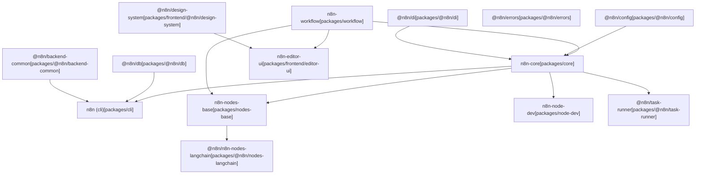
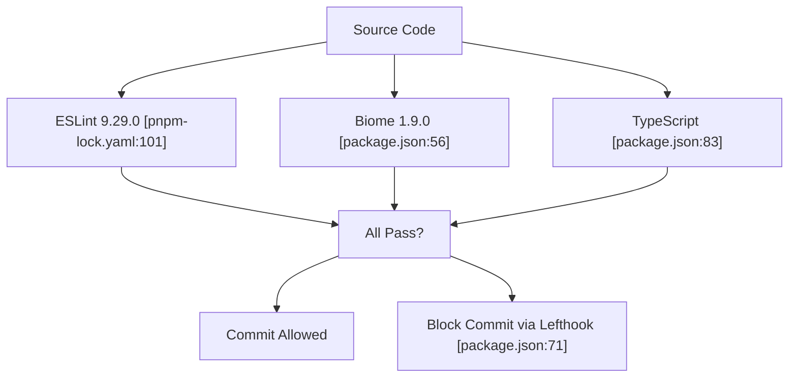

# 为 n8n 做贡献

相关源文件

-   [CHANGELOG.md](https://github.com/n8n-io/n8n/blob/88f170b9/CHANGELOG.md?plain=1)
-   [package.json](https://github.com/n8n-io/n8n/blob/88f170b9/package.json)
-   [packages/@n8n/api-types/package.json](https://github.com/n8n-io/n8n/blob/88f170b9/packages/@n8n/api-types/package.json)
-   [packages/@n8n/backend-common/src/modules/__tests__/module-registry.test.ts](https://github.com/n8n-io/n8n/blob/88f170b9/packages/@n8n/backend-common/src/modules/__tests__/module-registry.test.ts)
-   [packages/@n8n/backend-common/src/modules/module-registry.ts](https://github.com/n8n-io/n8n/blob/88f170b9/packages/@n8n/backend-common/src/modules/module-registry.ts)
-   [packages/@n8n/backend-common/src/modules/modules.config.ts](https://github.com/n8n-io/n8n/blob/88f170b9/packages/@n8n/backend-common/src/modules/modules.config.ts)
-   [packages/@n8n/config/package.json](https://github.com/n8n-io/n8n/blob/88f170b9/packages/@n8n/config/package.json)
-   [packages/@n8n/decorators/src/__tests__/redactable.test.ts](https://github.com/n8n-io/n8n/blob/88f170b9/packages/@n8n/decorators/src/__tests__/redactable.test.ts)
-   [packages/@n8n/decorators/src/controller/__tests__/args.test.ts](https://github.com/n8n-io/n8n/blob/88f170b9/packages/@n8n/decorators/src/controller/__tests__/args.test.ts)
-   [packages/@n8n/decorators/src/controller/__tests__/license.test.ts](https://github.com/n8n-io/n8n/blob/88f170b9/packages/@n8n/decorators/src/controller/__tests__/license.test.ts)
-   [packages/@n8n/decorators/src/controller/__tests__/scoped.test.ts](https://github.com/n8n-io/n8n/blob/88f170b9/packages/@n8n/decorators/src/controller/__tests__/scoped.test.ts)
-   [packages/@n8n/decorators/src/execution-lifecycle/__tests__/on-lifecycle-event.test.ts](https://github.com/n8n-io/n8n/blob/88f170b9/packages/@n8n/decorators/src/execution-lifecycle/__tests__/on-lifecycle-event.test.ts)
-   [packages/@n8n/decorators/src/execution-lifecycle/index.ts](https://github.com/n8n-io/n8n/blob/88f170b9/packages/@n8n/decorators/src/execution-lifecycle/index.ts)
-   [packages/@n8n/decorators/src/execution-lifecycle/lifecycle-metadata.ts](https://github.com/n8n-io/n8n/blob/88f170b9/packages/@n8n/decorators/src/execution-lifecycle/lifecycle-metadata.ts)
-   [packages/@n8n/decorators/src/module/__tests__/module.test.ts](https://github.com/n8n-io/n8n/blob/88f170b9/packages/@n8n/decorators/src/module/__tests__/module.test.ts)
-   [packages/@n8n/decorators/src/module/index.ts](https://github.com/n8n-io/n8n/blob/88f170b9/packages/@n8n/decorators/src/module/index.ts)
-   [packages/@n8n/decorators/src/module/module-metadata.ts](https://github.com/n8n-io/n8n/blob/88f170b9/packages/@n8n/decorators/src/module/module-metadata.ts)
-   [packages/@n8n/decorators/src/module/module.ts](https://github.com/n8n-io/n8n/blob/88f170b9/packages/@n8n/decorators/src/module/module.ts)
-   [packages/@n8n/nodes-langchain/package.json](https://github.com/n8n-io/n8n/blob/88f170b9/packages/@n8n/nodes-langchain/package.json)
-   [packages/@n8n/task-runner/package.json](https://github.com/n8n-io/n8n/blob/88f170b9/packages/@n8n/task-runner/package.json)
-   [packages/cli/package.json](https://github.com/n8n-io/n8n/blob/88f170b9/packages/cli/package.json)
-   [packages/cli/src/modules/community-packages/community-packages.module.ts](https://github.com/n8n-io/n8n/blob/88f170b9/packages/cli/src/modules/community-packages/community-packages.module.ts)
-   [packages/cli/src/modules/external-secrets.ee/external-secrets.module.ts](https://github.com/n8n-io/n8n/blob/88f170b9/packages/cli/src/modules/external-secrets.ee/external-secrets.module.ts)
-   [packages/cli/src/modules/otel/README.md](https://github.com/n8n-io/n8n/blob/88f170b9/packages/cli/src/modules/otel/README.md?plain=1)
-   [packages/cli/src/modules/otel/__tests__/otel-test-provider.ts](https://github.com/n8n-io/n8n/blob/88f170b9/packages/cli/src/modules/otel/__tests__/otel-test-provider.ts)
-   [packages/cli/src/modules/otel/__tests__/otel-workflow-tracing.integration.test.ts](https://github.com/n8n-io/n8n/blob/88f170b9/packages/cli/src/modules/otel/__tests__/otel-workflow-tracing.integration.test.ts)
-   [packages/cli/src/modules/otel/__tests__/span-registry.test.ts](https://github.com/n8n-io/n8n/blob/88f170b9/packages/cli/src/modules/otel/__tests__/span-registry.test.ts)
-   [packages/cli/src/modules/otel/handlers/interfaces.ts](https://github.com/n8n-io/n8n/blob/88f170b9/packages/cli/src/modules/otel/handlers/interfaces.ts)
-   [packages/cli/src/modules/otel/handlers/workflow-end.handler.ts](https://github.com/n8n-io/n8n/blob/88f170b9/packages/cli/src/modules/otel/handlers/workflow-end.handler.ts)
-   [packages/cli/src/modules/otel/handlers/workflow-start.handler.ts](https://github.com/n8n-io/n8n/blob/88f170b9/packages/cli/src/modules/otel/handlers/workflow-start.handler.ts)
-   [packages/core/package.json](https://github.com/n8n-io/n8n/blob/88f170b9/packages/core/package.json)
-   [packages/frontend/@n8n/design-system/package.json](https://github.com/n8n-io/n8n/blob/88f170b9/packages/frontend/@n8n/design-system/package.json)
-   [packages/frontend/editor-ui/package.json](https://github.com/n8n-io/n8n/blob/88f170b9/packages/frontend/editor-ui/package.json)
-   [packages/node-dev/package.json](https://github.com/n8n-io/n8n/blob/88f170b9/packages/node-dev/package.json)
-   [packages/nodes-base/package.json](https://github.com/n8n-io/n8n/blob/88f170b9/packages/nodes-base/package.json)
-   [packages/workflow/package.json](https://github.com/n8n-io/n8n/blob/88f170b9/packages/workflow/package.json)
-   [pnpm-lock.yaml](https://github.com/n8n-io/n8n/blob/88f170b9/pnpm-lock.yaml)
-   [pnpm-workspace.yaml](https://github.com/n8n-io/n8n/blob/88f170b9/pnpm-workspace.yaml)

本指南涵盖为 n8n 做贡献所需的关键信息，包括搭建开发环境、理解代码库架构、遵循编码规范以及提交贡献。有关详细的设置说明，请参见 [开发环境设置](/n8n-io/n8n/10.1-development-environment-setup)。有关架构模式和最佳实践，请参见 [架构模式与最佳实践](/n8n-io/n8n/10.2-architecture-patterns-and-best-practices)。

## 前置条件和系统要求

n8n 需要特定版本的 Node.js 和 pnpm，以确保开发环境之间的构建一致性。

| 要求 | 版本 | 在何处指定 |
| --- | --- | --- |
| Node.js | \>= 22.16 | [package.json6](https://github.com/n8n-io/n8n/blob/88f170b9/package.json#L6-L6) |
| pnpm | \>= 10.22.0 | [package.json9](https://github.com/n8n-io/n8n/blob/88f170b9/package.json#L9-L9) |

项目通过 preinstall 钩子强制使用 pnpm，从而阻止 npm 和 yarn 安装 [package.json12](https://github.com/n8n-io/n8n/blob/88f170b9/package.json#L12-L12)。这确保所有贡献者都使用相同的包管理器，并采用一致的 lockfile 语义。

**来源：** [package.json1-12](https://github.com/n8n-io/n8n/blob/88f170b9/package.json#L1-L12) [packages/cli/package.json52-54](https://github.com/n8n-io/n8n/blob/88f170b9/packages/cli/package.json#L52-L54)

## Monorepo 结构

n8n 组织为一个 pnpm workspace monorepo，具有清晰的包边界和依赖流向。

### 包组织结构

标题：n8n 包依赖图


**工作区配置**

monorepo 在 [pnpm-workspace.yaml1-7](https://github.com/n8n-io/n8n/blob/88f170b9/pnpm-workspace.yaml#L1-L7) 中定义，包含以下工作区模式：

-   `packages/*` - 核心包，如 `cli`、`core`、`workflow`、`node-dev`
-   `packages/@n8n/*` - 带作用域的包，如 `@n8n/config`、`@n8n/di`、`@n8n/db`
-   `packages/frontend/**` - 前端包，包括 `editor-ui`、`design-system`
-   `packages/extensions/**` - 扩展包
-   `packages/testing/**` - 测试工具

**来源：** [pnpm-workspace.yaml1-7](https://github.com/n8n-io/n8n/blob/88f170b9/pnpm-workspace.yaml#L1-L7) [package.json1-84](https://github.com/n8n-io/n8n/blob/88f170b9/package.json#L1-L84) [packages/cli/package.json96-124](https://github.com/n8n-io/n8n/blob/88f170b9/packages/cli/package.json#L96-L124)

## 开发流程

### 初始设置

标题：n8n 开发生命周期

> **[Mermaid sequence]**
> *(图表结构无法解析)*

**可用脚本**

根目录 [package.json10-53](https://github.com/n8n-io/n8n/blob/88f170b9/package.json#L10-L53) 定义了以下关键命令：

| 命令 | 目的 | 详细信息 |
| --- | --- | --- |
| `pnpm install` | 安装依赖 | 运行 `prepare.mjs`，应用补丁 |
| `pnpm build` | 构建所有包 | 使用 `turbo run build` [package.json13](https://github.com/n8n-io/n8n/blob/88f170b9/package.json#L13-L13) |
| `pnpm dev` | 启动开发服务器 | 并行模式，排除特定包 [package.json22](https://github.com/n8n-io/n8n/blob/88f170b9/package.json#L22-L22) |
| `pnpm dev:be` | 仅后端开发 | 排除 `n8n-editor-ui` [package.json23](https://github.com/n8n-io/n8n/blob/88f170b9/package.json#L23-L23) |
| `pnpm dev:fe` | 仅前端开发 | 包含 `design-system` [package.json25](https://github.com/n8n-io/n8n/blob/88f170b9/package.json#L25-L25) |
| `pnpm typecheck` | 类型检查 | 运行 `turbo typecheck` [package.json21](https://github.com/n8n-io/n8n/blob/88f170b9/package.json#L21-L21) |
| `pnpm lint` | 代码检查 | 运行 `turbo run lint` [package.json32](https://github.com/n8n-io/n8n/blob/88f170b9/package.json#L32-L32) |
| `pnpm test` | 运行所有测试 | 运行 `turbo run test` [package.json41](https://github.com/n8n-io/n8n/blob/88f170b9/package.json#L41-L41) |

**构建系统**

n8n 使用 Turbo (v2.8.9) 进行构建编排 [package.json82](https://github.com/n8n-io/n8n/blob/88f170b9/package.json#L82-L82)。构建流水线包括 TypeScript 编译、通过 `tsc-alias` 进行路径别名处理，以及为节点生成元数据 [packages/nodes-base/package.json11](https://github.com/n8n-io/n8n/blob/88f170b9/packages/nodes-base/package.json#L11-L11)。

**来源：** [package.json10-84](https://github.com/n8n-io/n8n/blob/88f170b9/package.json#L10-L84) [packages/cli/package.json7-40](https://github.com/n8n-io/n8n/blob/88f170b9/packages/cli/package.json#L7-L40) [packages/nodes-base/package.json6-20](https://github.com/n8n-io/n8n/blob/88f170b9/packages/nodes-base/package.json#L6-L20)

## 代码规范与质量

### Lint 与格式化

n8n 通过多种工具强制执行代码质量：

标题：代码质量强制检查


**执行质量检查**

```
# Lint all packagespnpm lint # Fix linting issuespnpm lint:fix # Format codepnpm format # Type checkpnpm typecheck
```
**来源：** [package.json30-36](https://github.com/n8n-io/n8n/blob/88f170b9/package.json#L30-L36) [packages/cli/package.json16-19](https://github.com/n8n-io/n8n/blob/88f170b9/packages/cli/package.json#L16-L19) [pnpm-lock.yaml99-101](https://github.com/n8n-io/n8n/blob/88f170b9/pnpm-lock.yaml#L99-L101)

### 测试策略

n8n 采用分层测试方法。

**按包类型划分的测试工具**

| 包类型 | 测试运行器 | 配置 |
| --- | --- | --- |
| 后端（cli, core） | Jest 29.6.2 | `jest.config.js` [packages/cli/package.json21](https://github.com/n8n-io/n8n/blob/88f170b9/packages/cli/package.json#L21-L21) |
| 前端（editor-ui） | Vitest 3.1.3 | `vitest.config.ts` [packages/frontend/editor-ui/package.json21](https://github.com/n8n-io/n8n/blob/88f170b9/packages/frontend/editor-ui/package.json#L21-L21) |
| 工作流核心 | Vitest 3.1.3 | [packages/workflow/package.json32](https://github.com/n8n-io/n8n/blob/88f170b9/packages/workflow/package.json#L32-L32) |
| E2E 测试 | Playwright 1.58.0 | [pnpm-workspace.yaml92](https://github.com/n8n-io/n8n/blob/88f170b9/pnpm-workspace.yaml#L92-L92) |

**来源：** [packages/cli/package.json21-38](https://github.com/n8n-io/n8n/blob/88f170b9/packages/cli/package.json#L21-L38) [packages/frontend/editor-ui/package.json21-22](https://github.com/n8n-io/n8n/blob/88f170b9/packages/frontend/editor-ui/package.json#L21-L22) [packages/workflow/package.json32-34](https://github.com/n8n-io/n8n/blob/88f170b9/packages/workflow/package.json#L32-L34)

## 依赖管理

### 版本目录

n8n 使用 [pnpm-workspace.yaml8-128](https://github.com/n8n-io/n8n/blob/88f170b9/pnpm-workspace.yaml#L8-L128) 中的 pnpm catalog 来确保依赖版本一致。

**Catalog 示例：**

-   `default`：核心库，如 `lodash` (4.17.23) 和 `zod` (3.25.67)。
-   `frontend`：Vue 生态，包括 `vue` (^3.5.13) 和 `pinia` (^2.2.4)。
-   `sentry`：统一的 sentry SDK 版本 (^10.36.0)。

### 已打补丁的依赖

n8n 在 `patches/` 目录中维护第三方依赖的补丁，这些补丁在 [package.json157-170](https://github.com/n8n-io/n8n/blob/88f170b9/package.json#L157-L170) 中声明。这些补丁包括对 `bull`、`element-plus` 和 `vue-tsc` 的关键修复。

**来源：** [pnpm-workspace.yaml8-128](https://github.com/n8n-io/n8n/blob/88f170b9/pnpm-workspace.yaml#L8-L128) [package.json157-170](https://github.com/n8n-io/n8n/blob/88f170b9/package.json#L157-L170)

## 贡献流程

### Pull Request 工作流

1.  **Fork 和分支**：从 `master` 创建一个功能分支。
2.  **本地验证**：在本地运行 `pnpm lint` 和 `pnpm test`。
3.  **CI 流水线**：GitHub Actions 运行一套完整的测试集合，包括：
    -   数据库矩阵测试：`test:sqlite`、`test:postgres` [packages/cli/package.json25-31](https://github.com/n8n-io/n8n/blob/88f170b9/packages/cli/package.json#L25-L31)
    -   前端验证：`test:ci:frontend` [package.json43](https://github.com/n8n-io/n8n/blob/88f170b9/package.json#L43-L43)
    -   通过 Playwright 运行 E2E 测试 [package.json48](https://github.com/n8n-io/n8n/blob/88f170b9/package.json#L48-L48)

**来源：** [package.json41-49](https://github.com/n8n-io/n8n/blob/88f170b9/package.json#L41-L49) [packages/cli/package.json21-38](https://github.com/n8n-io/n8n/blob/88f170b9/packages/cli/package.json#L21-L38)

## 按包开发

### 节点开发

在创建自定义节点时，项目提供了专用工具。

-   **n8n-node-dev**：用于简化节点开发的 CLI [packages/node-dev/package.json4](https://github.com/n8n-io/n8n/blob/88f170b9/packages/node-dev/package.json#L4-L4)
-   **nodes-base**：包含 500+ 标准节点的主包 [packages/nodes-base/package.json4](https://github.com/n8n-io/n8n/blob/88f170b9/packages/nodes-base/package.json#L4-L4)
-   **n8n-nodes-langchain**：用于 AI 和 LangChain 集成的包 [packages/@n8n/nodes-langchain/package.json2](https://github.com/n8n-io/n8n/blob/88f170b9/packages/@n8n/nodes-langchain/package.json#L2-L2)

**来源：** [packages/node-dev/package.json1-54](https://github.com/n8n-io/n8n/blob/88f170b9/packages/node-dev/package.json#L1-L54) [packages/nodes-base/package.json1-136](https://github.com/n8n-io/n8n/blob/88f170b9/packages/nodes-base/package.json#L1-L136) [packages/@n8n/nodes-langchain/package.json1-140](https://github.com/n8n-io/n8n/blob/88f170b9/packages/@n8n/nodes-langchain/package.json#L1-L140)

### 前端开发

前端（`editor-ui`）使用 Vue 3 和 Vite。

```
# Start frontend dev serverpnpm dev:fe # Run frontend testspnpm --filter n8n-editor-ui test
```
**来源：** [package.json25](https://github.com/n8n-io/n8n/blob/88f170b9/package.json#L25-L25) [packages/frontend/editor-ui/package.json1-23](https://github.com/n8n-io/n8n/blob/88f170b9/packages/frontend/editor-ui/package.json#L1-L23)

## 应遵循的架构模式

在贡献时，请遵循以下核心模式：

1.  **依赖注入**：使用 `@n8n/di` 进行服务管理 [packages/cli/package.json114](https://github.com/n8n-io/n8n/blob/88f170b9/packages/cli/package.json#L114-L114)
2.  **配置**：使用 `@n8n/config` 管理环境感知的设置 [packages/cli/package.json110](https://github.com/n8n-io/n8n/blob/88f170b9/packages/cli/package.json#L110-L110)
3.  **模块系统**：后端功能应使用 `@n8n/decorators` 包组织为模块 [packages/cli/package.json113](https://github.com/n8n-io/n8n/blob/88f170b9/packages/cli/package.json#L113-L113)

如需深入了解这些模式，请参见 [架构模式与最佳实践](/n8n-io/n8n/10.2-architecture-patterns-and-best-practices)。

---

本指南为 n8n 做贡献奠定了基础。有关详细的环境设置，请参见 [开发环境设置](/n8n-io/n8n/10.1-development-environment-setup)。有关架构模式和服务层设计，请参见 [架构模式与最佳实践](/n8n-io/n8n/10.2-architecture-patterns-and-best-practices)。
