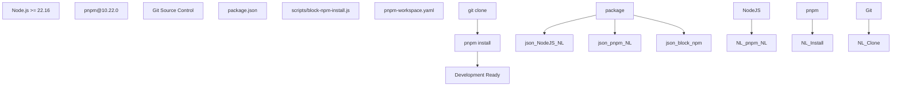
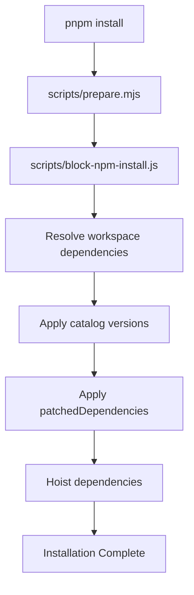
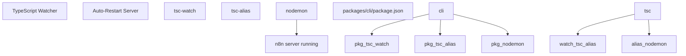
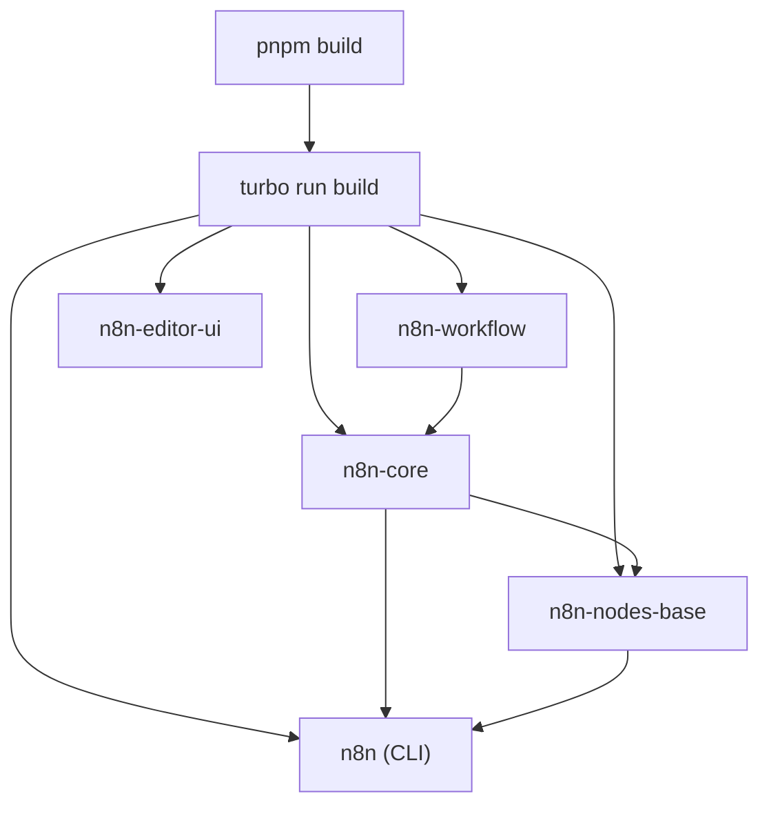

# 开发环境设置

相关源文件

-   [CHANGELOG.md](https://github.com/n8n-io/n8n/blob/88f170b9/CHANGELOG.md?plain=1)
-   [codecov.yml](https://github.com/n8n-io/n8n/blob/88f170b9/codecov.yml)
-   [jest.config.js](https://github.com/n8n-io/n8n/blob/88f170b9/jest.config.js)
-   [package.json](https://github.com/n8n-io/n8n/blob/88f170b9/package.json)
-   [packages/@n8n/api-types/package.json](https://github.com/n8n-io/n8n/blob/88f170b9/packages/@n8n/api-types/package.json)
-   [packages/@n8n/client-oauth2/tsconfig.build.json](https://github.com/n8n-io/n8n/blob/88f170b9/packages/@n8n/client-oauth2/tsconfig.build.json)
-   [packages/@n8n/config/package.json](https://github.com/n8n-io/n8n/blob/88f170b9/packages/@n8n/config/package.json)
-   [packages/@n8n/expression-runtime/tsconfig.build.cjs.json](https://github.com/n8n-io/n8n/blob/88f170b9/packages/@n8n/expression-runtime/tsconfig.build.cjs.json)
-   [packages/@n8n/expression-runtime/tsconfig.build.esm.json](https://github.com/n8n-io/n8n/blob/88f170b9/packages/@n8n/expression-runtime/tsconfig.build.esm.json)
-   [packages/@n8n/nodes-langchain/package.json](https://github.com/n8n-io/n8n/blob/88f170b9/packages/@n8n/nodes-langchain/package.json)
-   [packages/@n8n/nodes-langchain/tsconfig.build.json](https://github.com/n8n-io/n8n/blob/88f170b9/packages/@n8n/nodes-langchain/tsconfig.build.json)
-   [packages/@n8n/nodes-langchain/tsconfig.json](https://github.com/n8n-io/n8n/blob/88f170b9/packages/@n8n/nodes-langchain/tsconfig.json)
-   [packages/@n8n/task-runner/package.json](https://github.com/n8n-io/n8n/blob/88f170b9/packages/@n8n/task-runner/package.json)
-   [packages/cli/package.json](https://github.com/n8n-io/n8n/blob/88f170b9/packages/cli/package.json)
-   [packages/cli/tsconfig.build.json](https://github.com/n8n-io/n8n/blob/88f170b9/packages/cli/tsconfig.build.json)
-   [packages/cli/tsconfig.json](https://github.com/n8n-io/n8n/blob/88f170b9/packages/cli/tsconfig.json)
-   [packages/core/package.json](https://github.com/n8n-io/n8n/blob/88f170b9/packages/core/package.json)
-   [packages/core/tsconfig.build.json](https://github.com/n8n-io/n8n/blob/88f170b9/packages/core/tsconfig.build.json)
-   [packages/core/tsconfig.json](https://github.com/n8n-io/n8n/blob/88f170b9/packages/core/tsconfig.json)
-   [packages/frontend/@n8n/design-system/package.json](https://github.com/n8n-io/n8n/blob/88f170b9/packages/frontend/@n8n/design-system/package.json)
-   [packages/frontend/@n8n/stores/src/__tests__/metaTagConfig.test.ts](https://github.com/n8n-io/n8n/blob/88f170b9/packages/frontend/@n8n/stores/src/__tests__/metaTagConfig.test.ts)
-   [packages/frontend/@n8n/stores/src/metaTagConfig.ts](https://github.com/n8n-io/n8n/blob/88f170b9/packages/frontend/@n8n/stores/src/metaTagConfig.ts)
-   [packages/frontend/editor-ui/index.html](https://github.com/n8n-io/n8n/blob/88f170b9/packages/frontend/editor-ui/index.html)
-   [packages/frontend/editor-ui/package.json](https://github.com/n8n-io/n8n/blob/88f170b9/packages/frontend/editor-ui/package.json)
-   [packages/frontend/editor-ui/public/static/posthog.init.js](https://github.com/n8n-io/n8n/blob/88f170b9/packages/frontend/editor-ui/public/static/posthog.init.js)
-   [packages/frontend/editor-ui/public/static/prefers-color-scheme.css](https://github.com/n8n-io/n8n/blob/88f170b9/packages/frontend/editor-ui/public/static/prefers-color-scheme.css)
-   [packages/frontend/editor-ui/tsconfig.json](https://github.com/n8n-io/n8n/blob/88f170b9/packages/frontend/editor-ui/tsconfig.json)
-   [packages/frontend/editor-ui/vite.config.mts](https://github.com/n8n-io/n8n/blob/88f170b9/packages/frontend/editor-ui/vite.config.mts)
-   [packages/node-dev/package.json](https://github.com/n8n-io/n8n/blob/88f170b9/packages/node-dev/package.json)
-   [packages/node-dev/tsconfig.json](https://github.com/n8n-io/n8n/blob/88f170b9/packages/node-dev/tsconfig.json)
-   [packages/nodes-base/package.json](https://github.com/n8n-io/n8n/blob/88f170b9/packages/nodes-base/package.json)
-   [packages/nodes-base/tsconfig.json](https://github.com/n8n-io/n8n/blob/88f170b9/packages/nodes-base/tsconfig.json)
-   [packages/workflow/package.json](https://github.com/n8n-io/n8n/blob/88f170b9/packages/workflow/package.json)
-   [packages/workflow/test/expression-vm-errors.test.ts](https://github.com/n8n-io/n8n/blob/88f170b9/packages/workflow/test/expression-vm-errors.test.ts)
-   [packages/workflow/test/setup-vm-evaluator.ts](https://github.com/n8n-io/n8n/blob/88f170b9/packages/workflow/test/setup-vm-evaluator.ts)
-   [packages/workflow/tsconfig.json](https://github.com/n8n-io/n8n/blob/88f170b9/packages/workflow/tsconfig.json)
-   [pnpm-lock.yaml](https://github.com/n8n-io/n8n/blob/88f170b9/pnpm-lock.yaml)
-   [pnpm-workspace.yaml](https://github.com/n8n-io/n8n/blob/88f170b9/pnpm-workspace.yaml)
-   [tsconfig.json](https://github.com/n8n-io/n8n/blob/88f170b9/tsconfig.json)
-   [turbo.json](https://github.com/n8n-io/n8n/blob/88f170b9/turbo.json)

本文档介绍 n8n 代码库的前置条件、安装以及本地开发流程。它说明如何搭建开发环境、理解 monorepo 结构，以及使用用于构建、运行和测试应用程序的主要开发命令。

有关部署和 Docker 配置的信息，请参见 [Docker 部署](/n8n-io/n8n/7.3-docker-deployment)。有关 CI/CD 流水线和发布流程，请参见 [CI 工作流与 Pull Request 验证](/n8n-io/n8n/9.2-ci-workflows-and-pull-request-validation)。

---

## 前置条件

n8n 需要根 `package.json` 中定义的特定版本 Node.js 和 pnpm：[package.json5-9](https://github.com/n8n-io/n8n/blob/88f170b9/package.json#L5-L9)

| 工具 | 最低版本 | 目的 |
| --- | --- | --- |
| **Node.js** | `>=22.16` | JavaScript 运行时 [package.json6](https://github.com/n8n-io/n8n/blob/88f170b9/package.json#L6-L6) |
| **pnpm** | `>=10.22.0` | 包管理器（已强制） [package.json7](https://github.com/n8n-io/n8n/blob/88f170b9/package.json#L7-L7) |

包管理器通过 `packageManager` 字段固定为 `pnpm@10.22.0` [package.json9](https://github.com/n8n-io/n8n/blob/88f170b9/package.json#L9-L9)。`npm` 和 `yarn` 会被 `scripts/block-npm-install.js` 明确阻止 [package.json12](https://github.com/n8n-io/n8n/blob/88f170b9/package.json#L12-L12)，该脚本作为 `preinstall` 钩子运行。

**开发前置条件图**


**来源：** [package.json5-9](https://github.com/n8n-io/n8n/blob/88f170b9/package.json#L5-L9) [package.json12](https://github.com/n8n-io/n8n/blob/88f170b9/package.json#L12-L12) [pnpm-workspace.yaml1-8](https://github.com/n8n-io/n8n/blob/88f170b9/pnpm-workspace.yaml#L1-L8)

---

## 安装

### 克隆并安装

```
# Clone the repositorygit clone https://github.com/n8n-io/n8n.gitcd n8n # Install dependenciespnpm install
```
安装过程如下：

1.  执行 `scripts/prepare.mjs` 钩子 [package.json11](https://github.com/n8n-io/n8n/blob/88f170b9/package.json#L11-L11)
2.  通过 `scripts/block-npm-install.js` 阻止非 pnpm 包管理器 [package.json12](https://github.com/n8n-io/n8n/blob/88f170b9/package.json#L12-L12)
3.  为 `pnpm-workspace.yaml` 中定义的所有工作区包安装依赖 [pnpm-workspace.yaml1-6](https://github.com/n8n-io/n8n/blob/88f170b9/pnpm-workspace.yaml#L1-L6)
4.  应用根 `package.json` 中 `patchedDependencies` 部分的补丁 [package.json157-170](https://github.com/n8n-io/n8n/blob/88f170b9/package.json#L157-L170)

**依赖安装流程**


**来源：** [package.json11-12](https://github.com/n8n-io/n8n/blob/88f170b9/package.json#L11-L12) [pnpm-workspace.yaml1-6](https://github.com/n8n-io/n8n/blob/88f170b9/pnpm-workspace.yaml#L1-L6) [package.json157-170](https://github.com/n8n-io/n8n/blob/88f170b9/package.json#L157-L170)

---

## Monorepo 结构

n8n 使用 pnpm workspace monorepo，包分布在 `pnpm-workspace.yaml` [pnpm-workspace.yaml1-6](https://github.com/n8n-io/n8n/blob/88f170b9/pnpm-workspace.yaml#L1-L6) 中定义的多个目录中：

```
packages:  - packages/*  - packages/@n8n/*  - packages/frontend/**  - packages/extensions/**  - packages/testing/**
```
### 版本目录系统

工作区使用 **版本目录** 系统进行集中式依赖管理 [pnpm-workspace.yaml8-86](https://github.com/n8n-io/n8n/blob/88f170b9/pnpm-workspace.yaml#L8-L86)。包通过 `catalog:` 前缀引用版本目录中的版本。例如，`packages/cli/package.json` 通过 `catalog:` 引用了 `@types/express` [packages/cli/package.json69](https://github.com/n8n-io/n8n/blob/88f170b9/packages/cli/package.json#L69-L69)

| 版本目录 | 作用 | 示例包 |
| --- | --- | --- |
| `default` | 核心依赖 | `lodash`, `axios`, `zod` [pnpm-workspace.yaml43-85](https://github.com/n8n-io/n8n/blob/88f170b9/pnpm-workspace.yaml#L43-L85) |
| `frontend` | Vue/UI 依赖 | `vue`, `pinia`, `element-plus` [pnpm-workspace.yaml96-114](https://github.com/n8n-io/n8n/blob/88f170b9/pnpm-workspace.yaml#L96-L114) |
| `e2e` | Playwright 测试 | `@playwright/test` [pnpm-workspace.yaml89-95](https://github.com/n8n-io/n8n/blob/88f170b9/pnpm-workspace.yaml#L89-L95) |
| `sentry` | 错误监控 | `@sentry/node` [pnpm-workspace.yaml115-118](https://github.com/n8n-io/n8n/blob/88f170b9/pnpm-workspace.yaml#L115-L118) |
| `storybook` | 组件开发 | `storybook` [pnpm-workspace.yaml119-127](https://github.com/n8n-io/n8n/blob/88f170b9/pnpm-workspace.yaml#L119-L127) |

**来源：** [pnpm-workspace.yaml8-127](https://github.com/n8n-io/n8n/blob/88f170b9/pnpm-workspace.yaml#L8-L127) [packages/cli/package.json69](https://github.com/n8n-io/n8n/blob/88f170b9/packages/cli/package.json#L69-L69) [packages/cli/package.json120](https://github.com/n8n-io/n8n/blob/88f170b9/packages/cli/package.json#L120-L120)

### 关键包位置

| 包 | 路径 | 作用 |
| --- | --- | --- |
| `n8n` (CLI) | `packages/cli/` | 主应用服务器 [packages/cli/package.json2](https://github.com/n8n-io/n8n/blob/88f170b9/packages/cli/package.json#L2-L2) |
| `n8n-core` | `packages/core/` | 工作流执行引擎 [packages/core/package.json2](https://github.com/n8n-io/n8n/blob/88f170b9/packages/core/package.json#L2-L2) |
| `n8n-workflow` | `packages/workflow/` | 核心工作流抽象 [packages/workflow/package.json2](https://github.com/n8n-io/n8n/blob/88f170b9/packages/workflow/package.json#L2-L2) |
| `n8n-nodes-base` | `packages/nodes-base/` | 500+ 内置节点 [packages/nodes-base/package.json2](https://github.com/n8n-io/n8n/blob/88f170b9/packages/nodes-base/package.json#L2-L2) |
| `@n8n/n8n-nodes-langchain` | `packages/@n8n/nodes-langchain/` | AI/LLM 节点 [packages/@n8n/nodes-langchain/package.json2](https://github.com/n8n-io/n8n/blob/88f170b9/packages/@n8n/nodes-langchain/package.json#L2-L2) |
| `n8n-editor-ui` | `packages/frontend/editor-ui/` | Vue 3 前端 [packages/frontend/editor-ui/package.json2](https://github.com/n8n-io/n8n/blob/88f170b9/packages/frontend/editor-ui/package.json#L2-L2) |
| `@n8n/design-system` | `packages/frontend/@n8n/design-system/` | UI 组件 |
| `@n8n/config` | `packages/@n8n/config/` | 配置系统 |
| `@n8n/task-runner` | `packages/@n8n/task-runner/` | 沙箱化执行 [packages/@n8n/task-runner/package.json2](https://github.com/n8n-io/n8n/blob/88f170b9/packages/@n8n/task-runner/package.json#L2-L2) |

**来源：** [pnpm-workspace.yaml1-6](https://github.com/n8n-io/n8n/blob/88f170b9/pnpm-workspace.yaml#L1-L6) [packages/cli/package.json2](https://github.com/n8n-io/n8n/blob/88f170b9/packages/cli/package.json#L2-L2) [packages/core/package.json2](https://github.com/n8n-io/n8n/blob/88f170b9/packages/core/package.json#L2-L2) [packages/workflow/package.json2](https://github.com/n8n-io/n8n/blob/88f170b9/packages/workflow/package.json#L2-L2)

---

## 开发命令

### 启动开发服务器

主要开发命令使用 Turbo 以 watch 模式启动所有包：

```
# Start all packages in development modepnpm dev
```
该命令在根 `package.json` [package.json22](https://github.com/n8n-io/n8n/blob/88f170b9/package.json#L22-L22) 中定义，并使用 Turbo 过滤器排除以下较重的包：

```
turbo run dev --parallel --env-mode=loose --filter=!@n8n/design-system --filter=!@n8n/chat --filter=!@n8n/task-runner
```
**开发模式变体**

| 命令 | 过滤条件 | 使用场景 |
| --- | --- | --- |
| `pnpm dev` | 大多数包 | 全栈开发 [package.json22](https://github.com/n8n-io/n8n/blob/88f170b9/package.json#L22-L22) |
| `pnpm dev:be` | 仅后端 | API/后端开发（排除 `n8n-editor-ui`） [package.json23](https://github.com/n8n-io/n8n/blob/88f170b9/package.json#L23-L23) |
| `pnpm dev:fe` | 仅前端 | UI 开发 [package.json25-26](https://github.com/n8n-io/n8n/blob/88f170b9/package.json#L25-L26) |
| `pnpm dev:ai` | AI 侧重点 | LangChain 节点 + 核心 [package.json24](https://github.com/n8n-io/n8n/blob/88f170b9/package.json#L24-L24) |

**来源：** [package.json22-26](https://github.com/n8n-io/n8n/blob/88f170b9/package.json#L22-L26)

### CLI 开发工作流

在开发主 n8n 应用程序（`packages/cli`）时，该包提供了特定脚本 [packages/cli/package.json13-15](https://github.com/n8n-io/n8n/blob/88f170b9/packages/cli/package.json#L13-L15)：

```
# Watch TypeScript and auto-restart servercd packages/clipnpm dev
```
`packages/cli` 中的 `dev` 命令使用 `concurrently` 同时运行 TypeScript 编译和 `nodemon` [packages/cli/package.json13](https://github.com/n8n-io/n8n/blob/88f170b9/packages/cli/package.json#L13-L13)：

```
"dev": "concurrently -k -n \"TypeScript,Node\" -c \"yellow.bold,cyan.bold\" \"npm run watch\" \"nodemon --delay 1\""
```
`watch` 命令使用 `tsc-watch` 在编译完成后触发 `tsc-alias` [packages/cli/package.json39](https://github.com/n8n-io/n8n/blob/88f170b9/packages/cli/package.json#L39-L39)。

**CLI 开发流程**


**来源：** [packages/cli/package.json13](https://github.com/n8n-io/n8n/blob/88f170b9/packages/cli/package.json#L13-L13) [packages/cli/package.json39](https://github.com/n8n-io/n8n/blob/88f170b9/packages/cli/package.json#L39-L39)

### 前端开发

editor UI 在独立的 Vite 开发服务器上运行 [packages/frontend/editor-ui/package.json20](https://github.com/n8n-io/n8n/blob/88f170b9/packages/frontend/editor-ui/package.json#L20-L20)：

```
cd packages/frontend/editor-uipnpm serve# Runs on http://localhost:8080# API proxy to http://localhost:5678
```
`serve` 脚本使用 `VUE_APP_URL_BASE_API` 将前端的 API 请求代理到后端 [packages/frontend/editor-ui/package.json20](https://github.com/n8n-io/n8n/blob/88f170b9/packages/frontend/editor-ui/package.json#L20-L20)。

---

## 构建系统

### Turbo 编排

n8n 使用 **Turbo** 进行 monorepo 任务编排 [package.json82](https://github.com/n8n-io/n8n/blob/88f170b9/package.json#L82-L82)。构建任务通过以下方式协调：

```
# Build all packages in dependency orderpnpm build
```
根 `build` 命令执行 `turbo run build` [package.json13](https://github.com/n8n-io/n8n/blob/88f170b9/package.json#L13-L13)。对于专用构建，使用 `scripts/build-n8n.mjs` [package.json14](https://github.com/n8n-io/n8n/blob/88f170b9/package.json#L14-L14)。

**构建编排流程**


**来源：** [package.json13-14](https://github.com/n8n-io/n8n/blob/88f170b9/package.json#L13-L14) [package.json82](https://github.com/n8n-io/n8n/blob/88f170b9/package.json#L82-L82)

### TypeScript 编译

大多数包使用标准 TypeScript 编译，并进行路径别名解析：

| 包 | 构建命令 | 输出 |
| --- | --- | --- |
| `n8n-workflow` | `tsc --build tsconfig.build.esm.json tsconfig.build.cjs.json` [packages/workflow/package.json26](https://github.com/n8n-io/n8n/blob/88f170b9/packages/workflow/package.json#L26-L26) | 双 ESM/CJS |
| `n8n-core` | `tsc -p tsconfig.build.json && tsc-alias` [packages/core/package.json16](https://github.com/n8n-io/n8n/blob/88f170b9/packages/core/package.json#L16-L16) | 带别名的 CJS |
| `n8n` (CLI) | `tsc -p tsconfig.build.json && tsc-alias && pnpm build:data` [packages/cli/package.json10](https://github.com/n8n-io/n8n/blob/88f170b9/packages/cli/package.json#L10-L10) | 服务器产物 |
| `n8n-nodes-base` | `tsc --build ... && pnpm copy-nodes-json ...` [packages/nodes-base/package.json11](https://github.com/n8n-io/n8n/blob/88f170b9/packages/nodes-base/package.json#L11-L11) | 节点和元数据 |

**来源：** [packages/workflow/package.json26](https://github.com/n8n-io/n8n/blob/88f170b9/packages/workflow/package.json#L26-L26) [packages/core/package.json16](https://github.com/n8n-io/n8n/blob/88f170b9/packages/core/package.json#L16-L16) [packages/cli/package.json10](https://github.com/n8n-io/n8n/blob/88f170b9/packages/cli/package.json#L10-L10) [packages/nodes-base/package.json11](https://github.com/n8n-io/n8n/blob/88f170b9/packages/nodes-base/package.json#L11-L11)

---

## 测试

### 测试命令

根 `package.json` 提供统一的测试命令 [package.json41-47](https://github.com/n8n-io/n8n/blob/88f170b9/package.json#L41-L47)：

| 命令 | 范围 | 配置 |
| --- | --- | --- |
| `pnpm test` | 所有包 | `turbo run test` [package.json41](https://github.com/n8n-io/n8n/blob/88f170b9/package.json#L41-L41) |
| `pnpm test:ci` | CI 模式 | 并发数=1 [package.json42](https://github.com/n8n-io/n8n/blob/88f170b9/package.json#L42-L42) |
| `pnpm test:ci:frontend` | 仅前端 | 过滤：`./packages/frontend/**` [package.json43](https://github.com/n8n-io/n8n/blob/88f170b9/package.json#L43-L43) |
| `pnpm test:ci:backend` | 仅后端 | 排除前端 [package.json44](https://github.com/n8n-io/n8n/blob/88f170b9/package.json#L44-L44) |

### CLI 测试数据库矩阵

CLI 包支持针对多个数据库进行测试 [packages/cli/package.json21-37](https://github.com/n8n-io/n8n/blob/88f170b9/packages/cli/package.json#L21-L37)：

```
# SQLite (default)pnpm test:sqlite # PostgreSQLpnpm test:postgres # PostgreSQL with testcontainerspnpm test:postgres:tc
```
所有测试命令都会设置诸如 `DB_TYPE=sqlite` 或 `DB_TYPE=postgresdb` 的环境变量 [packages/cli/package.json21-30](https://github.com/n8n-io/n8n/blob/88f170b9/packages/cli/package.json#L21-L30)。

**来源：** [package.json41-47](https://github.com/n8n-io/n8n/blob/88f170b9/package.json#L41-L47) [packages/cli/package.json21-37](https://github.com/n8n-io/n8n/blob/88f170b9/packages/cli/package.json#L21-L37)

---

## 故障排查

### 常见问题

**问题：pnpm install 被阻止**

-   **错误：** `Use "pnpm install" instead`
-   **原因：** 根 `package.json` 包含一个运行 `scripts/block-npm-install.js` 的 `preinstall` 钩子 [package.json12](https://github.com/n8n-io/n8n/blob/88f170b9/package.json#L12-L12)
-   **解决方案：** 所有依赖管理都只使用 `pnpm`。

**问题：引擎兼容性错误**

-   **错误：** `The engine "node" is incompatible with this module`
-   **原因：** 最低 Node.js 版本为 `>=22.16` [package.json6](https://github.com/n8n-io/n8n/blob/88f170b9/package.json#L6-L6)
-   **解决方案：** 使用 `nvm` 或你偏好的管理器升级 Node.js。

**问题：原生模块构建失败**

-   **原因：** 某些依赖，如 `isolated-vm` 和 `sqlite3`，需要原生编译 [package.json87-90](https://github.com/n8n-io/n8n/blob/88f170b9/package.json#L87-L90)
-   **解决方案：** 确保主机上已安装构建工具（Python、C++ 编译器）。

**来源：** [package.json6](https://github.com/n8n-io/n8n/blob/88f170b9/package.json#L6-L6) [package.json12](https://github.com/n8n-io/n8n/blob/88f170b9/package.json#L12-L12) [package.json87-90](https://github.com/n8n-io/n8n/blob/88f170b9/package.json#L87-L90)
