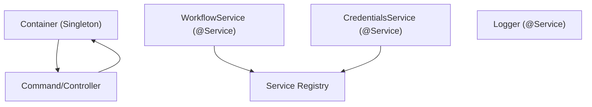
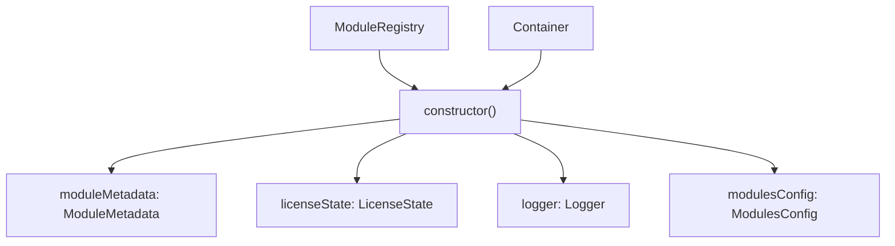
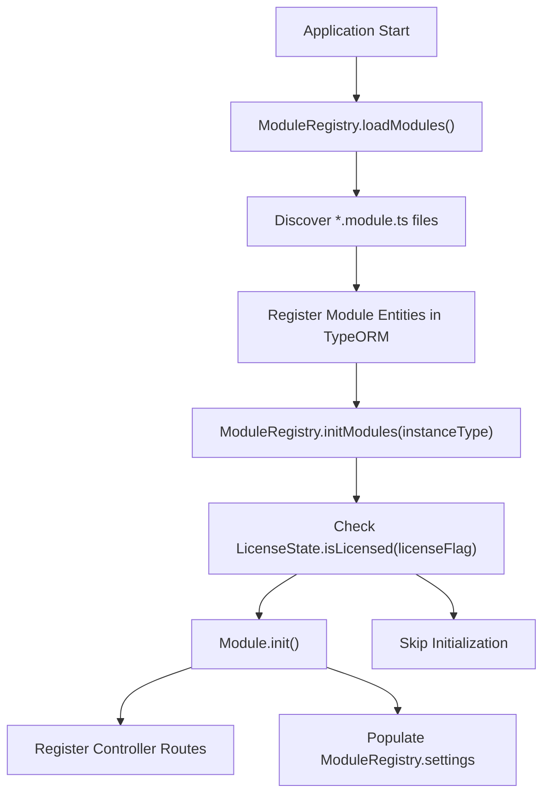
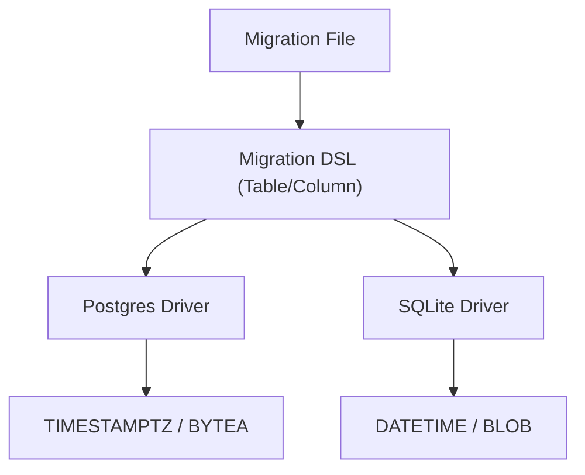

# 架构模式与最佳实践

相关源文件

-   [packages/@n8n/api-types/src/dto/secrets-provider/create-secrets-provider-connection.dto.ts](https://github.com/n8n-io/n8n/blob/88f170b9/packages/@n8n/api-types/src/dto/secrets-provider/create-secrets-provider-connection.dto.ts)
-   [packages/@n8n/backend-common/src/modules/__tests__/module-registry.test.ts](https://github.com/n8n-io/n8n/blob/88f170b9/packages/@n8n/backend-common/src/modules/__tests__/module-registry.test.ts)
-   [packages/@n8n/backend-common/src/modules/module-registry.ts](https://github.com/n8n-io/n8n/blob/88f170b9/packages/@n8n/backend-common/src/modules/module-registry.ts)
-   [packages/@n8n/backend-common/src/modules/modules.config.ts](https://github.com/n8n-io/n8n/blob/88f170b9/packages/@n8n/backend-common/src/modules/modules.config.ts)
-   [packages/@n8n/db/src/entities/index.ts](https://github.com/n8n-io/n8n/blob/88f170b9/packages/@n8n/db/src/entities/index.ts)
-   [packages/@n8n/db/src/entities/project-secrets-provider-access.ts](https://github.com/n8n-io/n8n/blob/88f170b9/packages/@n8n/db/src/entities/project-secrets-provider-access.ts)
-   [packages/@n8n/db/src/entities/project.ts](https://github.com/n8n-io/n8n/blob/88f170b9/packages/@n8n/db/src/entities/project.ts)
-   [packages/@n8n/db/src/entities/role-mapping-rule.ts](https://github.com/n8n-io/n8n/blob/88f170b9/packages/@n8n/db/src/entities/role-mapping-rule.ts)
-   [packages/@n8n/db/src/entities/role.ts](https://github.com/n8n-io/n8n/blob/88f170b9/packages/@n8n/db/src/entities/role.ts)
-   [packages/@n8n/db/src/entities/secrets-provider-connection.ts](https://github.com/n8n-io/n8n/blob/88f170b9/packages/@n8n/db/src/entities/secrets-provider-connection.ts)
-   [packages/@n8n/db/src/entities/workflow-publish-history.ts](https://github.com/n8n-io/n8n/blob/88f170b9/packages/@n8n/db/src/entities/workflow-publish-history.ts)
-   [packages/@n8n/db/src/migrations/common/1763716655000-CreateBinaryDataTable.ts](https://github.com/n8n-io/n8n/blob/88f170b9/packages/@n8n/db/src/migrations/common/1763716655000-CreateBinaryDataTable.ts)
-   [packages/@n8n/db/src/migrations/common/1764167920585-CreateWorkflowPublishHistoryTable.ts](https://github.com/n8n-io/n8n/blob/88f170b9/packages/@n8n/db/src/migrations/common/1764167920585-CreateWorkflowPublishHistoryTable.ts)
-   [packages/@n8n/db/src/migrations/common/1765448186933-BackfillMissingWorkflowHistoryRecords.ts](https://github.com/n8n-io/n8n/blob/88f170b9/packages/@n8n/db/src/migrations/common/1765448186933-BackfillMissingWorkflowHistoryRecords.ts)
-   [packages/@n8n/db/src/migrations/common/1769000000000-AddPublishedVersionIdToWorkflowDependency.ts](https://github.com/n8n-io/n8n/blob/88f170b9/packages/@n8n/db/src/migrations/common/1769000000000-AddPublishedVersionIdToWorkflowDependency.ts)
-   [packages/@n8n/db/src/migrations/common/1772619247761-AddRoleColumnToProjectSecretsProviderAccess.ts](https://github.com/n8n-io/n8n/blob/88f170b9/packages/@n8n/db/src/migrations/common/1772619247761-AddRoleColumnToProjectSecretsProviderAccess.ts)
-   [packages/@n8n/db/src/migrations/common/1772800000000-CreateRoleMappingRuleTable.ts](https://github.com/n8n-io/n8n/blob/88f170b9/packages/@n8n/db/src/migrations/common/1772800000000-CreateRoleMappingRuleTable.ts)
-   [packages/@n8n/db/src/migrations/dsl/__tests__/enum-check.test.ts](https://github.com/n8n-io/n8n/blob/88f170b9/packages/@n8n/db/src/migrations/dsl/__tests__/enum-check.test.ts)
-   [packages/@n8n/db/src/migrations/dsl/column.ts](https://github.com/n8n-io/n8n/blob/88f170b9/packages/@n8n/db/src/migrations/dsl/column.ts)
-   [packages/@n8n/db/src/migrations/dsl/table.ts](https://github.com/n8n-io/n8n/blob/88f170b9/packages/@n8n/db/src/migrations/dsl/table.ts)
-   [packages/@n8n/db/src/migrations/postgresdb/index.ts](https://github.com/n8n-io/n8n/blob/88f170b9/packages/@n8n/db/src/migrations/postgresdb/index.ts)
-   [packages/@n8n/db/src/migrations/sqlite/index.ts](https://github.com/n8n-io/n8n/blob/88f170b9/packages/@n8n/db/src/migrations/sqlite/index.ts)
-   [packages/@n8n/decorators/src/__tests__/redactable.test.ts](https://github.com/n8n-io/n8n/blob/88f170b9/packages/@n8n/decorators/src/__tests__/redactable.test.ts)
-   [packages/@n8n/decorators/src/controller/__tests__/args.test.ts](https://github.com/n8n-io/n8n/blob/88f170b9/packages/@n8n/decorators/src/controller/__tests__/args.test.ts)
-   [packages/@n8n/decorators/src/controller/__tests__/license.test.ts](https://github.com/n8n-io/n8n/blob/88f170b9/packages/@n8n/decorators/src/controller/__tests__/license.test.ts)
-   [packages/@n8n/decorators/src/controller/__tests__/scoped.test.ts](https://github.com/n8n-io/n8n/blob/88f170b9/packages/@n8n/decorators/src/controller/__tests__/scoped.test.ts)
-   [packages/@n8n/decorators/src/execution-lifecycle/__tests__/on-lifecycle-event.test.ts](https://github.com/n8n-io/n8n/blob/88f170b9/packages/@n8n/decorators/src/execution-lifecycle/__tests__/on-lifecycle-event.test.ts)
-   [packages/@n8n/decorators/src/execution-lifecycle/index.ts](https://github.com/n8n-io/n8n/blob/88f170b9/packages/@n8n/decorators/src/execution-lifecycle/index.ts)
-   [packages/@n8n/decorators/src/execution-lifecycle/lifecycle-metadata.ts](https://github.com/n8n-io/n8n/blob/88f170b9/packages/@n8n/decorators/src/execution-lifecycle/lifecycle-metadata.ts)
-   [packages/@n8n/decorators/src/module/__tests__/module.test.ts](https://github.com/n8n-io/n8n/blob/88f170b9/packages/@n8n/decorators/src/module/__tests__/module.test.ts)
-   [packages/@n8n/decorators/src/module/index.ts](https://github.com/n8n-io/n8n/blob/88f170b9/packages/@n8n/decorators/src/module/index.ts)
-   [packages/@n8n/decorators/src/module/module-metadata.ts](https://github.com/n8n-io/n8n/blob/88f170b9/packages/@n8n/decorators/src/module/module-metadata.ts)
-   [packages/@n8n/decorators/src/module/module.ts](https://github.com/n8n-io/n8n/blob/88f170b9/packages/@n8n/decorators/src/module/module.ts)
-   [packages/cli/src/commands/db/__tests__/revert.test.ts](https://github.com/n8n-io/n8n/blob/88f170b9/packages/cli/src/commands/db/__tests__/revert.test.ts)
-   [packages/cli/src/commands/db/revert.ts](https://github.com/n8n-io/n8n/blob/88f170b9/packages/cli/src/commands/db/revert.ts)
-   [packages/cli/src/modules/community-packages/community-packages.module.ts](https://github.com/n8n-io/n8n/blob/88f170b9/packages/cli/src/modules/community-packages/community-packages.module.ts)
-   [packages/cli/src/modules/external-secrets.ee/external-secrets.module.ts](https://github.com/n8n-io/n8n/blob/88f170b9/packages/cli/src/modules/external-secrets.ee/external-secrets.module.ts)
-   [packages/cli/src/modules/otel/README.md](https://github.com/n8n-io/n8n/blob/88f170b9/packages/cli/src/modules/otel/README.md?plain=1)
-   [packages/cli/src/modules/otel/__tests__/otel-test-provider.ts](https://github.com/n8n-io/n8n/blob/88f170b9/packages/cli/src/modules/otel/__tests__/otel-test-provider.ts)
-   [packages/cli/src/modules/otel/__tests__/otel-workflow-tracing.integration.test.ts](https://github.com/n8n-io/n8n/blob/88f170b9/packages/cli/src/modules/otel/__tests__/otel-workflow-tracing.integration.test.ts)
-   [packages/cli/src/modules/otel/__tests__/span-registry.test.ts](https://github.com/n8n-io/n8n/blob/88f170b9/packages/cli/src/modules/otel/__tests__/span-registry.test.ts)
-   [packages/cli/src/modules/otel/handlers/interfaces.ts](https://github.com/n8n-io/n8n/blob/88f170b9/packages/cli/src/modules/otel/handlers/interfaces.ts)
-   [packages/cli/src/modules/otel/handlers/workflow-end.handler.ts](https://github.com/n8n-io/n8n/blob/88f170b9/packages/cli/src/modules/otel/handlers/workflow-end.handler.ts)
-   [packages/cli/src/modules/otel/handlers/workflow-start.handler.ts](https://github.com/n8n-io/n8n/blob/88f170b9/packages/cli/src/modules/otel/handlers/workflow-start.handler.ts)
-   [packages/cli/src/services/__tests__/role-cache.service.test.ts](https://github.com/n8n-io/n8n/blob/88f170b9/packages/cli/src/services/__tests__/role-cache.service.test.ts)
-   [packages/cli/test/integration/shared/db/workflow-publish-history.ts](https://github.com/n8n-io/n8n/blob/88f170b9/packages/cli/test/integration/shared/db/workflow-publish-history.ts)
-   [packages/cli/test/migration/1772619247761-add-role-column-to-project-secrets-provider-access.test.ts](https://github.com/n8n-io/n8n/blob/88f170b9/packages/cli/test/migration/1772619247761-add-role-column-to-project-secrets-provider-access.test.ts)
-   [packages/testing/playwright/workflows/Switch_node_with_null_connection.json](https://github.com/n8n-io/n8n/blob/88f170b9/packages/testing/playwright/workflows/Switch_node_with_null_connection.json)

本文档说明 n8n 代码库中采用的架构模式：使用 `@n8n/di` 的依赖注入、用于控制器和配置的装饰器、用于数据访问的服务和仓储模式，以及后端模块系统。

## 使用 `@n8n/di` 进行依赖注入

n8n 使用 `@n8n/di` 包进行依赖注入，以实现组件之间的松耦合并简化测试。该系统围绕 `Container` 单例和 `@Service()` 装饰器构建。

### 服务注册与解析

服务通过 `@Service()` 装饰器注册，该装饰器会自动使其可通过依赖注入容器使用。

**服务注册流程** 来源： [packages/@n8n/backend-common/src/modules/module-registry.ts4-15](https://github.com/n8n-io/n8n/blob/88f170b9/packages/@n8n/backend-common/src/modules/module-registry.ts#L4-L15) [packages/cli/src/commands/db/revert.ts5-13](https://github.com/n8n-io/n8n/blob/88f170b9/packages/cli/src/commands/db/revert.ts#L5-L13)

### 构造器注入模式

服务在构造函数中声明依赖项，容器会自动解析并注入这些依赖。这是组件相互访问的主要方式。

**ModuleRegistry 中的构造器注入** 来源： [packages/@n8n/backend-common/src/modules/module-registry.ts25-30](https://github.com/n8n-io/n8n/blob/88f170b9/packages/@n8n/backend-common/src/modules/module-registry.ts#L25-L30)

## 后端模块系统

n8n 为后端功能（如 `insights`、`external-secrets` 或 `chat-hub`）实现了模块化架构。该系统支持基于许可证和实例类型的条件加载。

### 模块定义与注册

模块使用 `@n8n/decorators` 中的 `@BackendModule` 装饰器定义。它们实现 `ModuleInterface` 以接入应用生命周期。

| 特性 | 说明 | 实现 |
| --- | --- | --- |
| **生命周期钩子** | `init()`、`shutdown()`、`commands()` | `ModuleInterface` |
| **数据实体** | 注册模块专属的 TypeORM 实体 | `entities()` 方法 |
| **设置** | 向前端提供配置 | `settings()` 方法 |
| **上下文** | 向工作流执行注入数据 | `context()` 方法 |

**模块接口定义** 来源： [packages/@n8n/decorators/src/module/module.ts35-87](https://github.com/n8n-io/n8n/blob/88f170b9/packages/@n8n/decorators/src/module/module.ts#L35-L87) [packages/@n8n/decorators/src/module/module.ts107-118](https://github.com/n8n-io/n8n/blob/88f170b9/packages/@n8n/decorators/src/module/module.ts#L107-L118)

### 模块加载过程

`ModuleRegistry` 管理所有后端模块的生命周期。它负责发现、许可证检查和初始化。

**模块初始化流程** 来源： [packages/@n8n/backend-common/src/modules/module-registry.ts76-115](https://github.com/n8n-io/n8n/blob/88f170b9/packages/@n8n/backend-common/src/modules/module-registry.ts#L76-L115) [packages/@n8n/backend-common/src/modules/module-registry.ts125-155](https://github.com/n8n-io/n8n/blob/88f170b9/packages/@n8n/backend-common/src/modules/module-registry.ts#L125-L155)

### 示例：External Secrets 模块

External Secrets 模块展示了模块如何封装其自身的控制器、管理器和设置。

来源： [packages/cli/src/modules/external-secrets.ee/external-secrets.module.ts5-51](https://github.com/n8n-io/n8n/blob/88f170b9/packages/cli/src/modules/external-secrets.ee/external-secrets.module.ts#L5-L51)

## 仓储模式与数据访问

n8n 使用 TypeORM 进行数据库交互。为保持 PostgreSQL 和 SQLite 之间的可移植性，它使用领域特定语言（DSL）处理迁移，并使用仓储模式进行数据访问。

### 数据库实体

实体代表数据库模式。核心实体定义在 `@n8n/db` 中，而模块特定实体会动态注册。

来源： [packages/@n8n/db/src/entities/index.ts93-133](https://github.com/n8n-io/n8n/blob/88f170b9/packages/@n8n/db/src/entities/index.ts#L93-L133) [packages/@n8n/db/src/entities/project.ts20-58](https://github.com/n8n-io/n8n/blob/88f170b9/packages/@n8n/db/src/entities/project.ts#L20-L58)

### 迁移 DSL

n8n 不使用原始 SQL，而是使用 `Table` 和 `Column` 抽象来确保迁移能够跨不同数据库驱动工作。

**迁移 DSL 映射** 来源： [packages/@n8n/db/src/migrations/dsl/column.ts168-216](https://github.com/n8n-io/n8n/blob/88f170b9/packages/@n8n/db/src/migrations/dsl/column.ts#L168-L216) [packages/@n8n/db/src/migrations/dsl/table.ts110-137](https://github.com/n8n-io/n8n/blob/88f170b9/packages/@n8n/db/src/migrations/dsl/table.ts#L110-L137)

## 装饰器包 (@n8n/decorators)

`@n8n/decorators` 包提供了一组自定义装饰器，用于支撑 n8n 这种元数据密集型架构。

### 关键装饰器

| 装饰器 | 目标 | 用途 |
| --- | --- | --- |
| `@BackendModule` | 类 | 以名称、许可证标志和实例类型注册后端模块。 |
| `@Command` | 类 | 注册 CLI 命令（例如 `db:revert`）。 |
| `@OnShutdown` | 方法 | 标记在模块关闭期间调用的方法。 |
| `@RestController` | 类 | 注册具有基础路径的 Express 控制器。 |
| `@Get`, `@Post`, etc. | 方法 | 将 HTTP 动词映射到控制器方法。 |

**装饰器实现** 来源： [packages/@n8n/decorators/src/module/module.ts107-118](https://github.com/n8n-io/n8n/blob/88f170b9/packages/@n8n/decorators/src/module/module.ts#L107-L118) [packages/cli/src/commands/db/revert.ts62-66](https://github.com/n8n-io/n8n/blob/88f170b9/packages/cli/src/commands/db/revert.ts#L62-L66) [packages/cli/src/modules/external-secrets.ee/external-secrets.module.ts45-46](https://github.com/n8n-io/n8n/blob/88f170b9/packages/cli/src/modules/external-secrets.ee/external-secrets.module.ts#L45-L46)

## 代码组织原则

1.  **包分离**：核心逻辑位于 `packages/core` 和 `packages/workflow` 中，而基础设施（DB、DI、Config）被拆分到专门的 `@n8n/*` 包中。
2.  **服务-控制器分离**：控制器负责 HTTP/CLI 请求解析和响应格式化，将所有业务逻辑委托给 `@Service()` 类。
3.  **依赖反转**：高层模块不依赖底层模块；二者都依赖于通过 DI `Container` 解析的抽象（接口）。
4.  **优雅降级**：模块在初始化前检查 `LicenseState`，确保即使企业功能不可用，系统仍然可以正常运行。

来源： [packages/@n8n/backend-common/src/modules/module-registry.ts129-132](https://github.com/n8n-io/n8n/blob/88f170b9/packages/@n8n/backend-common/src/modules/module-registry.ts#L129-L132) [packages/cli/src/commands/db/revert.ts69-89](https://github.com/n8n-io/n8n/blob/88f170b9/packages/cli/src/commands/db/revert.ts#L69-L89)
