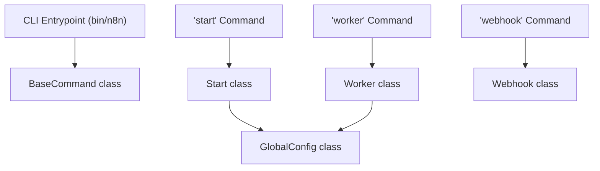

# 术语表

相关源文件

-   [CHANGELOG.md](https://github.com/n8n-io/n8n/blob/88f170b9/CHANGELOG.md?plain=1)
-   [package.json](https://github.com/n8n-io/n8n/blob/88f170b9/package.json)
-   [packages/@n8n/api-types/package.json](https://github.com/n8n-io/n8n/blob/88f170b9/packages/@n8n/api-types/package.json)
-   [packages/@n8n/api-types/src/chat-hub.ts](https://github.com/n8n-io/n8n/blob/88f170b9/packages/@n8n/api-types/src/chat-hub.ts)
-   [packages/@n8n/api-types/src/frontend-settings.ts](https://github.com/n8n-io/n8n/blob/88f170b9/packages/@n8n/api-types/src/frontend-settings.ts)
-   [packages/@n8n/api-types/src/index.ts](https://github.com/n8n-io/n8n/blob/88f170b9/packages/@n8n/api-types/src/index.ts)
-   [packages/@n8n/api-types/src/push/collaboration.ts](https://github.com/n8n-io/n8n/blob/88f170b9/packages/@n8n/api-types/src/push/collaboration.ts)
-   [packages/@n8n/backend-common/src/license-state.ts](https://github.com/n8n-io/n8n/blob/88f170b9/packages/@n8n/backend-common/src/license-state.ts)
-   [packages/@n8n/backend-common/src/modules/\_\_tests\_\_/module-registry.test.ts](https://github.com/n8n-io/n8n/blob/88f170b9/packages/@n8n/backend-common/src/modules/__tests__/module-registry.test.ts)
-   [packages/@n8n/backend-common/src/modules/module-registry.ts](https://github.com/n8n-io/n8n/blob/88f170b9/packages/@n8n/backend-common/src/modules/module-registry.ts)
-   [packages/@n8n/backend-common/src/modules/modules.config.ts](https://github.com/n8n-io/n8n/blob/88f170b9/packages/@n8n/backend-common/src/modules/modules.config.ts)
-   [packages/@n8n/config/package.json](https://github.com/n8n-io/n8n/blob/88f170b9/packages/@n8n/config/package.json)
-   [packages/@n8n/config/src/decorators.ts](https://github.com/n8n-io/n8n/blob/88f170b9/packages/@n8n/config/src/decorators.ts)
-   [packages/@n8n/config/src/index.ts](https://github.com/n8n-io/n8n/blob/88f170b9/packages/@n8n/config/src/index.ts)
-   [packages/@n8n/config/test/config.test.ts](https://github.com/n8n-io/n8n/blob/88f170b9/packages/@n8n/config/test/config.test.ts)
-   [packages/@n8n/config/test/decorators.test.ts](https://github.com/n8n-io/n8n/blob/88f170b9/packages/@n8n/config/test/decorators.test.ts)
-   [packages/@n8n/config/test/string-normalization.test.ts](https://github.com/n8n-io/n8n/blob/88f170b9/packages/@n8n/config/test/string-normalization.test.ts)
-   [packages/@n8n/constants/src/index.ts](https://github.com/n8n-io/n8n/blob/88f170b9/packages/@n8n/constants/src/index.ts)
-   [packages/@n8n/decorators/src/__tests__/redactable.test.ts](https://github.com/n8n-io/n8n/blob/88f170b9/packages/@n8n/decorators/src/__tests__/redactable.test.ts)
-   [packages/@n8n/decorators/src/controller/__tests__/args.test.ts](https://github.com/n8n-io/n8n/blob/88f170b9/packages/@n8n/decorators/src/controller/__tests__/args.test.ts)
-   [packages/@n8n/decorators/src/controller/__tests__/license.test.ts](https://github.com/n8n-io/n8n/blob/88f170b9/packages/@n8n/decorators/src/controller/__tests__/license.test.ts)
-   [packages/@n8n/decorators/src/controller/__tests__/scoped.test.ts](https://github.com/n8n-io/n8n/blob/88f170b9/packages/@n8n/decorators/src/controller/__tests__/scoped.test.ts)
-   [packages/@n8n/decorators/src/execution-lifecycle/__tests__/on-lifecycle-event.test.ts](https://github.com/n8n-io/n8n/blob/88f170b9/packages/@n8n/decorators/src/execution-lifecycle/__tests__/on-lifecycle-event.test.ts)
-   [packages/@n8n/decorators/src/execution-lifecycle/index.ts](https://github.com/n8n-io/n8n/blob/88f170b9/packages/@n8n/decorators/src/execution-lifecycle/index.ts)
-   [packages/@n8n/decorators/src/execution-lifecycle/lifecycle-metadata.ts](https://github.com/n8n-io/n8n/blob/88f170b9/packages/@n8n/decorators/src/execution-lifecycle/lifecycle-metadata.ts)
-   [packages/@n8n/decorators/src/module/__tests__/module.test.ts](https://github.com/n8n-io/n8n/blob/88f170b9/packages/@n8n/decorators/src/module/__tests__/module.test.ts)
-   [packages/@n8n/decorators/src/module/index.ts](https://github.com/n8n-io/n8n/blob/88f170b9/packages/@n8n/decorators/src/module/index.ts)
-   [packages/@n8n/decorators/src/module/module-metadata.ts](https://github.com/n8n-io/n8n/blob/88f170b9/packages/@n8n/decorators/src/module/module-metadata.ts)
-   [packages/@n8n/decorators/src/module/module.ts](https://github.com/n8n-io/n8n/blob/88f170b9/packages/@n8n/decorators/src/module/module.ts)
-   [packages/@n8n/nodes-langchain/package.json](https://github.com/n8n-io/n8n/blob/88f170b9/packages/@n8n/nodes-langchain/package.json)
-   [packages/@n8n/task-runner/package.json](https://github.com/n8n-io/n8n/blob/88f170b9/packages/@n8n/task-runner/package.json)
-   [packages/cli/package.json](https://github.com/n8n-io/n8n/blob/88f170b9/packages/cli/package.json)
-   [packages/cli/src/__tests__/license.test.ts](https://github.com/n8n-io/n8n/blob/88f170b9/packages/cli/src/__tests__/license.test.ts)
-   [packages/cli/src/commands/base-command.ts](https://github.com/n8n-io/n8n/blob/88f170b9/packages/cli/src/commands/base-command.ts)
-   [packages/cli/src/commands/start.ts](https://github.com/n8n-io/n8n/blob/88f170b9/packages/cli/src/commands/start.ts)
-   [packages/cli/src/commands/webhook.ts](https://github.com/n8n-io/n8n/blob/88f170b9/packages/cli/src/commands/webhook.ts)
-   [packages/cli/src/commands/worker.ts](https://github.com/n8n-io/n8n/blob/88f170b9/packages/cli/src/commands/worker.ts)
-   [packages/cli/src/config/index.ts](https://github.com/n8n-io/n8n/blob/88f170b9/packages/cli/src/config/index.ts)
-   [packages/cli/src/config/schema.ts](https://github.com/n8n-io/n8n/blob/88f170b9/packages/cli/src/config/schema.ts)
-   [packages/cli/src/constants.ts](https://github.com/n8n-io/n8n/blob/88f170b9/packages/cli/src/constants.ts)
-   [packages/cli/src/controllers/e2e.controller.ts](https://github.com/n8n-io/n8n/blob/88f170b9/packages/cli/src/controllers/e2e.controller.ts)
-   [packages/cli/src/errors/response-errors/locked.error.ts](https://github.com/n8n-io/n8n/blob/88f170b9/packages/cli/src/errors/response-errors/locked.error.ts)
-   [packages/cli/src/errors/response-errors/scope-forbidden.error.ts](https://github.com/n8n-io/n8n/blob/88f170b9/packages/cli/src/errors/response-errors/scope-forbidden.error.ts)
-   [packages/cli/src/executions/execution-redaction.ts](https://github.com/n8n-io/n8n/blob/88f170b9/packages/cli/src/executions/execution-redaction.ts)
-   [packages/cli/src/license.ts](https://github.com/n8n-io/n8n/blob/88f170b9/packages/cli/src/license.ts)
-   [packages/cli/src/modules/chat-hub/__tests__/chat-hub.service.integration.test.ts](https://github.com/n8n-io/n8n/blob/88f170b9/packages/cli/src/modules/chat-hub/__tests__/chat-hub.service.integration.test.ts)
-   [packages/cli/src/modules/chat-hub/chat-hub-agent.repository.ts](https://github.com/n8n-io/n8n/blob/88f170b9/packages/cli/src/modules/chat-hub/chat-hub-agent.repository.ts)
-   [packages/cli/src/modules/chat-hub/chat-hub-message.entity.ts](https://github.com/n8n-io/n8n/blob/88f170b9/packages/cli/src/modules/chat-hub/chat-hub-message.entity.ts)
-   [packages/cli/src/modules/chat-hub/chat-hub-session.entity.ts](https://github.com/n8n-io/n8n/blob/88f170b9/packages/cli/src/modules/chat-hub/chat-hub-session.entity.ts)
-   [packages/cli/src/modules/chat-hub/chat-hub-workflow.service.ts](https://github.com/n8n-io/n8n/blob/88f170b9/packages/cli/src/modules/chat-hub/chat-hub-workflow.service.ts)
-   [packages/cli/src/modules/chat-hub/chat-hub.constants.ts](https://github.com/n8n-io/n8n/blob/88f170b9/packages/cli/src/modules/chat-hub/chat-hub.constants.ts)
-   [packages/cli/src/modules/chat-hub/chat-hub.controller.ts](https://github.com/n8n-io/n8n/blob/88f170b9/packages/cli/src/modules/chat-hub/chat-hub.controller.ts)
-   [packages/cli/src/modules/chat-hub/chat-hub.service.ts](https://github.com/n8n-io/n8n/blob/88f170b9/packages/cli/src/modules/chat-hub/chat-hub.service.ts)
-   [packages/cli/src/modules/chat-hub/chat-hub.types.ts](https://github.com/n8n-io/n8n/blob/88f170b9/packages/cli/src/modules/chat-hub/chat-hub.types.ts)
-   [packages/cli/src/modules/chat-hub/chat-message.repository.ts](https://github.com/n8n-io/n8n/blob/88f170b9/packages/cli/src/modules/chat-hub/chat-message.repository.ts)
-   [packages/cli/src/modules/chat-hub/chat-session.repository.ts](https://github.com/n8n-io/n8n/blob/88f170b9/packages/cli/src/modules/chat-hub/chat-session.repository.ts)
-   [packages/cli/src/modules/chat-hub/context-limits.ts](https://github.com/n8n-io/n8n/blob/88f170b9/packages/cli/src/modules/chat-hub/context-limits.ts)
-   [packages/cli/src/modules/community-packages/community-packages.module.ts](https://github.com/n8n-io/n8n/blob/88f170b9/packages/cli/src/modules/community-packages/community-packages.module.ts)
-   [packages/cli/src/modules/external-secrets.ee/external-secrets.module.ts](https://github.com/n8n-io/n8n/blob/88f170b9/packages/cli/src/modules/external-secrets.ee/external-secrets.module.ts)
-   [packages/cli/src/modules/otel/README.md](https://github.com/n8n-io/n8n/blob/88f170b9/packages/cli/src/modules/otel/README.md?plain=1)
-   [packages/cli/src/modules/otel/__tests__/otel-test-provider.ts](https://github.com/n8n-io/n8n/blob/88f170b9/packages/cli/src/modules/otel/__tests__/otel-test-provider.ts)
-   [packages/cli/src/modules/otel/__tests__/otel-workflow-tracing.integration.test.ts](https://github.com/n8n-io/n8n/blob/88f170b9/packages/cli/src/modules/otel/__tests__/otel-workflow-tracing.integration.test.ts)
-   [packages/cli/src/modules/otel/__tests__/span-registry.test.ts](https://github.com/n8n-io/n8n/blob/88f170b9/packages/cli/src/modules/otel/__tests__/span-registry.test.ts)
-   [packages/cli/src/modules/otel/handlers/interfaces.ts](https://github.com/n8n-io/n8n/blob/88f170b9/packages/cli/src/modules/otel/handlers/interfaces.ts)
-   [packages/cli/src/modules/otel/handlers/workflow-end.handler.ts](https://github.com/n8n-io/n8n/blob/88f170b9/packages/cli/src/modules/otel/handlers/workflow-end.handler.ts)
-   [packages/cli/src/modules/otel/handlers/workflow-start.handler.ts](https://github.com/n8n-io/n8n/blob/88f170b9/packages/cli/src/modules/otel/handlers/workflow-start.handler.ts)
-   [packages/cli/src/modules/redaction/executions/__tests__/execution-redaction.service.test.ts](https://github.com/n8n-io/n8n/blob/88f170b9/packages/cli/src/modules/redaction/executions/__tests__/execution-redaction.service.test.ts)
-   [packages/cli/src/modules/redaction/executions/execution-redaction.interfaces.ts](https://github.com/n8n-io/n8n/blob/88f170b9/packages/cli/src/modules/redaction/executions/execution-redaction.interfaces.ts)
-   [packages/cli/src/modules/redaction/executions/execution-redaction.service.ts](https://github.com/n8n-io/n8n/blob/88f170b9/packages/cli/src/modules/redaction/executions/execution-redaction.service.ts)
-   [packages/cli/src/modules/redaction/executions/strategies/__tests__/full-item-redaction.strategy.test.ts](https://github.com/n8n-io/n8n/blob/88f170b9/packages/cli/src/modules/redaction/executions/strategies/__tests__/full-item-redaction.strategy.test.ts)
-   [packages/cli/src/modules/redaction/executions/strategies/__tests__/node-defined-field-redaction.strategy.test.ts](https://github.com/n8n-io/n8n/blob/88f170b9/packages/cli/src/modules/redaction/executions/strategies/__tests__/node-defined-field-redaction.strategy.test.ts)
-   [packages/cli/src/modules/redaction/executions/strategies/full-item-redaction.strategy.ts](https://github.com/n8n-io/n8n/blob/88f170b9/packages/cli/src/modules/redaction/executions/strategies/full-item-redaction.strategy.ts)
-   [packages/cli/src/modules/redaction/executions/strategies/node-defined-field-redaction.strategy.ts](https://github.com/n8n-io/n8n/blob/88f170b9/packages/cli/src/modules/redaction/executions/strategies/node-defined-field-redaction.strategy.ts)
-   [packages/cli/src/services/__tests__/frontend.service.test.ts](https://github.com/n8n-io/n8n/blob/88f170b9/packages/cli/src/services/__tests__/frontend.service.test.ts)
-   [packages/cli/src/services/frontend.service.ts](https://github.com/n8n-io/n8n/blob/88f170b9/packages/cli/src/services/frontend.service.ts)
-   [packages/cli/test/integration/commands/worker.cmd.test.ts](https://github.com/n8n-io/n8n/blob/88f170b9/packages/cli/test/integration/commands/worker.cmd.test.ts)
-   [packages/cli/test/integration/execution-redaction.test.ts](https://github.com/n8n-io/n8n/blob/88f170b9/packages/cli/test/integration/execution-redaction.test.ts)
-   [packages/core/package.json](https://github.com/n8n-io/n8n/blob/88f170b9/packages/core/package.json)
-   [packages/frontend/@n8n/design-system/package.json](https://github.com/n8n-io/n8n/blob/88f170b9/packages/frontend/@n8n/design-system/package.json)
-   [packages/frontend/@n8n/design-system/src/components/CanvasCollaborationPill/CanvasCollaborationPill.vue](https://github.com/n8n-io/n8n/blob/88f170b9/packages/frontend/@n8n/design-system/src/components/CanvasCollaborationPill/CanvasCollaborationPill.vue)
-   [packages/frontend/@n8n/design-system/src/components/N8nLogo/Logo.vue](https://github.com/n8n-io/n8n/blob/88f170b9/packages/frontend/@n8n/design-system/src/components/N8nLogo/Logo.vue)
-   [packages/frontend/@n8n/stores/src/useRootStore.ts](https://github.com/n8n-io/n8n/blob/88f170b9/packages/frontend/@n8n/stores/src/useRootStore.ts)
-   [packages/frontend/editor-ui/package.json](https://github.com/n8n-io/n8n/blob/88f170b9/packages/frontend/editor-ui/package.json)
-   [packages/frontend/editor-ui/src/__tests__/defaults.ts](https://github.com/n8n-io/n8n/blob/88f170b9/packages/frontend/editor-ui/src/__tests__/defaults.ts)
-   [packages/frontend/editor-ui/src/app/components/MainHeader/TabBar.vue](https://github.com/n8n-io/n8n/blob/88f170b9/packages/frontend/editor-ui/src/app/components/MainHeader/TabBar.vue)
-   [packages/frontend/editor-ui/src/app/stores/settings.store.test.ts](https://github.com/n8n-io/n8n/blob/88f170b9/packages/frontend/editor-ui/src/app/stores/settings.store.test.ts)
-   [packages/frontend/editor-ui/src/app/stores/settings.store.ts](https://github.com/n8n-io/n8n/blob/88f170b9/packages/frontend/editor-ui/src/app/stores/settings.store.ts)
-   [packages/frontend/editor-ui/src/features/ai/chatHub/ChatView.vue](https://github.com/n8n-io/n8n/blob/88f170b9/packages/frontend/editor-ui/src/features/ai/chatHub/ChatView.vue)
-   [packages/frontend/editor-ui/src/features/ai/chatHub/chat.api.ts](https://github.com/n8n-io/n8n/blob/88f170b9/packages/frontend/editor-ui/src/features/ai/chatHub/chat.api.ts)
-   [packages/frontend/editor-ui/src/features/ai/chatHub/chat.store.ts](https://github.com/n8n-io/n8n/blob/88f170b9/packages/frontend/editor-ui/src/features/ai/chatHub/chat.store.ts)
-   [packages/frontend/editor-ui/src/features/ai/chatHub/chat.types.ts](https://github.com/n8n-io/n8n/blob/88f170b9/packages/frontend/editor-ui/src/features/ai/chatHub/chat.types.ts)
-   [packages/frontend/editor-ui/src/features/ai/chatHub/chat.utils.ts](https://github.com/n8n-io/n8n/blob/88f170b9/packages/frontend/editor-ui/src/features/ai/chatHub/chat.utils.ts)
-   [packages/frontend/editor-ui/src/features/ai/chatHub/components/AgentEditorModal.vue](https://github.com/n8n-io/n8n/blob/88f170b9/packages/frontend/editor-ui/src/features/ai/chatHub/components/AgentEditorModal.vue)
-   [packages/frontend/editor-ui/src/features/ai/chatHub/components/ChatAgentCard.vue](https://github.com/n8n-io/n8n/blob/88f170b9/packages/frontend/editor-ui/src/features/ai/chatHub/components/ChatAgentCard.vue)
-   [packages/frontend/editor-ui/src/features/ai/chatHub/components/ChatConversationHeader.vue](https://github.com/n8n-io/n8n/blob/88f170b9/packages/frontend/editor-ui/src/features/ai/chatHub/components/ChatConversationHeader.vue)
-   [packages/frontend/editor-ui/src/features/ai/chatHub/components/ChatMessage.vue](https://github.com/n8n-io/n8n/blob/88f170b9/packages/frontend/editor-ui/src/features/ai/chatHub/components/ChatMessage.vue)
-   [packages/frontend/editor-ui/src/features/ai/chatHub/components/ChatPrompt.vue](https://github.com/n8n-io/n8n/blob/88f170b9/packages/frontend/editor-ui/src/features/ai/chatHub/components/ChatPrompt.vue)
-   [packages/frontend/editor-ui/src/features/ai/chatHub/components/ChatSessionMenuItem.vue](https://github.com/n8n-io/n8n/blob/88f170b9/packages/frontend/editor-ui/src/features/ai/chatHub/components/ChatSessionMenuItem.vue)
-   [packages/frontend/editor-ui/src/features/ai/chatHub/components/ChatSidebarContent.vue](https://github.com/n8n-io/n8n/blob/88f170b9/packages/frontend/editor-ui/src/features/ai/chatHub/components/ChatSidebarContent.vue)
-   [packages/frontend/editor-ui/src/features/ai/chatHub/components/CredentialSelectorModal.vue](https://github.com/n8n-io/n8n/blob/88f170b9/packages/frontend/editor-ui/src/features/ai/chatHub/components/CredentialSelectorModal.vue)
-   [packages/frontend/editor-ui/src/features/ai/chatHub/components/ModelSelector.vue](https://github.com/n8n-io/n8n/blob/88f170b9/packages/frontend/editor-ui/src/features/ai/chatHub/components/ModelSelector.vue)
-   [packages/frontend/editor-ui/src/features/ai/chatHub/constants.ts](https://github.com/n8n-io/n8n/blob/88f170b9/packages/frontend/editor-ui/src/features/ai/chatHub/constants.ts)
-   [packages/frontend/editor-ui/src/features/ai/chatHub/module.descriptor.ts](https://github.com/n8n-io/n8n/blob/88f170b9/packages/frontend/editor-ui/src/features/ai/chatHub/module.descriptor.ts)
-   [packages/node-dev/package.json](https://github.com/n8n-io/n8n/blob/88f170b9/packages/node-dev/package.json)
-   [packages/nodes-base/package.json](https://github.com/n8n-io/n8n/blob/88f170b9/packages/nodes-base/package.json)
-   [packages/workflow/package.json](https://github.com/n8n-io/n8n/blob/88f170b9/packages/workflow/package.json)
-   [packages/workflow/src/constants.ts](https://github.com/n8n-io/n8n/blob/88f170b9/packages/workflow/src/constants.ts)
-   [packages/workflow/src/interfaces.ts](https://github.com/n8n-io/n8n/blob/88f170b9/packages/workflow/src/interfaces.ts)
-   [packages/workflow/src/telemetry-helpers.ts](https://github.com/n8n-io/n8n/blob/88f170b9/packages/workflow/src/telemetry-helpers.ts)
-   [packages/workflow/test/telemetry-helpers.test.ts](https://github.com/n8n-io/n8n/blob/88f170b9/packages/workflow/test/telemetry-helpers.test.ts)
-   [pnpm-lock.yaml](https://github.com/n8n-io/n8n/blob/88f170b9/pnpm-lock.yaml)
-   [pnpm-workspace.yaml](https://github.com/n8n-io/n8n/blob/88f170b9/pnpm-workspace.yaml)

本页定义了贯穿整个 n8n 单仓库的、与代码库相关的术语、架构模式和领域概念。它可作为新加入工程师的参考，帮助他们理解自然语言概念与其在代码中的实现之间的关系。

## 核心架构术语

### 执行模式

n8n 进程运行时所处的具体配置。n8n 支持由 CLI 命令定义的三种主要进程模式：

-   **主进程：** n8n 默认处理 UI、API 和工作流执行的标准服务器。[packages/cli/src/commands/start.ts1](https://github.com/n8n-io/n8n/blob/88f170b9/packages/cli/src/commands/start.ts#L1-L1)
-   **工作进程：** 专门从 Redis 队列中执行作业的进程。用于“队列模式”下的扩展。[packages/cli/src/commands/worker.ts1](https://github.com/n8n-io/n8n/blob/88f170b9/packages/cli/src/commands/worker.ts#L1-L1)
-   **Webhook 进程：** 仅监听传入 HTTP 请求以触发工作流的专用进程，将这一职责从主进程中卸载出来。[packages/cli/src/commands/webhook.ts1](https://github.com/n8n-io/n8n/blob/88f170b9/packages/cli/src/commands/webhook.ts#L1-L1)

### 队列模式

一种分布式架构，其中主进程通过消息代理（Redis/Bull）将工作流执行委派给工作进程。

-   **实现：** 由 `ScalingService` 和 `bull` 库管理。[packages/cli/package.json138](https://github.com/n8n-io/n8n/blob/88f170b9/packages/cli/package.json#L138-L138)
-   **配置：** 在 `GlobalConfig` 的 `queue` 键下定义。[packages/@n8n/config/src/index.ts259-292](https://github.com/n8n-io/n8n/blob/88f170b9/packages/@n8n/config/src/index.ts#L259-L292)

### 单仓库结构

n8n 使用 `pnpm` workspaces 来管理多个内部包。

-   **n8n（CLI）：** 入口点和后端服务器。[packages/cli/package.json1](https://github.com/n8n-io/n8n/blob/88f170b9/packages/cli/package.json#L1-L1)
-   **n8n-workflow：** 工作流结构的基础接口和逻辑。[packages/workflow/package.json1](https://github.com/n8n-io/n8n/blob/88f170b9/packages/workflow/package.json#L1-L1)
-   **n8n-core：** 编排节点执行的引擎。[packages/core/package.json1](https://github.com/n8n-io/n8n/blob/88f170b9/packages/core/package.json#L1-L1)
-   **nodes-base：** 标准内置节点集合。[packages/nodes-base/package.json1](https://github.com/n8n-io/n8n/blob/88f170b9/packages/nodes-base/package.json#L1-L1)

**系统角色与代码实体的概念映射**

来源： [packages/cli/package.json41-43](https://github.com/n8n-io/n8n/blob/88f170b9/packages/cli/package.json#L41-L43) [packages/cli/src/commands/base-command.ts1](https://github.com/n8n-io/n8n/blob/88f170b9/packages/cli/src/commands/base-command.ts#L1-L1) [packages/cli/src/commands/start.ts1](https://github.com/n8n-io/n8n/blob/88f170b9/packages/cli/src/commands/start.ts#L1-L1) [packages/cli/src/commands/worker.ts1](https://github.com/n8n-io/n8n/blob/88f170b9/packages/cli/src/commands/worker.ts#L1-L1) [packages/cli/src/commands/webhook.ts1](https://github.com/n8n-io/n8n/blob/88f170b9/packages/cli/src/commands/webhook.ts#L1-L1) [packages/@n8n/config/src/index.ts8](https://github.com/n8n-io/n8n/blob/88f170b9/packages/@n8n/config/src/index.ts#L8-L8)

---

## 工作流与执行术语

### 工作流

一个由 **节点** 和 **连接** 组成的有向图。在代码中，它由 `Workflow` 类表示，该类包含遍历图的逻辑。

-   **指针：** [packages/workflow/src/interfaces.ts1](https://github.com/n8n-io/n8n/blob/88f170b9/packages/workflow/src/interfaces.ts#L1-L1)（接口定义）。

### 节点

工作流的基本构建块。每个节点都有一个 `type`（例如，`n8n-nodes-base.httpRequest`）。

-   **INodeType：** 每个节点都必须实现的接口，用于定义其属性和执行逻辑。[packages/workflow/src/interfaces.ts1](https://github.com/n8n-io/n8n/blob/88f170b9/packages/workflow/src/interfaces.ts#L1-L1)
-   **基础节点：** 位于 `packages/nodes-base`。[packages/nodes-base/package.json1](https://github.com/n8n-io/n8n/blob/88f170b9/packages/nodes-base/package.json#L1-L1)

### 执行数据

在节点之间流动的类 JSON 数据。n8n 使用一种特定结构，其中数据是对象数组，通常包含一个 `json` 键和一个可选的 `binary` 键。

-   **指针：** `INodeExecutionData` 位于 [packages/workflow/src/interfaces.ts1](https://github.com/n8n-io/n8n/blob/88f170b9/packages/workflow/src/interfaces.ts#L1-L1)

### 表达式

节点参数中的动态值，以 `={{ }}` 开头。它们在运行时使用表达式引擎进行求值。

-   **实现：** 由 `@n8n/expression-runtime` 包处理。[packages/workflow/package.json55](https://github.com/n8n-io/n8n/blob/88f170b9/packages/workflow/package.json#L55-L55)

---

## AI 与聊天中心词汇

### 聊天中心

一个用于与 AI 代理交互并管理基于聊天的工作流交互的后端模块和前端界面。

-   **ChatHubService：** 管理聊天会话和消息历史。[packages/cli/src/modules/chat-hub/chat-hub.service.ts1](https://github.com/n8n-io/n8n/blob/88f170b9/packages/cli/src/modules/chat-hub/chat-hub.service.ts#L1-L1)
-   **ChatView：** 面向用户的聊天界面的 Vue 组件。[packages/frontend/editor-ui/src/features/ai/chatHub/ChatView.vue1](https://github.com/n8n-io/n8n/blob/88f170b9/packages/frontend/editor-ui/src/features/ai/chatHub/ChatView.vue#L1-L1)

### MCP (模型上下文协议)

一种用于将外部工具和触发器集成到 n8n 的 AI 生态系统中的协议。

-   **McpTrigger：** 允许外部 MCP 客户端触发 n8n 工作流的节点。[packages/@n8n/nodes-langchain/package.json132](https://github.com/n8n-io/n8n/blob/88f170b9/packages/@n8n/nodes-langchain/package.json#L132-L132)
-   **McpClient：** 使 n8n 能够作为客户端连接到其他 MCP 服务器的集成。[packages/@n8n/nodes-langchain/package.json130](https://github.com/n8n-io/n8n/blob/88f170b9/packages/@n8n/nodes-langchain/package.json#L130-L130)

**AI 功能集的概念映射**

来源： [packages/cli/src/modules/chat-hub/chat-hub.service.ts1](https://github.com/n8n-io/n8n/blob/88f170b9/packages/cli/src/modules/chat-hub/chat-hub.service.ts#L1-L1) [packages/@n8n/nodes-langchain/package.json86-132](https://github.com/n8n-io/n8n/blob/88f170b9/packages/@n8n/nodes-langchain/package.json#L86-L132)

---

## 技术术语与缩写

| 术语 | 定义 | 代码指针 |
| --- | --- | --- |
| **EE** | 企业版。指受许可证限制的功能或包。 | `packages/cli/src/license.ts` |
| **NDV** | 节点详情视图。UI 中编辑节点参数的右侧面板。 | `packages/frontend/editor-ui/` |
| **二进制数据** | 非 JSON 数据（图像、PDF），通过基于 buffer 的专用系统处理。 | `packages/core/src/index.ts` |
| **SSRF** | 服务器端请求伪造。安全防护已内置于配置中。 | [packages/@n8n/config/src/index.ts8](https://github.com/n8n-io/n8n/blob/88f170b9/packages/@n8n/config/src/index.ts#L8-L8) |
| **任务运行器** | 用于执行 Code 节点（JS/Python）的沙箱化环境（通常基于 Docker）。 | [packages/@n8n/task-runner/package.json1](https://github.com/n8n-io/n8n/blob/88f170b9/packages/@n8n/task-runner/package.json#L1-L1) |

### 外部机密

一种用于从 HashiCorp Vault、AWS Secrets Manager 或 1Password 等外部提供方检索敏感凭据的系统。

-   **提供方：** 定义于 `packages/cli/src/config/schema.ts` 中，并通过专用服务进行管理。[packages/cli/package.json97-102](https://github.com/n8n-io/n8n/blob/88f170b9/packages/cli/package.json#L97-L102)

### 遥测

用于收集匿名使用数据以改进产品的系统。

-   **实现：** `TelemetryHelpers` 以及与 RudderStack 的集成。[packages/workflow/src/telemetry-helpers.ts1](https://github.com/n8n-io/n8n/blob/88f170b9/packages/workflow/src/telemetry-helpers.ts#L1-L1) [packages/cli/package.json133](https://github.com/n8n-io/n8n/blob/88f170b9/packages/cli/package.json#L133-L133)

---

## 配置系统

### GlobalConfig

用于访问所有 n8n 配置值的集中式 TypeScript 类，取代了旧版 `convict` 模式。

-   **指针：** [packages/@n8n/config/src/index.ts8](https://github.com/n8n-io/n8n/blob/88f170b9/packages/@n8n/config/src/index.ts#L8-L8)
-   **测试：** 用法示例可见于 [packages/@n8n/config/test/config.test.ts31](https://github.com/n8n-io/n8n/blob/88f170b9/packages/@n8n/config/test/config.test.ts#L31-L31)

### 环境变量

n8n 使用环境变量（以 `N8N_` 为前缀）覆盖默认配置。这些变量映射到 `GlobalConfig` 类属性。

-   **指针：** [packages/cli/src/config/index.ts1](https://github.com/n8n-io/n8n/blob/88f170b9/packages/cli/src/config/index.ts#L1-L1)

来源： [packages/@n8n/config/src/index.ts1](https://github.com/n8n-io/n8n/blob/88f170b9/packages/@n8n/config/src/index.ts#L1-L1) [packages/cli/src/config/schema.ts1](https://github.com/n8n-io/n8n/blob/88f170b9/packages/cli/src/config/schema.ts#L1-L1) [packages/cli/package.json110](https://github.com/n8n-io/n8n/blob/88f170b9/packages/cli/package.json#L110-L110)
