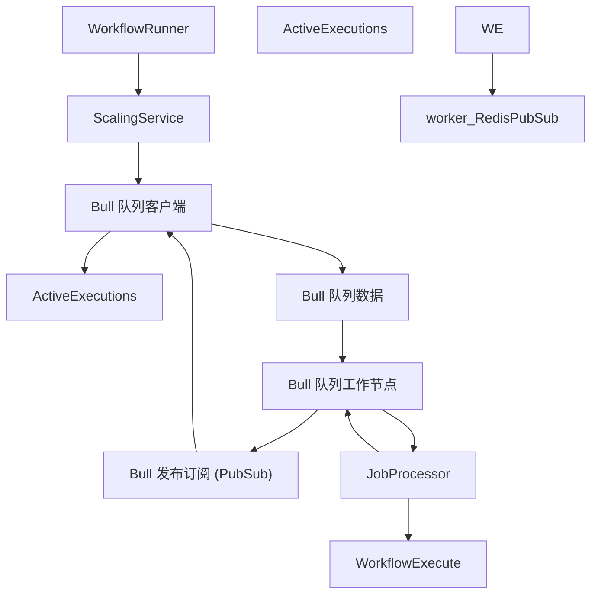

# 工作流执行引擎

相关源文件

-   [packages/@n8n/backend-common/src/logging/\_\_tests\_\_/logger.test.ts](https://github.com/n8n-io/n8n/blob/88f170b9/packages/@n8n/backend-common/src/logging/__tests__/logger.test.ts)
-   [packages/@n8n/backend-common/src/logging/logger.ts](https://github.com/n8n-io/n8n/blob/88f170b9/packages/@n8n/backend-common/src/logging/logger.ts)
-   [packages/@n8n/db/src/repositories/\_\_tests\_\_/execution.repository.test.ts](https://github.com/n8n-io/n8n/blob/88f170b9/packages/@n8n/db/src/repositories/__tests__/execution.repository.test.ts)
-   [packages/@n8n/db/src/repositories/execution.repository.ts](https://github.com/n8n-io/n8n/blob/88f170b9/packages/@n8n/db/src/repositories/execution.repository.ts)
-   [packages/@n8n/decorators/src/\_\_tests\_\_/memoized.test.ts](https://github.com/n8n-io/n8n/blob/88f170b9/packages/@n8n/decorators/src/__tests__/memoized.test.ts)
-   [packages/@n8n/decorators/src/context-establishment/context-establishment-hook.ts](https://github.com/n8n-io/n8n/blob/88f170b9/packages/@n8n/decorators/src/context-establishment/context-establishment-hook.ts)
-   [packages/@n8n/decorators/src/memoized.ts](https://github.com/n8n-io/n8n/blob/88f170b9/packages/@n8n/decorators/src/memoized.ts)
-   [packages/cli/src/\_\_tests\_\_/active-executions.test.ts](https://github.com/n8n-io/n8n/blob/88f170b9/packages/cli/src/__tests__/active-executions.test.ts)
-   [packages/cli/src/\_\_tests\_\_/wait-tracker.test.ts](https://github.com/n8n-io/n8n/blob/88f170b9/packages/cli/src/__tests__/wait-tracker.test.ts)
-   [packages/cli/src/\_\_tests\_\_/workflow-execute-additional-data.test.ts](https://github.com/n8n-io/n8n/blob/88f170b9/packages/cli/src/__tests__/workflow-execute-additional-data.test.ts)
-   [packages/cli/src/\_\_tests\_\_/workflow-runner.test.ts](https://github.com/n8n-io/n8n/blob/88f170b9/packages/cli/src/__tests__/workflow-runner.test.ts)
-   [packages/cli/src/active-executions.ts](https://github.com/n8n-io/n8n/blob/88f170b9/packages/cli/src/active-executions.ts)
-   [packages/cli/src/execution-lifecycle/\_\_tests\_\_/execution-lifecycle-hooks.test.ts](https://github.com/n8n-io/n8n/blob/88f170b9/packages/cli/src/execution-lifecycle/__tests__/execution-lifecycle-hooks.test.ts)
-   [packages/cli/src/execution-lifecycle/execution-lifecycle-hooks.ts](https://github.com/n8n-io/n8n/blob/88f170b9/packages/cli/src/execution-lifecycle/execution-lifecycle-hooks.ts)
-   [packages/cli/src/execution-lifecycle/shared/shared-hook-functions.ts](https://github.com/n8n-io/n8n/blob/88f170b9/packages/cli/src/execution-lifecycle/shared/shared-hook-functions.ts)
-   [packages/cli/src/interfaces.ts](https://github.com/n8n-io/n8n/blob/88f170b9/packages/cli/src/interfaces.ts)
-   [packages/cli/src/scaling/\_\_tests\_\_/job-processor.service.test.ts](https://github.com/n8n-io/n8n/blob/88f170b9/packages/cli/src/scaling/__tests__/job-processor.service.test.ts)
-   [packages/cli/src/scaling/\_\_tests\_\_/scaling.service.test.ts](https://github.com/n8n-io/n8n/blob/88f170b9/packages/cli/src/scaling/__tests__/scaling.service.test.ts)
-   [packages/cli/src/scaling/job-processor.ts](https://github.com/n8n-io/n8n/blob/88f170b9/packages/cli/src/scaling/job-processor.ts)
-   [packages/cli/src/scaling/scaling.service.ts](https://github.com/n8n-io/n8n/blob/88f170b9/packages/cli/src/scaling/scaling.service.ts)
-   [packages/cli/src/scaling/scaling.types.ts](https://github.com/n8n-io/n8n/blob/88f170b9/packages/cli/src/scaling/scaling.types.ts)
-   [packages/cli/src/wait-tracker.ts](https://github.com/n8n-io/n8n/blob/88f170b9/packages/cli/src/wait-tracker.ts)
-   [packages/cli/src/webhooks/\_\_tests\_\_/webhook-helpers.test.ts](https://github.com/n8n-io/n8n/blob/88f170b9/packages/cli/src/webhooks/__tests__/webhook-helpers.test.ts)
-   [packages/cli/src/webhooks/webhook-helpers.ts](https://github.com/n8n-io/n8n/blob/88f170b9/packages/cli/src/webhooks/webhook-helpers.ts)
-   [packages/cli/src/workflow-execute-additional-data.ts](https://github.com/n8n-io/n8n/blob/88f170b9/packages/cli/src/workflow-execute-additional-data.ts)
-   [packages/cli/src/workflow-runner.ts](https://github.com/n8n-io/n8n/blob/88f170b9/packages/cli/src/workflow-runner.ts)
-   [packages/cli/src/workflows/\_\_tests\_\_/workflow-execution.service.test.ts](https://github.com/n8n-io/n8n/blob/88f170b9/packages/cli/src/workflows/__tests__/workflow-execution.service.test.ts)
-   [packages/cli/src/workflows/workflow-execution.service.ts](https://github.com/n8n-io/n8n/blob/88f170b9/packages/cli/src/workflows/workflow-execution.service.ts)
-   [packages/cli/src/workflows/workflow.request.ts](https://github.com/n8n-io/n8n/blob/88f170b9/packages/cli/src/workflows/workflow.request.ts)
-   [packages/cli/test/integration/execution.repository.test.ts](https://github.com/n8n-io/n8n/blob/88f170b9/packages/cli/test/integration/execution.repository.test.ts)
-   [packages/cli/test/integration/shared/db/executions.ts](https://github.com/n8n-io/n8n/blob/88f170b9/packages/cli/test/integration/shared/db/executions.ts)
-   [packages/core/eslint.config.mjs](https://github.com/n8n-io/n8n/blob/88f170b9/packages/core/eslint.config.mjs)
-   [packages/core/src/execution-engine/\_\_tests\_\_/mock-node-types.ts](https://github.com/n8n-io/n8n/blob/88f170b9/packages/core/src/execution-engine/__tests__/mock-node-types.ts)
-   [packages/core/src/execution-engine/\_\_tests\_\_/requests-response.test.ts](https://github.com/n8n-io/n8n/blob/88f170b9/packages/core/src/execution-engine/__tests__/requests-response.test.ts)
-   [packages/core/src/execution-engine/\_\_tests\_\_/workflow-execute-process-process-run-execution-data.test.ts](https://github.com/n8n-io/n8n/blob/88f170b9/packages/core/src/execution-engine/__tests__/workflow-execute-process-process-run-execution-data.test.ts)
-   [packages/core/src/execution-engine/\_\_tests\_\_/workflow-execute-run-node.test.ts](https://github.com/n8n-io/n8n/blob/88f170b9/packages/core/src/execution-engine/__tests__/workflow-execute-run-node.test.ts)
-   [packages/core/src/execution-engine/\_\_tests\_\_/workflow-execute.test.ts](https://github.com/n8n-io/n8n/blob/88f170b9/packages/core/src/execution-engine/__tests__/workflow-execute.test.ts)
-   [packages/core/src/execution-engine/node-execution-context/credentials-test-context.ts](https://github.com/n8n-io/n8n/blob/88f170b9/packages/core/src/execution-engine/node-execution-context/credentials-test-context.ts)
-   [packages/core/src/execution-engine/node-execution-context/execute-single-context.ts](https://github.com/n8n-io/n8n/blob/88f170b9/packages/core/src/execution-engine/node-execution-context/execute-single-context.ts)
-   [packages/core/src/execution-engine/node-execution-context/index.ts](https://github.com/n8n-io/n8n/blob/88f170b9/packages/core/src/execution-engine/node-execution-context/index.ts)
-   [packages/core/src/execution-engine/node-execution-context/utils/\_\_tests\_\_/resolve-source-overwrite.test.ts](https://github.com/n8n-io/n8n/blob/88f170b9/packages/core/src/execution-engine/node-execution-context/utils/__tests__/resolve-source-overwrite.test.ts)
-   [packages/core/src/execution-engine/node-execution-context/utils/resolve-source-overwrite.ts](https://github.com/n8n-io/n8n/blob/88f170b9/packages/core/src/execution-engine/node-execution-context/utils/resolve-source-overwrite.ts)
-   [packages/core/src/execution-engine/node-execution-context/webhook-context.ts](https://github.com/n8n-io/n8n/blob/88f170b9/packages/core/src/execution-engine/node-execution-context/webhook-context.ts)
-   [packages/core/src/execution-engine/requests-response.ts](https://github.com/n8n-io/n8n/blob/88f170b9/packages/core/src/execution-engine/requests-response.ts)
-   [packages/core/src/execution-engine/workflow-execute.ts](https://github.com/n8n-io/n8n/blob/88f170b9/packages/core/src/execution-engine/workflow-execute.ts)
-   [packages/core/src/node-execute-functions.ts](https://github.com/n8n-io/n8n/blob/88f170b9/packages/core/src/node-execute-functions.ts)
-   [packages/core/src/utils/\_\_tests\_\_/deep-merge.test.ts](https://github.com/n8n-io/n8n/blob/88f170b9/packages/core/src/utils/__tests__/deep-merge.test.ts)
-   [packages/core/src/utils/deep-merge.ts](https://github.com/n8n-io/n8n/blob/88f170b9/packages/core/src/utils/deep-merge.ts)
-   [packages/testing/playwright/pages/ExecutionsPage.ts](https://github.com/n8n-io/n8n/blob/88f170b9/packages/testing/playwright/pages/ExecutionsPage.ts)
-   [packages/testing/playwright/tests/e2e/settings/users/users.spec.ts](https://github.com/n8n-io/n8n/blob/88f170b9/packages/testing/playwright/tests/e2e/settings/users/users.spec.ts)
-   [packages/testing/playwright/tests/e2e/workflows/executions/list.spec.ts](https://github.com/n8n-io/n8n/blob/88f170b9/packages/testing/playwright/tests/e2e/workflows/executions/list.spec.ts)
-   [packages/testing/playwright/workflows/cat-1854-wait-execution-history.json](https://github.com/n8n-io/n8n/blob/88f170b9/packages/testing/playwright/workflows/cat-1854-wait-execution-history.json)
-   [packages/testing/playwright/workflows/webhook-misconfiguration-test.json](https://github.com/n8n-io/n8n/blob/88f170b9/packages/testing/playwright/workflows/webhook-misconfiguration-test.json)

工作流执行引擎（Workflow Execution Engine）是核心子系统，负责从触发到完成执行整个工作流。它编排节点执行、管理执行状态、处理通过 Bull/Redis 队列进行的分布式处理，并提供用于监控和持久化的生命周期钩子（lifecycle hooks）。

本页面涵盖了执行机制和基础设施。有关工作流数据结构和表达式求值的信息，请参阅 [工作流数据访问与表达式系统](/n8n-io/n8n/2.3-workflow-data-access-and-expression-system)。有关执行持久化和恢复机制的信息，请参阅 [执行恢复与错误处理](/n8n-io/n8n/2.4-execution-recovery-and-error-handling)。有关分布式工作节点（worker）设置和作业处理的信息，请参阅 [分布式执行与扩缩容](/n8n-io/n8n/2.2-distributed-execution-and-scaling)。

## 执行模式

n8n 支持两种执行模式，通过 `GlobalConfig.executions.mode` 配置：

| 模式 | 描述 | 使用场景 |
| --- | --- | --- |
| `regular` | 执行在主进程中运行 | 单服务器部署、开发环境 |
| `queue` | 执行被加入到 Bull/Redis 队列并由工作节点处理 | 多服务器扩容、高吞吐量 |

在 `regular` 模式下，`WorkflowRunner.runMainProcess()` 直接在主进程中执行工作流。在 `queue` 模式下，`WorkflowRunner.enqueueExecution()` 创建一个 Bull 作业，该作业由运行 `JobProcessor.processJob()` 的工作进程领取。

**来源：** [packages/cli/src/workflow-runner.ts172-188](https://github.com/n8n-io/n8n/blob/88f170b9/packages/cli/src/workflow-runner.ts#L172-L188)

## WorkflowRunner：主入口点

```mermaid
flowchart TD
    ExecuteManually["WorkflowExecutionService.executeManually()"]
    RunWorkflow["WorkflowExecutionService.runWorkflow()"]
    ActiveWorkflow["ActiveWorkflowManager 触发"]
    WR_run["WorkflowRunner.run()"]
    WR_check["检查凭证权限"]
    WR_mode["队列模式？"]
    WR_enqueue["WorkflowRunner.enqueueExecution()"]
    WR_runMain["WorkflowRunner.runMainProcess()"]
    FailedRun["生成失败执行"]
    AddJob["ScalingService.addJob()"]
    BullQueue["Bull 队列"]
    CreateWorkflow["new Workflow()"]
    GetBase["WorkflowExecuteAdditionalData.getBase()"]
    ExecuteWorkflow["new WorkflowExecute()"]
    ProcessRun["workflowExecute.processRunExecutionData()"]

    ExecuteManually --> WR_run
    RunWorkflow --> WR_run
    ActiveWorkflow --> WR_run
    WR --> run_WR_check
    WR --> check_WR_mode
    WR --> check_FailedRun
    WR --> mode_WR_enqueue
    WR --> mode_WR_runMain
    WR --> enqueue_AddJob
    AddJob --> BullQueue
    WR --> runMain_CreateWorkflow
    CreateWorkflow --> GetBase
    GetBase --> ExecuteWorkflow
    ExecuteWorkflow --> ProcessRun
```


`WorkflowRunner.run()` 是所有工作流执行的统一入口点。它负责：

1.  在 `ActiveExecutions` 中注册执行，以跟踪内存中的状态 [packages/cli/src/workflow-runner.ts147](https://github.com/n8n-io/n8n/blob/88f170b9/packages/cli/src/workflow-runner.ts#L147-L147)
2.  通过 `CredentialsPermissionChecker` 验证凭证权限 [packages/cli/src/workflow-runner.ts152](https://github.com/n8n-io/n8n/blob/88f170b9/packages/cli/src/workflow-runner.ts#L152-L152)
3.  根据配置路由到队列执行或常规执行 [packages/cli/src/workflow-runner.ts178-189](https://github.com/n8n-io/n8n/blob/88f170b9/packages/cli/src/workflow-runner.ts#L178-L189)
4.  为 Webhook 触发的工作流附加响应 promise [packages/cli/src/workflow-runner.ts168-170](https://github.com/n8n-io/n8n/blob/88f170b9/packages/cli/src/workflow-runner.ts#L168-L170)
5.  如果已配置，则设置执行超时 [packages/cli/src/workflow-runner.ts229-232](https://github.com/n8n-io/n8n/blob/88f170b9/packages/cli/src/workflow-runner.ts#L229-L232)

**来源：** [packages/cli/src/workflow-runner.ts139-213](https://github.com/n8n-io/n8n/blob/88f170b9/packages/cli/src/workflow-runner.ts#L139-L213) [packages/cli/src/workflows/workflow-execution.service.ts57-90](https://github.com/n8n-io/n8n/blob/88f170b9/packages/cli/src/workflows/workflow-execution.service.ts#L57-L90)

## 常规模式执行流

> **[Mermaid sequence]**
> *(图表结构无法解析)*

在常规模式下，`WorkflowRunner.runMainProcess()` 同步执行工作流：

1.  如果需要，通过 `WorkflowStaticDataService` 加载静态数据 [packages/cli/src/workflow-runner.ts220-224](https://github.com/n8n-io/n8n/blob/88f170b9/packages/cli/src/workflow-runner.ts#L220-L224)
2.  从工作流定义创建 `Workflow` 实例 [packages/cli/src/workflow-runner.ts246-255](https://github.com/n8n-io/n8n/blob/88f170b9/packages/cli/src/workflow-runner.ts#L246-L255)
3.  构建包含助手函数、钩子和配置的 `IWorkflowExecuteAdditionalData` 上下文 [packages/cli/src/workflow-runner.ts257-262](https://github.com/n8n-io/n8n/blob/88f170b9/packages/cli/src/workflow-runner.ts#L257-L262)
4.  如果配置了 `executionTimeout`，则使用 `setTimeout` 设置执行超时 [packages/cli/src/workflow-runner.ts229-244](https://github.com/n8n-io/n8n/blob/88f170b9/packages/cli/src/workflow-runner.ts#L229-L244)
5.  创建 `WorkflowExecute` 实例并调用 `processRunExecutionData()` [packages/cli/src/workflow-runner.ts275-276](https://github.com/n8n-io/n8n/blob/88f170b9/packages/cli/src/workflow-runner.ts#L275-L276)
6.  将执行 promise 附加到 `ActiveExecutions` 以支持取消操作 [packages/cli/src/workflow-runner.ts278](https://github.com/n8n-io/n8n/blob/88f170b9/packages/cli/src/workflow-runner.ts#L278-L278)
7.  完成后，清除超时并完成执行 [packages/cli/src/workflow-runner.ts316-320](https://github.com/n8n-io/n8n/blob/88f170b9/packages/cli/src/workflow-runner.ts#L316-L320)

**来源：** [packages/cli/src/workflow-runner.ts217-376](https://github.com/n8n-io/n8n/blob/88f170b9/packages/cli/src/workflow-runner.ts#L217-L376) [packages/core/src/execution-engine/workflow-execute.ts99-130](https://github.com/n8n-io/n8n/blob/88f170b9/packages/core/src/execution-engine/workflow-execute.ts#L99-L130)

## 队列模式架构


### ScalingService 组件

`ScalingService` 管理 Bull 队列基础设施：

**设置 (主进程/Webhook)：**

-   `setupQueue()`：使用 Redis 客户端创建 Bull 队列实例 [packages/cli/src/scaling/scaling.service.ts60-75](https://github.com/n8n-io/n8n/blob/88f170b9/packages/cli/src/scaling/scaling.service.ts#L60-L75)
-   `registerListeners()`：监听作业事件，如 `completed`、`failed` 和 `progress` [packages/cli/src/scaling/scaling.service.ts77](https://github.com/n8n-io/n8n/blob/88f170b9/packages/cli/src/scaling/scaling.service.ts#L77-L77)
-   `scheduleQueueRecovery()`：定期将悬挂执行标记为崩溃（仅限主节点） [packages/cli/src/scaling/scaling.service.ts79](https://github.com/n8n-io/n8n/blob/88f170b9/packages/cli/src/scaling/scaling.service.ts#L79-L79)

**设置 (工作节点)：**

-   `setupWorker(concurrency)`：注册具有并发限制的作业处理器 [packages/cli/src/scaling/scaling.service.ts111-137](https://github.com/n8n-io/n8n/blob/88f170b9/packages/cli/src/scaling/scaling.service.ts#L111-L137)

**作业操作：**

-   `addJob(jobData, priority)`：将执行加入队列并设置优先级 [packages/cli/src/scaling/scaling.service.ts226-240](https://github.com/n8n-io/n8n/blob/88f170b9/packages/cli/src/scaling/scaling.service.ts#L226-L240)
-   `stopJob(executionId)`：通过进度事件向工作节点发送中止消息 [packages/cli/src/scaling/scaling.service.ts254-279](https://github.com/n8n-io/n8n/blob/88f170b9/packages/cli/src/scaling/scaling.service.ts#L254-L279)
-   `popJobResult(executionId)`：检索并移除已完成作业的结果 [packages/cli/src/scaling/scaling.service.ts208-212](https://github.com/n8n-io/n8n/blob/88f170b9/packages/cli/src/scaling/scaling.service.ts#L208-L212)

**来源：** [packages/cli/src/scaling/scaling.service.ts40-245](https://github.com/n8n-io/n8n/blob/88f170b9/packages/cli/src/scaling/scaling.service.ts#L40-L245)

### JobData 结构

```
type JobData = {  workflowId: string;  executionId: string;  loadStaticData: boolean;  pushRef?: string;              // 用于向 UI 实时更新  streamingEnabled?: boolean;  restartExecutionId?: string;   // 用于工作流重启    // MCP 特定字段  isMcpExecution?: boolean;  mcpType?: 'service' | 'trigger';  mcpSessionId?: string;  mcpMessageId?: string;}
```
**来源：** [packages/cli/src/scaling/scaling.types.ts18-42](https://github.com/n8n-io/n8n/blob/88f170b9/packages/cli/src/scaling/scaling.types.ts#L18-L42)

### JobProcessor 执行

`JobProcessor.processJob()` 在工作进程上运行：

1.  从 `ExecutionRepository` 获取执行数据，并设置 `includeData: true` [packages/cli/src/scaling/job-processor.ts75-78](https://github.com/n8n-io/n8n/blob/88f170b9/packages/cli/src/scaling/job-processor.ts#L75-L78)
2.  如果执行状态为 `crashed`，则提前返回 [packages/cli/src/scaling/job-processor.ts91](https://github.com/n8n-io/n8n/blob/88f170b9/packages/cli/src/scaling/job-processor.ts#L91-L91)
3.  如果 `loadStaticData` 为 true，从 `WorkflowRepository` 加载静态数据 [packages/cli/src/scaling/job-processor.ts108-121](https://github.com/n8n-io/n8n/blob/88f170b9/packages/cli/src/scaling/job-processor.ts#L108-L121)
4.  创建 `Workflow` 实例和 `IWorkflowExecuteAdditionalData` [packages/cli/src/scaling/job-processor.ts134-149](https://github.com/n8n-io/n8n/blob/88f170b9/packages/cli/src/scaling/job-processor.ts#L134-L149)
5.  使用 `getLifecycleHooksForScalingWorker()` 设置生命周期钩子 [packages/cli/src/scaling/job-processor.ts155-164](https://github.com/n8n-io/n8n/blob/88f170b9/packages/cli/src/scaling/job-processor.ts#L155-L164)
6.  调用 `WorkflowExecute.processRunExecutionData()` 开始执行 [packages/cli/src/scaling/job-processor.ts233](https://github.com/n8n-io/n8n/blob/88f170b9/packages/cli/src/scaling/job-processor.ts#L233-L233)
7.  通过 `job.progress()` 发送进度消息：
    -   `respond-to-webhook`：Webhook 响应 [packages/cli/src/scaling/job-processor.ts190-197](https://github.com/n8n-io/n8n/blob/88f170b9/packages/cli/src/scaling/job-processor.ts#L190-L197)
    -   `send-chunk`：用于 SSE 的流式分块 [packages/cli/src/scaling/job-processor.ts201-208](https://github.com/n8n-io/n8n/blob/88f170b9/packages/cli/src/scaling/job-processor.ts#L201-L208)
    -   `mcp-response`：MCP 工具执行结果 [packages/cli/src/scaling/job-processor.ts173-186](https://github.com/n8n-io/n8n/blob/88f170b9/packages/cli/src/scaling/job-processor.ts#L173-L186)

**来源：** [packages/cli/src/scaling/job-processor.ts72-235](https://github.com/n8n-io/n8n/blob/88f170b9/packages/cli/src/scaling/job-processor.ts#L72-L235)

## WorkflowExecuteAdditionalData 上下文

`WorkflowExecuteAdditionalData.getBase()` 创建传递给所有节点执行的上下文对象：

**核心助手：**

-   `credentialsHelper`：用于凭证解析的 `CredentialsHelper` 实例 [packages/cli/src/workflow-execute-additional-data.ts474](https://github.com/n8n-io/n8n/blob/88f170b9/packages/cli/src/workflow-execute-additional-data.ts#L474-L474)
-   `executeWorkflow`：执行子工作流的函数（参见 [工作流数据访问与表达式系统](/n8n-io/n8n/2.3-workflow-data-access-and-expression-system)） [packages/cli/src/workflow-execute-additional-data.ts198-202](https://github.com/n8n-io/n8n/blob/88f170b9/packages/cli/src/workflow-execute-additional-data.ts#L198-L202)
-   `setExecutionStatus`：更新 `ActiveExecutions` 中的执行状态 [packages/cli/src/workflow-execute-additional-data.ts503](https://github.com/n8n-io/n8n/blob/88f170b9/packages/cli/src/workflow-execute-additional-data.ts#L503-L503)
-   `sendDataToUI`：通过 `pushRef` 向连接的客户端发送推送事件 [packages/cli/src/workflow-execute-additional-data.ts511](https://github.com/n8n-io/n8n/blob/88f170b9/packages/cli/src/workflow-execute-additional-data.ts#L511-L511)

**配置：**

-   `restApiUrl`、`instanceBaseUrl`、`webhookBaseUrl`：URL 端点 [packages/cli/src/workflow-execute-additional-data.ts483-485](https://github.com/n8n-io/n8n/blob/88f170b9/packages/cli/src/workflow-execute-additional-data.ts#L483-L485)
-   `variables`：来自 `VariablesService` 的环境变量 [packages/cli/src/workflow-execute-additional-data.ts515](https://github.com/n8n-io/n8n/blob/88f170b9/packages/cli/src/workflow-execute-additional-data.ts#L515-L515)
-   `workflowSettings`：特定于工作流的设置 [packages/cli/src/workflow-execute-additional-data.ts522](https://github.com/n8n-io/n8n/blob/88f170b9/packages/cli/src/workflow-execute-additional-data.ts#L522-L522)

**高级功能：**

-   `startRunnerTask`：将代码执行卸载到任务运行器（Task Runner，支持 JS/Python） [packages/cli/src/workflow-execute-additional-data.ts544](https://github.com/n8n-io/n8n/blob/88f170b9/packages/cli/src/workflow-execute-additional-data.ts#L544-L544)
-   `externalSecretsProxy`：解析来自外部提供商的密钥 [packages/cli/src/workflow-execute-additional-data.ts476](https://github.com/n8n-io/n8n/blob/88f170b9/packages/cli/src/workflow-execute-additional-data.ts#L476-L476)

**来源：** [packages/cli/src/workflow-execute-additional-data.ts453-556](https://github.com/n8n-io/n8n/blob/88f170b9/packages/cli/src/workflow-execute-additional-data.ts#L453-L556)

## 执行生命周期钩子

`ExecutionLifecycleHooks` 为工作流执行里程碑提供了一个事件系统。

**钩子工厂函数：**

| 函数 | 上下文 |
| --- | --- |
| `getLifecycleHooksForRegularMain()` | 主进程常规执行 [packages/cli/src/execution-lifecycle/execution-lifecycle-hooks.ts133](https://github.com/n8n-io/n8n/blob/88f170b9/packages/cli/src/execution-lifecycle/execution-lifecycle-hooks.ts#L133-L133) |
| `getLifecycleHooksForScalingMain()` | 队列模式下的主进程 [packages/cli/src/execution-lifecycle/execution-lifecycle-hooks.ts167](https://github.com/n8n-io/n8n/blob/88f170b9/packages/cli/src/execution-lifecycle/execution-lifecycle-hooks.ts#L167-L167) |
| `getLifecycleHooksForScalingWorker()` | 工作进程 [packages/cli/src/execution-lifecycle/execution-lifecycle-hooks.ts183](https://github.com/n8n-io/n8n/blob/88f170b9/packages/cli/src/execution-lifecycle/execution-lifecycle-hooks.ts#L183-L183) |
| `getLifecycleHooksForSubExecutions()` | 子工作流执行 [packages/cli/src/workflow-execute-additional-data.ts39](https://github.com/n8n-io/n8n/blob/88f170b9/packages/cli/src/workflow-execute-additional-data.ts#L39-L39) |

**关键钩子处理程序：**

-   **`workflowExecuteBefore`**：发出 `execution-started` 事件并触发外部钩子 [packages/cli/src/execution-lifecycle/execution-lifecycle-hooks.ts251-264](https://github.com/n8n-io/n8n/blob/88f170b9/packages/cli/src/execution-lifecycle/execution-lifecycle-hooks.ts#L251-L264)
-   **`nodeExecuteAfter`**：将节点结果发送到 UI 并更新统计信息 [packages/cli/src/execution-lifecycle/execution-lifecycle-hooks.ts337-375](https://github.com/n8n-io/n8n/blob/88f170b9/packages/cli/src/execution-lifecycle/execution-lifecycle-hooks.ts#L337-L375)
-   **`workflowExecuteAfter`**：将最终执行结果持久化到数据库并触发错误工作流 [packages/cli/src/execution-lifecycle/execution-lifecycle-hooks.ts411-470](https://github.com/n8n-io/n8n/blob/88f170b9/packages/cli/src/execution-lifecycle/execution-lifecycle-hooks.ts#L411-L470)

**来源：** [packages/cli/src/execution-lifecycle/execution-lifecycle-hooks.ts133-500](https://github.com/n8n-io/n8n/blob/88f170b9/packages/cli/src/execution-lifecycle/execution-lifecycle-hooks.ts#L133-L500)

## 子工作流执行

子工作流通过 `WorkflowExecuteAdditionalData.executeWorkflow()` 执行：

**草稿 vs. 已发布：**

-   手动/聊天执行使用 `getDraftWorkflowData()` 从数据库获取最新的节点 [packages/cli/src/workflow-execute-additional-data.ts147-158](https://github.com/n8n-io/n8n/blob/88f170b9/packages/cli/src/workflow-execute-additional-data.ts#L147-L158)
-   生产执行使用 `getPublishedWorkflowData()`，这需要一个 `activeVersion` [packages/cli/src/workflow-execute-additional-data.ts165-193](https://github.com/n8n-io/n8n/blob/88f170b9/packages/cli/src/workflow-execute-additional-data.ts#L165-L193)

**执行流程：**

1.  加载工作流数据（草稿或已发布） [packages/cli/src/workflow-execute-additional-data.ts209-221](https://github.com/n8n-io/n8n/blob/88f170b9/packages/cli/src/workflow-execute-additional-data.ts#L209-L221)
2.  在子工作流开始节点使用输入数据初始化 `runData` [packages/cli/src/workflow-execute-additional-data.ts56-95](https://github.com/n8n-io/n8n/blob/88f170b9/packages/cli/src/workflow-execute-additional-data.ts#L56-L95)
3.  在 `ActiveExecutions` 中注册执行 [packages/cli/src/workflow-execute-additional-data.ts226](https://github.com/n8n-io/n8n/blob/88f170b9/packages/cli/src/workflow-execute-additional-data.ts#L226-L226)
4.  通过 `WorkflowRunner.run()` 执行 [packages/cli/src/workflow-execute-additional-data.ts241](https://github.com/n8n-io/n8n/blob/88f170b9/packages/cli/src/workflow-execute-additional-data.ts#L241-L241)

**来源：** [packages/cli/src/workflow-execute-additional-data.ts198-416](https://github.com/n8n-io/n8n/blob/88f170b9/packages/cli/src/workflow-execute-additional-data.ts#L198-L416)

## 手动执行与部分执行

`WorkflowExecutionService.executeManually()` 处理来自 UI 的手动执行：

**执行模式：**

1.  **部分执行到目标节点：**

    -   负载包含 `destinationNode` 和 `runData` [packages/cli/src/workflows/workflow-execution.service.ts125-137](https://github.com/n8n-io/n8n/blob/88f170b9/packages/cli/src/workflows/workflow-execution.service.ts#L125-L137)
    -   允许使用先前的执行数据从特定节点恢复执行。
2.  **从已知触发器开始的完整执行：**

    -   负载包含 `triggerToStartFrom` [packages/cli/src/workflows/workflow-execution.service.ts144-175](https://github.com/n8n-io/n8n/blob/88f170b9/packages/cli/src/workflows/workflow-execution.service.ts#L144-L175)
    -   通过 `testWebhooks.needsWebhook()` 检查是否需要测试 Webhook [packages/cli/src/workflows/workflow-execution.service.ts148-160](https://github.com/n8n-io/n8n/blob/88f170b9/packages/cli/src/workflows/workflow-execution.service.ts#L148-L160)
3.  **从未知触发器开始的完整执行：**

    -   通过 `selectPinnedTrigger()` 选择一个固定的触发器 [packages/cli/src/workflows/workflow-execution.service.ts178-212](https://github.com/n8n-io/n8n/blob/88f170b9/packages/cli/src/workflows/workflow-execution.service.ts#L178-L212)

**来源：** [packages/cli/src/workflows/workflow-execution.service.ts104-213](https://github.com/n8n-io/n8n/blob/88f170b9/packages/cli/src/workflows/workflow-execution.service.ts#L104-L213)
