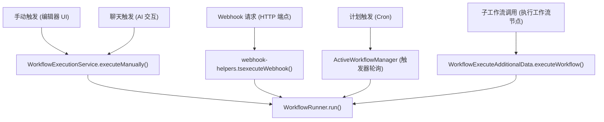
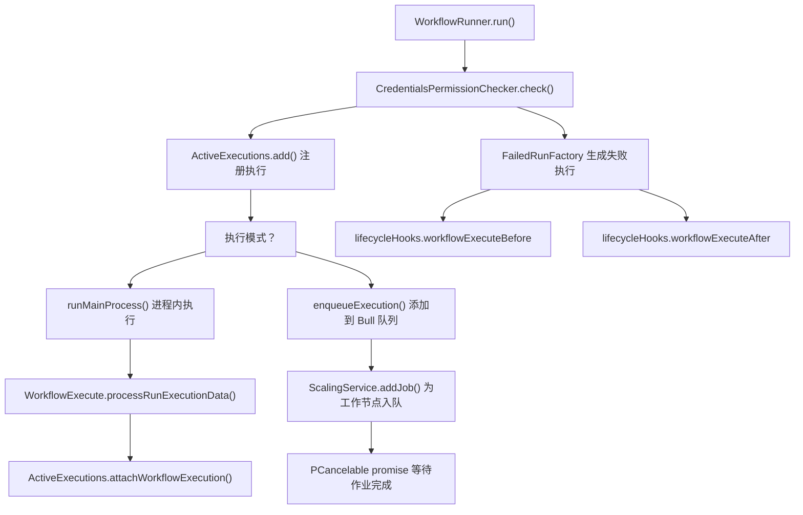
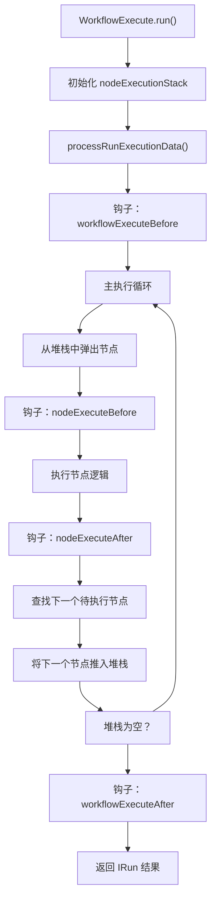

# 工作流执行生命周期

相关源文件

-   [packages/@n8n/backend-common/src/logging/\_\_tests\_\_/logger.test.ts](https://github.com/n8n-io/n8n/blob/88f170b9/packages/@n8n/backend-common/src/logging/__tests__/logger.test.ts)
-   [packages/@n8n/backend-common/src/logging/logger.ts](https://github.com/n8n-io/n8n/blob/88f170b9/packages/@n8n/backend-common/src/logging/logger.ts)
-   [packages/@n8n/db/src/repositories/\_\_tests\_\_/execution.repository.test.ts](https://github.com/n8n-io/n8n/blob/88f170b9/packages/@n8n/db/src/repositories/__tests__/execution.repository.test.ts)
-   [packages/@n8n/db/src/repositories/execution.repository.ts](https://github.com/n8n-io/n8n/blob/88f170b9/packages/@n8n/db/src/repositories/execution.repository.ts)
-   [packages/@n8n/decorators/src/\_\_tests\_\_/memoized.test.ts](https://github.com/n8n-io/n8n/blob/88f170b9/packages/@n8n/decorators/src/__tests__/memoized.test.ts)
-   [packages/@n8n/decorators/src/context-establishment/context-establishment-hook.ts](https://github.com/n8n-io/n8n/blob/88f170b9/packages/@n8n/decorators/src/context-establishment/context-establishment-hook.ts)
-   [packages/@n8n/decorators/src/memoized.ts](https://github.com/n8n-io/n8n/blob/88f170b9/packages/@n8n/decorators/src/memoized.ts)
-   [packages/cli/src/\_\_tests\_\_/active-executions.test.ts](https://github.com/n8n-io/n8n/blob/88f170b9/packages/cli/src/__tests__/active-executions.test.ts)
-   [packages/cli/src/\_\_tests\_\_/wait-tracker.test.ts](https://github.com/n8n-io/n8n/blob/88f170b9/packages/cli/src/__tests__/wait-tracker.test.ts)
-   [packages/cli/src/\_\_tests\_\_/workflow-execute-additional-data.test.ts](https://github.com/n8n-io/n8n/blob/88f170b9/packages/cli/src/__tests__/workflow-execute-additional-data.test.ts)
-   [packages/cli/src/\_\_tests\_\_/workflow-runner.test.ts](https://github.com/n8n-io/n8n/blob/88f170b9/packages/cli/src/__tests__/workflow-runner.test.ts)
-   [packages/cli/src/active-executions.ts](https://github.com/n8n-io/n8n/blob/88f170b9/packages/cli/src/active-executions.ts)
-   [packages/cli/src/execution-lifecycle/\_\_tests\_\_/execution-lifecycle-hooks.test.ts](https://github.com/n8n-io/n8n/blob/88f170b9/packages/cli/src/execution-lifecycle/__tests__/execution-lifecycle-hooks.test.ts)
-   [packages/cli/src/execution-lifecycle/execution-lifecycle-hooks.ts](https://github.com/n8n-io/n8n/blob/88f170b9/packages/cli/src/execution-lifecycle/execution-lifecycle-hooks.ts)
-   [packages/cli/src/execution-lifecycle/shared/shared-hook-functions.ts](https://github.com/n8n-io/n8n/blob/88f170b9/packages/cli/src/execution-lifecycle/shared/shared-hook-functions.ts)
-   [packages/cli/src/interfaces.ts](https://github.com/n8n-io/n8n/blob/88f170b9/packages/cli/src/interfaces.ts)
-   [packages/cli/src/scaling/\_\_tests\_\_/job-processor.service.test.ts](https://github.com/n8n-io/n8n/blob/88f170b9/packages/cli/src/scaling/__tests__/job-processor.service.test.ts)
-   [packages/cli/src/scaling/\_\_tests\_\_/scaling.service.test.ts](https://github.com/n8n-io/n8n/blob/88f170b9/packages/cli/src/scaling/__tests__/scaling.service.test.ts)
-   [packages/cli/src/scaling/job-processor.ts](https://github.com/n8n-io/n8n/blob/88f170b9/packages/cli/src/scaling/job-processor.ts)
-   [packages/cli/src/scaling/scaling.service.ts](https://github.com/n8n-io/n8n/blob/88f170b9/packages/cli/src/scaling/scaling.service.ts)
-   [packages/cli/src/scaling/scaling.types.ts](https://github.com/n8n-io/n8n/blob/88f170b9/packages/cli/src/scaling/scaling.types.ts)
-   [packages/cli/src/wait-tracker.ts](https://github.com/n8n-io/n8n/blob/88f170b9/packages/cli/src/wait-tracker.ts)
-   [packages/cli/src/webhooks/\_\_tests\_\_/webhook-helpers.test.ts](https://github.com/n8n-io/n8n/blob/88f170b9/packages/cli/src/webhooks/__tests__/webhook-helpers.test.ts)
-   [packages/cli/src/webhooks/webhook-helpers.ts](https://github.com/n8n-io/n8n/blob/88f170b9/packages/cli/src/webhooks/webhook-helpers.ts)
-   [packages/cli/src/workflow-execute-additional-data.ts](https://github.com/n8n-io/n8n/blob/88f170b9/packages/cli/src/workflow-execute-additional-data.ts)
-   [packages/cli/src/workflow-runner.ts](https://github.com/n8n-io/n8n/blob/88f170b9/packages/cli/src/workflow-runner.ts)
-   [packages/cli/src/workflows/\_\_tests\_\_/workflow-execution.service.test.ts](https://github.com/n8n-io/n8n/blob/88f170b9/packages/cli/src/workflows/__tests__/workflow-execution.service.test.ts)
-   [packages/cli/src/workflows/workflow-execution.service.ts](https://github.com/n8n-io/n8n/blob/88f170b9/packages/cli/src/workflows/workflow-execution.service.ts)
-   [packages/cli/src/workflows/workflow.request.ts](https://github.com/n8n-io/n8n/blob/88f170b9/packages/cli/src/workflows/workflow.request.ts)
-   [packages/cli/test/integration/execution.repository.test.ts](https://github.com/n8n-io/n8n/blob/88f170b9/packages/cli/test/integration/execution.repository.test.ts)
-   [packages/cli/test/integration/shared/db/executions.ts](https://github.com/n8n-io/n8n/blob/88f170b9/packages/cli/test/integration/shared/db/executions.ts)
-   [packages/core/eslint.config.mjs](https://github.com/n8n-io/n8n/blob/88f170b9/packages/core/eslint.config.mjs)
-   [packages/core/src/execution-engine/\_\_tests\_\_/mock-node-types.ts](https://github.com/n8n-io/n8n/blob/88f170b9/packages/core/src/execution-engine/__tests__/mock-node-types.ts)
-   [packages/core/src/execution-engine/\_\_tests\_\_/requests-response.test.ts](https://github.com/n8n-io/n8n/blob/88f170b9/packages/core/src/execution-engine/__tests__/requests-response.test.ts)
-   [packages/core/src/execution-engine/\_\_tests\_\_/workflow-execute-process-process-run-execution-data.test.ts](https://github.com/n8n-io/n8n/blob/88f170b9/packages/core/src/execution-engine/__tests__/workflow-execute-process-process-run-execution-data.test.ts)
-   [packages/core/src/execution-engine/\_\_tests\_\_/workflow-execute-run-node.test.ts](https://github.com/n8n-io/n8n/blob/88f170b9/packages/core/src/execution-engine/__tests__/workflow-execute-run-node.test.ts)
-   [packages/core/src/execution-engine/\_\_tests\_\_/workflow-execute.test.ts](https://github.com/n8n-io/n8n/blob/88f170b9/packages/core/src/execution-engine/__tests__/workflow-execute.test.ts)
-   [packages/core/src/execution-engine/node-execution-context/credentials-test-context.ts](https://github.com/n8n-io/n8n/blob/88f170b9/packages/core/src/execution-engine/node-execution-context/credentials-test-context.ts)
-   [packages/core/src/execution-engine/node-execution-context/execute-single-context.ts](https://github.com/n8n-io/n8n/blob/88f170b9/packages/core/src/execution-engine/node-execution-context/execute-single-context.ts)
-   [packages/core/src/execution-engine/node-execution-context/index.ts](https://github.com/n8n-io/n8n/blob/88f170b9/packages/core/src/execution-engine/node-execution-context/index.ts)
-   [packages/core/src/execution-engine/node-execution-context/utils/\_\_tests\_\_/resolve-source-overwrite.test.ts](https://github.com/n8n-io/n8n/blob/88f170b9/packages/core/src/execution-engine/node-execution-context/utils/__tests__/resolve-source-overwrite.test.ts)
-   [packages/core/src/execution-engine/node-execution-context/utils/resolve-source-overwrite.ts](https://github.com/n8n-io/n8n/blob/88f170b9/packages/core/src/execution-engine/node-execution-context/utils/resolve-source-overwrite.ts)
-   [packages/core/src/execution-engine/node-execution-context/webhook-context.ts](https://github.com/n8n-io/n8n/blob/88f170b9/packages/core/src/execution-engine/node-execution-context/webhook-context.ts)
-   [packages/core/src/execution-engine/requests-response.ts](https://github.com/n8n-io/n8n/blob/88f170b9/packages/core/src/execution-engine/requests-response.ts)
-   [packages/core/src/execution-engine/workflow-execute.ts](https://github.com/n8n-io/n8n/blob/88f170b9/packages/core/src/execution-engine/workflow-execute.ts)
-   [packages/core/src/node-execute-functions.ts](https://github.com/n8n-io/n8n/blob/88f170b9/packages/core/src/node-execute-functions.ts)
-   [packages/core/src/utils/\_\_tests\_\_/deep-merge.test.ts](https://github.com/n8n-io/n8n/blob/88f170b9/packages/core/src/utils/__tests__/deep-merge.test.ts)
-   [packages/core/src/utils/deep-merge.ts](https://github.com/n8n-io/n8n/blob/88f170b9/packages/core/src/utils/deep-merge.ts)
-   [packages/core/test/helpers/constants.ts](https://github.com/n8n-io/n8n/blob/88f170b9/packages/core/test/helpers/constants.ts)
-   [packages/core/test/helpers/index.ts](https://github.com/n8n-io/n8n/blob/88f170b9/packages/core/test/helpers/index.ts)
-   [packages/testing/playwright/pages/ExecutionsPage.ts](https://github.com/n8n-io/n8n/blob/88f170b9/packages/testing/playwright/pages/ExecutionsPage.ts)
-   [packages/testing/playwright/tests/e2e/settings/users/users.spec.ts](https://github.com/n8n-io/n8n/blob/88f170b9/packages/testing/playwright/tests/e2e/settings/users/users.spec.ts)
-   [packages/testing/playwright/tests/e2e/workflows/executions/list.spec.ts](https://github.com/n8n-io/n8n/blob/88f170b9/packages/testing/playwright/tests/e2e/workflows/executions/list.spec.ts)
-   [packages/testing/playwright/workflows/cat-1854-wait-execution-history.json](https://github.com/n8n-io/n8n/blob/88f170b9/packages/testing/playwright/workflows/cat-1854-wait-execution-history.json)
-   [packages/testing/playwright/workflows/webhook-misconfiguration-test.json](https://github.com/n8n-io/n8n/blob/88f170b9/packages/testing/playwright/workflows/webhook-misconfiguration-test.json)

## 目的与范围

本文档描述了 n8n 中工作流执行从触发到完成的完整生命周期。它涵盖了执行如何被注册、跟踪和最终确定，支持可观测性和持久化的钩子（hooks）系统，以及协调各组件执行的状态管理机制。

执行引擎的核心位于 `WorkflowExecute` 中，它管理节点执行循环；而 `WorkflowRunner` 则负责编排启动、入队和完成执行的更高层过程。

来源：[packages/core/src/execution-engine/workflow-execute.ts99-110](https://github.com/n8n-io/n8n/blob/88f170b9/packages/core/src/execution-engine/workflow-execute.ts#L99-L110) [packages/cli/src/workflow-runner.ts51-69](https://github.com/n8n-io/n8n/blob/88f170b9/packages/cli/src/workflow-runner.ts#L51-L69)

## 执行流概览

工作流执行经历几个不同的阶段，由 `WorkflowRunner` 协调并由 `ActiveExecutions` 跟踪。执行路径根据 n8n 是运行在常规模式（常规进程内执行）还是队列模式（通过工作节点的分布式执行）而有所不同。

### 执行入口点

**入口点：**

-   **手动执行**：通过 `WorkflowExecutionService.executeManually()` 从编辑器 UI 发起。[packages/cli/src/workflows/workflow-execution.service.ts104-212](https://github.com/n8n-io/n8n/blob/88f170b9/packages/cli/src/workflows/workflow-execution.service.ts#L104-L212)
-   **Webhook 执行**：由 `webhook-helpers.ts` 中的 `executeWebhook()` 处理的 HTTP 请求。[packages/cli/src/webhooks/webhook-helpers.ts412-428](https://github.com/n8n-io/n8n/blob/88f170b9/packages/cli/src/webhooks/webhook-helpers.ts#L412-L428)
-   **子工作流执行**：通过 `WorkflowExecuteAdditionalData.executeWorkflow()` 发起的嵌套工作流。[packages/cli/src/workflow-execute-additional-data.ts198-248](https://github.com/n8n-io/n8n/blob/88f170b9/packages/cli/src/workflow-execute-additional-data.ts#L198-L248)

来源：[packages/cli/src/workflow-runner.ts139-213](https://github.com/n8n-io/n8n/blob/88f170b9/packages/cli/src/workflow-runner.ts#L139-L213) [packages/cli/src/workflows/workflow-execution.service.ts57-90](https://github.com/n8n-io/n8n/blob/88f170b9/packages/cli/src/workflows/workflow-execution.service.ts#L57-L90) [packages/cli/src/workflow-execute-additional-data.ts198-248](https://github.com/n8n-io/n8n/blob/88f170b9/packages/cli/src/workflow-execute-additional-data.ts#L198-L248)

### 模式选择：常规 vs 队列

`WorkflowRunner` 根据系统配置决定是在本地执行工作流还是将其卸载到工作节点。

**模式选择逻辑：** 执行模式由 `executionsConfig.mode` 设置决定。手动执行可以配置为即使在队列模式下也在进程内运行，除非 `OFFLOAD_MANUAL_EXECUTIONS_TO_WORKERS` 设置为 `true`。[packages/cli/src/workflow-runner.ts173-189](https://github.com/n8n-io/n8n/blob/88f170b9/packages/cli/src/workflow-runner.ts#L173-L189)

来源：[packages/cli/src/workflow-runner.ts173-189](https://github.com/n8n-io/n8n/blob/88f170b9/packages/cli/src/workflow-runner.ts#L173-L189) [packages/cli/src/workflow-runner.ts217-376](https://github.com/n8n-io/n8n/blob/88f170b9/packages/cli/src/workflow-runner.ts#L217-L376) [packages/cli/src/workflow-runner.ts378-545](https://github.com/n8n-io/n8n/blob/88f170b9/packages/cli/src/workflow-runner.ts#L378-L545)

## 常规模式下的生命周期阶段

### 阶段 1：执行注册

`ActiveExecutions` 服务管理新执行和恢复执行的注册。

1.  **注册执行**：调用 `ActiveExecutions.add()` 来注册执行。如果提供了 `executionId`（例如，用于重试），它将更新现有记录；否则，它将在 `ExecutionRepository` 中创建一个新记录。[packages/cli/src/active-executions.ts62-161](https://github.com/n8n-io/n8n/blob/88f170b9/packages/cli/src/active-executions.ts#L62-L161)
2.  **数据库更新**：执行状态通过 `ExecutionRepository.setRunning()` 更新为 `running`。[packages/@n8n/db/src/repositories/execution.repository.ts303-318](https://github.com/n8n-io/n8n/blob/88f170b9/packages/@n8n/db/src/repositories/execution.repository.ts#L303-L318)
3.  **跟踪**：一个新的 `IExecutingWorkflowData` 对象被存储在 `activeExecutions` 映射中，其中包括一个处理最终确定的 `postExecutePromise`。[packages/cli/src/active-executions.ts132-156](https://github.com/n8n-io/n8n/blob/88f170b9/packages/cli/src/active-executions.ts#L132-L156)

来源：[packages/cli/src/active-executions.ts62-161](https://github.com/n8n-io/n8n/blob/88f170b9/packages/cli/src/active-executions.ts#L62-L161) [packages/@n8n/db/src/repositories/execution.repository.ts303-318](https://github.com/n8n-io/n8n/blob/88f170b9/packages/@n8n/db/src/repositories/execution.repository.ts#L303-L318)

### 阶段 2：执行开始

`WorkflowRunner.runMainProcess()` 为引擎准备环境。

1.  **上下文准备**：加载工作流静态数据并计算执行超时。[packages/cli/src/workflow-runner.ts232-248](https://github.com/n8n-io/n8n/blob/88f170b9/packages/cli/src/workflow-runner.ts#L232-L248)
2.  **钩子初始化**：使用 `getLifecycleHooksForRegularMain()` 创建生命周期钩子。[packages/cli/src/workflow-runner.ts268-271](https://github.com/n8n-io/n8n/blob/88f170b9/packages/cli/src/workflow-runner.ts#L268-L271)
3.  **引擎调用**：调用 `WorkflowExecute.run()` 或 `processRunExecutionData()` 开始实际处理。[packages/cli/src/workflow-runner.ts335-343](https://github.com/n8n-io/n8n/blob/88f170b9/packages/cli/src/workflow-runner.ts#L335-L343)

来源：[packages/cli/src/workflow-runner.ts217-376](https://github.com/n8n-io/n8n/blob/88f170b9/packages/cli/src/workflow-runner.ts#L217-L376) [packages/core/src/execution-engine/workflow-execute.ts123-188](https://github.com/n8n-io/n8n/blob/88f170b9/packages/core/src/execution-engine/workflow-execute.ts#L123-L188)

### 阶段 3：工作流执行引擎

`WorkflowExecute` 类实现了遍历工作流图的核心逻辑。

**执行循环实现：**

-   **堆栈管理**：引擎维护一个等待处理的节点堆栈 `nodeExecutionStack`。[packages/core/src/execution-engine/workflow-execute.ts157-171](https://github.com/n8n-io/n8n/blob/88f170b9/packages/core/src/execution-engine/workflow-execute.ts#L157-L171)
-   **节点执行**：每个节点都在 `WorkflowExecute` 循环中执行，在每个步骤触发生命周期钩子。[packages/core/src/execution-engine/workflow-execute.ts1012-1150](https://github.com/n8n-io/n8n/blob/88f170b9/packages/core/src/execution-engine/workflow-execute.ts#L1012-L1150)（引用自完整类）
-   **部分执行**：通过 `runPartialWorkflow2()` 支持运行子图或从特定节点开始。[packages/core/src/execution-engine/workflow-execute.ts198-250](https://github.com/n8n-io/n8n/blob/88f170b9/packages/core/src/execution-engine/workflow-execute.ts#L198-L250)

来源：[packages/core/src/execution-engine/workflow-execute.ts123-188](https://github.com/n8n-io/n8n/blob/88f170b9/packages/core/src/execution-engine/workflow-execute.ts#L123-L188) [packages/core/src/execution-engine/workflow-execute.ts198-250](https://github.com/n8n-io/n8n/blob/88f170b9/packages/core/src/execution-engine/workflow-execute.ts#L198-L250)

### 阶段 4：执行完成

当执行完成（或失败）时，`WorkflowRunner` 处理最终确定工作。

1.  **最终确定 (Finalize)**：调用 `ActiveExecutions.finalizeExecution()` 将执行从活动映射中移除。[packages/cli/src/active-executions.ts223-242](https://github.com/n8n-io/n8n/blob/88f170b9/packages/cli/src/active-executions.ts#L223-L242)
2.  **钩子执行**：触发 `workflowExecuteAfter` 钩子，该钩子通常处理将最终结果持久化到数据库。[packages/cli/src/workflow-runner.ts133-134](https://github.com/n8n-io/n8n/blob/88f170b9/packages/cli/src/workflow-runner.ts#L133-L134)
3.  **错误处理**：如果过程失败，`WorkflowRunner.processError()` 创建一个失败的运行对象并将其最终确定。[packages/cli/src/workflow-runner.ts72-134](https://github.com/n8n-io/n8n/blob/88f170b9/packages/cli/src/workflow-runner.ts#L72-L134)

来源：[packages/cli/src/workflow-runner.ts72-134](https://github.com/n8n-io/n8n/blob/88f170b9/packages/cli/src/workflow-runner.ts#L72-L134) [packages/cli/src/active-executions.ts223-242](https://github.com/n8n-io/n8n/blob/88f170b9/packages/cli/src/active-executions.ts#L223-L242)

## 队列模式生命周期

在队列模式下，执行被分配在主进程（Main process）和工作进程（Worker process）之间。

### 阶段 1：主进程入队

主进程使用 `ScalingService.addJob()` 将执行推送到 Bull 队列。然后它返回一个 `PCancelable` promise，用于监听来自工作节点的进度更新。[packages/cli/src/workflow-runner.ts378-545](https://github.com/n8n-io/n8n/blob/88f170b9/packages/cli/src/workflow-runner.ts#L378-L545)

### 阶段 2：工作节点处理

工作节点上的 `JobProcessor` 将作业出队并执行。

1.  **作业设置**：工作节点从数据库获取执行数据。[packages/cli/src/scaling/job-processor.ts75-78](https://github.com/n8n-io/n8n/blob/88f170b9/packages/cli/src/scaling/job-processor.ts#L75-L78)
2.  **执行**：它初始化一个 `WorkflowExecute` 实例并运行工作流。[packages/cli/src/scaling/job-processor.ts246-250](https://github.com/n8n-io/n8n/blob/88f170b9/packages/cli/src/scaling/job-processor.ts#L246-L250)
3.  **进度更新**：当工作节点执行节点时，它通过 `job.progress()` 向主进程发送进度消息（如 `respond-to-webhook` 或 `send-chunk`）。[packages/cli/src/scaling/job-processor.ts172-209](https://github.com/n8n-io/n8n/blob/88f170b9/packages/cli/src/scaling/job-processor.ts#L172-209)

来源：[packages/cli/src/scaling/job-processor.ts72-250](https://github.com/n8n-io/n8n/blob/88f170b9/packages/cli/src/scaling/job-processor.ts#L72-L250) [packages/cli/src/scaling/scaling.service.ts226-245](https://github.com/n8n-io/n8n/blob/88f170b9/packages/cli/src/scaling/scaling.service.ts#L226-L245)

### 阶段 3：队列模式下的最终确定

一旦工作节点完成，主进程会收到一条 `job-finished` 消息。然后它检索结果并最终确定执行跟踪。[packages/cli/src/scaling/scaling.service.ts347-428](https://github.com/n8n-io/n8n/blob/88f170b9/packages/cli/src/scaling/scaling.service.ts#L347-L428)

来源：[packages/cli/src/scaling/scaling.service.ts347-428](https://github.com/n8n-io/n8n/blob/88f170b9/packages/cli/src/scaling/scaling.service.ts#L347-L428)

## 生命周钩子摘要

钩子系统在整个执行生命周期内提供可观测性和持久化。

| 钩子名称 | 触发时机 | 用途 |
| --- | --- | --- |
| `workflowExecuteBefore` | 工作流开始时 | 初始化、数据库记录创建 |
| `nodeExecuteBefore` | 节点执行前 | 遥测、UI 更新（节点开始） |
| `nodeExecuteAfter` | 节点执行后 | 进度保存、UI 更新（节点完成） |
| `workflowExecuteAfter` | 工作流结束时 | 最终数据持久化、错误工作流触发 |

来源：[packages/cli/src/execution-lifecycle/execution-lifecycle-hooks.ts133-182](https://github.com/n8n-io/n8n/blob/88f170b9/packages/cli/src/execution-lifecycle/execution-lifecycle-hooks.ts#L133-L182)（通过注册逻辑引用）、[packages/cli/src/workflow-runner.ts161-162](https://github.com/n8n-io/n8n/blob/88f170b9/packages/cli/src/workflow-runner.ts#L161-L162)

## 数据持久化

执行结果持久化在 `ExecutionEntity` 及其相关表中。

-   **状态更新**：由 `ExecutionRepository.updateExistingExecution()` 管理。[packages/@n8n/db/src/repositories/execution.repository.ts320-335](https://github.com/n8n-io/n8n/blob/88f170b9/packages/@n8n/db/src/repositories/execution.repository.ts#L320-L335)
-   **运行数据**：节点级执行数据存储在 `execution_data` 表中，并通过 `ExecutionRepository.findSingleExecution()` 进行管理。[packages/@n8n/db/src/repositories/execution.repository.ts254-301](https://github.com/n8n-io/n8n/blob/88f170b9/packages/@n8n/db/src/repositories/execution.repository.ts#L254-L301)

来源：[packages/@n8n/db/src/repositories/execution.repository.ts254-335](https://github.com/n8n-io/n8n/blob/88f170b9/packages/@n8n/db/src/repositories/execution.repository.ts#L254-L335)
