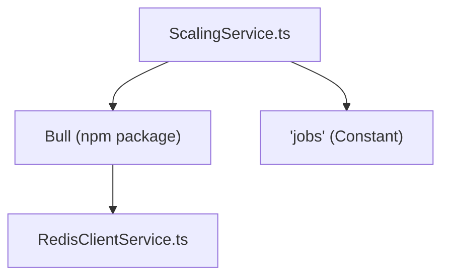
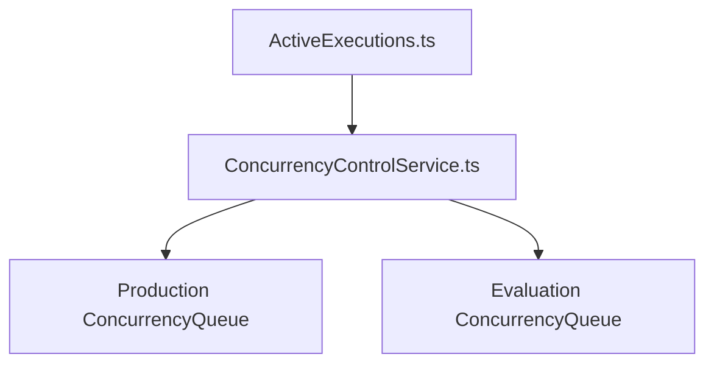

# 分布式执行与扩展 (Distributed Execution and Scaling)

相关源文件

-   [packages/@n8n/backend-common/src/logging/\_\_tests\_\_/logger.test.ts](https://github.com/n8n-io/n8n/blob/88f170b9/packages/@n8n/backend-common/src/logging/__tests__/logger.test.ts)
-   [packages/@n8n/backend-common/src/logging/logger.ts](https://github.com/n8n-io/n8n/blob/88f170b9/packages/@n8n/backend-common/src/logging/logger.ts)
-   [packages/@n8n/benchmark/src/n8n-api-client/n8n-api-client.ts](https://github.com/n8n-io/n8n/blob/88f170b9/packages/@n8n/benchmark/src/n8n-api-client/n8n-api-client.ts)
-   [packages/@n8n/config/src/configs/endpoints.config.ts](https://github.com/n8n-io/n8n/blob/88f170b9/packages/@n8n/config/src/configs/endpoints.config.ts)
-   [packages/@n8n/config/src/configs/executions.config.ts](https://github.com/n8n-io/n8n/blob/88f170b9/packages/@n8n/config/src/configs/executions.config.ts)
-   [packages/@n8n/config/src/configs/scaling-mode.config.ts](https://github.com/n8n-io/n8n/blob/88f170b9/packages/@n8n/config/src/configs/scaling-mode.config.ts)
-   [packages/@n8n/db/src/repositories/\_\_tests\_\_/execution.repository.test.ts](https://github.com/n8n-io/n8n/blob/88f170b9/packages/@n8n/db/src/repositories/__tests__/execution.repository.test.ts)
-   [packages/@n8n/db/src/repositories/execution.repository.ts](https://github.com/n8n-io/n8n/blob/88f170b9/packages/@n8n/db/src/repositories/execution.repository.ts)
-   [packages/@n8n/nodes-langchain/nodes/tools/ToolWorkflow/v2/methods/localResourceMapping.ts](https://github.com/n8n-io/n8n/blob/88f170b9/packages/@n8n/nodes-langchain/nodes/tools/ToolWorkflow/v2/methods/localResourceMapping.ts)
-   [packages/cli/BREAKING-CHANGES.md](https://github.com/n8n-io/n8n/blob/88f170b9/packages/cli/BREAKING-CHANGES.md?plain=1)
-   [packages/cli/src/\_\_tests\_\_/active-executions.test.ts](https://github.com/n8n-io/n8n/blob/88f170b9/packages/cli/src/__tests__/active-executions.test.ts)
-   [packages/cli/src/\_\_tests\_\_/wait-tracker.test.ts](https://github.com/n8n-io/n8n/blob/88f170b9/packages/cli/src/__tests__/wait-tracker.test.ts)
-   [packages/cli/src/\_\_tests\_\_/workflow-execute-additional-data.test.ts](https://github.com/n8n-io/n8n/blob/88f170b9/packages/cli/src/__tests__/workflow-execute-additional-data.test.ts)
-   [packages/cli/src/\_\_tests\_\_/workflow-runner.test.ts](https://github.com/n8n-io/n8n/blob/88f170b9/packages/cli/src/__tests__/workflow-runner.test.ts)
-   [packages/cli/src/abstract-server.ts](https://github.com/n8n-io/n8n/blob/88f170b9/packages/cli/src/abstract-server.ts)
-   [packages/cli/src/active-executions.ts](https://github.com/n8n-io/n8n/blob/88f170b9/packages/cli/src/active-executions.ts)
-   [packages/cli/src/concurrency/\_\_tests\_\_/concurrency-control.service.test.ts](https://github.com/n8n-io/n8n/blob/88f170b9/packages/cli/src/concurrency/__tests__/concurrency-control.service.test.ts)
-   [packages/cli/src/concurrency/\_\_tests\_\_/concurrency-queue.test.ts](https://github.com/n8n-io/n8n/blob/88f170b9/packages/cli/src/concurrency/__tests__/concurrency-queue.test.ts)
-   [packages/cli/src/concurrency/concurrency-control.service.ts](https://github.com/n8n-io/n8n/blob/88f170b9/packages/cli/src/concurrency/concurrency-control.service.ts)
-   [packages/cli/src/concurrency/concurrency-queue.ts](https://github.com/n8n-io/n8n/blob/88f170b9/packages/cli/src/concurrency/concurrency-queue.ts)
-   [packages/cli/src/eventbus/event-message-classes/event-message-node.ts](https://github.com/n8n-io/n8n/blob/88f170b9/packages/cli/src/eventbus/event-message-classes/event-message-node.ts)
-   [packages/cli/src/execution-lifecycle/\_\_tests\_\_/execution-lifecycle-hooks.test.ts](https://github.com/n8n-io/n8n/blob/88f170b9/packages/cli/src/execution-lifecycle/__tests__/execution-lifecycle-hooks.test.ts)
-   [packages/cli/src/execution-lifecycle/execution-lifecycle-hooks.ts](https://github.com/n8n-io/n8n/blob/88f170b9/packages/cli/src/execution-lifecycle/execution-lifecycle-hooks.ts)
-   [packages/cli/src/execution-lifecycle/shared/shared-hook-functions.ts](https://github.com/n8n-io/n8n/blob/88f170b9/packages/cli/src/execution-lifecycle/shared/shared-hook-functions.ts)
-   [packages/cli/src/executions/\_\_tests\_\_/constants.ts](https://github.com/n8n-io/n8n/blob/88f170b9/packages/cli/src/executions/__tests__/constants.ts)
-   [packages/cli/src/executions/\_\_tests\_\_/utils.ts](https://github.com/n8n-io/n8n/blob/88f170b9/packages/cli/src/executions/__tests__/utils.ts)
-   [packages/cli/src/executions/execution-recovery.service.ts](https://github.com/n8n-io/n8n/blob/88f170b9/packages/cli/src/executions/execution-recovery.service.ts)
-   [packages/cli/src/interfaces.ts](https://github.com/n8n-io/n8n/blob/88f170b9/packages/cli/src/interfaces.ts)
-   [packages/cli/src/metrics/\_\_tests\_\_/prometheus-metrics.service.test.ts](https://github.com/n8n-io/n8n/blob/88f170b9/packages/cli/src/metrics/__tests__/prometheus-metrics.service.test.ts)
-   [packages/cli/src/metrics/\_\_tests\_\_/prometheus-metrics.service.unmocked.test.ts](https://github.com/n8n-io/n8n/blob/88f170b9/packages/cli/src/metrics/__tests__/prometheus-metrics.service.unmocked.test.ts)
-   [packages/cli/src/metrics/prometheus-metrics.service.ts](https://github.com/n8n-io/n8n/blob/88f170b9/packages/cli/src/metrics/prometheus-metrics.service.ts)
-   [packages/cli/src/metrics/types.ts](https://github.com/n8n-io/n8n/blob/88f170b9/packages/cli/src/metrics/types.ts)
-   [packages/cli/src/scaling/\_\_tests\_\_/job-processor.service.test.ts](https://github.com/n8n-io/n8n/blob/88f170b9/packages/cli/src/scaling/__tests__/job-processor.service.test.ts)
-   [packages/cli/src/scaling/\_\_tests\_\_/scaling.service.test.ts](https://github.com/n8n-io/n8n/blob/88f170b9/packages/cli/src/scaling/__tests__/scaling.service.test.ts)
-   [packages/cli/src/scaling/\_\_tests\_\_/worker-server.test.ts](https://github.com/n8n-io/n8n/blob/88f170b9/packages/cli/src/scaling/__tests__/worker-server.test.ts)
-   [packages/cli/src/scaling/job-processor.ts](https://github.com/n8n-io/n8n/blob/88f170b9/packages/cli/src/scaling/job-processor.ts)
-   [packages/cli/src/scaling/scaling.service.ts](https://github.com/n8n-io/n8n/blob/88f170b9/packages/cli/src/scaling/scaling.service.ts)
-   [packages/cli/src/scaling/scaling.types.ts](https://github.com/n8n-io/n8n/blob/88f170b9/packages/cli/src/scaling/scaling.types.ts)
-   [packages/cli/src/scaling/worker-server.ts](https://github.com/n8n-io/n8n/blob/88f170b9/packages/cli/src/scaling/worker-server.ts)
-   [packages/cli/src/services/\_\_tests\_\_/redis-client.service.test.ts](https://github.com/n8n-io/n8n/blob/88f170b9/packages/cli/src/services/__tests__/redis-client.service.test.ts)
-   [packages/cli/src/services/redis-client.service.ts](https://github.com/n8n-io/n8n/blob/88f170b9/packages/cli/src/services/redis-client.service.ts)
-   [packages/cli/src/wait-tracker.ts](https://github.com/n8n-io/n8n/blob/88f170b9/packages/cli/src/wait-tracker.ts)
-   [packages/cli/src/webhooks/\_\_tests\_\_/webhook-helpers.test.ts](https://github.com/n8n-io/n8n/blob/88f170b9/packages/cli/src/webhooks/__tests__/webhook-helpers.test.ts)
-   [packages/cli/src/webhooks/webhook-helpers.ts](https://github.com/n8n-io/n8n/blob/88f170b9/packages/cli/src/webhooks/webhook-helpers.ts)
-   [packages/cli/src/workflow-execute-additional-data.ts](https://github.com/n8n-io/n8n/blob/88f170b9/packages/cli/src/workflow-execute-additional-data.ts)
-   [packages/cli/src/workflow-runner.ts](https://github.com/n8n-io/n8n/blob/88f170b9/packages/cli/src/workflow-runner.ts)
-   [packages/cli/src/workflows/\_\_tests\_\_/workflow-execution.service.test.ts](https://github.com/n8n-io/n8n/blob/88f170b9/packages/cli/src/workflows/__tests__/workflow-execution.service.test.ts)
-   [packages/cli/src/workflows/workflow-execution.service.ts](https://github.com/n8n-io/n8n/blob/88f170b9/packages/cli/src/workflows/workflow-execution.service.ts)
-   [packages/cli/src/workflows/workflow.request.ts](https://github.com/n8n-io/n8n/blob/88f170b9/packages/cli/src/workflows/workflow.request.ts)
-   [packages/cli/test/integration/execution.repository.test.ts](https://github.com/n8n-io/n8n/blob/88f170b9/packages/cli/test/integration/execution.repository.test.ts)
-   [packages/cli/test/integration/prometheus-metrics.test.ts](https://github.com/n8n-io/n8n/blob/88f170b9/packages/cli/test/integration/prometheus-metrics.test.ts)
-   [packages/cli/test/integration/shared/db/executions.ts](https://github.com/n8n-io/n8n/blob/88f170b9/packages/cli/test/integration/shared/db/executions.ts)
-   [packages/core/src/execution-engine/node-execution-context/\_\_tests\_\_/local-load-options-context.test.ts](https://github.com/n8n-io/n8n/blob/88f170b9/packages/core/src/execution-engine/node-execution-context/__tests__/local-load-options-context.test.ts)
-   [packages/core/src/execution-engine/node-execution-context/local-load-options-context.ts](https://github.com/n8n-io/n8n/blob/88f170b9/packages/core/src/execution-engine/node-execution-context/local-load-options-context.ts)
-   [packages/frontend/editor-ui/src/app/composables/useBackendStatus.spec.ts](https://github.com/n8n-io/n8n/blob/88f170b9/packages/frontend/editor-ui/src/app/composables/useBackendStatus.spec.ts)
-   [packages/frontend/editor-ui/src/app/composables/useBackendStatus.ts](https://github.com/n8n-io/n8n/blob/88f170b9/packages/frontend/editor-ui/src/app/composables/useBackendStatus.ts)
-   [packages/nodes-base/nodes/ExecuteWorkflow/ExecuteWorkflow/ExecuteWorkflow.node.json](https://github.com/n8n-io/n8n/blob/88f170b9/packages/nodes-base/nodes/ExecuteWorkflow/ExecuteWorkflow/ExecuteWorkflow.node.json)
-   [packages/nodes-base/nodes/ExecuteWorkflow/ExecuteWorkflow/ExecuteWorkflow.node.test.ts](https://github.com/n8n-io/n8n/blob/88f170b9/packages/nodes-base/nodes/ExecuteWorkflow/ExecuteWorkflow/ExecuteWorkflow.node.test.ts)
-   [packages/nodes-base/nodes/ExecuteWorkflow/ExecuteWorkflow/ExecuteWorkflow.node.ts](https://github.com/n8n-io/n8n/blob/88f170b9/packages/nodes-base/nodes/ExecuteWorkflow/ExecuteWorkflow/ExecuteWorkflow.node.ts)
-   [packages/nodes-base/nodes/ExecuteWorkflow/ExecuteWorkflow/methods/localResourceMapping.ts](https://github.com/n8n-io/n8n/blob/88f170b9/packages/nodes-base/nodes/ExecuteWorkflow/ExecuteWorkflow/methods/localResourceMapping.ts)
-   [packages/nodes-base/nodes/ExecuteWorkflow/ExecuteWorkflowTrigger/ExecuteWorkflowTrigger.node.test.ts](https://github.com/n8n-io/n8n/blob/88f170b9/packages/nodes-base/nodes/ExecuteWorkflow/ExecuteWorkflowTrigger/ExecuteWorkflowTrigger.node.test.ts)
-   [packages/nodes-base/nodes/ExecuteWorkflow/ExecuteWorkflowTrigger/ExecuteWorkflowTrigger.node.ts](https://github.com/n8n-io/n8n/blob/88f170b9/packages/nodes-base/nodes/ExecuteWorkflow/ExecuteWorkflowTrigger/ExecuteWorkflowTrigger.node.ts)
-   [packages/nodes-base/utils/workflow-backtracking.test.ts](https://github.com/n8n-io/n8n/blob/88f170b9/packages/nodes-base/utils/workflow-backtracking.test.ts)
-   [packages/nodes-base/utils/workflow-backtracking.ts](https://github.com/n8n-io/n8n/blob/88f170b9/packages/nodes-base/utils/workflow-backtracking.ts)
-   [packages/nodes-base/utils/workflowInputsResourceMapping/GenericFunctions.ts](https://github.com/n8n-io/n8n/blob/88f170b9/packages/nodes-base/utils/workflowInputsResourceMapping/GenericFunctions.ts)
-   [packages/nodes-base/utils/workflowInputsResourceMapping/\_\_tests\_\_/GenericFunctions.test.ts](https://github.com/n8n-io/n8n/blob/88f170b9/packages/nodes-base/utils/workflowInputsResourceMapping/__tests__/GenericFunctions.test.ts)
-   [packages/testing/playwright/pages/ExecutionsPage.ts](https://github.com/n8n-io/n8n/blob/88f170b9/packages/testing/playwright/pages/ExecutionsPage.ts)
-   [packages/testing/playwright/tests/e2e/settings/users/users.spec.ts](https://github.com/n8n-io/n8n/blob/88f170b9/packages/testing/playwright/tests/e2e/settings/users/users.spec.ts)
-   [packages/testing/playwright/tests/e2e/workflows/executions/list.spec.ts](https://github.com/n8n-io/n8n/blob/88f170b9/packages/testing/playwright/tests/e2e/workflows/executions/list.spec.ts)
-   [packages/testing/playwright/workflows/cat-1854-wait-execution-history.json](https://github.com/n8n-io/n8n/blob/88f170b9/packages/testing/playwright/workflows/cat-1854-wait-execution-history.json)
-   [packages/testing/playwright/workflows/webhook-misconfiguration-test.json](https://github.com/n8n-io/n8n/blob/88f170b9/packages/testing/playwright/workflows/webhook-misconfiguration-test.json)

## 目的与范围

本文档涵盖了 n8n 的分布式执行架构，该架构通过将工作流执行分配到多个 Worker 进程来实现水平扩展。这包括基于队列的执行系统、Bull/Redis 集成、Worker 协同、并发控制以及主进程与 Worker 进程之间的通信模式。

有关单个进程内工作流执行生命周期的信息，请参阅 **工作流执行生命周期 (Workflow Execution Lifecycle) (2.1)**。有关包括进程类型在内的整体运行时架构的详细信息，请参阅 **运行时架构与进程模型 (Runtime Architecture and Process Models) (1.2)**。

---

## 执行模式概览

n8n 支持两种主要的执行模式，用于决定如何处理工作流执行：

| 模式 | 描述 | 使用场景 |
| --- | --- | --- |
| **Regular (常规)** | 工作流直接在主进程中执行 | 单实例部署、开发环境 |
| **Queue (队列)** | 工作流被加入 Redis 队列并由 Worker 实例处理 | 需要水平扩展的生产部署 |

执行模式由 `EXECUTIONS_MODE` 环境变量决定，并通过 `ExecutionsConfig.mode` 进行访问 [packages/cli/src/workflow-runner.ts95](https://github.com/n8n-io/n8n/blob/88f170b9/packages/cli/src/workflow-runner.ts#L95-L95)

### WorkflowRunner 中的模式选择

当调用 `WorkflowRunner.run()` 时，它会根据配置和执行模式（手动与自动）决定是入队还是直接执行 [packages/cli/src/workflow-runner.ts173-176](https://github.com/n8n-io/n8n/blob/88f170b9/packages/cli/src/workflow-runner.ts#L173-L176)

```
const shouldEnqueue =    process.env.OFFLOAD_MANUAL_EXECUTIONS_TO_WORKERS === 'true'        ? this.executionsConfig.mode === 'queue'        : this.executionsConfig.mode === 'queue' && data.executionMode !== 'manual';
```
数据源: [packages/cli/src/workflow-runner.ts95-108](https://github.com/n8n-io/n8n/blob/88f170b9/packages/cli/src/workflow-runner.ts#L95-L108) [packages/cli/src/workflow-runner.ts173-189](https://github.com/n8n-io/n8n/blob/88f170b9/packages/cli/src/workflow-runner.ts#L173-L189)

---

## 基于队列的架构

### Bull 队列与 Redis

n8n 使用 [Bull](https://github.com/n8n-io/n8n/blob/88f170b9/Bull)（一个基于 Redis 的任务队列）来协调分布式执行。队列基础设施由 `ScalingService` 管理 [packages/cli/src/scaling/scaling.service.ts40-41](https://github.com/n8n-io/n8n/blob/88f170b9/packages/cli/src/scaling/scaling.service.ts#L40-L41)

**队列初始化**

`ScalingService.setupQueue()` 方法使用 `RedisClientService` 初始化 Bull 实例，以确保一致的前缀和连接管理 [packages/cli/src/scaling/scaling.service.ts60-75](https://github.com/n8n-io/n8n/blob/88f170b9/packages/cli/src/scaling/scaling.service.ts#L60-L75)


数据源: [packages/cli/src/scaling/scaling.service.ts60-75](https://github.com/n8n-io/n8n/blob/88f170b9/packages/cli/src/scaling/scaling.service.ts#L60-L75) [packages/cli/src/scaling/scaling.service.ts24](https://github.com/n8n-io/n8n/blob/88f170b9/packages/cli/src/scaling/scaling.service.ts#L24-L24)

### 任务数据结构

队列中的每个任务都携带 `JobData`，其中包含 Worker 重建执行所需的上下文 [packages/cli/src/scaling/scaling.types.ts17-23](https://github.com/n8n-io/n8n/blob/88f170b9/packages/cli/src/scaling/scaling.types.ts#L17-L23)

| 字段 | 类型 | 描述 |
| --- | --- | --- |
| `executionId` | string | 数据库中唯一的执行标识符 |
| `workflowId` | string | 要执行的工作流 ID |
| `loadStaticData` | boolean | 如果为 true，Worker 将从数据库重新加载静态数据 |
| `pushRef` | string? | UI 推送更新的引用 |

数据源: [packages/cli/src/scaling/scaling.types.ts17-30](https://github.com/n8n-io/n8n/blob/88f170b9/packages/cli/src/scaling/scaling.types.ts#L17-L30)

### 任务生命周期与数据流

> **[Mermaid sequence]**
> *(图表结构无法解析)*

数据源: [packages/cli/src/workflow-runner.ts139-189](https://github.com/n8n-io/n8n/blob/88f170b9/packages/cli/src/workflow-runner.ts#L139-L189) [packages/cli/src/scaling/job-processor.ts72-104](https://github.com/n8n-io/n8n/blob/88f170b9/packages/cli/src/scaling/job-processor.ts#L72-L104) [packages/cli/src/scaling/scaling.service.ts111-134](https://github.com/n8n-io/n8n/blob/88f170b9/packages/cli/src/scaling/scaling.service.ts#L111-L134)

---

## 主进程职责

### 执行入队

`WorkflowRunner.enqueueExecution()` 方法构建 `JobData` 并通过 `ScalingService.addJob()` 将其添加到队列中 [packages/cli/src/workflow-runner.ts370-410](https://github.com/n8n-io/n8n/blob/88f170b9/packages/cli/src/workflow-runner.ts#L370-L410)

**优先级逻辑:**

-   **Realtime (实时，如 Manual/Chat):** 优先级 50 (较高)
-   **Standard (标准，如 Triggers):** 优先级 100 (较低)

数据源: [packages/cli/src/workflow-runner.ts396](https://github.com/n8n-io/n8n/blob/88f170b9/packages/cli/src/workflow-runner.ts#L396-L396) [packages/cli/src/scaling/scaling.service.ts226-235](https://github.com/n8n-io/n8n/blob/88f170b9/packages/cli/src/scaling/scaling.service.ts#L226-L235)

### 监听 Worker 进度

主实例（以及 Webhook 实例）注册 `global:progress` 事件监听器。这允许它们响应远程 Worker 上发生的事件 [packages/cli/src/scaling/scaling.service.ts300-305](https://github.com/n8n-io/n8n/blob/88f170b9/packages/cli/src/scaling/scaling.service.ts#L300-L305)

**ScalingService 中的消息处理程序:**

-   `send-chunk`: 将流式数据转发到 UI [packages/cli/src/scaling/scaling.service.ts312-314](https://github.com/n8n-io/n8n/blob/88f170b9/packages/cli/src/scaling/scaling.service.ts#L312-L314)
-   `respond-to-webhook`: 使用 Worker 生成的数据，在主进程中解析挂起的 HTTP 请求 [packages/cli/src/scaling/scaling.service.ts316-320](https://github.com/n8n-io/n8n/blob/88f170b9/packages/cli/src/scaling/scaling.service.ts#L316-L320)
-   `job-finished`: 清理本地 `ActiveExecutions` 状态 [packages/cli/src/scaling/scaling.service.ts340-345](https://github.com/n8n-io/n8n/blob/88f170b9/packages/cli/src/scaling/scaling.service.ts#L340-L345)

数据源: [packages/cli/src/scaling/scaling.service.ts300-370](https://github.com/n8n-io/n8n/blob/88f170b9/packages/cli/src/scaling/scaling.service.ts#L300-L370)

### 队列恢复

主领导实例 (Leader Main Instance) 定期运行 `recoverFromQueue()` 来处理“悬挂”执行（在数据库中标记为 `running` 但在 Redis 中不存在的执行） [packages/cli/src/scaling/scaling.service.ts458-470](https://github.com/n8n-io/n8n/blob/88f170b9/packages/cli/src/scaling/scaling.service.ts#L458-L470)

**恢复机制:**

1.  从 `ExecutionRepository` 获取 `running` 或 `new` 状态的执行 [packages/cli/src/scaling/scaling.service.ts492-495](https://github.com/n8n-io/n8n/blob/88f170b9/packages/cli/src/scaling/scaling.service.ts#L492-L495)
2.  与 Bull 中的活动任务进行比较 [packages/cli/src/scaling/scaling.service.ts503](https://github.com/n8n-io/n8n/blob/88f170b9/packages/cli/src/scaling/scaling.service.ts#L503-L503)
3.  如果执行存在于数据库中但不存在于队列中，则将其标记为 `crashed` (已崩溃) [packages/cli/src/scaling/scaling.service.ts517-520](https://github.com/n8n-io/n8n/blob/88f170b9/packages/cli/src/scaling/scaling.service.ts#L517-L520)

数据源: [packages/cli/src/scaling/scaling.service.ts490-523](https://github.com/n8n-io/n8n/blob/88f170b9/packages/cli/src/scaling/scaling.service.ts#L490-L523) [packages/cli/src/executions/execution-recovery.service.ts32-43](https://github.com/n8n-io/n8n/blob/88f170b9/packages/cli/src/executions/execution-recovery.service.ts#L32-L43)

---

## Worker 进程职责

### JobProcessor 中的任务处理

`JobProcessor` 是 Worker 进程的核心引擎。收到任务后，它会执行以下步骤 [packages/cli/src/scaling/job-processor.ts72-150](https://github.com/n8n-io/n8n/blob/88f170b9/packages/cli/src/scaling/job-processor.ts#L72-L150)：

1.  **Hydration (数据填充)**: 从 `ExecutionRepository` 获取完整的执行数据 [packages/cli/src/scaling/job-processor.ts75-78](https://github.com/n8n-io/n8n/blob/88f170b9/packages/cli/src/scaling/job-processor.ts#L75-L78)
2.  **Static Data (静态数据)**: 如果有要求，从 `WorkflowRepository` 重新加载 `staticData` [packages/cli/src/scaling/job-processor.ts108-121](https://github.com/n8n-io/n8n/blob/88f170b9/packages/cli/src/scaling/job-processor.ts#L108-L121)
3.  **Timeout Logic (超时逻辑)**: 根据工作流设置或全局配置计算执行超时 [packages/cli/src/scaling/job-processor.ts125-132](https://github.com/n8n-io/n8n/blob/88f170b9/packages/cli/src/scaling/job-processor.ts#L125-L132)
4.  **Lifecycle Hooks (生命周期钩子)**: 初始化 `getLifecycleHooksForScalingWorker` 以处理远程通信 [packages/cli/src/scaling/job-processor.ts155-165](https://github.com/n8n-io/n8n/blob/88f170b9/packages/cli/src/scaling/job-processor.ts#L155-L165)

### 远程钩子处理程序

Worker 使用专门的钩子通过 Redis 进度更新向主进程进行“回调”：

-   **sendResponse**: Webhook 节点用于将数据发送回主进程/Webhook 进程上等待的 HTTP 请求 [packages/cli/src/scaling/job-processor.ts172-198](https://github.com/n8n-io/n8n/blob/88f170b9/packages/cli/src/scaling/job-processor.ts#L172-L198)
-   **sendChunk**: 用于流式传输 AI/LLM 响应 [packages/cli/src/scaling/job-processor.ts200-209](https://github.com/n8n-io/n8n/blob/88f170b9/packages/cli/src/scaling/job-processor.ts#L200-L209)

数据源: [packages/cli/src/scaling/job-processor.ts172-209](https://github.com/n8n-io/n8n/blob/88f170b9/packages/cli/src/scaling/job-processor.ts#L172-L209) [packages/cli/src/execution-lifecycle/execution-lifecycle-hooks.ts331-392](https://github.com/n8n-io/n8n/blob/88f170b9/packages/cli/src/execution-lifecycle/execution-lifecycle-hooks.ts#L331-L392)

---

## 并发控制 (Concurrency Control)

n8n 实现了一种节流机制来限制同时进行的执行，主要用于 **Regular (常规) 模式**。

### ConcurrencyControlService

`ConcurrencyControlService` 管理两个队列：`production` (生产) 和 `evaluation` (评估) [packages/cli/src/concurrency/concurrency-control.service.ts26-34](https://github.com/n8n-io/n8n/blob/88f170b9/packages/cli/src/concurrency/concurrency-control.service.ts#L26-L34)

-   **Production (生产)**: 基于触发器的执行。
-   **Evaluation (评估)**: 手动“测试工作流 (Test Workflow)”执行。


**注意:** 在 `queue` (队列) 模式下，并发主要通过 Worker 进程的数量以及传递给 `setupWorker(concurrency)` 的 Bull 并发设置来管理 [packages/cli/src/scaling/scaling.service.ts111-115](https://github.com/n8n-io/n8n/blob/88f170b9/packages/cli/src/scaling/scaling.service.ts#L111-L115)

数据源: [packages/cli/src/concurrency/concurrency-control.service.ts15-77](https://github.com/n8n-io/n8n/blob/88f170b9/packages/cli/src/concurrency/concurrency-control.service.ts#L15-L77) [packages/cli/src/concurrency/concurrency-queue.ts1-30](https://github.com/n8n-io/n8n/blob/88f170b9/packages/cli/src/concurrency/concurrency-queue.ts#L1-L30)

---

## 编排与多主模式 (Orchestration and Multi-Main)

### 领导选举 (Leader Election)

在多主设置中，n8n 使用领导选举来确保单例任务（如队列恢复）仅在一个实例上运行 [packages/cli/src/scaling/scaling.service.ts79](https://github.com/n8n-io/n8n/blob/88f170b9/packages/cli/src/scaling/scaling.service.ts#L79-L79)

-   **InstanceSettings**: 跟踪当前进程是否为领导者 [packages/cli/src/scaling/scaling.service.ts79](https://github.com/n8n-io/n8n/blob/88f170b9/packages/cli/src/scaling/scaling.service.ts#L79-L79)
-   **装饰器 (Decorators)**: `@OnLeaderTakeover` 和 `@OnLeaderStepdown` 用于启动/停止恢复调度程序 [packages/cli/src/scaling/scaling.service.ts5](https://github.com/n8n-io/n8n/blob/88f170b9/packages/cli/src/scaling/scaling.service.ts#L5-L5)

数据源: [packages/cli/src/scaling/scaling.service.ts79-81](https://github.com/n8n-io/n8n/blob/88f170b9/packages/cli/src/scaling/scaling.service.ts#L79-L81) [packages/cli/src/scaling/scaling.service.ts474-488](https://github.com/n8n-io/n8n/blob/88f170b9/packages/cli/src/scaling/scaling.service.ts#L474-L488)

### 优雅停机 (Graceful Shutdown)

在停机期间，`ScalingService` 确保任务不会丢失 [packages/cli/src/scaling/scaling.service.ts163-169](https://github.com/n8n-io/n8n/blob/88f170b9/packages/cli/src/scaling/scaling.service.ts#L163-L169)：

1.  **Main (主进程)**: 暂停队列并停止恢复定时器 [packages/cli/src/scaling/scaling.service.ts176-181](https://github.com/n8n-io/n8n/blob/88f170b9/packages/cli/src/scaling/scaling.service.ts#L176-L181)
2.  **Worker (工作进程)**: 暂停队列并在退出前等待所有 `runningJobs` (运行中的任务) 归零 [packages/cli/src/scaling/scaling.service.ts183-197](https://github.com/n8n-io/n8n/blob/88f170b9/packages/cli/src/scaling/scaling.service.ts#L183-L197)

数据源: [packages/cli/src/scaling/scaling.service.ts163-197](https://github.com/n8n-io/n8n/blob/88f170b9/packages/cli/src/scaling/scaling.service.ts#L163-L197) [packages/cli/src/scaling/job-processor.ts57](https://github.com/n8n-io/n8n/blob/88f170b9/packages/cli/src/scaling/job-processor.ts#L57-L57)
