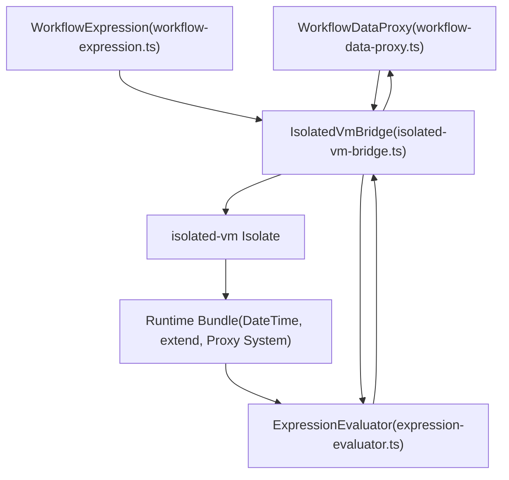
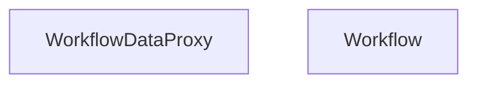
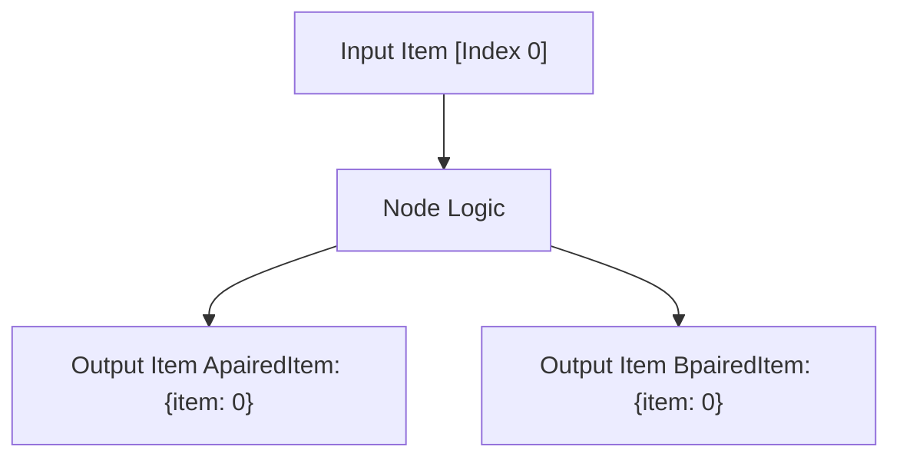

# 工作流数据访问与表达式系统 (Workflow Data Access and Expression System)

相关源文件

-   [packages/@n8n/expression-runtime/ARCHITECTURE.md](https://github.com/n8n-io/n8n/blob/88f170b9/packages/@n8n/expression-runtime/ARCHITECTURE.md?plain=1)
-   [packages/@n8n/expression-runtime/README.md](https://github.com/n8n-io/n8n/blob/88f170b9/packages/@n8n/expression-runtime/README.md?plain=1)
-   [packages/@n8n/expression-runtime/docs/architecture-diagram.mmd](https://github.com/n8n-io/n8n/blob/88f170b9/packages/@n8n/expression-runtime/docs/architecture-diagram.mmd)
-   [packages/@n8n/expression-runtime/docs/deep-lazy-proxy.md](https://github.com/n8n-io/n8n/blob/88f170b9/packages/@n8n/expression-runtime/docs/deep-lazy-proxy.md?plain=1)
-   [packages/@n8n/expression-runtime/docs/implementation-phases.md](https://github.com/n8n-io/n8n/blob/88f170b9/packages/@n8n/expression-runtime/docs/implementation-phases.md?plain=1)
-   [packages/@n8n/expression-runtime/esbuild.config.js](https://github.com/n8n-io/n8n/blob/88f170b9/packages/@n8n/expression-runtime/esbuild.config.js)
-   [packages/@n8n/expression-runtime/package.json](https://github.com/n8n-io/n8n/blob/88f170b9/packages/@n8n/expression-runtime/package.json)
-   [packages/@n8n/expression-runtime/src/\_\_tests\_\_/integration.test.ts](https://github.com/n8n-io/n8n/blob/88f170b9/packages/@n8n/expression-runtime/src/__tests__/integration.test.ts)
-   [packages/@n8n/expression-runtime/src/bridge/isolated-vm-bridge.ts](https://github.com/n8n-io/n8n/blob/88f170b9/packages/@n8n/expression-runtime/src/bridge/isolated-vm-bridge.ts)
-   [packages/@n8n/expression-runtime/src/evaluator/\_\_tests\_\_/expression-evaluator-cache.test.ts](https://github.com/n8n-io/n8n/blob/88f170b9/packages/@n8n/expression-runtime/src/evaluator/__tests__/expression-evaluator-cache.test.ts)
-   [packages/@n8n/expression-runtime/src/evaluator/\_\_tests\_\_/lru-cache.test.ts](https://github.com/n8n-io/n8n/blob/88f170b9/packages/@n8n/expression-runtime/src/evaluator/__tests__/lru-cache.test.ts)
-   [packages/@n8n/expression-runtime/src/evaluator/expression-evaluator.ts](https://github.com/n8n-io/n8n/blob/88f170b9/packages/@n8n/expression-runtime/src/evaluator/expression-evaluator.ts)
-   [packages/@n8n/expression-runtime/src/evaluator/lru-cache.ts](https://github.com/n8n-io/n8n/blob/88f170b9/packages/@n8n/expression-runtime/src/evaluator/lru-cache.ts)
-   [packages/@n8n/expression-runtime/src/extensions/\_\_tests\_\_/string-extensions.test.ts](https://github.com/n8n-io/n8n/blob/88f170b9/packages/@n8n/expression-runtime/src/extensions/__tests__/string-extensions.test.ts)
-   [packages/@n8n/expression-runtime/src/extensions/array-extensions.ts](https://github.com/n8n-io/n8n/blob/88f170b9/packages/@n8n/expression-runtime/src/extensions/array-extensions.ts)
-   [packages/@n8n/expression-runtime/src/extensions/boolean-extensions.ts](https://github.com/n8n-io/n8n/blob/88f170b9/packages/@n8n/expression-runtime/src/extensions/boolean-extensions.ts)
-   [packages/@n8n/expression-runtime/src/extensions/date-extensions.ts](https://github.com/n8n-io/n8n/blob/88f170b9/packages/@n8n/expression-runtime/src/extensions/date-extensions.ts)
-   [packages/@n8n/expression-runtime/src/extensions/expression-extension-error.ts](https://github.com/n8n-io/n8n/blob/88f170b9/packages/@n8n/expression-runtime/src/extensions/expression-extension-error.ts)
-   [packages/@n8n/expression-runtime/src/extensions/extend.ts](https://github.com/n8n-io/n8n/blob/88f170b9/packages/@n8n/expression-runtime/src/extensions/extend.ts)
-   [packages/@n8n/expression-runtime/src/extensions/extensions.ts](https://github.com/n8n-io/n8n/blob/88f170b9/packages/@n8n/expression-runtime/src/extensions/extensions.ts)
-   [packages/@n8n/expression-runtime/src/extensions/function-extensions.ts](https://github.com/n8n-io/n8n/blob/88f170b9/packages/@n8n/expression-runtime/src/extensions/function-extensions.ts)
-   [packages/@n8n/expression-runtime/src/extensions/number-extensions.ts](https://github.com/n8n-io/n8n/blob/88f170b9/packages/@n8n/expression-runtime/src/extensions/number-extensions.ts)
-   [packages/@n8n/expression-runtime/src/extensions/object-extensions.ts](https://github.com/n8n-io/n8n/blob/88f170b9/packages/@n8n/expression-runtime/src/extensions/object-extensions.ts)
-   [packages/@n8n/expression-runtime/src/extensions/string-extensions.ts](https://github.com/n8n-io/n8n/blob/88f170b9/packages/@n8n/expression-runtime/src/extensions/string-extensions.ts)
-   [packages/@n8n/expression-runtime/src/index.ts](https://github.com/n8n-io/n8n/blob/88f170b9/packages/@n8n/expression-runtime/src/index.ts)
-   [packages/@n8n/expression-runtime/src/runtime/\_\_tests\_\_/lazy-proxy.test.ts](https://github.com/n8n-io/n8n/blob/88f170b9/packages/@n8n/expression-runtime/src/runtime/__tests__/lazy-proxy.test.ts)
-   [packages/@n8n/expression-runtime/src/runtime/index.ts](https://github.com/n8n-io/n8n/blob/88f170b9/packages/@n8n/expression-runtime/src/runtime/index.ts)
-   [packages/@n8n/expression-runtime/src/runtime/lazy-proxy.ts](https://github.com/n8n-io/n8n/blob/88f170b9/packages/@n8n/expression-runtime/src/runtime/lazy-proxy.ts)
-   [packages/@n8n/expression-runtime/src/runtime/reset.ts](https://github.com/n8n-io/n8n/blob/88f170b9/packages/@n8n/expression-runtime/src/runtime/reset.ts)
-   [packages/@n8n/expression-runtime/src/runtime/safe-globals.ts](https://github.com/n8n-io/n8n/blob/88f170b9/packages/@n8n/expression-runtime/src/runtime/safe-globals.ts)
-   [packages/@n8n/expression-runtime/src/runtime/serialize.ts](https://github.com/n8n-io/n8n/blob/88f170b9/packages/@n8n/expression-runtime/src/runtime/serialize.ts)
-   [packages/@n8n/expression-runtime/src/types/bridge.ts](https://github.com/n8n-io/n8n/blob/88f170b9/packages/@n8n/expression-runtime/src/types/bridge.ts)
-   [packages/@n8n/expression-runtime/src/types/evaluator.ts](https://github.com/n8n-io/n8n/blob/88f170b9/packages/@n8n/expression-runtime/src/types/evaluator.ts)
-   [packages/@n8n/expression-runtime/src/types/index.ts](https://github.com/n8n-io/n8n/blob/88f170b9/packages/@n8n/expression-runtime/src/types/index.ts)
-   [packages/@n8n/expression-runtime/src/types/runtime.ts](https://github.com/n8n-io/n8n/blob/88f170b9/packages/@n8n/expression-runtime/src/types/runtime.ts)
-   [packages/cli/bin/n8n](https://github.com/n8n-io/n8n/blob/88f170b9/packages/cli/bin/n8n)
-   [packages/cli/src/commands/audit.ts](https://github.com/n8n-io/n8n/blob/88f170b9/packages/cli/src/commands/audit.ts)
-   [packages/cli/src/services/cache/cache.types.ts](https://github.com/n8n-io/n8n/blob/88f170b9/packages/cli/src/services/cache/cache.types.ts)
-   [packages/core/src/execution-engine/partial-execution-utils/\_\_tests\_\_/clean-run-data.test.ts](https://github.com/n8n-io/n8n/blob/88f170b9/packages/core/src/execution-engine/partial-execution-utils/__tests__/clean-run-data.test.ts)
-   [packages/core/src/execution-engine/partial-execution-utils/clean-run-data.ts](https://github.com/n8n-io/n8n/blob/88f170b9/packages/core/src/execution-engine/partial-execution-utils/clean-run-data.ts)
-   [packages/frontend/editor-ui/vite/expression-runtime-stub.ts](https://github.com/n8n-io/n8n/blob/88f170b9/packages/frontend/editor-ui/vite/expression-runtime-stub.ts)
-   [packages/testing/performance/benchmarks/expression-engine/fixtures/data.ts](https://github.com/n8n-io/n8n/blob/88f170b9/packages/testing/performance/benchmarks/expression-engine/fixtures/data.ts)
-   [packages/workflow/src/errors/expression.error.ts](https://github.com/n8n-io/n8n/blob/88f170b9/packages/workflow/src/errors/expression.error.ts)
-   [packages/workflow/src/expression.ts](https://github.com/n8n-io/n8n/blob/88f170b9/packages/workflow/src/expression.ts)
-   [packages/workflow/src/extensions/extended-functions.ts](https://github.com/n8n-io/n8n/blob/88f170b9/packages/workflow/src/extensions/extended-functions.ts)
-   [packages/workflow/src/workflow-data-proxy.ts](https://github.com/n8n-io/n8n/blob/88f170b9/packages/workflow/src/workflow-data-proxy.ts)
-   [packages/workflow/src/workflow.ts](https://github.com/n8n-io/n8n/blob/88f170b9/packages/workflow/src/workflow.ts)
-   [packages/workflow/test/ExpressionExtensions/array-extensions.test.ts](https://github.com/n8n-io/n8n/blob/88f170b9/packages/workflow/test/ExpressionExtensions/array-extensions.test.ts)
-   [packages/workflow/test/ExpressionExtensions/date-extensions.test.ts](https://github.com/n8n-io/n8n/blob/88f170b9/packages/workflow/test/ExpressionExtensions/date-extensions.test.ts)
-   [packages/workflow/test/ExpressionExtensions/helpers.ts](https://github.com/n8n-io/n8n/blob/88f170b9/packages/workflow/test/ExpressionExtensions/helpers.ts)
-   [packages/workflow/test/ExpressionExtensions/object-extensions.test.ts](https://github.com/n8n-io/n8n/blob/88f170b9/packages/workflow/test/ExpressionExtensions/object-extensions.test.ts)
-   [packages/workflow/test/ExpressionExtensions/string-extensions.test.ts](https://github.com/n8n-io/n8n/blob/88f170b9/packages/workflow/test/ExpressionExtensions/string-extensions.test.ts)
-   [packages/workflow/test/expression.test.ts](https://github.com/n8n-io/n8n/blob/88f170b9/packages/workflow/test/expression.test.ts)
-   [packages/workflow/test/fixtures/WorkflowDataProxy/agentInfo\_run.json](https://github.com/n8n-io/n8n/blob/88f170b9/packages/workflow/test/fixtures/WorkflowDataProxy/agentInfo_run.json)
-   [packages/workflow/test/fixtures/WorkflowDataProxy/agentInfo\_workflow.json](https://github.com/n8n-io/n8n/blob/88f170b9/packages/workflow/test/fixtures/WorkflowDataProxy/agentInfo_workflow.json)
-   [packages/workflow/test/fixtures/WorkflowDataProxy/memory\_with\_disconnected\_tool\_run.json](https://github.com/n8n-io/n8n/blob/88f170b9/packages/workflow/test/fixtures/WorkflowDataProxy/memory_with_disconnected_tool_run.json)
-   [packages/workflow/test/fixtures/WorkflowDataProxy/memory\_with\_disconnected\_tool\_workflow.json](https://github.com/n8n-io/n8n/blob/88f170b9/packages/workflow/test/fixtures/WorkflowDataProxy/memory_with_disconnected_tool_workflow.json)
-   [packages/workflow/test/fixtures/WorkflowDataProxy/multiple\_inputs\_run.json](https://github.com/n8n-io/n8n/blob/88f170b9/packages/workflow/test/fixtures/WorkflowDataProxy/multiple_inputs_run.json)
-   [packages/workflow/test/fixtures/WorkflowDataProxy/multiple\_inputs\_workflow.json](https://github.com/n8n-io/n8n/blob/88f170b9/packages/workflow/test/fixtures/WorkflowDataProxy/multiple_inputs_workflow.json)
-   [packages/workflow/test/workflow-data-proxy.test.ts](https://github.com/n8n-io/n8n/blob/88f170b9/packages/workflow/test/workflow-data-proxy.test.ts)
-   [packages/workflow/test/workflow.test.ts](https://github.com/n8n-io/n8n/blob/88f170b9/packages/workflow/test/workflow.test.ts)

## 目的与范围

本文档详细介绍了工作流在执行期间如何访问和操作数据。它涵盖了抽象节点数据的 `WorkflowDataProxy` 系统、带有 `isolated-vm` 沙箱的高性能 `expression-runtime` 包，以及提供给节点的 `WorkflowExecuteAdditionalData` 上下文。

有关整体执行生命周期和 `WorkflowRunner` 的信息，请参阅 [工作流执行生命周期 (Workflow Execution Lifecycle)](https://github.com/n8n-io/n8n/blob/88f170b9/Workflow Execution Lifecycle)。有关分布式执行模式，请参阅 [分布式执行与扩展 (Distributed Execution and Scaling)](https://github.com/n8n-io/n8n/blob/88f170b9/Distributed Execution and Scaling)。

---

## 表达式语言架构

n8n 使用模板表达式语言，允许工作流使用 `{{ }}` 语法动态引用数据。在现代版本中，这由专用的 `@n8n/expression-runtime` 包提供支持，该包提供安全、沙箱化的评估环境。

### 表达式评估流程

**关键组件**

-   **WorkflowDataProxy**: 作为表达式的“真相来源 (Source of Truth)”。它通过查找 `runExecutionData` 或 `connectionInputData` 来解析类似于 `$json.email` 的路径 [packages/workflow/src/workflow-data-proxy.ts55-78](https://github.com/n8n-io/n8n/blob/88f170b9/packages/workflow/src/workflow-data-proxy.ts#L55-L78)
-   **IsolatedVmBridge**: 管理一个 V8 `isolated-vm` 实例。它处理主 Node.js 进程与沙箱之间内存边界的数据传输 [packages/@n8n/expression-runtime/src/bridge/isolated-vm-bridge.ts55-86](https://github.com/n8n-io/n8n/blob/88f170b9/packages/@n8n/expression-runtime/src/bridge/isolated-vm-bridge.ts#L55-L86)
-   **ExpressionEvaluator**: 在沙箱中编译并执行 `{{ }}` 块内的 JavaScript [packages/@n8n/expression-runtime/src/evaluator/expression-evaluator.ts16-30](https://github.com/n8n-io/n8n/blob/88f170b9/packages/@n8n/expression-runtime/src/evaluator/expression-evaluator.ts#L16-L30)

数据源: [packages/workflow/src/workflow-data-proxy.ts55-91](https://github.com/n8n-io/n8n/blob/88f170b9/packages/workflow/src/workflow-data-proxy.ts#L55-L91) [packages/@n8n/expression-runtime/src/bridge/isolated-vm-bridge.ts55-134](https://github.com/n8n-io/n8n/blob/88f170b9/packages/@n8n/expression-runtime/src/bridge/isolated-vm-bridge.ts#L55-L134) [packages/workflow/src/expression.ts176-208](https://github.com/n8n-io/n8n/blob/88f170b9/packages/workflow/src/expression.ts#L176-L208)

---

## WorkflowDataProxy 系统

`WorkflowDataProxy` 负责为节点和表达式提供工作流上下文的访问权限。它使用 JavaScript Proxy 仅在请求时惰性解析数据。

### 数据解析逻辑

Proxy 处理多个命名空间：

-   **$json / $binary**: 访问当前正在处理的条目数据 [packages/workflow/src/workflow-data-proxy.ts102-111](https://github.com/n8n-io/n8n/blob/88f170b9/packages/workflow/src/workflow-data-proxy.ts#L102-L111)
-   **$node\["Node Name"\]**: 访问特定命名节点的数据 [packages/workflow/src/workflow-data-proxy.ts119-166](https://github.com/n8n-io/n8n/blob/88f170b9/packages/workflow/src/workflow-data-proxy.ts#L119-L166)
-   **$parameter**: 访问活动节点的参数 [packages/workflow/src/workflow-data-proxy.ts70-71](https://github.com/n8n-io/n8n/blob/88f170b9/packages/workflow/src/workflow-data-proxy.ts#L70-L71)
-   **$vars**: 访问工作流级变量 [packages/workflow/src/workflow.ts82-83](https://github.com/n8n-io/n8n/blob/88f170b9/packages/workflow/src/workflow.ts#L82-L83)

### 条目匹配与配对条目 (Item Matching and Paired Items)

当一个节点有多个输入（如 Merge 节点）时，Proxy 使用 `pairedItem` 数据来确保表达式解析为前一个节点对应的正确条目 [packages/workflow/src/workflow-data-proxy.ts46-53](https://github.com/n8n-io/n8n/blob/88f170b9/packages/workflow/src/workflow-data-proxy.ts#L46-L53)

数据源: [packages/workflow/src/workflow-data-proxy.ts55-91](https://github.com/n8n-io/n8n/blob/88f170b9/packages/workflow/src/workflow-data-proxy.ts#L55-L91) [packages/workflow/src/workflow.ts59-87](https://github.com/n8n-io/n8n/blob/88f170b9/packages/workflow/src/workflow.ts#L59-L87)

---

## 沙箱执行 (Sandboxed Execution - isolated-vm)

为了防止远程代码执行 (RCE)，表达式在单独的 V8 Isolate 中进行评估。这提供了硬性的内存限制，并防止访问 Node.js 内置模块（如 `require` 或 `process`）。

### 安全加固

系统通过将标准 JS 对象包装在 Proxy 中来实现“安全全局变量 (Safe Globals)”，这些 Proxy 会阻止危险方法（例如，可用于逃逸沙箱的 `Error.prepareStackTrace`） [packages/workflow/src/expression.ts124-152](https://github.com/n8n-io/n8n/blob/88f170b9/packages/workflow/src/expression.ts#L124-L152)

| 被阻止的方法 | 原因 |
| --- | --- |
| `Error.prepareStackTrace` | 可能被利用来获取对真实全局对象的引用 [packages/workflow/src/expression.ts124-132](https://github.com/n8n-io/n8n/blob/88f170b9/packages/workflow/src/expression.ts#L124-L132) |
| `Object.defineProperty` | 防止绕过属性访问检查 [packages/workflow/src/expression.ts53-61](https://github.com/n8n-io/n8n/blob/88f170b9/packages/workflow/src/expression.ts#L53-L61) |
| `captureStackTrace` | V8 堆栈跟踪操作存在安全风险 [packages/workflow/src/expression.ts111-121](https://github.com/n8n-io/n8n/blob/88f170b9/packages/workflow/src/expression.ts#L111-L121) |

### 运行时初始化

在每次评估之前，都会在 isolate 内部调用 `resetDataProxies()` 函数，以清除缓存并初始化指向 `$json`、`$node` 等的新引用 [packages/@n8n/expression-runtime/src/runtime/reset.ts35-54](https://github.com/n8n-io/n8n/blob/88f170b9/packages/@n8n/expression-runtime/src/runtime/reset.ts#L35-L54)

数据源: [packages/workflow/src/expression.ts62-105](https://github.com/n8n-io/n8n/blob/88f170b9/packages/workflow/src/expression.ts#L62-L105) [packages/workflow/src/expression.ts133-152](https://github.com/n8n-io/n8n/blob/88f170b9/packages/workflow/src/expression.ts#L133-L152) [packages/@n8n/expression-runtime/src/runtime/reset.ts35-130](https://github.com/n8n-io/n8n/blob/88f170b9/packages/@n8n/expression-runtime/src/runtime/reset.ts#L35-L130)

---

## WorkflowExecuteAdditionalData

此对象是执行引擎与节点 `execute()` 方法之间的主要桥梁。它包含助手函数和工作流特定的元数据。

### 核心函数与上下文

节点通过 `this.helpers` 或 `this.workflow` 访问它。关键能力包括：

-   **Credentials (凭据)**: 通过 `credentialsHelper` 解析并解密凭据 [packages/workflow/src/interfaces.ts2134-2140](https://github.com/n8n-io/n8n/blob/88f170b9/packages/workflow/src/interfaces.ts#L2134-L2140)
-   **Sub-workflows (子工作流)**: 通过 `executeWorkflow` 触发其他工作流 [packages/workflow/src/interfaces.ts2145-2150](https://github.com/n8n-io/n8n/blob/88f170b9/packages/workflow/src/interfaces.ts#L2145-L2150)
-   **Static Data (静态数据)**: 访问可在多次执行之间持久存在的工作流状态 [packages/workflow/src/workflow.ts218-233](https://github.com/n8n-io/n8n/blob/88f170b9/packages/workflow/src/workflow.ts#L218-L233)

### 子工作流执行

当节点调用 `executeWorkflow` 时，系统会：

1.  加载子工作流定义 [packages/workflow/src/workflow.ts93-119](https://github.com/n8n-io/n8n/blob/88f170b9/packages/workflow/src/workflow.ts#L93-L119)
2.  将当前条目数据作为子工作流触发器的输入传递 [packages/workflow/src/workflow-data-proxy.ts26-29](https://github.com/n8n-io/n8n/blob/88f170b9/packages/workflow/src/workflow-data-proxy.ts#L26-L29)
3.  将子工作流最后一个节点的结果返回给父级 [packages/workflow/src/workflow.ts165-208](https://github.com/n8n-io/n8n/blob/88f170b9/packages/workflow/src/workflow.ts#L165-L208)

数据源: [packages/workflow/src/workflow.ts88-135](https://github.com/n8n-io/n8n/blob/88f170b9/packages/workflow/src/workflow.ts#L88-L135) [packages/workflow/src/workflow.ts218-245](https://github.com/n8n-io/n8n/blob/88f170b9/packages/workflow/src/workflow.ts#L218-L245) [packages/workflow/src/interfaces.ts2130-2160](https://github.com/n8n-io/n8n/blob/88f170b9/packages/workflow/src/interfaces.ts#L2130-L2160)

---

## 数据转换与条目链接 (Data Transformation and Item Linking)

n8n 通过 `pairedItem` 跟踪数据条目的谱系。这允许节点在经过复杂的转换后，仍然确切知道哪个输入条目产生了一个特定的输出条目。

### 配对条目跟踪 (Paired Item Tracking)

`IPairedItemData` 接口跟踪源条目索引和输入索引 [packages/workflow/src/interfaces.ts1044-1049](https://github.com/n8n-io/n8n/blob/88f170b9/packages/workflow/src/interfaces.ts#L1044-L1049)

`WorkflowDataProxy` 在表达式评估期间使用此数据，将 `$node["Previous Node"].json` 解析为与当前条目匹配的特定条目，而不仅仅是第一个条目 [packages/workflow/src/workflow-data-proxy.ts46-53](https://github.com/n8n-io/n8n/blob/88f170b9/packages/workflow/src/workflow-data-proxy.ts#L46-L53)

数据源: [packages/workflow/src/workflow-data-proxy.ts46-53](https://github.com/n8n-io/n8n/blob/88f170b9/packages/workflow/src/workflow-data-proxy.ts#L46-L53) [packages/workflow/src/interfaces.ts1044-1049](https://github.com/n8n-io/n8n/blob/88f170b9/packages/workflow/src/interfaces.ts#L1044-L1049)
