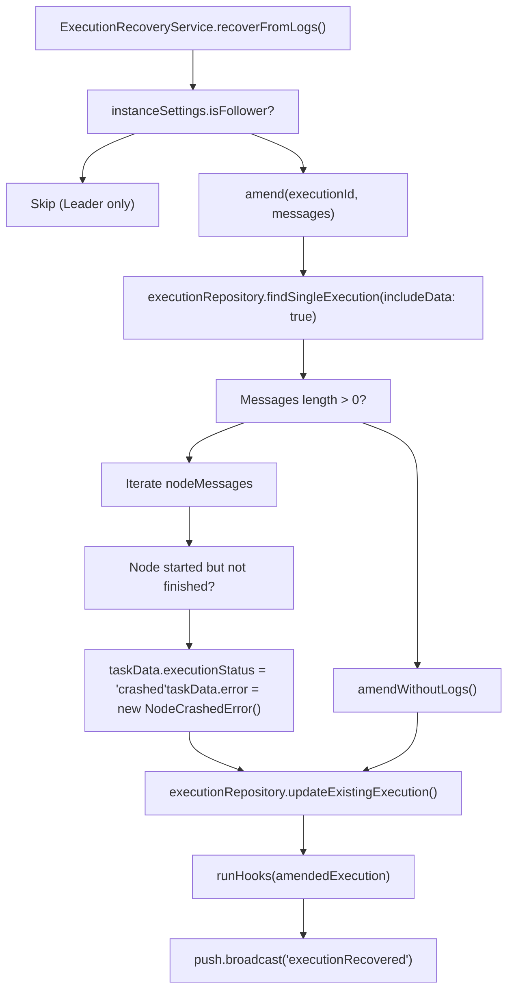
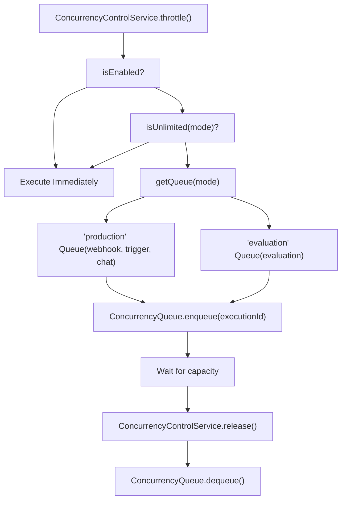
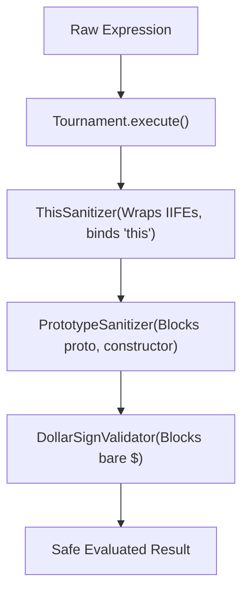

# 执行恢复与错误处理 (Execution Recovery and Error Handling)

相关源文件

-   [packages/@n8n/config/src/configs/executions.config.ts](https://github.com/n8n-io/n8n/blob/88f170b9/packages/@n8n/config/src/configs/executions.config.ts)
-   [packages/@n8n/db/src/entities/types-db.ts](https://github.com/n8n-io/n8n/blob/88f170b9/packages/@n8n/db/src/entities/types-db.ts)
-   [packages/@n8n/nodes-langchain/nodes/tools/ToolWorkflow/v2/methods/localResourceMapping.ts](https://github.com/n8n-io/n8n/blob/88f170b9/packages/@n8n/nodes-langchain/nodes/tools/ToolWorkflow/v2/methods/localResourceMapping.ts)
-   [packages/cli/src/concurrency/\_\_tests\_\_/concurrency-control.service.test.ts](https://github.com/n8n-io/n8n/blob/88f170b9/packages/cli/src/concurrency/__tests__/concurrency-control.service.test.ts)
-   [packages/cli/src/concurrency/\_\_tests\_\_/concurrency-queue.test.ts](https://github.com/n8n-io/n8n/blob/88f170b9/packages/cli/src/concurrency/__tests__/concurrency-queue.test.ts)
-   [packages/cli/src/concurrency/concurrency-control.service.ts](https://github.com/n8n-io/n8n/blob/88f170b9/packages/cli/src/concurrency/concurrency-control.service.ts)
-   [packages/cli/src/concurrency/concurrency-queue.ts](https://github.com/n8n-io/n8n/blob/88f170b9/packages/cli/src/concurrency/concurrency-queue.ts)
-   [packages/cli/src/errors/aborted-execution-retry.error.ts](https://github.com/n8n-io/n8n/blob/88f170b9/packages/cli/src/errors/aborted-execution-retry.error.ts)
-   [packages/cli/src/errors/missing-execution-stop.error.ts](https://github.com/n8n-io/n8n/blob/88f170b9/packages/cli/src/errors/missing-execution-stop.error.ts)
-   [packages/cli/src/eventbus/event-message-classes/event-message-node.ts](https://github.com/n8n-io/n8n/blob/88f170b9/packages/cli/src/eventbus/event-message-classes/event-message-node.ts)
-   [packages/cli/src/executions/\_\_tests\_\_/constants.ts](https://github.com/n8n-io/n8n/blob/88f170b9/packages/cli/src/executions/__tests__/constants.ts)
-   [packages/cli/src/executions/\_\_tests\_\_/execution.service.test.ts](https://github.com/n8n-io/n8n/blob/88f170b9/packages/cli/src/executions/__tests__/execution.service.test.ts)
-   [packages/cli/src/executions/\_\_tests\_\_/executions.controller.test.ts](https://github.com/n8n-io/n8n/blob/88f170b9/packages/cli/src/executions/__tests__/executions.controller.test.ts)
-   [packages/cli/src/executions/\_\_tests\_\_/utils.ts](https://github.com/n8n-io/n8n/blob/88f170b9/packages/cli/src/executions/__tests__/utils.ts)
-   [packages/cli/src/executions/execution-recovery.service.ts](https://github.com/n8n-io/n8n/blob/88f170b9/packages/cli/src/executions/execution-recovery.service.ts)
-   [packages/cli/src/executions/execution.service.ts](https://github.com/n8n-io/n8n/blob/88f170b9/packages/cli/src/executions/execution.service.ts)
-   [packages/cli/src/executions/execution.types.ts](https://github.com/n8n-io/n8n/blob/88f170b9/packages/cli/src/executions/execution.types.ts)
-   [packages/cli/src/executions/executions.controller.ts](https://github.com/n8n-io/n8n/blob/88f170b9/packages/cli/src/executions/executions.controller.ts)
-   [packages/cli/src/services/naming.service.ts](https://github.com/n8n-io/n8n/blob/88f170b9/packages/cli/src/services/naming.service.ts)
-   [packages/cli/test/integration/database/repositories/execution.repository.test.ts](https://github.com/n8n-io/n8n/blob/88f170b9/packages/cli/test/integration/database/repositories/execution.repository.test.ts)
-   [packages/cli/test/integration/execution.service.integration.test.ts](https://github.com/n8n-io/n8n/blob/88f170b9/packages/cli/test/integration/execution.service.integration.test.ts)
-   [packages/cli/test/shared/mocking.ts](https://github.com/n8n-io/n8n/blob/88f170b9/packages/cli/test/shared/mocking.ts)
-   [packages/core/src/execution-engine/node-execution-context/\_\_tests\_\_/local-load-options-context.test.ts](https://github.com/n8n-io/n8n/blob/88f170b9/packages/core/src/execution-engine/node-execution-context/__tests__/local-load-options-context.test.ts)
-   [packages/core/src/execution-engine/node-execution-context/local-load-options-context.ts](https://github.com/n8n-io/n8n/blob/88f170b9/packages/core/src/execution-engine/node-execution-context/local-load-options-context.ts)
-   [packages/frontend/editor-ui/src/features/execution/executions/components/ExecutionsFilter.test.ts](https://github.com/n8n-io/n8n/blob/88f170b9/packages/frontend/editor-ui/src/features/execution/executions/components/ExecutionsFilter.test.ts)
-   [packages/frontend/editor-ui/src/features/execution/executions/components/ExecutionsFilter.vue](https://github.com/n8n-io/n8n/blob/88f170b9/packages/frontend/editor-ui/src/features/execution/executions/components/ExecutionsFilter.vue)
-   [packages/frontend/editor-ui/src/features/execution/executions/components/workflow/WorkflowExecutionsSidebar.vue](https://github.com/n8n-io/n8n/blob/88f170b9/packages/frontend/editor-ui/src/features/execution/executions/components/workflow/WorkflowExecutionsSidebar.vue)
-   [packages/frontend/editor-ui/src/features/execution/executions/executions.types.ts](https://github.com/n8n-io/n8n/blob/88f170b9/packages/frontend/editor-ui/src/features/execution/executions/executions.types.ts)
-   [packages/frontend/editor-ui/src/features/execution/executions/executions.utils.test.ts](https://github.com/n8n-io/n8n/blob/88f170b9/packages/frontend/editor-ui/src/features/execution/executions/executions.utils.test.ts)
-   [packages/frontend/editor-ui/src/features/execution/executions/executions.utils.ts](https://github.com/n8n-io/n8n/blob/88f170b9/packages/frontend/editor-ui/src/features/execution/executions/executions.utils.ts)
-   [packages/nodes-base/nodes/ExecuteWorkflow/ExecuteWorkflow/ExecuteWorkflow.node.json](https://github.com/n8n-io/n8n/blob/88f170b9/packages/nodes-base/nodes/ExecuteWorkflow/ExecuteWorkflow/ExecuteWorkflow.node.json)
-   [packages/nodes-base/nodes/ExecuteWorkflow/ExecuteWorkflow/ExecuteWorkflow.node.test.ts](https://github.com/n8n-io/n8n/blob/88f170b9/packages/nodes-base/nodes/ExecuteWorkflow/ExecuteWorkflow/ExecuteWorkflow.node.test.ts)
-   [packages/nodes-base/nodes/ExecuteWorkflow/ExecuteWorkflow/ExecuteWorkflow.node.ts](https://github.com/n8n-io/n8n/blob/88f170b9/packages/nodes-base/nodes/ExecuteWorkflow/ExecuteWorkflow/ExecuteWorkflow.node.ts)
-   [packages/nodes-base/nodes/ExecuteWorkflow/ExecuteWorkflow/methods/localResourceMapping.ts](https://github.com/n8n-io/n8n/blob/88f170b9/packages/nodes-base/nodes/ExecuteWorkflow/ExecuteWorkflow/methods/localResourceMapping.ts)
-   [packages/nodes-base/nodes/ExecuteWorkflow/ExecuteWorkflowTrigger/ExecuteWorkflowTrigger.node.test.ts](https://github.com/n8n-io/n8n/blob/88f170b9/packages/nodes-base/nodes/ExecuteWorkflow/ExecuteWorkflowTrigger/ExecuteWorkflowTrigger.node.test.ts)
-   [packages/nodes-base/nodes/ExecuteWorkflow/ExecuteWorkflowTrigger/ExecuteWorkflowTrigger.node.ts](https://github.com/n8n-io/n8n/blob/88f170b9/packages/nodes-base/nodes/ExecuteWorkflow/ExecuteWorkflowTrigger/ExecuteWorkflowTrigger.node.ts)
-   [packages/nodes-base/nodes/StopAndError/test/node/StopAndError.test.ts](https://github.com/n8n-io/n8n/blob/88f170b9/packages/nodes-base/nodes/StopAndError/test/node/StopAndError.test.ts)
-   [packages/nodes-base/utils/workflow-backtracking.test.ts](https://github.com/n8n-io/n8n/blob/88f170b9/packages/nodes-base/utils/workflow-backtracking.test.ts)
-   [packages/nodes-base/utils/workflow-backtracking.ts](https://github.com/n8n-io/n8n/blob/88f170b9/packages/nodes-base/utils/workflow-backtracking.ts)
-   [packages/nodes-base/utils/workflowInputsResourceMapping/GenericFunctions.ts](https://github.com/n8n-io/n8n/blob/88f170b9/packages/nodes-base/utils/workflowInputsResourceMapping/GenericFunctions.ts)
-   [packages/nodes-base/utils/workflowInputsResourceMapping/\_\_tests\_\_/GenericFunctions.test.ts](https://github.com/n8n-io/n8n/blob/88f170b9/packages/nodes-base/utils/workflowInputsResourceMapping/__tests__/GenericFunctions.test.ts)
-   [packages/workflow/src/errors/abstract/execution-base.error.ts](https://github.com/n8n-io/n8n/blob/88f170b9/packages/workflow/src/errors/abstract/execution-base.error.ts)
-   [packages/workflow/src/errors/abstract/node.error.ts](https://github.com/n8n-io/n8n/blob/88f170b9/packages/workflow/src/errors/abstract/node.error.ts)
-   [packages/workflow/src/errors/base/base.error.ts](https://github.com/n8n-io/n8n/blob/88f170b9/packages/workflow/src/errors/base/base.error.ts)
-   [packages/workflow/src/errors/base/operational.error.ts](https://github.com/n8n-io/n8n/blob/88f170b9/packages/workflow/src/errors/base/operational.error.ts)
-   [packages/workflow/src/errors/base/unexpected.error.ts](https://github.com/n8n-io/n8n/blob/88f170b9/packages/workflow/src/errors/base/unexpected.error.ts)
-   [packages/workflow/src/errors/base/user.error.ts](https://github.com/n8n-io/n8n/blob/88f170b9/packages/workflow/src/errors/base/user.error.ts)
-   [packages/workflow/src/errors/execution-cancelled.error.ts](https://github.com/n8n-io/n8n/blob/88f170b9/packages/workflow/src/errors/execution-cancelled.error.ts)
-   [packages/workflow/src/errors/expression-destructuring.error.ts](https://github.com/n8n-io/n8n/blob/88f170b9/packages/workflow/src/errors/expression-destructuring.error.ts)
-   [packages/workflow/src/errors/expression-reserved-variable.error.ts](https://github.com/n8n-io/n8n/blob/88f170b9/packages/workflow/src/errors/expression-reserved-variable.error.ts)
-   [packages/workflow/src/errors/expression-with-statement.error.ts](https://github.com/n8n-io/n8n/blob/88f170b9/packages/workflow/src/errors/expression-with-statement.error.ts)
-   [packages/workflow/src/errors/index.ts](https://github.com/n8n-io/n8n/blob/88f170b9/packages/workflow/src/errors/index.ts)
-   [packages/workflow/src/errors/node-api.error.ts](https://github.com/n8n-io/n8n/blob/88f170b9/packages/workflow/src/errors/node-api.error.ts)
-   [packages/workflow/src/errors/node-operation.error.ts](https://github.com/n8n-io/n8n/blob/88f170b9/packages/workflow/src/errors/node-operation.error.ts)
-   [packages/workflow/src/errors/subworkflow-operation.error.ts](https://github.com/n8n-io/n8n/blob/88f170b9/packages/workflow/src/errors/subworkflow-operation.error.ts)
-   [packages/workflow/src/errors/trigger-close.error.ts](https://github.com/n8n-io/n8n/blob/88f170b9/packages/workflow/src/errors/trigger-close.error.ts)
-   [packages/workflow/src/errors/workflow-operation.error.ts](https://github.com/n8n-io/n8n/blob/88f170b9/packages/workflow/src/errors/workflow-operation.error.ts)
-   [packages/workflow/src/expression-evaluator-proxy.ts](https://github.com/n8n-io/n8n/blob/88f170b9/packages/workflow/src/expression-evaluator-proxy.ts)
-   [packages/workflow/src/expression-sandboxing.ts](https://github.com/n8n-io/n8n/blob/88f170b9/packages/workflow/src/expression-sandboxing.ts)
-   [packages/workflow/src/extensions/expression-extension.ts](https://github.com/n8n-io/n8n/blob/88f170b9/packages/workflow/src/extensions/expression-extension.ts)
-   [packages/workflow/test/errors/base/operational.error.test.ts](https://github.com/n8n-io/n8n/blob/88f170b9/packages/workflow/test/errors/base/operational.error.test.ts)
-   [packages/workflow/test/errors/base/unexpected.error.test.ts](https://github.com/n8n-io/n8n/blob/88f170b9/packages/workflow/test/errors/base/unexpected.error.test.ts)
-   [packages/workflow/test/errors/base/user.error.test.ts](https://github.com/n8n-io/n8n/blob/88f170b9/packages/workflow/test/errors/base/user.error.test.ts)
-   [packages/workflow/test/errors/node.error.test.ts](https://github.com/n8n-io/n8n/blob/88f170b9/packages/workflow/test/errors/node.error.test.ts)
-   [packages/workflow/test/expression-sandboxing.test.ts](https://github.com/n8n-io/n8n/blob/88f170b9/packages/workflow/test/expression-sandboxing.test.ts)
-   [packages/workflow/test/node-errors.test.ts](https://github.com/n8n-io/n8n/blob/88f170b9/packages/workflow/test/node-errors.test.ts)

本文档解释了 n8n 如何处理执行失败、崩溃以及恢复方案。有关完整的执行生命周期，请参阅 [工作流执行生命周期 (Workflow Execution Lifecycle)](/n8n-io/n8n/2.1-workflow-execution-lifecycle)。有关分布式执行，请参阅 [分布式执行与扩展 (Distributed Execution and Scaling)](/n8n-io/n8n/2.2-distributed-execution-and-scaling)。

## 概览

n8n 的错误处理和恢复系统通过多种机制提供弹性：

-   **Crash Recovery (崩溃恢复)**: 通过 `ExecutionRecoveryService` 检测并标记因 Worker/进程失败而崩溃的执行。
-   **Error Workflows (错误处理工作流)**: 当一个执行失败时，自动执行一个单独的工作流。
-   **Auto-deactivation (自动停用)**: 停用那些反复崩溃的工作流，以防止级联故障。
-   **Concurrency Control (并发控制)**: 管理执行吞吐量，并通过 `ConcurrencyControlService` 处理节流的执行。
-   **Wait Tracking (等待追踪)**: 通过 `WaitTracker` 恢复在 Wait 节点暂停的执行。
-   **Node Error Hierarchy (节点错误层级)**: 为特定的失败模式（API、验证、连接）建立结构化的错误类。

数据源: [packages/cli/src/executions/execution-recovery.service.ts32-43](https://github.com/n8n-io/n8n/blob/88f170b9/packages/cli/src/executions/execution-recovery.service.ts#L32-L43) [packages/cli/src/concurrency/concurrency-control.service.ts26-43](https://github.com/n8n-io/n8n/blob/88f170b9/packages/cli/src/concurrency/concurrency-control.service.ts#L26-L43) [packages/workflow/src/errors/index.ts1-36](https://github.com/n8n-io/n8n/blob/88f170b9/packages/workflow/src/errors/index.ts#L1-L36)

## 执行崩溃恢复 (Execution Crash Recovery)

### 崩溃检测与标记

当执行崩溃时（进程停止、Worker 被杀死等），n8n 会通过 `ExecutionRecoveryService` 检测并标记它。该服务利用事件日志重建发生的状况。

**图表: ExecutionRecoveryService 逻辑**

数据源: [packages/cli/src/executions/execution-recovery.service.ts98-120](https://github.com/n8n-io/n8n/blob/88f170b9/packages/cli/src/executions/execution-recovery.service.ts#L98-L120) [packages/cli/src/executions/execution-recovery.service.ts128-201](https://github.com/n8n-io/n8n/blob/88f170b9/packages/cli/src/executions/execution-recovery.service.ts#L128-L201)

### 工作流自动停用 (Workflow Auto-deactivation)

为了防止重复崩溃，n8n 会自动停用那些持续失败的工作流。这由 `autoDeactivateWorkflowsIfNeeded` 处理。

1.  **Threshold Check (阈值检查)**: 它检索最后 $N$ 次执行（由 `executions.recovery.maxLastExecutions` 定义）。
2.  **Crash Counting (崩溃计数)**: 如果最后 $N$ 次执行的状态全部为 `crashed` (已崩溃)，则该工作流成为目标。
3.  **Deactivation (停用)**: 调用 `workflowRepository.updateActiveState(workflowId, false)`。
4.  **Notification (通知)**: `UserManagementMailer` 向项目所有者或管理员发送 `notifyWorkflowAutodeactivated` 电子邮件。

数据源: [packages/cli/src/executions/execution-recovery.service.ts45-93](https://github.com/n8n-io/n8n/blob/88f170b9/packages/cli/src/executions/execution-recovery.service.ts#L45-L93) [packages/cli/src/executions/execution-recovery.service.ts177-208](https://github.com/n8n-io/n8n/blob/88f170b9/packages/cli/src/executions/execution-recovery.service.ts#L177-L208)

## 并发与节流 (Concurrency and Throttling)

`ConcurrencyControlService` 通过根据执行模式（生产 vs 评估）限制并发执行的数量，防止系统过载。

**图表: 并发控制流程**

数据源: [packages/cli/src/concurrency/concurrency-control.service.ts121-125](https://github.com/n8n-io/n8n/blob/88f170b9/packages/cli/src/concurrency/concurrency-control.service.ts#L121-L125) [packages/cli/src/concurrency/concurrency-control.service.ts202-222](https://github.com/n8n-io/n8n/blob/88f170b9/packages/cli/src/concurrency/concurrency-control.service.ts#L202-L222)

## 节点错误层级 (Node Error Hierarchy)

n8n 在 `n8n-workflow` 中使用结构化的错误层级，以提供描述性反馈并处理不同的失败模式。

### 关键错误类

| 类名 | 用途 | 文件引用 |
| --- | --- | --- |
| `NodeError` | 所有节点相关错误的抽象基类。 | [packages/workflow/src/errors/abstract/node.error.ts](https://github.com/n8n-io/n8n/blob/88f170b9/packages/workflow/src/errors/abstract/node.error.ts) |
| `NodeOperationError` | 节点执行期间发生的错误（例如：参数无效）。 | [packages/workflow/src/errors/node-operation.error.ts](https://github.com/n8n-io/n8n/blob/88f170b9/packages/workflow/src/errors/node-operation.error.ts) |
| `NodeApiError` | 来自外部 API 的错误（包含 HTTP 状态码）。 | [packages/workflow/src/errors/node-api.error.ts](https://github.com/n8n-io/n8n/blob/88f170b9/packages/workflow/src/errors/node-api.error.ts) |
| `ExpressionError` | 表达式评估期间的错误。 | [packages/workflow/src/errors/expression.error.ts](https://github.com/n8n-io/n8n/blob/88f170b9/packages/workflow/src/errors/expression.error.ts) |
| `ExecutionCancelledError` | 当手动停止执行或执行超时时抛出。 | [packages/workflow/src/errors/execution-cancelled.error.ts](https://github.com/n8n-io/n8n/blob/88f170b9/packages/workflow/src/errors/execution-cancelled.error.ts) |

### 描述性错误映射

`NodeError` 类包含一个 `COMMON_ERRORS` 映射，它将底层的 Node.js 系统错误翻译为人读的消息：

-   `ECONNREFUSED`: "服务拒绝连接 - 可能已离线 (The service refused the connection - perhaps it is offline)"
-   `ENOTFOUND`: "无法建立连接...主机值不正确 (The connection cannot be established... incorrect host value)"
-   `ETIMEDOUT`: "连接超时... (The connection timed out...)"

数据源: [packages/workflow/src/errors/abstract/node.error.ts8-31](https://github.com/n8n-io/n8n/blob/88f170b9/packages/workflow/src/errors/abstract/node.error.ts#L8-L31) [packages/workflow/src/errors/node-operation.error.ts9-16](https://github.com/n8n-io/n8n/blob/88f170b9/packages/workflow/src/errors/node-operation.error.ts#L9-L16)

## 表达式沙箱与安全 (Expression Sandboxing and Security)

在执行期间，表达式在沙箱中进行评估。`ThisSanitizer` 和 `PrototypeSanitizer` 防止恶意表达式逃逸沙箱或访问 Node.js 的 `process` 或 `global` 对象。

**图表: 表达式清理 (Expression Sanitization)**

数据源: [packages/workflow/src/expression-sandboxing.ts137-210](https://github.com/n8n-io/n8n/blob/88f170b9/packages/workflow/src/expression-sandboxing.ts#L137-L210) [packages/workflow/test/expression-sandboxing.test.ts32-132](https://github.com/n8n-io/n8n/blob/88f170b9/packages/workflow/test/expression-sandboxing.test.ts#L32-L132)

## 等待追踪与恢复 (Wait Tracking and Resumption)

`WaitTracker` 服务（仅领导者）管理处于 `waiting` (等待) 状态的执行。

1.  **Initialization (初始化)**: 启动时，它在数据库中查询所有 `status = 'waiting'` 且设置了 `waitTill` 的执行。
2.  **Timer Management (定时器管理)**: 它根据 `waitTill` 时间戳为每个执行设置 `setTimeout`。
3.  **Resumption (恢复)**: 当定时器到期时，它会：
    -   验证执行是否仍处于 `waiting` 状态。
    -   更新状态为 `running` (运行中)。
    -   调用 `workflowRunner.run()` 来恢复处理。

数据源: [packages/cli/src/wait-tracker.ts42-149](https://github.com/n8n-io/n8n/blob/88f170b9/packages/cli/src/wait-tracker.ts#L42-L149)

## 执行服务操作 (Execution Service Operations)

`ExecutionService` 提供了管理执行数据的业务逻辑，包括重试和脱敏。

-   **Retry (重试)**: `retry()` 函数获取失败执行的未扁平化数据，创建一个 `retryOf` 字段已设置的新执行记录，并触发 `workflowRunner`。
-   **Redaction (脱敏)**: 在通过 API 返回执行数据之前，`ExecutionRedactionServiceProxy` 会处理数据，根据用户权限移除敏感信息。

数据源: [packages/cli/src/executions/execution.service.ts200-264](https://github.com/n8n-io/n8n/blob/88f170b9/packages/cli/src/executions/execution.service.ts#L200-L264) [packages/cli/src/executions/execution.service.ts127-167](https://github.com/n8n-io/n8n/blob/88f170b9/packages/cli/src/executions/execution.service.ts#L127-L167)
